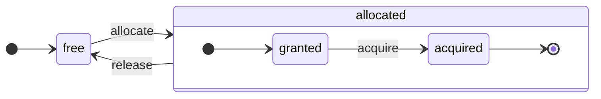

# アーキテクチャ概要 {#architecture-overview}

ClickHouse は真のカラム指向 DBMS です。データはカラム単位で保存され、クエリ実行時には配列（カラムのベクターまたはチャンク）単位で処理されます。
可能な限り、個々の値ではなく配列に対して演算が行われます。
これは「ベクトル化クエリ実行」と呼ばれ、実際のデータ処理コストの削減に役立ちます。

このアイデア自体は新しいものではありません。
その起源は `APL`（A Programming Language, 1957）およびその派生である `A +`（APL 方言）、`J`（1990）、`K`（1993）、`Q`（Kx Systems によるプログラミング言語, 2003）にさかのぼります。
配列プログラミングは科学的なデータ処理で利用されています。また、リレーショナルデータベースにおいても決して新しいアイデアではありません。たとえば、この方式は `VectorWise` システム（Actian Corporation による Actian Vector Analytic Database としても知られる）で利用されています。

クエリ処理を高速化する手法としては、ベクトル化クエリ実行とランタイムコード生成の 2 つのアプローチがあります。後者はすべての間接参照と動的ディスパッチを排除します。どちらの手法も、一方が他方より常に優れているというわけではありません。多くの演算を一体化して CPU の実行ユニットやパイプラインを完全に活用できる場合、ランタイムコード生成の方が有利になることがあります。ベクトル化クエリ実行は、一時的なベクターをキャッシュに書き込み、再度読み出す必要があるため、実用性が低くなる場合があります。一時データが L2 キャッシュに収まりきらない場合、これは問題となります。一方で、ベクトル化クエリ実行は CPU の SIMD 機能をより容易に活用できます。私たちの協力者による [研究論文](http://15721.courses.cs.cmu.edu/spring2016/papers/p5-sompolski.pdf) では、両方の手法を組み合わせるのがより良いことが示されています。ClickHouse はベクトル化クエリ実行を採用しており、ランタイムコード生成については初期的な限定サポートを備えています。

## Columns {#columns}

`IColumn` インターフェイスは、メモリ上のカラム（実際にはカラムのチャンク）を表現するために使用されます。このインターフェイスは、さまざまなリレーショナルオペレーターを実装するための補助メソッドを提供します。ほとんどすべての操作はイミュータブルであり、元のカラムを変更せずに、新しく変更済みのカラムを作成します。たとえば、`IColumn::filter` メソッドはフィルタ用のバイトマスクを受け取ります。これはリレーショナルオペレーターである `WHERE` および `HAVING` に使用されます。他の例としては、`ORDER BY` をサポートするための `IColumn::permute` メソッド、`LIMIT` をサポートするための `IColumn::cut` メソッドがあります。

さまざまな `IColumn` 実装（`ColumnUInt8`、`ColumnString` など）は、カラムのメモリレイアウトを管理します。メモリレイアウトは通常、連続した配列です。整数型のカラムでは、`std::vector` のような 1 つの連続した配列になります。`String` および `Array` カラムでは、2 つのベクタから構成されます。1 つはすべての配列要素を連続して格納するもので、もう 1 つは各配列の先頭位置へのオフセットを格納するものです。また、メモリ上には 1 つの値だけを保持しながら、見かけ上はカラムのように振る舞う `ColumnConst` も存在します。

## Field {#field}

とはいえ、個々の値を扱うことも可能です。個々の値を表現するために `Field` が使用されます。`Field` は `UInt64`、`Int64`、`Float64`、`String`、`Array` からなる判別共用体にすぎません。`IColumn` には、n 番目の値を `Field` として取得するための `operator []` メソッドと、列の末尾に `Field` を追加するための `insert` メソッドがあります。これらのメソッドは、個々の値を表す一時的な `Field` オブジェクトを扱う必要があるため、それほど効率的ではありません。より効率的なメソッドとして、`insertFrom`、`insertRangeFrom` などがあります。

`Field` は、テーブルの特定のデータ型に関する十分な情報を保持していません。たとえば、`UInt8`、`UInt16`、`UInt32`、`UInt64` は、`Field` の中ではすべて `UInt64` として表現されます。

## リーキーな抽象化 {#leaky-abstractions}

`IColumn` には、データに対する一般的なリレーショナル変換のためのメソッドがありますが、それだけではすべてのニーズを満たしません。たとえば、`ColumnUInt64` には 2 つのカラムの合計を計算するメソッドがなく、`ColumnString` には部分文字列検索を実行するメソッドがありません。こうした無数のルーチンは `IColumn` の外側で実装されています。

カラムに対するさまざまな関数は、`IColumn` のメソッドを用いて `Field` 値を取り出す、汎用的だが非効率な方法、あるいは特定の `IColumn` 実装におけるデータの内部メモリレイアウトの知識を用いた、より特化した方法で実装できます。後者は、関数を特定の `IColumn` 型にキャストし、内部表現を直接扱うことで実現されています。たとえば、`ColumnUInt64` には内部配列への参照を返す `getData` メソッドがあり、別のルーチンがその配列を直接読み書きします。さまざまなルーチンを効率的に特化実装できるように、このような「リーキーな抽象化」が用意されています。

## データ型 {#data_types}

`IDataType` はシリアライズおよびデシリアライズを担当します。これは、列のチャンクや個々の値をバイナリ形式またはテキスト形式で読み書きするためのものです。`IDataType` はテーブル内のデータ型に直接対応します。例えば、`DataTypeUInt32`、`DataTypeDateTime`、`DataTypeString` などがあります。

`IDataType` と `IColumn` の関係は疎結合です。異なるデータ型が、同じ `IColumn` 実装によってメモリ上で表現される場合があります。例えば、`DataTypeUInt32` と `DataTypeDateTime` はどちらも `ColumnUInt32` または `ColumnConstUInt32` によって表現されます。さらに、同じデータ型が異なる `IColumn` 実装によって表現される場合もあります。例えば、`DataTypeUInt8` は `ColumnUInt8` または `ColumnConstUInt8` によって表現できます。

`IDataType` はメタデータのみを保持します。例えば、`DataTypeUInt8` は（仮想ポインタ `vptr` を除いて）何も保持せず、`DataTypeFixedString` は固定長文字列のサイズである `N` だけを保持します。

`IDataType` にはさまざまなデータフォーマット向けのヘルパーメソッドがあります。例えば、値を必要に応じてクオート付きでシリアライズするメソッド、値を JSON 用にシリアライズするメソッド、XML フォーマットの一部として値をシリアライズするメソッドなどがあります。データフォーマットとの間に 1 対 1 の対応関係はありません。例えば、異なるデータフォーマットである `Pretty` と `TabSeparated` は、どちらも `IDataType` インターフェイスの同じヘルパーメソッド `serializeTextEscaped` を使用できます。

## ブロック {#block}

`Block` は、メモリ上のテーブルの一部分（チャンク）を表すコンテナです。`(IColumn, IDataType, column name)` という三つ組の集合にすぎません。クエリ実行中、データは `Block` 単位で処理されます。`Block` があれば、データ本体（`IColumn` オブジェクト内）と、その列をどのように扱うかを示す型情報（`IDataType` 内）、および列名を保持していることになります。列名は、テーブルの元の列名である場合もあれば、計算の一時的な結果を得るために割り当てられた人工的な名前である場合もあります。

ブロック内の列に対して何らかの関数を計算する場合、その結果を表す別の列をブロックに追加し、演算がイミュータブルであるため、関数の引数となる列は変更しません。後で不要になった列はブロックから削除できますが、内容を変更することはありません。これは共通部分式の除去に便利です。

ブロックは、処理される各データチャンクごとに作成されます。同じ種類の計算に対しては、異なるブロック間であっても列名と型は同一であり、変わるのは列データだけであることに注意してください。ブロックサイズが小さい場合は、shared_ptr や列名をコピーするための一時文字列のオーバーヘッドが大きくなるため、ブロックデータをブロックヘッダから分離するのが望ましいです。

## プロセッサ {#processors}

説明は [https://github.com/ClickHouse/ClickHouse/blob/master/src/Processors/IProcessor.h](https://github.com/ClickHouse/ClickHouse/blob/master/src/Processors/IProcessor.h) を参照してください。

## フォーマット {#formats}

データフォーマットはプロセッサーによって実装されます。

## I/O {#io}

バイト指向の入出力には、`ReadBuffer` と `WriteBuffer` という抽象クラスがあります。これらは C++ の `iostream` の代わりに使用されます。心配はいりません。成熟した C++ プロジェクトの多くは、もっともな理由から `iostream` 以外の手段を使用しています。

`ReadBuffer` と `WriteBuffer` は、本質的には連続したバッファと、そのバッファ内の位置を指すカーソルにすぎません。実装側がそのバッファ用のメモリを所有していても、所有していなくても構いません。`ReadBuffer` では次のデータでバッファを埋め、`WriteBuffer` ではバッファをどこかにフラッシュするための仮想メソッドが用意されていますが、これらの仮想メソッドが呼ばれることはほとんどありません。

`ReadBuffer` / `WriteBuffer` の実装は、ファイルやファイルディスクリプタ、ネットワークソケットの操作、圧縮処理（`CompressedWriteBuffer` は別の WriteBuffer で初期化され、その WriteBuffer に書き込む前に圧縮を行います）、およびその他の用途に使用されます。`ConcatReadBuffer`、`LimitReadBuffer`、`HashingWriteBuffer` といった名前を見れば、用途はおおよそ想像できるでしょう。

Read/WriteBuffer はバイトのみを扱います。入出力のフォーマット処理を支援するため、`ReadHelpers` と `WriteHelpers` ヘッダファイル内に補助関数が用意されています。たとえば、数値を 10 進数形式で書き出すためのヘルパーがあります。

`JSON` 形式の結果セットを標準出力に書き出したいときに何が起こるかを見てみましょう。
プル型の `QueryPipeline` からフェッチできる状態の結果セットがあるとします。
まず、標準出力にバイトを書き込むために、`WriteBufferFromFileDescriptor(STDOUT_FILENO)` を作成します。
次に、クエリパイプラインの結果を `JSONRowOutputFormat` に接続します。これはその `WriteBuffer` で初期化され、行を `JSON` 形式で標準出力に書き出します。
これは、プル型の `QueryPipeline` を完了した `QueryPipeline` に変換する `complete` メソッドによって実行できます。
内部では、`JSONRowOutputFormat` がさまざまな JSON の区切り記号を書き込み、`IColumn` への参照と行番号を引数として `IDataType::serializeTextJSON` メソッドを呼び出します。その結果、`IDataType::serializeTextJSON` は `WriteHelpers.h` 内のメソッド、たとえば数値型に対しては `writeText`、`DataTypeString` に対しては `writeJSONString` を呼び出します。

## テーブル {#tables}

`IStorage` インターフェイスはテーブルを表します。このインターフェイスのさまざまな実装が、それぞれ異なるテーブルエンジンです。例としては `StorageMergeTree`、`StorageMemory` などがあります。これらのクラスのインスタンスがテーブルそのものです。

`IStorage` における主要なメソッドは `read` と `write` であり、そのほかにも `alter`、`rename`、`drop` などがあります。`read` メソッドは、テーブルから読み取るカラムの集合、考慮すべき `AST` クエリ、および希望するストリーム数を引数として受け取ります。戻り値は `Pipe` です。

ほとんどの場合、`read` メソッドの責務は、指定されたカラムをテーブルから読み取ることに限られ、それ以降のデータ処理は行いません。
その後のすべてのデータ処理は、パイプラインの別の部分で処理され、`IStorage` の責務範囲外となります。

ただし、顕著な例外があります。

- AST クエリは `read` メソッドに渡され、テーブルエンジンはそれを利用してインデックスの利用可否を判断し、テーブルから読み取るデータ量を減らすことができます。
- 場合によっては、テーブルエンジン自体が特定の段階までデータを処理できることがあります。たとえば、`StorageDistributed` はクエリをリモートサーバーに送信し、異なるリモートサーバーからのデータをマージできる段階まで処理するよう依頼し、その前処理済みデータを返すことができます。その後、クエリインタープリタがデータ処理を完了させます。

テーブルの `read` メソッドは、複数の `Processor` から成る `Pipe` を返すことができます。これらの `Processor` は、テーブルから並列に読み取ることができます。
次に、これらの `Processor` を、式の評価やフィルタ処理などのさまざまな変換に接続できます。これらは独立して計算可能です。
そして、それらの上に `QueryPipeline` を作成し、`PipelineExecutor` を通じて実行します。

`TableFunction` も存在します。これは、クエリの `FROM` 句で使用する一時的な `IStorage` オブジェクトを返す関数です。

自分のテーブルエンジンをどのように実装するかを手早く把握したい場合は、`StorageMemory` や `StorageTinyLog` のような単純なものを参照してください。

> `read` メソッドの結果として、`IStorage` は `QueryProcessingStage` を返します。これは、クエリのどの部分がすでにストレージ内部で計算されているかに関する情報です。

## パーサー {#parsers}

手書き実装の再帰下降パーサーによってクエリを解析します。たとえば、`ParserSelectQuery` はクエリのさまざまな部分に対して下位のパーサーを再帰的に呼び出します。パーサーは `AST` を作成します。`AST` はノードによって表現され、各ノードは `IAST` のインスタンスです。

> 歴史的経緯により、パーサージェネレーターは使用していません。

## インタープリタ {#interpreters}

インタープリタは、AST からクエリ実行パイプラインを構築する役割を担います。`InterpreterExistsQuery` や `InterpreterDropQuery` のようなシンプルなインタープリタに加えて、より高度な `InterpreterSelectQuery` があります。

クエリ実行パイプラインは、チャンク（特定の型を持つカラムの集合）を消費および生成できるプロセッサの組み合わせです。
プロセッサはポートを介して通信し、複数の入力ポートと複数の出力ポートを持つことができます。
より詳細な説明は [src/Processors/IProcessor.h](https://github.com/ClickHouse/ClickHouse/blob/master/src/Processors/IProcessor.h) にあります。

たとえば、`SELECT` クエリの解釈結果は「プル型」の `QueryPipeline` であり、結果セットを読み出すための専用の出力ポートを持ちます。
`INSERT` クエリの解釈結果は「プッシュ型」の `QueryPipeline` であり、挿入するデータを書き込むための入力ポートを持ちます。
そして `INSERT SELECT` クエリの解釈結果は「完結型」の `QueryPipeline` であり、入力も出力も持ちませんが、`SELECT` から `INSERT` へ同時にデータをコピーします。

`InterpreterSelectQuery` は、クエリの解析と変換のために `ExpressionAnalyzer` と `ExpressionActions` の仕組みを使用します。ここでルールベースのクエリ最適化の大部分が行われます。`ExpressionAnalyzer` はかなり込み入っており、書き直すべきです。さまざまなクエリ変換や最適化を別個のクラスに切り出し、クエリをモジュール化して変換できるようにする必要があります。

インタープリタに存在する問題に対処するため、新しく `InterpreterSelectQueryAnalyzer` が開発されました。これは `InterpreterSelectQuery` の新バージョンであり、`ExpressionAnalyzer` を使用せず、`AST` と `QueryPipeline` の間に `QueryTree` と呼ばれる追加の抽象化レイヤーを導入します。本番環境でそのまま使用可能な状態ですが、念のため、`enable_analyzer` 設定の値を `false` に設定することで無効化することもできます。

## 関数 {#functions}

関数には通常の関数と集約関数があります。集約関数については次のセクションを参照してください。

通常の関数は行数を変更せず、各行を独立して処理しているかのように動作します。実際には、関数は個々の行に対して呼び出されるのではなく、ベクトル化されたクエリ実行を実現するために `Block` 単位のデータに対して呼び出されます。

[blockSize](/sql-reference/functions/other-functions#blockSize)、[rowNumberInBlock](/sql-reference/functions/other-functions#rowNumberInBlock)、[runningAccumulate](/sql-reference/functions/other-functions#runningAccumulate) のように、ブロック処理を活用し、行間の独立性を破るその他の関数もいくつか存在します。

ClickHouse は強い型付けを採用しているため、暗黙の型変換は行われません。関数が特定の型の組み合わせをサポートしていない場合、例外がスローされます。一方で、関数は多くの異なる型の組み合わせに対して動作（オーバーロード）させることができます。例えば、`plus` 関数（`+` 演算子を実装する関数）は、任意の数値型の組み合わせ、`UInt8` + `Float32`、`UInt16` + `Int8` などに対して動作します。また、`concat` 関数のように任意個数の引数を受け取れる可変長引数関数もあります。

関数の実装は、サポートするデータ型およびサポートする `IColumns` を明示的にディスパッチする必要があるため、やや扱いにくい場合があります。例えば、`plus` 関数は、各数値型の組み合わせと、左辺および右辺が定数か非定数かの組み合わせごとに、C++ テンプレートのインスタンシエーションによって生成されたコードを持ちます。

この部分は、テンプレートコードの肥大化を避けるためにランタイムコード生成を実装するのに非常に適した箇所です。また、fused multiply-add のような融合関数を追加したり、1 回のループ反復で複数の比較を行ったりすることも可能になります。

ベクトル化されたクエリ実行により、関数はショートサーキットされません。例えば、`WHERE f(x) AND g(y)` と記述した場合、`f(x)` が 0 である行（`f(x)` が 0 の定数式である場合を除く）であっても、両方の側が計算されます。しかし、`f(x)` の条件の選択性が高く、`f(x)` の計算コストが `g(y)` よりもはるかに小さい場合は、マルチパスでの計算を実装した方がよいでしょう。まず `f(x)` を計算してから、その結果で列をフィルタリングし、その後、より小さくフィルタリングされたデータチャンクに対してのみ `g(y)` を計算します。

## 集約関数 {#aggregate-functions}

集約関数はステートフルな関数です。渡された値をある状態に蓄積し、その状態から結果を取得できるようにします。これらは `IAggregateFunction` インターフェースによって管理されます。状態はかなり単純なもの（`AggregateFunctionCount` の状態は単一の `UInt64` 値だけ）から、かなり複雑なもの（`AggregateFunctionUniqCombined` の状態は線形配列、ハッシュテーブル、`HyperLogLog` 型の確率的データ構造の組み合わせ）まであります。

状態は `Arena`（メモリプール）内に割り当てられ、高カーディナリティな `GROUP BY` クエリを実行する際に複数の状態を扱えるようにします。状態は複雑なコンストラクタやデストラクタを持つ場合があります。たとえば、複雑な集約状態は内部で追加のメモリを確保することがあります。そのため、状態の作成と破棄、所有権と破棄順序の適切な受け渡しには注意が必要です。

集約状態はシリアライズおよびデシリアライズして、分散クエリ実行中にネットワーク経由で受け渡したり、RAM が不足している場合にディスクへ書き出したりできます。`DataTypeAggregateFunction` を使ってテーブルに保存し、データのインクリメンタル集約を実現することも可能です。

> 集約関数状態のシリアライズされたデータ形式は、現時点ではバージョン管理されていません。集約状態が一時的にしか保存されないのであれば問題ありません。しかし、インクリメンタル集約のための `AggregatingMergeTree` テーブルエンジンがあり、すでに本番環境で利用されています。そのため、将来いずれかの集約関数のシリアライズ形式を変更する場合には、後方互換性が必須になります。

## サーバー {#server}

サーバーはいくつかのインターフェースを実装しています。

- 外部クライアント向けの HTTP インターフェース。
- ネイティブな ClickHouse クライアントおよび分散クエリ実行時のサーバー間通信向けの TCP インターフェース。
- レプリケーション用にデータを転送するためのインターフェース。

内部的には、コルーチンやファイバーを持たない単純なマルチスレッドサーバーに過ぎません。サーバーは、高頻度の単純なクエリを処理するようには設計されておらず、比較的低頻度の複雑なクエリを処理し、それぞれが分析用途で非常に大量のデータを処理できるように設計されています。

サーバーは、クエリ実行に必要な環境を表す `Context` クラスを初期化します。これには、利用可能なデータベースの一覧、ユーザーとアクセス権、設定、クラスター、プロセスリスト、クエリログなどが含まれます。インタープリタはこの環境を利用します。

サーバーの TCP プロトコルについては、後方互換性および前方互換性の両方を完全に維持しています。古いクライアントは新しいサーバーと通信でき、新しいクライアントは古いサーバーと通信できます。ただし、永続的に互換性を維持することは意図しておらず、おおよそ 1 年後には古いバージョンのサポートを削除します。

:::note
ほとんどの外部アプリケーションには、HTTP インターフェースの利用を推奨します。シンプルで使いやすいためです。TCP プロトコルは内部データ構造とより密接に結びついており、データブロックの受け渡しに内部フォーマットを使用し、圧縮データには独自のフレーミングを使用します。このプロトコル用の C ライブラリを公開していないのは、ClickHouse のコードベースの大部分とリンクする必要があり、実用的ではないためです。
:::

## 設定 {#configuration}

ClickHouse Server は POCO C++ Libraries をベースとしており、その設定の表現には `Poco::Util::AbstractConfiguration` を使用します。設定は `DaemonBase` クラスが継承している `Poco::Util::ServerApplication` クラスによって保持されており、この `DaemonBase` を `DB::Server` クラスが継承することで、clickhouse-server 自体を実装しています。したがって、設定には `ServerApplication::config()` メソッドでアクセスできます。

設定は複数のファイル（XML または YAML 形式）から読み込まれ、`ConfigProcessor` クラスによって 1 つの `AbstractConfiguration` に統合されます。設定はサーバー起動時にロードされ、その後、いずれかの設定ファイルが更新・削除・追加された場合にはリロードできます。`ConfigReloader` クラスは、これらの変更を定期的に監視し、リロード処理を実行する役割を担います。`SYSTEM RELOAD CONFIG` クエリも設定のリロードをトリガーします。

`Server` 以外のクエリやサブシステムについては、`Context::getConfigRef()` メソッドを使って設定にアクセスできます。サーバーの再起動なしに自身の設定をリロードできるすべてのサブシステムは、`Server::main()` メソッド内のリロード用コールバックに登録しておく必要があります。新しい設定にエラーがある場合、多くのサブシステムは新しい設定を無視し、警告メッセージをログに出力し、以前にロードした設定を使い続ける点に注意してください。`AbstractConfiguration` の性質上、特定のセクションへの参照を渡すことはできないため、代わりに通常は `String config_prefix` が使用されます。

## スレッドとジョブ {#threads-and-jobs}

クエリの実行や付随する処理を行うために、ClickHouse はスレッドを頻繁に生成・破棄しないよう、いずれかのスレッドプールからスレッドを割り当てます。ジョブの目的と構造に応じて、いくつかのスレッドプールが使い分けられます:
* 受信クライアントセッション用のサーバープール。
* 汎用ジョブ、バックグラウンド処理、およびスタンドアロンのスレッド用のグローバルスレッドプール。
* 主に何らかの IO でブロックされ、CPU 負荷の高くないジョブ用の IO スレッドプール。
* 定期タスク用のバックグラウンドプール。
* ステップに分割可能なプリエンプト可能タスク用のプール。

サーバープールは `Server::main()` メソッド内で定義される `Poco::ThreadPool` クラスのインスタンスです。最大で `max_connection` 個のスレッドを持つことができます。各スレッドは 1 つのアクティブな接続専用です。

グローバルスレッドプールは `GlobalThreadPool` のシングルトンクラスです。そこからスレッドを割り当てるために `ThreadFromGlobalPool` が使われます。これは `std::thread` に似たインターフェイスを持ちますが、グローバルプールからスレッドを取得し、必要な初期化をすべて行います。次の設定で構成されます:
* `max_thread_pool_size` - プール内のスレッド数の上限。
* `max_thread_pool_free_size` - 新しいジョブを待機するアイドルスレッド数の上限。
* `thread_pool_queue_size` - スケジュールされたジョブ数の上限。

グローバルプールは汎用であり、以下で説明するすべてのプールはその上に実装されています。これはプールの階層と考えることができます。任意の専用プールは `ThreadPool` クラスを使用してグローバルプールからスレッドを取得します。したがって、専用プールの主目的は、同時実行ジョブ数に制限をかけ、ジョブスケジューリングを行うことです。プール内のスレッド数より多くのジョブがスケジュールされた場合、`ThreadPool` は優先度付きのキューにジョブを蓄積します。各ジョブには整数の優先度があります。デフォルトの優先度は 0 です。より高い優先度値を持つすべてのジョブは、より低い優先度値のジョブより先に開始されます。ただし、すでに実行中のジョブ同士には差はないため、優先度が効いてくるのはプールが過負荷の場合にのみです。

IO スレッドプールは、`IOThreadPool::get()` メソッドからアクセスできるシンプルな `ThreadPool` として実装されています。これは、`max_io_thread_pool_size`、`max_io_thread_pool_free_size`、`io_thread_pool_queue_size` の各設定を用いて、グローバルプールと同様に構成されます。IO スレッドプールの主目的は、IO ジョブによるグローバルプールの枯渇を防ぎ、そのせいでクエリが CPU を十分に活用できなくなる事態を避けることです。S3 へのバックアップは大量の IO 処理を行うため、対話的なクエリへの影響を避ける目的で、別の `BackupsIOThreadPool` が `max_backups_io_thread_pool_size`、`max_backups_io_thread_pool_free_size`、`backups_io_thread_pool_queue_size` の設定で構成されています。

定期タスクの実行には `BackgroundSchedulePool` クラスがあります。`BackgroundSchedulePool::TaskHolder` オブジェクトを使ってタスクを登録でき、プールは同じタスクが同時に 2 つのジョブを実行しないことを保証します。また、タスクの実行を将来の特定の時刻まで延期したり、一時的に無効化したりすることもできます。グローバルな `Context` は、用途の異なるこのクラスのインスタンスをいくつか提供します。汎用タスクには `Context::getSchedulePool()` が使用されます。

プリエンプト可能タスク用の専用スレッドプールも存在します。このような `IExecutableTask` タスクは、ステップと呼ばれる順序付きジョブ列に分割できます。短いタスクを長いタスクより優先できるようにこれらのタスクをスケジューリングするために、`MergeTreeBackgroundExecutor` が使用されます。名前が示すとおり、これはマージ、ミューテーション、フェッチ、移動など、MergeTree 関連のバックグラウンド処理に使用されます。プールのインスタンスには、`Context::getCommonExecutor()` やその他の類似メソッドを介してアクセスできます。

どのプールがジョブに使用される場合でも、開始時にそのジョブ用の `ThreadStatus` インスタンスが作成されます。これはスレッド ID、クエリ ID、パフォーマンスカウンター、リソース消費量など、スレッド単位のすべての情報をカプセル化します。ジョブは `CurrentThread::get()` 呼び出しによってスレッドローカルポインタ経由でこれにアクセスできるため、これをすべての関数に渡す必要はありません。

スレッドがクエリ実行に関連している場合、`ThreadStatus` に紐づく最も重要なものはクエリコンテキスト `ContextPtr` です。各クエリにはサーバープール内にマスタースレッドが存在します。マスタースレッドは `ThreadStatus::QueryScope query_scope(query_context)` オブジェクトを保持することでアタッチ処理を行います。マスタースレッドはまた、`ThreadGroupStatus` オブジェクトで表されるスレッドグループを作成します。このクエリ実行中に追加で割り当てられるすべてのスレッドは、`CurrentThread::attachTo(thread_group)` 呼び出しによって、そのスレッドグループにアタッチされます。スレッドグループは、プロファイルイベントカウンターを集約し、単一タスクに専念するすべてのスレッドによるメモリ消費を追跡するために使用されます（詳細は `MemoryTracker` および `ProfileEvents::Counters` クラスを参照してください）。

## 同時実行制御 {#concurrency-control}

並列実行が可能なクエリは、自身を制限するために `max_threads` 設定を使用します。この設定のデフォルト値は、単一クエリがすべての CPU コアを最適な形で利用できるように選択されています。では、複数のクエリが同時に実行されており、それぞれがデフォルトの `max_threads` 設定値を使用している場合はどうなるでしょうか。その場合、クエリ同士で CPU リソースを共有することになります。OS はスレッドを頻繁に切り替えることで公平性を保証しますが、これはある程度の性能低下を招きます。`ConcurrencyControl` は、このペナルティに対処し、大量のスレッド割り当てを避けるのに役立ちます。構成設定 `concurrent_threads_soft_limit_num` は、CPU に負荷をかけ始める前に、どれだけ多くのスレッドを同時に割り当てられるかを制限するために使用されます。

CPU の `slot` という概念が導入されます。スロットは同時実行性の単位です。スレッドを実行するには、クエリは事前にスロットを取得し、スレッドが停止したときにそれを解放する必要があります。スロットの数はサーバー全体で制限されています。複数のクエリが同時に実行されていて、総需要がスロット総数を上回る場合、それらのクエリは CPU スロットを取り合うことになります。`ConcurrencyControl` は、公平な方法で CPU スロットをスケジューリングすることにより、この競合を解決する役割を担います。

各スロットは、次の状態を持つ独立した状態マシンとみなすことができます。

* `free`: 任意のクエリによって割り当て可能な状態のスロット。
* `granted`: 特定のクエリによって `allocated` されているが、まだどのスレッドにも取得されていないスロット。
* `acquired`: 特定のクエリによって `allocated` され、スレッドによって取得されているスロット。

`allocated` されたスロットは、`granted` と `acquired` の 2 つの異なる状態になり得ることに注意してください。前者は遷移状態であり、本来は短時間であるべきものです（スロットがクエリに割り当てられた瞬間から、そのクエリのいずれかのスレッドによってスケールアップ処理が実行される瞬間までの間）。

`ConcurrencyControl` の API は以下の関数で構成されています:

1. クエリ用にリソース割り当てを作成する: `auto slots = ConcurrencyControl::instance().allocate(1, max_threads);`。少なくとも 1、最大で `max_threads` 個のスロットを割り当てます。最初のスロットはすぐに付与されますが、残りのスロットは後から付与される場合がある点に注意してください。そのため、この制限はソフトリミットであり、すべてのクエリは少なくとも 1 本のスレッドを必ず利用できます。
2. 各スレッドごとに、その割り当てからスロットを取得する必要がある: `while (auto slot = slots->tryAcquire()) spawnThread([slot = std::move(slot)] { ... });`。
3. スロットの総数を更新する: `ConcurrencyControl::setMaxConcurrency(concurrent_threads_soft_limit_num)`。サーバーを再起動せずに、実行時に変更できます。

この API により、CPU 負荷が高い状況でもクエリは少なくとも 1 本のスレッドで開始し、その後 `max_threads` までスケールアップできます。

## 分散クエリ実行 {#distributed-query-execution}

クラスタ構成のサーバーは、ほとんどが互いに独立しています。クラスタ内の 1 台またはすべてのサーバー上に `Distributed` テーブルを作成できます。`Distributed` テーブル自体はデータを保存せず、クラスタ内の複数ノード上にあるすべてのローカルテーブルへの「ビュー」を提供するだけです。`Distributed` テーブルに対して SELECT を実行すると、クエリを書き換え、負荷分散設定に従ってリモートノードを選択し、そのノードにクエリを送信します。`Distributed` テーブルは、異なるサーバーからの中間結果をマージできる段階まで、リモートサーバーにクエリ処理を依頼します。その後、中間結果を受け取り、それらをマージします。`Distributed` テーブルは、可能な限り多くの処理をリモートサーバー側に分散させ、ネットワーク経由で送信する中間データ量を抑えようとします。

IN 句や JOIN 句のサブクエリが存在し、それぞれが `Distributed` テーブルを使用している場合、状況はさらに複雑になります。このようなクエリの実行には、複数の異なる戦略があります。

分散クエリ実行のためのグローバルなクエリプランは存在しません。各ノードは、自身の担当部分に対するローカルなクエリプランのみを持ちます。ここで行っているのは単純な単一パスの分散クエリ実行だけです。つまり、リモートノードにクエリを送信し、その結果をマージします。しかし、カーディナリティの高い `GROUP BY` を含む複雑なクエリや、JOIN のための一時データ量が多いクエリに対しては、この方式では実用的ではありません。そのようなケースでは、サーバー間でデータを「再シャッフル」する必要があり、追加の調整が必要になります。ClickHouse はその種のクエリ実行を現在サポートしておらず、今後対応が必要です。

## Merge tree {#merge-tree}

`MergeTree` は、プライマリキーによるインデックスをサポートするストレージエンジンファミリーです。プライマリキーには、任意のカラムや式のタプルを指定できます。`MergeTree` テーブル内のデータは「パーツ」に分割されて保存されます。各パーツはプライマリキー順でデータを保持するため、データはプライマリキータプルに対して辞書順に並びます。テーブル内のすべてのカラムは、これらのパーツ内の個別の `column.bin` ファイルに格納されます。ファイルは圧縮ブロックで構成されています。各ブロックは、平均的な値のサイズにもよりますが、通常は非圧縮データで 64 KB から 1 MB の範囲です。ブロックは、カラム値が互いに連続して配置されたものです。カラム値は各カラムで同じ順序（プライマリキーが順序を定義）になるため、多数のカラムを走査すると、対応する行の値を取得できます。

プライマリキー自体は「疎」です。すべての行を指すのではなく、一部のデータ範囲だけを指します。別途 `primary.idx` ファイルがあり、ここには N 行ごとのプライマリキーの値が格納されます。この N は `index_granularity` と呼ばれます（通常、N = 8192）。また、各カラムについては「マーク」を格納した `column.mrk` ファイルがあり、これはデータファイル内の N 行ごとのオフセットです。各マークは 2 つの値のペアで構成されます：圧縮ブロックの先頭へのファイル内オフセットと、展開済みブロック内でのデータ先頭へのオフセットです。通常、圧縮ブロックはマークに揃えられており、展開済みブロック内でのオフセットは 0 になります。`primary.idx` のデータは常にメモリ上にあり、`column.mrk` ファイルのデータはキャッシュされます。

`MergeTree` のパーツから何かを読み取るときは、まず `primary.idx` のデータを参照して、要求されたデータを含む可能性のある範囲を特定し、その後 `column.mrk` のデータを参照して、それらの範囲の読み取り開始位置となるオフセットを計算します。インデックスが疎であるため、余分なデータが読み込まれる場合があります。ClickHouse は単純なポイントクエリを高頻度で処理する用途には適していません。各キーに対して `index_granularity` 行を含む範囲全体を読み出す必要があり、かつ各カラムについて圧縮ブロック全体を展開する必要があるためです。インデックスを疎にしたのは、インデックスのメモリ消費を増やすことなく、単一サーバーあたり数兆行を維持できるようにするためです。また、プライマリキーが疎であるため、プライマリキーは一意ではありません。INSERT 時に、そのキーがテーブル内に存在するかどうかを検査することはできません。同じキーを持つ行をテーブル内に多数含めることができます。

`MergeTree` に対してデータを `INSERT` する場合、挿入されたデータのまとまりはプライマリキー順にソートされ、新しいパーツを形成します。バックグラウンドスレッドが定期的にいくつかのパーツを選択し、それらを 1 つのソート済みパーツにマージして、パーツ数を比較的少なく保ちます。このため「`MergeTree`」と呼ばれています。もちろん、マージ処理により「書き込み増幅」が発生します。すべてのパーツはイミュータブルであり、作成および削除されるだけで、変更されることはありません。SELECT が実行されると、その時点のテーブルのスナップショット（パーツの集合）を保持します。マージ後も、障害発生時のリカバリを容易にするために、古いパーツをしばらく保持します。そのため、マージ済みパーツが破損している可能性があると判断した場合には、そのパーツを元になったパーツ群で置き換えることができます。

`MergeTree` は MEMTABLE や LOG を含まないため、LSM ツリー構造ではありません。挿入されたデータは直接ファイルシステムに書き込まれます。この挙動により、MergeTree はバッチでのデータ挿入に非常に適したものになります。そのため、少量の行を頻繁に挿入するワークロードは MergeTree には最適ではありません。例えば、1 秒あたり数行程度であれば問題ありませんが、それを 1 秒あたり数千回行うようなパターンは MergeTree にとって最適ではありません。ただし、この制約を緩和するために、小さな挿入に対する非同期 INSERT モードが用意されています。このような設計にしたのは、システムを単純に保つためであり、また我々のアプリケーションではすでにバッチでデータを挿入しているためです。

バックグラウンドマージ中に追加処理を行う MergeTree エンジンも存在します。例としては `CollapsingMergeTree` や `AggregatingMergeTree` があります。これらは更新処理に対する特別なサポートとみなすことができます。ただし、これらは本当の意味での更新ではないことに注意してください。ユーザーは通常、バックグラウンドマージが実行されるタイミングを制御できず、また `MergeTree` テーブル内のデータは完全にマージされた 1 つのパーツではなく、ほとんど常に複数のパーツに分かれて保存されているためです。

## レプリケーション {#replication}

ClickHouse におけるレプリケーションはテーブルごとに設定できます。同一サーバー上で、一部のテーブルはレプリケートし、別のテーブルはレプリケートしない、といった構成が可能です。また、あるテーブルは 2 重レプリケーション、別のテーブルは 3 重レプリケーション、といったように、テーブルごとに異なる方法でレプリケーションを構成することもできます。

レプリケーションは `ReplicatedMergeTree` ストレージエンジンで実装されています。`ZooKeeper` 内のパスはストレージエンジンのパラメータとして指定します。`ZooKeeper` 内で同じパスを持つすべてのテーブルは互いのレプリカとなり、データを同期し、一貫性を維持します。レプリカは、テーブルを作成または削除するだけで、動的に追加・削除できます。

レプリケーションは非同期マルチマスター方式を採用しています。`ZooKeeper` とのセッションを持つ任意のレプリカにデータを挿入でき、データは他のすべてのレプリカに非同期にレプリケートされます。ClickHouse は UPDATE をサポートしていないため、レプリケーションはコンフリクトフリーです。デフォルトでは挿入に対するクォーラム ACK は行われないため、ノードが 1 台障害を起こした場合、直前に挿入したデータが失われる可能性があります。挿入クォーラムは `insert_quorum` 設定を使用して有効化できます。

レプリケーションのメタデータは ZooKeeper に保存されます。そこには、実行すべきアクションの一覧を保持するレプリケーションログがあります。アクションには、パーツの取得、パーツのマージ、パーティションの削除などが含まれます。各レプリカはレプリケーションログを自分のキューにコピーし、そのキューからアクションを実行します。例えば挿入時には、「パーツを取得する」というアクションがログに作成され、すべてのレプリカがそのパーツをダウンロードします。マージは、バイト単位で同一の結果となるよう、レプリカ間で調整されます。すべてのパーツは、すべてのレプリカ上で同じ方法でマージされます。リーダーの 1 台が最初に新しいマージを開始し、「パーツをマージする」アクションをログに書き込みます。複数のレプリカ（あるいはすべて）が同時にリーダーになることができます。`merge_tree` 設定の `replicated_can_become_leader` を使用することで、あるレプリカをリーダーになれないようにすることができます。リーダーはバックグラウンドマージのスケジューリングを担当します。

レプリケーションは物理的に行われます。ノード間で転送されるのはクエリではなく、圧縮されたパーツのみです。ネットワーク増幅を避けてネットワークコストを抑えるため、マージはほとんどの場合、各レプリカ上で独立して処理されます。大きなマージ済みパーツがネットワーク越しに送信されるのは、レプリケーション遅延が大きい場合に限られます。

加えて、各レプリカは、自身の状態（パーツの集合とそのチェックサム）を ZooKeeper 内に保持しています。ローカルファイルシステム上の状態が ZooKeeper 内の参照状態と乖離した場合、レプリカは他のレプリカから不足しているパーツや破損しているパーツをダウンロードして、一貫性を復元します。ローカルファイルシステムに予期しないデータや破損したデータが存在する場合、ClickHouse はそれらを削除せず、別ディレクトリへ移動し、以後参照しないようにします。

:::note
ClickHouse クラスターは互いに独立したシャードで構成され、各シャードは複数のレプリカで構成されます。クラスターは**エラスティックではない**ため、新しいシャードを追加しても、シャード間でデータが自動的に再バランスされることはありません。その代わり、クラスターへの負荷は不均一であることを前提として調整されます。この実装はより細かな制御を可能にし、ノード数が数十程度の比較的小規模なクラスターでは問題ありません。しかし、私たちが本番環境で使用している数百ノード規模のクラスターでは、このアプローチは大きな欠点となります。クラスター全体にまたがり、動的にレプリケートされるリージョンを持ち、それらを自動的に分割およびクラスター間でバランスできるようなテーブルエンジンを実装する必要があります。
:::
