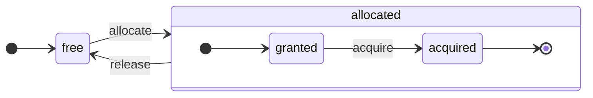

# アーキテクチャ概要

ClickHouseは真の列指向DBMSです。データはカラム単位で保存され、配列（カラムのベクトルまたはチャンク）を実行する際に処理されます。
可能な限り、個々の値ではなく、配列に対して操作がディスパッチされます。
これを「ベクトル化クエリ実行」と呼び、実際のデータ処理コストを低下させるのに役立ちます。

このアイデアは新しいものではありません。
1957年の `APL`（A programming language）やその子孫（`A +`（APL方言）、`J`（1990年）、`K`（1993年）、`Q`（Kx Systemsのプログラミング言語、2003年））にまで遡ります。
配列プログラミングは科学的データ処理で使用されており、このアイデアはリレーショナルデータベースにおいても新しいものではありません。例えば、`VectorWise`システム（Actian CorporationによるActian Vector Analytic Databaseとしても知られる）がこのアイデアを使用しています。

クエリ処理を迅速化するための2つの異なるアプローチがあります：ベクトル化クエリ実行とランタイムコード生成です。後者はすべての間接呼び出しと動的ディスパッチを取り除きます。これらのアプローチのどちらも、必ずしも他のどちらより優れているわけではありません。ランタイムコード生成は多くの操作を融合させ、CPU実行ユニットとパイプラインを完全に活用する場合に優れています。一方で、ベクトル化クエリ実行は一時的なベクトルをキャッシュに書き込み、再読み込みする必要があるため、実用性が低くなる場合があります。もし一時データがL2キャッシュに収まらない場合、これが問題となります。しかし、ベクトル化クエリ実行はCPUのSIMD機能をより活用しやすいです。友人たちが書いた[研究論文](http://15721.courses.cs.cmu.edu/spring2016/papers/p5-sompolski.pdf)によれば、この2つのアプローチを組み合わせるのが最も効果的であることが示されています。ClickHouseはベクトル化クエリ実行を使用し、初期段階でランタイムコード生成に対する限定的なサポートがあります。
## カラム {#columns}

`IColumn`インターフェースは、メモリ内のカラム（実際にはカラムのチャンク）を表現するために使用されます。このインターフェースは、さまざまなリレーショナル演算子の実装に役立つメソッドを提供します。ほとんどの操作は不変であり、元のカラムを修正するのではなく、新たに修正されたカラムを作成します。例えば、`IColumn :: filter`メソッドはフィルタバイトマスクを受け取ります。これは`WHERE`および`HAVING`リレーショナル演算子で使用されます。その他の例としては、`ORDER BY`をサポートするための`IColumn :: permute`メソッドや、`LIMIT`をサポートするための`IColumn :: cut`メソッドがあります。

さまざまな`IColumn`の実装（`ColumnUInt8`、`ColumnString`など）は、カラムのメモリレイアウトを担当します。メモリレイアウトは通常、連続した配列です。整数型のカラムの場合、それは一つの連続配列（`std::vector`のようなもの）で表現されます。 `String`や`Array`カラムについては、連続的に配置された配列のすべての要素用の一つと、各配列の先頭へのオフセット用の二つのベクトルがあります。また、`ColumnConst`はメモリに1つの値だけを保存しますが、カラムのように見えます。
## フィールド {#field}

それでも、個々の値を操作することも可能です。個々の値を表現するために、`Field`が使用されます。`Field`は単に`UInt64`、`Int64`、`Float64`、`String`、`Array`の識別されたユニオンです。`IColumn`には、n番目の値を`Field`として取得するための`operator []`メソッドと、`Field`をカラムの末尾に追加するための`insert`メソッドがあります。これらのメソッドは、一個の値を表す一時的な`Field`オブジェクトを扱う必要があるため、非常に効率的ではありません。`insertFrom`や`insertRangeFrom`など、より効率的なメソッドもあります。

`Field`は、テーブル用の特定のデータ型に関する十分な情報を持っていません。例えば、`UInt8`、`UInt16`、`UInt32`、`UInt64`はすべて`Field`では`UInt64`として表されます。
## 漏れた抽象 {#leaky-abstractions}

`IColumn`はデータの一般的なリレーショナル変換のメソッドを持っていますが、すべてのニーズに応えるわけではありません。例えば、`ColumnUInt64`には2つのカラムの合計を計算するメソッドがなく、`ColumnString`には部分文字列検索を実行するメソッドがありません。これらの無数のルーチンは、`IColumn`の外部で実装されています。

カラムに対するさまざまな関数は、`IColumn`メソッドを使用して`Field`値を抽出する一般的かつ非効率的な方法で実装するか、特定の`IColumn`実装でデータの内部メモリレイアウトに関する知識を利用して特化した方法で実装することができます。これは、特定の`IColumn`型へのキャスト関数を使用して内部表現を直接扱うことで実現されます。例えば、`ColumnUInt64`には、内部配列への参照を返す`getData`メソッドがあり、その後、別のルーチンがその配列を直接読み取ったり埋めたりします。「漏れた抽象」の存在により、さまざまなルーチンの効率的な特化が可能になります。
## データ型 {#data_types}

`IDataType`は、シリアル化とデシリアル化を担当します：バイナリまたはテキスト形式でカラムのチャンクや個々の値を読み書きします。`IDataType`は、テーブル内のデータ型に直接対応します。例えば、`DataTypeUInt32`、`DataTypeDateTime`、`DataTypeString`などがあります。

`IDataType`と`IColumn`は互いに緩やかに関連しています。異なるデータ型は、同じ`IColumn`実装でメモリ内に表現されることがあります。例えば、`DataTypeUInt32`と`DataTypeDateTime`はどちらも`ColumnUInt32`または`ColumnConstUInt32`によって表されます。さらに、同じデータ型は異なる`IColumn`実装によって表されることもあります。たとえば、`DataTypeUInt8`は`ColumnUInt8`または`ColumnConstUInt8`で表すことができます。

`IDataType`はメタデータのみを保存します。例えば、`DataTypeUInt8`は何も保存せず（仮想ポインタ`vptr`を除く）、`DataTypeFixedString`は`N`（固定サイズの文字列のサイズ）だけを保存します。

`IDataType`には、さまざまなデータ形式用のヘルパーメソッドがあります。例としては、値を可能な引用符を付けてシリアル化するメソッド、JSON用に値をシリアル化するメソッド、XML形式の一部として値をシリアル化するメソッドがあります。データ形式との直接的な対応はありません。例えば、異なるデータ形式`Pretty`と`TabSeparated`は、`IDataType`インターフェースの`serializeTextEscaped`ヘルパーメソッドを共用することができます。
## ブロック {#block}

`Block`は、メモリ内のテーブルのサブセット（チャンク）を表すコンテナです。これは、`(IColumn, IDataType, カラム名)`の三組からなるセットです。クエリの実行中、データは`Block`によって処理されます。`Block`があれば、データ（`IColumn`オブジェクトに格納されています）、そのタイプについての情報（`IDataType`に格納され、どのようにそのカラムを扱うかを示します）、そしてカラム名があります。これは、元のテーブルのカラム名のままであることもあれば、計算結果の一時的な結果を取得するために割り当てられた人工的な名前であることもあります。

ブロック内のカラムに対して関数を計算する場合、結果をブロックに追加するための別のカラムを追加し、関数の引数に対するカラムは触れません。なぜなら、操作は不変だからです。後で不要になったカラムはブロックから削除できますが、修正はできません。これは、共通の部分式を排除するのに便利です。

データの処理ごとにブロックが作成されます。同じ計算のために、カラム名とタイプは異なるブロックで同じままで、カラムデータだけが変更されます。ブロックデータとブロックヘッダーを分離する方が良いです。なぜなら、小さなブロックサイズは一時的な文字列のコピーに対して高いオーバーヘッドを引き起こすためです（shared_ptrやカラム名のため）。
## プロセッサー {#processors}

詳細は[https://github.com/ClickHouse/ClickHouse/blob/master/src/Processors/IProcessor.h](https://github.com/ClickHouse/ClickHouse/blob/master/src/Processors/IProcessor.h)を参照してください。
## フォーマット {#formats}

データフォーマットはプロセッサーで実装されています。
## I/O {#io}

バイト指向の入出力のために、`ReadBuffer`と`WriteBuffer`の抽象クラスがあります。これらはC++の`iostream`の代わりに使用されます。心配しないでください。成熟したC++プロジェクトは、人道的な理由から`iostream`の他の方法を使用しています。

`ReadBuffer`と`WriteBuffer`は、単に連続したバッファと、そのバッファ内の位置を指すカーソルです。実装は、バッファ用のメモリを所有する場合と所有しない場合があります。バッファに以下のデータを埋め込むための仮想メソッドがあります（`ReadBuffer`の場合）またはどこかにバッファをフラッシュするためのメソッドがあります（`WriteBuffer`の場合）。仮想メソッドは滅多に呼び出されません。

`ReadBuffer`/`WriteBuffer`の実装は、ファイルやファイルディスクリプタ、ネットワークソケットとの作業、圧縮の実装（`CompressedWriteBuffer`は他のWriteBufferで初期化され、データを書き込む前に圧縮を実行します）などの目的で使用されます。名前`ConcatReadBuffer`、`LimitReadBuffer`、および`HashingWriteBuffer`は便宜上決まっています。

Read/WriteBuffersはバイトのみを扱います。入力/出力をフォーマットするのに役立つ関数は、`ReadHelpers`および`WriteHelpers`ヘッダファイルにあります。例えば、数字を10進形式で書き込むためのヘルパーがあります。

`JSON`形式で結果セットをstdoutに書き込もうとすると、何が起こるかを見てみましょう。
結果セットは、プル型の`QueryPipeline`から取得する準備が整っています。
まず、バイトをstdoutに書き込むために`WriteBufferFromFileDescriptor(STDOUT_FILENO)`を作成します。
次に、クエリパイプラインからの結果を、`JSONRowOutputFormat`に接続します。これは、その`WriteBuffer`で初期化され、行を`JSON`形式でstdoutに書き込むためのものです。
これは、`complete`メソッドを介して行うことができ、これによりプル型の`QueryPipeline`は完了した`QueryPipeline`になります。
内部的に、`JSONRowOutputFormat`はさまざまなJSON区切り文字を出力し、`IDataType::serializeTextJSON`メソッドを呼び出します。このとき、`IColumn`への参照と行番号を引数として渡します。結果として、`IDataType::serializeTextJSON`は、`WriteHelpers.h`からのメソッドを呼び出します。例えば、数値型には`writeText`、`DataTypeString`には`writeJSONString`が使用されます。
## テーブル {#tables}

`IStorage`インターフェースはテーブルを表します。このインターフェースの異なる実装は異なるテーブルエンジンです。例として`StorageMergeTree`、`StorageMemory`などがあります。これらのクラスのインスタンスは、単なるテーブルです。

`IStorage`の主要なメソッドは`read`と`write`であり、`alter`、`rename`、`drop`など他のメソッドもあります。`read`メソッドは、次の引数を受け取ります：テーブルから読み取るカラムのセット、考慮すべき`AST`クエリ、および希望するストリームの数。`Pipe`を返します。

ほとんどの場合、readメソッドは指定されたカラムをテーブルから読み取ることだけを担当し、さらなるデータ処理は行いません。
すべての後続のデータ処理は、`IStorage`の責任外のパイプラインの別の部分によって処理されます。

ただし、注目すべき例外があります：

- `AST`クエリが`read`メソッドに渡され、テーブルエンジンはそれを使用してインデックス使用を導出し、テーブルから少ないデータを読み込むことができます。
- ときどき、テーブルエンジンはデータを特定の段階まで自ら処理することもあります。たとえば、`StorageDistributed`はリモートサーバーにクエリを送信し、異なるリモートサーバーからのデータをマージできる段階まで処理を依頼し、その前処理されたデータを返すことができます。クエリインタプリタはその後データ処理を完了します。

テーブルの`read`メソッドは、複数の`Processors`から成る`Pipe`を返すことができます。これらの`Processors`はテーブルから並行して読み取ることができます。
次に、これらのプロセッサーを様々な他の変換（式評価やフィルタリングなど）と接続できます。これらは独立して計算できます。
その後、これらの上に`QueryPipeline`を作成し、`PipelineExecutor`を介して実行します。

また、`TableFunction`もあります。これらは、クエリの`FROM`句で使用するための一時的な`IStorage`オブジェクトを返す関数です。

テーブルエンジンを実装する方法をすばやく理解するには、`StorageMemory`や`StorageTinyLog`のようなシンプルなものを参照してください。

> `read`メソッドの結果として、`IStorage`は`QueryProcessingStage`を返します。これは、ストレージ内で既に計算されたクエリの部分に関する情報です。
## パーサー {#parsers}

手書きの再帰的降下パーサーがクエリを解析します。例えば、`ParserSelectQuery`は、クエリのさまざまな部分の基本的なパーサーを再帰的に呼び出します。パーサーは`AST`を生成します。`AST`は`IAST`のインスタンスであるノードで構成されています。

> パーサージェネレーターは歴史的な理由で使用されていません。
## インタプリター {#interpreters}

インタプリターは、ASTからクエリ実行パイプラインを作成する責任があります。`InterpreterExistsQuery`や`InterpreterDropQuery`のようなシンプルなインタプリターと、より高度な`InterpreterSelectQuery`があります。

クエリ実行パイプラインは、チャンク（特定タイプのカラムのセット）を消費および生成できるプロセッサーの組み合わせです。
プロセッサーはポートを介して通信し、複数の入力ポートと複数の出力ポートを持つことができます。
詳細な説明は[src/Processors/IProcessor.h](https://github.com/ClickHouse/ClickHouse/blob/master/src/Processors/IProcessor.h)にあります。

例えば、`SELECT`クエリを解釈した結果は、「プル型」の`QueryPipeline`であり、結果セットを読み取る特別な出力ポートを持っています。
`INSERT`クエリの結果は、「プッシュ型」の`QueryPipeline`であり、挿入データを書くための入力ポートを持っています。
`INSERT SELECT`クエリの解釈結果は、入力や出力を持たず、`SELECT`から`INSERT`へ同時にデータをコピーする「完了した」`QueryPipeline`です。

`InterpreterSelectQuery`は、クエリの分析や変換のために`ExpressionAnalyzer`および`ExpressionActions`メカニズムを使用します。ここで、ほとんどのルールベースのクエリ最適化が行われます。`ExpressionAnalyzer`は非常に複雑であり、書き直す必要があります。さまざまなクエリの変換や最適化は、モジュラーな変換を許可するために別個のクラスに抽出されるべきです。

インタプリターにおける問題に対処するために、新しい`InterpreterSelectQueryAnalyzer`が開発されました。これは、新しい`InterpreterSelectQuery`のバージョンで、`ExpressionAnalyzer`を使用せず、`AST`と`QueryPipeline`との間に`QueryTree`という追加の抽象層を導入します。これは、実際に生産環境で使用できる準備が整っていますが、万が一のために、`enable_analyzer`設定の値を`false`に設定することでオフにできます。
## 関数 {#functions}

普通の関数と集約関数があります。集約関数については次のセクションを参照してください。

普通の関数は行数を変更せず、各行を独立して処理しているかのように動作します。実際、関数は個々の行ではなく、データの`Block`に対して呼び出され、ベクトル化クエリ実行を実現します。

`[blockSize](/sql-reference/functions/other-functions#blockSize)`、`[rowNumberInBlock](/sql-reference/functions/other-functions#rowNumberInBlock)`、および`[runningAccumulate](/sql-reference/functions/other-functions#runningaccumulate)`といった付随的な関数もあり、これらはブロック処理を利用し、行の独立性を破っています。

ClickHouseは強い型付けを持っているため、暗黙的な型変換はありません。関数が特定の型の組み合わせをサポートしていない場合、例外をスローします。しかし、関数は多くの異なる型の組み合わせに対して機能します（オーバーロード可能です）。たとえば、`plus`関数（`+`演算子を実装するため） は任意の数値型の組み合わせで機能します：`UInt8` + `Float32`、`UInt16` + `Int8`など。また、一部の可変引数関数は、任意の数の引数を受け取ることができます。たとえば、`concat`関数です。

関数を実装することは、サポートされるデータ型やサポートされる`IColumns`を明示的にディスパッチするため、やや不便な場合があります。たとえば、`plus`関数には、数値型の各組み合わせや左および右の引数が定数か非定数かで、C++テンプレートの展開によって生成されたコードがあります。

ランタイムコード生成を実装する良い場所です。これにより、テンプレートコードの膨張を回避でき、融合関数（融合乗算-加算など）や、1回のループイテレーションで複数の比較を行うことが可能になります。

ベクトル化クエリ実行のため、関数はショートサーキットされません。たとえば、`WHERE f(x) AND g(y)`と書いた場合、`f(x)`がゼロである行であっても、両方の側が計算されます（`f(x)`がゼロの定数式でない限り）。しかし、`f(x)`条件の選択性が高く、`f(x)`の計算が`g(y)`よりもはるかに安価であれば、マルチパス計算を実施する方が良いでしょう。最初に`f(x)`を計算し、結果でカラムをフィルタリングし、次に小さなフィルタリングされたデータチャンクのためにのみ`g(y)`を計算します。
## 集約関数 {#aggregate-functions}

集約関数は状態を持つ関数です。これらは渡された値をどこかの状態に累積し、その状態から結果を取得できるようにします。これらは`IAggregateFunction`インターフェースによって管理されます。状態は非常にシンプルな場合もあれば（`AggregateFunctionCount`の状態は単なる1つの`UInt64`値です）、かなり複雑な場合もあります（`AggregateFunctionUniqCombined`の状態は、線形配列、ハッシュテーブル、および`HyperLogLog`確率的データ構造の組み合わせです）。

状態は、ハイカードinalityの`GROUP BY`クエリを実行する際に複数の状態を扱うために`Arena`（メモリプール）に割り当てられます。状態は、何らかの注意が必要なコンストラクタとデストラクタを持つことがあります。複雑な集約状態は、追加のメモリを自分自身で割り当てることができます。状態の作成および破棄と、それらの所有権と破棄順序の適切な引き渡しに注目する必要があります。

集約状態は、分散クエリ実行中にネットワークを越えて渡すためや、十分なRAMがないディスクに書き込むためにシリアル化およびデシリアル化できます。集約関数のデータ型である`DataTypeAggregateFunction`にエクスポートして、データの増分集計を可能にすることさえできます。

> 集約関数の状態に対するシリアル化データ形式は、現在はバージョン管理されていません。集約状態が一時的に保持されている場合は問題ありませんが、我々は増分集計用の`AggregatingMergeTree`テーブルエンジンを持ち、既に生産環境で使用されています。そのため、将来的に集約関数のシリアル化形式を変更する際には後方互換性が求められます。
## サーバー {#server}

サーバは、いくつかの異なるインターフェースを実装しています：

- 外部クライアント用のHTTPインターフェース。
- ネイティブClickHouseクライアントおよび分散クエリ実行中のサーバー間通信のためのTCPインターフェース。
- レプリケーションのためのデータ転送インターフェース。

内部的には、コルーチンやファイバーのない単純なマルチスレッドサーバーです。サーバーは高いレートの単純なクエリを処理するようには設計されておらず、比較的低いレートの複雑なクエリを処理するように設計されており、それぞれが分析のために大量のデータを処理できます。

サーバーはクエリ実行に必要な環境を備えた`Context`クラスを初期化します：使用可能なデータベースのリスト、ユーザーとアクセス権、設定、クラスター、プロセスリスト、クエリログなど。インタプリターはこの環境を使用します。

サーバーTCPプロトコルに対して完全な後方および前方の互換性を維持しています：古いクライアントは新しいサーバーと対話でき、新しいクライアントは古いサーバーと対話できます。しかし、我々は永遠にこれを維持したくなく、約1年後には古いバージョンのサポートを削除します。

:::note
ほとんどの外部アプリケーションには、HTTPインターフェースを使用することをお勧めします。これはシンプルで使いやすいためです。TCPプロトコルは内部データ構造に密接に結びついています：データのブロックを渡すための内部形式を使用し、圧縮データのためのカスタムフレーミングを使用します。Cライブラリをそのプロトコルのためにリリースしていないのは、ClickHouseのコードベースの大部分にリンクする必要があり、実用的でないからです。
:::
## 設定 {#configuration}

ClickHouse ServerはPOCO C++ Librariesに基づき、`Poco::Util::AbstractConfiguration`を使用してその設定を表現します。設定は、`DaemonBase`クラスから派生した`Poco::Util::ServerApplication`クラスによって保持されます。このクラスは`DB::Server`クラスを実装し、clickhouse-serverそのものを実現します。したがって、設定は`ServerApplication::config()`メソッドを使用してアクセスできます。

設定は複数のファイル（XMLまたはYAML形式）から読み取られ、`ConfigProcessor`クラスによって単一の`AbstractConfiguration`にマージされます。設定はサーバーの起動時に読み込まれ、設定ファイルのいずれかが更新されたり削除されたり追加されたりした場合に再読み込みされることがあります。`ConfigReloader`クラスは、これらの変更を定期的に監視し、再読み込み手順も担当します。また、`SYSTEM RELOAD CONFIG`クエリも設定を再読み込みさせます。

クエリや`Server`以外のサブシステムの設定は、`Context::getConfigRef()`メソッドを使用してアクセスできます。サーバーの再起動なしに設定を再読み込みできるすべてのサブシステムは、`Server::main()`メソッド内で再読み込みコールバックに自身を登録する必要があります。新しい設定にエラーがある場合、ほとんどのサブシステムは新しい設定を無視し、警告メッセージをログに記録し、以前に読み込まれた設定で動作し続けます。`AbstractConfiguration`の性質上、特定のセクションへの参照を渡すことはできないため、通常は`String config_prefix`が代わりに使用されます。
## スレッドとジョブ {#threads-and-jobs}

クエリを実行し、副次的な活動を行うために、ClickHouseはスレッドプールの1つからスレッドを割り当て、頻繁なスレッドの作成と破棄を避けます。目的やジョブの構造に応じて、いくつかのスレッドプールがあります：
  * クライアントセッション用のサーバープール。
  * 一般的なジョブ、バックグラウンド活動、スタンドアロンスレッドのためのグローバルスレッドプール。
  * 主にIOでブロックされ、CPU集約的でないジョブのためのIOスレッドプール。
  * 定期的なタスクのためのバックグラウンドプール。
  * ステップに分割できる先読み可能なタスクのためのプール。

サーバープールは、`Server::main()`メソッド内で定義された`Poco::ThreadPool`クラスのインスタンスです。このプールは最大`max_connection`スレッドを持つことができます。各スレッドは単一のアクティブ接続に専念します。

グローバルスレッドプールは`GlobalThreadPool`シングルトンクラスです。これからスレッドを割り当てるために`ThreadFromGlobalPool`が使用されます。このクラスは`std::thread`に似たインターフェースを持ちますが、グローバルプールからスレッドを引き出し、すべての必要な初期化を行います。これは次の設定で構成されています：
  * `max_thread_pool_size` - プール内のスレッド数の制限。
  * `max_thread_pool_free_size` - 新しいジョブを待っているアイドルスレッドの制限。
  * `thread_pool_queue_size` - 予約されたジョブ数の制限。

グローバルプールはユニバーサルであり、以下で説明するすべてのプールはこれを基に実装されています。これはプールの階層と考えることができます。すべての専門プールは`ThreadPool`クラスを使用してグローバルプールからスレッドを取得します。したがって、すべての専門プールの主な目的は、同時ジョブの数に制限を適用し、ジョブのスケジューリングを行うことです。プール内のスレッド数がジョブ数よりも少ない場合、`ThreadPool`は優先順位付きのキューにジョブを蓄積します。各ジョブには整数の優先順位があり、デフォルトの優先順位はゼロです。優先順位値が高いすべてのジョブは、低い優先順位のジョブが実行される前に開始されます。しかし、すでに実行中のジョブには違いがないため、優先順位はプールが過負荷になっているときのみ重要です。

IOスレッドプールは、`IOThreadPool::get()`メソッドを介してアクセス可能な単純な`ThreadPool`として実装されています。これは、グローバルプールと同様に、`max_io_thread_pool_size`、`max_io_thread_pool_free_size`、および`io_thread_pool_queue_size`設定で構成されます。IOスレッドプールの主な目的は、IOジョブによってグローバルプールが枯渇することを避け、クエリがCPUを完全に活用できるようにすることです。S3へのバックアップはかなりの量のIO操作を行い、対話型クエリに影響を与えないようにするため、`max_backups_io_thread_pool_size`、`max_backups_io_thread_pool_free_size`、`backups_io_thread_pool_queue_size`設定で構成された別の`BackupsIOThreadPool`があります。

定期的なタスク実行には、`BackgroundSchedulePool`クラスがあります。`BackgroundSchedulePool::TaskHolder`オブジェクトを使用してタスクを登録でき、このプールは同時に二つのジョブを実行しないことを保証します。また、特定の未来の瞬間にタスクの実行を延期したり、一時的にタスクを無効にしたりすることもあります。グローバル`Context`は、このクラスの異なる目的のためにいくつかのインスタンスを提供します。一般的な目的のタスクには`Context::getSchedulePool()`が使用されます。

前読み可能なタスクのための専門パラメータプールもあります。`IExecutableTask`タスクは、ジョブの順序付けられたステップのシーケンスに分割できます。短いタスクが長いタスクよりも優先されるようにこれらのタスクをスケジューリングするには、`MergeTreeBackgroundExecutor`が使用されます。その名の通り、これはマージや変更、取得、移動といったバックグラウンドのMergeTree関連操作のために使用されます。プールインスタンスは、`Context::getCommonExecutor()`やその他の類似のメソッドを用いてアクセスできます。

ジョブに使用されるプールが何であれ、開始時にそのジョブの`ThreadStatus`インスタンスが作成されます。これは、スレッドごとの情報をカプセル化します：スレッドID、クエリID、パフォーマンスカウンター、リソース消費、その他の便利なデータなど。ジョブは`CurrentThread::get()`コールによって、スレッドローカルポインタを介してこれをアクセスできますので、すべての関数に渡す必要はありません。

もしスレッドがクエリ実行に関連している場合、`ThreadStatus`に添付される最も重要なものはクエリコンテキスト`ContextPtr`です。各クエリにはサーバープール内にマスタースレッドがあります。マスタースレッドは、`ThreadStatus::QueryScope query_scope(query_context)`オブジェクトを保持してアタッチします。マスタースレッドはまた、`ThreadGroupStatus`オブジェクトで表されるスレッドグループを作成します。このクエリ実行中に割り当てられたすべての追加スレッドは、`CurrentThread::attachTo(thread_group)`コールによって、それのスレッドグループに接続されます。スレッドグループは、単一のタスクに割り当てられたすべてのスレッドによるメモリ消費を追跡し、プロファイルイベントカウンターを集約するために使用されます（詳細については`MemoryTracker`および`ProfileEvents::Counters`クラスを参照してください）。
## 同時実行制御 {#concurrency-control}

並行化できるクエリは、`max_threads`設定を使用して自らを制限します。この設定のデフォルト値は、単一のクエリが最良の方法で全てのCPUコアを利用できるよう選択されます。しかし、もし複数の同時クエリがあり、それぞれがデフォルトの`max_threads`設定値を使用した場合はどうでしょうか？その場合、クエリはCPUリソースを共有します。OSはスレッドを常に切り替えて公平性を確保しますが、これにはある程度のパフォーマンスペナルティが伴います。`ConcurrencyControl`は、これらのペナルティに対処し、多くのスレッドを割り当てるのを避けるのに役立ちます。設定`concurrent_threads_soft_limit_num`は、CPUの圧力がかかる前に同時に割り当てられるスレッド数を制限するために使用されます。

CPUの`スロット`という概念が導入されます。スロットは同時実行の単位です：スレッドが実行されるには、事前にスロットを取得し、スレッドが停止するときにそれを解放する必要があります。スロットの数は、サーバ内で全体として限られています。複数の同時クエリがあり、要求の合計がスロットの総数を超える場合、`ConcurrencyControl`は公正にCPUスロットスケジューリングを行う責任を担います。

各スロットは、次の状態を持つ独立した状態機械として見なすことができます：
 * `free`：スロットは任意のクエリに割り当てることができます。
 * `granted`：スロットは特定のクエリによって`allocated`されていますが、まだいかなるスレッドにも取得されていません。
 * `acquired`：スロットは特定のクエリによって`allocated`され、スレッドによって取得されています。

注意すべきことは、`allocated`スロットが2つの異なる状態、`granted`と`acquired`にあることです。前者は、実質的に短いはずの遷移状態です（スロットがクエリに割り当てられてから、スロットがそのクエリの任意のスレッドによってアップスケーリング手続きが行われるまで）。

`ConcurrencyControl`のAPIは、次の関数から構成されています：
1. クエリのためのリソース割当てを作成します：`auto slots = ConcurrencyControl::instance().allocate(1, max_threads);`これは、最初のスロットが即時に許可されますが、残りのスロットは後で許可されるかもしれませんので、1つ以上のスロットが割り当てられます。つまり、制限はソフトであり、すべてのクエリは少なくとも1つのスレッドを取得します。
2. 各スレッドのために、割当てからスロットを取得する必要があります：`while (auto slot = slots->tryAcquire()) spawnThread([slot = std::move(slot)] { ... });`。
3. スロットの総数を更新します：`ConcurrencyControl::setMaxConcurrency(concurrent_threads_soft_limit_num)`。サーバーを再起動せずに実行中に行えます。

このAPIにより、クエリは少なくとも1つのスレッドから始め、後で`max_threads`までスケールアップすることができます。
## Distributed Query Execution {#distributed-query-execution}

クラスター設定内のサーバーはほとんど独立しています。クラスター内の1つまたはすべてのサーバーに `Distributed` テーブルを作成できます。 `Distributed` テーブルはデータ自体を保存せず、クラスター内の複数のノードにあるすべてのローカルテーブルへの「ビュー」を提供するだけです。 `Distributed` テーブルからSELECTすると、そのクエリは書き換えられ、負荷分散設定に従ってリモートノードを選択し、クエリが送信されます。 `Distributed` テーブルは、リモートサーバーにクエリを処理するよう要求し、異なるサーバーからの中間結果をマージできる段階まで処理を行います。その後、中間結果を受け取り、それらをマージします。分散テーブルは、可能な限り多くの作業をリモートサーバーに分散し、ネットワーク上で多くの中間データを送信しません。

IN や JOIN 句にサブクエリがある場合、そしてそれぞれが `Distributed` テーブルを使用する場合、事態はより複雑になります。これらのクエリの実行には異なる戦略があります。

分散クエリ実行のためのグローバルクエリプランはありません。各ノードは、ジョブの一部に対するローカルクエリプランを持っています。単純な1パスの分散クエリ実行のみが存在します：リモートノードにクエリを送信し、その後結果をマージします。しかし、これは高カーディナリティの `GROUP BY` や大きな一時データ量を伴う複雑なクエリには適していません。そのような場合、サーバー間でデータを「再シャッフル」する必要があり、追加の調整が必要です。ClickHouseはそのようなクエリ実行をサポートしておらず、改善する必要があります。

## Merge Tree {#merge-tree}

`MergeTree` は、主キーによるインデックスをサポートするストレージエンジンのファミリーです。主キーは任意のカラムまたは式のタプルになることができます。 `MergeTree` テーブル内のデータは「パーツ」に保存されます。各パーツは主キー順にデータを保存するため、データは主キーのタプルによって辞書順に並べられます。すべてのテーブルカラムは、これらのパーツ内の別々の `column.bin` ファイルに保存されます。ファイルは圧縮ブロックで構成され、各ブロックは通常、平均値のサイズに応じて64KBから1MBの未圧縮データを含みます。ブロックは、カラム値が順に配置されているものです。カラム値は各カラムで同じ順序になっているため（主キーが順序を定義）、複数のカラムを反復処理する際には、対応する行に対する値を取得できます。

主キー自体は「スパース」です。それはすべての行を指し示すのではなく、特定のデータ範囲のみに対応します。別の `primary.idx` ファイルには、N番目の行の主キーの値があります。ここでNは `index_granularity`（通常、N = 8192）と呼ばれます。また、各カラムには、データファイル内のN番目の行に対するオフセットである「マーク」を持つ `column.mrk` ファイルがあります。各マークは、圧縮ブロックの開始位置へのオフセットと、データの開始位置へのオフセットのペアです。通常、圧縮ブロックはマークに整列され、解凍されたブロックのオフセットはゼロです。 `primary.idx` のデータは常にメモリに常駐しており、 `column.mrk` ファイルのデータはキャッシュされます。

 `MergeTree` 内のパートから何かを読み取るつもりのときは、 `primary.idx` データを確認し、要求されたデータを含む可能性のある範囲を特定し、その後 `column.mrk` データを確認して、これらの範囲を読み始めるためのオフセットを計算します。スパースなため、余分なデータが読み取られる場合があります。ClickHouseは単純なポイントクエリの高負荷には適していません。各キーに対して `index_granularity` 行が含まれる全範囲を読み取る必要があり、各カラムに対して全圧縮ブロックを解凍する必要があります。インデックスをスパースにしたのは、単一サーバーで兆単位の行を目立ったメモリ消費なしに保持できなければならなかったからです。また、主キーがスパースであるため、ユニークではなく、INSERT時にテーブル内のキーの存在を確認できません。テーブル内に同じキーを持つ行が多数存在する可能性があります。

 `MergeTree` にデータを `INSERT` すると、そのデータの集まりは主キー順に整列され、新しいパートを形成します。バックグラウンドスレッドは定期的にいくつかのパーツを選択し、単一のソートされたパートにマージして、パーツの数を比較的低く保ちます。これが `MergeTree` と呼ばれる理由です。もちろん、マージは「書き込み増幅」を引き起こします。すべてのパーツは不変です。作成および削除されるだけで、修正はされません。SELECTが実行されると、テーブルのスナップショット（一連のパーツ）を保持します。マージ後、障害発生時に回復を容易にするために、古いパーツも一時的に保持しますので、マージされたパートが壊れていると思われる場合は、それを元のパーツと置き換えることができます。

 `MergeTree`は LSM ツリーではありません。なぜなら、MEMTABLE や LOG を含まないからです：挿入されたデータはファイルシステムに直接書き込まれます。この振る舞いにより、MergeTree はバッチでのデータ挿入により適しています。したがって、少量の行を頻繁に挿入することは、MergeTree にとって理想的ではありません。たとえば、1秒あたり数行は問題ありませんが、1秒あたり千回行うことは MergeTree にとって最適ではありません。ただし、小さな挿入のための非同期挿入モードがあります。この制限を克服するためにこのようにしました。なぜなら、私たちのアプリケーションで既にバッチでデータを挿入しているからです。

バックグラウンドマージ中に追加の作業を行っている MergeTree エンジンがいくつかあります。例として、`CollapsingMergeTree` および `AggregatingMergeTree` があります。これは、更新の特別なサポートとして扱うことができます。これらは実際の更新ではないことを心に留めておいてください。ユーザーは通常、バックグラウンドマージが実行される時間を制御できず、 `MergeTree` テーブル内のデータはほとんど常に単一のパートではなく、複数のパートに保存されます。

## Replication {#replication}

ClickHouse のレプリケーションは、テーブル単位で構成できます。同じサーバー上に一部はレプリケートされたテーブルと一部はレプリケートされていないテーブルを持つことができます。また、1つのテーブルが二重レプリケーションされている一方で、別のテーブルは三重レプリケーションされている場合もあります。

レプリケーションは、`ReplicatedMergeTree` ストレージエンジンで実装されています。ストレージエンジンのパラメータとして `ZooKeeper` でのパスが指定されます。同じパスを持つすべてのテーブルは、互いのレプリカになります。これにより、データは同期され、一貫性が保たれます。レプリカは、テーブルを作成または削除することで動的に追加および削除できます。

レプリケーションは非同期のマルチマスター方式を使用しています。 `ZooKeeper` とセッションを持つ任意のレプリカにデータを挿入でき、そのデータは他のすべてのレプリカに非同期に複製されます。ClickHouse は UPDATE をサポートしていないため、レプリケーションは競合がありません。デフォルトでは挿入の過半数の承認はありませんので、一つのノードが故障した場合には直前に挿入されたデータが失われる可能性があります。 `insert_quorum` 設定を使って挿入の過半数を有効にできます。

レプリケーションのメタデータは ZooKeeper に保存されます。アクションは、パートを取得すること、パーツをマージすること、パーティションを削除することなど、実行するアクションのリストを示すレプリケーションログがあります。各レプリカは、そのキューにレプリケーションログをコピーし、キューからアクションを実行します。たとえば、挿入時には、「パートを取得」のアクションがログに作成され、すべてのレプリカがそのパートをダウンロードします。マージは、バイト単位で同一の結果を得るために、レプリカ間で調整されます。すべての部分は、すべてのレプリカで同じ方法でマージされます。リーダーの1人が最初に新しいマージを開始し、「マージパーツ」アクションをログに書き込みます。複数のレプリカ（またはすべて）が同時にリーダーになることができます。レプリカがリーダーにならないように制限するには、`merge_tree` 設定の `replicated_can_become_leader` を使用します。リーダーはバックグラウンドマージのスケジューリングを担当します。

レプリケーションは物理的です：ノード間で転送されるのは圧縮パーツのみで、クエリではありません。ほとんどのケースでは、マージは各レプリカで独立して処理され、ネットワークコストを削減してネットワーク増幅を回避します。大きなマージパーツは、重要なレプリケーション遅延がある場合にのみ、ネットワーク経由で送信されます。

さらに、各レプリカは、パーツのセットとそのチェックサムとして自分の状態を ZooKeeper に保存します。ローカルファイルシステムの状態が ZooKeeper の参照状態から外れた場合、レプリカは他のレプリカから不足しているパーツや壊れたパーツをダウンロードして一貫性を回復します。ローカルファイルシステムに予期しないデータや壊れたデータがある場合、ClickHouse はそれを削除せず、別のディレクトリに移動して忘れます。

:::note
ClickHouse クラスターは独立したシャードで構成されており、各シャードはレプリカで構成されています。クラスターは **エラスティックではない** ため、新しいシャードを追加した後、データは自動的にシャード間で再バランスされません。その代わり、クラスターの負荷は均一でないように調整されることが想定されています。この実装は、より多くの制御を提供し、比較的小さなクラスター（数十ノード）には適しています。しかし、我々が生産で使用している数百ノードのクラスターでは、このアプローチは重要な欠点となります。クラスター全体に広がるテーブルエンジンを実装し、自動的に分割およびバランスが取れる動的にレプリケートされた領域を持つ必要があります。
:::
