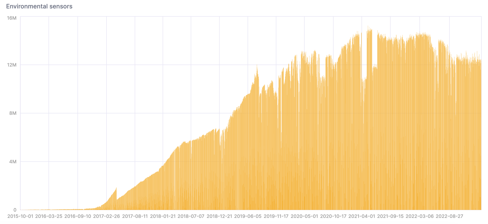

[Sensor.Community](https://sensor.community/en/)は、貢献者駆動のグローバルセンサーネットワークで、オープンな環境データを作成します。データは、世界中のセンサーから収集されます。誰でもセンサーを購入して、好きな場所に設置できます。データをダウンロードするためのAPIは[GitHub](https://github.com/opendata-stuttgart/meta/wiki/APIs)にあり、データは[Database Contents License (DbCL)](https://opendatacommons.org/licenses/dbcl/1-0/)の下で自由に利用できます。

:::important
データセットには200億以上のレコードが含まれているため、リソースがそのようなボリュームに対応できない限り、コマンドを単純にコピーして貼り付けないように注意してください。以下のコマンドは、[ClickHouse Cloud](https://clickhouse.cloud)の**Production**インスタンスで実行されました。
:::

1. データはS3にあるため、`s3`テーブル関数を使用してファイルからテーブルを作成できます。また、データをそのままでクエリすることも可能です。ClickHouseに挿入する前にいくつかの行を見てみましょう：

```sql
SELECT *
FROM s3(
    'https://clickhouse-public-datasets.s3.eu-central-1.amazonaws.com/sensors/monthly/2019-06_bmp180.csv.zst',
    'CSVWithNames'
   )
LIMIT 10
SETTINGS format_csv_delimiter = ';';
```

データはCSVファイル形式ですが、区切り文字としてセミコロンが使用されています。行は次のようになります：

```response
┌─sensor_id─┬─sensor_type─┬─location─┬────lat─┬────lon─┬─timestamp───────────┬──pressure─┬─altitude─┬─pressure_sealevel─┬─temperature─┐
│      9119 │ BMP180      │     4594 │ 50.994 │  7.126 │ 2019-06-01T00:00:00 │    101471 │ ᴺᵁᴸᴸ     │ ᴺᵁᴸᴸ              │        19.9 │
│     21210 │ BMP180      │    10762 │ 42.206 │ 25.326 │ 2019-06-01T00:00:00 │     99525 │ ᴺᵁᴸᴸ     │ ᴺᵁᴸᴸ              │        19.3 │
│     19660 │ BMP180      │     9978 │ 52.434 │ 17.056 │ 2019-06-01T00:00:04 │    101570 │ ᴺᵁᴸᴸ     │ ᴺᵁᴸᴸ              │        15.3 │
│     12126 │ BMP180      │     6126 │ 57.908 │  16.49 │ 2019-06-01T00:00:05 │ 101802.56 │ ᴺᵁᴸᴸ     │ ᴺᵁᴸᴸ              │        8.07 │
│     15845 │ BMP180      │     8022 │ 52.498 │ 13.466 │ 2019-06-01T00:00:05 │    101878 │ ᴺᵁᴸᴸ     │ ᴺᵁᴸᴸ              │          23 │
│     16415 │ BMP180      │     8316 │ 49.312 │  6.744 │ 2019-06-01T00:00:06 │    100176 │ ᴺᵁᴸᴸ     │ ᴺᵁᴸᴸ              │        14.7 │
│      7389 │ BMP180      │     3735 │ 50.136 │ 11.062 │ 2019-06-01T00:00:06 │     98905 │ ᴺᵁᴸᴸ     │ ᴺᵁᴸᴸ              │        12.1 │
│     13199 │ BMP180      │     6664 │ 52.514 │  13.44 │ 2019-06-01T00:00:07 │ 101855.54 │ ᴺᵁᴸᴸ     │ ᴺᵁᴸᴸ              │       19.74 │
│     12753 │ BMP180      │     6440 │ 44.616 │  2.032 │ 2019-06-01T00:00:07 │     99475 │ ᴺᵁᴸᴸ     │ ᴺᵁᴸᴸ              │          17 │
│     16956 │ BMP180      │     8594 │ 52.052 │  8.354 │ 2019-06-01T00:00:08 │    101322 │ ᴺᵁᴸᴸ     │ ᴺᵁᴸᴸ              │        17.2 │
└───────────┴─────────────┴──────────┴────────┴────────┴─────────────────────┴───────────┴──────────┴───────────────────┴─────────────┘
```

2. 次に、ClickHouseにデータを格納するための`MergeTree`テーブルを使用します：

```sql
CREATE TABLE sensors
(
    sensor_id UInt16,
    sensor_type Enum('BME280', 'BMP180', 'BMP280', 'DHT22', 'DS18B20', 'HPM', 'HTU21D', 'PMS1003', 'PMS3003', 'PMS5003', 'PMS6003', 'PMS7003', 'PPD42NS', 'SDS011'),
    location UInt32,
    lat Float32,
    lon Float32,
    timestamp DateTime,
    P1 Float32,
    P2 Float32,
    P0 Float32,
    durP1 Float32,
    ratioP1 Float32,
    durP2 Float32,
    ratioP2 Float32,
    pressure Float32,
    altitude Float32,
    pressure_sealevel Float32,
    temperature Float32,
    humidity Float32,
    date Date MATERIALIZED toDate(timestamp)
)
ENGINE = MergeTree
ORDER BY (timestamp, sensor_id);
```

3. ClickHouse Cloudサービスには、`default`という名前のクラスタがあります。`s3Cluster`テーブル関数を使用すると、クラスタ内のノードからS3ファイルを並行して読み取ることができます。（クラスタを持っていない場合は、`s3`関数を使用してクラスタ名を削除してください。）

このクエリはしばらく時間がかかります。圧縮されていないデータは約1.67Tです：

```sql
INSERT INTO sensors
    SELECT *
    FROM s3Cluster(
        'default',
        'https://clickhouse-public-datasets.s3.amazonaws.com/sensors/monthly/*.csv.zst',
        'CSVWithNames',
        $$ sensor_id UInt16,
        sensor_type String,
        location UInt32,
        lat Float32,
        lon Float32,
        timestamp DateTime,
        P1 Float32,
        P2 Float32,
        P0 Float32,
        durP1 Float32,
        ratioP1 Float32,
        durP2 Float32,
        ratioP2 Float32,
        pressure Float32,
        altitude Float32,
        pressure_sealevel Float32,
        temperature Float32,
        humidity Float32 $$
    )
SETTINGS
    format_csv_delimiter = ';',
    input_format_allow_errors_ratio = '0.5',
    input_format_allow_errors_num = 10000,
    input_format_parallel_parsing = 0,
    date_time_input_format = 'best_effort',
    max_insert_threads = 32,
    parallel_distributed_insert_select = 1;
```

ここに返信があります - 行数と処理速度を示します。入力速度は1秒間に600万行以上です！

```response
0 rows in set. Elapsed: 3419.330 sec. Processed 20.69 billion rows, 1.67 TB (6.05 million rows/s., 488.52 MB/s.)
```

4. `sensors`テーブルに必要なストレージディスクのサイズを確認しましょう：

```sql
SELECT
    disk_name,
    formatReadableSize(sum(data_compressed_bytes) AS size) AS compressed,
    formatReadableSize(sum(data_uncompressed_bytes) AS usize) AS uncompressed,
    round(usize / size, 2) AS compr_rate,
    sum(rows) AS rows,
    count() AS part_count
FROM system.parts
WHERE (active = 1) AND (table = 'sensors')
GROUP BY
    disk_name
ORDER BY size DESC;
```

1.67Tは310 GiBに圧縮され、206.9億行があります：

```response
┌─disk_name─┬─compressed─┬─uncompressed─┬─compr_rate─┬────────rows─┬─part_count─┐
│ s3disk    │ 310.21 GiB │ 1.30 TiB     │       4.29 │ 20693971809 │        472 │
└───────────┴────────────┴──────────────┴────────────┴─────────────┴────────────┘
```

5. 今、ClickHouseにデータが入ったので、データを分析してみましょう。新しいセンサーが展開されるにつれてデータの量が時間とともに増加することに注意してください：

```sql
SELECT
    date,
    count()
FROM sensors
GROUP BY date
ORDER BY date ASC;
```

SQLコンソールで結果を視覚化するためのチャートを作成できます：



6. このクエリは、非常に暑くて湿度の高い日の数をカウントします：

```sql
WITH
    toYYYYMMDD(timestamp) AS day
SELECT day, count() FROM sensors
WHERE temperature >= 40 AND temperature <= 50 AND humidity >= 90
GROUP BY day
ORDER BY day asc;
```

結果の視覚化は次のとおりです：


