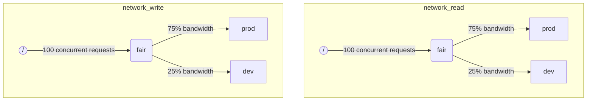

ClickHouse が複数のクエリを同時に実行している場合、それらが同じリソース（例: ディスクや CPU コア）を共有していることがあります。スケジューリングの制約やポリシーを適用することで、リソースの利用方法や、異なるワークロード間での共有方法を制御できます。すべてのリソースに対して共通のスケジューリング階層を構成できます。階層のルートは共有リソースを表し、葉は特定のワークロードを表しており、リソース容量を超えた要求を保持します。

:::note
現在、[リモートディスク IO](#disk_config) と [CPU](#cpu_scheduling) をここで説明する方法でスケジューリングできます。柔軟なメモリ制限については [Memory overcommit](settings/memory-overcommit.md) を参照してください。
:::


## ディスク設定 {#disk_config}

特定のディスクに対してIOワークロードスケジューリングを有効にするには、WRITEおよびREADアクセス用の読み取りおよび書き込みリソースを作成する必要があります:

```sql
CREATE RESOURCE resource_name (WRITE DISK disk_name, READ DISK disk_name)
-- or
CREATE RESOURCE read_resource_name (WRITE DISK write_disk_name)
CREATE RESOURCE write_resource_name (READ DISK read_disk_name)
```

リソースは、READまたはWRITE、あるいはREADとWRITEの両方に対して任意の数のディスクで使用できます。すべてのディスクに対してリソースを使用する構文もあります:

```sql
CREATE RESOURCE all_io (READ ANY DISK, WRITE ANY DISK);
```

リソースが使用するディスクを指定する別の方法として、サーバーの`storage_configuration`があります:

:::warning
ClickHouse設定を使用したワークロードスケジューリングは非推奨です。代わりにSQL構文を使用してください。
:::

特定のディスクに対してIOスケジューリングを有効にするには、ストレージ設定で`read_resource`および/または`write_resource`を指定する必要があります。これにより、指定されたディスクに対するすべての読み取りおよび書き込みリクエストで使用すべきリソースがClickHouseに指示されます。読み取りリソースと書き込みリソースは同じリソース名を参照できます。これはローカルSSDやHDDで有用です。また、複数の異なるディスクが同じリソースを参照することもできます。これはリモートディスクで有用です。例えば、「本番環境」と「開発環境」のワークロード間でネットワーク帯域幅を公平に分割したい場合などです。

例:

```xml
<clickhouse>
    <storage_configuration>
        ...
        <disks>
            <s3>
                <type>s3</type>
                <endpoint>https://clickhouse-public-datasets.s3.amazonaws.com/my-bucket/root-path/</endpoint>
                <access_key_id>your_access_key_id</access_key_id>
                <secret_access_key>your_secret_access_key</secret_access_key>
                <read_resource>network_read</read_resource>
                <write_resource>network_write</write_resource>
            </s3>
        </disks>
        <policies>
            <s3_main>
                <volumes>
                    <main>
                        <disk>s3</disk>
                    </main>
                </volumes>
            </s3_main>
        </policies>
    </storage_configuration>
</clickhouse>
```

サーバー設定オプションは、リソースを定義するSQL方式よりも優先されることに注意してください。


## ワークロードマークアップ {#workload_markup}

クエリは`workload`設定でマークすることで、異なるワークロードを区別できます。`workload`が設定されていない場合は、値"default"が使用されます。設定プロファイルを使用して別の値を指定することも可能です。ユーザーからのすべてのクエリを固定の`workload`設定値でマークしたい場合は、設定制約を使用して`workload`を定数にすることができます。

バックグラウンドアクティビティに対して`workload`設定を割り当てることが可能です。マージとミューテーションは、それぞれ`merge_workload`と`mutation_workload`サーバー設定を使用します。これらの値は、`merge_workload`と`mutation_workload`のマージツリー設定を使用して、特定のテーブルごとにオーバーライドすることもできます。

「production」と「development」という2つの異なるワークロードを持つシステムの例を考えてみましょう。

```sql
SELECT count() FROM my_table WHERE value = 42 SETTINGS workload = 'production'
SELECT count() FROM my_table WHERE value = 13 SETTINGS workload = 'development'
```


## リソーススケジューリング階層 {#hierarchy}

スケジューリングサブシステムの観点では、リソースはスケジューリングノードの階層として表現されます。



:::warning
ClickHouse設定ファイルを使用したワークロードスケジューリングは非推奨です。代わりにSQL構文を使用してください。SQL構文は必要なすべてのスケジューリングノードを自動的に作成します。以下のスケジューリングノードの説明は、[system.scheduler](/operations/system-tables/scheduler.md)テーブルを通じてアクセス可能な低レベルの実装詳細として扱ってください。
:::

**使用可能なノードタイプ:**

- `inflight_limit`(制約) - 同時実行中のリクエスト数が`max_requests`を超えるか、それらの合計コストが`max_cost`を超える場合にブロックします。単一の子ノードを持つ必要があります。
- `bandwidth_limit`(制約) - 現在の帯域幅が`max_speed`を超える場合(0は無制限を意味します)、またはバーストが`max_burst`を超える場合(デフォルトは`max_speed`と同じ)にブロックします。単一の子ノードを持つ必要があります。
- `fair`(ポリシー) - 最大最小公平性に従って、子ノードの1つから次に処理するリクエストを選択します。子ノードは`weight`を指定できます(デフォルトは1)。
- `priority`(ポリシー) - 静的な優先度に従って、子ノードの1つから次に処理するリクエストを選択します(値が低いほど優先度が高い)。子ノードは`priority`を指定できます(デフォルトは0)。
- `fifo`(キュー) - リソース容量を超えるリクエストを保持できる階層のリーフノードです。

基盤となるリソースの全容量を使用するには、`inflight_limit`を使用してください。`max_requests`または`max_cost`の値が低すぎると、リソースが十分に活用されない可能性があります。一方、値が高すぎると、スケジューラ内のキューが空になり、その結果、サブツリー内でポリシーが無視される(不公平性や優先度の無視)ことになります。リソースを過度な利用から保護したい場合は、`bandwidth_limit`を使用してください。これは、`duration`秒間に消費されるリソース量が`max_burst + max_speed * duration`バイトを超えた場合にスロットリングを行います。同じリソース上の2つの`bandwidth_limit`ノードを使用して、短い間隔でのピーク帯域幅と長い間隔での平均帯域幅を制限できます。

次の例は、図に示されているIOスケジューリング階層を定義する方法を示しています:

```xml
<clickhouse>
    <resources>
        <network_read>
            <node path="/">
                <type>inflight_limit</type>
                <max_requests>100</max_requests>
            </node>
            <node path="/fair">
                <type>fair</type>
            </node>
            <node path="/fair/prod">
                <type>fifo</type>
                <weight>3</weight>
            </node>
            <node path="/fair/dev">
                <type>fifo</type>
            </node>
        </network_read>
        <network_write>
            <node path="/">
                <type>inflight_limit</type>
                <max_requests>100</max_requests>
            </node>
            <node path="/fair">
                <type>fair</type>
            </node>
            <node path="/fair/prod">
                <type>fifo</type>
                <weight>3</weight>
            </node>
            <node path="/fair/dev">
                <type>fifo</type>
            </node>
        </network_write>
    </resources>
</clickhouse>
```


## ワークロード分類子 {#workload_classifiers}

:::warning
ClickHouse設定を使用したワークロードスケジューリングは非推奨です。代わりにSQL構文を使用してください。SQL構文を使用すると、分類子は自動的に作成されます。
:::

ワークロード分類子は、クエリで指定された`workload`から、特定のリソースに使用されるリーフキューへのマッピングを定義するために使用されます。現時点では、ワークロード分類はシンプルで、静的マッピングのみが利用可能です。

例:

```xml
<clickhouse>
    <workload_classifiers>
        <production>
            <network_read>/fair/prod</network_read>
            <network_write>/fair/prod</network_write>
        </production>
        <development>
            <network_read>/fair/dev</network_read>
            <network_write>/fair/dev</network_write>
        </development>
        <default>
            <network_read>/fair/dev</network_read>
            <network_write>/fair/dev</network_write>
        </default>
    </workload_classifiers>
</clickhouse>
```


## ワークロード階層 {#workloads}

ClickHouseは、スケジューリング階層を定義するための便利なSQL構文を提供します。`CREATE RESOURCE`で作成されたすべてのリソースは階層の同じ構造を共有しますが、いくつかの点で異なる場合があります。`CREATE WORKLOAD`で作成された各ワークロードは、リソースごとに自動的に作成されるいくつかのスケジューリングノードを保持します。子ワークロードは別の親ワークロード内に作成できます。以下は、上記のXML設定とまったく同じ階層を定義する例です:

```sql
CREATE RESOURCE network_write (WRITE DISK s3)
CREATE RESOURCE network_read (READ DISK s3)
CREATE WORKLOAD all SETTINGS max_io_requests = 100
CREATE WORKLOAD development IN all
CREATE WORKLOAD production IN all SETTINGS weight = 3
```

子を持たないリーフワークロードの名前は、クエリ設定`SETTINGS workload = 'name'`で使用できます。

ワークロードをカスタマイズするには、以下の設定を使用できます:

- `priority` - 兄弟ワークロードは静的な優先度値に従って処理されます(値が低いほど優先度が高くなります)。
- `weight` - 同じ静的優先度を持つ兄弟ワークロードは、重みに応じてリソースを共有します。
- `max_io_requests` - このワークロードにおける同時IOリクエスト数の制限。
- `max_bytes_inflight` - このワークロードにおける同時リクエストの総インフライトバイト数の制限。
- `max_bytes_per_second` - このワークロードのバイト読み取りまたは書き込み速度の制限。
- `max_burst_bytes` - スロットリングされることなくワークロードが処理できる最大バイト数(各リソースごとに独立)。
- `max_concurrent_threads` - このワークロードにおけるクエリのスレッド数の制限。
- `max_concurrent_threads_ratio_to_cores` - `max_concurrent_threads`と同じですが、利用可能なCPUコア数に正規化されます。
- `max_cpus` - このワークロードでクエリを処理するためのCPUコア数の制限。
- `max_cpu_share` - `max_cpus`と同じですが、利用可能なCPUコア数に正規化されます。
- `max_burst_cpu_seconds` - `max_cpus`によるスロットリングを受けることなくワークロードが消費できる最大CPU秒数。

ワークロード設定を通じて指定されたすべての制限は、各リソースごとに独立しています。たとえば、`max_bytes_per_second = 10485760`を持つワークロードは、読み取りリソースと書き込みリソースのそれぞれに対して独立して10 MB/sの帯域幅制限を持ちます。読み取りと書き込みに共通の制限が必要な場合は、READアクセスとWRITEアクセスに同じリソースを使用することを検討してください。

異なるリソースに対して異なるワークロード階層を指定する方法はありません。ただし、特定のリソースに対して異なるワークロード設定値を指定する方法があります:

```sql
CREATE OR REPLACE WORKLOAD all SETTINGS max_io_requests = 100, max_bytes_per_second = 1000000 FOR network_read, max_bytes_per_second = 2000000 FOR network_write
```

また、ワークロードまたはリソースが別のワークロードから参照されている場合は削除できないことに注意してください。ワークロードの定義を更新するには、`CREATE OR REPLACE WORKLOAD`クエリを使用してください。

:::note
ワークロード設定は、適切なスケジューリングノードのセットに変換されます。低レベルの詳細については、スケジューリングノードの[タイプとオプション](#hierarchy)の説明を参照してください。
:::


## CPUスケジューリング {#cpu_scheduling}

ワークロードのCPUスケジューリングを有効にするには、CPUリソースを作成し、同時実行スレッド数の上限を設定します：

```sql
CREATE RESOURCE cpu (MASTER THREAD, WORKER THREAD)
CREATE WORKLOAD all SETTINGS max_concurrent_threads = 100
```

ClickHouseサーバーが[複数のスレッド](/operations/settings/settings.md#max_threads)で多数の同時クエリを実行し、すべてのCPUスロットが使用中になると、過負荷状態に達します。過負荷状態では、解放されたすべてのCPUスロットは、スケジューリングポリシーに従って適切なワークロードに再スケジュールされます。同じワークロードを共有するクエリの場合、スロットはラウンドロビン方式で割り当てられます。別々のワークロードのクエリの場合、スロットはワークロードに指定された重み、優先度、および上限に従って割り当てられます。

CPU時間は、スレッドがブロックされておらず、CPU集約的なタスクを実行している際に消費されます。スケジューリングの目的で、2種類のスレッドが区別されます：

- マスタースレッド — クエリまたはマージやミューテーションなどのバックグラウンド処理を開始する最初のスレッド。
- ワーカースレッド — マスターがCPU集約的なタスクを実行するために生成できる追加のスレッド。

より良い応答性を実現するために、マスタースレッドとワーカースレッドに別々のリソースを使用することが望ましい場合があります。高い`max_threads`クエリ設定値が使用されると、多数のワーカースレッドが容易にCPUリソースを独占する可能性があります。その場合、新規クエリはブロックされ、マスタースレッドが実行を開始するためのCPUスロットを待つ必要があります。これを回避するために、次の設定を使用できます：

```sql
CREATE RESOURCE worker_cpu (WORKER THREAD)
CREATE RESOURCE master_cpu (MASTER THREAD)
CREATE WORKLOAD all SETTINGS max_concurrent_threads = 100 FOR worker_cpu, max_concurrent_threads = 1000 FOR master_cpu
```

これにより、マスタースレッドとワーカースレッドに別々の上限が設定されます。100個のワーカーCPUスロットがすべて使用中であっても、利用可能なマスターCPUスロットがある限り、新規クエリはブロックされません。これらは1つのスレッドで実行を開始します。後でワーカーCPUスロットが利用可能になった場合、そのようなクエリはスケールアップしてワーカースレッドを生成できます。一方、このアプローチはスロットの総数をCPUプロセッサ数に結び付けないため、同時実行スレッドが多すぎるとパフォーマンスに影響します。

マスタースレッドの同時実行数を制限しても、同時クエリ数は制限されません。CPUスロットはクエリ実行の途中で解放され、他のスレッドによって再取得される可能性があります。たとえば、マスタースレッドの同時実行数が2に制限されている場合でも、4つの同時クエリがすべて並列に実行される可能性があります。この場合、各クエリはCPUプロセッサの50%を受け取ります。同時クエリ数を制限するには別のロジックを使用する必要があり、現在ワークロードではサポートされていません。

ワークロードには別々のスレッド同時実行上限を使用できます：

```sql
CREATE RESOURCE cpu (MASTER THREAD, WORKER THREAD)
CREATE WORKLOAD all
CREATE WORKLOAD admin IN all SETTINGS max_concurrent_threads = 10
CREATE WORKLOAD production IN all SETTINGS max_concurrent_threads = 100
CREATE WORKLOAD analytics IN production SETTINGS max_concurrent_threads = 60, weight = 9
CREATE WORKLOAD ingestion IN production
```

この設定例は、管理用と本番用に独立したCPUスロットプールを提供します。本番プールは分析とインジェストの間で共有されます。さらに、本番プールが過負荷の場合、必要に応じて解放された10個のスロットのうち9個が分析クエリに再スケジュールされます。インジェストクエリは過負荷期間中に10個のスロットのうち1個のみを受け取ります。これにより、ユーザー向けクエリのレイテンシが改善される可能性があります。分析には60個の同時スレッドという独自の上限があり、常に少なくとも40個のスレッドをインジェストのサポートに残します。過負荷がない場合、インジェストは100個のスレッドすべてを使用できます。

クエリをCPUスケジューリングから除外するには、クエリ設定[use_concurrency_control](/operations/settings/settings.md/#use_concurrency_control)を0に設定します。

CPUスケジューリングは、マージとミューテーションではまだサポートされていません。

ワークロードに公平な割り当てを提供するには、クエリ実行中にプリエンプションとダウンスケーリングを実行する必要があります。プリエンプションは`cpu_slot_preemption`サーバー設定で有効化されます。有効化されている場合、すべてのスレッドは定期的にCPUスロットを更新します（`cpu_slot_quantum_ns`サーバー設定に従って）。このような更新は、CPUが過負荷の場合に実行をブロックする可能性があります。実行が長時間ブロックされた場合（`cpu_slot_preemption_timeout_ms`サーバー設定を参照）、クエリはスケールダウンし、同時実行スレッド数が動的に減少します。CPU時間の公平性はワークロード間で保証されますが、同じワークロード内のクエリ間では一部の特殊なケースで違反される可能性があることに注意してください。

:::warning
スロットスケジューリングは[クエリの同時実行数](/operations/settings/settings.md#max_threads)を制御する方法を提供しますが、サーバー設定`cpu_slot_preemption`が`true`に設定されていない限り、公平なCPU時間割り当ては保証されません。それ以外の場合、公平性は競合するワークロード間のCPUスロット割り当て数に基づいて提供されます。これは等しいCPU秒数を意味するものではありません。なぜなら、プリエンプションがない場合、CPUスロットは無期限に保持される可能性があるためです。スレッドは開始時にスロットを取得し、作業が完了したときに解放します。
:::


:::note
CPU リソースを宣言すると、[`concurrent_threads_soft_limit_num`](server-configuration-parameters/settings.md#concurrent_threads_soft_limit_num) および [`concurrent_threads_soft_limit_ratio_to_cores`](server-configuration-parameters/settings.md#concurrent_threads_soft_limit_ratio_to_cores) の設定は効力を失います。代わりに、特定のワークロードに割り当てられる CPU 数を制限するために、ワークロード設定 `max_concurrent_threads` が使用されます。従来の動作を再現するには、WORKER THREAD リソースのみを作成し、ワークロード `all` に対して `max_concurrent_threads` を `concurrent_threads_soft_limit_num` と同じ値に設定し、クエリ設定として `workload = "all"` を使用します。この構成は、[`concurrent_threads_scheduler`](server-configuration-parameters/settings.md#concurrent_threads_scheduler) 設定で値 "fair_round_robin" を指定した場合と同等です。
:::


## スレッド vs. CPU {#threads_vs_cpus}

ワークロードのCPU消費を制御する方法は2つあります:

- スレッド数の制限: `max_concurrent_threads` および `max_concurrent_threads_ratio_to_cores`
- CPUスロットリング: `max_cpus`、`max_cpu_share` および `max_burst_cpu_seconds`

1つ目の方法では、現在のサーバー負荷に応じて、クエリに対して生成されるスレッド数を動的に制御できます。これにより、`max_threads` クエリ設定で指定された値が効果的に引き下げられます。2つ目の方法では、トークンバケットアルゴリズムを使用してワークロードのCPU消費をスロットリングします。スレッド数に直接影響を与えることはありませんが、ワークロード内のすべてのスレッドの合計CPU消費をスロットリングします。

`max_cpus` および `max_burst_cpu_seconds` によるトークンバケットスロットリングは次のように動作します。任意の `delta` 秒の間隔において、ワークロード内のすべてのクエリによる合計CPU消費は `max_cpus * delta + max_burst_cpu_seconds` CPU秒を超えることができません。これにより長期的には `max_cpus` による平均消費が制限されますが、短期的にはこの制限を超える可能性があります。例えば、`max_burst_cpu_seconds = 60` および `max_cpus=0.001` の場合、スロットリングされることなく、1スレッドを60秒間実行するか、2スレッドを30秒間実行するか、60スレッドを1秒間実行することができます。`max_burst_cpu_seconds` のデフォルト値は1秒です。多数の同時スレッドが存在する場合、より低い値を設定すると、許可された `max_cpus` コアの活用不足につながる可能性があります。

:::warning
CPUスロットリング設定は、`cpu_slot_preemption` サーバー設定が有効になっている場合にのみ有効となり、それ以外の場合は無視されます。
:::

CPUスロットを保持している間、スレッドは次の3つの主要な状態のいずれかになります:

- **実行中:** 実際にCPUリソースを消費しています。この状態で費やされた時間はCPUスロットリングによって計上されます。
- **準備完了:** CPUが利用可能になるのを待機しています。CPUスロットリングによって計上されません。
- **ブロック中:** IO操作またはその他のブロッキングシステムコール(例: mutexでの待機)を実行しています。CPUスロットリングによって計上されません。

CPUスロットリングとスレッド数制限の両方を組み合わせた設定の例を見てみましょう:

```sql
CREATE RESOURCE cpu (MASTER THREAD, WORKER THREAD)
CREATE WORKLOAD all SETTINGS max_concurrent_threads_ratio_to_cores = 2
CREATE WORKLOAD admin IN all SETTINGS max_concurrent_threads = 2, priority = -1
CREATE WORKLOAD production IN all SETTINGS weight = 4
CREATE WORKLOAD analytics IN production SETTINGS max_cpu_share = 0.7, weight = 3
CREATE WORKLOAD ingestion IN production
CREATE WORKLOAD development IN all SETTINGS max_cpu_share = 0.3
```

ここでは、すべてのクエリの合計スレッド数を利用可能なCPUの2倍に制限しています。adminワークロードは、利用可能なCPU数に関係なく、最大で2スレッドに制限されます。adminは優先度-1(デフォルトの0より低い)を持ち、必要に応じて最初にCPUスロットを取得します。adminがクエリを実行していない場合、CPUリソースはproductionとdevelopmentワークロード間で分割されます。CPU時間の保証された割り当ては重み(4対1)に基づいています: 少なくとも80%がproductionに(必要な場合)、少なくとも20%がdevelopmentに(必要な場合)割り当てられます。重みが保証を形成する一方で、CPUスロットリングは制限を形成します: productionは制限されず100%を消費できますが、developmentには30%の制限があり、これは他のワークロードからのクエリがない場合でも適用されます。productionワークロードはリーフではないため、そのリソースは重み(3対1)に従ってanalyticsとingestion間で分割されます。これは、analyticsが少なくとも0.8 * 0.75 = 60%の保証を持ち、`max_cpu_share` に基づいて合計CPUリソースの70%の制限を持つことを意味します。一方、ingestionは少なくとも0.8 * 0.25 = 20%の保証を持ちますが、上限はありません。

:::note
ClickHouseサーバーでCPU使用率を最大化したい場合は、ルートワークロード `all` に対して `max_cpus` および `max_cpu_share` の使用を避けてください。代わりに、`max_concurrent_threads` により高い値を設定してください。例えば、8個のCPUを持つシステムでは、`max_concurrent_threads = 16` と設定します。これにより、8つのスレッドがCPUタスクを実行し、他の8つのスレッドがI/O操作を処理できます。追加のスレッドはCPU負荷を生成し、スケジューリングルールが確実に適用されるようにします。対照的に、`max_cpus = 8` と設定すると、サーバーは利用可能な8個のCPUを超えることができないため、CPU負荷が生成されることはありません。
:::


## クエリスロットスケジューリング {#query_scheduling}

ワークロードに対してクエリスロットスケジューリングを有効にするには、QUERYリソースを作成し、同時実行クエリ数または1秒あたりのクエリ数の制限を設定します:

```sql
CREATE RESOURCE query (QUERY)
CREATE WORKLOAD all SETTINGS max_concurrent_queries = 100, max_queries_per_second = 10, max_burst_queries = 20
```

ワークロード設定`max_concurrent_queries`は、特定のワークロードに対して同時に実行できる同時実行クエリの数を制限します。これはクエリ設定[`max_concurrent_queries_for_all_users`](/operations/settings/settings#max_concurrent_queries_for_all_users)およびサーバー設定[max_concurrent_queries](/operations/server-configuration-parameters/settings#max_concurrent_queries)に相当します。非同期挿入クエリやKILLなどの特定のクエリは、この制限の対象外です。

ワークロード設定`max_queries_per_second`と`max_burst_queries`は、トークンバケットスロットラーを使用してワークロードのクエリ数を制限します。これにより、任意の時間間隔`T`において、`max_queries_per_second * T + max_burst_queries`を超える新しいクエリの実行が開始されないことが保証されます。

ワークロード設定`max_waiting_queries`は、ワークロードの待機中クエリ数を制限します。制限に達すると、サーバーは`SERVER_OVERLOADED`エラーを返します。

:::note
ブロックされたクエリは、すべての制約が満たされるまで無期限に待機し、`SHOW PROCESSLIST`には表示されません。
:::


## ワークロードとリソースのストレージ {#workload_entity_storage}

すべてのワークロードとリソースの定義は、`CREATE WORKLOAD`および`CREATE RESOURCE`クエリの形式で、ディスク上の`workload_path`またはZooKeeper上の`workload_zookeeper_path`に永続的に保存されます。ノード間の整合性を実現するには、ZooKeeperストレージの使用を推奨します。または、ディスクストレージと併せて`ON CLUSTER`句を使用することもできます。


## 設定ベースのワークロードとリソース {#config_based_workloads}

SQLベースの定義に加えて、ワークロードとリソースはサーバー設定ファイルで事前定義できます。これは、インフラストラクチャによって一部の制限が決定される一方で、他の制限は顧客が変更できるクラウド環境で有用です。設定ベースのエンティティはSQL定義のものよりも優先され、SQLコマンドを使用して変更または削除することはできません。

### 設定形式 {#config_based_workloads_format}

```xml
<clickhouse>
    <resources_and_workloads>
        RESOURCE s3disk_read (READ DISK s3);
        RESOURCE s3disk_write (WRITE DISK s3);
        WORKLOAD all SETTINGS max_io_requests = 500 FOR s3disk_read, max_io_requests = 1000 FOR s3disk_write, max_bytes_per_second = 1342177280 FOR s3disk_read, max_bytes_per_second = 3355443200 FOR s3disk_write;
        WORKLOAD production IN all SETTINGS weight = 3;
    </resources_and_workloads>
</clickhouse>
```

設定は`CREATE WORKLOAD`および`CREATE RESOURCE`ステートメントと同じSQL構文を使用します。すべてのクエリは有効である必要があります。

### 使用上の推奨事項 {#config_based_workloads_usage_recommendations}

クラウド環境では、典型的なセットアップには以下が含まれます:

1. インフラストラクチャの制限を設定するために、設定ファイルでルートワークロードとネットワークIOリソースを定義する
2. これらの制限を強制するために`throw_on_unknown_workload`を設定する
3. すべてのクエリに自動的に制限を適用するために`CREATE WORKLOAD default IN all`を作成する(`workload`クエリ設定のデフォルト値は'default'であるため)
4. ユーザーが設定された階層内で追加のワークロードを作成できるようにする

これにより、すべてのバックグラウンドアクティビティとクエリがインフラストラクチャの制限を遵守しながら、ユーザー固有のスケジューリングポリシーに対する柔軟性を維持できます。

別の使用例として、異種クラスター内の異なるノードに対して異なる設定を行うことが挙げられます。


## 厳格なリソースアクセス {#strict_resource_access}

すべてのクエリにリソーススケジューリングポリシーの遵守を強制するには、サーバー設定`throw_on_unknown_workload`があります。この設定を`true`にすると、すべてのクエリは有効な`workload`クエリ設定を使用する必要があり、使用しない場合は`RESOURCE_ACCESS_DENIED`例外がスローされます。`false`に設定した場合、該当するクエリはリソーススケジューラを使用せず、すべての`RESOURCE`への無制限のアクセスが許可されます。クエリ設定'use_concurrency_control = 0'を指定すると、クエリはCPUスケジューラを回避し、CPUへの無制限のアクセスが可能になります。CPUスケジューリングを強制するには、'use_concurrency_control'を読み取り専用の定数値として保持する設定制約を作成してください。

:::note
`CREATE WORKLOAD default`を実行していない限り、`throw_on_unknown_workload`を`true`に設定しないでください。起動時に明示的な`workload`設定のないクエリが実行されると、サーバーの起動に問題が発生する可能性があります。
:::


## 関連項目 {#see-also}

- [system.scheduler](/operations/system-tables/scheduler.md)
- [system.workloads](/operations/system-tables/workloads.md)
- [system.resources](/operations/system-tables/resources.md)
- [merge_workload](/operations/settings/merge-tree-settings.md#merge_workload) MergeTree設定
- [merge_workload](/operations/server-configuration-parameters/settings.md#merge_workload) グローバルサーバー設定
- [mutation_workload](/operations/settings/merge-tree-settings.md#mutation_workload) MergeTree設定
- [mutation_workload](/operations/server-configuration-parameters/settings.md#mutation_workload) グローバルサーバー設定
- [workload_path](/operations/server-configuration-parameters/settings.md#workload_path) グローバルサーバー設定
- [workload_zookeeper_path](/operations/server-configuration-parameters/settings.md#workload_zookeeper_path) グローバルサーバー設定
- [cpu_slot_preemption](/operations/server-configuration-parameters/settings.md#cpu_slot_preemption) グローバルサーバー設定
- [cpu_slot_quantum_ns](/operations/server-configuration-parameters/settings.md#cpu_slot_quantum_ns) グローバルサーバー設定
- [cpu_slot_preemption_timeout_ms](/operations/server-configuration-parameters/settings.md#cpu_slot_preemption_timeout_ms) グローバルサーバー設定
