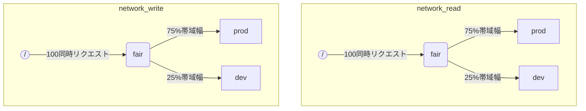

When ClickHouse execute multiple queries simultaneously, they may be using shared resources (e.g. disks). Scheduling constraints and policies can be applied to regulate how resources are utilized and shared between different workloads. For every resource a scheduling hierarchy can be configured. Hierarchy root represents a resource, while leafs are queues, holding requests that exceed resource capacity.

:::note
現在 [remote disk IO](#disk_config) と [CPU](#cpu_scheduling) は、記述された方法を使用してスケジュールすることができます。柔軟なメモリ制限については、[Memory overcommit](settings/memory-overcommit.md) を参照してください。
:::

## ディスク構成 {#disk_config}

特定のディスクのIOワークロードスケジューリングを有効にするには、WRITEおよびREADアクセス用の読み取りおよび書き込みリソースを作成する必要があります。

```sql
CREATE RESOURCE resource_name (WRITE DISK disk_name, READ DISK disk_name)
-- または
CREATE RESOURCE read_resource_name (WRITE DISK write_disk_name)
CREATE RESOURCE write_resource_name (READ DISK read_disk_name)
```

リソースは、READまたはWRITEまたは両方のREADとWRITEに対して任意の数のディスクに使用できます。すべてのディスクにリソースを使用するための構文があります：

```sql
CREATE RESOURCE all_io (READ ANY DISK, WRITE ANY DISK);
```

リソースが使用するディスクを表現する別の方法は、サーバーの `storage_configuration` です。

:::warning
ClickHouseの構成を使用したワークロードスケジューリングは非推奨です。SQL構文を使用する必要があります。
:::

特定のディスクのIOスケジューリングを有効にするには、ストレージ構成で `read_resource` および/または `write_resource` を指定する必要があります。これにより、指定されたディスクに対する各読み取りおよび書き込みリクエストに対して使用されるリソースがClickHouseに指示されます。読み取りおよび書き込みリソースは、ローカルSSDやHDDに便利な同じリソース名を参照できます。異なる複数のディスクも同じリソースを参照できるため、たとえば「production」と「development」ワークロード間でネットワーク帯域幅の公平な分配を可能にします。

例：
```xml
<clickhouse>
    <storage_configuration>
        ...
        <disks>
            <s3>
                <type>s3</type>
                <endpoint>https://clickhouse-public-datasets.s3.amazonaws.com/my-bucket/root-path/</endpoint>
                <access_key_id>your_access_key_id</access_key_id>
                <secret_access_key>your_secret_access_key</secret_access_key>
                <read_resource>network_read</read_resource>
                <write_resource>network_write</write_resource>
            </s3>
        </disks>
        <policies>
            <s3_main>
                <volumes>
                    <main>
                        <disk>s3</disk>
                    </main>
                </volumes>
            </s3_main>
        </policies>
    </storage_configuration>
</clickhouse>
```

サーバー構成オプションは、リソースを定義するためのSQL方式よりも優先されます。

## ワークロードマークアップ {#workload_markup}

クエリは、異なるワークロードを区別するために設定 `workload` でマークできます。`workload` が設定されていない場合、値 "default" が使用されます。設定プロファイルを使用して他の値を指定することができます。設定制約を使用して、`workload` を定数にすることができ、すべてのユーザーからのクエリが固定値の `workload` 設定でマークされるようにできます。

バックグラウンドアクティビティのための `workload` 設定を割り当てることが可能です。マージおよび変異はそれぞれ `merge_workload` および `mutation_workload` サーバー設定を使用します。これらの値は、特定のテーブルに対して `merge_workload` および `mutation_workload` マージツリー設定で上書きすることもできます。

「production」と「development」の2つの異なるワークロードを持つシステムの例を考えてみましょう。

```sql
SELECT count() FROM my_table WHERE value = 42 SETTINGS workload = 'production'
SELECT count() FROM my_table WHERE value = 13 SETTINGS workload = 'development'
```

## リソーススケジューリング階層 {#hierarchy}

スケジューリングサブシステムの観点から、リソースはスケジューリングノードの階層を表します。



:::warning
ClickHouseの構成を使用したワークロードスケジューリングは非推奨です。SQL構文を使用する必要があります。SQL構文は必要なすべてのスケジューリングノードを自動的に作成し、次のスケジューリングノードの説明は[system.scheduler](/operations/system-tables/scheduler.md) テーブルを通じてアクセス可能な低レベルの実装詳細と見なされるべきです。
:::

**可能なノードタイプ:**
* `inflight_limit` (制約) - 同時実行中のリクエスト数が `max_requests` を超えるか、総コストが `max_cost` を超える場合にブロックされます; 単一の子ノードを持たなければなりません。
* `bandwidth_limit` (制約) - 現在の帯域幅が `max_speed` (0は無制限を意味する) を超えるか、バーストが `max_burst` を超える場合にブロックされます (デフォルトは `max_speed` に等しい); 単一の子ノードを持たなければなりません。
* `fair` (ポリシー) - max-minの公平性に基づいて、子ノードの1つから次のリクエストを選択します; 子ノードは `weight` を指定できます (デフォルトは1)。
* `priority` (ポリシー) - 静的優先順位に基づいて、子ノードの1つから次のリクエストを選択します (値が低いほど優先順位が高い); 子ノードは `priority` を指定できます (デフォルトは0)。
* `fifo` (キュー) - リソース容量を超えるリクエストを保持できる階層の葉です。

基盤となるリソースのフルキャパシティを使用するには `inflight_limit` を使用する必要があります。`max_requests` または `max_cost` の数が少ないとリソースの利用が不完全になる可能性があり、過度に高い数はスケジューラ内で空のキューを引き起こし、それによりポリシーが無視される (不公平性や優先順位の無視) 結果となります。一方、リソースが過度に利用されるのを防ぎたい場合は `bandwidth_limit` を使用するべきです。これは、`duration` 秒間に消費されるリソースの量が `max_burst + max_speed * duration` バイトを超えたときにスロットルします。2つの `bandwidth_limit` ノードを同じリソースで使用して、短い間隔でのピーク帯域幅と長い間隔での平均帯域幅を制限することができます。

以下の例は、図に示されたIOスケジューリング階層を定義する方法を示しています。

```xml
<clickhouse>
    <resources>
        <network_read>
            <node path="/">
                <type>inflight_limit</type>
                <max_requests>100</max_requests>
            </node>
            <node path="/fair">
                <type>fair</type>
            </node>
            <node path="/fair/prod">
                <type>fifo</type>
                <weight>3</weight>
            </node>
            <node path="/fair/dev">
                <type>fifo</type>
            </node>
        </network_read>
        <network_write>
            <node path="/">
                <type>inflight_limit</type>
                <max_requests>100</max_requests>
            </node>
            <node path="/fair">
                <type>fair</type>
            </node>
            <node path="/fair/prod">
                <type>fifo</type>
                <weight>3</weight>
            </node>
            <node path="/fair/dev">
                <type>fifo</type>
            </node>
        </network_write>
    </resources>
</clickhouse>
```

## ワークロード分類子 {#workload_classifiers}

:::warning
ClickHouseの構成を使用したワークロードスケジューリングは非推奨です。SQL構文を使用する必要があります。分類子はSQL構文を使用する際に自動的に作成されます。
:::

ワークロード分類子は、クエリで指定された `workload` から特定のリソースに使用されるべき葉キューへのマッピングを定義するために使用されます。現在、ワークロード分類はシンプルです: 静的マッピングのみが利用可能です。

例：
```xml
<clickhouse>
    <workload_classifiers>
        <production>
            <network_read>/fair/prod</network_read>
            <network_write>/fair/prod</network_write>
        </production>
        <development>
            <network_read>/fair/dev</network_read>
            <network_write>/fair/dev</network_write>
        </development>
        <default>
            <network_read>/fair/dev</network_read>
            <network_write>/fair/dev</network_write>
        </default>
    </workload_classifiers>
</clickhouse>
```

## ワークロード階層 {#workloads}

ClickHouseはスケジューリング階層を定義するための便利なSQL構文を提供します。`CREATE RESOURCE` で作成されたすべてのリソースは同じ階層の構造を共有しますが、一部の側面で異なる場合があります。 `CREATE WORKLOAD` で作成された各ワークロードは、各リソースに対して自動的に作成されたスケジューリングノードをいくつか保持します。子ワークロードは別の親ワークロード内に作成できます。以下は、上記のXML構成と全く同じ階層を定義する例です：

```sql
CREATE RESOURCE network_write (WRITE DISK s3)
CREATE RESOURCE network_read (READ DISK s3)
CREATE WORKLOAD all SETTINGS max_io_requests = 100
CREATE WORKLOAD development IN all
CREATE WORKLOAD production IN all SETTINGS weight = 3
```

子ワークロードを持たない葉のワークロードの名前をクエリ設定 `SETTINGS workload = 'name'` に使用できます。

ワークロードをカスタマイズするために使用できる設定は次のとおりです：
* `priority` - 同じ階層のワークロードは静的優先順位値に従ってサービスされます (値が低いほど優先順位が高い)。
* `weight` - 同じ静的優先順位を持つ兄弟ワークロードは、重み付けに従ってリソースを共有します。
* `max_io_requests` - このワークロードの同時IOリクエストの数の制限。
* `max_bytes_inflight` - このワークロードの同時リクエストに対する合計流入バイトの制限。
* `max_bytes_per_second` - このワークロードのバイトの読み取りまたは書き込みレートの制限。
* `max_burst_bytes` - ワークロードがスロットリングされずに処理できる最大バイト数 (リソースごとに独立しています)。
* `max_concurrent_threads` - このワークロードのクエリのスレッド数に制限。

ワークロード設定を介して指定されたすべての制限は、各リソースに対して独立しています。たとえば、`max_bytes_per_second = 10485760` のワークロードは、各読み取りおよび書き込みリソースに対して10 MB/sの帯域幅制限を持ちます。読み取りと書き込みに共通の制限が必要な場合は、READとWRITEアクセスに同じリソースを使用することを検討してください。

異なるリソースに対して異なるワークロードの階層を指定する方法はありません。しかし、特定のリソースに対する異なるワークロード設定値を指定する方法はあります：

```sql
CREATE OR REPLACE WORKLOAD all SETTINGS max_io_requests = 100, max_bytes_per_second = 1000000 FOR network_read, max_bytes_per_second = 2000000 FOR network_write
```

また、ワークロードまたはリソースは、他のワークロードから参照されている場合は削除できません。ワークロードの定義を更新するには `CREATE OR REPLACE WORKLOAD` クエリを使用します。

:::note
ワークロード設定は適切なスケジューリングノードのセットに変換されます。詳細については、スケジューリングノードの[タイプとオプション](#hierarchy)の説明を参照してください。
:::

## CPUスケジューリング {#cpu_scheduling}

ワークロードのCPUスケジューリングを有効にするには、CPUリソースを作成し、同時スレッド数の制限を設定します。

```sql
CREATE RESOURCE cpu (MASTER THREAD, WORKER THREAD)
CREATE WORKLOAD all SETTINGS max_concurrent_threads = 100
```

ClickHouseサーバーが多くの同時クエリを実行し、すべてのCPUスロットが使用されていると、オーバーロード状態になります。オーバーロード状態では、解放されたCPUスロットは適切なワークロードに再スケジュールされます。共通のワークロードを共有するクエリの場合、スロットはラウンドロビンを使用して割り当てられます。異なるワークロードのクエリに対しては、ワークロードに指定された重み、優先順位、および制限に従ってスロットが割り当てられます。

CPU時間は、スレッドがブロックされておらず、CPU集約的なタスクで作業しているときに消費されます。スケジューリングの目的で、2種類のスレッドが区別されます：
* マスタースレッド — クエリまたはマージや変異などのバックグラウンドアクティビティで作業を開始する最初のスレッド。
* ワーカースレッド — マスターがCPU集約的なタスクで作業するために生成できる追加のスレッド。

レスポンスを向上させるために、マスタースレッドとワーカースレッド用に別々のリソースを使用することが望ましい場合があります。高い `max_threads` クエリ設定値が使用される場合、高数のワーカースレッドはCPUリソースを独占してしまいます。この場合、入ってくるクエリはブロックされ、マスタースレッドの実行を開始するためのCPUスロットを待つ必要があります。これを回避するためには、次の構成を使用できます：

```sql
CREATE RESOURCE worker_cpu (WORKER THREAD)
CREATE RESOURCE master_cpu (MASTER THREAD)
CREATE WORKLOAD all SETTINGS max_concurrent_threads = 100 FOR worker_cpu, max_concurrent_threads = 1000 FOR master_cpu
```

これにより、マスターとワーカーのスレッドの限界が別々に設定されます。すべての100のワーカーCPUスロットがビジー状態でも、新しいクエリは利用可能なマスターCPUスロットがある限りブロックされません。それらは1つのスレッドで実行を開始します。後でワーカーCPUスロットが利用可能になれば、そのようなクエリはスケールアップしてワーカースレッドを生成できます。一方で、このアプローチは総スロット数をCPUプロセッサ数に結びつけず、あまりにも多くの同時スレッドの実行がパフォーマンスに影響します。

マスタースレッドの同時実行数を制限することは、同時クエリ数を制限するわけではありません。クエリ実行の途中でCPUスロットが解放され、他のスレッドによって再取得されることがあります。たとえば、同時に2つのマスタースレッドの制限で4つの同時クエリがすべて並行して実行されることがあります。この場合、各クエリはCPUプロセッサの50%を受け取ります。同時クエリ数を制限するために、別のロジックを使用する必要があり、これは現在ワークロードに対してはサポートされていません。

ワークロードには、別々のスレッドの同時実行制限を設定できます：

```sql
CREATE RESOURCE cpu (MASTER THREAD, WORKER THREAD)
CREATE WORKLOAD all
CREATE WORKLOAD admin IN all SETTINGS max_concurrent_threads = 10
CREATE WORKLOAD production IN all SETTINGS max_concurrent_threads = 100
CREATE WORKLOAD analytics IN production SETTINGS max_concurrent_threads = 60, weight = 9
CREATE WORKLOAD ingestion IN production
```

この構成例は、adminとproductionに独立したCPUスロットプールを提供します。productionプールはanalyticsとingestionの間で共有されます。さらに、productionプールがオーバーロードされている場合、必要に応じて解放された10のスロットのうち9は分析クエリに再スケジュールされます。ingestionクエリは、オーバーロード期間中に1のスロットしか受け取れません。これにより、ユーザー向けクエリのレイテンシを改善できるかもしれません。Analyticsには常にingestionをサポートするために少なくとも40スレッドを残し、60の同時スレッドの制限があります。オーバーロードがないときは、ingestionはすべての100スレッドを使用できます。

クエリをCPUスケジューリングから除外するには、クエリ設定 [use_concurrency_control](/operations/settings/settings.md/#use_concurrency_control) を0に設定します。

マージや変異に対するCPUスケジューリングはまだサポートされていません。

:::warning
スロットスケジューリングは、[クエリの同時実行](operations/settings/settings.md#max_threads)を制御する方法を提供しますが、公平なCPU時間の割り当てを保証するものではありません。これは、CPUスロットのプリエンプションのさらなる開発が必要で、後でサポートされる予定です。
:::

:::note
CPUリソースを宣言すると、[`concurrent_threads_soft_limit_num`](server-configuration-parameters/settings.md#concurrent_threads_soft_limit_num) および [`concurrent_threads_soft_limit_ratio_to_cores`](server-configuration-parameters/settings.md#concurrent_threads_soft_limit_ratio_to_cores) 設定の効果が無効になります。その代わりに、ワークロード設定の `max_concurrent_threads` が特定のワークロードに対して割り当てられるCPUの数を制限するために使用されます。以前の動作を達成するには、WORKER THREADリソースのみを作成し、ワークロード `all` の `max_concurrent_threads` を `concurrent_threads_soft_limit_num` と同じ値に設定し、クエリ設定として `workload = "all"` を使用します。この構成は、[`concurrent_threads_scheduler`](server-configuration-parameters/settings.md#concurrent_threads_scheduler) 設定の "fair_round_robin" 値に相当します。
:::

## ワークロードとリソースストレージ {#workload_entity_storage}
すべてのワークロードとリソースの定義は、`CREATE WORKLOAD` および `CREATE RESOURCE` クエリの形式で `workload_path` のディスク上または `workload_zookeeper_path` のZooKeeperに永続的に保存されます。ノード間の整合性を達成するためには、ZooKeeperストレージが推奨されます。代わりに、ディスクストレージと一緒に `ON CLUSTER` 句を使用することもできます。

## 厳密なリソースアクセス {#strict_resource_access}
すべてのクエリがリソーススケジューリングポリシーに従うように強制するために、サーバー設定 `throw_on_unknown_workload` があります。これが `true` に設定されている場合、すべてのクエリは有効な `workload` クエリ設定を使用する必要があり、そうでない場合は `RESOURCE_ACCESS_DENIED` 例外がスローされます。これが `false` に設定されている場合、そのようなクエリはリソーススケジューラを使用せず、任意の `RESOURCE` に無制限にアクセスすることができます。

:::note
`CREATE WORKLOAD default` が実行されるまで `throw_on_unknown_workload` を `true` に設定しないでください。これは、明示的に `workload` を設定しないクエリが起動時に実行されるとサーバーの起動問題を引き起こす可能性があります。
:::

## 参照 {#see-also}
 - [system.scheduler](/operations/system-tables/scheduler.md)
 - [system.workloads](/operations/system-tables/workloads.md)
 - [system.resources](/operations/system-tables/resources.md)
 - [merge_workload](/operations/settings/merge-tree-settings.md#merge_workload) マージツリー設定
 - [merge_workload](/operations/server-configuration-parameters/settings.md#merge_workload) グローバルサーバー設定
 - [mutation_workload](/operations/settings/merge-tree-settings.md#mutation_workload) マージツリー設定
 - [mutation_workload](/operations/server-configuration-parameters/settings.md#mutation_workload) グローバルサーバー設定
 - [workload_path](/operations/server-configuration-parameters/settings.md#workload_path) グローバルサーバー設定
 - [workload_zookeeper_path](/operations/server-configuration-parameters/settings.md#workload_zookeeper_path) グローバルサーバー設定
