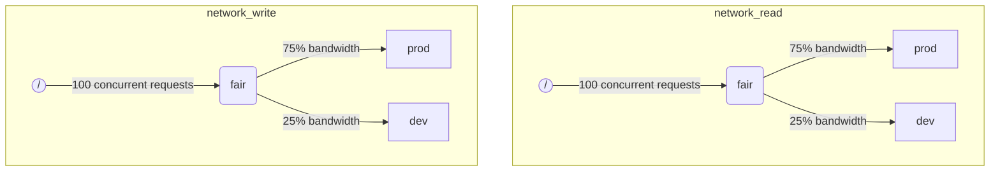

ClickHouse が複数のクエリを同時に実行する場合、それらは共有リソース（例: ディスクや CPU コア）を共有して利用することになります。スケジューリングの制約とポリシーを適用することで、リソースの利用方法や、異なるワークロード間での共有方法を制御できます。すべてのリソースに対して共通のスケジューリング階層を構成できます。階層のルートは共有リソースを表し、葉ノードは特定のワークロードを表します。葉ノードには、リソース容量を超過したリクエストが保持されます。

:::note
現在、[リモートディスク IO](#disk_config) と [CPU](#cpu_scheduling) は、ここで説明する方法を用いてスケジューリングできます。柔軟なメモリ制限については [Memory overcommit](settings/memory-overcommit.md) を参照してください。
:::

## ディスク構成 {#disk_config}

特定のディスクに対して IO ワークロードのスケジューリングを有効にするには、WRITE および READ アクセス用の読み取りリソースと書き込みリソースを作成する必要があります。

```sql
CREATE RESOURCE resource_name (WRITE DISK disk_name, READ DISK disk_name)
-- or
CREATE RESOURCE read_resource_name (WRITE DISK write_disk_name)
CREATE RESOURCE write_resource_name (READ DISK read_disk_name)
```

リソースは、任意の数のディスクに対して、読み取り専用、書き込み専用、または読み書き両用として使用できます。すべてのディスクに対してこのリソースを使用するための構文も用意されています。

```sql
CREATE RESOURCE all_io (READ ANY DISK, WRITE ANY DISK);
```

リソースがどのディスクを使用するかを指定する別の方法として、サーバーの `storage_configuration` を利用するものがあります。

:::warning
ClickHouse の設定によるワークロードのスケジューリングは非推奨です。代わりに SQL 構文を使用してください。
:::

特定のディスクに対して I/O スケジューリングを有効にするには、`storage_configuration` 内で `read_resource` および／または `write_resource` を指定する必要があります。これにより、指定したディスクに対する各読み取りおよび書き込みリクエストに対して、どのリソースを使用するかを ClickHouse に指示します。読み取りリソースと書き込みリソースは同じリソース名を参照することができ、これはローカル SSD や HDD に対して有用です。複数の異なるディスクを同じリソースに割り当てることもでき、これはリモートディスクに対して有用です。例えば、「production」ワークロードと「development」ワークロード間でネットワーク帯域幅を公平に分配できるようにしたい場合などです。

例:

```xml
<clickhouse>
    <storage_configuration>
        ...
        <disks>
            <s3>
                <type>s3</type>
                <endpoint>https://clickhouse-public-datasets.s3.amazonaws.com/my-bucket/root-path/</endpoint>
                <access_key_id>your_access_key_id</access_key_id>
                <secret_access_key>your_secret_access_key</secret_access_key>
                <read_resource>network_read</read_resource>
                <write_resource>network_write</write_resource>
            </s3>
        </disks>
        <policies>
            <s3_main>
                <volumes>
                    <main>
                        <disk>s3</disk>
                    </main>
                </volumes>
            </s3_main>
        </policies>
    </storage_configuration>
</clickhouse>
```

サーバー側の設定オプションのほうが、リソースを SQL で定義する方法よりも優先されることに注意してください。

## ワークロードのマーキング {#workload_markup}

クエリには、異なるワークロードを区別するために設定 `workload` を指定できます。`workload` が設定されていない場合は、値「default」が使用されます。設定プロファイルを使用して別の値を指定することも可能です。設定の制約機能を利用すると、特定のユーザーからのすべてのクエリが `workload` 設定の固定値でマークされるように、`workload` を一定の値に固定できます。

バックグラウンド処理に対しても `workload` 設定を割り当てることができます。マージとミューテーションは、それぞれ `merge_workload` および `mutation_workload` サーバー設定を使用します。これらの値は、`merge_workload` と `mutation_workload` の MergeTree 設定を使用して、特定のテーブルごとに上書きすることもできます。

「production」と「development」という 2 つの異なるワークロードを持つシステムの例を考えてみましょう。

```sql
SELECT count() FROM my_table WHERE value = 42 SETTINGS workload = 'production'
SELECT count() FROM my_table WHERE value = 13 SETTINGS workload = 'development'
```

## リソーススケジューリング階層 {#hierarchy}

スケジューリングサブシステムの観点では、リソースはスケジューリングノードの階層として扱われます。



:::warning
ClickHouse の設定を用いたワークロードスケジューリングは非推奨です。代わりに SQL 構文を使用してください。SQL 構文は必要なすべてのスケジューリングノードを自動的に作成するため、以下のスケジューリングノードの説明は、[system.scheduler](/operations/system-tables/scheduler.md) テーブルから参照できる、より低レベルな実装詳細として扱うべきです。
:::

**利用可能なノードタイプ:**

* `inflight_limit` (制約) - 同時に処理中のリクエスト数が `max_requests` を超えるか、またはそれらの合計コストが `max_cost` を超えた場合にブロックします。子ノードは 1 つだけでなければなりません。
* `bandwidth_limit` (制約) - 現在の帯域幅が `max_speed` を超えた場合 (0 は無制限を意味します)、またはバーストが `max_burst` を超えた場合 (デフォルトは `max_speed` と同じ) にブロックします。子ノードは 1 つだけでなければなりません。
* `fair` (ポリシー) - max-min フェアネスに従って、子ノードのいずれかから次に処理するリクエストを選択します。子ノードは `weight` を指定できます (デフォルトは 1)。
* `priority` (ポリシー) - 静的な優先度に従って、子ノードのいずれかから次に処理するリクエストを選択します (値が小さいほど優先度が高くなります)。子ノードは `priority` を指定できます (デフォルトは 0)。
* `fifo` (キュー) - リソース容量を超えたリクエストを保持できる、階層の葉ノードです。

基盤となるリソースの全容量を活用できるようにするには、`inflight_limit` を使用する必要があります。`max_requests` または `max_cost` の値が小さすぎると、リソースが十分に活用されない可能性があります。一方で、値が大きすぎるとスケジューラ内部のキューが空になり、その結果、サブツリー内でポリシーが無視される (不公平なスケジューリングや優先度の無視) ことにつながる可能性があります。逆に、リソースを過度な利用から保護したい場合は、`bandwidth_limit` を使用する必要があります。これは、`duration` 秒間に消費されるリソース量が `max_burst + max_speed * duration` バイトを超えたときにスロットルします。同一リソース上に 2 つの `bandwidth_limit` ノードを配置することで、短い時間間隔におけるピーク帯域幅と、より長い時間における平均帯域幅の双方を制限できます。

次の例は、図に示されている IO スケジューリング階層をどのように定義するかを示しています。

```xml
<clickhouse>
    <resources>
        <network_read>
            <node path="/">
                <type>inflight_limit</type>
                <max_requests>100</max_requests>
            </node>
            <node path="/fair">
                <type>fair</type>
            </node>
            <node path="/fair/prod">
                <type>fifo</type>
                <weight>3</weight>
            </node>
            <node path="/fair/dev">
                <type>fifo</type>
            </node>
        </network_read>
        <network_write>
            <node path="/">
                <type>inflight_limit</type>
                <max_requests>100</max_requests>
            </node>
            <node path="/fair">
                <type>fair</type>
            </node>
            <node path="/fair/prod">
                <type>fifo</type>
                <weight>3</weight>
            </node>
            <node path="/fair/dev">
                <type>fifo</type>
            </node>
        </network_write>
    </resources>
</clickhouse>
```

## ワークロード分類子 {#workload_classifiers}

:::warning
ClickHouse の設定を用いたワークロードスケジューリングは非推奨です。代わりに SQL 構文を使用してください。SQL 構文を使用する場合、分類子は自動的に作成されます。
:::

ワークロード分類子は、クエリで指定された `workload` と、特定のリソースに対して使用されるリーフキューとの対応付けを定義するために使用されます。現時点では、ワークロードの分類は単純で、静的なマッピングのみが利用可能です。

例:

```xml
<clickhouse>
    <workload_classifiers>
        <production>
            <network_read>/fair/prod</network_read>
            <network_write>/fair/prod</network_write>
        </production>
        <development>
            <network_read>/fair/dev</network_read>
            <network_write>/fair/dev</network_write>
        </development>
        <default>
            <network_read>/fair/dev</network_read>
            <network_write>/fair/dev</network_write>
        </default>
    </workload_classifiers>
</clickhouse>
```

## ワークロード階層 {#workloads}

ClickHouse は、スケジューリング階層を定義するための便利な SQL 構文を提供します。`CREATE RESOURCE` で作成されたすべてのリソースは同じ階層構造を共有しますが、一部の点では異なる場合があります。`CREATE WORKLOAD` で作成された各ワークロードは、各リソースごとに自動的に作成される複数のスケジューリングノードを保持します。子ワークロードは、別の親ワークロードの配下に作成できます。以下は、上記の XML 構成とまったく同じ階層を定義する例です。

```sql
CREATE RESOURCE network_write (WRITE DISK s3)
CREATE RESOURCE network_read (READ DISK s3)
CREATE WORKLOAD all SETTINGS max_io_requests = 100
CREATE WORKLOAD development IN all
CREATE WORKLOAD production IN all SETTINGS weight = 3
```

子を持たないリーフワークロードの名前は、クエリ設定 `SETTINGS workload = 'name'` で使用できます。

ワークロードをカスタマイズするには、次の設定を使用できます。

* `priority` - 兄弟ワークロードは静的な優先度値に従って処理されます（値が小さいほど優先度が高くなります）。
* `weight` - 同じ静的優先度を持つ兄弟ワークロードは、重みに応じてリソースを共有します。
* `max_io_requests` - このワークロードで同時に実行できる IO リクエスト数の上限です。
* `max_bytes_inflight` - このワークロードにおける同時リクエストで送信中（in-flight）の合計バイト数の上限です。
* `max_bytes_per_second` - このワークロードの読み取りまたは書き込みレート（バイト／秒）の上限です。
* `max_burst_bytes` - ワークロードがスロットリングされることなく処理できる最大バイト数です（各リソースごとに独立）。
* `max_concurrent_threads` - このワークロード内のクエリに対して許可されるスレッド数の上限です。
* `max_concurrent_threads_ratio_to_cores` - `max_concurrent_threads` と同様ですが、利用可能な CPU コア数に対して正規化された値です。
* `max_cpus` - このワークロードのクエリ処理に使用できる CPU コア数の上限です。
* `max_cpu_share` - `max_cpus` と同様ですが、利用可能な CPU コア数に対して正規化された値です。
* `max_burst_cpu_seconds` - `max_cpus` によるスロットリングを受けることなく、このワークロードが消費できる最大 CPU 秒数です。

ワークロード設定で指定されたすべての制限は、各リソースごとに独立しています。たとえば、`max_bytes_per_second = 10485760` を持つワークロードは、読み取りおよび書き込みの各リソースごとに独立して 10 MB/s の帯域幅制限を持ちます。読み取りと書き込みに共通の制限が必要な場合は、READ と WRITE アクセスに同じリソースを使用することを検討してください。

異なるリソースごとに異なるワークロード階層を指定する方法はありません。ただし、特定のリソースに対して異なるワークロード設定値を指定する方法はあります。

```sql
CREATE OR REPLACE WORKLOAD all SETTINGS max_io_requests = 100, max_bytes_per_second = 1000000 FOR network_read, max_bytes_per_second = 2000000 FOR network_write
```

また、あるワークロードが別のワークロードから参照されている場合、そのワークロードやリソースは DROP できないことにも留意してください。ワークロードの定義を更新するには、`CREATE OR REPLACE WORKLOAD` クエリを使用します。

:::note
Workload の設定は、適切な一連のスケジューリングノードに変換されます。より低レイヤーの詳細については、スケジューリングノードの[種類とオプション](#hierarchy)の説明を参照してください。
:::

## CPU scheduling {#cpu_scheduling}

ワークロードに対して CPU スケジューリングを有効にするには、CPU リソースを設定し、同時スレッド数の上限を指定します。

```sql
CREATE RESOURCE cpu (MASTER THREAD, WORKER THREAD)
CREATE WORKLOAD all SETTINGS max_concurrent_threads = 100
```

ClickHouse サーバーが [複数スレッド](/operations/settings/settings.md#max_threads)で多数のクエリを同時に実行しており、利用可能な CPU スロットがすべて使用中になると、オーバーロード状態に達します。オーバーロード状態では、解放された各 CPU スロットはスケジューリングポリシーに従って適切なワークロードに再割り当てされます。同一のワークロードを共有するクエリに対しては、スロットはラウンドロビンで割り当てられます。別々のワークロードに属するクエリに対しては、スロットはワークロードに対して指定された重み、優先度、および制限に従って割り当てられます。

CPU 時間は、スレッドがブロックされておらず、CPU 集約的なタスクを実行しているときに消費されます。スケジューリングの目的上、スレッドには 2 種類があります:

* マスタースレッド — クエリや、マージ／ミューテーションといったバックグラウンド処理で最初に動作を開始するスレッド。
* ワーカースレッド — マスターが CPU 集約的なタスクを処理するために生成する追加のスレッド。

応答性を高めるために、マスターとワーカースレッドに別々のリソースを使用したい場合があります。`max_threads` クエリ設定の値が高い場合、大量のワーカースレッドが CPU リソースを容易に独占してしまう可能性があります。その場合、到着したクエリはマスタースレッドが実行を開始するための CPU スロットを待ってブロックされることになります。これを回避するには、次のような設定を使用します:

```sql
CREATE RESOURCE worker_cpu (WORKER THREAD)
CREATE RESOURCE master_cpu (MASTER THREAD)
CREATE WORKLOAD all SETTINGS max_concurrent_threads = 100 FOR worker_cpu, max_concurrent_threads = 1000 FOR master_cpu
```

これにより、master スレッドと worker スレッドに対して、それぞれ個別の制限が設定されます。たとえ 100 個すべての worker CPU スロットが使用中でも、master CPU スロットに空きがある限り、新しいクエリはブロックされません。これらのクエリは 1 本のスレッドで実行を開始します。後から worker CPU スロットに空きができれば、そのようなクエリはスケールアップして worker スレッドを生成できます。一方で、このようなアプローチでは、スロットの総数が CPU プロセッサ数に結び付けられていないため、同時実行スレッド数が多すぎるとパフォーマンスに影響します。

master スレッドの同時実行数を制限しても、同時実行クエリ数そのものは制限されません。CPU スロットはクエリ実行の途中で解放され、他のスレッドによって再取得される可能性があります。たとえば、master スレッドの同時実行制限が 2 の場合でも、4 つの同時クエリをすべて並列に実行できます。この場合、各クエリは CPU プロセッサの 50% を利用します。同時実行クエリ数を制限するには別のロジックを使用する必要がありますが、ワークロードに対しては現在サポートされていません。

個別のスレッド同時実行制限は、ワークロードに対して利用できます。

```sql
CREATE RESOURCE cpu (MASTER THREAD, WORKER THREAD)
CREATE WORKLOAD all
CREATE WORKLOAD admin IN all SETTINGS max_concurrent_threads = 10
CREATE WORKLOAD production IN all SETTINGS max_concurrent_threads = 100
CREATE WORKLOAD analytics IN production SETTINGS max_concurrent_threads = 60, weight = 9
CREATE WORKLOAD ingestion IN production
```

この構成例では、admin と production 用に独立した CPU スロットプールが用意されています。production プールは analytics とインジェストで共有されます。さらに、production プールが過負荷になった場合、解放されたスロットのうち 10 個中 9 個は、必要に応じて分析クエリに再スケジューリングされます。インジェストクエリは、過負荷期間中は 10 個中 1 個のスロットしか割り当てを受けません。これにより、ユーザー向けクエリのレイテンシが改善される可能性があります。Analytics ワークロードには同時実行スレッド数 60 個という独自の上限があり、インジェストを支えるために少なくとも 40 個のスレッドが常に確保されます。過負荷がない場合、インジェストは 100 個すべてのスレッドを使用できます。

クエリを CPU スケジューリングの対象外にするには、クエリ設定 [use&#95;concurrency&#95;control](/operations/settings/settings.md/#use_concurrency_control) を 0 に設定します。

CPU スケジューリングは、マージおよびミューテーションにはまだ対応していません。

ワークロード間で公平な割り当てを提供するには、クエリ実行中にプリエンプションおよびダウンスケーリングを行う必要があります。プリエンプションはサーバー設定 `cpu_slot_preemption` で有効化できます。有効化されている場合、すべてのスレッドは一定間隔で（サーバー設定 `cpu_slot_quantum_ns` に従って）自分の CPU スロットを更新します。この更新処理は、CPU が過負荷の場合には実行をブロックすることがあります。実行が長時間ブロックされた場合（サーバー設定 `cpu_slot_preemption_timeout_ms` を参照）、クエリはスケールダウンし、同時に実行されるスレッド数が動的に減少します。CPU 時間の公平性はワークロード間では保証されますが、同じワークロード内のクエリ同士については、いくつかのコーナーケースでは満たされない可能性があります。

:::warning
スロットスケジューリングは、[クエリの同時実行数](/operations/settings/settings.md#max_threads) を制御する手段を提供しますが、サーバー設定 `cpu_slot_preemption` が `true` に設定されていない限り、公平な CPU 時間割り当ては保証されません。その場合、公平性は競合するワークロード間の CPU スロット割り当て数に基づいてのみ提供されます。これは CPU 秒数が等しくなることを意味しません。プリエンプションがない場合、CPU スロットは無期限に保持される可能性があるためです。スレッドは開始時にスロットを取得し、処理が完了したときにスロットを解放します。
:::

:::note
CPU リソースを宣言すると、[`concurrent_threads_soft_limit_num`](server-configuration-parameters/settings.md#concurrent_threads_soft_limit_num) および [`concurrent_threads_soft_limit_ratio_to_cores`](server-configuration-parameters/settings.md#concurrent_threads_soft_limit_ratio_to_cores) 設定の効果は無効になります。代わりに、特定のワークロードに割り当てられる CPU 数を制限するために、ワークロード設定 `max_concurrent_threads` が使用されます。従来の動作を再現するには、WORKER THREAD リソースのみを定義し、ワークロード `all` に対して `max_concurrent_threads` を `concurrent_threads_soft_limit_num` と同じ値に設定し、`workload = "all"` クエリ設定を使用してください。この構成は、[`concurrent_threads_scheduler`](server-configuration-parameters/settings.md#concurrent_threads_scheduler) 設定に "fair_round_robin" が指定されている状態に相当します。
:::

## スレッドと CPU {#threads_vs_cpus}

ワークロードの CPU 消費を制御する方法は 2 つあります。

* スレッド数の制限: `max_concurrent_threads` および `max_concurrent_threads_ratio_to_cores`
* CPU スロットリング: `max_cpus`、`max_cpu_share` および `max_burst_cpu_seconds`

前者は、現在のサーバー負荷に応じてクエリごとに生成されるスレッド数を動的に制御します。これは実質的に、クエリ設定 `max_threads` が規定する上限を引き下げます。後者は、トークンバケットアルゴリズムを用いてワークロードの CPU 消費をスロットリングします。スレッド数そのものには直接影響しませんが、ワークロード内のすべてのスレッドによる合計 CPU 消費をスロットリングします。

`max_cpus` と `max_burst_cpu_seconds` を用いたトークンバケット方式のスロットリングは、次のような意味になります。任意の `delta` 秒の間隔において、ワークロード内のすべてのクエリによる合計 CPU 消費量は `max_cpus * delta + max_burst_cpu_seconds` CPU 秒を超えることはできません。これにより長期的には平均消費量が `max_cpus` によって制限されますが、短期的にはこの制限を超えることがあります。たとえば、`max_burst_cpu_seconds = 60` および `max_cpus=0.001` の場合、スロットリングされることなく 1 スレッドを 60 秒、2 スレッドを 30 秒、あるいは 60 スレッドを 1 秒実行することができます。`max_burst_cpu_seconds` のデフォルト値は 1 秒です。多くのスレッドが同時に実行される場合、この値を小さくしすぎると、許可されている `max_cpus` コアを十分に活用できない可能性があります。

:::warning
CPU スロットリング設定は、サーバー設定 `cpu_slot_preemption` が有効な場合にのみ有効であり、それ以外の場合は無視されます。
:::

CPU スロットを保持している間、スレッドは次の 3 つの主な状態のいずれかになります。

* **Running:** 実際に CPU リソースを消費している状態。この状態で費やされた時間は CPU スロットリングで計測されます。
* **Ready:** 利用可能な CPU を待機している状態。CPU スロットリングでは計測されません。
* **Blocked:** IO 操作やその他のブロッキングシステムコール（例: ミューテックス待ち）を実行している状態。CPU スロットリングでは計測されません。

CPU スロットリングとスレッド数制限の両方を組み合わせた構成例を考えてみましょう。

```sql
CREATE RESOURCE cpu (MASTER THREAD, WORKER THREAD)
CREATE WORKLOAD all SETTINGS max_concurrent_threads_ratio_to_cores = 2
CREATE WORKLOAD admin IN all SETTINGS max_concurrent_threads = 2, priority = -1
CREATE WORKLOAD production IN all SETTINGS weight = 4
CREATE WORKLOAD analytics IN production SETTINGS max_cpu_share = 0.7, weight = 3
CREATE WORKLOAD ingestion IN production
CREATE WORKLOAD development IN all SETTINGS max_cpu_share = 0.3
```

ここでは、すべてのクエリに対するスレッドの総数を、利用可能な CPU 数の 2 倍に制限しています。管理（admin）ワークロードは、利用可能な CPU 数に関係なく、最大でも 2 スレッドに制限されます。Admin の優先度は -1（デフォルトの 0 より低い）であり、必要な場合にはどの CPU スロットよりも優先して割り当てを受けます。Admin がクエリを実行していないときは、CPU リソースは本番（production）と開発（development）のワークロードの間で分配されます。CPU 時間の保証された持分は重み（4 対 1）に基づいており、少なくとも 80% が本番に（必要な場合）、少なくとも 20% が開発に（必要な場合）割り当てられます。重みが下限（保証）を定める一方で、CPU スロットルが上限（制限）を定めます。本番には上限がなく 100% まで消費できますが、開発には 30% の上限があり、これは他のワークロードからクエリがまったくない場合でも適用されます。本番ワークロードはリーフではないため、そのリソースは分析（analytics）とインジェスト（ingestion）の間で重み（3 対 1）に従って分割されます。つまり、分析には少なくとも 0.8 * 0.75 = 60% の保証があり、`max_cpu_share` に基づいて、合計 CPU リソースの 70% の上限があります。一方で、インジェストには少なくとも 0.8 * 0.25 = 20% の保証が与えられますが、上限はありません。

:::note
ClickHouse サーバー上で CPU 利用率を最大化したい場合は、ルートワークロード `all` に対して `max_cpus` と `max_cpu_share` を使用するのは避けてください。その代わり、`max_concurrent_threads` をより高い値に設定します。例えば、CPU が 8 個あるシステムでは、`max_concurrent_threads = 16` と設定します。これにより、8 スレッドが CPU タスクを実行し、残りの 8 スレッドが I/O 処理を担当できます。追加のスレッドによって CPU プレッシャーが生じ、スケジューリングルールが確実に適用されるようになります。対照的に、`max_cpus = 8` を設定すると、サーバーは利用可能な 8 個の CPU を超えて使用できないため、CPU プレッシャーが発生することはありません。
:::

## クエリスロットスケジューリング {#query_scheduling}

ワークロードに対してクエリスロットスケジューリングを有効化するには、QUERY リソースを作成し、同時実行されるクエリ数または 1 秒あたりのクエリ数の上限を設定します。

```sql
CREATE RESOURCE query (QUERY)
CREATE WORKLOAD all SETTINGS max_concurrent_queries = 100, max_queries_per_second = 10, max_burst_queries = 20
```

ワークロード設定 `max_concurrent_queries` は、特定のワークロードに対して同時に実行できるクエリの数を制限します。これは、クエリ設定 [`max_concurrent_queries_for_all_users`](/operations/settings/settings#max_concurrent_queries_for_all_users) およびサーバー設定 [max&#95;concurrent&#95;queries](/operations/server-configuration-parameters/settings#max_concurrent_queries) に相当する設定です。非同期インサートクエリや KILL のような一部の特定のクエリは、この上限には含まれません。

ワークロード設定 `max_queries_per_second` と `max_burst_queries` は、トークンバケット方式のスロットラーによって、そのワークロードに対するクエリ数を制限します。これにより、任意の時間区間 `T` において、新規に実行を開始するクエリ数は `max_queries_per_second * T + max_burst_queries` を超えないことが保証されます。

ワークロード設定 `max_waiting_queries` は、そのワークロードに対して待機状態にできるクエリの数を制限します。上限に達すると、サーバーはエラー `SERVER_OVERLOADED` を返します。

:::note
ブロックされたクエリは、すべての制約が満たされるまで無期限に待機し、その間は `SHOW PROCESSLIST` に表示されません。
:::

## ワークロードおよびリソースのストレージ {#workload_entity_storage}

`CREATE WORKLOAD` および `CREATE RESOURCE` クエリの形式で定義されたすべてのワークロードとリソースは、ディスク上の `workload_path`、または ZooKeeper 上の `workload_zookeeper_path` のいずれかに永続的に保存されます。ノード間の整合性を確保するには、ZooKeeper でのストレージを推奨します。代わりに、ディスクストレージと組み合わせて `ON CLUSTER` 句を使用することもできます。

## 設定ベースのワークロードとリソース {#config_based_workloads}

SQL ベースの定義に加えて、ワークロードとリソースはサーバーの設定ファイルであらかじめ定義しておくこともできます。これは、一部の制限はインフラストラクチャによって決まっている一方で、その他の制限は顧客が変更できるようなクラウド環境で有用です。設定ベースのエンティティは SQL で定義されたものより優先され、SQL コマンドを使用して変更や削除を行うことはできません。

### 設定形式 {#config_based_workloads_format}

```xml
<clickhouse>
    <resources_and_workloads>
        RESOURCE s3disk_read (READ DISK s3);
        RESOURCE s3disk_write (WRITE DISK s3);
        WORKLOAD all SETTINGS max_io_requests = 500 FOR s3disk_read, max_io_requests = 1000 FOR s3disk_write, max_bytes_per_second = 1342177280 FOR s3disk_read, max_bytes_per_second = 3355443200 FOR s3disk_write;
        WORKLOAD production IN all SETTINGS weight = 3;
    </resources_and_workloads>
</clickhouse>
```

この設定は、`CREATE WORKLOAD` および `CREATE RESOURCE` ステートメントと同じ SQL 構文を使用します。すべてのクエリは有効でなければなりません。

### 利用に関する推奨事項 {#config_based_workloads_usage_recommendations}

クラウド環境では、一般的な構成例として次のようなものが考えられます。

1. ルートワークロードおよびネットワーク IO リソースを設定で定義し、インフラストラクチャの上限を設定する
2. これらの制限を強制するために `throw_on_unknown_workload` を有効にする
3. すべてのクエリに対して制限を自動的に適用するため、`CREATE WORKLOAD default IN all` を作成する（`workload` クエリ設定のデフォルト値が &#39;default&#39; であるため）
4. ユーザーが、定義済みの階層構造内で追加のワークロードを作成できるようにする

これにより、すべてのバックグラウンド処理およびクエリがインフラストラクチャ上の制約を遵守しつつ、ユーザー固有のスケジューリングポリシーに対する柔軟性も維持できます。

別のユースケースとしては、異種混在クラスタ内でノードごとに異なる設定を行うことが挙げられます。

## 厳格なリソースアクセス {#strict_resource_access}

すべてのクエリにリソーススケジューリングポリシーの適用を強制するために、サーバー設定 `throw_on_unknown_workload` を使用できます。これが `true` に設定されている場合、すべてのクエリは有効な `workload` クエリ設定を使用する必要があり、そうでない場合は `RESOURCE_ACCESS_DENIED` 例外がスローされます。`false` に設定されている場合、そのようなクエリはリソーススケジューラを使用せず、つまり任意の `RESOURCE` に対して無制限にアクセスできます。クエリ設定 `use_concurrency_control = 0` により、クエリは CPU スケジューラをバイパスし、CPU への無制限アクセスを得ることができます。CPU スケジューリングを強制するには、`use_concurrency_control` を読み取り専用の定数値として固定する設定制約を作成します。

:::note
`CREATE WORKLOAD default` を実行していない限り、`throw_on_unknown_workload` を `true` に設定しないでください。起動時に `workload` を明示的に設定していないクエリが実行されると、サーバーの起動に問題が発生する可能性があります。
:::

## 関連項目 {#see-also}
- [system.scheduler](/operations/system-tables/scheduler.md)
- [system.workloads](/operations/system-tables/workloads.md)
- [system.resources](/operations/system-tables/resources.md)
- [merge_workload](/operations/settings/merge-tree-settings.md#merge_workload) MergeTree 設定
- [merge_workload](/operations/server-configuration-parameters/settings.md#merge_workload) グローバルサーバー設定
- [mutation_workload](/operations/settings/merge-tree-settings.md#mutation_workload) MergeTree 設定
- [mutation_workload](/operations/server-configuration-parameters/settings.md#mutation_workload) グローバルサーバー設定
- [workload_path](/operations/server-configuration-parameters/settings.md#workload_path) グローバルサーバー設定
- [workload_zookeeper_path](/operations/server-configuration-parameters/settings.md#workload_zookeeper_path) グローバルサーバー設定
- [cpu_slot_preemption](/operations/server-configuration-parameters/settings.md#cpu_slot_preemption) グローバルサーバー設定
- [cpu_slot_quantum_ns](/operations/server-configuration-parameters/settings.md#cpu_slot_quantum_ns) グローバルサーバー設定
- [cpu_slot_preemption_timeout_ms](/operations/server-configuration-parameters/settings.md#cpu_slot_preemption_timeout_ms) グローバルサーバー設定