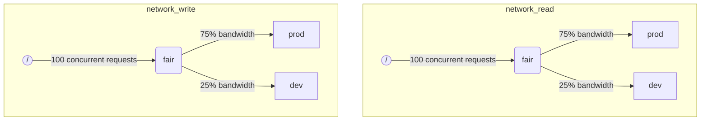

ClickHouseが複数のクエリを同時に実行する際、共有リソース（例えば、ディスク）を使用することがあります。スケジューリングの制約やポリシーを適用することで、異なるワークロード間でリソースがどのように利用され、共有されるかを制御できます。リソースごとにスケジューリング階層を構成できます。階層のルートはリソースを表し、リーフはリソースの容量を超えるリクエストを保持するキューです。

:::note
現在、ディスクIOのスケジューリングは記載された方法でのみ可能です。CPUのスケジューリングについては、スレッドプールと [`concurrent_threads_soft_limit_num`](server-configuration-parameters/settings.md#concurrent_threads_soft_limit_num) に関する設定を参照してください。柔軟なメモリ制限については、[Memory overcommit](settings/memory-overcommit.md) を参照してください。
:::

## ディスク設定 {#disk-config}

特定のディスクに対してIOスケジューリングを有効にするには、ストレージ設定で `read_resource` と/または `write_resource` を指定する必要があります。これにより、ClickHouseは指定されたディスクに対するすべての読み取りおよび書き込みリクエストのためにどのリソースを使用するかを指示します。読み取りリソースと書き込みリソースは同じリソース名を参照することができ、これはローカルのSSDやHDDに便利です。また、複数の異なるディスクが同じリソースを参照することもでき、これはリモートディスクにとって有用です。例えば、「本番」と「開発」ワークロード間でネットワーク帯域を公平に分配できるようにしたい場合にそうです。

例:
```xml
<clickhouse>
    <storage_configuration>
        ...
        <disks>
            <s3>
                <type>s3</type>
                <endpoint>https://clickhouse-public-datasets.s3.amazonaws.com/my-bucket/root-path/</endpoint>
                <access_key_id>your_access_key_id</access_key_id>
                <secret_access_key>your_secret_access_key</secret_access_key>
                <read_resource>network_read</read_resource>
                <write_resource>network_write</write_resource>
            </s3>
        </disks>
        <policies>
            <s3_main>
                <volumes>
                    <main>
                        <disk>s3</disk>
                    </main>
                </volumes>
            </s3_main>
        </policies>
    </storage_configuration>
</clickhouse>
```

リソースがどのディスクを使用するかを表現する別の方法は、SQL構文です。

```sql
CREATE RESOURCE resource_name (WRITE DISK disk1, READ DISK disk2)
```

リソースは、READまたはWRITE、あるいはREADおよびWRITEのいずれかとして任意の数のディスクに使用できます。すべてのディスクにリソースを使用するための構文もあります。

```sql
CREATE RESOURCE all_io (READ ANY DISK, WRITE ANY DISK);
```

サーバー設定オプションがリソースを定義するSQLの方法よりも優先されることに注意してください。

## ワークロードマークアップ {#workload_markup}

クエリは、異なるワークロードを区別するために `workload` を設定することでマークすることができます。`workload` が設定されていない場合、デフォルトで値 "default" が使用されます。他の値を設定プロファイルを使って指定することも可能です。全てのユーザーのクエリが固定された `workload` 設定の値でマークされることを望む場合は、制約設定を使用して `workload` を定数として設定できます。

バックグラウンドアクティビティに対して `workload` 設定を割り当てることも可能です。マージやミューテーションは、それぞれ `merge_workload` と `mutation_workload` サーバー設定を使用します。これらの値は、特定のテーブルに対して `merge_workload` および `mutation_workload` マージツリー設定を使用して上書きすることもできます。

以下に、「本番」と「開発」の2つの異なるワークロードを持つシステムの例を考えます。

```sql
SELECT count() FROM my_table WHERE value = 42 SETTINGS workload = 'production'
SELECT count() FROM my_table WHERE value = 13 SETTINGS workload = 'development'
```

## リソーススケジューリング階層 {#hierarchy}

スケジューリングサブシステムの観点から、リソースはスケジューリングノードの階層を表します。



**可能なノードタイプ:**
* `inflight_limit` (制約) - 同時に処理中のリクエスト数が `max_requests` を超えるか、またはその総コストが `max_cost` を超える場合にブロックします。子ノードは1つだけ必要です。
* `bandwidth_limit` (制約) - 現在の帯域幅が `max_speed` を超える（0は無制限を意味します）か、バーストが `max_burst` を超える場合にブロックします（デフォルトでは `max_speed` に等しい）。子ノードは1つだけ必要です。
* `fair` (ポリシー) - 最大最小公平性に基づいて、子ノードの中から次のリクエストを選択して処理します。子ノードは `weight` を指定できます（デフォルトは1）。
* `priority` (ポリシー) - 静的優先度に応じて、子ノードの中から次のリクエストを選択して処理します（値が低いほど優先度が高いことを意味します）。子ノードは `priority` を指定できます（デフォルトは0）。
* `fifo` (キュー) - リソース容量を超えるリクエストを保持することができる階層のリーフです。

基盤リソースのフルキャパシティを使用できるようにするためには、`inflight_limit` を使用する必要があります。`max_requests` や `max_cost` の数が低すぎるとリソースがフルに利用されない可能性があり、逆に高すぎるとスケジューラ内部でキューが空になることになり、ポリシーが無視される（不公平や優先度の無視）が発生します。一方、リソースが高すぎる利用から保護したい場合は、`bandwidth_limit` を使用するべきです。これは、`duration` 秒で消費されるリソース量が `max_burst + max_speed * duration` バイトを超えた場合に制限します。同じリソース上に2つの `bandwidth_limit` ノードを使って、短時間のピーク帯域幅を制限し、長時間の平均帯域幅を制限できます。

以下の例は、図に示したIOスケジューリング階層を定義する方法を示しています。

```xml
<clickhouse>
    <resources>
        <network_read>
            <node path="/">
                <type>inflight_limit</type>
                <max_requests>100</max_requests>
            </node>
            <node path="/fair">
                <type>fair</type>
            </node>
            <node path="/fair/prod">
                <type>fifo</type>
                <weight>3</weight>
            </node>
            <node path="/fair/dev">
                <type>fifo</type>
            </node>
        </network_read>
        <network_write>
            <node path="/">
                <type>inflight_limit</type>
                <max_requests>100</max_requests>
            </node>
            <node path="/fair">
                <type>fair</type>
            </node>
            <node path="/fair/prod">
                <type>fifo</type>
                <weight>3</weight>
            </node>
            <node path="/fair/dev">
                <type>fifo</type>
            </node>
        </network_write>
    </resources>
</clickhouse>
```

## ワークロード分類子 {#workload_classifiers}

ワークロード分類子は、クエリで指定された `workload` から特定のリソースに使用されるリーフキューへのマッピングを定義するために使用されます。現在、ワークロード分類は単純です：静的マッピングのみが利用可能です。

例:
```xml
<clickhouse>
    <workload_classifiers>
        <production>
            <network_read>/fair/prod</network_read>
            <network_write>/fair/prod</network_write>
        </production>
        <development>
            <network_read>/fair/dev</network_read>
            <network_write>/fair/dev</network_write>
        </development>
        <default>
            <network_read>/fair/dev</network_read>
            <network_write>/fair/dev</network_write>
        </default>
    </workload_classifiers>
</clickhouse>
```

## ワークロード階層 (SQLのみ) {#workloads}

XMLでリソースや分類子を定義するのは面倒なことがあります。ClickHouseは、より便利なSQL構文を提供します。`CREATE RESOURCE` で作成されたすべてのリソースは同じ階層の構造を共有しますが、いくつかの側面で異なる場合があります。 `CREATE WORKLOAD` で作成された各ワークロードは、各リソースのために自動的に作成されたスケジューリングノードを維持します。子ワークロードは、別の親ワークロード内で作成することができます。以下に、上記のXML設定とまったく同じ階層を定義する例を示します。

```sql
CREATE RESOURCE network_write (WRITE DISK s3)
CREATE RESOURCE network_read (READ DISK s3)
CREATE WORKLOAD all SETTINGS max_requests = 100
CREATE WORKLOAD development IN all
CREATE WORKLOAD production IN all SETTINGS weight = 3
```

子ノードのないリーフワークロードの名前は、クエリ設定 `SETTINGS workload = 'name'` で使用できます。SQL構文を使用する際には、ワークロード分類子も自動的に作成されることに注意してください。

ワークロードをカスタマイズするために使用できる設定は次のとおりです：
* `priority` - 同じレベルにあるワークロードは、静的優先度値に従って処理されます（値が低いほど優先度が高いことを意味します）。
* `weight` - 同じ静的優先度を持つ兄弟ワークロードは、重みの比率に応じてリソースを共有します。
* `max_requests` - このワークロードでの同時リソースリクエストの最大数の制限です。
* `max_cost` - このワークロードでの同時リソースリクエストの総バイト数の最大制限です。
* `max_speed` - このワークロードのバイト処理速度の制限です（リソースごとに制限は独立しています）。
* `max_burst` - ワークロードが制限されずに処理できる最大バイト数です（リソースごとに独立）。

ワークロード設定は、適切なスケジューリングノードのセットに翻訳されることに注意してください。詳細については、スケジューリングノードの[タイプとオプション](#hierarchy)の説明を参照してください。

異なるリソースに対して異なるワークロード階層を指定することはできませんが、特定のリソースに対して異なるワークロード設定値を指定する方法はあります。

```sql
CREATE OR REPLACE WORKLOAD all SETTINGS max_requests = 100, max_speed = 1000000 FOR network_read, max_speed = 2000000 FOR network_write
```

さらに、別のワークロードから参照されている場合は、ワークロードやリソースを削除することはできません。ワークロードの定義を更新するには、 `CREATE OR REPLACE WORKLOAD` クエリを使用してください。

## ワークロードとリソースストレージ {#workload_entity_storage}

すべてのワークロードとリソースの定義は、`CREATE WORKLOAD` および `CREATE RESOURCE` クエリの形式で、 `workload_path` でディスクに永続的に保存されるか、`workload_zookeeper_path` でZooKeeperに保存されます。ノード間の一貫性を確保するためにはZooKeeperストレージが推奨されます。代わりに、ディスクストレージとともに `ON CLUSTER` 句を使用することもできます。

## 厳格なリソースアクセス {#strict-resource-access}

すべてのクエリがリソーススケジューリングポリシーに従うことを強制するには、サーバー設定 `throw_on_unknown_workload` を使用します。これが `true` に設定されている場合、すべてのクエリは有効な `workload` クエリ設定を使用することが要求され、それ以外の場合 `RESOURCE_ACCESS_DENIED` 例外がスローされます。これが `false` に設定されている場合、そのようなクエリはリソーススケジューラを使用せず、すなわち任意の `RESOURCE` に無制限にアクセスできます。

:::note
`CREATE WORKLOAD default` が実行されている場合を除き、`throw_on_unknown_workload` を `true` に設定しないでください。明示的な `workload` 設定がないクエリが起動時に実行されると、サーバーの起動問題につながる可能性があります。
:::

## 関連項目 {#see-also}
 - [system.scheduler](/operations/system-tables/scheduler.md)
 - [system.workloads](/operations/system-tables/workloads.md)
 - [system.resources](/operations/system-tables/resources.md)
 - [merge_workload](/operations/settings/merge-tree-settings.md#merge_workload) マージツリー設定
 - [merge_workload](/operations/server-configuration-parameters/settings.md#merge_workload) グローバルサーバー設定
 - [mutation_workload](/operations/settings/merge-tree-settings.md#mutation_workload) マージツリー設定
 - [mutation_workload](/operations/server-configuration-parameters/settings.md#mutation_workload) グローバルサーバー設定
 - [workload_path](/operations/server-configuration-parameters/settings.md#workload_path) グローバルサーバー設定
 - [workload_zookeeper_path](/operations/server-configuration-parameters/settings.md#workload_zookeeper_path) グローバルサーバー設定
