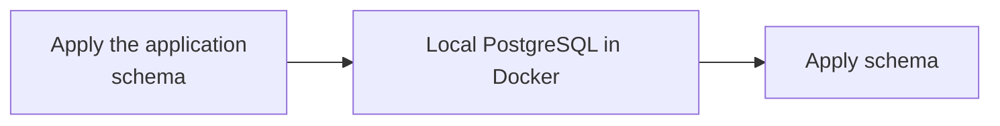
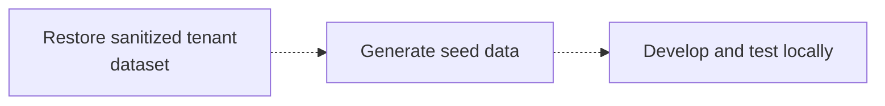

Managed Postgres는 표준 PostgreSQL 기반으로 구축되었으며, 기존 PostgreSQL 생태계와 호환됩니다. 대부분의 개발 작업에서는 Cloud 배포를 사용하는 대신 Docker에서 실행되는 로컬 PostgreSQL 인스턴스를 대상으로 개발하고 테스트할 수 있습니다.

이 접근 방식은 빠르게 피드백을 얻을 수 있게 하고, 초기 설정을 단순화하며, 공유 인프라에 대한 의존성을 줄이고, 프로덕션 시스템에 영향을 주지 않고 안전하게 실험할 수 있도록 해줍니다.

목표는 프로덕션 환경을 완전히 동일하게 재현하는 것이 아닙니다. 대신 다음 조건을 충족하는, 재현 가능한 로컬 환경을 구축하십시오.

* 프로덕션과 동일한 PostgreSQL 메이저 버전을 사용합니다.
* 프로덕션과 동일한 스키마 정의를 적용합니다.
* 개발에 적합한 대표 데이터를 포함합니다.
* 일반적인 애플리케이션 개발 및 테스트 워크플로를 지원합니다.

Managed Postgres는 표준 PostgreSQL이므로 기존 마이그레이션 프레임워크, 스키마 관리 도구, 데이터 시딩 방식도 별도 수정 없이 사용할 수 있습니다.

## 개발 흐름 예시 \{#example-development-flow\}

일반적인 로컬 개발 워크플로는 다음과 같습니다.





Managed Postgres는 기존 PostgreSQL 개발 워크플로에 자연스럽게 통합됩니다. 로컬 PostgreSQL 인스턴스를 대상으로 개발하면 팀이 빠르게 반복 작업을 진행하고, 재현 가능한 환경을 유지하며, 애플리케이션을 Managed Postgres에 배포했을 때도 일관되게 동작할 것이라는 확신을 가질 수 있습니다.

## Docker로 로컬에서 PostgreSQL 실행 \{#run-postgresql-locally-with-docker\}

로컬 개발 환경을 구성하는 가장 간단한 방법은 Docker에서 PostgreSQL을 실행하는 것입니다.

Managed Postgres 배포에 맞는 PostgreSQL 버전을 선택하십시오:

```yaml title="docker-compose.yml"
services:
  postgres:
    image: postgres:18
    container_name: local-postgres
    restart: unless-stopped

    environment:
      POSTGRES_USER: postgres
      POSTGRES_PASSWORD: postgres
      POSTGRES_DB: app

    ports:
      - "15432:5432"

    volumes:
      - postgres_data:/var/lib/postgresql

volumes:
  postgres_data:
```

PostgreSQL을 시작하세요:

```bash
docker compose up -d
```

연결 여부를 확인하십시오:

```bash
psql -h localhost -U postgres -p 15432 -d app
```

이 시점에서는 PostgreSQL이 로컬에서 실행 중이지만, 아직 애플리케이션 스키마나 개발용 데이터는 없습니다.

## 애플리케이션 스키마 적용 \{#apply-the-application-schema\}

로컬 환경에서 스키마를 생성하는 방법에는 정해진 단일 방식이 없습니다. 대부분의 조직은 이미 확립된 스키마 관리 워크플로를 갖추고 있으므로, 이를 그대로 재사용할 수 있습니다.

### 애플리케이션 마이그레이션 \{#application-migrations\}

많은 팀이 staging 및 프로덕션 환경에서 실행하는 것과 동일한 마이그레이션 프레임워크를 사용합니다. 예를 들어 Flyway, Liquibase, Rails migrations, Django migrations, Prisma migrations, Alembic 같은 도구가 있습니다.

로컬에서 마이그레이션을 적용하면 일반적인 개발 과정의 일부로 스키마 변경이 지속적으로 검증되도록 할 수 있습니다.

```bash
./migrate up
# or
npm run migrate
# or
rails db:migrate
```

### 스키마 전용 PostgreSQL 덤프 \{#schema-only-postgresql-dumps\}

스키마만 포함된 PostgreSQL 내보내기를 사용하면 기존 데이터베이스 구조를 재현할 수 있습니다. 이는 온보딩, 스키마 동작 조사, 호환성 검증 또는 개발 환경의 신속한 초기 구성에 유용합니다.

스키마를 내보내세요:

```bash
pg_dump \
  --schema-only \
  --no-owner \
  --no-privileges \
  -h <host> \
  -U <user> \
  -d <database> \
  > schema.sql
```

로컬에서 복원하기:

```bash
psql \
  -h localhost \
  -U postgres \
  -p 15432    \
  -d app \
  -f schema.sql
```

### 버전 관리에 포함된 SQL 정의 \{#checked-in-sql-definitions\}

일부 팀은 스키마 정의를 SQL 파일 형태로 소스 제어에서 직접 관리합니다. 이러한 정의는 환경 설정 과정에서 로컬 PostgreSQL 인스턴스에 직접 적용할 수 있습니다.

어떤 방식을 사용하든 중요한 점은 스키마 생성이 자동화되고, 재현 가능하며, 버전 관리되는 정의를 기반으로 이루어진다는 것입니다.

## 대표적인 개발용 데이터 채우기 \{#populate-representative-development-data\}

스키마(schema)가 준비되면 데이터베이스를 대표적인 개발용 데이터로 채우십시오.

대부분의 개발 워크플로에서는 seed 스크립트로 생성한 합성 데이터셋만으로 충분합니다. 이러한 데이터셋은 다시 만들기 쉽고, 안전하게 공유할 수 있으며, 운영 데이터에 수반되는 컴플라이언스 및 보안 관련 고려 사항을 피할 수 있습니다.

SaaS 애플리케이션에서 일반적으로 사용하는 방법은 소수의 sample 테넌트용 데이터를 생성하고, 사용자, 제품, 주문 및 기타 비즈니스 엔터티 간에 현실적인 관계를 구성하는 것입니다.

### 다중 테넌트 스키마 예시 \{#example-multi-tenant-schema\}

다음 스키마는 단순화한 다중 테넌트 SaaS 애플리케이션의 구조를 보여줍니다:

```sql
CREATE TABLE tenants (
    id UUID PRIMARY KEY,
    name TEXT NOT NULL
);

CREATE TABLE users (
    id UUID PRIMARY KEY,
    tenant_id UUID NOT NULL REFERENCES tenants(id),
    email TEXT NOT NULL,
    first_name TEXT,
    last_name TEXT,
    created_at TIMESTAMP DEFAULT now()
);

CREATE TABLE products (
    id UUID PRIMARY KEY,
    tenant_id UUID NOT NULL REFERENCES tenants(id),
    name TEXT NOT NULL,
    price NUMERIC(10,2)
);

CREATE TABLE orders (
    id UUID PRIMARY KEY,
    tenant_id UUID NOT NULL REFERENCES tenants(id),
    user_id UUID NOT NULL REFERENCES users(id),
    status TEXT,
    created_at TIMESTAMP DEFAULT now()
);

CREATE TABLE order_items (
    id UUID PRIMARY KEY,
    order_id UUID NOT NULL REFERENCES orders(id),
    product_id UUID NOT NULL REFERENCES products(id),
    quantity INTEGER
);

CREATE TABLE audit_logs (
    id UUID PRIMARY KEY,
    tenant_id UUID NOT NULL REFERENCES tenants(id),
    entity_type TEXT,
    entity_id UUID,
    action TEXT,
    created_at TIMESTAMP DEFAULT now()
);
```

### 샘플 데이터 생성 \{#generate-sample-data\}

의존 패키지를 설치합니다:

```bash
pip install faker psycopg2-binary
```

`seed.py` 파일을 만드세요:

```python title="seed.py"
import random
import uuid

import psycopg2
from faker import Faker

fake = Faker()

conn = psycopg2.connect(
    host="localhost",
    port=15432,
    dbname="app",
    user="postgres",
    password="postgres"
)

cur = conn.cursor()

tenant_ids = []

for tenant_name in [
    "Tenant A",
    "Tenant B",
    "Tenant C"
]:
    tenant_id = str(uuid.uuid4())
    tenant_ids.append(tenant_id)

    cur.execute(
        """
        INSERT INTO tenants(id, name)
        VALUES (%s, %s)
        """,
        (tenant_id, tenant_name)
    )

for tenant_id in tenant_ids:

    users = []
    products = []

    for _ in range(20):
        user_id = str(uuid.uuid4())
        users.append(user_id)

        cur.execute(
            """
            INSERT INTO users(
                id,
                tenant_id,
                email,
                first_name,
                last_name
            )
            VALUES (%s,%s,%s,%s,%s)
            """,
            (
                user_id,
                tenant_id,
                fake.email(),
                fake.first_name(),
                fake.last_name()
            )
        )

    for _ in range(15):
        product_id = str(uuid.uuid4())
        products.append(product_id)

        cur.execute(
            """
            INSERT INTO products(
                id,
                tenant_id,
                name,
                price
            )
            VALUES (%s,%s,%s,%s)
            """,
            (
                product_id,
                tenant_id,
                fake.word(),
                round(random.uniform(10, 500), 2)
            )
        )

    for _ in range(50):

        order_id = str(uuid.uuid4())

        cur.execute(
            """
            INSERT INTO orders(
                id,
                tenant_id,
                user_id,
                status
            )
            VALUES (%s,%s,%s,%s)
            """,
            (
                order_id,
                tenant_id,
                random.choice(users),
                random.choice([
                    "pending",
                    "completed",
                    "cancelled"
                ])
            )
        )

        for _ in range(random.randint(1, 5)):
            cur.execute(
                """
                INSERT INTO order_items(
                    id,
                    order_id,
                    product_id,
                    quantity
                )
                VALUES (%s,%s,%s,%s)
                """,
                (
                    str(uuid.uuid4()),
                    order_id,
                    random.choice(products),
                    random.randint(1, 10)
                )
            )

        cur.execute(
            """
            INSERT INTO audit_logs(
                id,
                tenant_id,
                entity_type,
                entity_id,
                action
            )
            VALUES (%s,%s,%s,%s,%s)
            """,
            (
                str(uuid.uuid4()),
                tenant_id,
                "order",
                order_id,
                "created"
            )
        )

conn.commit()
conn.close()
```

스크립트를 실행합니다.

```bash
python seed.py
```

결과 데이터셋에는 다음이 포함됩니다:

| 테이블             | 레코드 수 |
| --------------- | ----- |
| tenants         | 3     |
| users           | 60    |
| products        | 45    |
| orders          | 150   |
| order&#95;items | 400+  |
| audit&#95;logs  | 150+  |

이 데이터셋은 일반적인 애플리케이션 워크플로, 테넌트 격리 로직, 보고용 쿼리, 관계 무결성 검증을 수행하기에 충분한 규모이면서도 로컬 개발과 테스트에는 부담이 없습니다.

## PostgreSQL + ClickHouse 개발 환경 \{#postgresql-clickhouse-development-environment\}

위 예시는 로컬 PostgreSQL 개발에 중점을 두고 있습니다. PostgreSQL에서 ClickHouse로 이어지는 전체 아키텍처를 로컬에서 테스트하려면 오픈소스 PostgreSQL + ClickHouse 스택을 실행하면 됩니다.

이 스택은 트랜잭션 워크로드를 위한 PostgreSQL, 분석을 위한 ClickHouse, 그리고 네이티브 CDC(Change Data Capture)를 위한 PeerDB를 결합합니다. PostgreSQL을 기준으로 개발하면서 데이터를 ClickHouse로 지속적으로 복제할 수 있으므로, 노트북에서 직접 운영 분석, 보고 워크로드, 실시간 데이터 파이프라인을 테스트할 수 있습니다.

이 스택은 단일 명령으로 시작할 수 있으며, 필요한 모든 서비스가 사전 구성된 상태로 포함되어 있습니다:

```bash
git clone https://github.com/ClickHouse/postgres-clickhouse-stack.git
cd postgres-clickhouse-stack

./run.sh start
```

스택에는 다음이 포함됩니다:

* PostgreSQL
* ClickHouse
* PostgreSQL CDC용 PeerDB
* 지원 서비스 및 샘플 애플리케이션

설정 방법, 아키텍처 세부 정보, 전체 스택에 대한 단계별 안내는 다음을 참조하십시오:

* [블로그: PostgreSQL + ClickHouse OSS](https://clickhouse.com/blog/postgres-clickhouse-oss)
* [GitHub: postgres-clickhouse-stack](https://github.com/ClickHouse/postgres-clickhouse-stack)

애플리케이션이 로컬에서 PostgreSQL을 대상으로 실행되고 있고 PostgreSQL에서 ClickHouse로의 동기화, 실시간 분석, 엔드투엔드 애플리케이션 동작을 검증하려는 경우 유용한 다음 단계입니다.