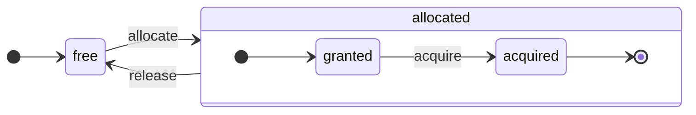

# 아키텍처 개요 \{#architecture-overview\}

ClickHouse는 진정한 컬럼 지향 DBMS입니다. 데이터는 컬럼 단위로 저장되며, 쿼리 실행 시에는 배열(벡터 또는 컬럼의 청크) 단위로 처리됩니다.
가능한 한 개별 값이 아니라 배열에 대해 연산이 수행되도록 합니다.
이를 「벡터화된 쿼리 실행」이라고 하며, 실제 데이터 처리 비용을 줄이는 데 도움이 됩니다.

이 아이디어는 새로운 것이 아닙니다.
그 기원은 `APL`(A programming language, 1957)과 그 파생 언어들인 `A +`(APL 방언), `J`(1990), `K`(1993), `Q`(Kx Systems의 프로그래밍 언어, 2003)로 거슬러 올라갑니다.
배열 프로그래밍은 과학 데이터 처리 분야에서 사용됩니다. 관계형 데이터베이스에서도 이 아이디어는 새롭지 않습니다. 예를 들어, `VectorWise` 시스템(Actian Corporation의 Actian Vector Analytic Database로도 알려져 있음)에 사용됩니다.

쿼리 처리 속도를 높이기 위한 접근 방식에는 벡터화된 쿼리 실행과 런타임 코드 생성이라는 두 가지가 있습니다. 후자는 모든 간접 참조와 동적 디스패치를 제거합니다. 두 접근 방식 중 어느 쪽도 절대적으로 더 뛰어난 것은 아닙니다. 런타임 코드 생성은 많은 연산을 결합하여 CPU 실행 유닛과 파이프라인을 완전히 활용할 수 있을 때 더 나을 수 있습니다. 벡터화된 쿼리 실행은 임시 벡터를 캐시에 기록하고 다시 읽어야 하므로, 실용성이 떨어질 수 있습니다. 임시 데이터가 L2 캐시에 맞지 않으면 문제가 됩니다. 하지만 벡터화된 쿼리 실행은 CPU의 SIMD 기능을 더 쉽게 활용합니다. 당사와 가까운 동료 연구진이 작성한 [연구 논문](http://15721.courses.cs.cmu.edu/spring2016/papers/p5-sompolski.pdf)에서는 두 접근 방식을 결합하는 것이 더 낫다는 점을 보여줍니다. ClickHouse는 벡터화된 쿼리 실행을 사용하며, 런타임 코드 생성에 대해서는 제한적인 초기 지원만 제공합니다.

## Columns \{#columns\}

`IColumn` 인터페이스는 메모리에서 컬럼(정확히는 컬럼의 청크)을 표현하는 데 사용됩니다. 이 인터페이스는 다양한 관계형 연산자 구현을 위한 보조 메서드를 제공합니다. 거의 모든 연산은 불변(immutable)으로 동작합니다. 원래 컬럼을 수정하지 않고, 수정된 새로운 컬럼을 생성합니다. 예를 들어, `IColumn :: filter` 메서드는 필터 바이트 마스크를 인자로 받습니다. 이는 `WHERE` 및 `HAVING` 관계형 연산자에서 사용됩니다. 추가 예로는 `ORDER BY`를 지원하는 `IColumn :: permute` 메서드, `LIMIT`을 지원하는 `IColumn :: cut` 메서드가 있습니다.

다양한 `IColumn` 구현(`ColumnUInt8`, `ColumnString` 등)은 컬럼의 메모리 레이아웃을 담당합니다. 메모리 레이아웃은 보통 연속된 배열입니다. 정수 타입 컬럼의 경우 `std :: vector`와 같이 하나의 연속된 배열입니다. `String` 및 `Array` 컬럼의 경우에는 두 개의 벡터로 구성됩니다. 하나는 모든 배열 요소를 연속적으로 저장하는 벡터이고, 다른 하나는 각 배열 시작 위치에 대한 오프셋을 저장하는 벡터입니다. 메모리에 단일 값만 저장하지만 컬럼처럼 동작하는 `ColumnConst`도 있습니다.

## Field \{#field\}

또한 개별 값으로 작업하는 것도 가능합니다. 개별 값을 표현하기 위해 `Field`를 사용합니다. `Field`는 `UInt64`, `Int64`, `Float64`, `String`, `Array`로 구성된 구분된 유니온(discriminated union)에 불과합니다. `IColumn`에는 n번째 값을 `Field`로 가져오는 `operator []` 메서드와, 컬럼 끝에 `Field`를 추가하는 `insert` 메서드가 있습니다. 이러한 메서드는 개별 값을 나타내는 임시 `Field` 객체를 다루어야 하므로 그다지 효율적이지 않습니다. `insertFrom`, `insertRangeFrom` 등 더 효율적인 메서드가 있습니다.

`Field`에는 테이블의 특정 데이터 타입에 대한 충분한 정보가 없습니다. 예를 들어, `UInt8`, `UInt16`, `UInt32`, `UInt64`는 모두 `Field` 내에서는 `UInt64`로 표현됩니다.

## Leaky abstractions \{#leaky-abstractions\}

`IColumn`에는 데이터에 대한 일반적인 관계형 연산을 위한 메서드가 있지만, 모든 요구 사항을 충족하지는 않습니다. 예를 들어, `ColumnUInt64`에는 두 컬럼의 합을 계산하는 메서드가 없고, `ColumnString`에는 부분 문자열 검색을 수행하는 메서드가 없습니다. 이러한 무수히 많은 루틴은 `IColumn` 외부에서 구현됩니다.

컬럼에 대한 다양한 함수는 `IColumn` 메서드를 사용하여 `Field` 값을 추출하는 일반적이지만 비효율적인 방식으로 구현할 수도 있고, 특정 `IColumn` 구현에서 데이터의 내부 메모리 레이아웃에 대한 지식을 활용해 특수화된 방식으로 구현할 수도 있습니다. 이것은 함수들을 특정 `IColumn` 타입으로 캐스팅하여 내부 표현을 직접 다루는 방식으로 구현됩니다. 예를 들어, `ColumnUInt64`에는 내부 배열에 대한 참조를 반환하는 `getData` 메서드가 있으며, 별도의 루틴이 그 배열을 직접 읽거나 채웁니다. 다양한 루틴을 효율적으로 특수화할 수 있도록 이러한 「새는 추상화(leaky abstractions)」를 사용합니다.

## Data types \{#data_types\}

`IDataType`는 직렬화/역직렬화를 담당하며, 이진 또는 텍스트 형식으로 컬럼 청크나 개별 값을 읽고 쓰는 역할을 합니다. `IDataType`는 테이블의 데이터 타입과 직접 대응합니다. 예를 들어, `DataTypeUInt32`, `DataTypeDateTime`, `DataTypeString` 등이 있습니다.

`IDataType`와 `IColumn`은 서로 느슨하게만 연관되어 있습니다. 서로 다른 데이터 타입이 메모리 내에서 동일한 `IColumn` 구현으로 표현될 수 있습니다. 예를 들어, `DataTypeUInt32`와 `DataTypeDateTime`은 모두 `ColumnUInt32` 또는 `ColumnConstUInt32`로 표현됩니다. 또한 동일한 데이터 타입이 서로 다른 `IColumn` 구현으로 표현될 수도 있습니다. 예를 들어, `DataTypeUInt8`은 `ColumnUInt8` 또는 `ColumnConstUInt8`로 표현될 수 있습니다.

`IDataType`는 메타데이터만 저장합니다. 예를 들어, `DataTypeUInt8`은 (가상 포인터 `vptr`을 제외하면) 아무것도 저장하지 않으며, `DataTypeFixedString`은 고정 길이 문자열의 크기인 `N`만 저장합니다.

`IDataType`에는 다양한 데이터 형식을 위한 보조 메서드가 있습니다. 예를 들면, 값에 따옴표를 붙여 직렬화하는 메서드, JSON용으로 값을 직렬화하는 메서드, XML 형식의 일부로 값을 직렬화하는 메서드 등이 있습니다. 데이터 형식과의 직접적인 일대일 대응 관계는 없습니다. 예를 들어, 서로 다른 데이터 형식인 `Pretty`와 `TabSeparated`는 `IDataType` 인터페이스의 동일한 보조 메서드인 `serializeTextEscaped`를 사용할 수 있습니다.

## Block \{#block\}

`Block`은 메모리 내 테이블의 부분집합(청크)을 나타내는 컨테이너입니다. 단순히 `(IColumn, IDataType, column name)`으로 이루어진 트리플 집합입니다. 쿼리 실행 중에는 데이터가 `Block` 단위로 처리됩니다. `Block`이 있으면 데이터(`IColumn` 객체 안에 있음)가 있고, 해당 컬럼을 어떻게 처리해야 하는지 알려주는 타입 정보(`IDataType` 안에 있음)가 있으며, 컬럼 이름이 있습니다. 컬럼 이름은 테이블의 원래 컬럼 이름일 수도 있고, 계산의 임시 결과를 얻기 위해 임의로 부여한 이름일 수도 있습니다.

`Block` 안의 컬럼들에 대해 어떤 함수를 계산할 때는, 그 결과를 담은 또 다른 컬럼을 `Block`에 추가하고, 연산은 변경 불가능(immutable)하므로 함수의 인자 컬럼들은 수정하지 않습니다. 이후 필요하지 않은 컬럼은 `Block`에서 제거할 수 있지만, 변경할 수는 없습니다. 이는 공통 부분식 제거(common subexpression elimination)를 수행하는 데 편리합니다.

Block은 처리되는 각 데이터 청크마다 생성됩니다. 동일한 유형의 계산에 대해서는, 서로 다른 Block들 사이에서 컬럼 이름과 타입은 동일하게 유지되고 컬럼 데이터만 변경된다는 점에 유의해야 합니다. 작은 Block 크기에서는 `shared_ptr`과 컬럼 이름을 복사하기 위한 임시 문자열의 오버헤드가 크므로, Block 데이터와 Block 헤더를 분리하는 편이 더 좋습니다.

## 프로세서 \{#processors\}

설명은 다음 문서를 참조하십시오: [https://github.com/ClickHouse/ClickHouse/blob/master/src/Processors/IProcessor.h](https://github.com/ClickHouse/ClickHouse/blob/master/src/Processors/IProcessor.h).

## 형식 \{#formats\}

데이터 형식은 프로세서를 통해 구현됩니다.

## I/O \{#io\}

바이트 기반 입력/출력을 위해 `ReadBuffer`와 `WriteBuffer` 추상 클래스가 있습니다. 이는 C++ `iostream` 대신 사용됩니다. 걱정할 필요는 없습니다. 성숙한 C++ 프로젝트에서는 모두 타당한 이유로 `iostream`이 아닌 다른 방식을 사용합니다.

`ReadBuffer`와 `WriteBuffer`는 연속적인 버퍼와 그 버퍼 내의 위치를 가리키는 커서에 불과합니다. 구현체는 버퍼에 대한 메모리를 소유할 수도 있고 소유하지 않을 수도 있습니다. 버퍼를 다음 데이터로 채우기 위한 가상 메서드(`ReadBuffer`의 경우)나, 버퍼의 내용을 어딘가로 플러시하기 위한 가상 메서드(`WriteBuffer`의 경우)가 있습니다. 이 가상 메서드들은 자주 호출되지는 않습니다.

`ReadBuffer`/`WriteBuffer` 구현체는 파일, 파일 디스크립터, 네트워크 소켓을 다루는 데 사용되며, 압축을 구현하기 위해서도 사용됩니다(`CompressedWriteBuffer`는 다른 WriteBuffer로 초기화되며, 그 WriteBuffer에 데이터를 쓰기 전에 압축을 수행합니다). 이 외에도 다양한 목적에 사용되며, `ConcatReadBuffer`, `LimitReadBuffer`, `HashingWriteBuffer`와 같은 이름만으로도 용도가 어느 정도 드러납니다.

Read/WriteBuffer는 바이트만 처리합니다. 입력/출력 포매팅을 도와주는 `ReadHelpers`와 `WriteHelpers` 헤더 파일의 함수들이 있습니다. 예를 들어, 숫자를 10진수 형식으로 기록하는 헬퍼가 있습니다.

이제 `JSON` 형식으로 결과 집합을 stdout에 기록하려 할 때 내부에서 어떤 일이 일어나는지 살펴보겠습니다.
풀링 `QueryPipeline`에서 가져올 준비가 된 결과 집합이 있다고 가정합니다.
먼저, stdout에 바이트를 쓰기 위해 `WriteBufferFromFileDescriptor(STDOUT_FILENO)`를 생성합니다.
다음으로, 쿼리 파이프라인의 결과를 `JSONRowOutputFormat`에 연결합니다. 이 포맷은 해당 `WriteBuffer`로 초기화되며, stdout에 `JSON` 형식으로 행을 기록합니다.
이는 풀링 `QueryPipeline`을 완료된 `QueryPipeline`으로 변환하는 `complete` 메서드를 통해 수행할 수 있습니다.
내부적으로 `JSONRowOutputFormat`은 다양한 JSON 구분 기호를 쓰고, `IDataType::serializeTextJSON` 메서드를 `IColumn` 참조와 행 번호를 인자로 전달하여 호출합니다. 결과적으로 `IDataType::serializeTextJSON`은 `WriteHelpers.h`의 메서드를 호출합니다. 예를 들어, 숫자형에는 `writeText`를, `DataTypeString`에는 `writeJSONString`를 호출합니다.

## 테이블 \{#tables\}

`IStorage` 인터페이스는 테이블을 나타냅니다. 이 인터페이스의 각기 다른 구현이 서로 다른 테이블 엔진입니다. 예로는 `StorageMergeTree`, `StorageMemory` 등이 있습니다. 이러한 클래스의 인스턴스가 곧 테이블 그 자체입니다.

`IStorage`의 핵심 메서드는 `read`와 `write`이며, 이 외에도 `alter`, `rename`, `drop` 등이 있습니다. `read` 메서드는 다음 매개변수를 받습니다: 테이블에서 읽을 컬럼 집합, 고려할 `AST` 쿼리, 그리고 원하는 스트림 개수입니다. 이 메서드는 `Pipe`를 반환합니다.

대부분의 경우 `read` 메서드는 지정된 컬럼을 테이블에서 읽는 역할만 하며, 그 이후의 데이터 처리는 담당하지 않습니다.
이후의 모든 데이터 처리는 파이프라인의 다른 부분에서 처리되며, 이는 `IStorage`의 책임 범위를 벗어납니다.

하지만 중요한 예외가 있습니다:

- AST 쿼리가 `read` 메서드에 전달되며, 테이블 엔진은 이를 활용해 인덱스 사용 여부를 판단하고 테이블에서 읽는 데이터 양을 줄일 수 있습니다.
- 때로는 테이블 엔진이 특정 단계까지 데이터를 직접 처리할 수 있습니다. 예를 들어 `StorageDistributed`는 쿼리를 원격 서버에 전송하고, 각 서버가 서로 다른 원격 서버의 데이터를 병합할 수 있는 단계까지 데이터를 처리하도록 요청한 뒤, 그 전처리된 데이터를 반환할 수 있습니다. 이후 쿼리 인터프리터가 데이터 처리를 마무리합니다.

테이블의 `read` 메서드는 여러 `Processor`로 구성된 `Pipe`를 반환할 수 있습니다. 이러한 `Processor`는 테이블에서 병렬로 읽기를 수행할 수 있습니다.
그 다음 이 프로세서들을 다양한 다른 변환(예: 표현식 평가나 필터링)과 연결할 수 있으며, 이는 독립적으로 계산될 수 있습니다.
그리고 그 위에 `QueryPipeline`을 생성하고, `PipelineExecutor`를 통해 실행합니다.

`TableFunction`도 있습니다. 이는 쿼리의 `FROM` 절에서 사용할 임시 `IStorage` 객체를 반환하는 함수입니다.

자신의 테이블 엔진을 어떻게 구현할지 빠르게 파악하려면, `StorageMemory`나 `StorageTinyLog`처럼 단순한 예를 살펴보십시오.

> `read` 메서드의 결과로, `IStorage`는 스토리지 내부에서 쿼리의 어떤 부분이 이미 계산되었는지에 대한 정보인 `QueryProcessingStage`를 반환합니다.

## Parsers \{#parsers\}

수동으로 구현된 재귀 하강 파서가 쿼리를 파싱합니다. 예를 들어 `ParserSelectQuery`는 쿼리의 다양한 파트에 대해 하위 파서를 재귀적으로 호출합니다. 파서는 `AST`를 생성합니다. `AST`는 `IAST` 인스턴스인 노드들로 표현됩니다.

> 역사적인 이유로 파서 제너레이터(parser generator)는 사용하지 않습니다.

## Interpreters \{#interpreters\}

Interpreters는 AST로부터 쿼리 실행 파이프라인을 생성하는 역할을 합니다. `InterpreterExistsQuery` 및 `InterpreterDropQuery`와 같은 단순한 Interpreter도 있고, 더 정교한 `InterpreterSelectQuery`도 있습니다.

쿼리 실행 파이프라인은 청크(특정 타입을 가진 컬럼 집합)를 소비하고 생성할 수 있는 프로세서들의 조합입니다.
프로세서는 포트를 통해 통신하며, 여러 개의 입력 포트와 여러 개의 출력 포트를 가질 수 있습니다.
더 자세한 설명은 [src/Processors/IProcessor.h](https://github.com/ClickHouse/ClickHouse/blob/master/src/Processors/IProcessor.h)에서 확인할 수 있습니다.

예를 들어, `SELECT` 쿼리를 해석한 결과는 결과 집합을 읽기 위한 특수 출력 포트를 가진 「pulling」 `QueryPipeline`입니다.
`INSERT` 쿼리의 결과는 삽입할 데이터를 쓰기 위한 입력 포트를 가진 「pushing」 `QueryPipeline`입니다.
그리고 `INSERT SELECT` 쿼리를 해석한 결과는 입력이나 출력은 없지만 동시에 `SELECT`에서 `INSERT`로 데이터를 복사하는 「completed」 `QueryPipeline`입니다.

`InterpreterSelectQuery`는 쿼리 분석과 변환을 위해 `ExpressionAnalyzer` 및 `ExpressionActions` 메커니즘을 사용합니다. 대부분의 규칙 기반 쿼리 최적화가 여기에서 수행됩니다. `ExpressionAnalyzer`는 구조가 꽤 복잡하며, 다시 작성해야 합니다. 다양한 쿼리 변환과 최적화를 별도의 클래스로 분리하여 쿼리를 모듈 방식으로 변환할 수 있도록 해야 합니다.

Interpreters에 존재하는 문제를 해결하기 위해 새로운 `InterpreterSelectQueryAnalyzer`가 개발되었습니다. 이는 `ExpressionAnalyzer`를 사용하지 않고, `AST`와 `QueryPipeline` 사이에 `QueryTree`라는 추가 추상화 계층을 도입한 새로운 버전의 `InterpreterSelectQuery`입니다. 프로덕션 환경에서 사용하기에 완전히 준비된 상태이지만, 필요할 경우 `enable_analyzer` SETTING 값을 `false`로 설정하여 비활성화할 수 있습니다.

## Functions \{#functions\}

일반 함수와 집계 함수가 있습니다. 집계 함수에 대해서는 다음 섹션을 참조하십시오.

일반 함수는 행의 개수를 변경하지 않습니다. 각 행을 독립적으로 처리하는 것처럼 동작합니다. 실제로 함수는 개별 행에 대해 호출되는 것이 아니라, 벡터화된 쿼리 실행을 구현하기 위해 `Block` 단위의 데이터에 대해 호출됩니다.

[blockSize](/sql-reference/functions/other-functions#blockSize), [rowNumberInBlock](/sql-reference/functions/other-functions#rowNumberInBlock), [runningAccumulate](/sql-reference/functions/other-functions#runningAccumulate)처럼 블록 단위 처리를 활용하면서 행 간 독립성을 깨뜨리는 다양한 함수들도 있습니다.

ClickHouse는 강한 타입 시스템을 사용하므로 암시적 타입 변환이 없습니다. 함수가 특정 타입 조합을 지원하지 않으면 예외를 던집니다. 그러나 함수는 많은 다양한 타입 조합에 대해 동작하도록(오버로드되어) 구현될 수 있습니다. 예를 들어, `plus` 함수는 `+` 연산자를 구현하며, `UInt8` + `Float32`, `UInt16` + `Int8` 등 모든 숫자 타입 조합에 대해 동작합니다. 또한, `concat` 함수처럼 임의 개수의 인자를 받을 수 있는 가변 인자 함수도 있습니다.

함수는 지원하는 데이터 타입과 지원하는 `IColumns`를 명시적으로 디스패치해야 하므로, 구현이 다소 불편할 수 있습니다. 예를 들어, `plus` 함수는 각 숫자 타입 조합과 왼쪽/오른쪽 인자의 상수 및 비상수 여부마다 C++ 템플릿 인스턴스화를 통해 생성된 코드를 가지고 있습니다.

템플릿 코드가 비대해지는 것을 피하기 위해 런타임 코드 생성을 구현하기에 매우 적합한 지점입니다. 또한, fused multiply-add와 같은 융합(fused) 함수들을 추가하거나, 하나의 루프 반복에서 여러 비교를 수행할 수 있게 합니다.

벡터화된 쿼리 실행 방식 때문에 함수에는 단락 평가(short-circuit)가 적용되지 않습니다. 예를 들어 `WHERE f(x) AND g(y)`라고 작성하면, `f(x)`가 0인 행에 대해서도(단, `f(x)`가 값이 0인 상수 표현식인 경우는 제외) 양쪽이 모두 계산됩니다. 그러나 `f(x)` 조건의 선택도(selectivity)가 높고 `f(x)` 계산이 `g(y)`보다 훨씬 저렴하다면, 다중 패스 계산을 구현하는 것이 더 좋습니다. 먼저 `f(x)`를 계산하고, 그 결과로 컬럼을 필터링한 다음, 더 작아진 필터링된 데이터 청크(chunk)에 대해서만 `g(y)`를 계산하는 방식입니다.

## 집계 함수 \{#aggregate-functions\}

집계 함수는 상태를 갖는 함수입니다. 전달된 값을 어떤 상태에 누적하고, 그 상태로부터 결과를 얻을 수 있도록 합니다. 이 함수들은 `IAggregateFunction` 인터페이스로 관리됩니다. 상태는 비교적 단순할 수도 있고(예: `AggregateFunctionCount`의 상태는 단일 `UInt64` 값만 필요함), 상당히 복잡할 수도 있습니다(`AggregateFunctionUniqCombined`의 상태는 선형 배열, 해시 테이블, `HyperLogLog` 확률적 데이터 구조를 조합한 형태).

상태는 고(高) 카디널리티 `GROUP BY` 쿼리를 실행할 때 여러 상태를 효율적으로 다루기 위해 `Arena`(메모리 풀)에 할당됩니다. 상태는 비자명한 생성자와 소멸자를 가질 수 있습니다. 예를 들어, 복잡한 집계 상태는 자체적으로 추가 메모리를 할당할 수 있습니다. 따라서 상태를 생성·소멸하고, 소유권과 소멸 순서를 올바르게 관리하는 데 주의를 기울여야 합니다.

집계 상태는 분산 쿼리 실행 과정에서 네트워크를 통해 전달하거나, RAM이 충분하지 않은 경우 디스크에 기록하기 위해 직렬화 및 역직렬화할 수 있습니다. 또한 `DataTypeAggregateFunction`을 사용하여 테이블에 저장할 수도 있으며, 이를 통해 데이터의 점진적(증분) 집계를 수행할 수 있습니다.

> 집계 함수 상태의 직렬화된 데이터 포맷은 현재 버전 관리가 되어 있지 않습니다. 집계 상태를 일시적으로만 저장한다면 문제되지 않습니다. 하지만 점진적 집계를 위해 `AggregatingMergeTree` 테이블 엔진이 존재하고, 이미 프로덕션 환경에서 사용되고 있습니다. 그렇기 때문에 향후 어떤 집계 함수의 직렬화 포맷을 변경할 때는 하위 호환성을 반드시 보장해야 합니다.

## Server \{#server\}

서버는 다음과 같은 여러 인터페이스를 제공합니다:

- 외부 클라이언트를 위한 HTTP 인터페이스.
- 기본 ClickHouse 클라이언트와 분산 쿼리 실행 시 서버 간 통신을 위한 TCP 인터페이스.
- 복제를 위한 데이터 전송 인터페이스.

내부적으로는 코루틴이나 파이버 없이 동작하는 단순한 멀티스레드 서버일 뿐입니다. 서버는 단순 쿼리를 높은 빈도로 처리하도록 설계된 것이 아니라 상대적으로 낮은 빈도의 복잡한 쿼리를 처리하도록 설계되었기 때문에, 각 쿼리가 분석을 위해 방대한 양의 데이터를 처리할 수 있습니다.

서버는 쿼리 실행에 필요한 환경(사용 가능한 데이터베이스 목록, 사용자 및 액세스 권한, 설정, 클러스터, 프로세스 목록, 쿼리 로그 등)을 포함하는 `Context` 클래스를 초기화합니다. 인터프리터는 이 환경을 사용합니다.

서버 TCP 프로토콜에 대해 완전한 하위 및 상위 호환성을 유지합니다. 오래된 클라이언트는 새로운 서버와 통신할 수 있고, 새로운 클라이언트는 오래된 서버와 통신할 수 있습니다. 그러나 이를 영구적으로 유지하려는 것은 아니며, 대략 1년 정도가 지나면 오래된 버전에 대한 지원을 중단합니다.

:::note
대부분의 외부 애플리케이션에는 단순하고 사용하기 쉬운 HTTP 인터페이스 사용을 권장합니다. TCP 프로토콜은 내부 데이터 구조와 더 밀접하게 연결되어 있으며, 데이터 블록을 전달하기 위해 내부 포맷을 사용하고 압축 데이터에 대해 커스텀 프레이밍을 사용합니다. 이 프로토콜을 위한 C 라이브러리는 ClickHouse 코드베이스 대부분과의 링크가 필요하여 실용적이지 않기 때문에 아직 제공하지 않습니다.
:::

## Configuration \{#configuration\}

ClickHouse Server는 POCO C++ Libraries를 기반으로 하며, 구성을 표현하기 위해 `Poco::Util::AbstractConfiguration`을 사용합니다. 구성은 `DaemonBase` 클래스를 상속하는 `Poco::Util::ServerApplication` 클래스에 의해 관리되며, `DaemonBase`는 다시 clickhouse-server 자체를 구현하는 `DB::Server` 클래스가 상속합니다. 따라서 구성은 `ServerApplication::config()` 메서드를 통해 접근할 수 있습니다.

구성은 여러 개의 파일(XML 또는 YAML 형식)에서 읽어 들인 뒤 `ConfigProcessor` 클래스에 의해 단일 `AbstractConfiguration`으로 병합됩니다. 구성은 서버 시작 시 로드되며, 구성 파일 중 하나가 업데이트되거나 제거되거나 추가되면 이후에 다시 로드될 수 있습니다. `ConfigReloader` 클래스는 이러한 변경 사항을 주기적으로 모니터링하고 재로드 절차를 수행하는 역할을 담당합니다. `SYSTEM RELOAD CONFIG` 쿼리 또한 구성을 다시 로드하도록 트리거합니다.

`Server` 이외의 쿼리와 서브시스템에서 사용하는 구성은 `Context::getConfigRef()` 메서드를 통해 접근할 수 있습니다. 서버를 재시작하지 않고도 구성을 다시 로드할 수 있는 모든 서브시스템은 `Server::main()` 메서드의 재로드 콜백에 자신을 등록해야 합니다. 새로운 구성에 오류가 있는 경우 대부분의 서브시스템은 새로운 구성을 무시하고 경고 메시지를 기록한 뒤, 이전에 로드된 구성으로 계속 동작한다는 점에 유의해야 합니다. `AbstractConfiguration`의 특성상 특정 섹션에 대한 참조를 전달하는 것은 불가능하므로, 일반적으로 `String config_prefix`가 대신 사용됩니다.

### 컨텍스트 \{#context\}

ClickHouse는 컨텍스트 계층 구조를 통해 설정을 관리합니다:

* **전역 컨텍스트** - 설정 파일을 통해 정의되는 서버 전체 설정
* **세션 컨텍스트** - 프로파일, 사용자 설정 및 SET 명령에서 가져오는 사용자 세션 설정
* **쿼리 컨텍스트** - SETTINGS 절에서 지정하는 쿼리 수준 설정
* **백그라운드 컨텍스트** - 'background' 프로파일을 통해 정의되는 백그라운드 작업(Mutate, Merge)에 대한 서버 전체 설정

작업(쿼리, 뮤테이션 등)을 스케줄링할 때 서버는 다음 순서로 설정을 병합하여 특정 컨텍스트를 구성합니다(나중 항목이 앞선 항목을 덮어씁니다):

1. 전역 기본값
2. 전역 설정
3. 프로파일 설정 (`<profiles>` 섹션에서)
4. 사용자 설정 (`<users>` 섹션에서)
5. 세션 설정 (SET 명령에서)
6. 쿼리 설정 (SETTINGS 절에서)

:::note
백그라운드 작업은 전역 및 'background' 프로파일 설정을 통해 구성할 수 있으며, 이 경우 세션 및 쿼리 설정은 영향을 미치지 않습니다. 별도로 설정하지 않으면 전역 컨텍스트에서 설정을 상속합니다. 이러한 작업에 대한 기본 프로파일 이름은 'background'이며, `background_profile` 서버 설정을 통해 재정의할 수 있습니다.
:::

## Threads and jobs \{#threads-and-jobs\}

쿼리를 실행하고 부가적인 작업을 수행하기 위해 ClickHouse는 스레드를 자주 생성·소멸하지 않도록 여러 스레드 풀 중 하나에서 스레드를 할당합니다. 작업의 목적과 구조에 따라 선택되는 여러 개의 스레드 풀이 있습니다:

* 클라이언트 세션을 처리하는 서버 풀.
* 범용 작업, 백그라운드 작업 및 독립형 스레드를 위한 글로벌 스레드 풀.
* 대부분이 어떤 IO로 인해 블록되고 CPU 집약적이지 않은 작업을 위한 IO 스레드 풀.
* 주기적 작업을 위한 백그라운드 풀.
* 여러 단계로 분할할 수 있는 선점 가능한 작업을 위한 풀.

서버 풀은 `Server::main()` 메서드에서 정의되는 `Poco::ThreadPool` 클래스 인스턴스입니다. 최대 `max_connection`개의 스레드를 가질 수 있습니다. 각 스레드는 단일 활성 연결에 전담됩니다.

글로벌 스레드 풀은 `GlobalThreadPool` 싱글톤 클래스입니다. 여기에서 스레드를 할당하기 위해 `ThreadFromGlobalPool`이 사용됩니다. 이 클래스는 `std::thread`와 유사한 인터페이스를 가지지만, 글로벌 풀에서 스레드를 가져오고 필요한 초기화를 모두 수행합니다. 다음 설정으로 구성됩니다:

* `max_thread_pool_size` - 풀 내 스레드 수 한도.
* `max_thread_pool_free_size` - 새 작업을 기다리는 유휴 스레드 수 한도.
* `thread_pool_queue_size` - 대기 중인 작업 수 한도.

글로벌 풀은 범용이며, 아래에서 설명하는 모든 풀은 이 위에 구현됩니다. 이는 풀의 계층 구조로 볼 수 있습니다. 모든 특수화 풀은 `ThreadPool` 클래스를 사용하여 글로벌 풀에서 스레드를 가져옵니다. 따라서 특수화 풀의 주요 목적은 동시에 실행되는 작업 수에 제한을 걸고 작업 스케줄링을 수행하는 것입니다. 풀 내 스레드 수보다 더 많은 작업이 예약되면 `ThreadPool`은 작업을 우선순위가 있는 큐에 적재합니다. 각 작업에는 정수형 우선순위가 있습니다. 기본 우선순위는 0입니다. 높은 우선순위 값을 가진 모든 작업은 낮은 우선순위 값을 가진 작업보다 먼저 시작됩니다. 그러나 이미 실행 중인 작업 간에는 차이가 없으므로, 우선순위는 풀이 과부하 상태일 때만 의미가 있습니다.

IO 스레드 풀은 `IOThreadPool::get()` 메서드를 통해 접근 가능한 일반적인 `ThreadPool`로 구현됩니다. `max_io_thread_pool_size`, `max_io_thread_pool_free_size`, `io_thread_pool_queue_size` 설정으로 글로벌 풀과 동일한 방식으로 구성됩니다. IO 스레드 풀의 주요 목적은 IO 작업으로 인해 글로벌 풀이 고갈되어 쿼리가 CPU를 충분히 활용하지 못하는 상황을 방지하는 것입니다. S3로 백업하는 작업은 상당한 양의 IO 작업을 수행하므로, 인터랙티브 쿼리에 영향을 주지 않기 위해 `max_backups_io_thread_pool_size`, `max_backups_io_thread_pool_free_size`, `backups_io_thread_pool_queue_size` 설정으로 구성되는 별도의 `BackupsIOThreadPool`이 있습니다.

주기적인 작업 실행을 위해 `BackgroundSchedulePool` 클래스가 있습니다. `BackgroundSchedulePool::TaskHolder` 객체를 사용하여 작업을 등록할 수 있으며, 풀은 하나의 작업이 두 개의 작업(job)을 동시에 실행하지 않도록 보장합니다. 또한 작업 실행을 미래의 특정 시점으로 연기하거나 작업을 일시적으로 비활성화할 수도 있습니다. 글로벌 `Context`는 다양한 목적을 위해 이 클래스의 여러 인스턴스를 제공합니다. 범용 작업에는 `Context::getSchedulePool()`이 사용됩니다.

선점 가능한 작업을 위한 특수 스레드 풀도 있습니다. 이러한 `IExecutableTask` 작업은 단계(steps)라고 부르는 순차적인 작업(job) 시퀀스로 분할할 수 있습니다. 짧은 작업을 긴 작업보다 우선하도록 스케줄링하기 위해 `MergeTreeBackgroundExecutor`가 사용됩니다. 이름에서 알 수 있듯이, 병합(merges), 뮤테이션(mutations), 가져오기(fetches), 이동(moves)과 같은 MergeTree 관련 백그라운드 작업에 사용됩니다. 풀 인스턴스는 `Context::getCommonExecutor()` 및 이와 유사한 메서드를 통해 사용할 수 있습니다.

어떤 풀이 작업에 사용되든, 작업 시작 시 해당 작업을 위한 `ThreadStatus` 인스턴스가 생성됩니다. 이 인스턴스는 스레드 ID, 쿼리 ID, 성능 카운터, 리소스 사용량 및 기타 많은 유용한 데이터를 포함하여 스레드별 정보를 모두 캡슐화합니다. 작업은 스레드 로컬 포인터를 통해 `CurrentThread::get()` 호출로 이 인스턴스에 접근할 수 있으므로, 이를 모든 함수에 인자로 전달할 필요가 없습니다.

스레드가 쿼리 실행과 관련된 경우, `ThreadStatus`에 연결된 가장 중요한 정보는 쿼리 컨텍스트인 `ContextPtr`입니다. 각 쿼리에는 서버 풀에 마스터 스레드가 있습니다. 마스터 스레드는 `ThreadStatus::QueryScope query_scope(query_context)` 객체를 보유함으로써 이 연결을 수행합니다. 마스터 스레드는 또한 `ThreadGroupStatus` 객체로 표현되는 스레드 그룹을 생성합니다. 이 쿼리 실행 중에 할당되는 모든 추가 스레드는 `CurrentThread::attachTo(thread_group)` 호출을 통해 해당 스레드 그룹에 연결됩니다. 스레드 그룹은 프로파일 이벤트 카운터를 집계하고 단일 작업에 전담되는 모든 스레드의 메모리 사용량을 추적하는 데 사용됩니다(자세한 내용은 `MemoryTracker` 및 `ProfileEvents::Counters` 클래스를 참조하십시오).

## 동시성 제어 \{#concurrency-control\}

병렬화할 수 있는 쿼리는 사용할 스레드 수를 제한하기 위해 `max_threads` 설정을 사용합니다. 이 설정의 기본값은 단일 쿼리가 모든 CPU 코어를 최적으로 활용할 수 있도록 선택됩니다. 그러나 여러 개의 쿼리가 동시에 실행되고 각각이 기본 `max_threads` 설정 값을 사용한다면 어떻게 될까요? 이 경우 쿼리들은 CPU 자원을 공유하게 됩니다. OS는 스레드를 계속 전환하는 방식으로 공정성을 보장하는데, 이로 인해 성능 저하가 발생합니다. `ConcurrencyControl` 은 이러한 성능 저하를 완화하고 과도한 스레드 할당을 피하는 데 도움이 됩니다. 설정 값 `concurrent_threads_soft_limit_num` 은 CPU 부하를 걸기 전에 동시에 할당될 수 있는 스레드 수를 제한하는 데 사용됩니다.

CPU `slot` 개념이 도입됩니다. 슬롯은 동시성의 단위입니다. 스레드를 실행하려면 쿼리가 미리 슬롯을 획득해야 하며, 스레드가 종료될 때 슬롯을 해제해야 합니다. 슬롯의 개수는 서버 전체에서 전역적으로 제한됩니다. 동시에 실행되는 여러 쿼리는 전체 수요가 슬롯의 총 개수를 초과하는 경우 CPU 슬롯을 두고 경쟁하게 됩니다. `ConcurrencyControl` 은 공정한 방식으로 CPU 슬롯 스케줄링을 수행하여 이 경쟁을 조정하는 역할을 합니다.

각 슬롯은 다음과 같은 상태를 가지는 독립적인 상태 머신으로 볼 수 있습니다:

* `free`: 어떤 쿼리든 할당받을 수 있는 사용 가능한 슬롯입니다.
* `granted`: 특정 쿼리에 의해 `allocated` 되었으나, 아직 어떤 스레드에도 획득되지 않은 슬롯입니다.
* `acquired`: 특정 쿼리에 의해 `allocated` 되었고, 스레드에 의해 획득된 슬롯입니다.

`allocated` 슬롯은 `granted` 와 `acquired` 라는 두 가지 서로 다른 상태에 있을 수 있다는 점에 유의하십시오. 전자는 일시적인 상태이며, 실제로는 짧게 유지되어야 합니다(슬롯이 쿼리에 할당되는 순간부터 해당 쿼리의 어느 스레드에서든 up-scaling 절차가 실행되는 순간까지의 구간).

`ConcurrencyControl`의 API는 다음 함수들로 구성됩니다:

1. 쿼리에 대한 리소스 할당을 생성합니다: `auto slots = ConcurrencyControl::instance().allocate(1, max_threads);`. 최소 1개에서 최대 `max_threads`개까지 슬롯을 할당합니다. 첫 번째 슬롯은 즉시 부여되지만, 나머지 슬롯은 나중에 부여될 수 있습니다. 따라서 이는 소프트 제한이며, 모든 쿼리는 최소 1개의 스레드는 항상 확보하게 됩니다.
2. 각 스레드마다 할당에서 슬롯을 획득해야 합니다: `while (auto slot = slots->tryAcquire()) spawnThread([slot = std::move(slot)] { ... });`.
3. 슬롯의 총 개수를 업데이트합니다: `ConcurrencyControl::setMaxConcurrency(concurrent_threads_soft_limit_num)`. 서버를 재시작하지 않고 런타임에 수행할 수 있습니다.

이 API를 사용하면 CPU 리소스가 압박을 받는 상황에서도 쿼리는 최소 1개의 스레드로 시작할 수 있으며, 이후에 `max_threads`까지 확장할 수 있습니다.

## Distributed query execution \{#distributed-query-execution\}

클러스터로 구성된 서버들은 대부분 서로 독립적입니다. 클러스터의 하나 또는 모든 서버에 `Distributed` 테이블을 생성할 수 있습니다. `Distributed` 테이블은 자체적으로 데이터를 저장하지 않으며, 클러스터의 여러 노드에 존재하는 모든 로컬 테이블에 대한 뷰만 제공합니다. `Distributed` 테이블에서 SELECT를 실행하면, 이 테이블은 해당 쿼리를 다시 작성하고 로드 밸런싱 설정에 따라 원격 노드를 선택하여 그 노드들로 쿼리를 전송합니다. `Distributed` 테이블은 원격 서버에 쿼리 처리를 요청하되, 서로 다른 서버에서 나온 중간 결과를 병합할 수 있는 단계까지만 처리하도록 요청합니다. 그런 다음 중간 결과를 수신하여 병합합니다. `Distributed` 테이블은 가능한 한 많은 작업을 원격 서버로 분산하고, 네트워크를 통해 전송되는 중간 데이터의 양을 최소화하려고 합니다.

IN 또는 JOIN 절 안에 서브쿼리가 존재하고, 각각이 `Distributed` 테이블을 사용하는 경우 상황이 더 복잡해집니다. 이러한 쿼리를 실행하기 위해 여러 가지 전략을 사용합니다.

분산 쿼리 실행을 위한 전역 쿼리 플랜은 존재하지 않습니다. 각 노드는 자신에게 할당된 작업 부분에 대해 로컬 쿼리 플랜만을 가집니다. 분산 쿼리 실행은 단순한 원패스(one-pass) 방식만 지원합니다. 즉, 원격 노드로 쿼리를 전송한 뒤 결과를 병합합니다. 그러나 카디널리티가 높은 `GROUP BY`가 있거나 JOIN을 위해 많은 양의 임시 데이터가 필요한 복잡한 쿼리에는 이 방식이 적합하지 않습니다. 이러한 경우 서버 간에 데이터를 재분배(reshuffle)해야 하며, 이를 위해 추가적인 조정이 필요합니다. ClickHouse는 현재 이러한 형태의 쿼리 실행을 지원하지 않으며, 이를 위해 추가 개발이 필요합니다.

## Merge tree \{#merge-tree\}

`MergeTree`는 기본 키 인덱싱을 지원하는 스토리지 엔진 계열입니다. 기본 키는 임의의 컬럼 또는 표현식의 튜플이 될 수 있습니다. `MergeTree` 테이블의 데이터는 "파트(parts)"에 저장됩니다. 각 파트는 데이터를 기본 키 순서로 저장하므로, 데이터는 기본 키 튜플에 따라 사전식(lexicographical)으로 정렬됩니다. 모든 테이블 컬럼은 이 파트들 안의 개별 `column.bin` 파일에 저장됩니다. 파일은 압축된 블록들로 구성됩니다. 각 블록은 평균 값 크기에 따라 일반적으로 비압축 기준 64 KB에서 1 MB 사이입니다. 블록은 컬럼 값을 서로 인접하게 연속으로 배치한 값들로 구성됩니다. 컬럼 값은 각 컬럼마다 동일한 순서(기본 키가 순서를 정의함)로 배치되므로, 여러 컬럼을 순회하면 해당 행에 대한 값을 얻을 수 있습니다.

기본 키 자체는 "희소(sparse)"합니다. 모든 개별 행을 가리키는 것이 아니라, 일부 구간만을 가리킵니다. 별도의 `primary.idx` 파일에는 각 N번째 행에 대한 기본 키 값이 저장되며, 여기서 N은 `index_granularity`(일반적으로 N = 8192)라고 합니다. 또한 각 컬럼마다 데이터 파일에서 각 N번째 행으로의 오프셋을 나타내는 "마크(marks)"가 들어 있는 `column.mrk` 파일이 있습니다. 각 마크는 두 값의 쌍으로 구성됩니다. 압축 블록 시작 위치에 대한 파일 오프셋과, 압축 해제된 블록 내에서 데이터 시작 위치에 대한 오프셋입니다. 보통 압축 블록은 마크에 맞추어 정렬되고, 압축 해제된 블록 내 오프셋은 0입니다. `primary.idx` 데이터는 항상 메모리에 상주하며, `column.mrk` 파일의 데이터는 캐시됩니다.

`MergeTree`의 어떤 파트에서 데이터를 읽으려고 할 때, 먼저 `primary.idx` 데이터를 보고 요청된 데이터를 포함할 수 있는 구간을 찾은 다음, `column.mrk` 데이터를 보고 해당 구간을 어디서부터 읽을지에 대한 오프셋을 계산합니다. 인덱스가 희소한 특성 때문에 불필요한 데이터가 추가로 읽힐 수 있습니다. 각 키마다 `index_granularity` 개의 행이 포함된 전체 구간을 읽어야 하고, 각 컬럼마다 전체 압축 블록을 압축 해제해야 하므로 ClickHouse는 단순 포인트 쿼리가 매우 많은 고부하 환경에는 적합하지 않습니다. 인덱스를 희소하게 설계한 이유는, 단일 서버당 수조(trillions) 개의 행을 유지하면서도 인덱스로 인한 메모리 사용량을 눈에 띄게 증가시키지 않기 위해서입니다. 또한 기본 키가 희소하기 때문에 유일(unique)하지 않습니다. INSERT 시점에 키 존재 여부를 테이블에서 검사할 수 없습니다. 하나의 테이블에 동일한 키를 가진 행이 여러 개 존재할 수 있습니다.

`MergeTree`에 데이터를 한 번에 `INSERT`하면, 그 데이터 묶음은 기본 키 순서로 정렬되어 새로운 파트를 형성합니다. 백그라운드 스레드는 파트 수를 비교적 적게 유지하기 위해, 주기적으로 일부 파트를 선택하여 하나의 정렬된 파트로 병합(merge)합니다. 이것이 `MergeTree`라는 이름의 이유입니다. 물론 병합은 "쓰기 증폭(write amplification)" 현상을 유발합니다. 모든 파트는 불변(immutable)이며, 생성과 삭제만 가능하고 수정되지는 않습니다. SELECT가 실행될 때는 테이블의 스냅샷(파트들의 집합)을 고정하여 사용합니다. 병합 후에는 장애 발생 시 복구를 쉽게 하기 위해 어느 정도 시간 동안 기존 파트도 유지합니다. 따라서 어떤 병합된 파트가 손상된 것으로 보이면, 원본 파트들로 해당 파트를 대체할 수 있습니다.

`MergeTree`는 MEMTABLE과 LOG를 포함하지 않기 때문에 LSM 트리가 아닙니다. 삽입된 데이터는 직접 파일 시스템에 기록됩니다. 이 동작 덕분에 MergeTree는 배치 단위 데이터 삽입에 훨씬 더 적합합니다. 따라서 자주 소량의 행을 삽입하는 작업은 MergeTree에 적합하지 않습니다. 예를 들어 초당 몇 개의 행을 삽입하는 것은 괜찮지만, 초당 1000번씩 그렇게 하는 것은 MergeTree에 최적은 아닙니다. 다만 이러한 제한을 완화하기 위해 소량 삽입을 위한 비동기 삽입(async insert) 모드가 있습니다. 단순성을 유지하고, 이미 애플리케이션에서 데이터를 배치 단위로 삽입하고 있기 때문에 이러한 방식으로 설계했습니다.

백그라운드 병합 중에 추가 작업을 수행하는 MergeTree 엔진들도 있습니다. 예를 들어 `CollapsingMergeTree`와 `AggregatingMergeTree`가 있습니다. 이는 업데이트에 대한 특수한 지원으로 볼 수 있습니다. 다만, 사용자가 백그라운드 병합이 실행되는 시점을 보통 제어할 수 없고, `MergeTree` 테이블의 데이터는 완전히 병합된 단일 파트가 아니라 거의 항상 여러 파트에 분산되어 저장되므로, 이것들이 실제 의미의 업데이트는 아니라는 점을 유념해야 합니다.

## Replication \{#replication\}

ClickHouse에서 복제는 테이블 단위로 설정할 수 있습니다. 동일한 서버에서 일부 테이블은 복제 테이블로, 일부는 비복제 테이블로 운용할 수 있습니다. 또한 한 테이블은 2중 복제, 다른 테이블은 3중 복제와 같이 서로 다른 방식으로 테이블을 복제할 수도 있습니다.

복제는 `ReplicatedMergeTree` 스토리지 엔진에서 구현됩니다. `ZooKeeper` 내 경로는 스토리지 엔진의 파라미터로 지정합니다. `ZooKeeper`에서 동일한 경로를 사용하는 모든 테이블은 서로의 레플리카가 되며, 데이터 동기화와 일관성을 유지합니다. 레플리카는 테이블을 생성하거나 드롭하는 것만으로 동적으로 추가·제거할 수 있습니다.

복제는 비동기 멀티 마스터 방식으로 동작합니다. `ZooKeeper`와 세션을 맺고 있는 아무 레플리카에나 데이터를 INSERT하면, 해당 데이터는 다른 모든 레플리카로 비동기적으로 복제됩니다. ClickHouse는 UPDATE를 지원하지 않기 때문에 복제에서 충돌이 발생하지 않습니다. 기본적으로 INSERT에 대한 쿼럼 확인이 없으므로, 방금 INSERT된 데이터는 노드 하나에 장애가 발생하면 손실될 수 있습니다. INSERT 쿼럼은 `insert_quorum` 설정을 사용하여 활성화할 수 있습니다.

복제 메타데이터는 ZooKeeper에 저장됩니다. 수행해야 할 작업 목록을 담고 있는 복제 로그가 존재합니다. 작업 예시는 다음과 같습니다: 파트 가져오기(get part), 파트 병합(merge parts), 파티션 드롭(drop a partition) 등. 각 레플리카는 복제 로그를 자신의 큐로 복사한 뒤, 큐에 있는 작업들을 순서대로 실행합니다. 예를 들어 INSERT 시에는 로그에 "get the part" 작업이 생성되고, 각 레플리카는 해당 파트를 다운로드합니다. 병합 작업은 바이트 단위로 동일한 결과를 얻기 위해 레플리카 간에 조정됩니다. 모든 레플리카에서 모든 파트가 동일한 방식으로 병합됩니다. 리더 중 하나가 먼저 새로운 병합을 시작하고, 로그에 "merge parts" 작업을 기록합니다. 여러 레플리카(또는 전체 레플리카)가 동시에 리더가 될 수 있습니다. `merge_tree` 설정 `replicated_can_become_leader`를 사용해 특정 레플리카가 리더가 되는 것을 막을 수 있습니다. 리더는 백그라운드 병합을 스케줄링하는 역할을 담당합니다.

복제는 물리적으로 수행되며, 쿼리가 아니라 압축된 파트만 노드 간에 전송됩니다. 대부분의 경우 네트워크 증폭을 피하여 네트워크 비용을 줄이기 위해 각 레플리카에서 병합이 독립적으로 처리됩니다. 상당한 복제 지연이 발생한 경우에만 큰 병합 파트를 네트워크를 통해 전송합니다.

또한 각 레플리카는 자신의 상태를 ZooKeeper에 파트 집합과 그 체크섬으로 저장합니다. 로컬 파일 시스템의 상태가 ZooKeeper의 기준 상태와 달라지면, 레플리카는 다른 레플리카로부터 누락되었거나 손상된 파트를 다운로드하여 일관성을 복구합니다. 로컬 파일 시스템에 예기치 않거나 손상된 데이터가 있을 때 ClickHouse는 이를 제거하지 않고 별도 디렉터리로 이동한 뒤 더 이상 사용하지 않습니다.

:::note
ClickHouse 클러스터는 서로 독립된 세그먼트(shard)들로 구성되고, 각 세그먼트는 여러 레플리카로 구성됩니다. 클러스터는 **탄력적(elastic)** 이 아니므로, 새로운 세그먼트를 추가해도 데이터가 세그먼트들 간에 자동으로 리밸런싱되지 않습니다. 대신 클러스터의 부하는 일부가 불균등해지도록 조정하는 것을 전제로 합니다. 이 구현 방식은 더 많은 제어 권한을 제공하며, 수십 개 노드 규모의 비교적 작은 클러스터에는 적합합니다. 하지만 실제 운영 환경에서 사용하는 수백 개 노드 규모의 클러스터에는 이 접근 방식이 큰 단점이 됩니다. 클러스터 전체에 걸친 테이블 엔진에 동적으로 복제되는 영역을 두고, 이 영역들을 클러스터 간에 자동으로 분할하고 밸런싱할 수 있는 기능을 구현해야 합니다.
:::