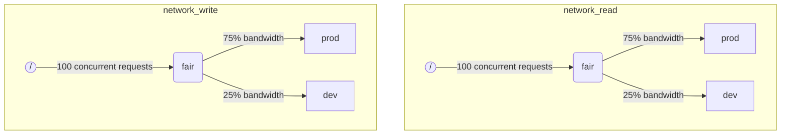

ClickHouse에서 여러 쿼리가 동시에 실행될 때는 디스크나 CPU 코어와 같은 공유 리소스를 사용할 수 있습니다. 스케줄링 제약 조건과 정책을 적용하여 서로 다른 워크로드 간에 리소스가 어떻게 사용되고 공유되는지 제어할 수 있습니다. 모든 리소스에 대해 공통 스케줄링 계층 구조를 구성할 수 있습니다. 계층 구조의 루트는 공유 리소스를 나타내고, 리프 노드는 특정 워크로드를 나타내며, 리소스 용량을 초과하는 요청을 보관합니다.

:::note
현재 이 문서에서 설명한 방법을 사용하여 [원격 디스크 I/O](#disk_config)와 [CPU](#cpu_scheduling)를 스케줄링할 수 있습니다. 유연한 메모리 제한에 대해서는 [Memory overcommit](settings/memory-overcommit.md)을 참조하십시오.
:::

## 디스크 구성 \{#disk_config\}

특정 디스크에 대해 I/O 워크로드 스케줄링을 활성화하려면 READ 및 WRITE 액세스를 위한 읽기 및 쓰기 리소스를 생성해야 합니다:

```sql
CREATE RESOURCE resource_name (WRITE DISK disk_name, READ DISK disk_name)
-- or
CREATE RESOURCE read_resource_name (WRITE DISK write_disk_name)
CREATE RESOURCE write_resource_name (READ DISK read_disk_name)
```

리소스는 READ용, WRITE용, 또는 READ와 WRITE 모두에 대해任意 수의 디스크에 사용할 수 있습니다. 모든 디스크에 해당 리소스를 사용하도록 하는 구문도 있습니다.

```sql
CREATE RESOURCE all_io (READ ANY DISK, WRITE ANY DISK);
```

리소스에서 어떤 디스크가 사용되는지를 지정하는 또 다른 방법은 서버의 `storage_configuration`을 사용하는 것입니다:

:::warning
ClickHouse 설정을 사용한 워크로드 스케줄링은 더 이상 사용되지 않습니다. 대신 SQL 구문을 사용해야 합니다.
:::

특정 디스크에 대해 I/O 스케줄링을 활성화하려면, storage configuration에서 `read_resource` 및/또는 `write_resource`를 지정해야 합니다. 이렇게 하면 해당 디스크로 수행되는 모든 읽기 및 쓰기 요청에 대해 ClickHouse가 어떤 리소스를 사용해야 하는지 정의합니다. 읽기 및 쓰기 리소스는 동일한 리소스 이름을 참조할 수 있으며, 이는 로컬 SSD나 HDD에 유용합니다. 여러 개의 서로 다른 디스크도 동일한 리소스를 참조하도록 할 수 있으며, 이는 원격 디스크에 유용합니다. 예를 들어 「production」 및 「development」 워크로드 간에 네트워크 대역폭을 공정하게 분할할 수 있도록 하려는 경우에 사용할 수 있습니다.

예:

```xml
<clickhouse>
    <storage_configuration>
        ...
        <disks>
            <s3>
                <type>s3</type>
                <endpoint>https://clickhouse-public-datasets.s3.amazonaws.com/my-bucket/root-path/</endpoint>
                <access_key_id>your_access_key_id</access_key_id>
                <secret_access_key>your_secret_access_key</secret_access_key>
                <read_resource>network_read</read_resource>
                <write_resource>network_write</write_resource>
            </s3>
        </disks>
        <policies>
            <s3_main>
                <volumes>
                    <main>
                        <disk>s3</disk>
                    </main>
                </volumes>
            </s3_main>
        </policies>
    </storage_configuration>
</clickhouse>
```

서버 구성 옵션이 리소스를 SQL로 정의하는 방법보다 우선함을 유의하십시오.


## 워크로드 마크업 \{#workload_markup\}

쿼리는 서로 다른 워크로드를 구분하기 위해 `workload` 설정을 지정하여 표시할 수 있습니다. `workload`가 설정되지 않은 경우 값 &quot;default&quot;가 사용됩니다. 설정 프로필을 사용하여 다른 값을 지정할 수도 있습니다. 특정 사용자의 모든 쿼리가 고정된 `workload` 설정 값으로 표시되도록 하려면 설정 제약 조건을 사용하여 `workload`를 상수로 만들 수 있습니다.

백그라운드 작업에 대해 `workload` 설정을 지정하는 것도 가능합니다. 머지와 뮤테이션은 각각 `merge_workload`와 `mutation_workload` 서버 설정을 사용합니다. 이 값들은 `merge_workload`와 `mutation_workload` MergeTree 설정을 사용하여 특정 테이블에 대해 재정의할 수도 있습니다.

두 가지 서로 다른 워크로드 &quot;production&quot;과 &quot;development&quot;를 가진 시스템의 예를 살펴보겠습니다.

```sql
SELECT count() FROM my_table WHERE value = 42 SETTINGS workload = 'production'
SELECT count() FROM my_table WHERE value = 13 SETTINGS workload = 'development'
```


## 리소스 스케줄링 계층 구조 \{#hierarchy\}

스케줄링 서브시스템의 관점에서 리소스는 스케줄링 노드로 이루어진 계층 구조를 의미합니다.



:::warning
ClickHouse 설정을 사용한 워크로드 스케줄링은 사용 중단(deprecated)되었습니다. 대신 SQL 구문을 사용해야 합니다. SQL 구문은 필요한 모든 스케줄링 노드를 자동으로 생성하며, 아래의 스케줄링 노드 설명은 [system.scheduler](/operations/system-tables/scheduler.md) 테이블을 통해 접근 가능한 더 낮은 수준의 구현 세부 정보로 간주해야 합니다.
:::

**가능한 노드 유형:**

* `inflight_limit` (제약 조건) - 동시에 진행 중인(in-flight) 요청 수가 `max_requests`를 초과하거나 전체 비용이 `max_cost`를 초과하는 경우 차단합니다. 자식 노드는 반드시 하나여야 합니다.
* `bandwidth_limit` (제약 조건) - 현재 대역폭이 `max_speed`를 초과하면(0은 무제한을 의미) 또는 버스트가 `max_burst`를 초과하면(기본값은 `max_speed`) 차단합니다. 자식 노드는 반드시 하나여야 합니다.
* `fair` (정책) - max-min 공정성에 따라 자식 노드 중 하나에서 다음에 처리할 요청을 선택합니다. 자식 노드는 `weight`를 지정할 수 있으며(기본값은 1) 이를 통해 가중치를 설정합니다.
* `priority` (정책) - 정적 우선순위에 따라 자식 노드 중 하나에서 다음에 처리할 요청을 선택합니다(값이 낮을수록 우선순위가 높습니다). 자식 노드는 `priority`를 지정할 수 있으며(기본값은 0) 이를 통해 우선순위를 설정합니다.
* `fifo` (큐) - 리소스 용량을 초과하는 요청을 보관할 수 있는 계층 구조의 리프(leaf) 노드입니다.

기반 리소스의 전체 용량을 활용하려면 `inflight_limit`을 사용해야 합니다. `max_requests`나 `max_cost` 값이 너무 낮으면 리소스를 충분히 활용하지 못할 수 있고, 반대로 값이 너무 높으면 스케줄러 내부 큐가 비게 되어 해당 서브트리에서 정책이 무시되는 결과(비공정성 또는 우선순위 무시)로 이어질 수 있습니다. 한편, 리소스가 과도하게 사용되지 않도록 보호하려면 `bandwidth_limit`을 사용해야 합니다. 이 노드는 `duration`초 동안 소비된 리소스 양이 `max_burst + max_speed * duration` 바이트를 초과할 때 속도를 제한(throttling)합니다. 동일한 리소스에 대해 두 개의 `bandwidth_limit` 노드를 사용하면 짧은 구간의 피크 대역폭과 더 긴 구간의 평균 대역폭을 각각 제한할 수 있습니다.

다음 예시는 그림에 표시된 I/O 스케줄링 계층 구조를 정의하는 방법을 보여 줍니다:

```xml
<clickhouse>
    <resources>
        <network_read>
            <node path="/">
                <type>inflight_limit</type>
                <max_requests>100</max_requests>
            </node>
            <node path="/fair">
                <type>fair</type>
            </node>
            <node path="/fair/prod">
                <type>fifo</type>
                <weight>3</weight>
            </node>
            <node path="/fair/dev">
                <type>fifo</type>
            </node>
        </network_read>
        <network_write>
            <node path="/">
                <type>inflight_limit</type>
                <max_requests>100</max_requests>
            </node>
            <node path="/fair">
                <type>fair</type>
            </node>
            <node path="/fair/prod">
                <type>fifo</type>
                <weight>3</weight>
            </node>
            <node path="/fair/dev">
                <type>fifo</type>
            </node>
        </network_write>
    </resources>
</clickhouse>
```


## 워크로드 분류기 \{#workload_classifiers\}

:::warning
ClickHouse 설정을 사용한 워크로드 스케줄링은 사용 중단되었습니다. 대신 SQL 구문을 사용해야 합니다. SQL 구문을 사용할 경우 분류기는 자동으로 생성됩니다.
:::

워크로드 분류기는 쿼리에서 지정된 `workload`를 특정 리소스에 사용해야 하는 leaf-queue(리프 큐)에 매핑하는 데 사용합니다. 현재 워크로드 분류는 단순하며, 정적 매핑만 사용할 수 있습니다.

예시:

```xml
<clickhouse>
    <workload_classifiers>
        <production>
            <network_read>/fair/prod</network_read>
            <network_write>/fair/prod</network_write>
        </production>
        <development>
            <network_read>/fair/dev</network_read>
            <network_write>/fair/dev</network_write>
        </development>
        <default>
            <network_read>/fair/dev</network_read>
            <network_write>/fair/dev</network_write>
        </default>
    </workload_classifiers>
</clickhouse>
```


## 워크로드 계층 구조 \{#workloads\}

ClickHouse는 스케줄링 계층 구조를 정의하기 위한 편리한 SQL 구문을 제공합니다. `CREATE RESOURCE`로 생성된 모든 리소스는 동일한 계층 구조를 공유하지만, 일부 측면에서는 서로 다를 수 있습니다. `CREATE WORKLOAD`로 생성된 모든 워크로드에는 각 리소스마다 몇 개의 자동으로 생성된 스케줄링 노드가 포함됩니다. 하위 워크로드는 다른 상위 워크로드 내부에 생성할 수 있습니다. 다음 예시는 위의 XML 설정과 정확히 동일한 계층 구조를 정의합니다:

```sql
CREATE RESOURCE network_write (WRITE DISK s3)
CREATE RESOURCE network_read (READ DISK s3)
CREATE WORKLOAD all SETTINGS max_io_requests = 100
CREATE WORKLOAD development IN all
CREATE WORKLOAD production IN all SETTINGS weight = 3
```

자식이 없는 리프 워크로드의 이름은 쿼리 설정 `SETTINGS workload = 'name'`에서 사용할 수 있습니다.

워크로드를 사용자 정의하기 위해 다음 설정을 사용할 수 있습니다:

* `priority` - 형제 워크로드는 정적 우선순위 값에 따라 처리됩니다(값이 낮을수록 우선순위가 더 높습니다).
* `weight` - 동일한 정적 우선순위를 가진 형제 워크로드는 weight 값에 따라 리소스를 공유합니다.
* `max_io_requests` - 이 워크로드에서 동시에 실행될 수 있는 IO 요청 수의 제한입니다.
* `max_bytes_inflight` - 이 워크로드에서 동시에 처리 중인 요청들의 전체 바이트 수 제한입니다.
* `max_bytes_per_second` - 이 워크로드의 바이트 읽기 또는 쓰기 속도 제한입니다.
* `max_burst_bytes` - 워크로드가 스로틀링(제한) 없이 처리할 수 있는 최대 바이트 수입니다(각 리소스마다 독립적으로 적용).
* `max_concurrent_threads` - 이 워크로드의 쿼리에 사용할 수 있는 스레드 수 제한입니다.
* `max_concurrent_threads_ratio_to_cores` - `max_concurrent_threads`와 동일하지만, 사용 가능한 CPU 코어 수에 대해 정규화된 값입니다.
* `max_cpus` - 이 워크로드의 쿼리를 처리하는 데 사용할 수 있는 CPU 코어 수 제한입니다.
* `max_cpu_share` - `max_cpus`와 동일하지만, 사용 가능한 CPU 코어 수에 대해 정규화된 값입니다.
* `max_burst_cpu_seconds` - `max_cpus`로 인한 스로틀링(제한)을 받지 않고 워크로드가 사용할 수 있는 최대 CPU 초입니다.

워크로드 설정을 통해 지정된 모든 제한은 각 리소스마다 서로 독립적으로 적용됩니다. 예를 들어 `max_bytes_per_second = 10485760`이 설정된 워크로드는 읽기와 쓰기 각각에 대해 독립적으로 10 MB/s의 대역폭 제한을 갖게 됩니다. 읽기와 쓰기에 공통된 제한이 필요하다면, READ와 WRITE 접근 모두에 동일한 리소스를 사용하도록 구성하는 것이 좋습니다.

서로 다른 리소스에 대해 서로 다른 워크로드 계층 구조를 지정하는 방법은 없습니다. 하지만 특정 리소스에 대해 서로 다른 워크로드 설정 값을 지정하는 방법은 있습니다:

```sql
CREATE OR REPLACE WORKLOAD all SETTINGS max_io_requests = 100, max_bytes_per_second = 1000000 FOR network_read, max_bytes_per_second = 2000000 FOR network_write
```

또한 워크로드가 다른 워크로드에서 참조되고 있는 경우 해당 워크로드나 리소스를 삭제할 수 없음을 유의하십시오. 워크로드 정의를 업데이트하려면 `CREATE OR REPLACE WORKLOAD` 쿼리를 사용합니다.

:::note
워크로드 설정은 적절한 스케줄링 노드 집합으로 변환됩니다. 보다 하위 수준의 세부 내용은 스케줄링 노드의 [유형과 옵션](#hierarchy)에 대한 설명을 참조하십시오.
:::


## CPU 스케줄링 \{#cpu_scheduling\}

워크로드에 CPU 스케줄링을 활성화하려면 CPU 리소스를 생성하고 동시 실행 스레드 수에 대한 제한을 설정하십시오:

```sql
CREATE RESOURCE cpu (MASTER THREAD, WORKER THREAD)
CREATE WORKLOAD all SETTINGS max_concurrent_threads = 100
```

ClickHouse 서버가 [multiple threads](/operations/settings/settings.md#max_threads)를 사용하여 많은 동시 쿼리를 실행하고 모든 CPU 슬롯이 사용 중이면 과부하 상태에 진입합니다. 과부하 상태에서는 해제되는 각 CPU 슬롯이 스케줄링 정책에 따라 적절한 워크로드로 다시 스케줄됩니다. 동일한 워크로드를 공유하는 쿼리에는 라운드 로빈(round-robin) 방식으로 슬롯이 할당됩니다. 서로 다른 워크로드에 속한 쿼리에는 워크로드에 지정된 가중치, 우선순위, 제한에 따라 슬롯이 할당됩니다.

CPU 시간은 스레드가 블록되지 않고 CPU 집약적인 작업을 수행할 때 소모됩니다. 스케줄링을 위해 다음과 같이 두 종류의 스레드를 구분합니다.

* Master thread — 쿼리 또는 머지(merge)나 mutation과 같은 백그라운드 작업을 처음 시작하는 스레드입니다.
* Worker thread — master가 CPU 집약적인 작업을 수행하도록 추가로 생성할 수 있는 스레드입니다.

더 나은 응답성을 위해 master 스레드와 worker 스레드에 서로 다른 리소스를 사용하도록 하는 것이 바람직할 수 있습니다. `max_threads` 쿼리 설정 값이 높게 설정된 경우 많은 수의 worker 스레드가 CPU 리소스를 쉽게 독점할 수 있습니다. 그러면 새로 들어오는 쿼리는 master 스레드가 실행을 시작할 CPU 슬롯을 기다리며 차단됩니다. 이를 방지하기 위해 다음과 같은 구성을 사용할 수 있습니다:

```sql
CREATE RESOURCE worker_cpu (WORKER THREAD)
CREATE RESOURCE master_cpu (MASTER THREAD)
CREATE WORKLOAD all SETTINGS max_concurrent_threads = 100 FOR worker_cpu, max_concurrent_threads = 1000 FOR master_cpu
```

이는 master 스레드와 worker 스레드에 대해 별도로 제한을 둡니다. 100개의 worker CPU 슬롯이 모두 사용 중이더라도, 사용 가능한 master CPU 슬롯이 있는 한 새로운 쿼리는 차단되지 않습니다. 이러한 쿼리는 하나의 스레드로 실행을 시작합니다. 이후 worker CPU 슬롯이 사용 가능해지면, 이러한 쿼리는 확장되어 해당 쿼리의 worker 스레드를 생성할 수 있습니다. 반면 이러한 방식은 총 슬롯 수를 CPU 프로세서 개수에 묶지 않으므로, 너무 많은 동시 스레드를 실행하면 성능 저하를 초래할 수 있습니다.

master 스레드의 동시성을 제한해도 동시 쿼리 개수는 제한되지 않습니다. CPU 슬롯은 쿼리 실행 중간에 해제되어 다른 스레드가 다시 획득할 수 있습니다. 예를 들어, 동시에 실행되는 master 스레드를 2개로 제한하더라도 4개의 동시 쿼리를 모두 병렬로 실행할 수 있습니다. 이 경우 각 쿼리는 CPU 프로세서 용량의 50%를 할당받게 됩니다. 동시 쿼리 개수를 제한하려면 별도의 로직을 사용해야 하며, 이는 현재 워크로드에 대해서는 지원되지 않습니다.

별도의 스레드 동시성 제한은 워크로드에 대해 다음과 같이 사용할 수 있습니다:

```sql
CREATE RESOURCE cpu (MASTER THREAD, WORKER THREAD)
CREATE WORKLOAD all
CREATE WORKLOAD admin IN all SETTINGS max_concurrent_threads = 10
CREATE WORKLOAD production IN all SETTINGS max_concurrent_threads = 100
CREATE WORKLOAD analytics IN production SETTINGS max_concurrent_threads = 60, weight = 9
CREATE WORKLOAD ingestion IN production
```

이 구성 예시는 admin과 production에 대해 서로 독립적인 CPU 슬롯 풀을 제공합니다. production 풀은 analytics와 수집(ingestion) 간에 공유됩니다. 또한 production 풀이 과부하 상태일 경우, 반환된 슬롯 10개 중 9개는 필요 시 분석용 쿼리로 재할당됩니다. 수집 쿼리는 과부하 기간 동안 10개 중 1개의 슬롯만 할당받습니다. 이는 사용자 대상 쿼리의 지연 시간을 개선하는 데 도움이 될 수 있습니다. Analytics에는 동시 스레드 60개라는 자체 제한이 있어, 수집을 지원하기 위해 항상 최소 40개의 스레드를 남겨 둡니다. 과부하가 없을 때는 수집이 100개의 모든 스레드를 사용할 수 있습니다.

쿼리를 CPU 스케줄링에서 제외하려면 쿼리 설정 [use&#95;concurrency&#95;control](/operations/settings/settings.md/#use_concurrency_control)을 0으로 설정합니다.

CPU 스케줄링은 아직 merges와 뮤테이션에 대해 지원되지 않습니다.

워크로드에 공정한 할당을 제공하려면, 쿼리 실행 중에 선점(preemption)과 축소(scale-down)를 수행해야 합니다. 선점은 `cpu_slot_preemption` 서버 설정으로 활성화합니다. 이 설정이 활성화되면, 각 스레드는 주기적으로 자신의 CPU 슬롯을 갱신합니다(`cpu_slot_quantum_ns` 서버 설정에 따름). 이러한 갱신은 CPU가 과부하 상태일 때 실행을 차단할 수 있습니다. 실행이 장시간 차단되면(`cpu_slot_preemption_timeout_ms` 서버 설정 참조), 쿼리는 축소되며 동시에 실행 중인 스레드 수가 동적으로 감소합니다. CPU 시간의 공정성은 워크로드 간에는 보장되지만, 동일한 워크로드 내부의 쿼리들 사이에서는 일부 예외적인 경우에 위반될 수 있습니다.

:::warning
슬롯 스케줄링은 [쿼리 동시성](/operations/settings/settings.md#max_threads)을 제어하는 수단을 제공하지만, 서버 설정 `cpu_slot_preemption`이 `true`로 설정되지 않은 한 공정한 CPU 시간 할당을 보장하지 않습니다. 이 경우 공정성은 경쟁하는 워크로드 간의 CPU 슬롯 할당 개수에 기반하여 제공됩니다. 이는 CPU 초의 동일한 양을 의미하지는 않습니다. 선점이 없으면 CPU 슬롯은 무기한 유지될 수 있기 때문입니다. 스레드는 시작 시 슬롯을 획득하고 작업이 완료되면 해제합니다.
:::


:::note
CPU 리소스를 선언하면 [`concurrent_threads_soft_limit_num`](server-configuration-parameters/settings.md#concurrent_threads_soft_limit_num) 및 [`concurrent_threads_soft_limit_ratio_to_cores`](server-configuration-parameters/settings.md#concurrent_threads_soft_limit_ratio_to_cores) 설정의 효과는 적용되지 않습니다. 대신 특정 워크로드에 할당되는 CPU 개수는 워크로드 설정 `max_concurrent_threads`로 제한됩니다. 이전 동작을 재현하려면 WORKER THREAD 리소스만 생성하고, 워크로드 `all`에 대한 `max_concurrent_threads` 값을 `concurrent_threads_soft_limit_num`과 동일하게 설정한 뒤 `workload = "all"` 쿼리 설정을 사용하십시오. 이 구성은 [`concurrent_threads_scheduler`](server-configuration-parameters/settings.md#concurrent_threads_scheduler) 설정에 "fair_round_robin" 값을 설정한 것과 동일합니다.
:::

## Threads vs. CPUs \{#threads_vs_cpus\}

워크로드의 CPU 사용량을 제어하는 방법은 두 가지가 있습니다.

* 스레드 개수 제한: `max_concurrent_threads` 및 `max_concurrent_threads_ratio_to_cores`
* CPU 스로틀링: `max_cpus`, `max_cpu_share`, `max_burst_cpu_seconds`

첫 번째 방법은 현재 서버 부하에 따라 쿼리에 대해 생성되는 스레드 수를 동적으로 제어합니다. 사실상 `max_threads` 쿼리 설정이 지시하는 값보다 더 낮게 제한합니다. 두 번째 방법은 토큰 버킷(token bucket) 알고리즘을 사용하여 워크로드의 CPU 사용량을 스로틀링합니다. 이는 스레드 개수에는 직접적인 영향을 주지 않지만, 워크로드 내 모든 스레드의 전체 CPU 사용량을 제한합니다.

`max_cpus` 및 `max_burst_cpu_seconds`를 사용하는 토큰 버킷 방식의 스로틀링은 다음을 의미합니다. 임의의 `delta`초 구간 동안 워크로드 내 모든 쿼리의 총 CPU 사용량은 `max_cpus * delta + max_burst_cpu_seconds` CPU 초를 초과할 수 없습니다. 장기적으로는 평균 사용량을 `max_cpus`로 제한하지만, 단기적으로는 이 한계를 초과할 수 있습니다. 예를 들어 `max_burst_cpu_seconds = 60`, `max_cpus=0.001`인 경우, 제한에 걸리지 않고 1개의 스레드를 60초 동안, 또는 2개의 스레드를 30초 동안, 또는 60개의 스레드를 1초 동안 실행할 수 있습니다. `max_burst_cpu_seconds`의 기본값은 1초입니다. 값이 너무 낮으면 많은 동시 스레드가 존재할 때 허용된 `max_cpus` 코어를 충분히 활용하지 못할 수 있습니다.

:::warning
CPU 스로틀링 설정은 `cpu_slot_preemption` 서버 설정이 활성화된 경우에만 적용되며, 그렇지 않으면 무시됩니다.
:::

CPU 슬롯을 보유하고 있는 동안, 스레드는 다음 세 가지 주요 상태 중 하나에 있을 수 있습니다.

* **Running:** 실제로 CPU 자원을 소비하는 상태입니다. 이 상태에서 소비된 시간은 CPU 스로틀링에 의해 계산됩니다.
* **Ready:** 사용 가능한 CPU를 기다리는 상태입니다. CPU 스로틀링에서 고려되지 않습니다.
* **Blocked:** IO 작업이나 기타 블로킹 시스템 콜(예: mutex 대기)을 수행하는 상태입니다. CPU 스로틀링에서 고려되지 않습니다.

CPU 스로틀링과 스레드 개수 제한을 모두 결합한 구성 예를 살펴보겠습니다.

```sql
CREATE RESOURCE cpu (MASTER THREAD, WORKER THREAD)
CREATE WORKLOAD all SETTINGS max_concurrent_threads_ratio_to_cores = 2
CREATE WORKLOAD admin IN all SETTINGS max_concurrent_threads = 2, priority = -1
CREATE WORKLOAD production IN all SETTINGS weight = 4
CREATE WORKLOAD analytics IN production SETTINGS max_cpu_share = 0.7, weight = 3
CREATE WORKLOAD ingestion IN production
CREATE WORKLOAD development IN all SETTINGS max_cpu_share = 0.3
```

여기서는 모든 쿼리에 대한 총 스레드 수를 사용 가능한 CPU 개수의 2배로 제한합니다. Admin 워크로드는 사용 가능한 CPU 개수와 관계없이 최대 2개의 스레드로만 제한됩니다. Admin의 우선순위는 -1(기본값 0보다 낮음)이며, 필요할 경우 CPU 슬롯을 우선적으로 할당받습니다. Admin이 쿼리를 실행하지 않을 때는 CPU 리소스가 production과 development 워크로드 사이에 분배됩니다. 보장된 CPU 시간 점유율은 가중치(4 대 1)를 기반으로 합니다. 최소 80%는 production에 할당되며(필요한 경우), 최소 20%는 development에 할당됩니다(필요한 경우). 가중치는 보장치를 제공하고, CPU throttling은 상한을 설정합니다. Production은 제한되지 않으며 최대 100%까지 사용할 수 있는 반면, development는 30%의 상한을 가지며, 이는 다른 워크로드의 쿼리가 없어도 적용됩니다. Production 워크로드는 리프(leaf)가 아니므로, 그 리소스는 analytics와 ingestion 사이에서 가중치(3 대 1)에 따라 분할됩니다. 이는 analytics가 최소 0.8 * 0.75 = 60%를 보장받으며, `max_cpu_share`에 기반해 전체 CPU 리소스의 70%까지 상한을 가진다는 의미입니다. Ingestion은 최소 0.8 * 0.25 = 20%를 보장받지만, 상한은 없습니다.

:::note
ClickHouse 서버에서 CPU 사용률을 최대화하려면 루트 워크로드 `all`에 대해 `max_cpus`와 `max_cpu_share`를 사용하는 것을 피하십시오. 대신 `max_concurrent_threads` 값을 더 높게 설정하십시오. 예를 들어 CPU가 8개인 시스템에서는 `max_concurrent_threads = 16`으로 설정합니다. 이렇게 하면 8개의 스레드는 CPU 작업을 실행하고, 다른 8개의 스레드는 I/O 작업을 처리할 수 있습니다. 추가 스레드는 CPU 부하를 만들어내어 스케줄링 규칙이 적용되도록 합니다. 반대로 `max_cpus = 8`로 설정하면 서버가 사용 가능한 8개의 CPU를 초과할 수 없기 때문에 CPU 부하가 충분히 발생하지 않습니다.
:::


## 쿼리 슬롯 스케줄링 \{#query_scheduling\}

워크로드에 쿼리 슬롯 스케줄링을 활성화하려면 QUERY 리소스를 생성하고, 동시에 실행할 수 있는 쿼리 수 또는 초당 처리할 쿼리 수에 대한 한도를 설정합니다:

```sql
CREATE RESOURCE query (QUERY)
CREATE WORKLOAD all SETTINGS max_concurrent_queries = 100, max_queries_per_second = 10, max_burst_queries = 20
```

워크로드 설정 `max_concurrent_queries`는 특정 워크로드에서 동시에 실행될 수 있는 쿼리 수를 제한합니다. 이는 쿼리 설정 [`max_concurrent_queries_for_all_users`](/operations/settings/settings#max_concurrent_queries_for_all_users) 및 서버 설정 [max&#95;concurrent&#95;queries](/operations/server-configuration-parameters/settings#max_concurrent_queries)와 유사한 역할을 합니다. 비동기 insert 쿼리 및 KILL과 같은 일부 특수 쿼리는 이 한도에 포함되지 않습니다.

워크로드 설정 `max_queries_per_second` 및 `max_burst_queries`는 토큰 버킷 스로틀러를 사용하여 해당 워크로드의 쿼리 수를 제한합니다. 이를 통해 임의의 시간 구간 `T` 동안 시작되는 새로운 쿼리 수가 `max_queries_per_second * T + max_burst_queries`를 초과하지 않도록 보장합니다.

워크로드 설정 `max_waiting_queries`는 해당 워크로드에서 대기 중인 쿼리 수를 제한합니다. 한도에 도달하면 서버는 오류 `SERVER_OVERLOADED`를 반환합니다.

:::note
차단된 쿼리는 모든 제약 조건이 충족될 때까지 무기한 대기하며 `SHOW PROCESSLIST`에 표시되지 않습니다.
:::


## 워크로드 및 리소스 스토리지 \{#workload_entity_storage\}

`CREATE WORKLOAD` 및 `CREATE RESOURCE` 쿼리 형식으로 작성된 모든 워크로드와 리소스 정의는 디스크의 `workload_path` 또는 ZooKeeper의 `workload_zookeeper_path`에 영구적으로 저장됩니다. 노드 간 일관성을 확보하기 위해 ZooKeeper 스토리지를 사용하는 것이 권장됩니다. 또는 디스크 스토리지를 사용할 때 `ON CLUSTER` 절을 함께 사용할 수 있습니다.

## 구성 기반 워크로드 및 리소스 \{#config_based_workloads\}

SQL 기반 정의 외에도 워크로드와 리소스를 서버 구성 파일에서 미리 정의할 수 있습니다. 이는 일부 제한은 인프라에서 강제되고 나머지 제한은 사용자가 변경할 수 있는 Cloud 환경에서 유용합니다. 구성 기반 개체는 SQL로 정의된 개체보다 우선 적용되며, SQL 명령을 사용하여 수정하거나 삭제할 수 없습니다.

### 구성 형식 \{#config_based_workloads_format\}

```xml
<clickhouse>
    <resources_and_workloads>
        CREATE RESOURCE s3disk_read (READ DISK s3);
        CREATE RESOURCE s3disk_write (WRITE DISK s3);
        CREATE WORKLOAD all SETTINGS max_io_requests = 500 FOR s3disk_read, max_io_requests = 1000 FOR s3disk_write, max_bytes_per_second = 1342177280 FOR s3disk_read, max_bytes_per_second = 3355443200 FOR s3disk_write;
        CREATE WORKLOAD production IN all SETTINGS weight = 3;
    </resources_and_workloads>
</clickhouse>
```

이 구성은 `CREATE WORKLOAD` 및 `CREATE RESOURCE` SQL 문과 동일한 SQL 구문을 사용합니다. 모든 쿼리는 유효해야 합니다.


### 사용 권장 사항 \{#config_based_workloads_usage_recommendations\}

클라우드 환경에서의 일반적인 구성 예시는 다음과 같습니다.

1. 인프라 리소스 한계를 설정하기 위해 설정에서 루트 워크로드와 네트워크 IO 리소스를 정의합니다.
2. 이러한 한계를 강제하기 위해 `throw_on_unknown_workload`를 설정합니다.
3. 모든 쿼리에 한계를 자동으로 적용하기 위해 `CREATE WORKLOAD default IN all`을 생성합니다 (`workload` 쿼리 설정의 기본값이 'default'이기 때문입니다).
4. 구성된 계층 구조 내에서 사용자가 추가 워크로드를 생성할 수 있도록 합니다.

이렇게 하면 모든 백그라운드 작업과 쿼리가 인프라 제한을 준수하면서도, 사용자별 스케줄링 정책에 대한 유연성은 유지됩니다.

또 다른 활용 예로는 이기종 클러스터에서 노드마다 서로 다른 구성을 사용하는 것이 있습니다.

## 엄격한 리소스 접근 제어 \{#strict_resource_access\}

모든 쿼리가 리소스 스케줄링 정책을 반드시 따르도록 하려면 서버 설정 `throw_on_unknown_workload`를 사용합니다. 이 값이 `true`로 설정되면 모든 쿼리는 유효한 `workload` 쿼리 설정을 사용해야 하며, 그렇지 않으면 `RESOURCE_ACCESS_DENIED` 예외가 발생합니다. 이 값이 `false`로 설정되면 해당 쿼리는 리소스 스케줄러를 사용하지 않으므로, 어떤 `RESOURCE`에도 무제한으로 접근할 수 있습니다. 쿼리 설정 `use_concurrency_control = 0`을 사용하면 쿼리가 CPU 스케줄러를 우회하여 CPU에 무제한으로 접근할 수 있습니다. CPU 스케줄링을 강제하려면 `use_concurrency_control`을 읽기 전용 상수 값으로 유지하는 설정 CONSTRAINT를 생성하십시오.

:::note
`CREATE WORKLOAD default`가 실행되지 않았다면 `throw_on_unknown_workload`를 `true`로 설정하지 마십시오. 시작 시점에 `workload` 설정을 명시하지 않은 쿼리가 실행되는 경우 서버 시작 문제로 이어질 수 있습니다.
:::

## 같이 보기 \{#see-also\}

- [system.scheduler](/operations/system-tables/scheduler.md)
- [system.workloads](/operations/system-tables/workloads.md)
- [system.resources](/operations/system-tables/resources.md)
- [merge_workload](/operations/settings/merge-tree-settings.md#merge_workload) MergeTree 설정
- [merge_workload](/operations/server-configuration-parameters/settings.md#merge_workload) 전역 서버 설정
- [mutation_workload](/operations/settings/merge-tree-settings.md#mutation_workload) MergeTree 설정
- [mutation_workload](/operations/server-configuration-parameters/settings.md#mutation_workload) 전역 서버 설정
- [workload_path](/operations/server-configuration-parameters/settings.md#workload_path) 전역 서버 설정
- [workload_zookeeper_path](/operations/server-configuration-parameters/settings.md#workload_zookeeper_path) 전역 서버 설정
- [cpu_slot_preemption](/operations/server-configuration-parameters/settings.md#cpu_slot_preemption) 전역 서버 설정
- [cpu_slot_quantum_ns](/operations/server-configuration-parameters/settings.md#cpu_slot_quantum_ns) 전역 서버 설정
- [cpu_slot_preemption_timeout_ms](/operations/server-configuration-parameters/settings.md#cpu_slot_preemption_timeout_ms) 전역 서버 설정