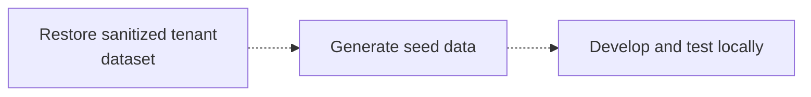

Managed Postgres построен на стандартном PostgreSQL и совместим с существующей экосистемой PostgreSQL. Для большинства задач разработки и тестирования можно использовать локальный экземпляр PostgreSQL, запущенный в Docker, вместо развертывания в облаке.

Такой подход ускоряет цикл обратной связи, упрощает онбординг, снижает зависимость от общей инфраструктуры и позволяет безопасно экспериментировать, не затрагивая production-системы.

Цель не в том, чтобы в точности воспроизвести production. Вместо этого создайте воспроизводимую локальную среду, которая:

* Использует ту же мажорную версию PostgreSQL, что и production.
* Применяет те же определения схемы, что и в production.
* Содержит репрезентативные данные для разработки.
* Поддерживает стандартные процессы разработки и тестирования приложений.

Поскольку Managed Postgres — это стандартный PostgreSQL, существующие фреймворки миграций, инструменты управления схемой и подходы к заполнению данных работают без изменений.

## Пример процесса локальной разработки \{#example-development-flow\}

Типичный процесс локальной разработки выглядит так:




Managed Postgres органично вписывается в существующие процессы разработки с PostgreSQL. Разрабатывая и тестируя приложения на локальном экземпляре PostgreSQL, команды могут быстро вносить изменения, поддерживать воспроизводимые окружения и быть уверенными, что приложения будут работать одинаково после развертывания в Managed Postgres.

## Запустите PostgreSQL локально в Docker \{#run-postgresql-locally-with-docker\}

Самый простой способ создать локальную среду разработки — запустить PostgreSQL в Docker.

Выберите версию PostgreSQL, соответствующую вашему развертыванию Managed Postgres:

```yaml title="docker-compose.yml"
services:
  postgres:
    image: postgres:18
    container_name: local-postgres
    restart: unless-stopped

    environment:
      POSTGRES_USER: postgres
      POSTGRES_PASSWORD: postgres
      POSTGRES_DB: app

    ports:
      - "15432:5432"

    volumes:
      - postgres_data:/var/lib/postgresql

volumes:
  postgres_data:
```

Запустите PostgreSQL:

```bash
docker compose up -d
```

Проверьте подключение:

```bash
psql -h localhost -U postgres -p 15432 -d app
```

На этом этапе PostgreSQL запущен локально, но в ней пока нет схемы приложения и данных для разработки.

## Применение схемы приложения \{#apply-the-application-schema\}

В локальной среде нет единого обязательного способа создания схемы. У большинства организаций уже есть отлаженный процесс управления схемой, который можно использовать без изменений.

### Миграции приложения \{#application-migrations\}

Многие команды используют один и тот же фреймворк миграций в средах staging и production — такие инструменты, как Flyway, Liquibase, Rails migrations, Django migrations, Prisma migrations или Alembic.

Локальное применение миграций позволяет непрерывно проверять изменения схемы в рамках обычной разработки:

```bash
./migrate up
# or
npm run migrate
# or
rails db:migrate
```

### Дампы PostgreSQL только со схемой \{#schema-only-postgresql-dumps\}

Экспорт PostgreSQL, содержащий только схему, позволяет воссоздать существующую структуру базы данных. Это полезно для онбординга, изучения поведения схемы, проверки совместимости или быстрого развертывания сред разработки.

Экспортируйте схему:

```bash
pg_dump \
  --schema-only \
  --no-owner \
  --no-privileges \
  -h <host> \
  -U <user> \
  -d <database> \
  > schema.sql
```

Локальное восстановление:

```bash
psql \
  -h localhost \
  -U postgres \
  -p 15432    \
  -d app \
  -f schema.sql
```

### SQL-определения, хранящиеся в репозитории \{#checked-in-sql-definitions\}

Некоторые команды хранят определения схемы прямо в системе контроля версий в виде SQL-файлов. Их можно напрямую применять к локальному экземпляру PostgreSQL при настройке окружения.

Независимо от подхода, главное, чтобы создание схемы было автоматизированным, воспроизводимым и выполнялось на основе определений, хранящихся под контролем версий.

## Заполните базу репрезентативными данными для разработки \{#populate-representative-development-data\}

Когда схема уже создана, заполните базу данных репрезентативными данными для разработки.

Для большинства сценариев разработки достаточно синтетических наборов данных, сгенерированных с помощью seed-скриптов. Их легко воссоздать, ими безопасно делиться, и они позволяют избежать требований соответствия и рисков безопасности, связанных с производственными данными.

Распространённый подход для SaaS-приложений — генерировать данные для небольшого числа тестовых тенантов и создавать реалистичные связи между пользователями, продуктами, заказами и другими бизнес-сущностями.

### Пример мультиарендной схемы \{#example-multi-tenant-schema\}

Ниже приведена схема упрощённого мультиарендного SaaS-приложения:

```sql
CREATE TABLE tenants (
    id UUID PRIMARY KEY,
    name TEXT NOT NULL
);

CREATE TABLE users (
    id UUID PRIMARY KEY,
    tenant_id UUID NOT NULL REFERENCES tenants(id),
    email TEXT NOT NULL,
    first_name TEXT,
    last_name TEXT,
    created_at TIMESTAMP DEFAULT now()
);

CREATE TABLE products (
    id UUID PRIMARY KEY,
    tenant_id UUID NOT NULL REFERENCES tenants(id),
    name TEXT NOT NULL,
    price NUMERIC(10,2)
);

CREATE TABLE orders (
    id UUID PRIMARY KEY,
    tenant_id UUID NOT NULL REFERENCES tenants(id),
    user_id UUID NOT NULL REFERENCES users(id),
    status TEXT,
    created_at TIMESTAMP DEFAULT now()
);

CREATE TABLE order_items (
    id UUID PRIMARY KEY,
    order_id UUID NOT NULL REFERENCES orders(id),
    product_id UUID NOT NULL REFERENCES products(id),
    quantity INTEGER
);

CREATE TABLE audit_logs (
    id UUID PRIMARY KEY,
    tenant_id UUID NOT NULL REFERENCES tenants(id),
    entity_type TEXT,
    entity_id UUID,
    action TEXT,
    created_at TIMESTAMP DEFAULT now()
);
```

### Сгенерируйте тестовые данные \{#generate-sample-data\}

Установите зависимости:

```bash
pip install faker psycopg2-binary
```

Создайте файл `seed.py`:

```python title="seed.py"
import random
import uuid

import psycopg2
from faker import Faker

fake = Faker()

conn = psycopg2.connect(
    host="localhost",
    port=15432,
    dbname="app",
    user="postgres",
    password="postgres"
)

cur = conn.cursor()

tenant_ids = []

for tenant_name in [
    "Tenant A",
    "Tenant B",
    "Tenant C"
]:
    tenant_id = str(uuid.uuid4())
    tenant_ids.append(tenant_id)

    cur.execute(
        """
        INSERT INTO tenants(id, name)
        VALUES (%s, %s)
        """,
        (tenant_id, tenant_name)
    )

for tenant_id in tenant_ids:

    users = []
    products = []

    for _ in range(20):
        user_id = str(uuid.uuid4())
        users.append(user_id)

        cur.execute(
            """
            INSERT INTO users(
                id,
                tenant_id,
                email,
                first_name,
                last_name
            )
            VALUES (%s,%s,%s,%s,%s)
            """,
            (
                user_id,
                tenant_id,
                fake.email(),
                fake.first_name(),
                fake.last_name()
            )
        )

    for _ in range(15):
        product_id = str(uuid.uuid4())
        products.append(product_id)

        cur.execute(
            """
            INSERT INTO products(
                id,
                tenant_id,
                name,
                price
            )
            VALUES (%s,%s,%s,%s)
            """,
            (
                product_id,
                tenant_id,
                fake.word(),
                round(random.uniform(10, 500), 2)
            )
        )

    for _ in range(50):

        order_id = str(uuid.uuid4())

        cur.execute(
            """
            INSERT INTO orders(
                id,
                tenant_id,
                user_id,
                status
            )
            VALUES (%s,%s,%s,%s)
            """,
            (
                order_id,
                tenant_id,
                random.choice(users),
                random.choice([
                    "pending",
                    "completed",
                    "cancelled"
                ])
            )
        )

        for _ in range(random.randint(1, 5)):
            cur.execute(
                """
                INSERT INTO order_items(
                    id,
                    order_id,
                    product_id,
                    quantity
                )
                VALUES (%s,%s,%s,%s)
                """,
                (
                    str(uuid.uuid4()),
                    order_id,
                    random.choice(products),
                    random.randint(1, 10)
                )
            )

        cur.execute(
            """
            INSERT INTO audit_logs(
                id,
                tenant_id,
                entity_type,
                entity_id,
                action
            )
            VALUES (%s,%s,%s,%s,%s)
            """,
            (
                str(uuid.uuid4()),
                tenant_id,
                "order",
                order_id,
                "created"
            )
        )

conn.commit()
conn.close()
```

Запустите скрипт:

```bash
python seed.py
```

Итоговый набор данных содержит:

| Таблица         | Записи |
| --------------- | ------ |
| tenants         | 3      |
| users           | 60     |
| products        | 45     |
| orders          | 150    |
| order&#95;items | 400+   |
| audit&#95;logs  | 150+   |

Этот набор данных достаточно велик, чтобы охватить типовые сценарии работы приложения, логику изоляции тенантов, отчётные запросы и проверки ссылочной целостности, оставаясь при этом достаточно компактным для локальной разработки и тестирования.

## Среда разработки PostgreSQL + ClickHouse \{#postgresql-clickhouse-development-environment\}

Приведённые выше примеры посвящены локальной разработке на PostgreSQL. Если вы хотите локально протестировать полную архитектуру PostgreSQL → ClickHouse, можно запустить стек PostgreSQL + ClickHouse с открытым исходным кодом.

Этот стек объединяет PostgreSQL для транзакционных нагрузок, ClickHouse для аналитики и PeerDB для нативной фиксации изменений данных (CDC). Он позволяет разрабатывать на PostgreSQL, одновременно непрерывно реплицируя данные в ClickHouse, что даёт возможность тестировать операционную аналитику, отчётные нагрузки и конвейеры данных в реальном времени прямо на вашем ноутбуке.

Стек можно запустить одной командой, и в него уже входят все необходимые предварительно настроенные сервисы:

```bash
git clone https://github.com/ClickHouse/postgres-clickhouse-stack.git
cd postgres-clickhouse-stack

./run.sh start
```

Стек включает:

* PostgreSQL
* ClickHouse
* PeerDB для CDC (фиксации изменений данных) в PostgreSQL
* Вспомогательные сервисы и примеры приложений

Инструкции по настройке, сведения об архитектуре и пошаговое описание полного стека см. в следующих материалах:

* [Блог: PostgreSQL + ClickHouse OSS](https://clickhouse.com/blog/postgres-clickhouse-oss)
* [GitHub: postgres-clickhouse-stack](https://github.com/ClickHouse/postgres-clickhouse-stack)

Это хороший следующий шаг, если ваше приложение уже работает локально с PostgreSQL и вы хотите проверить синхронизацию из PostgreSQL в ClickHouse, Real-time аналитику и сквозную работу приложения.