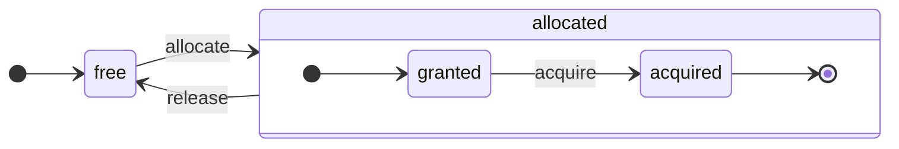

# Обзор архитектуры

ClickHouse — это настоящая столбцовая СУБД. Данные хранятся по столбцам, и во время выполнения массивов (векторов или чанков столбцов).
При возможности операции распределяются по массивам, а не по отдельным значениям.
Это называется "векторизованное выполнение запросов" и помогает снизить затраты на фактическую обработку данных.

Эта идея не нова.
Она восходит к `APL` (язык программирования, 1957 год) и его потомкам: `A +` (диалект APL), `J` (1990), `K` (1993) и `Q` (язык программирования от Kx Systems, 2003).
Массивное программирование используется в научной обработке данных. Аналогичная идея не нова и для реляционных баз данных. Например, она используется в системе `VectorWise` (также известной как Actian Vector Analytic Database от Actian Corporation).

Существуют два различных подхода для ускорения обработки запросов: векторизованное выполнение запросов и генерация кода во время выполнения. Последний удаляет все индирекции и динамическую диспетчеризацию. Ни один из этих подходов не является строго лучше другого. Генерация кода во время выполнения может быть лучше, когда она объединяет множество операций, тем самым полностью используя единицы выполнения CPU и конвейер. Векторизованное выполнение запросов может быть менее практичным, потому что оно включает временные векторы, которые должны быть записаны в кэш и прочитаны обратно. Если временные данные не помещаются в кэш L2, это становится проблемой. Но векторизованное выполнение запросов легче использует возможности SIMD процессора. [Исследовательская работа](http://15721.courses.cs.cmu.edu/spring2016/papers/p5-sompolski.pdf), написанная нашими друзьями, показывает, что лучше комбинировать оба подхода. ClickHouse использует векторизованное выполнение запросов и имеет ограниченную начальную поддержку генерации кода во время выполнения.
## Столбцы {#columns}

Интерфейс `IColumn` используется для представления столбцов в памяти (фактически, чанков столбцов). Этот интерфейс предоставляет вспомогательные методы для реализации различных реляционных операторов. Почти все операции являются неизменяемыми: они не изменяют исходный столбец, а создают новый измененный. Например, метод `IColumn :: filter` принимает фильтр в виде байтовой маски. Он используется для реляционных операторов `WHERE` и `HAVING`. Дополнительные примеры: метод `IColumn :: permute` для поддержки `ORDER BY`, метод `IColumn :: cut` для поддержки `LIMIT`.

Различные реализации `IColumn` (`ColumnUInt8`, `ColumnString` и т.д.) отвечают за размещение памяти столбцов. Размещение памяти обычно представляет собой непрерывный массив. Для столбцов целого типа это просто один непрерывный массив, как `std :: vector`. Для столбцов `String` и `Array` это два вектора: один для всех элементов массива, размещенных непрерывно, и второй для смещений к началу каждого массива. Есть также `ColumnConst`, который хранит всего одно значение в памяти, но выглядит как столбец.
## Поле {#field}

Тем не менее, возможно также работать с отдельными значениями. Для представления отдельного значения используется `Field`. `Field` — это просто унифицированный тип `UInt64`, `Int64`, `Float64`, `String` и `Array`. `IColumn` имеет метод `operator []` для получения n-го значения как `Field`, и метод `insert` для добавления `Field` в конец столбца. Эти методы не очень эффективны, потому что они требуют работы с временными объектами `Field`, представляющими отдельное значение. Существуют более эффективные методы, такие как `insertFrom`, `insertRangeFrom` и так далее.

`Field` не имеет достаточной информации о конкретном типе данных для таблицы. Например, `UInt8`, `UInt16`, `UInt32` и `UInt64` все представлены как `UInt64` в `Field`.
## Протечки абстракций {#leaky-abstractions}

`IColumn` имеет методы для общих реляционных преобразований данных, но они не удовлетворяют всем потребностям. Например, `ColumnUInt64` не имеет метода для вычисления суммы двух столбцов, а `ColumnString` не имеет метода для выполнения поиска подстроки. Эти бесчисленные рутинные операции реализованы вне `IColumn`.

Различные функции для столбцов могут быть реализованы общим, неэффективным образом с использованием методов `IColumn` для извлечения значений `Field`, или специализированным образом с использованием знаний о внутреннем размещении данных в конкретной реализации `IColumn`. Это реализуется путем приведения функций к конкретному типу `IColumn` и работы с внутренним представлением напрямую. Например, `ColumnUInt64` имеет метод `getData`, который возвращает ссылку на внутренний массив, а затем отдельная рутина читает или заполняет этот массив напрямую. У нас есть "протечки абстракции", позволяющие эффективные специализации различных рутин.
## Типы данных {#data_types}

`IDataType` отвечает за сериализацию и десериализацию: для чтения и записи чанков столбцов или отдельных значений в двоичном или текстовом виде. `IDataType` напрямую соответствует типам данных в таблицах. Например, существуют `DataTypeUInt32`, `DataTypeDateTime`, `DataTypeString` и так далее.

`IDataType` и `IColumn` связаны только слабо. Различные типы данных могут быть представлены в памяти с помощью одних и тех же реализаций `IColumn`. Например, `DataTypeUInt32` и `DataTypeDateTime` могут быть представлены `ColumnUInt32` или `ColumnConstUInt32`. Кроме того, один и тот же тип данных может быть представлен различными реализациями `IColumn`. Например, `DataTypeUInt8` может быть представлен `ColumnUInt8` или `ColumnConstUInt8`.

`IDataType` хранит только метаданную. Например, `DataTypeUInt8` не хранит ничего вообще (кроме виртуального указателя `vptr`), а `DataTypeFixedString` хранит только `N` (размер фиксированных строк).

`IDataType` имеет вспомогательные методы для различных форматов данных. Примеры включают методы для сериализации значения с возможными кавычками, для сериализации значения для JSON и для сериализации значения как части формата XML. Нет прямого соответствия к форматам данных. Например, различные форматы данных `Pretty` и `TabSeparated` могут использовать один и тот же вспомогательный метод `serializeTextEscaped` из интерфейса `IDataType`.
## Блок {#block}

`Block` — это контейнер, который представляет собой подмножество (чанк) таблицы в памяти. Это просто набор троек: `(IColumn, IDataType, имя столбца)`. Во время выполнения запроса данные обрабатываются по `Block`. Если у нас есть `Block`, у нас есть данные (в объекте `IColumn`), у нас есть информация о его типе (в `IDataType`), которая говорит нам, как работать с этим столбцом, и у нас есть имя столбца. Это может быть либо оригинальное имя столбца из таблицы, либо какое-то искусственное имя, присвоенное для получения временных результатов расчетов.

Когда мы вычисляем какую-то функцию по столбцам в блоке, мы добавляем в блок еще один столбец с его результатом и не трогаем столбцы для аргументов функции, потому что операции являются неизменяемыми. Позже ненужные столбцы могут быть удалены из блока, но не изменены. Это удобно для устранения общих подвыражений.

Блоки создаются для каждого обработанного чанка данных. Обратите внимание, что для одного и того же типа вычислений имена и типы столбцов остаются одинаковыми для разных блоков, и только данные столбцов меняются. Лучше разделить данные блока от заголовка блока, потому что небольшие размеры блоков имеют высокие накладные расходы временных строк для копирования shared_ptrs и имен столбцов.
## Процессоры {#processors}

Смотрите описание по ссылке [https://github.com/ClickHouse/ClickHouse/blob/master/src/Processors/IProcessor.h](https://github.com/ClickHouse/ClickHouse/blob/master/src/Processors/IProcessor.h).
## Форматы {#formats}

Форматы данных реализованы с помощью процессоров.
## Ввод/вывод {#io}

Для байтоориентированного ввода/вывода есть абстрактные классы `ReadBuffer` и `WriteBuffer`. Они используются вместо C++ `iostream`. Не волнуйтесь: каждый зрелый C++ проект использует что-то, кроме `iostream`, по уважительной причине.

`ReadBuffer` и `WriteBuffer` — это просто непрерывный буфер и курсор, указывающий на позицию в этом буфере. Реализации могут владеть или не владеть памятью для буфера. Есть виртуальный метод для заполнения буфера следующими данными (для `ReadBuffer`) или для сброса буфера куда-либо (для `WriteBuffer`). Виртуальные методы редко вызываются.

Реализации `ReadBuffer`/`WriteBuffer` используются для работы с файлами и файловыми дескрипторами и сетевыми сокетами, для реализации сжатия (`CompressedWriteBuffer` инициализируется другим WriteBuffer и выполняет сжатие перед записью данных в него) и для других целей — имена `ConcatReadBuffer`, `LimitReadBuffer` и `HashingWriteBuffer` говорят сами за себя.

Read/WriteBuffers работают только с байтами. Существуют функции из заголовочных файлов `ReadHelpers` и `WriteHelpers` для помощи с форматированием ввода/вывода. Например, существуют вспомогательные функции для записи числа в десятичном формате.

Давайте рассмотрим, что происходит, когда вы хотите записать набор результатов в формате `JSON` на stdout.
У вас есть готовый набор результатов, чтобы быть извлеченным из "тянущего" `QueryPipeline`.
Сначала вы создаете `WriteBufferFromFileDescriptor(STDOUT_FILENO)`, чтобы записывать байты на stdout.
Затем вы подключаете результат из конвейера запросов к `JSONRowOutputFormat`, который инициализируется с этим `WriteBuffer`, чтобы записывать строки в формате `JSON` на stdout.
Это может быть сделано с помощью метода `complete`, который превращает "тянущий" `QueryPipeline` в завершенный `QueryPipeline`.
Внутри `JSONRowOutputFormat` будет записывать различные JSON-разделители и вызывать метод `IDataType::serializeTextJSON` с ссылкой на `IColumn` и номером строки в качестве аргументов. Соответственно, `IDataType::serializeTextJSON` вызовет метод из `WriteHelpers.h`: например, `writeText` для числовых типов и `writeJSONString` для `DataTypeString`.
## Таблицы {#tables}

Интерфейс `IStorage` представляет таблицы. Разные реализации этого интерфейса — это разные движки таблиц. Примеры: `StorageMergeTree`, `StorageMemory` и т.д. Экземпляры этих классов являются просто таблицами.

Ключевыми методами в `IStorage` являются `read` и `write`, а также такие, как `alter`, `rename` и `drop`. Метод `read` принимает следующие аргументы: набор столбцов для чтения из таблицы, `AST` запрос для рассмотрения и желаемое количество потоков. Он возвращает `Pipe`.

В большинстве случаев метод чтения отвечает только за чтение указанных столбцов из таблицы, а не за какую-либо дальнейшую обработку данных.
Вся последующая обработка данных осуществляется другой частью конвейера, которая выходит за рамки ответственности `IStorage`.

Но есть заметные исключения:

- `AST` запрос передается в метод `read`, и движок таблиц может использовать его для вывода использования индексов и для чтения меньшего объема данных из таблицы.
- Иногда движок таблиц может обрабатывать данные самостоятельно до определенной стадии. Например, `StorageDistributed` может отправить запрос на удаленные серверы, попросить их обработать данные до стадии, где данные из разных удаленных серверов могут быть объединены, и вернуть эти предварительно обработанные данные. Интерпретатор запросов затем завершает обработку данных.

Метод `read` таблицы может возвращать `Pipe`, состоящий из нескольких `Processors`. Эти `Processors` могут читать из таблицы параллельно.
Затем вы можете подключить эти процессоры с различными другими преобразованиями (такими как оценка выражений или фильтрация), которые могут быть рассчитаны независимо.
А затем создать `QueryPipeline` на их основе и выполнить его через `PipelineExecutor`.

Существуют также `TableFunction`. Это функции, которые возвращают временный объект `IStorage` для использования в части `FROM` запроса.

Чтобы получить общее представление о том, как реализовать свой движок таблиц, посмотрите на что-то простое, например, `StorageMemory` или `StorageTinyLog`.

> В результате выполнения метода `read`, `IStorage` возвращает `QueryProcessingStage` — информацию о том, какие части запроса уже были рассчитаны внутри хранилища.
## Парсеры {#parsers}

Ручной парсер с рекурсивным спуском разбирает запрос. Например, `ParserSelectQuery` просто рекурсивно вызывает базовые парсеры для различных частей запроса. Парсеры создают `AST`. `AST` представлен узлами, которые являются экземплярами `IAST`.

> Генераторы парсеров не используются по историческим причинам.
## Интерпретаторы {#interpreters}

Интерпретаторы отвечают за создание конвейера выполнения запроса из `AST`. Существуют простые интерпретаторы, такие как `InterpreterExistsQuery` и `InterpreterDropQuery`, а также более сложные, такие как `InterpreterSelectQuery`.

Конвейер выполнения запроса — это комбинация процессоров, которые могут обрабатывать и производить чанки (наборы столбцов с конкретными типами).
Процессор связывается через порты и может иметь несколько входных и выходных портов.
Более подробное описание можно найти в [src/Processors/IProcessor.h](https://github.com/ClickHouse/ClickHouse/blob/master/src/Processors/IProcessor.h).

Например, результат интерпретации запроса `SELECT` — это "тянущий" `QueryPipeline`, который имеет специальный выходной порт для чтения набора результатов.
Результат запроса `INSERT` — это "толкающий" `QueryPipeline` с входным портом для записи данных для вставки.
А результат интерпретации запроса `INSERT SELECT` — это "завершенный" `QueryPipeline`, который не имеет входов или выходов, но копирует данные из `SELECT` в `INSERT` одновременно.

`InterpreterSelectQuery` использует механизмы `ExpressionAnalyzer` и `ExpressionActions` для анализа и преобразования запроса. Здесь выполняется большая часть оптимизации запроса на основе правил. `ExpressionAnalyzer` достаточно запутанный и его следует переписать: различные преобразования и оптимизации запросов следует извлечь в отдельные классы, чтобы обеспечить модульные преобразования запросов.

Для решения проблем, существующих в интерпретаторах, была разработана новая версия `InterpreterSelectQueryAnalyzer`. Это новая версия `InterpreterSelectQuery`, которая не использует `ExpressionAnalyzer` и вводит дополнительный уровень абстракции между `AST` и `QueryPipeline`, называемый `QueryTree`. Он полностью готов к использованию в производстве, но на всякий случай его можно отключить, установив значение настройки `enable_analyzer` на `false`.
## Функции {#functions}

Существуют обычные функции и агрегатные функции. Для агрегатных функций смотрите следующий раздел.

Обычные функции не изменяют количество строк — они работают так, как будто обрабатывают каждую строку независимо. На самом деле функции не вызываются для отдельных строк, а для блоков данных, чтобы внедрить векторизованное выполнение запросов.

Существуют некоторые разрозненные функции, такие как [blockSize](/sql-reference/functions/other-functions#blockSize), [rowNumberInBlock](/sql-reference/functions/other-functions#rowNumberInBlock) и [runningAccumulate](/sql-reference/functions/other-functions#runningaccumulate), которые используют обработку блоков и нарушают независимость строк.

ClickHouse имеет строгую типизацию, поэтому нет неявного преобразования типов. Если функция не поддерживает конкретную комбинацию типов, она выбрасывает исключение. Но функции могут работать (быть перегружены) для многих различных комбинаций типов. Например, функция `plus` (для реализации оператора `+`) работает для любой комбинации числовых типов: `UInt8` + `Float32`, `UInt16` + `Int8` и так далее. Также некоторые вариативные функции могут принимать любое количество аргументов, такие как функция `concat`.

Реализация функции может быть немного неудобной, потому что функция явно распределяет поддерживаемые типы данных и поддерживаемые `IColumns`. Например, функция `plus` имеет код, сгенерированный с помощью инстанциации шаблона C++ для каждой комбинации числовых типов и постоянных или непостоянных левых и правых аргументов.

Это отличное место для реализации генерации кода во время выполнения, чтобы избежать раздувания шаблонного кода. Также это позволяет добавлять объединенные функции, такие как объединенное умножение и сложение, или выполнять множественные сравнения в одной итерации цикла.

Из-за векторизованного выполнения запросов функции не экранируются. Например, если вы пишете `WHERE f(x) AND g(y)`, обе стороны вычисляются, даже для строк, когда `f(x)` равно нулю (за исключением случая, когда `f(x)` — это нулевая константная выражение). Но если селективность условия `f(x)` высокая, а вычисление `f(x)` гораздо дешевле, чем `g(y)`, то лучше реализовать многопроходное вычисление. Сначала вычислить `f(x)`, затем отфильтровать столбцы по результату, а затем вычислить `g(y)` только для меньших, отфильтрованных чанков данных.
## Агрегатные функции {#aggregate-functions}

Агрегатные функции являются состоянием функций. Они накапливают переданные значения в неком состоянии и позволяют получать результаты из этого состояния. Они управляются интерфейсом `IAggregateFunction`. Состояния могут быть достаточно простыми (состояние для `AggregateFunctionCount` — это всего лишь одно значение `UInt64`) или довольно сложными (состояние `AggregateFunctionUniqCombined` является комбинацией линейного массива, хеш-таблицы и вероятностной структуры данных `HyperLogLog`).

Состояния выделяются в `Arena` (пул памяти), чтобы иметь возможность обрабатывать несколько состояний при выполнении запроса с высокой кардинальностью `GROUP BY`. Состояния могут иметь нетривиальный конструктор и деструктор: например, сложные состояния агрегации могут выделять дополнительную память самостоятельно. Это требует внимательности при создании и уничтожении состояний и правильной передачи их владения и порядка уничтожения.

Состояния агрегации могут быть сериализованы и десериализованы для передачи через сеть во время распределенного выполнения запросов или для записи их на диск, когда недостаточно оперативной памяти. Их можно даже хранить в таблице с `DataTypeAggregateFunction`, чтобы позволить инкрементальную агрегацию данных.

> Формат сериализованных данных для состояний агрегатных функций на данный момент не версионирован. Это нормально, если состояния агрегатов хранятся только временно. Но у нас есть движок таблиц `AggregatingMergeTree` для инкрементальной агрегации, и люди уже используют его в производстве. Это причина, по которой требуется обратная совместимость при изменении сериализованного формата для любой агрегатной функции в будущем.
## Сервер {#server}

Сервер реализует несколько различных интерфейсов:

- HTTP интерфейс для любых сторонних клиентов.
- TCP интерфейс для нативного клиента ClickHouse и для межсерверной связи во время распределенного выполнения запросов.
- Интерфейс для передачи данных для репликации.

Внутри это просто примитивный многопоточный сервер без корутин или фибр. Поскольку сервер не предназначен для обработки высокой скорости простых запросов, а для обработки относительно низкой скорости сложных запросов, каждый из них может обрабатывать огромное количество данных для аналитики.

Сервер инициализирует класс `Context` с необходимой средой для выполнения запросов: список доступных баз данных, пользователей и прав доступа, настройки, кластеры, список процессов, журнал запросов и так далее. Интерпретаторы используют эту среду.

Мы поддерживаем полную обратную и прямую совместимость для протокола TCP сервера: старые клиенты могут взаимодействовать с новыми серверами, а новые клиенты могут взаимодействовать со старыми серверами. Но мы не хотим поддерживать это вечно, и мы прекращаем поддержку старых версий через примерно год.

:::note
Для большинства внешних приложений мы рекомендуем использовать HTTP интерфейс, так как он простой и удобный. Протокол TCP более тесно связан с внутренними структурами данных: он использует внутренний формат для передачи блоков данных и использует пользовательскую упаковку для сжатых данных. Мы не выпустили C библиотеку для этого протокола, так как это требует связывания большей части кода ClickHouse, что не практично.
:::
## Конфигурация {#configuration}

Сервер ClickHouse основан на библиотеках POCO C++ и использует `Poco::Util::AbstractConfiguration` для представления своей конфигурации. Конфигурация хранится классом `Poco::Util::ServerApplication`, который унаследован от класса `DaemonBase`, который, в свою очередь, унаследован от класса `DB::Server`, реализующего сам clickhouse-server. Таким образом, к конфигурации можно получить доступ с помощью метода `ServerApplication::config()`.

Конфигурация считывается из нескольких файлов (в формате XML или YAML) и объединяется в единую `AbstractConfiguration` с помощью класса `ConfigProcessor`. Конфигурация загружается при запуске сервера и может быть перезагружена позже, если один из конфигурационных файлов обновлён, удалён или добавлен. Класс `ConfigReloader` также отвечает за периодический мониторинг этих изменений и процедуры перезагрузки. Запрос `SYSTEM RELOAD CONFIG` также вызывает перезагрузку конфигурации.

Для запросов и подсистем, отличных от конфигурации `Server`, конфигурация доступна с использованием метода `Context::getConfigRef()`. Каждая подсистема, способная перезагружать свою конфигурацию без перезапуска сервера, должна зарегистрировать себя в обратном вызове перезагрузки в методе `Server::main()`. Обратите внимание, что если новая конфигурация имеет ошибку, большинство подсистем будет игнорировать новую конфигурацию, записывать предупреждающие сообщения и продолжать работать с ранее загруженной конфигурацией. Из-за природы `AbstractConfiguration` невозможно передать ссылку на конкретный раздел, поэтому обычно используется `String config_prefix`.
## Потоки и задачи {#threads-and-jobs}

Для выполнения запросов и проведения побочных действий ClickHouse выделяет потоки из одного из пулов потоков, чтобы избежать частого создания и уничтожения потоков. Существуют несколько пулов потоков, которые выбираются в зависимости от цели и структуры задачи:
  * Server pool для входящих клиентских сессий.
  * Глобальный пул потоков для задач общего назначения, фоновых действий и самостоятельных потоков.
  * IO пул потоков для задач, которые в основном блокируются на некотором IO и не являются ресурсоемкими для CPU.
  * Фоновые пулы для периодических задач.
  * Пулы для прерываемых задач, которые могут быть разбиты на шаги.

Server pool является экземпляром класса `Poco::ThreadPool`, определяемым в методе `Server::main()`. В нем может быть максимум `max_connection` потоков. Каждый поток посвящён единственному активному соединению.

Глобальный пул потоков — это класс одиночка `GlobalThreadPool`. Для выделения потока из него используется `ThreadFromGlobalPool`. Он имеет интерфейс, аналогичный `std::thread`, но извлекает поток из глобального пула и выполняет всю необходимую инициализацию. Он настроен с использованием следующих параметров:
  * `max_thread_pool_size` — лимит на количество потоков в пуле.
  * `max_thread_pool_free_size` — лимит на количество неактивных потоков, ожидающих новых задач.
  * `thread_pool_queue_size` — лимит на количество запланированных задач.

Глобальный пул является универсальным, и все ниже описанные пулы реализованы на его основе. Это можно представить как иерархию пулов. Любой специализированный пул берет свои потоки из глобального пула, используя класс `ThreadPool`. Таким образом, основное назначение любого специализированного пула — ограничить количество одновременных задач и выполнять планирование задач. Если запланировано больше задач, чем потоков в пуле, `ThreadPool` накапливает задачи в очереди с приоритетами. Каждая задача имеет целочисленный приоритет. Приоритет по умолчанию равен нулю. Все задачи с более высокими приоритетами запускаются перед любой задачей с более низким приоритетом. Но нет разницы между уже выполняемыми задачами, таким образом, приоритет важен только в случае, если пул перегружен.

IO пул потоков реализован как обычный `ThreadPool`, доступный через метод `IOThreadPool::get()`. Он настроен так же, как глобальный пул с параметрами `max_io_thread_pool_size`, `max_io_thread_pool_free_size` и `io_thread_pool_queue_size`. Основное назначение IO пула потоков — избежать истощения глобального пула из-за IO задач, что может предотвратить полное использование CPU запросами. Резервное копирование на S3 выполняет значительное количество операций ввода-вывода, и чтобы избежать влияния на интерактивные запросы, существует отдельный `BackupsIOThreadPool`, настроенный с параметрами `max_backups_io_thread_pool_size`, `max_backups_io_thread_pool_free_size` и `backups_io_thread_pool_queue_size`.

Для выполнения периодических задач предусмотрен класс `BackgroundSchedulePool`. Вы можете регистрировать задачи, используя объекты `BackgroundSchedulePool::TaskHolder`, и пул гарантирует, что ни одна задача не запустит две задачи одновременно. Он также позволяет отложить выполнение задач на конкретный момент в будущем или временно деактивировать задачу. Глобальный `Context` предоставляет несколько экземпляров этого класса для различных целей. Для задач общего назначения используется `Context::getSchedulePool()`.

Существуют также специализированные пулы потоков для прерываемых задач. Такие задачи `IExecutableTask` могут быть разбиты на упорядоченную последовательность задач, называемых шагами. Чтобы запланировать эти задачи таким образом, чтобы короткие задачи имели приоритет над длинными, используется `MergeTreeBackgroundExecutor`. Как следует из названия, это используется для фоновых операций, связанных с MergeTree, таких как слияния, мутации, извлечения и перемещения. Экземпляры пула доступны через `Context::getCommonExecutor()` и другие аналогичные методы.

Независимо от того, какой пул используется для задачи, в начале создаётся экземпляр `ThreadStatus` для этой задачи. Он инкапсулирует всю информацию о каждом потоке: идентификатор потока, идентификатор запроса, счетчики производительности, потребление ресурсов и множество других полезных данных. Задача может получить доступ к ним через указатель на локальную нить, вызвав `CurrentThread::get()`, так что нам не нужно передавать его в каждую функцию.

Если поток связан с выполнением запроса, то наиболее важная информация, прикреплённая к `ThreadStatus`, — это контекст запроса `ContextPtr`. Каждый запрос имеет свой основной поток в пуле сервера. Основной поток прикрепляет контекст, удерживая объект `ThreadStatus::QueryScope query_scope(query_context)`. Основной поток также создаёт группу потоков, представленную объектом `ThreadGroupStatus`. Каждый дополнительный поток, выделенный во время выполнения этого запроса, прикрепляется к своей группе потоков с помощью вызова `CurrentThread::attachTo(thread_group)`. Группы потоков используются для агрегации счетчиков событий профилирования и отслеживания потребления памяти всеми потоками, выделенными для одной задачи (см. классы `MemoryTracker` и `ProfileEvents::Counters` для получения дополнительной информации).
## Контроль параллелизма {#concurrency-control}
Запрос, который может быть параллелизован, использует настройку `max_threads` для своего ограничения. Значение по умолчанию для этой настройки выбирается так, чтобы позволить одному запросу наилучшим образом использовать все ядра CPU. Но что, если есть несколько параллельных запросов, и каждый из них использует значение по умолчанию для настройки `max_threads`? Тогда запросы будут делить ресурсы CPU. Операционная система будет обеспечивать справедливость, постоянно переключая потоки, что вносит некоторые накладные расходы на производительность. `ConcurrencyControl` помогает справиться с этими накладными расходами и избегать выделения большого количества потоков. Настройка конфигурации `concurrent_threads_soft_limit_num` используется, чтобы ограничить сколько параллельных потоков может быть выделено до применения какого-то давления на CPU.

Вводится понятие "слота" для CPU. Слот — это единица параллелизма: чтобы запустить поток, запросу необходимо заранее занять слот и освободить его, когда поток прекратит работу. Общее количество слотов в сервере ограничено. Несколько параллельных запросов соревнуются за слоты CPU, если суммарный спрос превышает общее количество слотов. `ConcurrencyControl` отвечает за разрешение этой конкуренции, выполняя планирование слотов CPU справедливым образом.

Каждый слот можно рассматривать как независимую конечную машину состояний со следующими состояниями:
 * `free`: слот доступен для распределения любому запросу.
 * `granted`: слот "выделен" конкретному запросу, но ещё не занят ни одним потоком.
 * `acquired`: слот "выделен" конкретному запросу и занят потоком.

Обратите внимание, что "выделенный" слот может находиться в двух различных состояниях: `granted` и `acquired`. Первое — это переходное состояние, которое на самом деле должно быть коротким (с момента, когда слот выделен запросу, до момента, когда процедура увеличения будет выполнена любым потоком этого запроса).

API `ConcurrencyControl` состоит из следующих функций:
1. Создание распределения ресурсов для запроса: `auto slots = ConcurrencyControl::instance().allocate(1, max_threads);`. Он выделит как минимум 1 и максимум `max_threads` слотов. Обратите внимание, что первый слот выделяется немедленно, но оставшиеся слоты могут быть выделены позже. Таким образом, лимит является мягким, потому что каждый запрос получит как минимум один поток.
2. Для каждого потока слот должен быть занят из распределения: `while (auto slot = slots->tryAcquire()) spawnThread([slot = std::move(slot)] { ... });`.
3. Обновите общее количество слотов: `ConcurrencyControl::setMaxConcurrency(concurrent_threads_soft_limit_num)`. Это можно сделать во время выполнения, без перезапуска сервера.

Этот API позволяет запросам начинаться с как минимум одного потока (в условиях давления на CPU) и позже увеличиваться до `max_threads`.
## Распределенное выполнение запросов {#distributed-query-execution}

Серверы в кластерной конфигурации в основном независимы. Вы можете создать `Distributed` таблицу на одном или всех серверах в кластере. Таблица `Distributed` сама по себе не хранит данные – она только предоставляет "представление" ко всем локальным таблицам на нескольких узлах кластера. Когда вы выполняете SELECT из таблицы `Distributed`, она переписывает этот запрос, выбирает удаленные узлы в соответствии с настройками балансировки нагрузки и отправляет запрос на них. Таблица `Distributed` запрашивает у удаленных серверов обработку запроса только до этапа, где промежуточные результаты из различных серверов могут быть объединены. Затем она получает промежуточные результаты и объединяет их. Распределенная таблица пытается распределить как можно больше работы на удаленные серверы и не отправляет много промежуточных данных по сети.

Ситуация усложняется, когда у вас есть подзапросы в IN или JOIN клаузах, и каждый из них использует таблицу `Distributed`. У нас есть разные стратегии для выполнения этих запросов.

Отсутствует глобальный план запроса для распределенного выполнения запросов. У каждого узла есть свой локальный план запроса для своей части работы. У нас есть только простое одноэтапное распределенное выполнение запросов: мы отправляем запросы на удаленные узлы, а затем объединяем результаты. Но это не выполнимо для сложных запросов с высококардинальными `GROUP BY` или с большим количеством временных данных для JOIN. В таких случаях нам нужно "переподелить" данные между серверами, что требует дополнительной координации. ClickHouse не поддерживает такой тип выполнения запросов, и нам нужно работать над этим.

## Merge Tree {#merge-tree}

`MergeTree` – это семейство движков хранения, которые поддерживают индексацию по первичному ключу. Первичный ключ может быть произвольной кортежной совокупностью столбцов или выражений. Данные в таблице `MergeTree` хранятся в "частях". Каждая часть хранит данные в порядке первичного ключа, поэтому данные упорядочены лексикографически по кортежу первичного ключа. Все столбцы таблицы хранятся в отдельных файлах `column.bin` в этих частях. Файлы состоят из сжатых блоков. Каждый блок обычно содержит от 64 КБ до 1 МБ несжатых данных, в зависимости от среднего размера значений. Блоки состоят из значений столбцов, расположенных друг за другом. Значения столбцов находятся в одном и том же порядке для каждого столбца (первичный ключ определяет порядок), поэтому, при итерации по многим столбцам, вы получаете значения для соответствующих строк.

Сам первичный ключ является "разреженным". Он не адресует каждую отдельную строку, а лишь некоторые диапазоны данных. Отдельный файл `primary.idx` содержит значение первичного ключа для каждой N-й строки, где N называется `index_granularity` (обычно N = 8192). Также для каждого столбца у нас есть файлы `column.mrk` с "метками", которые являются смещениями к каждой N-й строке в файле данных. Каждая метка – это пара: смещение в файле к началу сжатого блока и смещение в несжатом блоке к началу данных. Обычно сжатые блоки выровнены по меткам, и смещение в несжатом блоке равно нулю. Данные для `primary.idx` всегда размещаются в памяти, а данные для файлов `column.mrk` кэшируются.

Когда мы собираемся прочитать что-то из части в `MergeTree`, мы смотрим на данные `primary.idx` и определяем диапазоны, которые могут содержать запрашиваемые данные, затем смотрим на данные `column.mrk` и вычисляем смещения, с которых начинать чтение этих диапазонов. Из-за разреженности может быть прочитано лишнее количество данных. ClickHouse не подходит для высокой нагрузки простых точечных запросов, поскольку для каждого ключа должно быть прочитано все диапазон с `index_granularity` строк, и весь сжатый блок должен быть распакован для каждого столбца. Мы сделали индекс разреженным, потому что должны иметь возможность поддерживать триллионы строк на одном сервере без заметного потребления памяти для индекса. Также, поскольку первичный ключ разреженный, он не уникален: он не может проверить наличие ключа в таблице во время INSERT. Вы можете иметь множество строк с одинаковым ключом в таблице.

Когда вы `INSERT` группу данных в `MergeTree`, эта группа сортируется по порядку первичного ключа и формирует новую часть. Существуют фоновые потоки, которые периодически выбирают некоторые части и объединяют их в одну отсортированную часть, чтобы поддерживать относительно низкое количество частей. Вот почему это называется `MergeTree`. Конечно, слияние приводит к "усилению записи". Все части неизменяемы: они только создаются и удаляются, но не модифицируются. Когда выполняется SELECT, он держит снимок таблицы (набор частей). После слияния мы также сохраняем старые части некоторое время, чтобы упростить восстановление после сбоя, так что если мы видим, что некоторая объединенная часть, вероятно, повреждена, мы можем заменить ее исходными частями.

`MergeTree` не является деревом LSM, потому что он не содержит MEMTABLE и LOG: вставленные данные записываются напрямую в файловую систему. Эта особенность делает MergeTree гораздо более подходящим для вставки данных пакетами. Поэтому частая вставка небольших объемов строк не идеальна для MergeTree. Например, пара строк в секунду подходит, но делать это тысячу раз в секунду не оптимально для MergeTree. Тем не менее, существует режим асинхронной вставки для небольших вставок, чтобы преодолеть это ограничение. Мы сделали это для простоты и потому, что уже вставляем данные пакетами в наших приложениях.

Существуют движки MergeTree, которые выполняют дополнительные действия во время фоновых слияний. Примеры: `CollapsingMergeTree` и `AggregatingMergeTree`. Это можно рассматривать как специальную поддержку для обновлений. Имейте в виду, что это не настоящие обновления, потому что пользователи обычно не контролируют время, когда выполняются фоновые слияния, а данные в таблице `MergeTree` почти всегда хранятся более чем в одной части, а не в полностью объединенной форме.

## Репликация {#replication}

Репликация в ClickHouse может быть настроена на уровне каждой таблицы. У вас могут быть некоторые реплицированные и некоторые нереплицированные таблицы на одном сервере. Также у вас могут быть таблицы, реплицированные разными способами, например, одна таблица с двухфакторной репликацией и другая с трехфакторной.

Репликация реализована в движке хранения `ReplicatedMergeTree`. Путь в `ZooKeeper` указывается как параметр для движка хранения. Все таблицы с одинаковым путем в `ZooKeeper` становятся репликами друг друга: они синхронизируют свои данные и поддерживают согласованность. Реплики могут быть добавлены и удалены динамически просто путем создания или удаления таблицы.

Репликация использует асинхронную схему многомастера. Вы можете вставлять данные в любую реплику, которая имеет сессию с `ZooKeeper`, и данные реплицируются на все остальные реплики асинхронно. Поскольку ClickHouse не поддерживает UPDATE, репликация не конфликтует. Так как по умолчанию нет подтверждения кворума для вставок, только что вставленные данные могут быть потеряны, если один узел выйдет из строя. Кворум вставки можно включить с помощью настройки `insert_quorum`.

Метаданные для репликации хранятся в ZooKeeper. Существует журнал репликации, который перечисляет, какие действия необходимо выполнить. Действия: получить часть; объединить части; удалить раздел и так далее. Каждая реплика копирует журнал репликации в свою очередь и затем выполняет действия из очереди. Например, при вставке в журнал создается действие "получить часть", и каждая реплика загружает эту часть. Слияния координируются между репликами, чтобы получить байт-идентичные результаты. Все части объединяются одинаково на всех репликах. Один из лидеров инициирует новое слияние первым и записывает действия "объединить части" в журнал. Несколько реплик (или все) могут одновременно быть лидерами. Реплику можно предотвратить от становления лидером с помощью настройки `merge_tree` `replicated_can_become_leader`. Лидеры отвечают за планирование фоновых слияний.

Репликация физическая: только сжатые части передаются между узлами, а не запросы. Слияния обрабатываются на каждой реплике независимо в большинстве случаев, чтобы снизить сетевые расходы, избегая сетевого усиления. Большие объединенные части отправляются по сети только в случаях значительной задержки репликации.

Кроме того, каждая реплика хранит свое состояние в ZooKeeper в виде набора частей и их контрольных сумм. Когда состояние на локальной файловой системе расходится с эталонным состоянием в ZooKeeper, реплика восстанавливает свою согласованность, загружая отсутствующие и поврежденные части из других реплик. Когда в локальной файловой системе есть неожиданные или поврежденные данные, ClickHouse не удаляет их, а перемещает в отдельный каталог и забывает о них.

:::note
Кластер ClickHouse состоит из независимых шардов, а каждый шард состоит из реплик. Кластер **не эластичен**, поэтому после добавления нового шарда данные не перераспределяются между шарами автоматически. Вместо этого предполагается, что нагрузка кластера должна быть настроена на неравномерную. Эта реализация дает вам больший контроль, и это нормально для относительно небольших кластеров, таких как десятки узлов. Но для кластеров со сотнями узлов, которые мы используем в производстве, этот подход становится значительным недостатком. Мы должны реализовать движок таблиц, который охватывает кластер с динамически реплицируемыми регионами, которые могут быть автоматически разделены и сбалансированы между кластерами.
:::
