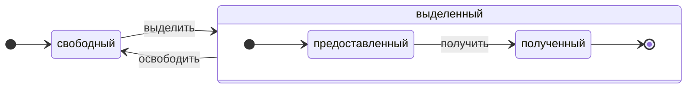

# Обзор архитектуры {#architecture-overview}

ClickHouse — это по-настоящему колоночная СУБД. Данные хранятся по столбцам и при выполнении запросов обрабатываются массивами (векторами или чанками столбцов).
По возможности операции выполняются над массивами, а не над отдельными значениями.
Это называется «векторизованное выполнение запросов» и помогает снизить стоимость фактической обработки данных.

Эта идея не нова.
Она восходит к `APL` (A programming language, 1957) и его потомкам: `A +` (диалект APL), `J` (1990), `K` (1993) и `Q` (язык программирования от Kx Systems, 2003).
Программирование на массивах (array programming) используется в научной обработке данных. Эта идея также не нова и для реляционных баз данных. Например, она используется в системе `VectorWise` (также известной как Actian Vector Analytic Database от компании Actian Corporation).

Существуют два разных подхода к ускорению обработки запросов: векторизованное выполнение запросов и генерация кода во время выполнения. Второй подход убирает все косвенные обращения и динамическую диспетчеризацию. Ни один из этих подходов не является однозначно лучшим по сравнению с другим. Генерация кода во время выполнения может быть лучше, когда она объединяет множество операций, тем самым полностью используя исполнительные блоки и конвейер CPU. Векторизованное выполнение запросов может быть менее практичным, поскольку оно предполагает использование временных векторов, которые нужно записывать в кэш и считывать обратно. Если временные данные не помещаются в кэш L2, это становится проблемой. Но векторизованное выполнение запросов проще использует SIMD-возможности CPU. [Исследовательская работа](http://15721.courses.cs.cmu.edu/spring2016/papers/p5-sompolski.pdf), написанная нашими коллегами, показывает, что лучше комбинировать оба подхода. ClickHouse использует векторизованное выполнение запросов и имеет ограниченную начальную поддержку генерации кода во время выполнения.

## Столбцы {#columns}

Интерфейс `IColumn` используется для представления столбцов в памяти (точнее, фрагментов столбцов). Этот интерфейс предоставляет вспомогательные методы для реализации различных реляционных операторов. Почти все операции являются неизменяемыми: они не модифицируют исходный столбец, а создают новый, изменённый. Например, метод `IColumn :: filter` принимает байтовую маску фильтра. Он используется реляционными операторами `WHERE` и `HAVING`. Дополнительные примеры: метод `IColumn :: permute` для поддержки `ORDER BY`, метод `IColumn :: cut` для поддержки `LIMIT`.

Различные реализации `IColumn` (`ColumnUInt8`, `ColumnString` и т. д.) отвечают за размещение столбцов в памяти. Размещение в памяти обычно представляет собой непрерывный массив. Для целочисленных столбцов это просто один непрерывный массив, подобный `std :: vector`. Для столбцов `String` и `Array` это два вектора: один — для всех элементов массива, размещённых последовательно, и второй — для смещений до начала каждого массива. Также есть `ColumnConst`, который хранит в памяти только одно значение, но выглядит как столбец.

## Field {#field}

Тем не менее, можно работать и с отдельными (одиночными) значениями. Для представления отдельного значения используется `Field`. `Field` — это просто дискриминирующее объединение типов `UInt64`, `Int64`, `Float64`, `String` и `Array`. В `IColumn` есть метод `operator []` для получения n-го значения в виде `Field` и метод `insert` для добавления `Field` в конец столбца. Эти методы не очень эффективны, поскольку требуют работы с временными объектами `Field`, представляющими отдельное значение. Существуют более эффективные методы, такие как `insertFrom`, `insertRangeFrom` и другие.

`Field` не содержит достаточно информации о конкретном типе данных в таблице. Например, `UInt8`, `UInt16`, `UInt32` и `UInt64` все представляются как `UInt64` в `Field`.

## Протекающие абстракции {#leaky-abstractions}

`IColumn` содержит методы для распространённых реляционных преобразований данных, но они не покрывают всех потребностей. Например, в `ColumnUInt64` нет метода для вычисления суммы двух столбцов, а в `ColumnString` — метода для поиска подстроки. Эти многочисленные процедуры реализуются вне `IColumn`.

Различные функции над столбцами могут быть реализованы обобщённым, но неэффективным способом — с использованием методов `IColumn` для извлечения значений `Field`, либо специализированным способом — с учётом внутренней структуры хранения данных в конкретной реализации `IColumn`. Для этого в самих функциях выполняется приведение столбцов к конкретному типу `IColumn` и непосредственная работа с его внутренним представлением. Например, `ColumnUInt64` имеет метод `getData`, который возвращает ссылку на внутренний массив, после чего отдельная процедура читает или заполняет этот массив напрямую. Мы используем «протекающие абстракции», чтобы обеспечить эффективные специализации различных процедур.

## Типы данных {#data_types}

`IDataType` отвечает за сериализацию и десериализацию: за чтение и запись фрагментов столбцов или отдельных значений в бинарном или текстовом виде. `IDataType` напрямую соответствует типам данных в таблицах. Например, существуют `DataTypeUInt32`, `DataTypeDateTime`, `DataTypeString` и так далее.

`IDataType` и `IColumn` связаны друг с другом лишь слабо. Разные типы данных могут быть представлены в памяти одними и теми же реализациями `IColumn`. Например, и `DataTypeUInt32`, и `DataTypeDateTime` представлены `ColumnUInt32` или `ColumnConstUInt32`. Кроме того, один и тот же тип данных может быть представлен разными реализациями `IColumn`. Например, `DataTypeUInt8` может быть представлен `ColumnUInt8` или `ColumnConstUInt8`.

`IDataType` хранит только метаданные. Например, `DataTypeUInt8` вообще ничего не хранит (кроме виртуального указателя `vptr`), а `DataTypeFixedString` хранит только `N` (размер строк фиксированной длины).

`IDataType` имеет вспомогательные методы для различных форматов данных. В качестве примера можно привести методы для сериализации значения с возможным заключением в кавычки, сериализации значения для JSON и сериализации значения как части формата XML. Прямого соответствия форматам данных нет. Например, разные форматы данных `Pretty` и `TabSeparated` могут использовать один и тот же вспомогательный метод `serializeTextEscaped` из интерфейса `IDataType`.

## Block {#block}

`Block` — это контейнер, представляющий подмножество (чанк) таблицы в памяти. Фактически это набор троек: `(IColumn, IDataType, column name)`. Во время выполнения запроса данные обрабатываются объектами `Block`. Если у нас есть `Block`, у нас есть данные (в объекте `IColumn`), есть информация об их типе (в `IDataType`), которая говорит нам, как работать с этим столбцом, и есть имя столбца. Это может быть либо исходное имя столбца из таблицы, либо искусственное имя, назначенное для получения временных результатов вычислений.

Когда мы вычисляем некоторую функцию над столбцами в блоке, мы добавляем в блок ещё один столбец с результатом и не изменяем столбцы, являющиеся аргументами функции, поскольку операции над ними считаются неизменяемыми. Позже ненужные столбцы могут быть удалены из блока, но не изменены. Это удобно для устранения общих подвыражений.

Блоки создаются для каждого обрабатываемого чанка данных. Обратите внимание, что для одного и того же типа вычислений имена и типы столбцов остаются одинаковыми для разных блоков, меняются только данные столбцов. Лучше отделить данные блока от заголовка блока, потому что при маленьких размерах блоков возникают значительные накладные расходы на временные строки для копирования `shared_ptr` и имён столбцов.

## Процессоры {#processors}

См. описание в файле [https://github.com/ClickHouse/ClickHouse/blob/master/src/Processors/IProcessor.h](https://github.com/ClickHouse/ClickHouse/blob/master/src/Processors/IProcessor.h).

## Форматы {#formats}

Форматы данных реализуются процессорами.

## Ввод/вывод {#io}

Для байтоориентированного ввода/вывода используются абстрактные классы `ReadBuffer` и `WriteBuffer`. Они применяются вместо потоков ввода-вывода C++ (`iostream`). Не беспокойтесь: в каждом зрелом C++‑проекте по веским причинам используется что‑то иное, а не `iostream`.

`ReadBuffer` и `WriteBuffer` — это просто непрерывный буфер и курсор, указывающий на позицию в этом буфере. Реализации могут владеть или не владеть памятью для буфера. Есть виртуальный метод для заполнения буфера следующими данными (для `ReadBuffer`) или для сброса содержимого буфера куда‑либо (для `WriteBuffer`). Виртуальные методы вызываются редко.

Реализации `ReadBuffer`/`WriteBuffer` используются для работы с файлами, файловыми дескрипторами и сетевыми сокетами, для реализации сжатия (`CompressedWriteBuffer` инициализируется другим `WriteBuffer` и выполняет сжатие перед записью данных в него), а также для других целей — названия `ConcatReadBuffer`, `LimitReadBuffer` и `HashingWriteBuffer` говорят сами за себя.

Read/WriteBuffers работают только с байтами. Для форматирования ввода/вывода есть функции в заголовочных файлах `ReadHelpers` и `WriteHelpers`. Например, есть вспомогательные функции для записи числа в десятичном формате.

Рассмотрим, что происходит, когда вы хотите вывести набор результатов в формате `JSON` в стандартный вывод (stdout).
У вас есть набор результатов, готовый к выборке из вытягивающего `QueryPipeline`.
Сначала вы создаёте `WriteBufferFromFileDescriptor(STDOUT_FILENO)` для записи байтов в stdout.
Затем вы подключаете результат из конвейера запросов к `JSONRowOutputFormat`, который инициализируется этим `WriteBuffer`, чтобы записывать строки в формате `JSON` в stdout.
Это можно сделать через метод `complete`, который превращает вытягивающий `QueryPipeline` в завершённый `QueryPipeline`.
Внутри `JSONRowOutputFormat` будет записывать различные JSON‑разделители и вызывать метод `IDataType::serializeTextJSON` со ссылкой на `IColumn` и номер строки в качестве аргументов. В свою очередь, `IDataType::serializeTextJSON` вызовет метод из `WriteHelpers.h`: например, `writeText` для числовых типов и `writeJSONString` для `DataTypeString`.

## Таблицы {#tables}

Интерфейс `IStorage` представляет таблицы. Разные реализации этого интерфейса — это разные движки таблиц. Примеры: `StorageMergeTree`, `StorageMemory` и так далее. Экземпляры этих классов — это сами таблицы.

Ключевые методы в `IStorage` — это `read` и `write`, а также другие, такие как `alter`, `rename` и `drop`. Метод `read` принимает следующие аргументы: набор столбцов для чтения из таблицы, `AST`‑запрос, который следует учитывать, и желаемое количество потоков. Он возвращает `Pipe`.

В большинстве случаев метод `read` отвечает только за чтение указанных столбцов из таблицы, а не за последующую обработку данных.
Вся дальнейшая обработка данных выполняется другой частью конвейера, которая выходит за рамки ответственности `IStorage`.

Однако есть важные исключения:

- `AST`‑запрос передается в метод `read`, и движок таблицы может использовать его, чтобы определить, как использовать индексы, и тем самым сократить объем данных, читаемых из таблицы.
- Иногда движок таблицы может обрабатывать данные самостоятельно до определённой стадии. Например, `StorageDistributed` может отправить запрос на удалённые серверы, попросить их обработать данные до стадии, на которой данные с разных удалённых серверов можно объединить, и вернуть эти предварительно обработанные данные. Интерпретатор запроса затем завершает обработку данных.

Метод `read` таблицы может возвращать `Pipe`, состоящий из нескольких процессоров (`Processor`). Эти процессоры могут читать из таблицы параллельно.
Затем вы можете соединить эти процессоры с различными другими преобразованиями (такими как вычисление выражений или фильтрация), которые могут выполняться независимо.
А затем создать поверх них `QueryPipeline` и выполнить его через `PipelineExecutor`.

Существуют также табличные функции (`TableFunction`). Это функции, которые возвращают временный объект `IStorage` для использования в секции `FROM` запроса.

Чтобы быстро понять, как реализовать свой движок таблицы, посмотрите на что‑нибудь простое, например `StorageMemory` или `StorageTinyLog`.

> В результате работы метода `read` `IStorage` возвращает `QueryProcessingStage` — информацию о том, какие части запроса уже были вычислены внутри хранилища.

## Парсеры {#parsers}

Ручной рекурсивный нисходящий парсер разбирает запрос. Например, `ParserSelectQuery` просто рекурсивно вызывает базовые парсеры для различных частей запроса. Парсеры создают `AST`. `AST` представлен узлами — экземплярами `IAST`.

> Генераторы парсеров не используются по историческим причинам.

## Интерпретаторы {#interpreters}

Интерпретаторы отвечают за создание конвейера выполнения запроса из AST. Существуют простые интерпретаторы, такие как `InterpreterExistsQuery` и `InterpreterDropQuery`, а также более сложный `InterpreterSelectQuery`.

Конвейер выполнения запроса представляет собой комбинацию процессоров, которые могут потреблять и производить чанки (наборы столбцов с заданными типами).
Процессор обменивается данными через порты и может иметь несколько входных и несколько выходных портов.
Более подробное описание можно найти в [src/Processors/IProcessor.h](https://github.com/ClickHouse/ClickHouse/blob/master/src/Processors/IProcessor.h).

Например, результатом интерпретации запроса `SELECT` является «тянущий» `QueryPipeline`, который имеет специальный выходной порт для чтения результирующего набора данных.
Результатом запроса `INSERT` является «толкающий» `QueryPipeline` с входным портом для записи данных для вставки.
А результат интерпретации запроса `INSERT SELECT` — «завершённый» `QueryPipeline`, который не имеет входов и выходов, но одновременно копирует данные из `SELECT` в `INSERT`.

`InterpreterSelectQuery` использует механизм `ExpressionAnalyzer` и `ExpressionActions` для анализа и трансформаций запросов. Именно здесь выполняется большинство основанных на правилах оптимизаций запросов. `ExpressionAnalyzer` довольно запутан и должен быть переписан: различные преобразования и оптимизации запросов следует выделить в отдельные классы, чтобы обеспечить модульные трансформации запроса.

Для решения проблем, существующих в интерпретаторах, был разработан новый `InterpreterSelectQueryAnalyzer`. Это новая версия `InterpreterSelectQuery`, которая не использует `ExpressionAnalyzer` и вводит дополнительный уровень абстракции между `AST` и `QueryPipeline`, называемый `QueryTree`. Он полностью готов к использованию в продакшене, но на всякий случай его можно отключить, установив настройку `enable_analyzer` в значение `false`.

## Функции {#functions}

Существуют обычные функции и агрегатные функции. Об агрегатных функциях см. в следующем разделе.

Обычные функции не изменяют количество строк — они работают так, как будто обрабатывают каждую строку независимо. На самом деле функции вызываются не для отдельных строк, а для блоков данных (`Block`), чтобы реализовать векторизованное выполнение запросов.

Существуют различные вспомогательные функции, такие как [blockSize](/sql-reference/functions/other-functions#blockSize), [rowNumberInBlock](/sql-reference/functions/other-functions#rowNumberInBlock) и [runningAccumulate](/sql-reference/functions/other-functions#runningAccumulate), которые используют блочную обработку и нарушают независимость строк.

В ClickHouse строгая типизация, поэтому не выполняется неявное приведение типов. Если функция не поддерживает определённую комбинацию типов, она выбрасывает исключение. При этом функции могут работать (быть перегруженными) для множества различных комбинаций типов. Например, функция `plus` (реализующая оператор `+`) работает для любой комбинации числовых типов: `UInt8` + `Float32`, `UInt16` + `Int8` и так далее. Кроме того, некоторые вариадические функции могут принимать произвольное число аргументов, например функция `concat`.

Реализация функции может быть немного неудобной, потому что функция явно осуществляет диспетчеризацию по поддерживаемым типам данных и поддерживаемым `IColumns`. Например, для функции `plus` код генерируется инстанцированием шаблона C++ для каждой комбинации числовых типов и для константных или неконстантных левого и правого аргументов.

Это отличное место для реализации генерации кода во время выполнения, чтобы избежать разрастания шаблонного кода. Это также позволяет добавлять комбинированные (fused) функции, такие как fused multiply-add, или выполнять несколько сравнений за одну итерацию цикла.

Из-за векторизованного выполнения запросов функции не используют укороченное вычисление (short-circuit). Например, если вы пишете `WHERE f(x) AND g(y)`, обе части будут вычислены, даже для строк, для которых `f(x)` равно нулю (за исключением случая, когда `f(x)` — нулевое константное выражение). Но если селективность условия `f(x)` высока, а вычисление `f(x)` значительно дешевле, чем `g(y)`, лучше реализовать многопроходное вычисление. Сначала будет вычислено `f(x)`, затем по результату будут отфильтрованы столбцы, и только после этого `g(y)` будет вычисляться лишь для меньших, отфильтрованных фрагментов данных.

## Агрегатные функции {#aggregate-functions}

Агрегатные функции — это функции с состоянием. Они накапливают переданные значения во внутреннем состоянии и позволяют получать результаты на основе этого состояния. Управление ими осуществляется через интерфейс `IAggregateFunction`. Состояния могут быть довольно простыми (состояние для `AggregateFunctionCount` — это всего лишь одно значение типа `UInt64`) или достаточно сложными (состояние `AggregateFunctionUniqCombined` — это комбинация линейного массива, хеш-таблицы и вероятностной структуры данных `HyperLogLog`).

Состояния размещаются в `Arena` (пуле памяти) для работы с несколькими состояниями при выполнении запроса `GROUP BY` с высокой кардинальностью. Состояния могут иметь нетривиальные конструктор и деструктор: например, сложные состояния агрегации могут самостоятельно выделять дополнительную память. Это требует аккуратности при создании и уничтожении состояний, а также при корректной передаче владения ими и соблюдении порядка их уничтожения.

Состояния агрегации могут быть сериализованы и десериализованы для передачи по сети во время распределённого выполнения запросов или для записи на диск при недостатке оперативной памяти. Они могут даже храниться в таблице с типом `DataTypeAggregateFunction`, чтобы обеспечивать инкрементальную агрегацию данных.

> В настоящий момент формат сериализации данных состояний агрегатных функций не версионируется. Это приемлемо, если агрегатные состояния хранятся только временно. Но у нас есть движок таблиц `AggregatingMergeTree` для инкрементальной агрегации, и он уже используется в продакшене. Именно поэтому при изменении формата сериализации для любой агрегатной функции в будущем требуется обратная совместимость.

## Сервер {#server}

Сервер реализует несколько различных интерфейсов:

- HTTP‑интерфейс для любых внешних клиентов.
- TCP‑интерфейс для нативного клиента ClickHouse и для межсерверного взаимодействия при выполнении распределённых запросов.
- Интерфейс для передачи данных при репликации.

Внутри это просто примитивный многопоточный сервер без корутин или файберов. Поскольку сервер спроектирован не для обработки большого числа простых запросов, а для обработки относительно небольшого числа сложных запросов, каждый из них может обрабатывать огромный объём данных для аналитики.

Сервер инициализирует класс `Context` с необходимой средой для выполнения запросов: списком доступных баз данных, пользователей и прав доступа, настройками, кластерами, списком процессов, журналом запросов и т. д. Интерпретаторы используют эту среду.

Мы поддерживаем полную прямую и обратную совместимость для серверного TCP‑протокола: старые клиенты могут работать с новыми серверами, а новые клиенты — со старыми серверами. Но мы не намерены поддерживать её бесконечно и удаляем поддержку старых версий примерно через год.

:::note
Для большинства внешних приложений мы рекомендуем использовать HTTP‑интерфейс, поскольку он простой и удобный. TCP‑протокол более тесно связан с внутренними структурами данных: он использует внутренний формат для передачи блоков данных и собственный протокол фрейминга для сжатых данных. Мы не выпускали C‑библиотеку для этого протокола, потому что для этого требуется линковать большую часть кодовой базы ClickHouse, что на практике нецелесообразно.
:::

## Конфигурация {#configuration}

Сервер ClickHouse построен на основе POCO C++ Libraries и использует `Poco::Util::AbstractConfiguration` для представления своей конфигурации. Конфигурация хранится в классе `Poco::Util::ServerApplication`, от которого наследуется класс `DaemonBase`, а уже от него наследуется класс `DB::Server`, реализующий непосредственно clickhouse-server. Таким образом, к конфигурации можно обратиться через метод `ServerApplication::config()`.

Конфигурация считывается из нескольких файлов (в формате XML или YAML) и объединяется в единый объект `AbstractConfiguration` с помощью класса `ConfigProcessor`. Конфигурация загружается при старте сервера и может быть перезагружена позже, если один из файлов конфигурации был обновлён, удалён или добавлен. Класс `ConfigReloader` отвечает за периодический мониторинг этих изменений, а также за процедуру перезагрузки. Запрос `SYSTEM RELOAD CONFIG` также инициирует перезагрузку конфигурации.

Для запросов и подсистем помимо `Server` конфигурация доступна через метод `Context::getConfigRef()`. Каждая подсистема, способная перезагружать свою конфигурацию без перезапуска сервера, должна зарегистрировать себя в callback-функции перезагрузки в методе `Server::main()`. Обратите внимание, что если новая конфигурация содержит ошибку, большинство подсистем проигнорируют её, запишут предупреждения в журнал и продолжат работу с ранее загруженной конфигурацией. В силу особенностей `AbstractConfiguration` невозможно передать ссылку на отдельный раздел, поэтому вместо этого обычно используется строковый префикс `config_prefix`.

## Потоки и задания {#threads-and-jobs}

Для выполнения запросов и вспомогательных операций ClickHouse выделяет потоки из одного из пулов потоков, чтобы избежать частого создания и уничтожения потоков. Существует несколько пулов потоков, которые выбираются в зависимости от назначения и структуры задания:
* Серверный пул для входящих клиентских сессий.
* Глобальный пул потоков для задач общего назначения, фоновой активности и автономных потоков.
* IO‑пул потоков для задач, которые в основном блокируются на операциях ввода‑вывода и не являются ресурсоёмкими по CPU.
* Фоновые пулы для периодических задач.
* Пулы для прерываемых задач, которые можно разбить на шаги.

Серверный пул — это экземпляр класса `Poco::ThreadPool`, определённый в методе `Server::main()`. Он может иметь не более `max_connection` потоков. Каждый поток закреплён за одним активным соединением.

Глобальный пул потоков — это синглтон‑класс `GlobalThreadPool`. Для выделения потока из него используется `ThreadFromGlobalPool`. Он имеет интерфейс, похожий на `std::thread`, но берёт поток из глобального пула и выполняет всю необходимую инициализацию. Он настраивается следующими параметрами:
* `max_thread_pool_size` — ограничение на количество потоков в пуле.
* `max_thread_pool_free_size` — ограничение на количество простаивающих потоков, ожидающих новых задач.
* `thread_pool_queue_size` — ограничение на количество запланированных задач.

Глобальный пул является универсальным, и все пулы, описанные ниже, реализованы поверх него. Это можно рассматривать как иерархию пулов. Любой специализированный пул берёт свои потоки из глобального пула с помощью класса `ThreadPool`. Таким образом, основная задача любого специализированного пула — задать ограничение на число одновременных задач и выполнять планирование задач. Если задач запланировано больше, чем потоков в пуле, `ThreadPool` накапливает задачи в очереди с приоритетами. Каждая задача имеет целочисленный приоритет. Приоритет по умолчанию — ноль. Все задачи с более высоким значением приоритета запускаются раньше любых задач с более низким значением приоритета. Однако между уже выполняющимися задачами различий нет, поэтому приоритет имеет значение только тогда, когда пул перегружен.

IO‑пул потоков реализован как обычный `ThreadPool`, доступный через метод `IOThreadPool::get()`. Он настраивается так же, как глобальный пул, с помощью параметров `max_io_thread_pool_size`, `max_io_thread_pool_free_size` и `io_thread_pool_queue_size`. Основная цель IO‑пула потоков — не допустить исчерпания глобального пула IO‑задачами, что могло бы помешать запросам полностью использовать CPU. Резервное копирование в S3 выполняет значительный объём операций ввода‑вывода, и чтобы избежать влияния на интерактивные запросы, существует отдельный `BackupsIOThreadPool`, настраиваемый параметрами `max_backups_io_thread_pool_size`, `max_backups_io_thread_pool_free_size` и `backups_io_thread_pool_queue_size`.

Для выполнения периодических задач существует класс `BackgroundSchedulePool`. Вы можете регистрировать задачи с использованием объектов `BackgroundSchedulePool::TaskHolder`, и пул гарантирует, что ни одна задача не запустит два задания одновременно. Он также позволяет отложить выполнение задачи до определённого момента в будущем или временно деактивировать задачу. Глобальный `Context` предоставляет несколько экземпляров этого класса для различных целей. Для задач общего назначения используется `Context::getSchedulePool()`.

Существуют также специализированные пулы потоков для прерываемых задач. Такая задача `IExecutableTask` может быть разбита на упорядоченную последовательность заданий, называемых шагами. Для планирования этих задач таким образом, чтобы короткие задачи имели приоритет над длинными, используется `MergeTreeBackgroundExecutor`. Как следует из названия, он применяется для фоновых операций, связанных с MergeTree, таких как слияния, мутации, выборки и перемещения. Экземпляры пулов доступны через `Context::getCommonExecutor()` и другие похожие методы.

Независимо от того, какой пул используется для задания, при запуске для этого задания создаётся экземпляр `ThreadStatus`. Он инкапсулирует всю информацию на уровне потока: идентификатор потока, идентификатор запроса, счётчики производительности, потребление ресурсов и множество других полезных данных. Задание может получить к нему доступ через потоковую локальную переменную с помощью вызова `CurrentThread::get()`, поэтому нам не нужно передавать его в каждую функцию.

Если поток относится к выполнению запроса, то наиболее важной сущностью, связанной с `ThreadStatus`, является контекст запроса `ContextPtr`. Каждый запрос имеет свой основной поток в серверном пуле. Основной поток выполняет привязку, удерживая объект `ThreadStatus::QueryScope query_scope(query_context)`. Основной поток также создаёт группу потоков, представленную объектом `ThreadGroupStatus`. Каждый дополнительный поток, выделенный во время выполнения этого запроса, привязывается к своей группе потоков вызовом `CurrentThread::attachTo(thread_group)`. Группы потоков используются для агрегирования счётчиков событий профилирования и отслеживания потребления памяти всеми потоками, выделенными для одной задачи (подробнее см. классы `MemoryTracker` и `ProfileEvents::Counters`).

## Контроль параллелизма {#concurrency-control}

Запрос, который может выполняться параллельно, использует настройку `max_threads`, чтобы ограничить количество потоков. Значение по умолчанию для этой настройки выбирается таким образом, чтобы один запрос мог наилучшим образом использовать все ядра CPU. Но что, если есть несколько одновременно выполняющихся запросов, и каждый из них использует значение `max_threads` по умолчанию? Тогда запросы будут делить ресурсы CPU. ОС будет обеспечивать справедливое распределение, постоянно переключая потоки, что вносит дополнительные накладные расходы и снижает производительность. `ConcurrencyControl` помогает снизить эти накладные расходы и избежать создания слишком большого числа потоков. Настройка конфигурации `concurrent_threads_soft_limit_num` используется для ограничения того, сколько одновременно выполняющихся потоков может быть выделено до начала применения механизма ограничения нагрузки на CPU.

Вводится понятие CPU-`slot`. Слот — это единица параллелизма: для запуска потока запрос должен заранее получить слот и освободить его, когда поток завершает работу. Количество слотов глобально ограничено на сервере. Несколько одновременно выполняющихся запросов конкурируют за CPU-слоты, если их суммарный спрос превышает общее количество слотов. `ConcurrencyControl` отвечает за разрешение этой конкуренции, выполняя планирование CPU-слотов справедливым образом.

Каждый слот можно рассматривать как независимый конечный автомат со следующими состояниями:

* `free`: слот доступен для выделения любому запросу.
* `granted`: слот `allocated` (выделен) для конкретного запроса, но еще не захвачен никаким потоком.
* `acquired`: слот `allocated` (выделен) для конкретного запроса и захвачен потоком.

Обратите внимание, что `allocated` слот может находиться в двух разных состояниях: `granted` и `acquired`. Первое является переходным состоянием, которое на практике должно быть коротким (от момента, когда слот выделен запросу, до момента, когда процедура масштабирования вверх — увеличения числа потоков — запускается любым потоком этого запроса).

API `ConcurrencyControl` состоит из следующих функций:

1. Создать распределение ресурсов для запроса: `auto slots = ConcurrencyControl::instance().allocate(1, max_threads);`. Оно выделит как минимум 1 и не более `max_threads` слотов. Обратите внимание, что первый слот предоставляется немедленно, а оставшиеся слоты могут быть выданы позже. Таким образом, лимит является мягким, потому что каждый запрос получит как минимум один поток.
2. Для каждого потока необходимо получить слот из ранее выделенного распределения: `while (auto slot = slots->tryAcquire()) spawnThread([slot = std::move(slot)] { ... });`.
3. Обновить общее количество слотов: `ConcurrencyControl::setMaxConcurrency(concurrent_threads_soft_limit_num)`. Может выполняться во время работы сервера, без его перезапуска.

Этот интерфейс позволяет запросам запускаться как минимум с одним потоком (в условиях нагрузки на CPU), а затем масштабироваться до `max_threads`.

## Распределённое выполнение запросов {#distributed-query-execution}

Серверы в кластерной конфигурации в основном независимы. Вы можете создать таблицу `Distributed` на одном или на всех серверах в кластере. Таблица `Distributed` не хранит данные сама по себе – она только предоставляет «представление» ко всем локальным таблицам на нескольких узлах кластера. Когда вы выполняете SELECT из таблицы `Distributed`, ClickHouse переписывает этот запрос, выбирает удалённые узлы в соответствии с настройками балансировки нагрузки и отправляет им запрос. Таблица `Distributed` запрашивает у удалённых серверов выполнение запроса лишь до той стадии, на которой можно объединить промежуточные результаты с разных серверов. Затем она получает эти промежуточные результаты и объединяет их. Таблица `Distributed` старается распределить как можно больше работы на удалённые серверы и не пересылать по сети значительные объёмы промежуточных данных.

Ситуация усложняется, когда у вас есть подзапросы в выражениях IN или JOIN, и каждый из них использует таблицу `Distributed`. Для выполнения таких запросов существуют разные стратегии.

Глобального плана запроса для распределённого выполнения запросов не существует. Каждый узел имеет свой локальный план запроса для своей части работы. Поддерживается только простое однопроходное распределённое выполнение запроса: мы отправляем запросы на удалённые узлы, а затем объединяем результаты. Но это становится непригодным для сложных запросов с `GROUP BY` высокой кардинальности или с большим объёмом временных данных для JOIN. В таких случаях необходимо «перераспределять» данные между серверами, что требует дополнительной координации. ClickHouse не поддерживает такой тип выполнения запросов, и это ещё предстоит реализовать.

## Merge tree {#merge-tree}

`MergeTree` — это семейство движков хранения, поддерживающих индексацию по первичному ключу. Первичный ключ может быть произвольным кортежем столбцов или выражений. Данные в таблице `MergeTree` хранятся в «частях» (parts). Каждая часть хранит данные в порядке первичного ключа, поэтому данные отсортированы лексикографически по кортежу первичного ключа. Все столбцы таблицы хранятся в отдельных файлах `column.bin` в этих частях. Файлы состоят из сжатых блоков. Каждый блок обычно содержит от 64 КБ до 1 МБ несжатых данных, в зависимости от среднего размера значения. Блоки состоят из значений столбцов, размещённых подряд друг за другом. Значения столбцов идут в одном и том же порядке для каждого столбца (порядок задаётся первичным ключом), поэтому при проходе по нескольким столбцам вы получаете значения для соответствующих строк.

Сам первичный ключ является «разреженным». Он ссылается не на каждую отдельную строку, а только на некоторые диапазоны данных. Отдельный файл `primary.idx` содержит значение первичного ключа для каждой N-й строки, где N называется `index_granularity` (обычно N = 8192). Также для каждого столбца имеются файлы `column.mrk` с «метками» (marks), которые представляют собой смещения до каждой N-й строки в файле данных. Каждая метка — это пара: смещение в файле до начала сжатого блока и смещение в распакованном блоке до начала данных. Обычно сжатые блоки выровнены по меткам, и смещение в распакованном блоке равно нулю. Данные из `primary.idx` всегда находятся в памяти, а данные из файлов `column.mrk` кэшируются.

Когда нам нужно прочитать что‑то из части в `MergeTree`, мы смотрим на данные `primary.idx` и находим диапазоны, которые могут содержать запрошенные данные, затем смотрим на данные `column.mrk` и вычисляем смещения, с которых нужно начать чтение этих диапазонов. Из‑за разрежённости может быть прочитано избыточное количество данных. ClickHouse не подходит для высокой нагрузки простыми точечными (point) запросами, поскольку для каждого ключа должен быть прочитан целый диапазон из `index_granularity` строк, и для каждого столбца должен быть декомпрессирован целый сжатый блок. Мы сделали индекс разрежённым, потому что нам нужно иметь возможность хранить триллионы строк на одном сервере без заметного потребления памяти под индекс. Кроме того, поскольку первичный ключ разрежённый, он не уникален: он не может проверить существование ключа в таблице во время INSERT. В таблице может быть много строк с одним и тем же ключом.

Когда вы выполняете `INSERT` пакета данных в `MergeTree`, этот пакет сортируется по порядку первичного ключа и формирует новую часть. Фоновые потоки периодически выбирают некоторые части и сливают их в одну отсортированную часть, чтобы поддерживать относительно небольшое количество частей. Поэтому движок и называется `MergeTree`. Разумеется, слияние приводит к «усилению записи» (write amplification). Все части являются неизменяемыми: они только создаются и удаляются, но не модифицируются. При выполнении SELECT удерживается снимок таблицы (набор частей). После слияния мы также какое‑то время храним старые части, чтобы упростить восстановление после сбоя, поэтому если мы видим, что некоторая слитая часть, вероятно, повреждена, мы можем заменить её исходными частями.

`MergeTree` не является LSM‑деревом, поскольку он не содержит MEMTABLE и LOG: вставленные данные записываются напрямую в файловую систему. Такое поведение делает MergeTree гораздо более подходящим для пакетных вставок данных. Поэтому частая вставка небольших объёмов строк не является оптимальной для MergeTree. Например, пара строк в секунду — это приемлемо, но выполнять такую вставку тысячу раз в секунду — не лучший вариант для MergeTree. Однако существует режим асинхронных вставок для небольших вставок, который позволяет обойти это ограничение. Мы реализовали это таким образом ради простоты и потому, что в наших приложениях мы уже вставляем данные пакетами.

Существуют движки MergeTree, которые выполняют дополнительную работу во время фоновых слияний. Примеры: `CollapsingMergeTree` и `AggregatingMergeTree`. Это можно рассматривать как специализированную поддержку обновлений. Имейте в виду, что это не настоящие обновления, поскольку пользователи обычно не контролируют момент выполнения фоновых слияний, и данные в таблице `MergeTree` почти всегда хранятся более чем в одной части, а не в полностью слитом виде.

## Репликация {#replication}

Репликация в ClickHouse может настраиваться на уровне отдельных таблиц. На одном и том же сервере у вас могут быть как реплицируемые, так и нереплицируемые таблицы. Также вы можете использовать разные схемы репликации для разных таблиц, например, одну таблицу с двухкратной репликацией, а другую — с трехкратной.

Репликация реализована в движке хранения `ReplicatedMergeTree`. Путь в `ZooKeeper` указывается как параметр движка хранения. Все таблицы с одинаковым путем в `ZooKeeper` становятся репликами друг друга: они синхронизируют свои данные и поддерживают согласованность. Реплики могут динамически добавляться и удаляться простым созданием или удалением таблицы.

Репликация использует асинхронную multi-master-схему. Вы можете вставлять данные в любую реплику, у которой есть сессия с `ZooKeeper`, и данные асинхронно реплицируются на все остальные реплики. Поскольку ClickHouse не поддерживает UPDATE-запросы, репликация является бесконфликтной. Так как по умолчанию нет кворумного подтверждения вставок, только что вставленные данные могут быть потеряны при отказе одного узла. Кворум вставки можно включить с помощью настройки `insert_quorum`.

Метаданные для репликации хранятся в ZooKeeper. Существует журнал репликации, в котором перечислены действия, которые необходимо выполнить. Действия включают: получить часть; слить части; удалить партицию и т. д. Каждая реплика копирует журнал репликации в свою очередь (очередь реплики), а затем выполняет действия из очереди. Например, при вставке в журнале создается действие «получить часть», и каждая реплика загружает эту часть. Слияния координируются между репликами для получения байт‑идентичных результатов. Все части сливаются одинаковым образом на всех репликах. Один из лидеров первым инициирует новое слияние и записывает действия «merge parts» в журнал. Одновременно лидерами могут быть несколько реплик (или все). Реплику можно запретить назначать лидером, используя настройку `merge_tree` `replicated_can_become_leader`. Лидеры отвечают за планирование фоновых слияний.

Репликация является физической: между узлами передаются только сжатые части, а не запросы. В большинстве случаев слияния обрабатываются на каждой реплике независимо, чтобы снизить сетевые издержки и избежать сетевой амплификации. Крупные слитые части отправляются по сети только в случаях значительной задержки репликации.

Кроме того, каждая реплика хранит свое состояние в ZooKeeper в виде набора частей и их контрольных сумм. Когда состояние на локальной файловой системе расходится с эталонным состоянием в ZooKeeper, реплика восстанавливает согласованность, загружая недостающие и поврежденные части с остальных реплик. Если в локальной файловой системе обнаруживаются неожиданные или поврежденные данные, ClickHouse не удаляет их, а перемещает в отдельный каталог и «забывает» о них.

:::note
Кластер ClickHouse состоит из независимых шардов, и каждый шард состоит из реплик. Кластер **не является эластичным**, поэтому после добавления нового шарда данные не перераспределяются между шардами автоматически. Вместо этого предполагается, что нагрузка на кластер будет намеренно неравномерной. Такая реализация дает больше контроля и подходит для относительно небольших кластеров, например, из нескольких десятков узлов. Но для кластеров из сотен узлов, которые мы используем в продакшене, этот подход становится существенным недостатком. Нам следует реализовать движок таблиц, охватывающий весь кластер, с динамически реплицируемыми областями, которые могли бы автоматически разбиваться и балансироваться между кластерами.
:::
