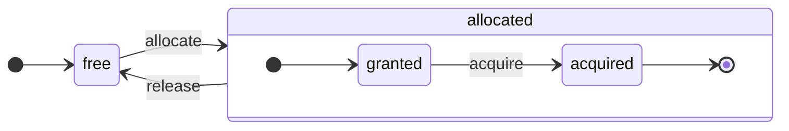

description: 'Всеобъемлющий обзор архитектуры ClickHouse и его столбцового дизайна'
sidebar_label: 'Обзор архитектуры'
sidebar_position: 50
slug: /development/architecture
title: 'Обзор архитектуры'
```

# Обзор архитектуры

ClickHouse — это настоящая столбцовая СУБД. Данные хранятся по колонкам, а во время выполнения запросов обрабатываются массивами (векторами или фрагментами колонок). 
Когда это возможно, операции выполняются над массивами, а не над отдельными значениями. 
Это называется "векторизованное выполнение запросов" и помогает снизить затраты на фактическую обработку данных.

Эта идея не нова. 
Она восходит к `APL` (язык программирования, 1957) и его потомкам: `A +` (диалект APL), `J` (1990), `K` (1993) и `Q` (язык программирования от Kx Systems, 2003). 
Массивное программирование используется в научной обработке данных. Ни для реляционных баз данных эта идея не нова. Например, она используется в системе `VectorWise` (также известной как Actian Vector Analytic Database от Actian Corporation).

Существует два различных подхода к ускорению обработки запросов: векторизованное выполнение запросов и генерация кода во время выполнения. Последний убирает всю индирекцию и динамическую диспетчеризацию. 
Ни один из этих подходов не является строго лучше другого. Генерация кода во время выполнения может быть лучше, когда она объединяет много операций, полностью используя единицы выполнения CPU и конвейер. 
Векторизованное выполнение запросов может быть менее практичным, поскольку включает временные векторы, которые нужно записывать в кеш и считывать обратно. Если временные данные не помещаются в кеш L2, это становится проблемой. 
Но векторизованное выполнение запросов легче использует SIMD-возможности CPU. Исследовательская работа, написанная нашими друзьями, показывает, что лучше сочетать оба подхода. ClickHouse использует векторизованное выполнение запросов и имеет ограниченную начальную поддержку генерации кода во время выполнения.

## Колонки {#columns}

Интерфейс `IColumn` используется для представления колонок в памяти (на самом деле, фрагментов колонок). Этот интерфейс предоставляет вспомогательные методы для реализации различных реляционных операторов. Почти все операции являются неизменяемыми: они не модифицируют оригинальную колонку, а создают новую измененную. Например, метод `IColumn::filter` принимает маску байтов фильтра. Он используется для реляционных операторов `WHERE` и `HAVING`. Дополнительные примеры: метод `IColumn::permute` для поддержки `ORDER BY`, метод `IColumn::cut` для поддержки `LIMIT`.

Различные реализации `IColumn` (`ColumnUInt8`, `ColumnString` и так далее) отвечают за компоновку памяти колонок. Обычно компоновка памяти представляет собой непрерывный массив. Для колонок целочисленного типа это просто один непрерывный массив, например, `std::vector`. Для колонок `String` и `Array` это два вектора: один для всех элементов массива, расположенный непрерывно, и второй для смещений к началу каждого массива. Также существует `ColumnConst`, который хранит лишь одно значение в памяти, но выглядит как колонка.

## Поле {#field}

Тем не менее, также возможна работа с отдельными значениями. Для представления отдельного значения используется `Field`. `Field` - это просто дискриминирующий союз `UInt64`, `Int64`, `Float64`, `String` и `Array`. `IColumn` имеет метод `operator []` для получения n-го значения в виде `Field` и метод `insert` для добавления `Field` в конец колонки. Эти методы не очень эффективны, так как требуют работы с временными объектами `Field`, представляющими отдельное значение. Есть более эффективные методы, такие как `insertFrom`, `insertRangeFrom` и так далее.

`Field` не имеет достаточной информации о конкретном типе данных для таблицы. Например, `UInt8`, `UInt16`, `UInt32` и `UInt64` все представлены как `UInt64` в `Field`.

## Протечки абстракций {#leaky-abstractions}

`IColumn` имеет методы для общих реляционных преобразований данных, но они не удовлетворяют всем потребностям. Например, `ColumnUInt64` не имеет метода для вычисления суммы двух колонок, а `ColumnString` не имеет метода для выполнения поиска подстроки. Эти бесчисленные рутины реализованы за пределами `IColumn`.

Различные функции на колонках могут быть реализованы общим, неэффективным способом с использованием методов `IColumn` для извлечения значений `Field`, или специализированным способом с использованием знаний о внутренней компоновке памяти данных в конкретной реализации `IColumn`. Это реализуется с помощью функций приведения к конкретному типу `IColumn` и работы с внутренним представлением напрямую. Например, `ColumnUInt64` имеет метод `getData`, который возвращает ссылку на внутренний массив, после чего отдельная рутина читает или заполняет этот массив напрямую. У нас есть "протечки абстракций", чтобы позволить эффективные специализированные реализации различных процедур.

## Типы данных {#data_types}

`IDataType` отвечает за сериализацию и десериализацию: для чтения и записи фрагментов колонок или отдельных значений в двоичном или текстовом формате. `IDataType` напрямую соответствует типам данных в таблицах. Например, существуют `DataTypeUInt32`, `DataTypeDateTime`, `DataTypeString` и так далее.

`IDataType` и `IColumn` лишь слабо связаны между собой. Различные типы данных могут быть представлены в памяти одной и той же реализацией `IColumn`. Например, `DataTypeUInt32` и `DataTypeDateTime` могут быть представлены как `ColumnUInt32` или `ColumnConstUInt32`. Кроме того, один и тот же тип данных может быть представлен различными реализациями `IColumn`. Например, `DataTypeUInt8` может быть представлен как `ColumnUInt8` или `ColumnConstUInt8`.

`IDataType` хранит только метаданные. Например, `DataTypeUInt8` не хранит ничего (кроме виртуального указателя `vptr`), а `DataTypeFixedString` хранит лишь `N` (размер строк фиксированной длины).

`IDataType` имеет вспомогательные методы для различных форматов данных. Примеры: методы для сериализации значения с возможным экранированием, для сериализации значения в формате JSON и для сериализации значения в компонент XML-формата. Прямого соответствия между форматами данных нет. Например, разные форматы данных `Pretty` и `TabSeparated` могут использовать один и тот же вспомогательный метод `serializeTextEscaped` из интерфейса `IDataType`.

## Блок {#block}

`Block` — это контейнер, представляющий подмножество (фрагмент) таблицы в памяти. Это просто набор троек: `(IColumn, IDataType, имя колонки)`. Во время выполнения запроса данные обрабатываются по `Block`. Если у нас есть `Block`, у нас есть данные (в объекте `IColumn`), у нас есть информация о его типе (в `IDataType`), которая сообщает нам, как работать с этой колонкой, и у нас есть имя колонки. Это может быть как оригинальное имя колонки из таблицы, так и какое-то искусственное имя, присвоенное для получения временных результатов вычислений.

Когда мы вычисляем какую-либо функцию над колонками в блоке, мы добавляем еще одну колонку с ее результатом в блок, и не трогаем колонки для аргументов функции, потому что операции являются неизменяемыми. Позже ненужные колонки могут быть удалены из блока, но не модифицированы. Это удобно для устранения общих подкованных выражений.

Блоки создаются для каждого обрабатываемого фрагмента данных. Обратите внимание, что для одного и того же типа вычислений имена и типы колонок остаются теми же для разных блоков, и только данные колонок меняются. Лучше отделить данные блока от заголовка блока, потому что маленькие размеры блока имеют высокий накладной расход на временные строки для копирования shared_ptr и имен колонок.

## Процессоры {#processors}

Смотрите описание по адресу [https://github.com/ClickHouse/ClickHouse/blob/master/src/Processors/IProcessor.h](https://github.com/ClickHouse/ClickHouse/blob/master/src/Processors/IProcessor.h).

## Форматы {#formats}

Форматы данных реализованы с помощью процессоров.

## I/O {#io}

Для побайтового ввода/вывода имеются абстрактные классы `ReadBuffer` и `WriteBuffer`. 
Они используются вместо `iostream` C++. Не волнуйтесь: каждый зрелый C++ проект использует что-то другое, кроме `iostream`, по веским причинам.

`ReadBuffer` и `WriteBuffer` — это просто непрерывный буфер и курсор, указывающий на позицию в этом буфере. Реализации могут владеть или не владеть памятью для буфера. Существует виртуальный метод для заполнения буфера следующими данными (для `ReadBuffer`) или для сброса буфера куда-либо (для `WriteBuffer`). Виртуальные методы редко вызываются.

Реализации `ReadBuffer`/`WriteBuffer` используются для работы с файлами и файловыми дескрипторами, сетевыми сокетами, для реализации сжатия (например, `CompressedWriteBuffer` инициализируется с другим WriteBuffer и выполняет сжатие перед записью данных в него) и для других целей – названия `ConcatReadBuffer`, `LimitReadBuffer` и `HashingWriteBuffer` говорят сами за себя.

Read/WriteBuffers работают исключительно с байтами. Существуют функции из заголовочных файлов `ReadHelpers` и `WriteHelpers`, помогающие с форматированием ввода/вывода. Например, есть вспомогательные функции для записи числа в десятичном формате.

Давайте рассмотрим, что происходит, когда вы хотите записать результат в формате `JSON` в stdout. 
У вас есть набор результатов, готовый к выборке из вытягивающегося `QueryPipeline`. 
Сначала вы создаете `WriteBufferFromFileDescriptor(STDOUT_FILENO)`, чтобы записать байты в stdout. 
Затем вы подключаете результат из конвейера запросов к `JSONRowOutputFormat`, который инициализируется с этим `WriteBuffer`, чтобы записывать строки в формате `JSON` в stdout. 
Это можно сделать с помощью метода `complete`, который превращает вытягивающийся `QueryPipeline` в завершенный `QueryPipeline`. 
Внутренне `JSONRowOutputFormat` будет записывать различные JSON-разделители и вызывать метод `IDataType::serializeTextJSON` с ссылкой на `IColumn` и номером строки в качестве аргументов. В результате `IDataType::serializeTextJSON` вызовет метод из `WriteHelpers.h`: например, `writeText` для числовых типов и `writeJSONString` для `DataTypeString`.

## Таблицы {#tables}

Интерфейс `IStorage` представляет таблицы. Разные реализации этого интерфейса являются различными движками таблиц. Примеры: `StorageMergeTree`, `StorageMemory` и так далее. Экземпляры этих классов — это просто таблицы.

Ключевые методы в `IStorage` — это `read` и `write`, наряду с другими, такими как `alter`, `rename` и `drop`. Метод `read` принимает следующие аргументы: набор колонок для чтения из таблицы, `AST` запрос для обработки и желаемое количество потоков. Он возвращает `Pipe`.

В большинстве случаев метод чтения отвечает только за чтение указанных колонок из таблицы, но не за дальнейшую обработку данных. 
Вся последующая обработка данных обрабатывается другой частью конвейера, что выходит за рамки ответственности `IStorage`.

Но есть примечательные исключения:

- Запрос AST передается в метод `read`, и движок таблицы может использовать его для определения использования индекса и для чтения меньшего объема данных из таблицы.
- Иногда движок таблицы может обрабатывать данные самостоятельно до определенной стадии. Например, `StorageDistributed` может отправить запрос на удаленные серверы, попросить их обработать данные до стадии, на которой данные из разных удаленных серверов могут быть объединены, и вернуть эти предварительно обработанные данные. Интерпретатор запросов затем завершает обработку данных.

Метод `read` таблицы может возвращать `Pipe`, состоящий из нескольких `Processors`. Эти `Processors` могут читать из таблицы параллельно. Затем вы можете соединить эти процессоры с различными другими преобразованиями (такими как оценка выражений или фильтрация), которые могут быть вычислены независимо. 
А затем создать `QueryPipeline` поверх них и выполнить его с помощью `PipelineExecutor`.

Существуют также `TableFunction`. Это функции, которые возвращают временный объект `IStorage` для использования в конструкции `FROM` запроса.

Чтобы быстро понять, как реализовать свой движок таблиц, посмотрите на что-то простое, например, `StorageMemory` или `StorageTinyLog`.

> В результате метод `read` возвращает `QueryProcessingStage` — информацию о том, какие части запроса уже были вычислены внутри хранения.

## Парсеры {#parsers}

Ручной парсер с рекурсивным спуском разбирает запрос. Например, `ParserSelectQuery` просто рекурсивно вызывает базовые парсеры для различных частей запроса. Парсеры создают `AST`. `AST` представлен узлами, которые являются экземплярами `IAST`.

> Генераторы парсеров не используются по историческим причинам.

## Интерпретаторы {#interpreters}

Интерпретаторы отвечают за создание конвейера выполнения запроса из AST. Существуют простые интерпретаторы, такие как `InterpreterExistsQuery` и `InterpreterDropQuery`, а также более сложные, такие как `InterpreterSelectQuery`.

Конвейер выполнения запроса представляет собой комбинацию процессоров, которые могут потреблять и производить фрагменты (наборы колонок с конкретными типами). 
Процессор взаимодействует через порты и может иметь несколько входных и выходных портов. Более подробное описание можно найти в [src/Processors/IProcessor.h](https://github.com/ClickHouse/ClickHouse/blob/master/src/Processors/IProcessor.h).

Например, результат интерпретации запроса `SELECT` — это "вытягивающийся" `QueryPipeline`, который имеет специальный выходной порт для чтения набора результатов. 
Результат запроса `INSERT` — это "пушащий" `QueryPipeline` с входным портом для записи данных для вставки. 
А результат интерпретации запроса `INSERT SELECT` — это "завершенный" `QueryPipeline`, который не имеет входов или выходов, но копирует данные из `SELECT` в `INSERT` одновременно.

`InterpreterSelectQuery` использует механизмы `ExpressionAnalyzer` и `ExpressionActions` для анализа и преобразования запросов. Здесь выполняется большинство оптимизаций запросов на основе правил. `ExpressionAnalyzer` довольно сложен и требует переписывания: различные преобразования и оптимизации запросов должны быть извлечены в отдельные классы, чтобы позволить модульные преобразования запросов.

Чтобы решить проблемы, существующие в интерпретаторах, была разработана новая версия `InterpreterSelectQueryAnalyzer`. Это новая версия `InterpreterSelectQuery`, которая не использует `ExpressionAnalyzer` и вводит дополнительный уровень абстракции между `AST` и `QueryPipeline`, называемый `QueryTree`. Он полностью готов к использованию в продакшене, но на всякий случай его можно отключить, установив значение параметра `enable_analyzer` в `false`.

## Функции {#functions}

Существуют обычные функции и агрегатные функции. Для агрегатных функций смотрите следующий раздел.

Обычные функции не изменяют количество строк — они работают так, как будто обрабатывают каждую строку независимо. На самом деле функции не вызываются для отдельных строк, а для `Block` данных для реализации векторизованного выполнения запросов.

Существуют некоторые различные функции, такие как [blockSize](/sql-reference/functions/other-functions#blockSize), [rowNumberInBlock](/sql-reference/functions/other-functions#rowNumberInBlock) и [runningAccumulate](/sql-reference/functions/other-functions#runningaccumulate), которые используют обработку блоков и нарушают независимость строк.

ClickHouse имеет строгую типизацию, поэтому не происходит неявного преобразования типов. Если функция не поддерживает определенную комбинацию типов, она выдает исключение. Но функции могут работать (быть перегруженными) для многих различных комбинаций типов. Например, функция `plus` (для реализации оператора `+`) работает для любой комбинации числовых типов: `UInt8` + `Float32`, `UInt16` + `Int8` и так далее. Кроме того, некоторые вариативные функции могут принимать любое количество аргументов, такие как функция `concat`.

Реализация функции может быть немного неудобной, поскольку функция явно диспетчеризует поддерживаемые типы данных и поддерживаемые `IColumns`. Например, функция `plus` имеет код, сгенерированный путем инстанцирования шаблона C++ для каждой комбинации числовых типов и постоянных или непостоянных левых и правых аргументов.

Это отличное место для реализации генерации кода во время выполнения, чтобы избежать раздувания кода шаблона. Также это позволяет добавлять соединенные функции, такие как соединенное умножение и сложение или выполнять несколько сравнений в одной итерации цикла.

Из-за векторизованного выполнения запросов функции не сокращаются. Например, если вы пишете `WHERE f(x) AND g(y)`, обе стороны рассчитываются, даже для строк, когда `f(x)` равно нулю (за исключением случая, когда `f(x)` является нулевым постоянным выражением). Но если выборочность условия `f(x)` высокая, и вычисление `f(x)` намного дешевле, чем `g(y)`, лучше реализовать многопроходное вычисление. Сначала вычисляется `f(x)`, затем фильтруются колонки по результату, а затем `g(y)` вычисляется только для меньших, отфильтрованных фрагментов данных.

## Агрегатные функции {#aggregate-functions}

Агрегатные функции являются состоявшимися функциями. Они накапливают переданные значения в неком состоянии и позволяют вам получать результаты из этого состояния. Они управляются интерфейсом `IAggregateFunction`. Состояния могут быть довольно простыми (состояние для `AggregateFunctionCount` — это просто одно значение `UInt64`) или довольно сложными (состояние `AggregateFunctionUniqCombined` — это комбинация линейного массива, хеш-таблицы и вероятностной структуры данных `HyperLogLog`).

Состояния выделяются в `Arena` (пул памяти) для обработки нескольких состояний при выполнении запроса `GROUP BY` с высокой кардинальностью. Состояния могут иметь нетривиальный конструктор и деструктор: например, сложные состояния агрегации могут сами выделять дополнительную память. Это требует осторожности при создании и уничтожении состояний и правильной передачи их владения и порядка уничтожения. 

Состояния агрегации могут сериализоваться и десериализоваться для передачи по сети во время распределенного выполнения запросов или для записи на диск, когда ОЗУ недостаточно. Их даже можно хранить в таблице с `DataTypeAggregateFunction`, чтобы позволить инкрементальную агрегацию данных.

> Формат сериализованных данных для состояний агрегатных функций в настоящее время не находится под версионным контролем. Это приемлемо, если состояния агрегации хранятся только временно. Но у нас есть движок таблиц `AggregatingMergeTree` для инкрементальной агрегации, и люди уже используют его в производстве. Это причина, почему обратная совместимость требуется при изменении сериализованного формата для любой агрегатной функции в будущем.

## Сервер {#server}

Сервер реализует несколько различных интерфейсов:

- HTTP интерфейс для любых сторонних клиентов.
- TCP интерфейс для родного клиента ClickHouse и для межсерверной связи при распределенном выполнении запросов.
- Интерфейс для передачи данных для репликации.

Внутренне это просто примитивный многопоточный сервер без корутин или фибр. Поскольку сервер не предназначен для обработки высокого объема простых запросов, а для обработки относительно низкого объема сложных запросов, каждый из них может обрабатывать огромное количество данных для аналитики.

Сервер инициализирует класс `Context` с необходимой средой для выполнения запросов: список доступных баз данных, пользователей и прав доступа, настройки, кластеры, список процессов, журнал запросов и так далее. Интерпретаторы используют эту среду.

Мы поддерживаем полную обратную и прямую совместимость для TCP протокола сервера: старые клиенты могут общаться с новыми серверами, а новые клиенты могут общаться со старыми серверами. Но мы не хотим поддерживать это вечно, и мы удаляем поддержку старых версий после примерно одного года.

:::note
Для большинства внешних приложений мы рекомендуем использовать HTTP интерфейс, так как он прост и удобен в использовании. Протокол TCP более тесно связан с внутренними структурами данных: он использует внутренний формат для передачи блоков данных и пользовательское фреймирование для сжатых данных. Мы не выпустили C библиотеку для этого протокола, так как это требует связывания с большинством кода ClickHouse, что непрактично.
:::

## Конфигурация {#configuration}

Сервер ClickHouse основан на POCO C++ библиотеках и использует `Poco::Util::AbstractConfiguration` для представления своей конфигурации. Конфигурация хранится в классе `Poco::Util::ServerApplication`, унаследованном от класса `DaemonBase`, который в свою очередь наследуется классом `DB::Server`, реализующим сам clickhouse-server. Так конфигурацию можно получить через метод `ServerApplication::config()`.

Конфигурация считывается из множества файлов (в формате XML или YAML) и объединяется в единый `AbstractConfiguration` с помощью класса `ConfigProcessor`. Конфигурация загружается при старте сервера и может быть перезагружена позже, если один из конфигурационных файлов обновлён, удалён или добавлен. Класс `ConfigReloader` отвечает за периодический мониторинг этих изменений и процедуру перезагрузки. Запрос `SYSTEM RELOAD CONFIG` также инициирует перезагрузку конфигурации.

Для запросов и подсистем, отличных от `Server`, конфигурация доступна через метод `Context::getConfigRef()`. Каждая подсистема, способная перезагружать свою конфигурацию без перезапуска сервера, должна зарегистрироваться в колбек вызова перезагрузки в методе `Server::main()`. Обратите внимание, что если новая конфигурация содержит ошибку, большинство подсистем проигнорируют новую конфигурацию, залогируют предупреждающие сообщения и продолжат работать с ранее загруженной конфигурацией. Из-за природы `AbstractConfiguration` невозможно передать ссылку на конкретный раздел, поэтому обычно используется `String config_prefix`.

## Потоки и задачи {#threads-and-jobs}

Для выполнения запросов и отвлечённых задач ClickHouse выделяет потоки из одного из пулов потоков, чтобы избежать частого создания и уничтожения потоков. Существует несколько пулов потоков, которые выбираются в зависимости от назначения и структуры задачи:
  * Пул сервера для входящих клиентских сессий.
  * Глобальный пул потоков для общих задач, фоновой активности и автономных потоков.
  * Пул потоков ввода-вывода для задач, которые в основном заблокированы для ввода-вывода и не требуют интенсивной работы CPU.
  * Фоновые пулы для периодических задач.
  * Пулы для прерываемых задач, которые могут быть разбиты на шаги.

Пул сервера является экземпляром класса `Poco::ThreadPool`, определённого в методе `Server::main()`. Он может иметь максимум `max_connection` потоков. Каждый поток выделен для одного активного соединения.

Глобальный пул потоков — это синглтон класса `GlobalThreadPool`. Чтобы выделить поток из него, используется `ThreadFromGlobalPool`. Он имеет интерфейс, подобный `std::thread`, но извлекает поток из глобального пула и выполняет всю необходимую инициализацию. Он настраивается с помощью следующих параметров:
  * `max_thread_pool_size` — ограничение на количество потоков в пуле.
  * `max_thread_pool_free_size` — ограничение на количество неактивных потоков, ожидающих новых задач.
  * `thread_pool_queue_size` — ограничение на количество запланированных задач.

Глобальный пул является универсальным, и все описанные ниже пулы реализованы на его основе. Это можно рассматривать как иерархию пулов. Любой специализированный пул берет свои потоки из глобального пула с использованием класса `ThreadPool`. Таким образом, основная задача любого специализированного пула — применить ограничение на количество одновременных задач и выполнить планирование задач. Если запланировано больше задач, чем потоков в пуле, `ThreadPool` накапливает задачи в очереди с приоритетами. Каждой задаче присваивается целочисленный приоритет. По умолчанию приоритет равен нулю. Все задачи с более высокими значениями приоритета запускаются перед любыми задачами с более низким приоритетом. Но нет различий между уже исполняемыми задачами, таким образом, приоритет имеет значение только тогда, когда пул перегружен.

Пул потоков ввода-вывода реализован как простой `ThreadPool`, доступный через метод `IOThreadPool::get()`. Он настраивается так же, как и глобальный пул с настройками `max_io_thread_pool_size`, `max_io_thread_pool_free_size` и `io_thread_pool_queue_size`. Основная цель пула потоков ввода-вывода — избежать истощения глобального пула потоков задачами ввода-вывода, что могло бы помешать запросам полностью использовать CPU. Резервное копирование в S3 выполняет значительное количество операций ввода-вывода, и чтобы избежать влияния на интерактивные запросы, существует отдельный `BackupsIOThreadPool`, настроенный с помощью `max_backups_io_thread_pool_size`, `max_backups_io_thread_pool_free_size` и `backups_io_thread_pool_queue_size`.

Для выполнения периодических задач существует класс `BackgroundSchedulePool`. Вы можете регистрировать задачи с помощью объектов `BackgroundSchedulePool::TaskHolder`, и пул обеспечивает, чтобы ни одна задача не запускала две задачи одновременно. Он также позволяет отложить выполнение задачи до определённого момента в будущем или временно деактивировать задачу. Глобальный `Context` предоставляет несколько экземпляров этого класса для разных целей. Для задач общего назначения используется `Context::getSchedulePool()`.

Существуют также специализированные пулы потоков для прерываемых задач. Такая задача `IExecutableTask` может быть разбита на упорядоченную последовательность работ, называемую шагами. Для планирования этих задач таким образом, чтобы короткие задачи имели приоритет перед долгими, используется `MergeTreeBackgroundExecutor`. Как следует из названия, он используется для фоновых операций, связанных с MergeTree, таких как слияния, мутации, выборки и перемещения. Экземпляры пула доступны через `Context::getCommonExecutor()` и другие аналогичные методы.

Несмотря на то, какой пул используется для задачи, в начале создаётся экземпляр `ThreadStatus` для этой задачи. Он инкапсулирует всю информацию для каждого потока: идентификатор потока, идентификатор запроса, счетчики производительности, потребление ресурсов и многие другие полезные данные. Задача может получить к нему доступ через указатель локального потока с помощью вызова `CurrentThread::get()`, поэтому нам не нужно передавать его каждой функции.

Если поток связан с выполнением запроса, то самое важное, что прикреплено к `ThreadStatus`, это контекст запроса `ContextPtr`. Каждый запрос имеет свой главный поток в пуле сервера. Главный поток присоединяет его, удерживая объект `ThreadStatus::QueryScope query_scope(query_context)`. Главный поток также создает группу потоков, представленную объектом `ThreadGroupStatus`. Каждый дополнительный поток, который выделяется во время выполнения этого запроса, присоединяется к своей группе потоков с помощью вызова `CurrentThread::attachTo(thread_group)`. Группы потоков используются для агрегирования профилирования событий и отслеживания потребления памяти всеми потоками, выделенными для одной задачи (см. классы `MemoryTracker` и `ProfileEvents::Counters` для получения дополнительной информации).

## Управление конкурентностью {#concurrency-control}

Запрос, который может быть параллелизирован, использует настройку `max_threads`, чтобы ограничить себя. Значение по умолчанию для этой настройки выбрано так, чтобы позволить одному запросу оптимально использовать все ядра CPU. Но что, если существует несколько одновременных запросов, и каждый из них использует значение по умолчанию для настройки `max_threads`? Тогда запросы будут разделять ресурсы CPU. Операционная система обеспечит честность, постоянно переключая потоки, что приводит к некоторым штрафам производительности. `ConcurrencyControl` помогает справиться с этим штрафом и избежать выделения большого количества потоков. Конфигурационная настройка `concurrent_threads_soft_limit_num` используется для ограничения того, сколько одновременных потоков может быть выделено перед открытием какого-либо давления на CPU.

Вводится понятие `slot` CPU. Слот является единицей конкурентности: чтобы запустить поток, запрос должен сначала получить слот и освободить его, когда поток остановится. 
Количество слотов ограничено на сервере. Множественные одновременные запросы конкурируют за слоты CPU, если общий спрос превышает общее количество слотов. `ConcurrencyControl` отвечает за разрешение этой конкуренции, проводя планировку слотов CPU честно.

Каждый слот можно рассматривать как независимую машину состояний со следующими состояниями:
 * `free`: слот доступен для выделения любым запросом.
 * `granted`: слот `выделен` конкретному запросу, но еще не получен ни одним потоком.
 * `acquired`: слот `выделен` конкретному запросу и получен потоком.

Обратите внимание, что слот `allocated` может находиться в двух разных состояниях: `granted` и `acquired`. Первое — это переходное состояние, которое на самом деле должно быть коротким (с момента, когда слот выделяется запросу, до момента, когда процедура масштабирования запускается любым потоком этого запроса).



API `ConcurrencyControl` состоит из следующих функций:
1. Создать распределение ресурсов для запроса: `auto slots = ConcurrencyControl::instance().allocate(1, max_threads);`. Это распределит как минимум 1 и максимум `max_threads` слот. Обратите внимание, что первый слот выделяется немедленно, но оставшиеся слоты могут быть выделены позже. Таким образом, лимит является мягким, потому что каждый запрос получит как минимум один поток.
2. Для каждого потока слот должен быть получен из распределения: `while (auto slot = slots->tryAcquire()) spawnThread([slot = std::move(slot)] { ... });`.
3. Обновить общее количество слотов: `ConcurrencyControl::setMaxConcurrency(concurrent_threads_soft_limit_num)`. Это можно сделать в рабочем режиме, без перезапуска сервера.

Этот API позволяет запросам начинать с как минимум одного потока (в условиях давления CPU) и впоследствии масштабироваться до `max_threads`.
```
## Исполнение Распределённых Запросов {#distributed-query-execution}

Сервера в кластере в основном независимы. Вы можете создать `Distributed` таблицу на одном или всех серверах в кластере. Таблица `Distributed` сама не хранит данные – она только предоставляет "представление" всех локальных таблиц на нескольких узлах кластера. Когда вы выполняете SELECT из таблицы `Distributed`, она переписывает этот запрос, выбирает удалённые узлы в соответствии с настройками балансировки нагрузки и отправляет запрос им. Таблица `Distributed` запрашивает удалённые сервера для обработки запроса только до стадии, когда промежуточные результаты из разных серверов могут быть объединены. Затем она получает промежуточные результаты и объединяет их. Распределённая таблица пытается распределить как можно больше работы на удалённые серверы и не отправляет много промежуточных данных по сети.

Ситуация становится более сложной, когда у вас есть подзапросы в IN или JOIN clauses, и каждый из них использует таблицу `Distributed`. У нас есть разные стратегии для исполнения этих запросов.

Не существует глобального плана запроса для распределённого исполнения запросов. У каждого узла есть свой локальный план запроса для своей части работы. У нас есть только простой однопроходный распределённый план исполнения запросов: мы отправляем запросы на удалённые узлы, а затем объединяем результаты. Но это нецелесообразно для сложных запросов с высок cardinality `GROUP BY` или с большим объёмом временных данных для JOIN. В таких случаях нам нужно "перемешать" данные между серверами, что требует дополнительной координации. ClickHouse не поддерживает такой тип исполнения запросов, и нам нужно работать над этим.

## Merge Tree {#merge-tree}

`MergeTree` - это семейство движков хранения, которое поддерживает индексацию по первичному ключу. Первичный ключ может быть произвольным кортежем колонок или выражений. Данные в таблице `MergeTree` хранятся в "частях". Каждая часть хранит данные в порядке первичного ключа, поэтому данные упорядочены лексикографически по кортежу первичного ключа. Все колонки таблицы хранятся в отдельных файлах `column.bin` в этих частях. Файлы состоят из сжатых блоков. Каждый блок обычно составляет от 64 КБ до 1 МБ несжатых данных, в зависимости от среднего размера значения. Блоки состоят из значений колонок, размещённых последовательно одно за другим. Значения колонок находятся в одном и том же порядке для каждой колонки (первичный ключ определяет порядок), поэтому, когда вы итерируете по многим колонкам, вы получаете значения для соответствующих строк.

Сам первичный ключ является "разреженным". Он не адресует каждую отдельную строку, а только некоторые диапазоны данных. Отдельный файл `primary.idx` содержит значение первичного ключа для каждой N-й строки, где N называется `index_granularity` (обычно N = 8192). Также для каждой колонки у нас есть файлы `column.mrk` с "метками", которые являются смещениями до каждой N-й строки в файле данных. Каждая метка представляет собой пару: смещение в файле до начала сжатого блока и смещение в декомпрессированном блоке до начала данных. Обычно сжатые блоки выровнены по меткам, и смещение в декомпрессированном блоке равно нулю. Данные для `primary.idx` всегда находятся в памяти, а данные для файлов `column.mrk` кэшируются.

Когда мы собираемся считать что-то из части в `MergeTree`, мы смотрим на данные `primary.idx` и находим диапазоны, которые могут содержать запрашиваемые данные, затем смотрим на данные `column.mrk` и вычисляем смещения, с которых начинать чтение этих диапазонов. Из-за разреженности может быть прочитано избыточное количество данных. ClickHouse не подходит для высокой нагрузки простых точечных запросов, потому что для каждой ключевой записи необходимо прочитать весь диапазон с `index_granularity` строк, и весь сжатый блок должен быть декомпрессирован для каждой колонки. Мы сделали индекс разреженным, потому что должны быть в состоянии поддерживать триллионы строк на одном сервере без заметного потребления памяти для индекса. Также, поскольку первичный ключ разрежен, он не уникален: он не может проверить существование ключа в таблице во время INSERT. У вас может быть много строк с одним и тем же ключом в таблице.

Когда вы `INSERT` группу данных в `MergeTree`, эта группа сортируется по порядку первичного ключа и формирует новую часть. Существуют фоновые потоки, которые периодически выбирают некоторые части и объединяют их в одну отсортированную часть, чтобы поддерживать относительное низкое количество частей. Вот почему это называется `MergeTree`. Конечно, слияние приводит к "умножению записи". Все части неизменяемы: они только создаются и удаляются, но не модифицируются. Когда выполняется SELECT, он удерживает снимок таблицы (набор частей). После слияния мы также храним старые части в течение некоторого времени, чтобы упростить восстановление после сбоя, так что если мы видим, что какая-то объединённая часть, вероятно, повреждена, мы можем заменить её её исходными частями.

`MergeTree` не является деревом LSM, потому что не содержит MEMTABLE и LOG: вставленные данные записываются непосредственно в файловую систему. Такое поведение делает MergeTree гораздо более подходящим для вставки данных пакетами. Поэтому частые вставки небольшого объёма строк не идеальны для MergeTree. Например, пара строк в секунду нормально, но делать это тысячу раз в секунду не оптимально для MergeTree. Однако существует асинхронный режим вставки для небольших вставок, чтобы преодолеть это ограничение. Мы сделали это для простоты и потому, что мы уже вставляем данные пакетами в наших приложениях.

Существуют движки MergeTree, которые выполняют дополнительную работу во время фонов глобальных слияний. Примеры - `CollapsingMergeTree` и `AggregatingMergeTree`. Это может быть расценено как специальная поддержка обновлений. Имейте в виду, что это не настоящие обновления, потому что пользователи обычно не контролируют время, когда выполняются фоновые слияния, и данные в таблице `MergeTree` почти всегда хранятся более чем в одной части, а не в полностью объединённой форме.

## Репликация {#replication}

Репликацию в ClickHouse можно настроить для каждой таблицы отдельно. У вас могут быть как реплицированные, так и нереплицированные таблицы на одном сервере. Вы также можете иметь таблицы, реплицированные разными способами, например, одна таблица с двухфакторной репликацией и другая с трехфакторной.

Репликация реализована в движке хранения `ReplicatedMergeTree`. Путь в `ZooKeeper` указывается в качестве параметра для движка хранения. Все таблицы с одинаковым путем в `ZooKeeper` становятся репликами друг друга: они синхронизируют свои данные и поддерживают согласованность. Реплики могут добавляться и удаляться динамически просто путём создания или удаления таблицы.

Репликация использует асинхронную многомасштабную схему. Вы можете вставлять данные в любую реплику, у которой есть сессия с `ZooKeeper`, и данные реплицируются во все другие реплики асинхронно. Поскольку ClickHouse не поддерживает UPDATE, репликация является свободной от конфликтов. Поскольку нет подтверждения кворума вставок по умолчанию, только что вставленные данные могут быть потеряны, если один узел выходит из строя. Кворум вставки можно активировать с помощью настройки `insert_quorum`.

Метаданные для репликации хранятся в ZooKeeper. Есть журнал репликации, который перечисляет, какие действия следует выполнить. Действия: получить часть; слить части; удалить партицию и так далее. Каждая реплика копирует журнал репликации в свою очередь и затем выполняет действия из очереди. Например, при вставке действие "получить часть" создается в журнале, и каждая реплика загружает эту часть. Слияния координируются между репликами для получения идентичных байтовых результатов. Все части объединяются одинаково на всех репликах. Один из лидеров инициирует новое слияние первым и записывает действия "слияние частей" в журнал. Несколько реплик (или все) могут быть лидерами одновременно. Реплику можно предотвратить от становления лидером с помощью настройки `merge_tree` `replicated_can_become_leader`. Лидеры ответственны за планирование фоновых слияний.

Репликация физическая: между узлами передаются только сжатые части, а не запросы. Слияния обрабатываются на каждой реплике независимо в большинстве случаев, чтобы снизить сетевые затраты, избегая сетевого умножения. Большие слитые части отправляются по сети только в случаях значительной задержки репликации.

Кроме того, каждая реплика хранит своё состояние в ZooKeeper в виде набора частей и их контрольных сумм. Когда состояние на локальной файловой системе расходится с эталонным состоянием в ZooKeeper, реплика восстанавливает свою согласованность, загружая отсутствующие и повреждённые части из других реплик. Когда в локальной файловой системе есть какие-либо неожиданные или повреждённые данные, ClickHouse их не удаляет, а перемещает в отдельный каталог и забывает о них.

:::note
Кластер ClickHouse состоит из независимых шардов, и каждый шард состоит из реплик. Кластер **неэластичный**, поэтому после добавления нового шарда данные не перераспределяются автоматически между шарами. Вместо этого предполагается, что нагрузка кластера будет корректироваться так, чтобы быть неравномерной. Эта реализация предоставляет вам больше контроля, и это нормально для относительно небольших кластеров, таких как десятки узлов. Но для кластеров с сотнями узлов, которые мы используем в производстве, этот подход становится значительным недостатком. Нам следует реализовать движок таблиц, который охватывает кластер с динамически реплицированными регионами, которые могут быть автоматически разделены и сбалансированы между кластерами.
:::
