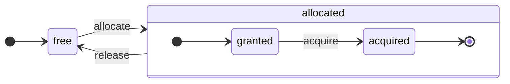

# Обзор Архитектуры

ClickHouse — это настоящая столбцовая СУБД. Данные хранятся по столбцам и во время выполнения массивов (векторов или фрагментов колонок).
Когда это возможно, операции выполняются на массивах, а не на отдельных значениях.
Это называется "векторизованное выполнение запросов" и помогает снизить стоимость фактической обработки данных.

Эта идея не новая.
Она восходит к `APL` (язык программирования, 1957) и его потомкам: `A +` (диалект APL), `J` (1990), `K` (1993) и `Q` (язык программирования от Kx Systems, 2003).
Программирование массивов используется в научной обработке данных. Эта идея также не нова в реляционных базах данных. Например, она используется в системе `VectorWise` (также известной как Actian Vector Analytic Database от компании Actian).

Существуют два различных подхода для ускорения обработки запросов: векторизованное выполнение запросов и генерация кода на этапе выполнения. Последний устраняет всю уровень индирекции и динамической диспетчеризации. Ни один из этих подходов нельзя считать однозначно лучшим. Генерация кода на этапе выполнения может оказаться лучше, когда она объединяет множество операций, тем самым полностью использую единицы выполнения CPU и конвейер. Векторизованное выполнение запросов может быть менее практичным, поскольку оно включает временные векторы, которые необходимо записывать в кэш и считывать обратно. Если временные данные не помещаются в кэш L2, это становится проблемой. Но векторизованное выполнение запросов легче использует возможности SIMD процессора. [Исследовательская работа](http://15721.courses.cs.cmu.edu/spring2016/papers/p5-sompolski.pdf), написанная нашими друзьями, показывает, что лучше сочетать оба подхода. ClickHouse использует векторизованное выполнение запросов и имеет ограниченную начальную поддержку генерации кода на этапе выполнения.

## Колонки {#columns}

Интерфейс `IColumn` используется для представления колонок в памяти (на самом деле, фрагментов колонок). Этот интерфейс предоставляет вспомогательные методы для реализации различных реляционных операторов. Почти все операции являются неизменяемыми: они не модифицируют оригинальную колонку, а создают новую измененную. Например, метод `IColumn :: filter` принимает маску байт фильтра. Он используется для реляционных операторов `WHERE` и `HAVING`. Дополнительные примеры: метод `IColumn :: permute` для поддержки `ORDER BY`, метод `IColumn :: cut` для поддержки `LIMIT`.

Различные реализации `IColumn` (`ColumnUInt8`, `ColumnString` и т. д.) отвечают за раскладку памяти колонок. Раскладка памяти, как правило, представляет собой непрерывный массив. Для целочисленного типа колонок это просто один непрерывный массив, как `std :: vector`. Для колонок `String` и `Array` это два вектора: один для всех элементов массива, размещенных последовательно, и второй для смещений к началу каждого массива. Также существует `ColumnConst`, который хранит только одно значение в памяти, но выглядит как колонка.

## Поле {#field}

Тем не менее, можно работать и с отдельными значениями. Для представления отдельного значения используется `Field`. `Field` — это просто дискриминированный союз `UInt64`, `Int64`, `Float64`, `String` и `Array`. `IColumn` имеет метод `operator []` для получения n-го значения в виде `Field`, и метод `insert` для добавления `Field` в конец колонки. Эти методы не очень эффективны, потому что требуют работы с временными объектами `Field`, представляющими отдельное значение. Существуют более эффективные методы, такие как `insertFrom`, `insertRangeFrom` и т. д.

`Field` не имеет достаточно информации о конкретном типе данных для таблицы. Например, `UInt8`, `UInt16`, `UInt32` и `UInt64` все представлены как `UInt64` в `Field`.

## Протекающие абстракции {#leaky-abstractions}

`IColumn` имеет методы для общих реляционных преобразований данных, но они не удовлетворяют всем потребностям. Например, у `ColumnUInt64` нет метода для вычисления суммы двух колонок, а у `ColumnString` отсутствует метод для выполнения поиска подстроки. Эти бесчисленные рутины реализуются вне `IColumn`.

Различные функции над колонками могут реализовываться в общем, неэффективном виде, используя методы `IColumn` для извлечения значений `Field`, или специализированным образом, основываясь на знании внутренней раскладки памяти данных в конкретной реализации `IColumn`. Это реализуется путем приведения функций к конкретному типу `IColumn` и прямого обращения к внутреннему представлению. Например, у `ColumnUInt64` есть метод `getData`, который возвращает ссылку на внутренний массив, затем отдельная рутина считывает или заполняет этот массив напрямую. У нас есть "протекающие абстракции", позволяющие эффективно специализированные различные рутины.

## Типы данных {#data_types}

`IDataType` отвечает за сериализацию и десериализацию: за чтение и запись фрагментов колонок или отдельных значений в двоичном или текстовом виде. `IDataType` напрямую соответствует типам данных в таблицах. Например, существуют `DataTypeUInt32`, `DataTypeDateTime`, `DataTypeString` и так далее.

`IDataType` и `IColumn` только слабо связаны друг с другом. Разные типы данных могут быть представлены в памяти одними и теми же реализациями `IColumn`. Например, `DataTypeUInt32` и `DataTypeDateTime` оба представлены `ColumnUInt32` или `ColumnConstUInt32`. Кроме того, один и тот же тип данных может быть представлен различными реализациями `IColumn`. Например, `DataTypeUInt8` может быть представлен `ColumnUInt8` или `ColumnConstUInt8`.

`IDataType` хранит только метаданные. Например, `DataTypeUInt8` не хранит вообще ничего (кроме виртуального указателя `vptr`), а `DataTypeFixedString` хранит только `N` (размер строк фиксированной длины).

`IDataType` имеет вспомогательные методы для различных форматов данных. Примеры: методы для сериализации значения с возможной экранированием, для сериализации значения для JSON и для сериализации значения как части формата XML. Нет непосредственной соответствия с форматами данных. Например, различные форматы данных `Pretty` и `TabSeparated` могут использовать один и тот же вспомогательный метод `serializeTextEscaped` из интерфейса `IDataType`.

## Блок {#block}

`Block` — это контейнер, представляющий подмножество (фрагмент) таблицы в памяти. Это просто набор троек: `(IColumn, IDataType, имя колонки)`. Во время выполнения запроса данные обрабатываются по `Block`'ам. Если у нас есть `Block`, у нас есть данные (в объекте `IColumn`), у нас есть информация о его типе (в `IDataType`), которая говорит, как работать с этой колонкой, и у нас есть имя колонки. Это может быть как оригинальное имя колонки из таблицы, так и искусственное имя, присвоенное для получения временных результатов вычислений.

Когда мы вычисляем какую-то функцию над колонками в блоке, мы добавляем другой столбец с его результатом в блок, и мы не трогаем колонки для аргументов функции, потому что операции являются неизменяемыми. Позже ненужные колонки могут быть удалены из блока, но не изменены. Это удобно для устранения общих подвыражений.

Блоки создаются для каждого обрабатываемого фрагмента данных. Обратите внимание, что для одного и того же типа вычисления имена и типы колонок остаются одинаковыми для разных блоков, и меняются только данные колонок. Лучше разделить данные блока от заголовка блока, поскольку маленькие размеры блоков имеют высокие накладные расходы временных строк для копирования `shared_ptr` и имен колонок.

## Процессоры {#processors}

Смотрите описание на [https://github.com/ClickHouse/ClickHouse/blob/master/src/Processors/IProcessor.h](https://github.com/ClickHouse/ClickHouse/blob/master/src/Processors/IProcessor.h).

## Форматы {#formats}

Форматы данных реализуются с помощью процессоров.

## Ввод/вывод {#io}

Для байтового ввода/вывода существуют абстрактные классы `ReadBuffer` и `WriteBuffer`. Их используют вместо C++ `iostream`s. Не переживайте: каждый зрелый проект на C++ использует что-то кроме `iostream`s по веским причинам.

`ReadBuffer` и `WriteBuffer` — это просто непрерывный буфер и курсор, указывающий на позицию в этом буфере. Реализации могут владеть или не владеть памятью для буфера. Есть виртуальный метод, чтобы заполнить буфер следующими данными (для `ReadBuffer`) или сбросить буфер куда-то (для `WriteBuffer`). Виртуальные методы редко вызываются.

Реализации `ReadBuffer`/`WriteBuffer` используются для работы с файлами и файловыми дескрипторами и сетевыми сокетами, для реализации сжатия (`CompressedWriteBuffer` инициализируется другим `WriteBuffer` и выполняет сжатие перед записью данных в него) и для других целей — названия `ConcatReadBuffer`, `LimitReadBuffer` и `HashingWriteBuffer` говорят сами за себя.

Read/WriteBuffers работают только с байтами. Существуют функции из заголовочных файлов `ReadHelpers` и `WriteHelpers`, помогающие с форматированием ввода/вывода. Например, существуют вспомогательные функции для записи числа в десятичном формате.

Давайте рассмотрим, что происходит, когда вы хотите записать набор результатов в формате `JSON` в stdout.
У вас готов набор результатов, ожидающий извлечения из вытягиваемого `QueryPipeline`.
Сначала вы создаете `WriteBufferFromFileDescriptor(STDOUT_FILENO)`, чтобы записать байты в stdout.
Затем вы подключаете результат из конвейера запросов к `JSONRowOutputFormat`, который инициализирован с этим `WriteBuffer`, чтобы записывать строки в формате `JSON` в stdout.
Это можно сделать с помощью метода `complete`, который превращает вытягиваемый `QueryPipeline` в завершенный `QueryPipeline`.
Внутри `JSONRowOutputFormat` будет записывать различные JSON-разделители и вызывать метод `IDataType::serializeTextJSON` со ссылкой на `IColumn` и номером строки в качестве аргументов. Таким образом, `IDataType::serializeTextJSON` вызовет метод из `WriteHelpers.h`: например, `writeText` для числовых типов и `writeJSONString` для `DataTypeString`.

## Таблицы {#tables}

Интерфейс `IStorage` представляет таблицы. Разные реализации этого интерфейса — это разные движки таблиц. Примеры — `StorageMergeTree`, `StorageMemory` и так далее. Экземпляры этих классов — это просто таблицы.

Ключевые методы в `IStorage` — это `read` и `write`, а также другие, такие как `alter`, `rename` и `drop`. Метод `read` принимает следующие аргументы: множество колонок для чтения из таблицы, AST-запрос для рассмотрения и желаемое количество потоков. Он возвращает `Pipe`.

В большинстве случаев метод чтения отвечает только за чтение указанных колонок из таблицы, без какой-либо дальнейшей обработки данных. 
Вся последующая обработка данных выполняется другой частью конвейера, что выходит за рамки ответственности `IStorage`.

Но есть примечательные исключения:

- AST-запрос передается в метод `read`, и движок таблицы может использовать его для определения использования индекса и чтения меньшего объема данных из таблицы.
- Иногда движок таблицы может обрабатывать данные самостоятельно до определенной стадии. Например, `StorageDistributed` может отправить запрос на удаленные серверы, попросив их обработать данные до стадии, когда данные с разных удаленных серверов могут быть объединены, и вернуть эти предварительно обработанные данные. Интерпретатор запросов затем завершает обработку данных.

Метод `read` таблицы может вернуть `Pipe`, состоящий из нескольких `Processors`. Эти `Processors` могут читать из таблицы параллельно. 
Затем вы можете соединить эти процессоры с различными другими преобразованиями (такими как оценка выражений или фильтрация), которые могут быть рассчитаны независимо. 
А затем создать `QueryPipeline` поверх них и выполнить его через `PipelineExecutor`.

Также существуют `TableFunction`. Это функции, которые возвращают временный объект `IStorage`, который можно использовать в операторе `FROM` запроса.

Чтобы быстро понять, как реализовать свой движок таблиц, посмотрите на что-то простое, например, `StorageMemory` или `StorageTinyLog`.

> В результате метод `read` возвращает `QueryProcessingStage` — информацию о том, какие части запроса уже были рассчитаны внутри хранилища.

## Парсеры {#parsers}

Ручной парсер рекурсивного спуска парсит запрос. Например, `ParserSelectQuery` просто рекурсивно вызывает нижележащие парсеры для различных частей запроса. Парсеры создают AST. `AST` представляется узлами, которые являются экземплярами `IAST`.

> Генераторы парсеров не используются по историческим причинам.

## Интерпретаторы {#interpreters}

Интерпретаторы отвечают за создание конвейера выполнения запроса из AST. Существуют простые интерпретаторы, такие как `InterpreterExistsQuery` и `InterpreterDropQuery`, а также более сложный `InterpreterSelectQuery`.

Конвейер выполнения запроса — это комбинация процессоров, которые могут поглощать и производить фрагменты (наборы колонок с определенными типами).
Процессор взаимодействует через порты и может иметь несколько входных портов и несколько выходных портов.
Более детальное описание можно найти в [src/Processors/IProcessor.h](https://github.com/ClickHouse/ClickHouse/blob/master/src/Processors/IProcessor.h).

Например, результат интерпретации запроса `SELECT` — это "вытягиваемый" `QueryPipeline`, который имеет специальный выходной порт для чтения набора результатов.
Результат запроса `INSERT` — это "пушинговый" `QueryPipeline` с входным портом для записи данных для вставки.
А результат интерпретации запроса `INSERT SELECT` — это "завершенный" `QueryPipeline`, который не имеет входов или выходов, но копирует данные из `SELECT` в `INSERT` одновременно.

`InterpreterSelectQuery` использует механизмы `ExpressionAnalyzer` и `ExpressionActions` для анализа и преобразования запросов. Именно здесь выполняются большинство основанных на правилах оптимизаций запросов. `ExpressionAnalyzer` довольно неаккуратен и требует переписывания: различные преобразования и оптимизации запросов должны быть выделены в отдельные классы для повышения модульности преобразований запроса.

Для решения проблем, возникающих у интерпретаторов, был разработан новый `InterpreterSelectQueryAnalyzer`. Это новая версия `InterpreterSelectQuery`, которая не использует `ExpressionAnalyzer` и вводит дополнительный уровень абстракции между `AST` и `QueryPipeline`, называемый `QueryTree`. Она полностью готова к использованию в производственной среде, но на всякий случай её можно отключить, установив значение настройки `enable_analyzer` в `false`.

## Функции {#functions}

Существуют обычные функции и агрегатные функции. Для агрегатных функций смотрите следующий раздел.

Обычные функции не изменяют количество строк — они работают так, как будто обрабатывают каждую строку независимо. На самом деле функции не вызываются для отдельных строк, а для `Block`'ов данных, чтобы реализовать векторизованное выполнение запросов.

Существуют некоторые разовые функции, такие как [blockSize](/sql-reference/functions/other-functions#blockSize), [rowNumberInBlock](/sql-reference/functions/other-functions#rowNumberInBlock) и [runningAccumulate](/sql-reference/functions/other-functions#runningaccumulate), которые используют обработку блока и нарушают независимость строк.

В ClickHouse имеется строгая типизация, поэтому нет неявного преобразования типов. Если функция не поддерживает конкретную комбинацию типов, она выбрасывает исключение. Однако функции могут работать (быть перегружены) для множества различных комбинаций типов. Например, функция `plus` (для реализации оператора `+`) работает для любой комбинации числовых типов: `UInt8` + `Float32`, `UInt16` + `Int8` и так далее. Кроме того, некоторые вариативные функции могут принимать любое количество аргументов, такие как функция `concat`.

Реализация функции может быть немного неудобной, т.к. функция явно определяет поддерживаемые типы данных и поддерживаемые `IColumns`. Например, функция `plus` имеет код, генерируемый путем инстанцирования шаблона C++ для каждой комбинации числовых типов, а также для константных или неконстантных левых и правых аргументов.

Это отличное место для реализации генерации кода на этапе выполнения, чтобы избежать ненужного объема кода шаблонов. Также это позволяет добавлять объединенные функции, такие как объединенное умножение-сложение, или проводить множественные сравнения в одной итерации цикла.

Из-за векторизованного выполнения запросов функции не сокращаются. Например, если вы пишете `WHERE f(x) AND g(y)`, обе стороны вычисляются, даже если `f(x)` равно нулю (за исключением случаев, когда `f(x)` — это нулевая константная экспрессия). Но если селективность условия `f(x)` высокая, а вычисление `f(x)` намного дешевле, чем `g(y)`, лучше реализовать многопроходное вычисление. Сначала вычисляется `f(x)`, затем фильтруются колонки по результату, а затем `g(y)` вычисляется только для меньших, отфильтрованных фрагментов данных.

## Агрегатные функции {#aggregate-functions}

Агрегатные функции являются состоянием функций. Они накапливают переданные значения в некое состояние и позволяют получать результаты из этого состояния. Они управляются интерфейсом `IAggregateFunction`. Состояния могут быть довольно простыми (состояние для `AggregateFunctionCount` — это просто одно значение `UInt64`) или довольно сложными (состояние для `AggregateFunctionUniqCombined` является комбинацией линейного массива, хеш-таблицы и структуры данных `HyperLogLog` с вероятностным характером).

Состояния выделяются в `Arena` (пул памяти), чтобы справляться с несколькими состояниями при выполнении high-cardinality запроса `GROUP BY`. Состояния могут иметь непростые конструкторы и деструкторы: например, сложные состояния агрегации могут выделять дополнительную память самостоятельно. Это требует некоторого внимания к созданию и уничтожению состояний, а также к правильной передаче их владения и порядка уничтожения.

Состояния агрегации могут быть сериализованы и десериализованы, чтобы передать их по сети во время распределенного выполнения запроса или записать их на диск, если не хватает оперативной памяти. Их можно даже хранить в таблице с `DataTypeAggregateFunction`, чтобы обеспечить инкрементную агрегацию данных.

> Формат сериализованных данных для состояний агрегатной функции сейчас не версионируется. Это нормально, если состояния агрегатов временно хранятся. Но у нас есть движок таблиц `AggregatingMergeTree` для инкрементной агрегации, и люди уже используют его в производственной среде. Поэтому требуется обратная совместимость при изменении сериализованного формата для любой агрегатной функции в будущем.

## Сервер {#server}

Сервер реализует несколько различных интерфейсов:

- HTTP интерфейс для любых внешних клиентов.
- TCP интерфейс для нативного клиента ClickHouse и для межсерверной связи во время распределенного выполнения запроса.
- Интерфейс для передачи данных для репликации.

Внутренне это просто примитивный многопоточный сервер без корутин или фибр. Поскольку сервер не предназначен для обработки большого количества простых запросов, а для обработки относительно малого числа сложных запросов, каждый из них может обрабатывать огромное количество данных для аналитики.

Сервер инициализирует класс `Context` с необходимой средой для выполнения запросов: список доступных баз данных, пользователей и прав доступа, настройки, кластеры, список процессов, журнал запросов и так далее. Интерпретаторы используют эту среду.

Мы поддерживаем полную обратную и прямую совместимость для протокола TCP сервера: старые клиенты могут взаимодействовать с новыми серверами, а новые клиенты могут взаимодействовать со старыми серверами. Но мы не хотим поддерживать это вечно, и мы удаляем поддержку старых версий примерно через год.

:::note
Для большинства внешних приложений мы рекомендуем использовать HTTP интерфейс, потому что он простой и удобный в использовании. Протокол TCP более тесно связан с внутренними структурами данных: он использует внутренний формат для передачи блоков данных и использует пользовательскую разметку для сжатых данных. Мы не выпустили C-библиотеку для этого протокола, потому что это требует связывания большей части кода ClickHouse, что нецелесообразно.
:::

## Конфигурация {#configuration}

ClickHouse Server основан на библиотеке POCO C++ и использует `Poco::Util::AbstractConfiguration` для представления своей конфигурации. Конфигурация хранится классом `Poco::Util::ServerApplication`, наследуемым от класса `DaemonBase`, который в свою очередь наследуется от класса `DB::Server`, реализующего сам clickhouse-server. Таким образом, конфигурация доступна через метод `ServerApplication::config()`.

Конфигурация считывается из нескольких файлов (в формате XML или YAML) и объединяется в одну `AbstractConfiguration` классом `ConfigProcessor`. Конфигурация загружается при старте сервера и может быть перезагружена позже, если один из файлов конфигурации обновляется, удаляется или добавляется. Класс `ConfigReloader` отвечает за периодический мониторинг этих изменений и процедуру перезагрузки. Также запрос `SYSTEM RELOAD CONFIG` инициирует перезагрузку конфигурации.

Для запросов и подсистем, отличных от конфигурации `Server`, доступ к конфигурации осуществляется с помощью метода `Context::getConfigRef()`. Каждая подсистема, которая способна перезагружать свою конфигурацию без перезапуска сервера, должна зарегистрировать себя в обратном вызове перезагрузки в методе `Server::main()`. Обратите внимание, что если новая конфигурация содержит ошибку, большинство подсистем проигнорируют новую конфигурацию, запишут предупреждения и продолжат работать с ранее загруженной конфигурацией. Из-за природы `AbstractConfiguration` невозможно передать ссылку на конкретный раздел, поэтому обычно используется префикс строки `config_prefix`.

## Потоки и задания {#threads-and-jobs}

Чтобы выполнять запросы и выполнять побочные задачи, ClickHouse выделяет потоки из одного из пулов потоков, чтобы избежать частого создания и уничтожения потоков. Существуют несколько пулов потоков, которые выбираются в зависимости от целей и структуры задания:
* Пул сервера для входящих клиентских сессий.
* Глобальный пул потоков для общих целей, фоновых задач и отдельных потоков.
* Пул потоков ввода-вывода для заданий, которые в основном блокируются на каком-то вводе-выводе и не являются ресурсоемкими для CPU.
* Фоновые пулы для периодических задач.
* Пулы для прерываемых задач, которые могут быть разбиты на шаги.

Пул сервера является экземпляром класса `Poco::ThreadPool`, определенным в методе `Server::main()`. В нем может находиться не более `max_connection` потоков. Каждый поток назначается на одно активное соединение.

Глобальный пул потоков — это синглтон класса `GlobalThreadPool`. Для выделения потока из него используется `ThreadFromGlobalPool`. Он имеет интерфейс, аналогичный `std::thread`, но извлекает поток из глобального пула и выполняет всю необходимую инициализацию. Он настраивается с помощью следующих параметров:
* `max_thread_pool_size` - лимит на количество потоков в пуле.
* `max_thread_pool_free_size` - лимит на количество свободных потоков, ожидающих новых заданий.
* `thread_pool_queue_size` - лимит на количество запланированных заданий.

Глобальный пул является универсальным, и все пулы, описанные ниже, реализованы поверх него. Это можно рассматривать как иерархию пулов. Любой специализированный пул берет свои потоки из глобального пула, используя класс `ThreadPool`. Таким образом, главная цель любого специализированного пула — наложить ограничения на количество одновременных задач и выполнить планирование задач. Если запланировано больше задач, чем потоков в пуле, `ThreadPool` накапливает задания в очереди с приоритетами. Каждому заданию присваивается целочисленный приоритет. Уровень приоритета по умолчанию равен нулю. Все задания с более высокими значениями приоритета запускаются раньше, чем любое задание с более низким значением приоритета. Но нет различия между уже выполняемыми заданиями, поэтому приоритет имеет значение только в случае перегрузки пула.

Пул потоков ввода-вывода реализован как простой `ThreadPool`, доступный через метод `IOThreadPool::get()`. Он настраивается так же, как глобальный пул, с параметрами `max_io_thread_pool_size`, `max_io_thread_pool_free_size` и `io_thread_pool_queue_size`. Главная цель пула потоков ввода-вывода — избежать исчерпания глобального пула потоков заданиями ввода-вывода, что могло бы помешать запросам полностью задействовать CPU. Резервное копирование в S3 требует значительного количества операций ввода-вывода, и чтобы избежать влияния на интерактивные запросы, существует отдельный `BackupsIOThreadPool`, настроенный с `max_backups_io_thread_pool_size`, `max_backups_io_thread_pool_free_size` и `backups_io_thread_pool_queue_size`.

Для выполнения периодических задач существует класс `BackgroundSchedulePool`. Вы можете регистрировать задачи, используя объекты `BackgroundSchedulePool::TaskHolder`, и пул гарантирует, что ни одна задача не запустит две задачи одновременно. Он также позволяет вам отложить выполнение задачи на определенный момент в будущем или временно деактивировать задачу. Глобальный `Context` предоставляет несколько экземпляров этого класса для различных целей. Для общих задач используется `Context::getSchedulePool()`.

Существуют также специализированные пулы потоков для прерываемых задач. Такие задачи `IExecutableTask` могут быть разбиты на упорядоченную последовательность заданий, называемых шагами. Чтобы запланировать эти задачи таким образом, чтобы короткие задачи имели приоритет над длинными, используется `MergeTreeBackgroundExecutor`. Как следует из названия, он используется для фоновых операций, связанных с MergeTree, таких как слияния, мутации, выборки и перемещения. Экземпляры пула доступны с помощью `Context::getCommonExecutor()` и других аналогичных методов.

Неважно, какой пул используется для задания, в начале создается экземпляр `ThreadStatus` для этого задания. Он инкапсулирует всю информацию для конкретного потока: идентификатор потока, идентификатор запроса, счетчики производительности, потребление ресурсов и множество других полезных данных. Задание может получить к нему доступ через указатель на локальном уровне потока с помощью вызова `CurrentThread::get()`, поэтому нам не нужно передавать его каждой функции.

Если поток связан с выполнением запроса, то наиболее важная информация, прикрепленная к `ThreadStatus`, — это контекст запроса `ContextPtr`. Каждый запрос имеет свой основной поток в пуле сервера. Основной поток выполняет присоединение, удерживая объект `ThreadStatus::QueryScope query_scope(query_context)`. Основной поток также создает группу потоков, представленную объектом `ThreadGroupStatus`. Каждый дополнительный поток, который выделяется во время выполнения этого запроса, прикрепляется к своей группе потоков с помощью вызова `CurrentThread::attachTo(thread_group)`. Группы потоков используются для агрегирования счетчиков событий профилирования и отслеживания потребления памяти всеми потоками, выделенными для одной задачи (см. классы `MemoryTracker` и `ProfileEvents::Counters` для получения дополнительной информации).

## Управление параллелизмом {#concurrency-control}

Запрос, который может быть параллелен, использует настройку `max_threads`, чтобы ограничить себя. Значение по умолчанию для этой настройки выбирается таким образом, чтобы позволить одному запросу максимально эффективно использовать все ядра CPU. Но что, если запросов несколько, и каждый из них использует значение настройки по умолчанию для `max_threads`? Тогда запросы будут делить ресурсы CPU. Операционная система будет обеспечивать справедливость, постоянно переключая потоки, что вводит некоторую потерю производительности. `ConcurrencyControl` помогает справиться с этой потерей и избежать выделения большого количества потоков. Настройка конфигурации `concurrent_threads_soft_limit_num` используется для ограничения на количество одновременных потоков, которые могут быть выделены перед применением какого-либо давления на CPU.

Вводится понятие `слот` CPU. Слот — это единица параллелизма: чтобы запустить поток, запрос должен заранее получить слот и освободить его, когда поток останавливается. Количество слотов глобально ограничено на сервере. Несколько одновременных запросов конкурируют за слоты CPU, если общий спрос превышает общее количество слотов. `ConcurrencyControl` отвечает за разрешение этого соревнования, осуществляя планирование слотов CPU справедливым образом.

Каждый слот можно рассматривать как независимую машину состояний со следующими состояниями:
* `свободный`: слот доступен для выделения любым запросом.
* `предоставленный`: слот `выделен` конкретному запросу, но еще не захвачен ни одним потоком.
* `захваченный`: слот `выделен` конкретному запросу и захвачен потоком.

Обратите внимание, что `выделенный` слот может находиться в двух различных состояниях: `предоставленный` и `захваченный`. Первое является переходным состоянием, которое на самом деле должно быть кратковременным (с момента, когда слот выделяется запросу, до момента, когда процедура увеличения емкости запускается любым потоком этого запроса).

API `ConcurrencyControl` состоит из следующих функций:
1. Создайте ресурсный слот для запроса: `auto slots = ConcurrencyControl::instance().allocate(1, max_threads);`. Он выделит не менее 1 и не более `max_threads` слотов. Обратите внимание, что первый слот предоставляется немедленно, но остальные слоты могут быть предоставлены позже. Таким образом, предел является мягким, потому что каждый запрос получит хотя бы один поток.
2. Для каждого потока слот должен быть захвачен из выделения: `while (auto slot = slots->tryAcquire()) spawnThread([slot = std::move(slot)] { ... });`.
3. Обновите общее количество слотов: `ConcurrencyControl::setMaxConcurrency(concurrent_threads_soft_limit_num)`. Это можно сделать во время выполнения, без перезагрузки сервера.

Этот API позволяет запросам начинаться как минимум с одного потока (в условиях давления CPU) и позднее масштабироваться до `max_threads`.

## Распределенное выполнение запросов {#distributed-query-execution}

Серверы в кластере в основном независимы. Вы можете создать `Distributed` таблицу на одном или всех серверах в кластере. Таблица `Distributed` не хранит данные сама по себе — она только предоставляет "представление" ко всем локальным таблицам на нескольких узлах кластера. Когда вы выбираете данные из таблицы `Distributed`, она перезаписывает этот запрос, выбирает удаленные узлы в соответствии с настройками балансировки нагрузки и отправляет запрос на них. Таблица `Distributed` запрашивает удаленные серверы об обработке запроса лишь до стадии, на которой промежуточные результаты с разных серверов могут быть объединены. Затем она получает промежуточные результаты и объединяет их. Распределенная таблица пытается распределить как можно больше работы на удаленные серверы и не отправляет много промежуточных данных по сети.

Ситуация усложняется, когда у вас есть подзапросы в условиях IN или JOIN, и каждый из них использует таблицу `Distributed`. Мы имеем разные стратегии для выполнения этих запросов.

Нет глобального плана запроса для распределенного выполнения. Каждый узел имеет свой локальный план запроса для своей части работы. У нас есть только простой однопроходной распределенный запрос: мы отправляем запросы удаленным узлам, а затем объединяем результаты. Но это не осуществимо для сложных запросов с высоким кардиналитетом `GROUP BY` или с большим количеством временных данных для JOIN. В таких случаях нам необходимо "перетасовать" данные между серверами, что требует дополнительной координации. ClickHouse не поддерживает такой тип выполнения запросов, и нам нужно работать над этим.
## Merge tree {#merge-tree}

`MergeTree` — это семейство движков хранения, которые поддерживают индексацию по первичному ключу. Первичный ключ может быть произвольным кортежем колонок или выражений. Данные в таблице `MergeTree` хранятся в "частях". Каждая часть хранит данные в порядке первичного ключа, поэтому данные упорядочены лексикографически по кортежу первичного ключа. Все колонки таблицы хранятся в отдельных файлах `column.bin` в этих частях. Файлы состоят из сжатых блоков. Каждый блок обычно составляет от 64 КБ до 1 МБ несжатых данных, в зависимости от среднего размера значений. Блоки состоят из значений колонок, размещенных друг за другом. Значения колонок находятся в одном и том же порядке для каждой колонки (первичный ключ определяет порядок), поэтому, когда вы итерируете по многим колонкам, вы получаете значения для соответствующих строк.

Сам первичный ключ является "разреженным". Он не охватывает каждую строку, а только некоторые диапазоны данных. Отдельный файл `primary.idx` содержит значение первичного ключа для каждой N-й строки, где N называется `index_granularity` (обычно N = 8192). Также для каждой колонки у нас есть файлы `column.mrk` с "метками", которые являются смещениями для каждой N-й строки в файле данных. Каждая метка представляет собой пару: смещение в файле до начала сжатого блока и смещение в несжатом блоке до начала данных. Обычно сжатые блоки выравниваются по меткам, и смещение в несжатом блоке равно нулю. Данные для `primary.idx` всегда находятся в памяти, а данные для файлов `column.mrk` кэшируются.

Когда мы собираемся прочитать что-то из части в `MergeTree`, мы смотрим на данные `primary.idx` и находим диапазоны, которые могут содержать запрашиваемые данные, затем смотрим на данные `column.mrk` и вычисляем смещения для того, чтобы начать чтение этих диапазонов. Из-за разреженности может быть прочитано избыточное количество данных. ClickHouse не подходит для высокой нагрузки простых запросов по точечным значениям, потому что весь диапазон с `index_granularity` строк должен быть прочитан для каждого ключа, и весь сжатый блок должен быть распакован для каждой колонки. Мы сделали индекс разреженным, потому что должны иметь возможность поддерживать триллионы строк на одном сервере без заметного потребления памяти для индекса. Также из-за того, что первичный ключ разреженный, он не является уникальным: он не может проверять существование ключа в таблице во время вставки. У вас может быть много строк с одинаковым ключом в таблице.

Когда вы `INSERT` группу данных в `MergeTree`, эта группа сортируется по порядку первичного ключа и образует новую часть. Существуют фоновые потоки, которые периодически выбирают некоторые части и сливают их в одну отсортированную часть, чтобы поддерживать количество частей на относительно низком уровне. Вот почему это называется `MergeTree`. Конечно, слияние приводит к "амплификации записи". Все части неизменяемы: они только создаются и удаляются, но не модифицируются. При выполнении SELECT создается снимок таблицы (набор частей). После слияния мы также храним старые части некоторое время, чтобы облегчить восстановление после сбоя, поэтому, если мы видим, что какая-то объединенная часть, вероятно, повреждена, мы можем заменить ее на исходные части.

`MergeTree` не является деревом LSM, потому что в нем нет MEMTABLE и LOG: вставленные данные записываются напрямую в файловую систему. Это поведение делает MergeTree гораздо более подходящим для вставки данных партиями. Поэтому частая вставка небольшого количества строк не является оптимальной для MergeTree. Например, несколько строк в секунду — это нормально, но делать это тысячу раз в секунду не оптимально для MergeTree. Тем не менее, существует режим асинхронной вставки для небольших вставок, чтобы преодолеть это ограничение. Мы сделали это так для простоты, а также потому, что мы уже вставляем данные партиями в наших приложениях.

Существуют движки MergeTree, которые выполняют дополнительные задачи во время фонового слияния. Примеры: `CollapsingMergeTree` и `AggregatingMergeTree`. Это можно рассматривать как особую поддержку для обновлений. Имейте в виду, что это не настоящие обновления, потому что пользователи обычно не контролируют время выполнения фоновых слияний, а данные в таблице `MergeTree` почти всегда хранятся более чем в одной части, а не в полностью объединенной форме.

## Replication {#replication}

Репликация в ClickHouse может быть настроена для каждой таблицы. У вас могут быть некоторые реплицированные и некоторые нереплицированные таблицы на одном сервере. Также вы можете иметь таблицы, реплицированные разными способами, например, одна таблица с репликацией в два фактора и другая с репликацией в три фактора.

Репликация реализована в движке хранения `ReplicatedMergeTree`. Путь в `ZooKeeper` указывается как параметр для движка хранения. Все таблицы с одним и тем же путем в `ZooKeeper` становятся репликами друг друга: они синхронизируют свои данные и поддерживают согласованность. Реплики могут добавляться и удаляться динамически просто путем создания или удаления таблицы.

Репликация использует асинхронную схему с несколькими мастерами. Вы можете вставлять данные в любую реплику, которая имеет сессию с `ZooKeeper`, и данные реплицируются во все другие реплики асинхронно. Поскольку ClickHouse не поддерживает UPDATE, репликация свободна от конфликтов. Поскольку по умолчанию нет признания куорумом вставок, только что вставленные данные могут быть потеряны, если один узел выходит из строя. Кворум вставки можно включить, используя настройку `insert_quorum`.

Метаданные для репликации хранятся в ZooKeeper. Существует журнал репликации, который перечисляет, какие действия нужно выполнить. Действия: получить часть; сливать части; удалить партицию и так далее. Каждая реплика копирует журнал репликации в свою очередь и затем выполняет действия из очереди. Например, при вставке в журнал создается действие "получить часть", и каждая реплика загружает эту часть. Слияния координируются между репликами, чтобы получить байт-идентичные результаты. Все части сливаются одинаково на всех репликах. Один из лидеров инициирует новое слияние первым и записывает действия "слияние частей" в журнал. Несколько реплик (или все) могут быть лидерами одновременно. Реплику можно предотвратить от того, чтобы стать лидером, используя настройку `merge_tree` `replicated_can_become_leader`. Лидеры отвечают за планирование фоновых слияний.

Репликация физическая: только сжатые части передаются между узлами, не передаются запросы. Слияния обрабатываются на каждой реплике независимо в большинстве случаев, чтобы снизить сетевые затраты, избегая амплификации сети. Большие объединенные части отправляются по сети только в случаях значительной задержки репликации.

Кроме того, каждая реплика хранит свое состояние в ZooKeeper как набор частей и их контрольных сумм. Когда состояние на локальной файловой системе расходится с эталонным состоянием в ZooKeeper, реплика восстанавливает свою согласованность, загружая недостающие и поврежденные части от других реплик. Когда в локальной файловой системе есть неожиданные или поврежденные данные, ClickHouse их не удаляет, а перемещает в отдельный каталог и забывает о них.

:::note
Кластер ClickHouse состоит из независимых шардов, а каждый шард состоит из реплик. Кластер **не эластичный**, поэтому после добавления нового шарда данные не перераспределяются между шардом автоматически. Вместо этого предполагается, что нагрузка на кластер будет неравномерной. Эта реализация дает вам больше контроля, и это нормально для относительно небольших кластеров, таких как десятки узлов. Но для кластеров с сотнями узлов, которые мы используем в производстве, этот подход становится значительным недостатком. Нам следует реализовать движок таблиц, который охватывает весь кластер с динамически реплицированными регионами, которые могли бы автоматически разделяться и балансироваться между кластерами.
:::