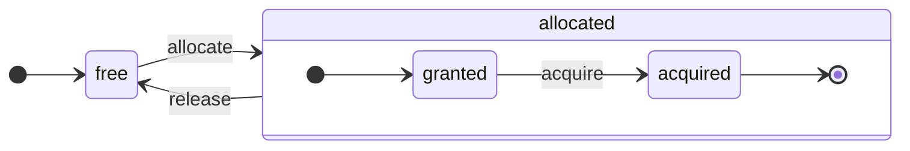

# Обзор архитектуры

ClickHouse – это истинная колоночная СУБД. Данные хранятся по колонкам, а во время выполнения используются массивы (векторы или чанки колонок). 
Если возможно, операции выполняются над массивами, а не над отдельными значениями. Это называется "векторизованное выполнение запросов", и оно помогает снизить стоимость фактической обработки данных.

Эта идея не нова. Она берет начало с `APL` (язык программирования, 1957) и его потомков: `A +` (диалект APL), `J` (1990), `K` (1993) и `Q` (язык программирования от Kx Systems, 2003). Программирование на массивах используется в научной обработке данных. Эта идея также не нова для реляционных баз данных. Например, она используется в системе `VectorWise` (также известной как Actian Vector Analytic Database от Actian Corporation).

Существует два разных подхода для ускорения обработки запросов: векторизованное выполнение запросов и генерация кода во время выполнения. Последний убирает всю косвенную адресацию и динамическую диспетчеризацию. Ни один из этих подходов не является строго лучшим. Генерация кода во время выполнения может быть лучше, когда она объединяет множество операций и полностью использует исполнительные единицы CPU и конвейер. Векторизованное выполнение запросов может быть менее практичным, потому что включает временные векторы, которые необходимо записать в кэш и затем прочитать обратно. Если временные данные не вмещаются в кэш L2, это становится проблемой. Но векторизованное выполнение запросов легче использует возможности SIMD CPU. Исследовательская [статья](http://15721.courses.cs.cmu.edu/spring2016/papers/p5-sompolski.pdf), написанная нашими друзьями, показывает, что лучше комбинировать оба подхода. ClickHouse использует векторизованное выполнение запросов и имеет ограниченную начальную поддержку генерации кода во время выполнения.
## Колонки {#columns}

Интерфейс `IColumn` используется для представления колонок в памяти (на самом деле, чанков колонок). Этот интерфейс предоставляет вспомогательные методы для реализации различных реляционных операторов. Почти все операции являются неизменяемыми: они не модифицируют оригинальную колонку, а создают новую изменённую. Например, метод `IColumn :: filter` принимает фильтр байтовую маску. Он используется для реляционных операторов `WHERE` и `HAVING`. Дополнительные примеры: метод `IColumn :: permute` для поддержки `ORDER BY`, метод `IColumn :: cut` для поддержки `LIMIT`.

Различные реализации `IColumn` (`ColumnUInt8`, `ColumnString` и т.д.) отвечают за расположение памяти колонок. Обычно расположение памяти представляет собой непрерывный массив. Для колонок целочисленного типа это просто один непрерывный массив, как `std :: vector`. Для колонок `String` и `Array` это два вектора: один для всех элементов массива, расположенных непрерывно, и второй для смещений к началу каждого массива. Существует также `ColumnConst`, который хранит только одно значение в памяти, но выглядит как колонка.
## Поле {#field}

Тем не менее, также возможно работать с отдельными значениями. Для представления отдельного значения используется `Field`. `Field` – это просто дискриминированный союз `UInt64`, `Int64`, `Float64`, `String` и `Array`. `IColumn` имеет метод `operator []`, чтобы получить n-ое значение как `Field`, и метод `insert`, чтобы добавить `Field` в конец колонки. Эти методы не очень эффективны, потому что требуют работы с временными объектами `Field`, представляющими отдельное значение. Есть более эффективные методы, такие как `insertFrom`, `insertRangeFrom` и т.д.

`Field` не имеет достаточной информации о конкретном типе данных для таблицы. Например, `UInt8`, `UInt16`, `UInt32` и `UInt64` все представлены как `UInt64` в `Field`.
## Протекающие абстракции {#leaky-abstractions}

`IColumn` имеет методы для общих реляционных преобразований данных, но они не удовлетворяют всем потребностям. Например, у `ColumnUInt64` нет метода для расчета суммы двух колонок, а у `ColumnString` нет метода для выполнения поиска подстроки. Эти бесчисленные рутины реализованы вне `IColumn`.

Различные функции на колонках могут быть реализованы общим, неэффективным способом с использованием методов `IColumn` для извлечения значений `Field`, или специализированным способом с использованием знаний о внутреннем расположении данных в конкретной реализации `IColumn`. Это реализуется путём приведения функций к конкретному типу `IColumn` и прямого обращения к внутреннему представлению. Например, у `ColumnUInt64` есть метод `getData`, который возвращает ссылку на внутренний массив, и затем отдельная рутина читает или заполняет этот массив напрямую. У нас есть "протекающие абстракции", позволяющие эффективные специализации различных рутин.
## Типы данных {#data_types}

`IDataType` отвечает за сериализацию и десериализацию: за чтение и запись чанков колонок или отдельных значений в бинарной или текстовой форме. `IDataType` напрямую соответствует типам данных в таблицах. Например, существуют `DataTypeUInt32`, `DataTypeDateTime`, `DataTypeString` и т.д.

`IDataType` и `IColumn` лишь слабо связаны друг с другом. Разные типы данных могут быть представлены в памяти одними и теми же реализациями `IColumn`. Например, `DataTypeUInt32` и `DataTypeDateTime` оба представлены `ColumnUInt32` или `ColumnConstUInt32`. В дополнение, один и тот же тип данных может быть представлен различными реализациями `IColumn`. Например, `DataTypeUInt8` может быть представлен `ColumnUInt8` или `ColumnConstUInt8`.

`IDataType` хранит только метаданные. Например, `DataTypeUInt8` не хранит ничего (кроме виртуального указателя `vptr`), а `DataTypeFixedString` хранит только `N` (размер фиксированных строк).

`IDataType` имеет вспомогательные методы для различных форматов данных. Примеры включают методы для сериализации значения с возможным экранированием, сериализацию значения для JSON и сериализацию значения как часть формата XML. Прямого соответствия с форматами данных нет. Например, разные форматы данных `Pretty` и `TabSeparated` могут использовать один и тот же вспомогательный метод `serializeTextEscaped` из интерфейса `IDataType`.
## Блок {#block}

`Block` – это контейнер, представляющий подмножество (чанк) таблицы в памяти. Это просто набор троек: `(IColumn, IDataType, название колонки)`. Во время выполнения запроса данные обрабатываются по `Block`. Если у нас есть `Block`, у нас есть данные (в объекте `IColumn`), у нас есть информация о его типе (в `IDataType`), которая говорит нам, как работать с этой колонкой, и у нас есть имя колонки. Это может быть как оригинальное имя колонки из таблицы, так и какое-то искусственное имя, присвоенное для получения временных результатов расчетов.

Когда мы рассчитываем какую-то функцию по колонкам в блоке, мы добавляем к блоку другую колонку с ее результатом, и мы не трогаем колонки, служащие аргументами функции, потому что операции являются неизменяемыми. Позже ненужные колонки могут быть удалены из блока, но не изменены. Это удобно для устранения общих подвыражений.

Блоки создаются для каждого обработанного чанка данных. Заметьте, что для одного и того же типа вычислений имена колонок и типы остаются одинаковыми для различных блоков, и только данные колонок изменяются. Лучше разделить данные блока от заголовка блока, потому что маленькие размеры блоков имеют высокие накладные расходы на временные строки для копирования shared_ptr и имен колонок.
## Обработчики {#processors}

Смотрите описание по адресу [https://github.com/ClickHouse/ClickHouse/blob/master/src/Processors/IProcessor.h](https://github.com/ClickHouse/ClickHouse/blob/master/src/Processors/IProcessor.h).
## Форматы {#formats}

Форматы данных реализованы с помощью обработчиков.
## Ввод/Вывод {#io}

Для байт-ориентированного ввода/вывода существуют абстрактные классы `ReadBuffer` и `WriteBuffer`. Они используются вместо C++ `iostream`s. Не волнуйтесь: каждый зрелый проект на C++ использует что-то, кроме `iostream`s, по вполне обоснованным причинам.

`ReadBuffer` и `WriteBuffer` - это просто непрерывный буфер и курсор, указывающий на позицию в этом буфере. Реализации могут владеть памятью для буфера или не владеть ею. Существует виртуальный метод, чтобы заполнить буфер следующими данными (для `ReadBuffer`) или сбросить буфер куда-то (для `WriteBuffer`). Виртуальные методы редко вызываются.

Реализации `ReadBuffer`/`WriteBuffer` используются для работы с файлами и файловыми дескрипторами, и сетевыми сокетами, для реализации сжатия (`CompressedWriteBuffer` инициализируется другим WriteBuffer и выполняет сжатие перед записью данных в него) и для других целей – имена `ConcatReadBuffer`, `LimitReadBuffer` и `HashingWriteBuffer` говорят сами за себя.

Read/WriteBuffers работают только с байтами. Есть функции из заголовочных файлов `ReadHelpers` и `WriteHelpers`, которые помогают с форматированием ввода/вывода. Например, существуют вспомогательные функции для записи числа в десятичном формате.

Давайте рассмотрим, что происходит, когда вы хотите записать набор результатов в формате `JSON` в stdout. 
У вас есть набор результатов, готовый для извлечения из тянущегося `QueryPipeline`. 
Сначала вы создаете `WriteBufferFromFileDescriptor(STDOUT_FILENO)` для записи байтов в stdout. 
Затем вы подключаете результат из конвейера запросов к `JSONRowOutputFormat`, который инициализирован тем `WriteBuffer`, чтобы записать строки в формате `JSON` в stdout. 
Это можно сделать через метод `complete`, который превращает тянущийся `QueryPipeline` в завершённый `QueryPipeline`. 
Внутри, `JSONRowOutputFormat` запишет различные JSON-разделители и вызовет метод `IDataType::serializeTextJSON` с ссылкой на `IColumn` и номером строки в качестве аргументов. В результате `IDataType::serializeTextJSON` вызовет метод из `WriteHelpers.h`: например, `writeText` для числовых типов и `writeJSONString` для `DataTypeString`.
## Таблицы {#tables}

Интерфейс `IStorage` представляет таблицы. Разные реализации этого интерфейса являются разными движками таблиц. Примеры: `StorageMergeTree`, `StorageMemory` и так далее. Экземпляры этих классов просто таблицы.

Ключевыми методами в `IStorage` являются `read` и `write`, вместе с другими, такими как `alter`, `rename` и `drop`. Метод `read` принимает следующие аргументы: набор колонок для чтения из таблицы, `AST` запрос для рассмотрения и желаемое количество потоков. Он возвращает `Pipe`.

В большинстве случаев метод чтения отвечает только за чтение указанных колонок из таблицы, а не за дальнейшую обработку данных.
Вся последующая обработка данных осуществляется другой частью конвейера, что выходит за рамки ответственности `IStorage`.

Но есть замечательные исключения:

- `AST` запрос передается в метод `read`, и движок таблицы может использовать его, чтобы вывести использование индекса и прочитать меньше данных из таблицы.
- Иногда движок таблицы может сам обрабатывать данные до определённой стадии. Например, `StorageDistributed` может отправить запрос на удалённые серверы, попросить их обработать данные до стадии, где данные из разных удалённых серверов могут быть объединены, и вернуть эти предварительно обработанные данные. Затем интерпретатор запроса завершает обработку данных.

Метод `read` таблицы может вернуть `Pipe`, состоящий из нескольких `Processors`. Эти `Processors` могут параллельно читать из таблицы. 
Затем вы можете подключить эти обработчики к различным другим преобразованиям (таким как оценка выражения или фильтрация), которые могут быть рассчитаны независимо. 
И затем создать `QueryPipeline` на их основе и выполнить его через `PipelineExecutor`.

Также существуют `TableFunction`s. Это функции, которые возвращают временный объект `IStorage`, который используется в секции `FROM` запроса.

Чтобы быстро понять, как реализовать свой движок таблицы, взгляните на что-то простое, например, `StorageMemory` или `StorageTinyLog`.

> В результате метода `read`, `IStorage` возвращает `QueryProcessingStage` – информацию о том, какие части запроса уже были рассчитаны внутри схранилища.
## Парсеры {#parsers}

Парсер с ручной рекурсивной десценцией разбирает запрос. Например, `ParserSelectQuery` просто рекурсивно вызывает парсеры для различных частей запроса. Парсеры создают `AST`. `AST` представляется узлами, которые являются экземплярами `IAST`.

> Генераторы парсеров не используются по историческим причинам.
## Интерпретаторы {#interpreters}

Интерпретаторы отвечают за создание конвейера выполнения запроса из `AST`. Существуют простые интерпретаторы, такие как `InterpreterExistsQuery` и `InterpreterDropQuery`, а также более сложные, такие как `InterpreterSelectQuery`.

Конвейер выполнения запроса – это сочетание обработчиков, которые могут потреблять и производить чанки (наборы колонок с определенными типами).
Обработчик общается через порты и может иметь несколько входных портов и несколько выходных портов.
Более подробное описание можно найти в [src/Processors/IProcessor.h](https://github.com/ClickHouse/ClickHouse/blob/master/src/Processors/IProcessor.h).

Например, результат интерпретации запроса `SELECT` – это "тянущийся" `QueryPipeline`, который имеет специальный выходной порт для чтения набора результатов.
Результат запроса `INSERT` – это "пушащий" `QueryPipeline`, с входным портом для записи данных для вставки.
А результат интерпретации запроса `INSERT SELECT` – это "завершённый" `QueryPipeline`, который не имеет входов или выходов, но копирует данные из `SELECT` в `INSERT` одновременно.

`InterpreterSelectQuery` использует механизмы `ExpressionAnalyzer` и `ExpressionActions` для анализа и преобразования запроса. Здесь выполняются большинство оптимизаций запросов на основе правил. `ExpressionAnalyzer` довольно запутан и должен быть переписан: различные преобразования и оптимизации запросов должны быть вынесены в отдельные классы, чтобы позволить модульные преобразования запросов.

Чтобы решить проблемы, существующие в интерпретаторах, была разработана новая версия `InterpreterSelectQueryAnalyzer`. Это новая версия `InterpreterSelectQuery`, которая не использует `ExpressionAnalyzer` и вводит дополнительный уровень абстракции между `AST` и `QueryPipeline`, называемый `QueryTree`. Она полностью готова к использованию в производстве, но на всякий случай ее можно отключить, установив значение параметра `enable_analyzer` в `false`.
## Функции {#functions}

Существуют обыкновенные функции и агрегатные функции. Для агрегатных функций смотрите следующий раздел.

Обыкновенные функции не изменяют количество строк – они работают так, как будто обрабатывают каждую строку независимо. На самом деле функции не вызываются для отдельных строк, а для блоков данных, чтобы реализовать векторизованное выполнение запросов.

Существуют также различные функции, такие как [blockSize](/sql-reference/functions/other-functions#blockSize), [rowNumberInBlock](/sql-reference/functions/other-functions#rowNumberInBlock) и [runningAccumulate](/sql-reference/functions/other-functions#runningaccumulate), которые используют обработку блоков и нарушают независимость строк.

ClickHouse имеет строгую типизацию, поэтому нет неявного преобразования типов. Если функция не поддерживает конкретную комбинацию типов, она вызывает исключение. Но функции могут работать (быть перегруженными) для множества различных комбинаций типов. Например, функция `plus` (для реализации оператора `+`) работает для любой комбинации числовых типов: `UInt8` + `Float32`, `UInt16` + `Int8` и так далее. Также некоторые вариативные функции могут принимать любое количество аргументов, такие как функция `concat`.

Реализация функции может быть немного неудобной, потому что функция явно распределяет поддерживаемые типы данных и поддерживаемые `IColumns`. Например, функция `plus` имеет код, сгенерированный путем инстанцирования шаблона C++ для каждой комбинации числовых типов и постоянных или непостоянных левых и правых аргументов.

Это отличное место для реализации генерации кода во время выполнения, чтобы избежать увеличения объема шаблонного кода. Кроме того, это делает возможным добавление объединенных функций, таких как объединенное умножение и сложение, или возможность выполнять несколько сравнений в одной итерации цикла.

Из-за векторизованного выполнения запросов функции не "короткоразрывные". Например, если вы пишете `WHERE f(x) AND g(y)`, обе стороны рассчитываются, даже если `f(x)` равно нулю (за исключением случаев, когда `f(x)` – это нулевая константная выражение). Но если селективность условия `f(x)` высокая, и вычисление `f(x)` гораздо дешевле, чем `g(y)`, лучше реализовать многократное вычисление. Сначала будет рассчитано `f(x)`, затем отфильтруются колонки по результату, а затем будет рассчитано `g(y)` только для меньших, отфильтрованных чанков данных.
## Агрегатные функции {#aggregate-functions}

Агрегатные функции - это функции с состоянием. Они накапливают переданные значения в неком состоянии и позволяют получать результаты из этого состояния. Они управляются интерфейсом `IAggregateFunction`. Состояния могут быть довольно простыми (состояние для `AggregateFunctionCount` - это всего лишь одно значение `UInt64`) или довольно сложными (состояние `AggregateFunctionUniqCombined` – это комбинация линейного массива, хэш-таблицы и вероятностной структуры данных `HyperLogLog`).

Состояния выделяются в `Arena` (пуле памяти), чтобы иметь возможность работать с несколькими состояниями при выполнении запроса с высокой кардинальностью `GROUP BY`. Состояния могут иметь нетривиальные конструктор и деструктор: например, сложные состояния агрегации могут выделять дополнительную память самостоятельно. Это требует внимания к созданию и уничтожению состояний и правильной передаче их владения и порядка уничтожения.

Состояния агрегации могут быть сериализованы и десериализованы, чтобы передавать их по сети во время распределенного выполнения запросов или записывать их на диск, когда недостаточно ОЗУ. Их можно даже хранить в таблице с `DataTypeAggregateFunction`, чтобы позволить инкрементальную агрегацию данных.

> Формат сериализованных данных для состояний агрегатной функции в настоящее время не версионирован. Это допустимо, если состояния агрегатов хранятся временно. Но у нас есть движок таблиц `AggregatingMergeTree` для инкрементальной агрегации, и люди уже используют его в производстве. Это причина, по которой требуется обратная совместимость при изменении сериализованного формата для любой агрегатной функции в будущем.
## Сервер {#server}

Сервер реализует несколько различных интерфейсов:

- HTTP-интерфейс для любых сторонних клиентов.
- TCP-интерфейс для нативного клиента ClickHouse и для межсерверного общения во время распределенного выполнения запросов.
- Интерфейс для передачи данных для репликации.

Внутренне это просто примитивный многопоточный сервер без корутин или потоков. Поскольку сервер не предназначен для обработки высокого потока простых запросов, а для обработки относительно низкой нагрузки сложных запросов, каждый из них может обрабатывать огромное количество данных для аналитики.

Сервер инициализирует класс `Context` с необходимой средой для выполнения запроса: список доступных баз данных, пользователей и прав доступа, настройки, кластеры, список процессов, журнал запросов и так далее. Интерпретаторы используют эту среду.

Мы поддерживаем полную обратную и прямую совместимость для TCP протокола сервера: старые клиенты могут общаться с новыми серверами, и новые клиенты могут общаться со старыми серверами. Но мы не хотим поддерживать это вечно, и мы удаляем поддержку старых версий спустя около года.

:::note
Для большинства сторонних приложений мы рекомендуем использовать HTTP-интерфейс, потому что он простой и удобный в использовании. TCP-протокол более тесно связан с внутренними структурами данных: он использует внутренний формат для передачи блоков данных и использует собственную упаковку для сжатых данных. Мы не выпустили C-библиотеку для этого протокола, так как это требует связывания с большей частью кода ClickHouse, что не является практичным.
:::
## Конфигурация {#configuration}

Сервер ClickHouse основан на библиотеках POCO C++ и использует `Poco::Util::AbstractConfiguration` для представления своей конфигурации. Конфигурация хранится классом `Poco::Util::ServerApplication`, наследуемым от класса `DaemonBase`, который, в свою очередь, наследуется от класса `DB::Server`, реализующего clickhouse-server. Таким образом, конфигурация может быть доступна через метод `ServerApplication::config()`.

Конфигурация считывается из нескольких файлов (в XML или YAML формате) и объединяется в единую `AbstractConfiguration` классом `ConfigProcessor`. Конфигурация загружается при старте сервера и может быть перезагружена позже, если один из файлов конфигурации обновляется, удаляется или добавляется. Класс `ConfigReloader` отвечает за периодический мониторинг этих изменений и процесс перезагрузки. Запрос `SYSTEM RELOAD CONFIG` также вызывает перезагрузку конфигурации.

Для запросов и подсистем, отличных от конфигурации `Server`, она доступна с помощью метода `Context::getConfigRef()`. Каждая подсистема, которая способна перезагружать свою конфигурацию без перезапуска сервера, должна зарегистрировать себя в обратном вызове перезагрузки в методе `Server::main()`. Заметьте, что если новая конфигурация имеет ошибку, большинство подсистем проигнорируют новую конфигурацию, запишут предупреждающие сообщения и будут продолжать работать с ранее загруженной конфигурацией. Из-за природы `AbstractConfiguration` невозможно передать ссылку на конкретный раздел, поэтому обычно используется `String config_prefix`.
## Потоки и задачи {#threads-and-jobs}

Для выполнения запросов и выполнения побочных задач ClickHouse выделяет потоки из одного из пулов потоков, чтобы избежать частого создания и уничтожения потоков. Существует несколько пулов потоков, которые выбираются в зависимости от цели и структуры задачи:
  * Серверный пул для входящих клиентских сессий.
  * Глобальный пул потоков для задач общего назначения, фоновых процессов и отдельных потоков.
  * Пул потоков IO для задач, которые в основном заблокированы на каком-то I/O и не требуют интенсивных вычислений.
  * Фоновые пулы для периодических задач.
  * Пулы для преемных задач, которые могут быть разделены на этапы.

Серверный пул является экземпляром класса `Poco::ThreadPool`, определенного в методе `Server::main()`. В нем может быть не более `max_connection` потоков. Каждый поток посвящен одному активному соединению.

Глобальный пул потоков — это одиночный класс `GlobalThreadPool`. Для выделения потока из него используется `ThreadFromGlobalPool`. Он имеет интерфейс, аналогичный `std::thread`, но вынимает поток из глобального пула и выполняет всю необходимую инициализацию. Он настраивается следующими параметрами:
  * `max_thread_pool_size` – ограничение на количество потоков в пуле.
  * `max_thread_pool_free_size` – ограничение на число неактивных потоков, ожидающих новых задач.
  * `thread_pool_queue_size` – ограничение на количество запланированных задач.

Глобальный пул универсален, и все описанные ниже пулы реализованы на его основе. Это можно рассматривать как иерархию пулов. Любой специализированный пул берет свои потоки из глобального пула, используя класс `ThreadPool`. Поэтому главная цель любого специализированного пула – наложить ограничение на количество одновременных задач и выполнять планирование задач. Если запланировано больше задач, чем потоков в пуле, `ThreadPool` накапливает задачи в очереди с приоритетами. Каждой задаче присваивается целочисленный приоритет. Значение по умолчанию – ноль. Все задачи с более высокими приоритетными значениями запускаются раньше любой задачи с более низким приоритетом. Но между уже выполняемыми задачами нет разницы, поэтому приоритет имеет значение только в случае перегрузки пула.

Пул потоков IO реализован как простой `ThreadPool`, доступный через метод `IOThreadPool::get()`. Он настраивается так же, как глобальный пул с параметрами `max_io_thread_pool_size`, `max_io_thread_pool_free_size` и `io_thread_pool_queue_size`. Главная цель пула потоков IO – избежать истощения глобального пула потоков задачами ввода-вывода, которые могут помешать запросам полностью использовать CPU. Резервное копирование в S3 требует значительного количества операций ввода-вывода, и чтобы избежать влияния на интерактивные запросы, существует отдельный `BackupsIOThreadPool`, настроенный с параметрами `max_backups_io_thread_pool_size`, `max_backups_io_thread_pool_free_size` и `backups_io_thread_pool_queue_size`.

Для выполнения периодических задач существует класс `BackgroundSchedulePool`. Вы можете зарегистрировать задачи с использованием объектов `BackgroundSchedulePool::TaskHolder`, и пул гарантирует, что ни одна задача не выполнит две работы одновременно. Он также позволяет отложить выполнение задач до определённого момента в будущем или временно деактивировать задачу. Глобальный `Context` предоставляет несколько экземпляров этого класса для различных целей. Для задач общего назначения используется `Context::getSchedulePool()`.

Существуют также специализированные пулы потоков для преемных задач. Такой `IExecutableTask` может быть разделён на упорядоченную последовательность работ, называемых этапами. Чтобы запланировать эти задачи таким образом, чтобы короткие задачи имели приоритет над длительными, используется `MergeTreeBackgroundExecutor`. Как следует из названия, он используется для фоновых операций, связанных с MergeTree, таких как слияния, мутации, выборки и перемещения. Экземпляры пула доступны с помощью `Context::getCommonExecutor()` и других подобных методов.

Независимо от того, какой пул используется для работы, в начале создаётся экземпляр `ThreadStatus` для этой работы. Он инкапсулирует всю информацию по потоку: идентификатор потока, идентификатор запроса, счетчики производительности, потребление ресурсов и множество других полезных данных. Работа может получить к ним доступ через указатель к локальным потокам с помощью вызова `CurrentThread::get()`, так что нам не нужно передавать его каждой функции.

Если поток связан с выполнением запроса, то самой важной вещью, прикрепленной к `ThreadStatus`, является контекст запроса `ContextPtr`. Каждый запрос имеет свой основной поток в серверном пуле. Основной поток устанавливает связь, удерживая объект `ThreadStatus::QueryScope query_scope(query_context)`. Основной поток также создает группу потоков, представленную объектом `ThreadGroupStatus`. Каждый дополнительный поток, выделенный во время выполнения этого запроса, прикрепляется к своей группе потоков с помощью вызова `CurrentThread::attachTo(thread_group)`. Группы потоков используются для агрегирования счетчиков событий профилирования и отслеживания потребления памяти всеми потоками, посвященными одной задаче (см. классы `MemoryTracker` и `ProfileEvents::Counters` для получения дополнительной информации).
## Контроль конкурентности {#concurrency-control}

Запрос, который можно распараллелить, использует параметр `max_threads`, чтобы ограничить себя. Значение по умолчанию для этого параметра выбирается таким образом, чтобы позволить одному запросу эффективно использовать все ядра CPU. Но что если есть несколько параллельных запросов, и каждый из них использует значение по умолчанию для параметра `max_threads`? Тогда запросы будут делить ресурсы CPU. Операционная система будет обеспечивать справедливость, постоянно переключая потоки, что приведёт к некоторым потерям производительности. `ConcurrencyControl` помогает справиться с этим наказанием и избежать выделения большого количества потоков. Параметр конфигурации `concurrent_threads_soft_limit_num` используется для ограничения того, сколько параллельных потоков может быть выделено до того, как будет применено какое-то давление на CPU.

Введена норма CPU `slot`. Слот является единицей конкурентности: чтобы запустить поток, запрос должен предварительно получить слот и освободить его, когда поток закончит работу. Общее количество слотов глобально ограничено в сервере. Несколько параллельных запросов конкурируют за слоты CPU, если общий спрос превышает общее количество слотов. `ConcurrencyControl` отвечает за разрешение этого соревнования, проводя планирование слотов CPU в справедливой манере.

Каждый слот можно рассматривать как независимую машину состояний со следующими состояниями:
 * `free`: слот доступен для выделения любым запросом.
 * `granted`: слот `выделен` конкретному запросу, но ещё не захвачен ни одним потоком.
 * `acquired`: слот `выделен` конкретному запросу и захвачен потоком.

Заметьте, что `allocated` слот может находиться в двух различных состояниях: `granted` и `acquired`. Первое – это переходное состояние, которое на самом деле должно быть коротким (с момента, когда слот выделяется запросу до момента, когда процедура масштабирования выполняется любым потоком этого запроса).

API `ConcurrencyControl` состоит из следующих функций:
1. Создать распределение ресурсов для запроса: `auto slots = ConcurrencyControl::instance().allocate(1, max_threads);`. Он выделит как минимум 1 и как максимум `max_threads` слотов. Заметьте, что первый слот предоставляется немедленно, но оставшиеся слоты могут быть предоставлены позже. Таким образом, ограничение является мягким, потому что каждый запрос получит как минимум один поток.
2. Для каждого потока слот должен быть получен из распределения: `while (auto slot = slots->tryAcquire()) spawnThread([slot = std::move(slot)] { ... });`.
3. Обновить общее количество слотов: `ConcurrencyControl::setMaxConcurrency(concurrent_threads_soft_limit_num)`. Это можно сделать в реальном времени, без перезапуска сервера.

Этот API позволяет запросам начинаться с как минимум одного потока (в условиях давления на CPU) и позднее увеличиваться до `max_threads`.
## Распределенное выполнение запросов {#distributed-query-execution}

Серверы в кластере в основном независимы. Вы можете создать `Distributed` таблицу на одном или всех серверах в кластере. `Distributed` таблица не хранит данные сама по себе – она только предоставляет "представление" ко всем локальным таблицам на нескольких узлах кластера. Когда вы выполняете SELECT из `Distributed` таблицы, она переписывает этот запрос, выбирает удаленные узлы в соответствии с настройками балансировки нагрузки и отправляет запрос к ним. `Distributed` таблица запрашивает у удаленных серверов обработку запроса только до стадии, где промежуточные результаты с разных серверов могут быть объединены. Затем она получает промежуточные результаты и объединяет их. Распределенная таблица пытается распределить как можно больше работы на удаленные серверы и не отправляет много промежуточных данных по сети.

Ситуация усложняется, когда у вас есть подзапросы в IN или JOIN конструкциях, и каждый из них использует `Distributed` таблицу. У нас есть разные стратегии для выполнения этих запросов.

Нет единого плана выполнения для распределенного выполнения запросов. Каждый узел имеет свой локальный план запроса для своей части работы. У нас есть только простое одноразовое распределенное выполнение запросов: мы отправляем запросы для удаленных узлов и затем объединяем результаты. Но это нецелесообразно для сложных запросов с высокой кардинальностью `GROUP BY` или с большим объемом временных данных для JOIN. В таких случаях нам необходимо "перетасовать" данные между серверами, что требует дополнительной координации. ClickHouse не поддерживает такой вид выполнения запросов, и нам необходимо работать над этим.
## Merge Tree {#merge-tree}

`MergeTree` - это семейство движков хранения, которое поддерживает индексацию по первичному ключу. Первичный ключ может быть произвольным кортежем колонок или выражений. Данные в таблице `MergeTree` хранятся в "частях". Каждая часть хранит данные в порядке первичного ключа, поэтому данные упорядочены лексикографически по кортежу первичного ключа. Все колонки таблицы хранятся в отдельных `column.bin` файлах в этих частях. Файлы состоят из сжатых блоков. Каждый блок обычно имеет размер от 64 KB до 1 MB не сжатых данных, в зависимости от среднего размера значений. Блоки состоят из значений колонок, размещенных последовательно друг за другом. Значения колонок находятся в одном и том же порядке для каждой колонки (первичный ключ определяет порядок), поэтому, когда вы итерируете по многим колонкам, вы получаете значения для соответствующих строк.

Сам первичный ключ является "разреженным". Он не адресует каждую отдельную строку, а лишь некоторые диапазоны данных. Отдельный файл `primary.idx` содержит значение первичного ключа для каждой N-й строки, где N называется `index_granularity` (обычно N = 8192). Также для каждой колонки у нас есть файлы `column.mrk` с "метками", которые представляют собой смещения к каждой N-й строке в файле данных. Каждая метка представляет собой пару: смещение в файле до начала сжатого блока и смещение в распакованном блоке до начала данных. Обычно сжатые блоки выровнены по меткам, и смещение в распакованном блоке равно нулю. Данные для `primary.idx` всегда находятся в памяти, а данные для файлов `column.mrk` кешируются.

Когда мы собираемся прочитать что-то из части в `MergeTree`, мы смотрим на данные `primary.idx` и определяем диапазоны, которые могут содержать запрашиваемые данные, затем смотрим на данные `column.mrk` и вычисляем смещения, с которых начинать чтение этих диапазонов. Из-за разреженности может быть прочитано избыточное количество данных. ClickHouse не подходит для высокой нагрузки простых точечных запросов, потому что весь диапазон с `index_granularity` строк должен быть прочитан для каждого ключа, и весь сжатый блок должен быть распакован для каждой колонки. Мы сделали индекс разреженным, потому что мы должны быть в состоянии поддерживать триллионы строк на одном сервере без заметного потребления памяти для индекса. Кроме того, поскольку первичный ключ разреженный, он не уникален: невозможно проверить существование ключа в таблице во время операции INSERT. В таблице может быть много строк с одним и тем же ключом.

Когда вы `INSERT` множество данных в `MergeTree`, это множество сортируется по порядку первичного ключа и формирует новую часть. Существуют фоновые потоки, которые периодически выбирают некоторые части и объединяют их в одну отсортированную часть, чтобы поддерживать количество частей на относительно низком уровне. Вот почему это называется `MergeTree`. Конечно, объединение приводит к "усилению записи". Все части являются неизменяемыми: они только создаются и удаляются, но не модифицируются. При выполнении SELECT создается снимок таблицы (набор частей). После объединения мы также сохраняем старые части некоторое время, чтобы упростить восстановление после сбоя, так что если мы увидим, что какая-то объединенная часть, вероятно, повреждена, мы можем заменить ее на исходные части.

`MergeTree` не является деревом LSM, потому что оно не содержит MEMTABLE и LOG: вставленные данные записываются непосредственно в файловую систему. Такое поведение делает MergeTree гораздо более подходящим для вставки данных пакетами. Поэтому частая вставка небольших объемов строк не идеальна для MergeTree. Например, несколько строк в секунду допустимо, но делать это тысячу раз в секунду не оптимально для MergeTree. Тем не менее, у нас есть асинхронный режим вставки для небольших вставок, чтобы преодолеть это ограничение. Мы сделали это таким образом из соображений простоты и потому, что мы уже вставляем данные пакетами в наших приложениях.

Существуют движки MergeTree, которые выполняют дополнительную работу во время фоновых объединений. Примеры - это `CollapsingMergeTree` и `AggregatingMergeTree`. Это можно рассматривать как специальную поддержку для обновлений. Имейте в виду, что это не настоящие обновления, так как пользователи обычно не имеют контроля над временем выполнения фоновых объединений, и данные в таблице `MergeTree` почти всегда хранятся более чем в одной части, а не в полностью объединенной форме.
## Репликация {#replication}

Репликация в ClickHouse может быть настроена на уровне каждой таблицы. Вы можете иметь некоторые реплицированные и некоторые нереплицированные таблицы на одном сервере. Вы также можете иметь таблицы, реплицируемые разными способами, например, одну таблицу с двухфакторной репликацией и другую с трехфакторной.

Репликация реализована в движке хранения `ReplicatedMergeTree`. Путь в `ZooKeeper` указывается как параметр для движка хранения. Все таблицы с одним и тем же путем в `ZooKeeper` становятся репликами друг друга: они синхронизируют свои данные и поддерживают согласованность. Реплики могут быть добавлены и удалены динамически, просто создавая или удаляя таблицу.

Репликация использует асинхронную многомастеровую схему. Вы можете вставлять данные в любую реплику, которая имеет сессию с `ZooKeeper`, и данные реплицируются ко всем другим репликам асинхронно. Поскольку ClickHouse не поддерживает UPDATE, репликация является свободной от конфликтов. Поскольку по умолчанию нет признания кворума вставок, только что вставленные данные могут быть потеряны, если один узел перестанет работать. Кворум вставки может быть включен с помощью настройки `insert_quorum`.

Метаданные для репликации хранятся в ZooKeeper. Существует журнал репликации, который перечисляет, какие действия нужно выполнять. Действия включают: получить часть; объединить части; удалить партицию и так далее. Каждая реплика копирует журнал репликации в свою очередь и затем выполняет действия из очереди. Например, при вставке действие "получить часть" создается в журнале, и каждая реплика загружает эту часть. Объединения координируются между репликами для получения идентичных по байтам результатов. Все части объединяются одинаково на всех репликах. Один из лидеров инициирует новое объединение первым и записывает действия "объединить части" в журнал. Несколько реплик (или все) могут быть лидерами одновременно. Реблику можно предотвратить от становления лидером, используя настройку `merge_tree` `replicated_can_become_leader`. Лидеры отвечают за планирование фоновых объединений.

Репликация физическая: только сжатые части передаются между узлами, а не запросы. Объединения обрабатываются на каждой реплике независимо в большинстве случаев, чтобы снизить затраты на сеть, избегая сетевого усиления. Большие объединенные части отправляются по сети только в случаях значительной задержки репликации.

Кроме того, каждая реплика хранит свое состояние в ZooKeeper в виде набора частей и их контрольных сумм. Когда состояние на локальной файловой системе расходится со ссылочным состоянием в ZooKeeper, реплика восстанавливает свою согласованность, загружая недостающие и поврежденные части из других реплик. Когда в локальной файловой системе есть неожиданные или поврежденные данные, ClickHouse не удаляет их, а перемещает в отдельный каталог и забывает о них.

:::note
Кластер ClickHouse состоит из независимых шардов, и каждый шард состоит из реплик. Кластер **неэластичный**, поэтому после добавления нового шарда данные не балансируются между шардами автоматически. Вместо этого предполагается, что нагрузка в кластере будет неравномерной. Эта реализация дает вам больше контроля и подходит для относительно небольших кластеров, таких как десятки узлов. Но для кластеров с сотнями узлов, которые мы используем в производстве, этот подход становится значительным недостатком. Нам следует реализовать движок таблицы, который охватывает кластер с динамически реплицируемыми регионами, которые могут быть автоматически разделены и сбалансированы между кластерами.
:::
