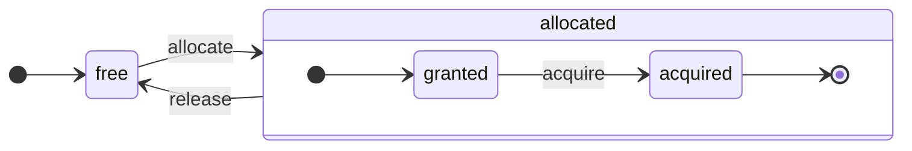

# Обзор архитектуры

ClickHouse — по-настоящему столбцовая СУБД. Данные хранятся по столбцам, а обработка выполняется над массивами (векторами или блоками столбцов).
По возможности операции выполняются над массивами, а не над отдельными значениями.
Это называется «векторизованное выполнение запросов» и помогает снизить затраты на фактическую обработку данных.

Эта идея не нова.
Её истоки восходят к языку `APL` (A Programming Language, 1957) и его потомкам: `A+` (диалект APL), `J` (1990), `K` (1993) и `Q` (язык программирования от Kx Systems, 2003).
Программирование на массивах (array programming) используется в научной обработке данных. Эта идея не является новой и для реляционных баз данных. Например, она применяется в системе `VectorWise` (также известной как Actian Vector Analytic Database от компании Actian Corporation).

Существуют два разных подхода к ускорению обработки запросов: векторизованное выполнение запросов и генерация кода во время выполнения (runtime code generation). Второй подход устраняет всю косвенность и динамическую диспетчеризацию. Ни один из этих подходов не является однозначно лучшим. Генерация кода во время выполнения может быть эффективнее, когда она объединяет множество операций, полностью загружая вычислительные блоки и конвейер процессора. Векторизованное выполнение запросов может быть менее эффективным на практике, поскольку предполагает использование временных векторов, которые нужно записывать в кэш и читать обратно. Если временные данные не помещаются в кэш L2, это становится проблемой. Однако векторизованное выполнение запросов лучше задействует SIMD-возможности процессора. В [научной работе](http://15721.courses.cs.cmu.edu/spring2016/papers/p5-sompolski.pdf), написанной нашими коллегами, показано, что лучше комбинировать оба подхода. ClickHouse использует векторизованное выполнение запросов и имеет ограниченную базовую поддержку генерации кода во время выполнения.

## Столбцы {#columns}

Интерфейс `IColumn` используется для представления столбцов в памяти (точнее, фрагментов столбцов). Этот интерфейс предоставляет вспомогательные методы для реализации различных реляционных операторов. Почти все операции являются неизменяемыми: они не изменяют исходный столбец, а создают новый модифицированный. Например, метод `IColumn::filter` принимает байтовую маску фильтра. Он используется для реляционных операторов `WHERE` и `HAVING`. Другие примеры: метод `IColumn::permute` для поддержки `ORDER BY`, метод `IColumn::cut` для поддержки `LIMIT`.

Различные реализации `IColumn` (`ColumnUInt8`, `ColumnString` и т. д.) отвечают за размещение столбцов в памяти. Размещение в памяти обычно представляет собой непрерывный массив. Для столбцов целочисленного типа это просто один непрерывный массив, аналогичный `std::vector`. Для столбцов `String` и `Array` используются два вектора: один для всех элементов массива, размещённых непрерывно, и второй для смещений к началу каждого массива. Также существует `ColumnConst`, который хранит в памяти только одно значение, но представляет собой столбец.

## Field {#field}

Тем не менее, возможна работа и с отдельными значениями. Для представления отдельного значения используется `Field`. `Field` — это размеченное объединение типов `UInt64`, `Int64`, `Float64`, `String` и `Array`. `IColumn` имеет метод `operator []` для получения n-го значения в виде `Field`, а также метод `insert` для добавления `Field` в конец столбца. Эти методы не очень эффективны, поскольку требуют работы с временными объектами `Field`, представляющими отдельное значение. Существуют более эффективные методы, такие как `insertFrom`, `insertRangeFrom` и т. д.

`Field` не содержит достаточной информации о конкретном типе данных таблицы. Например, типы `UInt8`, `UInt16`, `UInt32` и `UInt64` все представлены как `UInt64` в `Field`.

## Протекающие абстракции {#leaky-abstractions}

`IColumn` имеет методы для стандартных реляционных преобразований данных, но они не покрывают все потребности. Например, `ColumnUInt64` не имеет метода для вычисления суммы двух столбцов, а `ColumnString` не имеет метода для поиска подстроки. Эти многочисленные операции реализованы за пределами `IColumn`.

Различные функции над столбцами могут быть реализованы универсальным неэффективным способом с использованием методов `IColumn` для извлечения значений `Field` или специализированным способом с использованием знаний о внутренней структуре размещения данных в памяти конкретной реализации `IColumn`. Это реализуется путем приведения функций к конкретному типу `IColumn` и непосредственной работы с внутренним представлением. Например, `ColumnUInt64` имеет метод `getData`, который возвращает ссылку на внутренний массив, после чего отдельная процедура читает или заполняет этот массив напрямую. Мы используем «протекающие абстракции», чтобы обеспечить эффективную специализацию различных операций.

## Типы данных {#data_types}

`IDataType` отвечает за сериализацию и десериализацию: чтение и запись фрагментов столбцов или отдельных значений в двоичной или текстовой форме. `IDataType` напрямую соответствует типам данных в таблицах. Например, существуют `DataTypeUInt32`, `DataTypeDateTime`, `DataTypeString` и так далее.

`IDataType` и `IColumn` связаны между собой лишь косвенно. Различные типы данных могут быть представлены в памяти одними и теми же реализациями `IColumn`. Например, и `DataTypeUInt32`, и `DataTypeDateTime` представлены `ColumnUInt32` или `ColumnConstUInt32`. Кроме того, один и тот же тип данных может быть представлен различными реализациями `IColumn`. Например, `DataTypeUInt8` может быть представлен `ColumnUInt8` или `ColumnConstUInt8`.

`IDataType` хранит только метаданные. Например, `DataTypeUInt8` вообще ничего не хранит (кроме виртуального указателя `vptr`), а `DataTypeFixedString` хранит только `N` (размер строк фиксированной длины).

`IDataType` содержит вспомогательные методы для различных форматов данных. Примерами являются методы для сериализации значения с возможным экранированием, для сериализации значения в JSON и для сериализации значения как части формата XML. Прямого соответствия форматам данных не существует. Например, различные форматы данных `Pretty` и `TabSeparated` могут использовать один и тот же вспомогательный метод `serializeTextEscaped` из интерфейса `IDataType`.

## Блок {#block}

`Block` — это контейнер, представляющий подмножество (фрагмент) таблицы в памяти. Это просто набор троек: `(IColumn, IDataType, имя столбца)`. Во время выполнения запроса данные обрабатываются с помощью `Block`. Если у нас есть `Block`, у нас есть данные (в объекте `IColumn`), информация о его типе (в `IDataType`), которая указывает, как работать с этим столбцом, и имя столбца. Это может быть либо исходное имя столбца из таблицы, либо искусственное имя, присвоенное для получения промежуточных результатов вычислений.

Когда мы вычисляем какую-либо функцию над столбцами в блоке, мы добавляем в блок ещё один столбец с её результатом и не изменяем столбцы аргументов функции, поскольку операции являются неизменяемыми. Позже ненужные столбцы могут быть удалены из блока, но не изменены. Это удобно для устранения общих подвыражений.

Блоки создаются для каждого обрабатываемого фрагмента данных. Обратите внимание, что для одного и того же типа вычислений имена и типы столбцов остаются одинаковыми для разных блоков, изменяются только данные столбцов. Лучше отделять данные блока от заголовка блока, поскольку при малых размерах блоков возникают высокие накладные расходы на временные строки для копирования shared_ptrs и имён столбцов.

## Процессоры {#processors}

Описание см. по адресу [https://github.com/ClickHouse/ClickHouse/blob/master/src/Processors/IProcessor.h](https://github.com/ClickHouse/ClickHouse/blob/master/src/Processors/IProcessor.h).

## Форматы {#formats}

Форматы данных реализуются с использованием процессоров.

## Ввод/вывод {#io}

Для побайтового ввода/вывода существуют абстрактные классы `ReadBuffer` и `WriteBuffer`. Они используются вместо C++ `iostream`. Не беспокойтесь: каждый зрелый проект на C++ использует что-то иное, чем `iostream`, и на то есть веские причины.

`ReadBuffer` и `WriteBuffer` — это просто непрерывный буфер и курсор, указывающий на позицию в этом буфере. Реализации могут владеть или не владеть памятью буфера. Существует виртуальный метод для заполнения буфера последующими данными (для `ReadBuffer`) или для сброса буфера (для `WriteBuffer`). Виртуальные методы вызываются редко.

Реализации `ReadBuffer`/`WriteBuffer` используются для работы с файлами, файловыми дескрипторами и сетевыми сокетами, для реализации сжатия (`CompressedWriteBuffer` инициализируется другим WriteBuffer и выполняет сжатие перед записью данных в него), а также для других целей — названия `ConcatReadBuffer`, `LimitReadBuffer` и `HashingWriteBuffer` говорят сами за себя.

Read/WriteBuffers работают только с байтами. Для форматирования ввода/вывода существуют функции из заголовочных файлов `ReadHelpers` и `WriteHelpers`. Например, есть вспомогательные функции для записи числа в десятичном формате.

Рассмотрим, что происходит, когда необходимо записать набор результатов в формате `JSON` в stdout.
У вас есть набор результатов, готовый к извлечению из вытягивающего `QueryPipeline`.
Сначала создаётся `WriteBufferFromFileDescriptor(STDOUT_FILENO)` для записи байтов в stdout.
Затем результат из конвейера запросов подключается к `JSONRowOutputFormat`, который инициализируется этим `WriteBuffer`, для записи строк в формате `JSON` в stdout.
Это можно сделать с помощью метода `complete`, который превращает вытягивающий `QueryPipeline` в завершённый `QueryPipeline`.
Внутри `JSONRowOutputFormat` записывает различные разделители JSON и вызывает метод `IDataType::serializeTextJSON` со ссылкой на `IColumn` и номером строки в качестве аргументов. В свою очередь, `IDataType::serializeTextJSON` вызывает метод из `WriteHelpers.h`: например, `writeText` для числовых типов и `writeJSONString` для `DataTypeString`.

## Таблицы {#tables}

Интерфейс `IStorage` представляет таблицы. Различные реализации этого интерфейса соответствуют различным движкам таблиц. Примерами являются `StorageMergeTree`, `StorageMemory` и так далее. Экземпляры этих классов и есть таблицы.

Ключевыми методами в `IStorage` являются `read` и `write`, а также другие методы, такие как `alter`, `rename` и `drop`. Метод `read` принимает следующие аргументы: набор столбцов для чтения из таблицы, запрос `AST` для обработки и желаемое количество потоков. Он возвращает `Pipe`.

В большинстве случаев метод `read` отвечает только за чтение указанных столбцов из таблицы, но не за дальнейшую обработку данных.
Вся последующая обработка данных выполняется другой частью конвейера, что выходит за рамки ответственности `IStorage`.

Однако существуют заметные исключения:

- Запрос `AST` передается методу `read`, и движок таблицы может использовать его для определения использования индекса и чтения меньшего объема данных из таблицы.
- Иногда движок таблицы может самостоятельно обрабатывать данные до определенной стадии. Например, `StorageDistributed` может отправить запрос на удаленные серверы, попросить их обработать данные до стадии, на которой данные с разных удаленных серверов могут быть объединены, и вернуть эти предварительно обработанные данные. Затем интерпретатор запросов завершает обработку данных.

Метод `read` таблицы может возвращать `Pipe`, состоящий из нескольких `Processors`. Эти `Processors` могут читать из таблицы параллельно.
Затем вы можете соединить эти процессоры с различными другими преобразованиями (такими как вычисление выражений или фильтрация), которые могут быть вычислены независимо.
А затем создать `QueryPipeline` поверх них и выполнить его через `PipelineExecutor`.

Также существуют `TableFunction`. Это функции, которые возвращают временный объект `IStorage` для использования в предложении `FROM` запроса.

Чтобы быстро понять, как реализовать свой движок таблицы, посмотрите на что-то простое, например, `StorageMemory` или `StorageTinyLog`.

> В результате выполнения метода `read` `IStorage` возвращает `QueryProcessingStage` — информацию о том, какие части запроса уже были вычислены внутри хранилища.

## Парсеры {#parsers}

Запрос разбирается вручную написанным парсером рекурсивного спуска. Например, `ParserSelectQuery` рекурсивно вызывает вложенные парсеры для различных частей запроса. Парсеры создают `AST`. `AST` представлено узлами, которые являются экземплярами `IAST`.

> Генераторы парсеров не используются по историческим причинам.

## Интерпретаторы {#interpreters}

Интерпретаторы отвечают за создание конвейера выполнения запроса из AST. Существуют простые интерпретаторы, такие как `InterpreterExistsQuery` и `InterpreterDropQuery`, а также более сложный `InterpreterSelectQuery`.

Конвейер выполнения запроса представляет собой комбинацию процессоров, которые могут потреблять и производить блоки данных (наборы столбцов с определёнными типами).
Процессор взаимодействует через порты и может иметь несколько входных и несколько выходных портов.
Более подробное описание можно найти в [src/Processors/IProcessor.h](https://github.com/ClickHouse/ClickHouse/blob/master/src/Processors/IProcessor.h).

Например, результатом интерпретации запроса `SELECT` является «вытягивающий» `QueryPipeline`, который имеет специальный выходной порт для чтения результирующего набора данных.
Результатом запроса `INSERT` является «проталкивающий» `QueryPipeline` с входным портом для записи данных для вставки.
А результатом интерпретации запроса `INSERT SELECT` является «завершённый» `QueryPipeline`, который не имеет входов или выходов, но одновременно копирует данные из `SELECT` в `INSERT`.

`InterpreterSelectQuery` использует механизмы `ExpressionAnalyzer` и `ExpressionActions` для анализа и преобразования запросов. Именно здесь выполняется большинство оптимизаций запросов на основе правил. `ExpressionAnalyzer` довольно запутан и требует переписывания: различные преобразования и оптимизации запросов следует выделить в отдельные классы, чтобы обеспечить модульность преобразований запроса.

Для решения проблем, существующих в интерпретаторах, был разработан новый `InterpreterSelectQueryAnalyzer`. Это новая версия `InterpreterSelectQuery`, которая не использует `ExpressionAnalyzer` и вводит дополнительный уровень абстракции между `AST` и `QueryPipeline`, называемый `QueryTree`. Он полностью готов к использованию в продакшене, но на всякий случай его можно отключить, установив значение настройки `enable_analyzer` в `false`.

## Функции {#functions}

Существуют обычные функции и агрегатные функции. Об агрегатных функциях см. следующий раздел.

Обычные функции не изменяют количество строк — они работают так, как если бы обрабатывали каждую строку независимо. Фактически функции вызываются не для отдельных строк, а для блоков данных (`Block`) для реализации векторизованного выполнения запросов.

Существуют некоторые специальные функции, такие как [blockSize](/sql-reference/functions/other-functions#blockSize), [rowNumberInBlock](/sql-reference/functions/other-functions#rowNumberInBlock) и [runningAccumulate](/sql-reference/functions/other-functions#runningAccumulate), которые используют блочную обработку и нарушают независимость строк.

ClickHouse имеет строгую типизацию, поэтому неявного преобразования типов не происходит. Если функция не поддерживает определённую комбинацию типов, она генерирует исключение. Однако функции могут работать (быть перегружены) для множества различных комбинаций типов. Например, функция `plus` (для реализации оператора `+`) работает для любой комбинации числовых типов: `UInt8` + `Float32`, `UInt16` + `Int8` и так далее. Кроме того, некоторые вариадические функции могут принимать любое количество аргументов, например функция `concat`.

Реализация функции может быть несколько неудобной, поскольку функция явно диспетчеризует поддерживаемые типы данных и поддерживаемые `IColumns`. Например, функция `plus` содержит код, сгенерированный путём инстанцирования шаблона C++ для каждой комбинации числовых типов, а также константных или неконстантных левых и правых аргументов.

Это отличное место для реализации генерации кода во время выполнения, чтобы избежать разрастания шаблонного кода. Кроме того, это позволяет добавлять объединённые функции, такие как объединённое умножение-сложение, или выполнять множественные сравнения за одну итерацию цикла.

Из-за векторизованного выполнения запросов функции не используют сокращённое вычисление. Например, если вы пишете `WHERE f(x) AND g(y)`, обе стороны вычисляются, даже для строк, когда `f(x)` равно нулю (за исключением случаев, когда `f(x)` является константным нулевым выражением). Но если селективность условия `f(x)` высока, а вычисление `f(x)` намного дешевле, чем `g(y)`, лучше реализовать многопроходное вычисление. Сначала вычисляется `f(x)`, затем столбцы фильтруются по результату, и только после этого `g(y)` вычисляется для меньших отфильтрованных фрагментов данных.

## Агрегатные функции {#aggregate-functions}

Агрегатные функции являются функциями с состоянием. Они накапливают переданные значения в некотором состоянии и позволяют получать результаты из этого состояния. Они управляются через интерфейс `IAggregateFunction`. Состояния могут быть довольно простыми (состояние для `AggregateFunctionCount` — это всего лишь одно значение `UInt64`) или весьма сложными (состояние `AggregateFunctionUniqCombined` представляет собой комбинацию линейного массива, хеш-таблицы и вероятностной структуры данных `HyperLogLog`).

Состояния выделяются в `Arena` (пуле памяти) для работы с множественными состояниями при выполнении запроса `GROUP BY` с высокой кардинальностью. Состояния могут иметь нетривиальные конструктор и деструктор: например, сложные состояния агрегации могут самостоятельно выделять дополнительную память. Это требует внимательного подхода к созданию и уничтожению состояний, а также правильной передаче владения и порядка уничтожения.

Состояния агрегации могут быть сериализованы и десериализованы для передачи по сети во время выполнения распределённых запросов или для записи на диск при недостатке оперативной памяти. Они даже могут храниться в таблице с типом `DataTypeAggregateFunction` для обеспечения инкрементальной агрегации данных.

> Формат сериализованных данных для состояний агрегатных функций в настоящее время не версионируется. Это допустимо, если состояния агрегации хранятся только временно. Однако у нас есть движок таблиц `AggregatingMergeTree` для инкрементальной агрегации, и он уже используется в продакшене. Это причина, по которой требуется обратная совместимость при изменении формата сериализации любой агрегатной функции в будущем.

## Сервер {#server}

Сервер реализует несколько различных интерфейсов:

- HTTP-интерфейс для любых внешних клиентов.
- TCP-интерфейс для нативного клиента ClickHouse и для межсерверного взаимодействия при выполнении распределённых запросов.
- Интерфейс для передачи данных при репликации.

Внутренне это просто примитивный многопоточный сервер без сопрограмм и файберов. Поскольку сервер не предназначен для обработки большого количества простых запросов, а для обработки относительно небольшого количества сложных запросов, каждый из которых может обрабатывать огромные объёмы данных для аналитики.

Сервер инициализирует класс `Context` с необходимым окружением для выполнения запросов: список доступных баз данных, пользователей и прав доступа, настройки, кластеры, список процессов, журнал запросов и так далее. Интерпретаторы используют это окружение.

Мы поддерживаем полную обратную и прямую совместимость для серверного TCP-протокола: старые клиенты могут взаимодействовать с новыми серверами, а новые клиенты — со старыми серверами. Однако мы не хотим поддерживать это вечно и прекращаем поддержку старых версий примерно через год.

:::note
Для большинства внешних приложений мы рекомендуем использовать HTTP-интерфейс, поскольку он прост и удобен в использовании. TCP-протокол более тесно связан с внутренними структурами данных: он использует внутренний формат для передачи блоков данных и применяет специальное кадрирование для сжатых данных. Мы не выпустили библиотеку на C для этого протокола, поскольку это требует компоновки большей части кодовой базы ClickHouse, что непрактично.
:::

## Конфигурация {#configuration}

ClickHouse Server основан на библиотеках POCO C++ и использует `Poco::Util::AbstractConfiguration` для представления конфигурации. Конфигурация хранится в классе `Poco::Util::ServerApplication`, от которого наследуется класс `DaemonBase`, который, в свою очередь, наследуется классом `DB::Server`, реализующим непосредственно clickhouse-server. Таким образом, доступ к конфигурации осуществляется через метод `ServerApplication::config()`.

Конфигурация считывается из нескольких файлов (в формате XML или YAML) и объединяется в единый `AbstractConfiguration` классом `ConfigProcessor`. Конфигурация загружается при запуске сервера и может быть перезагружена позднее, если один из конфигурационных файлов был обновлён, удалён или добавлен. Класс `ConfigReloader` отвечает за периодический мониторинг этих изменений и процедуру перезагрузки. Запрос `SYSTEM RELOAD CONFIG` также инициирует перезагрузку конфигурации.

Для запросов и подсистем, отличных от `Server`, конфигурация доступна через метод `Context::getConfigRef()`. Каждая подсистема, способная перезагружать свою конфигурацию без перезапуска сервера, должна зарегистрироваться в callback-функции перезагрузки в методе `Server::main()`. Обратите внимание, что если новая конфигурация содержит ошибку, большинство подсистем проигнорируют её, запишут предупреждающие сообщения в журнал и продолжат работу с ранее загруженной конфигурацией. Из-за особенностей `AbstractConfiguration` невозможно передать ссылку на конкретную секцию, поэтому вместо этого обычно используется `String config_prefix`.

## Потоки и задачи {#threads-and-jobs}

Для выполнения запросов и вспомогательных операций ClickHouse выделяет потоки из одного из пулов потоков, чтобы избежать частого создания и уничтожения потоков. Существует несколько пулов потоков, которые выбираются в зависимости от назначения и структуры задачи:

- Серверный пул для входящих клиентских сессий.
- Глобальный пул потоков для задач общего назначения, фоновых операций и автономных потоков.
- Пул потоков ввода-вывода для задач, которые в основном блокируются на операциях ввода-вывода и не являются ресурсоёмкими по процессору.
- Фоновые пулы для периодических задач.
- Пулы для прерываемых задач, которые могут быть разделены на шаги.

Серверный пул представляет собой экземпляр класса `Poco::ThreadPool`, определённый в методе `Server::main()`. Он может содержать не более `max_connection` потоков. Каждый поток выделен для одного активного соединения.

Глобальный пул потоков — это класс-одиночка `GlobalThreadPool`. Для выделения потока из него используется `ThreadFromGlobalPool`. Он имеет интерфейс, аналогичный `std::thread`, но извлекает поток из глобального пула и выполняет всю необходимую инициализацию. Он настраивается следующими параметрами:

- `max_thread_pool_size` — ограничение на количество потоков в пуле.
- `max_thread_pool_free_size` — ограничение на количество простаивающих потоков, ожидающих новые задачи.
- `thread_pool_queue_size` — ограничение на количество запланированных задач.

Глобальный пул является универсальным, и все пулы, описанные ниже, реализованы на его основе. Это можно представить как иерархию пулов. Любой специализированный пул получает свои потоки из глобального пула с помощью класса `ThreadPool`. Таким образом, основное назначение любого специализированного пула — применять ограничение на количество одновременных задач и выполнять планирование задач. Если запланировано больше задач, чем потоков в пуле, `ThreadPool` накапливает задачи в очереди с приоритетами. Каждая задача имеет целочисленный приоритет. Приоритет по умолчанию равен нулю. Все задачи с более высокими значениями приоритета запускаются раньше любой задачи с более низким значением приоритета. Однако между уже выполняющимися задачами нет различий, поэтому приоритет имеет значение только при перегрузке пула.

Пул потоков ввода-вывода реализован как обычный `ThreadPool`, доступный через метод `IOThreadPool::get()`. Он настраивается так же, как глобальный пул, с помощью параметров `max_io_thread_pool_size`, `max_io_thread_pool_free_size` и `io_thread_pool_queue_size`. Основное назначение пула потоков ввода-вывода — избежать истощения глобального пула задачами ввода-вывода, которые могут помешать запросам полностью использовать процессор. Резервное копирование в S3 выполняет значительное количество операций ввода-вывода, и чтобы избежать влияния на интерактивные запросы, существует отдельный `BackupsIOThreadPool`, настраиваемый параметрами `max_backups_io_thread_pool_size`, `max_backups_io_thread_pool_free_size` и `backups_io_thread_pool_queue_size`.

Для выполнения периодических задач существует класс `BackgroundSchedulePool`. Вы можете регистрировать задачи с помощью объектов `BackgroundSchedulePool::TaskHolder`, и пул гарантирует, что ни одна задача не выполняет две операции одновременно. Он также позволяет отложить выполнение задачи до определённого момента в будущем или временно деактивировать задачу. Глобальный `Context` предоставляет несколько экземпляров этого класса для различных целей. Для задач общего назначения используется `Context::getSchedulePool()`.

Также существуют специализированные пулы потоков для прерываемых задач. Такая задача `IExecutableTask` может быть разделена на упорядоченную последовательность операций, называемых шагами. Для планирования этих задач таким образом, чтобы короткие задачи имели приоритет над длинными, используется `MergeTreeBackgroundExecutor`. Как следует из названия, он используется для фоновых операций, связанных с MergeTree, таких как слияния, мутации, извлечения и перемещения. Экземпляры пула доступны через `Context::getCommonExecutor()` и другие аналогичные методы.

Независимо от того, какой пул используется для задачи, при запуске для этой задачи создаётся экземпляр `ThreadStatus`. Он инкапсулирует всю информацию о потоке: идентификатор потока, идентификатор запроса, счётчики производительности, потребление ресурсов и многие другие полезные данные. Задача может получить к нему доступ через локальный указатель потока с помощью вызова `CurrentThread::get()`, поэтому нам не нужно передавать его в каждую функцию.

Если поток связан с выполнением запроса, то самым важным элементом, прикреплённым к `ThreadStatus`, является контекст запроса `ContextPtr`. Каждый запрос имеет свой главный поток в серверном пуле. Главный поток выполняет присоединение, удерживая объект `ThreadStatus::QueryScope query_scope(query_context)`. Главный поток также создаёт группу потоков, представленную объектом `ThreadGroupStatus`. Каждый дополнительный поток, выделяемый во время выполнения этого запроса, присоединяется к своей группе потоков с помощью вызова `CurrentThread::attachTo(thread_group)`. Группы потоков используются для агрегирования счётчиков событий профилирования и отслеживания потребления памяти всеми потоками, выделенными для одной задачи (см. классы `MemoryTracker` и `ProfileEvents::Counters` для получения дополнительной информации).

## Управление параллелизмом {#concurrency-control}

Запрос, который может быть распараллелен, использует настройку `max_threads` для ограничения количества потоков. Значение по умолчанию для этой настройки выбрано таким образом, чтобы один запрос мог оптимально использовать все ядра процессора. Но что если выполняется несколько параллельных запросов, и каждый из них использует значение настройки `max_threads` по умолчанию? В этом случае запросы будут совместно использовать ресурсы процессора. ОС обеспечит справедливое распределение путем постоянного переключения потоков, что приводит к снижению производительности. `ConcurrencyControl` помогает справиться с этой проблемой и избежать выделения избыточного количества потоков. Параметр конфигурации `concurrent_threads_soft_limit_num` используется для ограничения количества параллельных потоков, которые могут быть выделены до применения механизма регулирования нагрузки на процессор.

Вводится понятие `слота` процессора. Слот — это единица параллелизма: для запуска потока запрос должен заранее получить слот и освободить его при завершении потока. Количество слотов глобально ограничено на сервере. Несколько параллельных запросов конкурируют за слоты процессора, если общий спрос превышает общее количество слотов. `ConcurrencyControl` отвечает за разрешение этой конкуренции путем справедливого планирования распределения слотов процессора.

Каждый слот можно рассматривать как независимый конечный автомат со следующими состояниями:

- `free`: слот доступен для выделения любому запросу.
- `granted`: слот выделен (`allocated`) конкретному запросу, но еще не получен ни одним потоком.
- `acquired`: слот выделен (`allocated`) конкретному запросу и получен потоком.

Обратите внимание, что выделенный (`allocated`) слот может находиться в двух различных состояниях: `granted` и `acquired`. Первое является переходным состоянием, которое должно быть кратковременным (от момента выделения слота запросу до момента запуска процедуры масштабирования любым потоком этого запроса).

API `ConcurrencyControl` состоит из следующих функций:

1. Создание выделения ресурсов для запроса: `auto slots = ConcurrencyControl::instance().allocate(1, max_threads);`. Это выделит как минимум 1 и максимум `max_threads` слотов. Обратите внимание, что первый слот предоставляется немедленно, но остальные слоты могут быть предоставлены позже. Таким образом, ограничение является мягким, поскольку каждый запрос получит как минимум один поток.
2. Для каждого потока слот должен быть получен из выделения: `while (auto slot = slots->tryAcquire()) spawnThread([slot = std::move(slot)] { ... });`.
3. Обновление общего количества слотов: `ConcurrencyControl::setMaxConcurrency(concurrent_threads_soft_limit_num)`. Может быть выполнено во время работы системы без перезапуска сервера.

Этот API позволяет запросам начинать работу как минимум с одним потоком (при наличии нагрузки на процессор) и позже масштабироваться до `max_threads`.

## Распределённое выполнение запросов {#distributed-query-execution}

Серверы в кластерной конфигурации в основном независимы. Вы можете создать таблицу типа `Distributed` на одном или на всех серверах кластера. Таблица `Distributed` не хранит данные — она лишь предоставляет «представление» всех локальных таблиц на нескольких узлах кластера. Когда вы выполняете SELECT из таблицы `Distributed`, она переписывает запрос, выбирает удалённые узлы в соответствии с настройками балансировки нагрузки и отправляет запрос на них. Таблица `Distributed` запрашивает у удалённых серверов обработку запроса только до той стадии, на которой промежуточные результаты с разных серверов могут быть объединены. Затем она получает промежуточные результаты и объединяет их. Распределённая таблица старается распределить как можно больше работы на удалённые серверы и не передавать много промежуточных данных по сети.

Ситуация усложняется, когда в секциях IN или JOIN присутствуют подзапросы, каждый из которых использует таблицу `Distributed`. Для выполнения таких запросов существуют различные стратегии.

Для распределённого выполнения запросов не существует глобального плана запроса. Каждый узел имеет свой локальный план запроса для своей части работы. Реализовано только простое однопроходное распределённое выполнение запросов: запросы отправляются на удалённые узлы, а затем результаты объединяются. Однако это неприменимо для сложных запросов с высокой кардинальностью `GROUP BY` или с большим объёмом временных данных для JOIN. В таких случаях необходимо «перераспределить» данные между серверами, что требует дополнительной координации. ClickHouse не поддерживает такой тип выполнения запросов, и над этим необходимо работать.

## Merge tree {#merge-tree}

`MergeTree` — это семейство движков хранения данных, поддерживающее индексирование по первичному ключу. Первичный ключ может быть произвольным кортежем столбцов или выражений. Данные в таблице `MergeTree` хранятся в «кусках» (parts). Каждый кусок хранит данные в порядке первичного ключа, поэтому данные упорядочены лексикографически по кортежу первичного ключа. Все столбцы таблицы хранятся в отдельных файлах `column.bin` в этих кусках. Файлы состоят из сжатых блоков. Каждый блок обычно содержит от 64 КБ до 1 МБ несжатых данных в зависимости от среднего размера значений. Блоки состоят из значений столбцов, размещённых последовательно одно за другим. Значения столбцов находятся в одинаковом порядке для каждого столбца (порядок определяется первичным ключом), поэтому при итерации по многим столбцам вы получаете значения для соответствующих строк.

Сам первичный ключ является «разреженным» (sparse). Он адресует не каждую отдельную строку, а только некоторые диапазоны данных. Отдельный файл `primary.idx` содержит значение первичного ключа для каждой N-й строки, где N называется `index_granularity` (обычно N = 8192). Также для каждого столбца имеются файлы `column.mrk` с «метками» (marks), которые представляют собой смещения к каждой N-й строке в файле данных. Каждая метка представляет собой пару: смещение в файле до начала сжатого блока и смещение в распакованном блоке до начала данных. Обычно сжатые блоки выровнены по меткам, и смещение в распакованном блоке равно нулю. Данные для `primary.idx` всегда находятся в памяти, а данные для файлов `column.mrk` кэшируются.

Когда необходимо прочитать что-то из куска в `MergeTree`, мы просматриваем данные `primary.idx` и определяем диапазоны, которые могут содержать запрошенные данные, затем просматриваем данные `column.mrk` и вычисляем смещения для начала чтения этих диапазонов. Из-за разреженности могут быть прочитаны избыточные данные. ClickHouse не подходит для высокой нагрузки простых точечных запросов, поскольку для каждого ключа необходимо прочитать весь диапазон из `index_granularity` строк, а для каждого столбца необходимо распаковать весь сжатый блок. Мы сделали индекс разреженным, потому что необходимо иметь возможность обрабатывать триллионы строк на одном сервере без заметного потребления памяти для индекса. Кроме того, поскольку первичный ключ разреженный, он не является уникальным: он не может проверить существование ключа в таблице во время INSERT. В таблице может быть много строк с одинаковым ключом.

Когда вы выполняете `INSERT` пакета данных в `MergeTree`, этот пакет сортируется в порядке первичного ключа и формирует новый кусок. Существуют фоновые потоки, которые периодически выбирают некоторые куски и объединяют их в один отсортированный кусок, чтобы поддерживать относительно небольшое количество кусков. Вот почему он называется `MergeTree`. Конечно, слияние приводит к «усилению записи» (write amplification). Все куски неизменяемы: они только создаются и удаляются, но не изменяются. При выполнении SELECT используется снимок таблицы (набор кусков). После слияния мы также сохраняем старые куски на некоторое время, чтобы упростить восстановление после сбоя, поэтому если мы обнаружим, что какой-то объединённый кусок, вероятно, повреждён, мы можем заменить его исходными кусками.

`MergeTree` не является LSM-деревом, поскольку не содержит MEMTABLE и LOG: вставляемые данные записываются непосредственно в файловую систему. Такое поведение делает MergeTree гораздо более подходящим для вставки данных пакетами. Поэтому частая вставка небольшого количества строк не является оптимальной для MergeTree. Например, несколько строк в секунду — это нормально, но выполнение этого тысячу раз в секунду не оптимально для MergeTree. Однако существует режим асинхронной вставки для небольших вставок, чтобы преодолеть это ограничение. Мы сделали это таким образом для простоты, а также потому, что мы уже вставляем данные пакетами в наших приложениях.

Существуют движки MergeTree, которые выполняют дополнительную работу во время фоновых слияний. Примерами являются `CollapsingMergeTree` и `AggregatingMergeTree`. Это можно рассматривать как специальную поддержку обновлений. Имейте в виду, что это не настоящие обновления, поскольку пользователи обычно не контролируют время выполнения фоновых слияний, а данные в таблице `MergeTree` почти всегда хранятся более чем в одном куске, а не в полностью объединённом виде.

## Репликация {#replication}

Репликация в ClickHouse настраивается на уровне отдельных таблиц. На одном сервере могут находиться как реплицируемые, так и нереплицируемые таблицы. Также таблицы могут реплицироваться различными способами, например, одна таблица с двукратной репликацией, а другая — с трёхкратной.

Репликация реализована в движке хранения `ReplicatedMergeTree`. Путь в `ZooKeeper` указывается в качестве параметра движка хранения. Все таблицы с одинаковым путём в `ZooKeeper` становятся репликами друг друга: они синхронизируют свои данные и поддерживают согласованность. Реплики можно добавлять и удалять динамически простым созданием или удалением таблицы.

Репликация использует асинхронную схему с несколькими мастерами (multi-master). Вы можете вставлять данные в любую реплику, имеющую сессию с `ZooKeeper`, и данные асинхронно реплицируются на все остальные реплики. Поскольку ClickHouse не поддерживает операции UPDATE, репликация происходит без конфликтов. Так как по умолчанию отсутствует подтверждение вставок кворумом, только что вставленные данные могут быть потеряны при отказе одного узла. Кворум вставок можно включить с помощью настройки `insert_quorum`.

Метаданные для репликации хранятся в ZooKeeper. Существует журнал репликации, в котором перечислены действия, которые необходимо выполнить. Действия включают: получение куска данных; слияние кусков; удаление партиции и так далее. Каждая реплика копирует журнал репликации в свою очередь, а затем выполняет действия из очереди. Например, при вставке в журнале создаётся действие «получить кусок», и каждая реплика загружает этот кусок. Слияния координируются между репликами для получения побайтово идентичных результатов. Все куски сливаются одинаковым образом на всех репликах. Один из лидеров первым инициирует новое слияние и записывает действия «слияние кусков» в журнал. Несколько реплик (или все) могут быть лидерами одновременно. Реплику можно запретить становиться лидером с помощью настройки `merge_tree` `replicated_can_become_leader`. Лидеры отвечают за планирование фоновых слияний.

Репликация является физической: между узлами передаются только сжатые куски данных, а не запросы. Слияния обрабатываются на каждой реплике независимо в большинстве случаев для снижения сетевых затрат путём предотвращения сетевого усиления. Большие слитые куски передаются по сети только в случаях значительного отставания репликации.

Кроме того, каждая реплика хранит своё состояние в ZooKeeper в виде набора кусков и их контрольных сумм. Когда состояние в локальной файловой системе расходится с эталонным состоянием в ZooKeeper, реплика восстанавливает свою согласованность путём загрузки отсутствующих и повреждённых кусков с других реплик. Когда в локальной файловой системе обнаруживаются неожиданные или повреждённые данные, ClickHouse не удаляет их, а перемещает в отдельный каталог и игнорирует.

:::note
Кластер ClickHouse состоит из независимых шардов, и каждый шард состоит из реплик. Кластер **не является эластичным**, поэтому после добавления нового шарда данные не перебалансируются между шардами автоматически. Вместо этого предполагается, что нагрузка кластера будет распределена неравномерно. Такая реализация даёт больше контроля и приемлема для относительно небольших кластеров, например, из десятков узлов. Но для кластеров с сотнями узлов, которые мы используем в продакшене, этот подход становится существенным недостатком. Необходимо реализовать движок таблиц, охватывающий весь кластер с динамически реплицируемыми регионами, которые могли бы автоматически разделяться и балансироваться между кластерами.
:::
