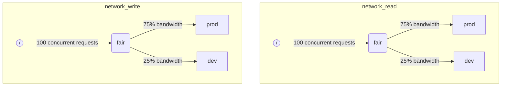

Когда ClickHouse выполняет несколько запросов одновременно, они могут использовать совместные ресурсы (например, диски и ядра CPU). Могут применяться ограничения и политики планирования, чтобы регулировать, как ресурсы используются и делятся между различными рабочими нагрузками. Для всех ресурсов можно настроить общую иерархию планирования. Корень иерархии представляет собой совместно используемые ресурсы, в то время как листья являются специфическими рабочими нагрузками, удерживающими запросы, превышающие емкость ресурса.

:::note
В данный момент [дисковый ввод-вывод](#disk_config) и [CPU](#cpu_scheduling) могут планироваться с помощью описанного метода. Для гибких лимитов памяти смотрите [Переизбыток памяти](settings/memory-overcommit.md)
:::

## Конфигурация диска {#disk_config}

Чтобы включить планирование IO рабочей нагрузки для конкретного диска, необходимо создать ресурсы для чтения и записи для доступа WRITE и READ:

```sql
CREATE RESOURCE resource_name (WRITE DISK disk_name, READ DISK disk_name)
-- or
CREATE RESOURCE read_resource_name (WRITE DISK write_disk_name)
CREATE RESOURCE write_resource_name (READ DISK read_disk_name)
```

Ресурс может использоваться для любого количества дисков для READ или WRITE или для обоих типов доступа. Существует синтаксис, позволяющий использовать ресурс для всех дисков:

```sql
CREATE RESOURCE all_io (READ ANY DISK, WRITE ANY DISK);
```

Альтернативный способ указать, какие диски используются ресурсом, это `storage_configuration` сервера:

:::warning
Планирование рабочей нагрузки с использованием конфигурации ClickHouse устарело. Вместо этого следует использовать синтаксис SQL.
:::

Чтобы включить планирование IO для конкретного диска, необходимо указать `read_resource` и/или `write_resource` в конфигурации хранения. Это указывает ClickHouse, какой ресурс должен использоваться для каждого запроса на чтение и запись с данным диском. Ресурсы чтения и записи могут ссылаться на одно и то же имя ресурса, что полезно для локальных SSD или HDD. Несколько различных дисков также могут ссылаться на один и тот же ресурс, что полезно для удаленных дисков: если вы хотите обеспечить справедливое распределение пропускной способности сети между, например, «производственными» и «развивающимися» рабочими нагрузками.

Пример:
```xml
<clickhouse>
    <storage_configuration>
        ...
        <disks>
            <s3>
                <type>s3</type>
                <endpoint>https://clickhouse-public-datasets.s3.amazonaws.com/my-bucket/root-path/</endpoint>
                <access_key_id>your_access_key_id</access_key_id>
                <secret_access_key>your_secret_access_key</secret_access_key>
                <read_resource>network_read</read_resource>
                <write_resource>network_write</write_resource>
            </s3>
        </disks>
        <policies>
            <s3_main>
                <volumes>
                    <main>
                        <disk>s3</disk>
                    </main>
                </volumes>
            </s3_main>
        </policies>
    </storage_configuration>
</clickhouse>
```

Обратите внимание, что параметры конфигурации сервера имеют приоритет над SQL-методом определения ресурсов.

## Разметка рабочих нагрузок {#workload_markup}

Запросы могут быть отмечены с помощью настройки `workload`, чтобы различать разные рабочие нагрузки. Если `workload` не установлен, используется значение «по умолчанию». Обратите внимание, что вы можете указать другое значение, используя профили настроек. Ограничения настроек могут использоваться для того, чтобы сделать `workload` постоянным, если вы хотите, чтобы все запросы от пользователя были отмечены фиксированным значением настройки `workload`.

Возможно назначить настройку `workload` для фоновых действий. Слияния и мутации используют серверные настройки `merge_workload` и `mutation_workload` соответственно. Эти значения также могут быть переопределены для конкретных таблиц с использованием настроек `merge_workload` и `mutation_workload` дерева слияния.

Рассмотрим пример системы с двумя разными рабочими нагрузками: «производственная» и «развивающаяся».

```sql
SELECT count() FROM my_table WHERE value = 42 SETTINGS workload = 'production'
SELECT count() FROM my_table WHERE value = 13 SETTINGS workload = 'development'
```

## Иерархия планирования ресурсов {#hierarchy}

С точки зрения подсистемы планирования ресурс представляет собой иерархию узлов планирования.



:::warning
Планирование рабочей нагрузки с использованием конфигурации ClickHouse устарело. Вместо этого следует использовать синтаксис SQL. Синтаксис SQL автоматически создает все необходимые узлы планирования, и дальнейшее описание узлов планирования следует рассматривать как детали реализации более низкого уровня, доступные через таблицу [system.scheduler](/operations/system-tables/scheduler.md).
:::

**Возможные типы узлов:**
* `inflight_limit` (ограничение) - блокирует, если либо количество одновременно выполнение запросов превышает `max_requests`, либо их общая стоимость превышает `max_cost`; должен иметь единственного дочернего узла.
* `bandwidth_limit` (ограничение) - блокирует, если текущая пропускная способность превышает `max_speed` (0 означает безлимитный) или всплеск превышает `max_burst` (по умолчанию равно `max_speed`); должен иметь единственного дочернего узла.
* `fair` (политика) - выбирает следующий запрос для обслуживания из одного из дочерних узлов в соответствии с максимальной-с-min справедливостью; дочерние узлы могут указывать `weight` (по умолчанию 1).
* `priority` (политика) - выбирает следующий запрос для обслуживания из одного из дочерних узлов в соответствии со статическими приоритетами (меньшее значение означает более высокий приоритет); дочерние узлы могут указывать `priority` (по умолчанию 0).
* `fifo` (очередь) - лист иерархии, способный удерживать запросы, которые превышают емкость ресурса.

Чтобы иметь возможность использовать полную емкость подлежащего ресурса, следует использовать `inflight_limit`. Обратите внимание, что низкое значение `max_requests` или `max_cost` может привести к неполному использованию ресурса, тогда как слишком высокие числа могут привести к пустым очередям внутри планировщика, что, в свою очередь, приведет к игнорированию политик (несправедливости или игнорирования приоритетов) в поддереве. С другой стороны, если вы хотите защитить ресурсы от чрезмерного использования, следует использовать `bandwidth_limit`. Он ограничивает, когда количество ресурса, потребляемого в течение `duration` секунд, превышает `max_burst + max_speed * duration` байт. Два узла `bandwidth_limit` на одном ресурсе могут использоваться для ограничения пиковой пропускной способности за короткие интервалы и средней пропускной способности для более длинных.

Следующий пример показывает, как определить иерархии планирования IO, показанные на рисунке:

```xml
<clickhouse>
    <resources>
        <network_read>
            <node path="/">
                <type>inflight_limit</type>
                <max_requests>100</max_requests>
            </node>
            <node path="/fair">
                <type>fair</type>
            </node>
            <node path="/fair/prod">
                <type>fifo</type>
                <weight>3</weight>
            </node>
            <node path="/fair/dev">
                <type>fifo</type>
            </node>
        </network_read>
        <network_write>
            <node path="/">
                <type>inflight_limit</type>
                <max_requests>100</max_requests>
            </node>
            <node path="/fair">
                <type>fair</type>
            </node>
            <node path="/fair/prod">
                <type>fifo</type>
                <weight>3</weight>
            </node>
            <node path="/fair/dev">
                <type>fifo</type>
            </node>
        </network_write>
    </resources>
</clickhouse>
```

## Классификаторы рабочих нагрузок {#workload_classifiers}

:::warning
Планирование рабочей нагрузки с использованием конфигурации ClickHouse устарело. Вместо этого следует использовать синтаксис SQL. Классификаторы создаются автоматически при использовании синтаксиса SQL.
:::

Классификаторы рабочих нагрузок используются для определения соответствия между `workload`, указанной в запросе, и очередями-листьями, которые должны использоваться для конкретных ресурсов. В данный момент классификация рабочих нагрузок проста: доступно только статическое сопоставление.

Пример:
```xml
<clickhouse>
    <workload_classifiers>
        <production>
            <network_read>/fair/prod</network_read>
            <network_write>/fair/prod</network_write>
        </production>
        <development>
            <network_read>/fair/dev</network_read>
            <network_write>/fair/dev</network_write>
        </development>
        <default>
            <network_read>/fair/dev</network_read>
            <network_write>/fair/dev</network_write>
        </default>
    </workload_classifiers>
</clickhouse>
```

## Иерархия рабочих нагрузок {#workloads}

ClickHouse предоставляет удобный синтаксис SQL для определения иерархии планирования. Все ресурсы, созданные с помощью `CREATE RESOURCE`, разделяют одну и ту же структуру иерархии, но могут различаться по некоторым аспектам. Каждая рабочая нагрузка, созданная с помощью `CREATE WORKLOAD`, поддерживает несколько автоматически созданных узлов планирования для каждого ресурса. Дочернюю рабочую нагрузку можно создать внутри другой родительской рабочей нагрузки. Вот пример, который определяет точно такую же иерархию, как и XML-конфигурация выше:

```sql
CREATE RESOURCE network_write (WRITE DISK s3)
CREATE RESOURCE network_read (READ DISK s3)
CREATE WORKLOAD all SETTINGS max_io_requests = 100
CREATE WORKLOAD development IN all
CREATE WORKLOAD production IN all SETTINGS weight = 3
```

Имя рабочей нагрузки-листа без дочерних узлов может быть использовано в настройках запроса `SETTINGS workload = 'name'`.

Для настройки рабочей нагрузки могут использоваться следующие настройки:
* `priority` - родственные рабочие нагрузки обслуживаются в соответствии со статическими значениями приоритета (меньшее значение означает более высокий приоритет).
* `weight` - родственные рабочие нагрузки с одинаковым статическим приоритетом делят ресурсы в соответствии с весами.
* `max_io_requests` - ограничение на количество одновременно выполняемых IO-запросов в этой рабочей нагрузке.
* `max_bytes_inflight` - ограничение на общее количество байт в процессе выполнения для одновременных запросов в этой рабочей нагрузке.
* `max_bytes_per_second` - ограничение на скорость чтения или записи байтов этой рабочей нагрузки.
* `max_burst_bytes` - максимальное количество байт, которое может быть обработано рабочей нагрузкой без ограничения (для каждого ресурса независимо).
* `max_concurrent_threads` - ограничение на количество потоков для запросов в этой рабочей нагрузке.
* `max_concurrent_threads_ratio_to_cores` - то же самое, что и `max_concurrent_threads`, но нормализованное по количеству доступных ядер CPU.
* `max_cpus` - ограничение на количество ядер CPU для обслуживания запросов в этой рабочей нагрузке.
* `max_cpu_share` - то же самое, что и `max_cpus`, но нормализованное по количеству доступных ядер CPU.
* `max_burst_cpu_seconds` - максимальное количество секунд CPU, которые могут быть использованы рабочей нагрузкой без ограничения из-за `max_cpus`.

Все лимиты, указанные через настройки рабочей нагрузки, независимы для каждого ресурса. Например, рабочая нагрузка с `max_bytes_per_second = 10485760` будет иметь лимит пропускной способности 10 МБ/с для каждого ресурса чтения и записи независимо. Если требуется общий лимит для чтения и записи, рассмотрите возможность использования одного и того же ресурса для доступа READ и WRITE.

Нет возможности указать разные иерархии рабочих нагрузок для различных ресурсов. Но есть возможность указать разные значения настройки рабочей нагрузки для конкретного ресурса:

```sql
CREATE OR REPLACE WORKLOAD all SETTINGS max_io_requests = 100, max_bytes_per_second = 1000000 FOR network_read, max_bytes_per_second = 2000000 FOR network_write
```

Также обратите внимание, что рабочая нагрузка или ресурс не могут быть удалены, если на них ссылается другая рабочая нагрузка. Чтобы обновить определение рабочей нагрузки, используйте запрос `CREATE OR REPLACE WORKLOAD`.

:::note
Настройки рабочих нагрузок преобразуются в необходимый набор узлов планирования. Для получения более низкоуровневых деталей смотрите описание узлов планирования [типов и опций](#hierarchy).
:::

## Планирование CPU {#cpu_scheduling}

Чтобы включить планирование CPU для рабочих нагрузок, создайте ресурс CPU и установите ограничение на количество одновременно выполняемых потоков:

```sql
CREATE RESOURCE cpu (MASTER THREAD, WORKER THREAD)
CREATE WORKLOAD all SETTINGS max_concurrent_threads = 100
```

Когда сервер ClickHouse выполняет много параллельных запросов с [несколькими потоками](/operations/settings/settings.md#max_threads), и все слоты CPU заняты, достигается состояние перегрузки. В состоянии перегрузки каждый освобожденный слот CPU переназначается на соответствующую рабочую нагрузку в соответствии с политиками планирования. Для запросов, относящихся к одной и той же рабочей нагрузке, слоты распределяются по кругу. Для запросов в разных рабочих нагрузках слоты распределяются в соответствии с весами, приоритетами и ограничениями, указанными для рабочих нагрузок.

Время CPU расходуется потоками, когда они не заблокированы и работают над задачами, требующими интенсивного использования CPU. В целях планирования различают два типа потоков:
* Основной поток — первый поток, который начинает работать над запросом или фоновым действием, таким как слияние или мутация.
* Рабочий поток — дополнительные потоки, которые основной поток может создать для работы над задачами, требующими интенсивного использования CPU.

Может быть желательно использовать отдельные ресурсы для основных и рабочих потоков для достижения лучшей отзывчивости. Высокое количество рабочих потоков может легко монополизировать ресурс CPU, когда используются высокие значения настройки `max_threads`. В этом случае входящие запросы должны блокироваться и ожидать слот CPU для начала выполнения своего основного потока. Чтобы избежать этого, можно использовать следующую конфигурацию:

```sql
CREATE RESOURCE worker_cpu (WORKER THREAD)
CREATE RESOURCE master_cpu (MASTER THREAD)
CREATE WORKLOAD all SETTINGS max_concurrent_threads = 100 FOR worker_cpu, max_concurrent_threads = 1000 FOR master_cpu
```

Это создаст отдельные ограничения на основные и рабочие потоки. Даже если все 100 слотов CPU для рабочих потоков заняты, новые запросы не будут заблокированы, пока есть доступные слоты для основных потоков CPU. Они начнут выполнение с одного потока. Позже, если слоты рабочих потоков CPU станут доступны, такие запросы могут масштабироваться и создавать свои рабочие потоки. С другой стороны, такой подход не связывает общее количество слотов с количеством процессоров CPU, и запуск слишком большого количества параллельных потоков повлияет на производительность.

Ограничение параллелизма основных потоков не будет ограничивать количество одновременно выполняемых запросов. Слоты CPU могут быть освобождены в середине выполнения запроса и заново захвачены другими потоками. Например, 4 параллельных запроса с ограничением на 2 параллельных основного потока могут все выполняться одновременно. В этом случае каждый запрос получит 50% процессора CPU. Для ограничения количества параллельных запросов должна использоваться отдельная логика, и в настоящее время она не поддерживается для рабочих нагрузок.

Можно использовать отдельные лимиты параллелизма потоков для рабочих нагрузок:

```sql
CREATE RESOURCE cpu (MASTER THREAD, WORKER THREAD)
CREATE WORKLOAD all
CREATE WORKLOAD admin IN all SETTINGS max_concurrent_threads = 10
CREATE WORKLOAD production IN all SETTINGS max_concurrent_threads = 100
CREATE WORKLOAD analytics IN production SETTINGS max_concurrent_threads = 60, weight = 9
CREATE WORKLOAD ingestion IN production
```

Этот пример конфигурации предоставляет независимые пула слотов CPU для административной и производственной нагрузок. Производственный пул делится между аналитикой и загрузкой. Более того, если производственный пул перегружен, 9 из 10 освобожденных слотов будут переназначены на аналитические запросы, если это необходимо. Запросы на загрузку получат только 1 из 10 слотов в периоды перегрузки. Это может улучшить задержку запросов, направленных на пользователей. Аналитика имеет свой собственный лимит в 60 параллельных потоков, всегда оставляя как минимум 40 потоков для поддержки загрузки. Когда нет перегрузки, загрузка может использовать все 100 потоков.

Чтобы исключить запрос из планирования CPU, установите настройку запроса [use_concurrency_control](/operations/settings/settings.md/#use_concurrency_control) в 0.

Планирование CPU еще не поддерживается для слияний и мутаций.

Чтобы обеспечить справедливое распределение для рабочей нагрузки, необходимо выполнять предвосхищение и уменьшение количества потоков во время выполнения запроса. Предвосхищение включается с помощью настройки сервера `cpu_slot_preemption`. Если оно включено, каждый поток периодически обновляет свой слот CPU (в соответствии с настройкой сервера `cpu_slot_quantum_ns`). Такое обновление может блокировать выполнение, если CPU перегружен. Когда выполнение блокируется на длительный период времени (см. настройку сервера `cpu_slot_preemption_timeout_ms`), тогда запрос уменьшает масштаб, и количество одновременно выполняемых потоков динамически уменьшается. Обратите внимание, что справедливость во времени CPU гарантируется между рабочими нагрузками, но между запросами внутри одной и той же рабочей нагрузки это может быть нарушено в некоторых крайних случаях.

:::warning
Планирование слотов обеспечивает способ контроля [параллелизма запросов](/operations/settings/settings.md#max_threads), но не гарантирует справедливое распределение времени CPU, если серверная настройка `cpu_slot_preemption` не установлена в `true`. В противном случае справедливость обеспечивается на основе количества выделений слотов CPU между конкурирующими рабочими нагрузками. Это не подразумевает равное количество CPU-секунд, потому что без предвосхищения слот CPU может удерживаться бесконечно. Поток захватывает слот в начале и освобождается, когда работа завершена.
:::

:::note
Объявление ресурса CPU отключает эффект настройки [`concurrent_threads_soft_limit_num`](server-configuration-parameters/settings.md#concurrent_threads_soft_limit_num) и [`concurrent_threads_soft_limit_ratio_to_cores`](server-configuration-parameters/settings.md#concurrent_threads_soft_limit_ratio_to_cores). Вместо этого используется настройка рабочей нагрузки `max_concurrent_threads`, чтобы ограничить количество выделенных CPU для конкретной рабочей нагрузки. Чтобы добиться прежнего поведения, создайте только ресурс WORKER THREAD, установите `max_concurrent_threads` для рабочей нагрузки `all` на то же значение, что и `concurrent_threads_soft_limit_num`, и используйте настройку запроса `workload = "all"`. Эта конфигурация соответствует настройке [`concurrent_threads_scheduler`](server-configuration-parameters/settings.md#concurrent_threads_scheduler) со значением "fair_round_robin".
:::

## Потоки против CPU {#threads_vs_cpus}

Существует два способа контролировать потребление CPU рабочей нагрузкой:
* Ограничение числа потоков: `max_concurrent_threads` и `max_concurrent_threads_ratio_to_cores`
* Ограничение CPU: `max_cpus`, `max_cpu_share` и `max_burst_cpu_seconds`

Первый позволяет динамически контролировать, сколько потоков создается для запроса в зависимости от текущей загрузки сервера. Он эффективно снижает то, что диктует настройка запроса `max_threads`. Второй ограничивает потребление CPU рабочей нагрузки с помощью алгоритма токенов. Это не влияет напрямую на число потоков, но ограничивает общее потребление CPU всех потоков в рабочей нагрузке.

Ограничение токенов с `max_cpus` и `max_burst_cpu_seconds` означает следующее. В течение любого интервала времени `delta` общее потребление CPU всеми запросами в рабочей нагрузке не должно превышать `max_cpus * delta + max_burst_cpu_seconds` CPU-секунд. Это ограничивает среднее потребление до `max_cpus` в долгосрочной перспективе, но этот лимит может быть превышен в краткосрочной перспективе. Например, при `max_burst_cpu_seconds = 60` и `max_cpus=0.001` можно запустить либо 1 поток на 60 секунд, либо 2 потока на 30 секунд, либо 60 потоков на 1 секунду без ограничения. Значение по умолчанию для `max_burst_cpu_seconds` составляет 1 секунду. Более низкие значения могут привести к недостаточному использованию разрешенных ядер `max_cpus` при большом количестве параллельных потоков.

:::warning
Настройки ограничения CPU активны только если включена серверная настройка `cpu_slot_preemption` и игнорируются в противном случае.
:::

Держатель слота CPU поток может находиться в одном из трех основных состояний:
* **Выполнение:** Эффективно потребляет ресурс CPU. Время, проведенное в этом состоянии, учитывается в ограничении CPU.
* **Готов:** Ждет, пока CPU станет доступным. Не учитывается в ограничении CPU.
* **Заблокирован:** Выполняет IO-операции или другие блокирующие системные вызовы (например, ожидание мьютекса). Не учитывается в ограничении CPU.

Рассмотрим пример конфигурации, который сочетает как ограничения CPU, так и лимиты числа потоков:

```sql
CREATE RESOURCE cpu (MASTER THREAD, WORKER THREAD)
CREATE WORKLOAD all SETTINGS max_concurrent_threads_ratio_to_cores = 2
CREATE WORKLOAD admin IN all SETTINGS max_concurrent_threads = 2, priority = -1
CREATE WORKLOAD production IN all SETTINGS weight = 4
CREATE WORKLOAD analytics IN production SETTINGS max_cpu_share = 0.7, weight = 3
CREATE WORKLOAD ingestion IN production
CREATE WORKLOAD development IN all SETTINGS max_cpu_share = 0.3
```

Здесь мы ограничиваем общее количество потоков для всех запросов в два раза больше доступных CPU. Административная рабочая нагрузка ограничена максимум двумя потоками, независимо от количества доступных CPU. Админ имеет приоритет -1 (меньше, чем по умолчанию 0) и получает любой слот CPU первым, если это необходимо. Когда администратор не выполняет запросов, ресурсы CPU делятся между производственными и развивающимися рабочими нагрузками. Гарантированные доли времени CPU основаны на весах (4 к 1): как минимум 80% выделяется на производство (если требуется), и как минимум 20% на развитие (если требуется). Хотя веса формируют гарантии, ограничение CPU формирует лимиты: производственная рабочая нагрузка не ограничена и может потреблять 100%, в то время как развитие имеет лимит 30%, который применяется даже если нет запросов от других нагрузок. Производственная рабочая нагрузка не является листом, поэтому ее ресурсы разделяются между аналитикой и загрузкой в соответствии с весами (3 к 1). Это означает, что аналитика имеет гарантию как минимум 0.8 * 0.75 = 60%, а в соответствии с `max_cpu_share` у нее есть лимит в 70% от общего объема ресурсов CPU. В то время как загрузка оставляет гарантию как минимум 0.8 * 0.25 = 20%, у нее нет верхнего лимита.

:::note
Если вы хотите максимизировать использование CPU на вашем сервере ClickHouse, избегайте использования `max_cpus` и `max_cpu_share` для корневой рабочей нагрузки `all`. Вместо этого установите более высокое значение для `max_concurrent_threads`. Например, на системе с 8 ядрами CPU установите `max_concurrent_threads = 16`. Это позволяет 8 потокам выполнять задачи CPU, в то время как другие 8 потоков могут обрабатывать операции ввода-вывода. Дополнительные потоки создадут давление на CPU, что обеспечит применение правил планирования. Напротив, установка `max_cpus = 8` никогда не создаст давления на CPU, потому что сервер не сможет превысить 8 доступных CPU.
:::

## Планирование слотов запросов {#query_scheduling}

Чтобы включить планирование слотов запросов для рабочих нагрузок, создайте ресурс QUERY и установите ограничение на количество одновременно выполняемых запросов или запросов в секунду:

```sql
CREATE RESOURCE query (QUERY)
CREATE WORKLOAD all SETTINGS max_concurrent_queries = 100, max_queries_per_second = 10, max_burst_queries = 20
```

Настройка рабочей нагрузки `max_concurrent_queries` ограничивает количество одновременно выполняемых запросов, которые могут выполняться одновременно для данной рабочей нагрузки. Это аналогично настройкам запроса [`max_concurrent_queries_for_all_users`](/operations/settings/settings#max_concurrent_queries_for_all_users) и сервера [max_concurrent_queries](/operations/server-configuration-parameters/settings#max_concurrent_queries). Запросы с асинхронной вставкой и некоторые конкретные запросы, такие как KILL, не учитываются в лимите.

Настройки рабочей нагрузки `max_queries_per_second` и `max_burst_queries` ограничивают количество запросов для рабочей нагрузки с помощью ограничителя токенов. Это гарантирует, что в течение любого временного интервала `T` не будет запущено более чем `max_queries_per_second * T + max_burst_queries` новых запросов.

Настройка рабочей нагрузки `max_waiting_queries` ограничивает количество ожидающих запросов для рабочей нагрузки. Когда лимит достигнут, сервер возвращает ошибку `SERVER_OVERLOADED`.

:::note
Заблокированные запросы будут ожидать бесконечно и не появляться в `SHOW PROCESSLIST`, пока все ограничения не будут выполнены.
:::

## Хранение рабочих нагрузок и ресурсов {#workload_entity_storage}

Определения всех рабочих нагрузок и ресурсов в виде запросов `CREATE WORKLOAD` и `CREATE RESOURCE` хранятся постоянно либо на диске по пути `workload_path`, либо в ZooKeeper по пути `workload_zookeeper_path`. Хранение в ZooKeeper рекомендуется для достижения согласованности между узлами. В качестве альтернативы можно использовать клаузу `ON CLUSTER` вместе с дисковым хранилищем.

## Рабочие нагрузки и ресурсы на основе конфигурации {#config_based_workloads}

Кроме определений на основе SQL, рабочие нагрузки и ресурсы могут быть предварительно определены в файле конфигурации сервера. Это полезно в облачных средах, где некоторые ограничения диктуются инфраструктурой, в то время как другие лимиты могут изменяться клиентами. Сущности на основе конфигурации имеют приоритет над определенными с помощью SQL и не могут быть изменены или удалены с помощью SQL-команд.

### Формат конфигурации {#config_based_workloads_format}

```xml
<clickhouse>
    <resources_and_workloads>
        RESOURCE s3disk_read (READ DISK s3);
        RESOURCE s3disk_write (WRITE DISK s3);
        WORKLOAD all SETTINGS max_io_requests = 500 FOR s3disk_read, max_io_requests = 1000 FOR s3disk_write, max_bytes_per_second = 1342177280 FOR s3disk_read, max_bytes_per_second = 3355443200 FOR s3disk_write;
        WORKLOAD production IN all SETTINGS weight = 3;
    </resources_and_workloads>
</clickhouse>
```

Конфигурация использует тот же синтаксис SQL, что и операторы `CREATE WORKLOAD` и `CREATE RESOURCE`. Все запросы должны быть действительными.

### Рекомендации по использованию {#config_based_workloads_usage_recommendations}

Для облачных средtypical настройка может включать:

1. Определите корневую рабочую нагрузку и ресурсы сетевого ввода-вывода в конфигурации, чтобы установить инфраструктурные лимиты.
2. Установите `throw_on_unknown_workload`, чтобы обеспечить применение этих лимитов.
3. Создайте `CREATE WORKLOAD default IN all`, чтобы автоматически применять ограничения ко всем запросам (поскольку значение по умолчанию для настройки запроса `workload` - 'default').
4. Позвольте пользователям создавать дополнительные рабочие нагрузки внутри заданной иерархии.

Это гарантирует, что все фоновые действия и запросы соответствуют инфраструктурным ограничениям, при этом позволяя гибкость для специфических расписаний пользователей.

Еще один случай использования - различные настройки для различных узлов в гетерогенном кластере.

## Строгий доступ к ресурсам {#strict_resource_access}

Чтобы заставить все запросы следовать политикам планирования ресурсов, существует настройка сервера `throw_on_unknown_workload`. Если она установлена в `true`, каждый запрос должен использовать действительную настройку запроса `workload`, в противном случае генерируется исключение `RESOURCE_ACCESS_DENIED`. Если она установлена в `false`, тогда такой запрос не использует планировщик ресурсов, т.е. он получит неограниченный доступ к любому `RESOURCE`. Настройка запроса 'use_concurrency_control = 0' позволяет запросу избежать планировщика CPU и получить неограниченный доступ к CPU. Чтобы обеспечить планирование CPU, создайте ограничение на настройки, чтобы оставаться 'use_concurrency_control' в постоянном состоянии только для чтения.

:::note
Не устанавливайте `throw_on_unknown_workload` в `true`, если `CREATE WORKLOAD default` не выполнено. Это может привести к проблемам с запуском сервера, если во время запуска выполнен запрос без явной установки `workload`.
:::

## См. также {#see-also}
- [system.scheduler](/operations/system-tables/scheduler.md)
- [system.workloads](/operations/system-tables/workloads.md)
- [system.resources](/operations/system-tables/resources.md)
- [merge_workload](/operations/settings/merge-tree-settings.md#merge_workload) настройка дерева слияния
- [merge_workload](/operations/server-configuration-parameters/settings.md#merge_workload) общая серверная настройка
- [mutation_workload](/operations/settings/merge-tree-settings.md#mutation_workload) настройка дерева слияния
- [mutation_workload](/operations/server-configuration-parameters/settings.md#mutation_workload) общая серверная настройка
- [workload_path](/operations/server-configuration-parameters/settings.md#workload_path) общая серверная настройка
- [workload_zookeeper_path](/operations/server-configuration-parameters/settings.md#workload_zookeeper_path) общая серверная настройка
- [cpu_slot_preemption](/operations/server-configuration-parameters/settings.md#cpu_slot_preemption) общая серверная настройка
- [cpu_slot_quantum_ns](/operations/server-configuration-parameters/settings.md#cpu_slot_quantum_ns) общая серверная настройка
- [cpu_slot_preemption_timeout_ms](/operations/server-configuration-parameters/settings.md#cpu_slot_preemption_timeout_ms) общая серверная настройка