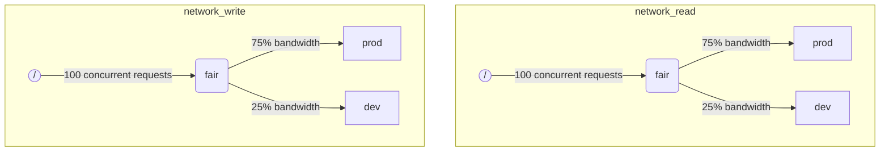

Когда ClickHouse выполняет несколько запросов одновременно, эти запросы могут использовать общие ресурсы (например, диски и ядра процессора). К ним можно применять ограничения и политики планирования, чтобы регулировать, как ресурсы используются и разделяются между разными рабочими нагрузками. Для всех ресурсов можно настроить единую иерархию планирования. Корень иерархии представляет общие ресурсы, а листья — это конкретные рабочие нагрузки, содержащие запросы, которые превышают ресурсоёмкость системы.

:::note
В настоящее время с использованием описанного метода можно планировать [операции ввода-вывода по удалённому диску](#disk_config) и [CPU](#cpu_scheduling). Для гибкой настройки ограничений по памяти см. [Memory overcommit](settings/memory-overcommit.md).
:::


## Конфигурация дисков {#disk_config}

Чтобы включить планирование нагрузки ввода-вывода для конкретного диска, необходимо создать ресурсы чтения и записи для доступа WRITE и READ:

```sql
CREATE RESOURCE resource_name (WRITE DISK disk_name, READ DISK disk_name)
-- или
CREATE RESOURCE read_resource_name (WRITE DISK write_disk_name)
CREATE RESOURCE write_resource_name (READ DISK read_disk_name)
```

Ресурс может использоваться для любого количества дисков для операций READ или WRITE, либо одновременно для READ и WRITE. Существует синтаксис, позволяющий использовать ресурс для всех дисков:

```sql
CREATE RESOURCE all_io (READ ANY DISK, WRITE ANY DISK);
```

Альтернативный способ указать, какие диски используются ресурсом — это параметр `storage_configuration` сервера:

:::warning
Планирование нагрузки с использованием конфигурации ClickHouse устарело. Вместо этого следует использовать синтаксис SQL.
:::

Чтобы включить планирование ввода-вывода для конкретного диска, необходимо указать `read_resource` и/или `write_resource` в конфигурации хранилища. Это указывает ClickHouse, какой ресурс следует использовать для каждого запроса на чтение и запись для данного диска. Ресурсы чтения и записи могут ссылаться на одно и то же имя ресурса, что полезно для локальных SSD или HDD. Несколько различных дисков также могут ссылаться на один и тот же ресурс, что полезно для удалённых дисков: если требуется обеспечить справедливое распределение пропускной способности сети между, например, рабочими нагрузками «production» и «development».

Пример:

```xml
<clickhouse>
    <storage_configuration>
        ...
        <disks>
            <s3>
                <type>s3</type>
                <endpoint>https://clickhouse-public-datasets.s3.amazonaws.com/my-bucket/root-path/</endpoint>
                <access_key_id>your_access_key_id</access_key_id>
                <secret_access_key>your_secret_access_key</secret_access_key>
                <read_resource>network_read</read_resource>
                <write_resource>network_write</write_resource>
            </s3>
        </disks>
        <policies>
            <s3_main>
                <volumes>
                    <main>
                        <disk>s3</disk>
                    </main>
                </volumes>
            </s3_main>
        </policies>
    </storage_configuration>
</clickhouse>
```

Обратите внимание, что параметры конфигурации сервера имеют приоритет над определением ресурсов через SQL.


## Маркировка рабочих нагрузок {#workload_markup}

Запросы можно помечать с помощью настройки `workload` для разграничения различных рабочих нагрузок. Если `workload` не задана, то используется значение "default". Обратите внимание, что можно указать другое значение с помощью профилей настроек. Ограничения настроек можно использовать для того, чтобы сделать `workload` константой, если требуется, чтобы все запросы от пользователя были помечены фиксированным значением настройки `workload`.

Можно назначить настройку `workload` для фоновых операций. Слияния и мутации используют серверные настройки `merge_workload` и `mutation_workload` соответственно. Эти значения также можно переопределить для конкретных таблиц с помощью настроек MergeTree `merge_workload` и `mutation_workload`.

Рассмотрим пример системы с двумя различными рабочими нагрузками: "production" и "development".

```sql
SELECT count() FROM my_table WHERE value = 42 SETTINGS workload = 'production'
SELECT count() FROM my_table WHERE value = 13 SETTINGS workload = 'development'
```


## Иерархия планирования ресурсов {#hierarchy}

С точки зрения подсистемы планирования ресурс представляет собой иерархию узлов планирования.



:::warning
Планирование рабочей нагрузки с использованием конфигурации ClickHouse устарело. Вместо этого следует использовать синтаксис SQL. Синтаксис SQL автоматически создаёт все необходимые узлы планирования, и приведённое ниже описание узлов планирования следует рассматривать как низкоуровневые детали реализации, доступные через таблицу [system.scheduler](/operations/system-tables/scheduler.md).
:::

**Возможные типы узлов:**

- `inflight_limit` (ограничение) — блокирует выполнение, если количество одновременно выполняющихся запросов превышает `max_requests` или их общая стоимость превышает `max_cost`; должен иметь единственный дочерний узел.
- `bandwidth_limit` (ограничение) — блокирует выполнение, если текущая пропускная способность превышает `max_speed` (0 означает отсутствие ограничений) или всплеск превышает `max_burst` (по умолчанию равен `max_speed`); должен иметь единственный дочерний узел.
- `fair` (политика) — выбирает следующий запрос для обслуживания из одного из дочерних узлов в соответствии с принципом max-min справедливости; дочерние узлы могут указывать `weight` (по умолчанию 1).
- `priority` (политика) — выбирает следующий запрос для обслуживания из одного из дочерних узлов в соответствии со статическими приоритетами (меньшее значение означает более высокий приоритет); дочерние узлы могут указывать `priority` (по умолчанию 0).
- `fifo` (очередь) — листовой узел иерархии, способный удерживать запросы, превышающие ёмкость ресурса.

Чтобы использовать полную ёмкость базового ресурса, следует применять `inflight_limit`. Обратите внимание, что низкое значение `max_requests` или `max_cost` может привести к неполному использованию ресурса, в то время как слишком высокие значения могут привести к пустым очередям внутри планировщика, что в свою очередь приведёт к игнорированию политик (несправедливости или игнорированию приоритетов) в поддереве. С другой стороны, если необходимо защитить ресурсы от чрезмерной нагрузки, следует использовать `bandwidth_limit`. Он ограничивает выполнение, когда объём потреблённого ресурса за `duration` секунд превышает `max_burst + max_speed * duration` байт. Два узла `bandwidth_limit` на одном ресурсе могут использоваться для ограничения пиковой пропускной способности в течение коротких интервалов и средней пропускной способности для более длительных.

Следующий пример показывает, как определить иерархии планирования ввода-вывода, показанные на диаграмме:

```xml
<clickhouse>
    <resources>
        <network_read>
            <node path="/">
                <type>inflight_limit</type>
                <max_requests>100</max_requests>
            </node>
            <node path="/fair">
                <type>fair</type>
            </node>
            <node path="/fair/prod">
                <type>fifo</type>
                <weight>3</weight>
            </node>
            <node path="/fair/dev">
                <type>fifo</type>
            </node>
        </network_read>
        <network_write>
            <node path="/">
                <type>inflight_limit</type>
                <max_requests>100</max_requests>
            </node>
            <node path="/fair">
                <type>fair</type>
            </node>
            <node path="/fair/prod">
                <type>fifo</type>
                <weight>3</weight>
            </node>
            <node path="/fair/dev">
                <type>fifo</type>
            </node>
        </network_write>
    </resources>
</clickhouse>
```


## Классификаторы рабочих нагрузок {#workload_classifiers}

:::warning
Планирование рабочих нагрузок через конфигурацию ClickHouse устарело. Вместо этого следует использовать синтаксис SQL. При использовании синтаксиса SQL классификаторы создаются автоматически.
:::

Классификаторы рабочих нагрузок используются для определения соответствия между `workload`, указанным в запросе, и конечными очередями, которые должны использоваться для конкретных ресурсов. В настоящее время классификация рабочих нагрузок является простой: доступно только статическое сопоставление.

Пример:

```xml
<clickhouse>
    <workload_classifiers>
        <production>
            <network_read>/fair/prod</network_read>
            <network_write>/fair/prod</network_write>
        </production>
        <development>
            <network_read>/fair/dev</network_read>
            <network_write>/fair/dev</network_write>
        </development>
        <default>
            <network_read>/fair/dev</network_read>
            <network_write>/fair/dev</network_write>
        </default>
    </workload_classifiers>
</clickhouse>
```


## Иерархия рабочих нагрузок {#workloads}

ClickHouse предоставляет удобный SQL-синтаксис для определения иерархии планирования. Все ресурсы, созданные с помощью `CREATE RESOURCE`, имеют одинаковую структуру иерархии, но могут различаться в некоторых аспектах. Каждая рабочая нагрузка, созданная с помощью `CREATE WORKLOAD`, содержит несколько автоматически создаваемых узлов планирования для каждого ресурса. Дочерняя рабочая нагрузка может быть создана внутри другой родительской рабочей нагрузки. Вот пример, который определяет точно такую же иерархию, как и XML-конфигурация выше:

```sql
CREATE RESOURCE network_write (WRITE DISK s3)
CREATE RESOURCE network_read (READ DISK s3)
CREATE WORKLOAD all SETTINGS max_io_requests = 100
CREATE WORKLOAD development IN all
CREATE WORKLOAD production IN all SETTINGS weight = 3
```

Имя конечной рабочей нагрузки без дочерних элементов может использоваться в настройках запроса `SETTINGS workload = 'name'`.

Для настройки рабочей нагрузки можно использовать следующие параметры:

- `priority` — соседние рабочие нагрузки обслуживаются в соответствии со значениями статического приоритета (меньшее значение означает более высокий приоритет).
- `weight` — соседние рабочие нагрузки с одинаковым статическим приоритетом распределяют ресурсы в соответствии с весами.
- `max_io_requests` — ограничение на количество одновременных IO-запросов в данной рабочей нагрузке.
- `max_bytes_inflight` — ограничение на общий объём байтов в обработке для одновременных запросов в данной рабочей нагрузке.
- `max_bytes_per_second` — ограничение на скорость чтения или записи байтов для данной рабочей нагрузки.
- `max_burst_bytes` — максимальное количество байтов, которое может быть обработано рабочей нагрузкой без регулирования (для каждого ресурса независимо).
- `max_concurrent_threads` — ограничение на количество потоков для запросов в данной рабочей нагрузке.
- `max_concurrent_threads_ratio_to_cores` — то же, что и `max_concurrent_threads`, но нормализовано относительно количества доступных ядер процессора.
- `max_cpus` — ограничение на количество ядер процессора для обслуживания запросов в данной рабочей нагрузке.
- `max_cpu_share` — то же, что и `max_cpus`, но нормализовано относительно количества доступных ядер процессора.
- `max_burst_cpu_seconds` — максимальное количество процессорных секунд, которое может быть использовано рабочей нагрузкой без регулирования из-за `max_cpus`.

Все ограничения, указанные через настройки рабочей нагрузки, являются независимыми для каждого ресурса. Например, рабочая нагрузка с `max_bytes_per_second = 10485760` будет иметь ограничение пропускной способности 10 МБ/с для каждого ресурса чтения и записи независимо. Если требуется общее ограничение для чтения и записи, рассмотрите возможность использования одного и того же ресурса для доступа READ и WRITE.

Не существует способа указать различные иерархии рабочих нагрузок для разных ресурсов. Однако существует способ указать различные значения настроек рабочей нагрузки для конкретного ресурса:

```sql
CREATE OR REPLACE WORKLOAD all SETTINGS max_io_requests = 100, max_bytes_per_second = 1000000 FOR network_read, max_bytes_per_second = 2000000 FOR network_write
```

Также обратите внимание, что рабочая нагрузка или ресурс не могут быть удалены, если на них ссылается другая рабочая нагрузка. Для обновления определения рабочей нагрузки используйте запрос `CREATE OR REPLACE WORKLOAD`.

:::note
Настройки рабочей нагрузки преобразуются в соответствующий набор узлов планирования. Для получения подробной информации низкого уровня см. описание [типов и параметров](#hierarchy) узлов планирования.
:::


## Планирование CPU {#cpu_scheduling}

Чтобы включить планирование CPU для рабочих нагрузок, создайте ресурс CPU и установите ограничение на количество одновременных потоков:

```sql
CREATE RESOURCE cpu (MASTER THREAD, WORKER THREAD)
CREATE WORKLOAD all SETTINGS max_concurrent_threads = 100
```

Когда сервер ClickHouse выполняет множество одновременных запросов с [несколькими потоками](/operations/settings/settings.md#max_threads) и все слоты CPU используются, достигается состояние перегрузки. В состоянии перегрузки каждый освобождаемый слот CPU перераспределяется на соответствующую рабочую нагрузку согласно политикам планирования. Для запросов, относящихся к одной рабочей нагрузке, слоты распределяются циклически (round robin). Для запросов из разных рабочих нагрузок слоты распределяются в соответствии с весами, приоритетами и ограничениями, заданными для рабочих нагрузок.

Время CPU потребляется потоками, когда они не заблокированы и выполняют задачи, интенсивно использующие CPU. Для целей планирования различаются два типа потоков:

- Главный поток — первый поток, который начинает работу над запросом или фоновой операцией, такой как слияние или мутация.
- Рабочий поток — дополнительные потоки, которые главный поток может порождать для выполнения задач, интенсивно использующих CPU.

Может быть целесообразно использовать отдельные ресурсы для главных и рабочих потоков для достижения лучшей отзывчивости. Большое количество рабочих потоков может легко монополизировать ресурс CPU при использовании высоких значений настройки запроса `max_threads`. В этом случае входящие запросы будут блокироваться и ожидать освобождения слота CPU для своего главного потока, чтобы начать выполнение. Чтобы избежать этого, можно использовать следующую конфигурацию:

```sql
CREATE RESOURCE worker_cpu (WORKER THREAD)
CREATE RESOURCE master_cpu (MASTER THREAD)
CREATE WORKLOAD all SETTINGS max_concurrent_threads = 100 FOR worker_cpu, max_concurrent_threads = 1000 FOR master_cpu
```

Это создаст отдельные ограничения для главных и рабочих потоков. Даже если все 100 слотов рабочих CPU заняты, новые запросы не будут заблокированы, пока доступны слоты главных CPU. Они начнут выполнение с одним потоком. Позже, если слоты рабочих CPU станут доступны, такие запросы смогут масштабироваться и порождать свои рабочие потоки. С другой стороны, такой подход не привязывает общее количество слотов к количеству процессоров CPU, и выполнение слишком большого количества одновременных потоков негативно скажется на производительности.

Ограничение параллелизма главных потоков не ограничивает количество одновременных запросов. Слоты CPU могут освобождаться в середине выполнения запроса и повторно захватываться другими потоками. Например, 4 одновременных запроса с ограничением в 2 одновременных главных потока могут выполняться параллельно. В этом случае каждый запрос получит 50% процессора CPU. Для ограничения количества одновременных запросов следует использовать отдельную логику, которая в настоящее время не поддерживается для рабочих нагрузок.

Для рабочих нагрузок могут использоваться отдельные ограничения параллелизма потоков:

```sql
CREATE RESOURCE cpu (MASTER THREAD, WORKER THREAD)
CREATE WORKLOAD all
CREATE WORKLOAD admin IN all SETTINGS max_concurrent_threads = 10
CREATE WORKLOAD production IN all SETTINGS max_concurrent_threads = 100
CREATE WORKLOAD analytics IN production SETTINGS max_concurrent_threads = 60, weight = 9
CREATE WORKLOAD ingestion IN production
```

Этот пример конфигурации предоставляет независимые пулы слотов CPU для администрирования и производства. Производственный пул разделяется между аналитикой и загрузкой данных. Более того, если производственный пул перегружен, 9 из 10 освобождаемых слотов будут перераспределены на аналитические запросы при необходимости. Запросы загрузки данных будут получать только 1 из 10 слотов в периоды перегрузки. Это может улучшить задержку пользовательских запросов. Аналитика имеет собственное ограничение в 60 одновременных потоков, всегда оставляя как минимум 40 потоков для поддержки загрузки данных. Когда перегрузки нет, загрузка данных может использовать все 100 потоков.

Чтобы исключить запрос из планирования CPU, установите настройку запроса [use_concurrency_control](/operations/settings/settings.md/#use_concurrency_control) в 0.

Планирование CPU пока не поддерживается для слияний и мутаций.

Для обеспечения справедливого распределения ресурсов между рабочими нагрузками необходимо выполнять вытеснение и уменьшение масштаба во время выполнения запроса. Вытеснение включается настройкой сервера `cpu_slot_preemption`. Если оно включено, каждый поток периодически обновляет свой слот CPU (в соответствии с настройкой сервера `cpu_slot_quantum_ns`). Такое обновление может заблокировать выполнение, если CPU перегружен. Когда выполнение заблокировано в течение длительного времени (см. настройку сервера `cpu_slot_preemption_timeout_ms`), запрос уменьшает масштаб, и количество одновременно выполняющихся потоков динамически сокращается. Обратите внимание, что справедливость времени CPU гарантируется между рабочими нагрузками, но между запросами внутри одной рабочей нагрузки она может нарушаться в некоторых граничных случаях.

:::warning
Планирование слотов предоставляет способ управления [параллелизмом запросов](/operations/settings/settings.md#max_threads), но не гарантирует справедливое распределение времени CPU, если настройка сервера `cpu_slot_preemption` не установлена в `true`. В противном случае справедливость обеспечивается на основе количества распределений слотов CPU между конкурирующими рабочими нагрузками. Это не означает равное количество секунд CPU, поскольку без вытеснения слот CPU может удерживаться неограниченно долго. Поток захватывает слот в начале работы и освобождает его по завершении.
:::


:::note
Объявление ресурса CPU отключает действие настроек [`concurrent_threads_soft_limit_num`](server-configuration-parameters/settings.md#concurrent_threads_soft_limit_num) и [`concurrent_threads_soft_limit_ratio_to_cores`](server-configuration-parameters/settings.md#concurrent_threads_soft_limit_ratio_to_cores). Вместо них для ограничения количества CPU, выделенных для конкретной нагрузки, используется настройка нагрузки `max_concurrent_threads`. Чтобы добиться прежнего поведения, создайте только ресурс WORKER THREAD, установите `max_concurrent_threads` для нагрузки `all` равным значению `concurrent_threads_soft_limit_num` и используйте параметр запроса `workload = "all"`. Эта конфигурация соответствует настройке [`concurrent_threads_scheduler`](server-configuration-parameters/settings.md#concurrent_threads_scheduler) со значением "fair_round_robin".
:::


## Потоки и процессоры {#threads_vs_cpus}

Существует два способа управления потреблением процессорных ресурсов рабочей нагрузкой:

- Ограничение количества потоков: `max_concurrent_threads` и `max_concurrent_threads_ratio_to_cores`
- Регулирование процессорных ресурсов: `max_cpus`, `max_cpu_share` и `max_burst_cpu_seconds`

Первый способ позволяет динамически управлять количеством потоков, создаваемых для запроса, в зависимости от текущей нагрузки на сервер. Он эффективно снижает значение, заданное настройкой запроса `max_threads`. Второй способ регулирует потребление процессорных ресурсов рабочей нагрузкой с использованием алгоритма корзины токенов. Он не влияет на количество потоков напрямую, но регулирует общее потребление процессорных ресурсов всеми потоками в рабочей нагрузке.

Регулирование по алгоритму корзины токенов с параметрами `max_cpus` и `max_burst_cpu_seconds` означает следующее. В течение любого интервала длительностью `delta` секунд общее потребление процессорных ресурсов всеми запросами в рабочей нагрузке не может превышать `max_cpus * delta + max_burst_cpu_seconds` процессорных секунд. Это ограничивает среднее потребление значением `max_cpus` в долгосрочной перспективе, но в краткосрочной перспективе этот лимит может быть превышен. Например, при `max_burst_cpu_seconds = 60` и `max_cpus=0.001` допускается выполнение либо 1 потока в течение 60 секунд, либо 2 потоков в течение 30 секунд, либо 60 потоков в течение 1 секунды без регулирования. Значение по умолчанию для `max_burst_cpu_seconds` составляет 1 секунду. Более низкие значения могут привести к недоиспользованию разрешённых ядер `max_cpus` при наличии множества одновременных потоков.

:::warning
Настройки регулирования процессорных ресурсов активны только при включённой серверной настройке `cpu_slot_preemption` и игнорируются в противном случае.
:::

Удерживая процессорный слот, поток может находиться в одном из трёх основных состояний:

- **Running (Выполнение):** Активное потребление процессорных ресурсов. Время, проведённое в этом состоянии, учитывается при регулировании процессорных ресурсов.
- **Ready (Готовность):** Ожидание освобождения процессора. Не учитывается при регулировании процессорных ресурсов.
- **Blocked (Блокировка):** Выполнение операций ввода-вывода или других блокирующих системных вызовов (например, ожидание мьютекса). Не учитывается при регулировании процессорных ресурсов.

Рассмотрим пример конфигурации, которая сочетает регулирование процессорных ресурсов и ограничения количества потоков:

```sql
CREATE RESOURCE cpu (MASTER THREAD, WORKER THREAD)
CREATE WORKLOAD all SETTINGS max_concurrent_threads_ratio_to_cores = 2
CREATE WORKLOAD admin IN all SETTINGS max_concurrent_threads = 2, priority = -1
CREATE WORKLOAD production IN all SETTINGS weight = 4
CREATE WORKLOAD analytics IN production SETTINGS max_cpu_share = 0.7, weight = 3
CREATE WORKLOAD ingestion IN production
CREATE WORKLOAD development IN all SETTINGS max_cpu_share = 0.3
```

Здесь мы ограничиваем общее количество потоков для всех запросов удвоенным количеством доступных процессоров. Рабочая нагрузка admin ограничена максимум двумя потоками независимо от количества доступных процессоров. Admin имеет приоритет -1 (меньше значения по умолчанию 0) и получает любой процессорный слот первым при необходимости. Когда admin не выполняет запросы, процессорные ресурсы распределяются между рабочими нагрузками production и development. Гарантированные доли процессорного времени основаны на весах (4 к 1): как минимум 80% выделяется production (при необходимости), и как минимум 20% выделяется development (при необходимости). В то время как веса формируют гарантии, регулирование процессорных ресурсов формирует ограничения: production не ограничена и может потреблять 100%, в то время как development имеет ограничение в 30%, которое применяется даже при отсутствии запросов от других рабочих нагрузок. Рабочая нагрузка production не является конечной, поэтому её ресурсы распределяются между analytics и ingestion в соответствии с весами (3 к 1). Это означает, что analytics имеет гарантию как минимум 0.8 * 0.75 = 60%, и на основе `max_cpu_share` имеет ограничение в 70% от общих процессорных ресурсов. В то время как ingestion остаётся с гарантией как минимум 0.8 * 0.25 = 20%, она не имеет верхнего ограничения.

:::note
Если вы хотите максимизировать использование процессорных ресурсов на вашем сервере ClickHouse, избегайте использования `max_cpus` и `max_cpu_share` для корневой рабочей нагрузки `all`. Вместо этого установите более высокое значение для `max_concurrent_threads`. Например, в системе с 8 процессорами установите `max_concurrent_threads = 16`. Это позволит 8 потокам выполнять процессорные задачи, в то время как 8 других потоков могут обрабатывать операции ввода-вывода. Дополнительные потоки создадут нагрузку на процессор, обеспечивая соблюдение правил планирования. В отличие от этого, установка `max_cpus = 8` никогда не создаст нагрузку на процессор, поскольку сервер не может превысить 8 доступных процессоров.
:::


## Планирование слотов запросов {#query_scheduling}

Чтобы включить планирование слотов запросов для рабочих нагрузок, создайте ресурс QUERY и установите ограничение на количество одновременных запросов или запросов в секунду:

```sql
CREATE RESOURCE query (QUERY)
CREATE WORKLOAD all SETTINGS max_concurrent_queries = 100, max_queries_per_second = 10, max_burst_queries = 20
```

Настройка рабочей нагрузки `max_concurrent_queries` ограничивает количество одновременных запросов, которые могут выполняться параллельно для данной рабочей нагрузки. Это аналог настройки [`max_concurrent_queries_for_all_users`](/operations/settings/settings#max_concurrent_queries_for_all_users) для запросов и серверной настройки [max_concurrent_queries](/operations/server-configuration-parameters/settings#max_concurrent_queries). Асинхронные запросы вставки и некоторые специальные запросы, такие как KILL, не учитываются при подсчёте этого ограничения.

Настройки рабочей нагрузки `max_queries_per_second` и `max_burst_queries` ограничивают количество запросов для рабочей нагрузки с помощью алгоритма корзины токенов. Это гарантирует, что в течение любого временного интервала `T` не более `max_queries_per_second * T + max_burst_queries` новых запросов начнут выполнение.

Настройка рабочей нагрузки `max_waiting_queries` ограничивает количество ожидающих запросов для рабочей нагрузки. При достижении ограничения сервер возвращает ошибку `SERVER_OVERLOADED`.

:::note
Заблокированные запросы будут ожидать бесконечно долго и не будут отображаться в `SHOW PROCESSLIST` до тех пор, пока не будут выполнены все ограничения.
:::


## Хранение рабочих нагрузок и ресурсов {#workload_entity_storage}

Определения всех рабочих нагрузок и ресурсов в форме запросов `CREATE WORKLOAD` и `CREATE RESOURCE` хранятся постоянно либо на диске по пути `workload_path`, либо в ZooKeeper по пути `workload_zookeeper_path`. Для обеспечения согласованности между узлами рекомендуется хранение в ZooKeeper. В качестве альтернативы можно использовать конструкцию `ON CLUSTER` совместно с хранением на диске.


## Рабочие нагрузки и ресурсы на основе конфигурации {#config_based_workloads}

Помимо определений на основе SQL, рабочие нагрузки и ресурсы могут быть предопределены в конфигурационном файле сервера. Это полезно в облачных средах, где некоторые ограничения диктуются инфраструктурой, в то время как другие лимиты могут быть изменены клиентами. Сущности на основе конфигурации имеют приоритет над определёнными через SQL и не могут быть изменены или удалены с помощью SQL-команд.

### Формат конфигурации {#config_based_workloads_format}

```xml
<clickhouse>
    <resources_and_workloads>
        RESOURCE s3disk_read (READ DISK s3);
        RESOURCE s3disk_write (WRITE DISK s3);
        WORKLOAD all SETTINGS max_io_requests = 500 FOR s3disk_read, max_io_requests = 1000 FOR s3disk_write, max_bytes_per_second = 1342177280 FOR s3disk_read, max_bytes_per_second = 3355443200 FOR s3disk_write;
        WORKLOAD production IN all SETTINGS weight = 3;
    </resources_and_workloads>
</clickhouse>
```

Конфигурация использует тот же синтаксис SQL, что и операторы `CREATE WORKLOAD` и `CREATE RESOURCE`. Все запросы должны быть корректными.

### Рекомендации по использованию {#config_based_workloads_usage_recommendations}

Для облачных сред типичная настройка может включать:

1. Определение корневой рабочей нагрузки и сетевых ресурсов ввода-вывода в конфигурации для установки ограничений инфраструктуры
2. Установку `throw_on_unknown_workload` для применения этих ограничений
3. Создание `CREATE WORKLOAD default IN all` для автоматического применения ограничений ко всем запросам (поскольку значение по умолчанию для настройки запроса `workload` — 'default')
4. Предоставление пользователям возможности создавать дополнительные рабочие нагрузки в рамках настроенной иерархии

Это гарантирует, что все фоновые операции и запросы соблюдают ограничения инфраструктуры, при этом сохраняя гибкость для пользовательских политик планирования.

Другой вариант использования — различная конфигурация для разных узлов в гетерогенном кластере.


## Строгий контроль доступа к ресурсам {#strict_resource_access}

Для обеспечения соблюдения всеми запросами политик планирования ресурсов предусмотрена серверная настройка `throw_on_unknown_workload`. Если она установлена в `true`, каждый запрос обязан использовать корректную настройку `workload`, в противном случае возникает исключение `RESOURCE_ACCESS_DENIED`. Если она установлена в `false`, такой запрос не использует планировщик ресурсов, т. е. получает неограниченный доступ к любому `RESOURCE`. Настройка запроса `use_concurrency_control = 0` позволяет запросу обойти планировщик CPU и получить неограниченный доступ к CPU. Для обеспечения планирования CPU создайте ограничение настройки, чтобы сохранить `use_concurrency_control` в качестве константного значения только для чтения.

:::note
Не устанавливайте `throw_on_unknown_workload` в `true` до выполнения команды `CREATE WORKLOAD default`. Это может привести к проблемам при запуске сервера, если во время запуска будет выполнен запрос без явной настройки `workload`.
:::


## См. также {#see-also}

- [system.scheduler](/operations/system-tables/scheduler.md)
- [system.workloads](/operations/system-tables/workloads.md)
- [system.resources](/operations/system-tables/resources.md)
- [merge_workload](/operations/settings/merge-tree-settings.md#merge_workload) настройка MergeTree
- [merge_workload](/operations/server-configuration-parameters/settings.md#merge_workload) глобальная настройка сервера
- [mutation_workload](/operations/settings/merge-tree-settings.md#mutation_workload) настройка MergeTree
- [mutation_workload](/operations/server-configuration-parameters/settings.md#mutation_workload) глобальная настройка сервера
- [workload_path](/operations/server-configuration-parameters/settings.md#workload_path) глобальная настройка сервера
- [workload_zookeeper_path](/operations/server-configuration-parameters/settings.md#workload_zookeeper_path) глобальная настройка сервера
- [cpu_slot_preemption](/operations/server-configuration-parameters/settings.md#cpu_slot_preemption) глобальная настройка сервера
- [cpu_slot_quantum_ns](/operations/server-configuration-parameters/settings.md#cpu_slot_quantum_ns) глобальная настройка сервера
- [cpu_slot_preemption_timeout_ms](/operations/server-configuration-parameters/settings.md#cpu_slot_preemption_timeout_ms) глобальная настройка сервера
