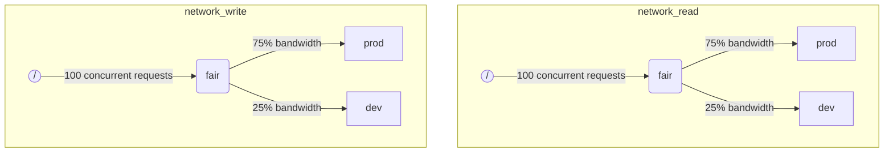

Когда ClickHouse выполняет несколько запросов одновременно, они могут использовать общие ресурсы (например, диски). Ограничения планирования и политики могут быть применены для регулирования использования и совместного использования ресурсов между различными нагрузками. Для каждого ресурса можно настроить иерархию планирования. Корень иерархии представляет ресурс, в то время как листья — это очереди, хранящие запросы, которые превышают ёмкость ресурса.

:::note
В настоящее время планирование [дискового ввода-вывода](#disk_config) и [CPU](#cpu_scheduling) можно осуществлять с помощью описанного метода. Для гибких ограничений по памяти смотрите [Переизбыток памяти](settings/memory-overcommit.md)
:::

## Конфигурация дисков {#disk_config}

Чтобы включить планирование ввода-вывода для конкретного диска, необходимо создать ресурсы чтения и записи для доступа WRITE и READ:

```sql
CREATE RESOURCE resource_name (WRITE DISK disk_name, READ DISK disk_name)
-- или
CREATE RESOURCE read_resource_name (WRITE DISK write_disk_name)
CREATE RESOURCE write_resource_name (READ DISK read_disk_name)
```

Ресурс может быть использован для любого количества дисков для READ или WRITE или для обоих. Есть синтаксис, позволяющий использовать ресурс для всех дисков:

```sql
CREATE RESOURCE all_io (READ ANY DISK, WRITE ANY DISK);
```

Альтернативный способ указать, какие диски используются ресурсом, — это конфигурация сервера `storage_configuration`:

:::warning
Планирование загрузок с использованием конфигурации ClickHouse устарело. Вместо этого следует использовать SQL-синтаксис.
:::

Чтобы включить планирование ввода-вывода для конкретного диска, необходимо указать `read_resource` и/или `write_resource` в конфигурации хранилища. Это указывает ClickHouse, какой ресурс должен использоваться для каждого запроса чтения и записи с данным диском. Ресурс чтения и записи могут ссылаться на одно и то же имя ресурса, что полезно для локальных SSD или HDD. Несколько различных дисков также могут ссылаться на один и тот же ресурс, что удобно для удалённых дисков: если вы хотите обеспечить справедливое распределение пропускной способности сети между, например, производственными и развивающимися нагрузками.

Пример:
```xml
<clickhouse>
    <storage_configuration>
        ...
        <disks>
            <s3>
                <type>s3</type>
                <endpoint>https://clickhouse-public-datasets.s3.amazonaws.com/my-bucket/root-path/</endpoint>
                <access_key_id>your_access_key_id</access_key_id>
                <secret_access_key>your_secret_access_key</secret_access_key>
                <read_resource>network_read</read_resource>
                <write_resource>network_write</write_resource>
            </s3>
        </disks>
        <policies>
            <s3_main>
                <volumes>
                    <main>
                        <disk>s3</disk>
                    </main>
                </volumes>
            </s3_main>
        </policies>
    </storage_configuration>
</clickhouse>
```

Обратите внимание, что параметры конфигурации сервера имеют приоритет над SQL-методом определения ресурсов.

## Разметка загрузки {#workload_markup}

Запросы могут быть размечены с помощью настройки `workload`, чтобы различать различные нагрузки. Если `workload` не установлен, используется значение "default". Обратите внимание, что вы можете указать другое значение, используя профили настроек. Ограничения настройки могут быть использованы, чтобы сделать `workload` постоянным, если вы хотите, чтобы все запросы от пользователя были размечены фиксированным значением настройки `workload`.

Также возможно назначить настройку `workload` для фоновой активности. Слияния и мутации используют настройки сервера `merge_workload` и `mutation_workload` соответственно. Эти значения также могут быть переопределены для конкретных таблиц с помощью настроек `merge_workload` и `mutation_workload` для Merge Tree.

Рассмотрим пример системы с двумя разными нагрузками: "production" и "development".

```sql
SELECT count() FROM my_table WHERE value = 42 SETTINGS workload = 'production'
SELECT count() FROM my_table WHERE value = 13 SETTINGS workload = 'development'
```

## Иерархия планирования ресурсов {#hierarchy}

С точки зрения подсистемы планирования ресурс представляет собой иерархию узлов планирования.



:::warning
Планирование загрузок с использованием конфигурации ClickHouse устарело. Вместо этого следует использовать SQL-синтаксис. SQL-синтаксис автоматически создает все необходимые узлы планирования, и следующее описание узлов планирования следует рассматривать как детали реализации нижнего уровня, доступные через таблицу [system.scheduler](/operations/system-tables/scheduler.md).
:::

**Возможные типы узлов:**
* `inflight_limit` (ограничение) - блокирует, если число одновременных запросов в работе превышает `max_requests`, или их общая стоимость превышает `max_cost`; должен иметь единственного дочернего узла.
* `bandwidth_limit` (ограничение) - блокирует, если текущая пропускная способность превышает `max_speed` (0 означает неограниченный) или всплеск превышает `max_burst` (по умолчанию равен `max_speed`); должен иметь единственного дочернего узла.
* `fair` (политика) - выбирает следующий запрос для обслуживания из одного из своих дочерних узлов в соответствии с max-min справедливостью; дочерние узлы могут указывать `weight` (по умолчанию 1).
* `priority` (политика) - выбирает следующий запрос для обслуживания из одного из своих дочерних узлов в соответствии со статическими приоритетами (меньшее значение означает более высокий приоритет); дочерние узлы могут указывать `priority` (по умолчанию 0).
* `fifo` (очередь) - лист иерархии, способный удерживать запросы, которые превышают ёмкость ресурса.

Чтобы иметь возможность использовать полную ёмкость основного ресурса, вы должны использовать `inflight_limit`. Обратите внимание, что низкое значение `max_requests` или `max_cost` может привести к не полной загрузке ресурса, в то время как слишком высокие значения могут привести к пустым очередям внутри планировщика, что, в свою очередь, приведет к игнорированию политик (несправедливости или игнорированию приоритетов) в поддереве. С другой стороны, если вы хотите защитить ресурсы от чрезмерной загрузки, вы должны использовать `bandwidth_limit`. Оно ограничивает, если количество потребляемых ресурсов в течение `duration` секунд превышает `max_burst + max_speed * duration` байт. Два узла `bandwidth_limit` на одном ресурсе могут быть использованы для ограничения пикового времени пропускной способности в течение коротких интервалов и усредненной пропускной способности для более длительных.

Следующий пример показывает, как определить иерархии планирования ввода-вывода, показанные на рисунке:

```xml
<clickhouse>
    <resources>
        <network_read>
            <node path="/">
                <type>inflight_limit</type>
                <max_requests>100</max_requests>
            </node>
            <node path="/fair">
                <type>fair</type>
            </node>
            <node path="/fair/prod">
                <type>fifo</type>
                <weight>3</weight>
            </node>
            <node path="/fair/dev">
                <type>fifo</type>
            </node>
        </network_read>
        <network_write>
            <node path="/">
                <type>inflight_limit</type>
                <max_requests>100</max_requests>
            </node>
            <node path="/fair">
                <type>fair</type>
            </node>
            <node path="/fair/prod">
                <type>fifo</type>
                <weight>3</weight>
            </node>
            <node path="/fair/dev">
                <type>fifo</type>
            </node>
        </network_write>
    </resources>
</clickhouse>
```

## Классификаторы загрузки {#workload_classifiers}

:::warning
Планирование загрузок с использованием конфигурации ClickHouse устарело. Вместо этого следует использовать SQL-синтаксис. Классификаторы создаются автоматически при использовании SQL-синтаксиса.
:::

Классификаторы загрузок используются для определения отображения из `workload`, указанного в запросе, в очереди-листья, которые должны использоваться для конкретных ресурсов. В данный момент классификация нагрузки проста: доступно только статическое отображение.

Пример:
```xml
<clickhouse>
    <workload_classifiers>
        <production>
            <network_read>/fair/prod</network_read>
            <network_write>/fair/prod</network_write>
        </production>
        <development>
            <network_read>/fair/dev</network_read>
            <network_write>/fair/dev</network_write>
        </development>
        <default>
            <network_read>/fair/dev</network_read>
            <network_write>/fair/dev</network_write>
        </default>
    </workload_classifiers>
</clickhouse>
```

## Иерархия загрузок {#workloads}

ClickHouse предоставляет удобный SQL-синтаксис для определения иерархии планирования. Все ресурсы, созданные с помощью `CREATE RESOURCE`, имеют одну и ту же структуру иерархии, но могут отличаться в некоторых аспектах. Каждая загрузка, созданная с помощью `CREATE WORKLOAD`, поддерживает несколько автоматически созданных узлов планирования для каждого ресурса. Дочерняя загрузка может быть создана внутри другой родительской загрузки. Вот пример, который определяет точно такую же иерархию, как и XML-конфигурация выше:

```sql
CREATE RESOURCE network_write (WRITE DISK s3)
CREATE RESOURCE network_read (READ DISK s3)
CREATE WORKLOAD all SETTINGS max_io_requests = 100
CREATE WORKLOAD development IN all
CREATE WORKLOAD production IN all SETTINGS weight = 3
```

Имя листовой загрузки без дочерних узлов может быть использовано в настройках запроса `SETTINGS workload = 'name'`.

Чтобы настроить загрузку можно использовать следующие настройки:
* `priority` - родственные нагрузки обслуживаются в соответствии со статическими значениями приоритета (меньшее значение означает более высокий приоритет).
* `weight` - родственные нагрузки с одинаковым статическим приоритетом делят ресурсы в соответствии с весами.
* `max_io_requests` - лимит на количество одновременных запросов ввода-вывода в этой нагрузке.
* `max_bytes_inflight` - лимит на общее количество байт в процессе выполнения для одновременных запросов в этой нагрузке.
* `max_bytes_per_second` - лимит на скорость чтения или записи байт для этой нагрузки.
* `max_burst_bytes` - максимальное количество байт, которые могут обрабатываться нагрузкой без ограничения (для каждого ресурса независимо).
* `max_concurrent_threads` - лимит на количество потоков для запросов в этой нагрузке.

Все ограничения, заданные через настройки нагрузки, независимы для каждого ресурса. Например, нагрузка с `max_bytes_per_second = 10485760` будет иметь лимит пропускной способности 10 МБ/с для каждого ресурса чтения и записи независимо. Если требуется общее ограничение для чтения и записи, рассмотрите возможность использования одного и того же ресурса для доступа READ и WRITE.

Нет возможности указать разные иерархии нагрузок для разных ресурсов. Но есть способ указать разные значения настройки нагрузки для конкретного ресурса:

```sql
CREATE OR REPLACE WORKLOAD all SETTINGS max_io_requests = 100, max_bytes_per_second = 1000000 FOR network_read, max_bytes_per_second = 2000000 FOR network_write
```

Также обратите внимание, что нагрузка или ресурс не могут быть удалены, если на них ссылается другая нагрузка. Чтобы обновить определение нагрузки используйте запрос `CREATE OR REPLACE WORKLOAD`.

:::note
Настройки нагрузки переводятся в соответствующий набор узлов планирования. Для более детальной информации смотрите описание узлов планирования [типов и опций](#hierarchy).
:::

## Планирование CPU {#cpu_scheduling}

Чтобы включить планирование CPU для нагрузок создайте ресурс CPU и установите лимит на количество одновременных потоков:

```sql
CREATE RESOURCE cpu (MASTER THREAD, WORKER THREAD)
CREATE WORKLOAD all SETTINGS max_concurrent_threads = 100
```

Когда сервер ClickHouse выполняет множество одновременных запросов с [несколькими потоками](/operations/settings/settings.md#max_threads) и все слоты CPU заняты, достигается перегруженное состояние. В перегруженном состоянии каждый освобожденный слот CPU переназначается в соответствующую нагрузку в соответствии с политиками планирования. Для запросов, разделяющих одну и ту же нагрузку, слоты выделяются по круговой системе. Для запросов в разных нагрузках слоты выделяются в соответствии с весами, приоритетами и лимитами, указанными для нагрузок.

Время CPU используется потоками, когда они не заблокированы и работают над ресурсозатратными задачами. Для целей планирования различают два типа потоков:
* Мастером поток — первый поток, который начинает работать над запросом или фоновой деятельностью, такой как слияние или мутация.
* Рабочий поток — дополнительные потоки, которые мастер может запускать для выполнения ресурсовоздействующих задач.

Может быть целесообразно использовать отдельные ресурсы для мастер- и рабочих потоков, чтобы добиться лучшей отзывчивости. Высокое количество рабочих потоков может легко монополизировать ресурс CPU, когда используются высокие значения установки `max_threads` для запросов. В этом случае входящие запросы должны блокироваться и ждать слот CPU для начала выполнения их мастер-потока. Чтобы избежать этого, можно использовать следующую конфигурацию:

```sql
CREATE RESOURCE worker_cpu (WORKER THREAD)
CREATE RESOURCE master_cpu (MASTER THREAD)
CREATE WORKLOAD all SETTINGS max_concurrent_threads = 100 FOR worker_cpu, max_concurrent_threads = 1000 FOR master_cpu
```

Это создаст отдельные лимиты для мастер- и рабочих потоков. Даже если все 100 слотов рабочей CPU заняты, новые запросы не будут заблокированы, пока не появятся доступные слоты мастер CPU. Они начнут выполняться с одного потока. Позже, если слоты рабочего CPU станут доступны, такие запросы смогут увеличить количество своих рабочих потоков. С другой стороны, такой подход не связывает общее количество слотов с количеством процессоров CPU, и запуск слишком большого количества одновременных потоков повлияет на производительность.

Ограничение конкуренции мастер-потоков не ограничит количество одновременных запросов. Слоты CPU могут быть освобождены в середине выполнения запроса и вновь захвачены другими потоками. Например, 4 одновременных запроса с лимитом 2 одновременных мастер-потока могут все выполняться параллельно. В этом случае каждый запрос получит 50% ресурса CPU. Отдельная логика должна быть использована для ограничения количества одновременных запросов, и в настоящее время это не поддерживается для нагрузок.

Можно использовать отдельные лимиты конкуренции потоков для нагрузок:

```sql
CREATE RESOURCE cpu (MASTER THREAD, WORKER THREAD)
CREATE WORKLOAD all
CREATE WORKLOAD admin IN all SETTINGS max_concurrent_threads = 10
CREATE WORKLOAD production IN all SETTINGS max_concurrent_threads = 100
CREATE WORKLOAD analytics IN production SETTINGS max_concurrent_threads = 60, weight = 9
CREATE WORKLOAD ingestion IN production
```

Этот пример конфигурации обеспечивает независимые пуллы слотов CPU для администраторов и производства. Пуллы для производства делятся между аналитикой и загрузкой данных. Более того, если пул производства оказывается перегруженным, 9 из 10 освобожденных слотов будут переназначены для аналитических запросов, если это необходимо. Запросы на загрузку данных получат только 1 из 10 слотов в периоды перегрузки. Это может улучшить задержку запросов, обращенных к пользователям. Аналитика имеет свой собственный лимит в 60 одновременных потоках, всегда оставляя по крайней мере 40 потоков для поддержки загрузки данных. Когда нет перегрузок, загрузка может использовать все 100 потоков.

Чтобы исключить запрос из планирования CPU, установите настройку запроса [use_concurrency_control](/operations/settings/settings.md/#use_concurrency_control) в 0.

Планирование CPU еще не поддерживается для слияний и мутаций.

:::warning
Планирование слотов предоставляет способ контролировать [конкуренцию запросов](/operations/settings/settings.md#max_threads), но пока не гарантирует справедливое распределение времени CPU. Для этого требуется дальнейшая разработка предварительного выбора слотов CPU и эта функция будет поддерживаться позже.
:::

:::note
Объявление ресурса CPU отключает действие [`concurrent_threads_soft_limit_num`](server-configuration-parameters/settings.md#concurrent_threads_soft_limit_num) и [`concurrent_threads_soft_limit_ratio_to_cores`](server-configuration-parameters/settings.md#concurrent_threads_soft_limit_ratio_to_cores) настроек. Вместо этого настройка нагрузки `max_concurrent_threads` используется для ограничения числа CPU, выделенных для конкретной нагрузки. Чтобы добиться прежнего поведения создайте только ресурс WORKER THREAD, установите `max_concurrent_threads` для нагрузки `all` на то же значение, что и `concurrent_threads_soft_limit_num`, и используйте настройку запроса `workload = "all"`. Эта конфигурация соответствует настройке [`concurrent_threads_scheduler`](server-configuration-parameters/settings.md#concurrent_threads_scheduler) с установленным значением "fair_round_robin".
:::

## Хранение нагрузок и ресурсов {#workload_entity_storage}
Определения всех нагрузок и ресурсов в форме запросов `CREATE WORKLOAD` и `CREATE RESOURCE` хранятся постоянно либо на диске по пути `workload_path`, либо в ZooKeeper по пути `workload_zookeeper_path`. Рекомендуется использовать хранилище ZooKeeper для достижения согласованности между узлами. В качестве альтернативы можно использовать условие `ON CLUSTER` вместе с дисковым хранилищем.

## Строгий доступ к ресурсам {#strict_resource_access}
Чтобы заставить все запросы следовать политикам планирования ресурсов, существует настройка сервера `throw_on_unknown_workload`. Если она установлена в `true`, то каждый запрос должен использовать действительную настройку запроса `workload`, в противном случае возникает исключение `RESOURCE_ACCESS_DENIED`. Если она установлена в `false`, то такой запрос не использует планировщик ресурсов, т.е. он получит неограниченный доступ к любому `RESOURCE`.

:::note
Не устанавливайте `throw_on_unknown_workload` в `true`, если не выполнена команда `CREATE WORKLOAD default`. Это может привести к проблемам при запуске сервера, если запрос без явной настройки `workload` исполняется во время запуска.
:::

## См. также {#see-also}
 - [system.scheduler](/operations/system-tables/scheduler.md)
 - [system.workloads](/operations/system-tables/workloads.md)
 - [system.resources](/operations/system-tables/resources.md)
 - [merge_workload](/operations/settings/merge-tree-settings.md#merge_workload) настройка слияния
 - [merge_workload](/operations/server-configuration-parameters/settings.md#merge_workload) глобальная серверная настройка
 - [mutation_workload](/operations/settings/merge-tree-settings.md#mutation_workload) настройка мутации
 - [mutation_workload](/operations/server-configuration-parameters/settings.md#mutation_workload) глобальная серверная настройка
 - [workload_path](/operations/server-configuration-parameters/settings.md#workload_path) глобальная серверная настройка
 - [workload_zookeeper_path](/operations/server-configuration-parameters/settings.md#workload_zookeeper_path) глобальная серверная настройка
