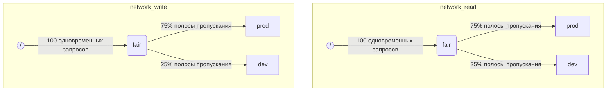

Когда ClickHouse выполняет несколько запросов одновременно, они могут использовать общие ресурсы (например, диски и ядра CPU). Для регулирования того, как ресурсы используются и разделяются между различными рабочими нагрузками, могут быть применены ограничения и политики планирования. Для всех ресурсов может быть настроена общая иерархия планирования. Корень иерархии представляет общие ресурсы, а листья — конкретные рабочие нагрузки, в которых накапливаются запросы, превышающие доступную емкость ресурсов.

:::note
В настоящее время [операции ввода-вывода на удалённых дисках](#disk_config) и [CPU](#cpu_scheduling) могут планироваться описанным методом. Для гибкой настройки ограничений по памяти см. [Memory overcommit](settings/memory-overcommit.md)
:::

## Конфигурация диска {#disk_config}

Чтобы включить планирование нагрузки ввода-вывода (I/O) для конкретного диска, необходимо создать ресурсы чтения (READ) и записи (WRITE):

```sql
CREATE RESOURCE resource_name (WRITE DISK disk_name, READ DISK disk_name)
-- or
CREATE RESOURCE read_resource_name (WRITE DISK write_disk_name)
CREATE RESOURCE write_resource_name (READ DISK read_disk_name)
```

Ресурс может быть использован для произвольного числа дисков — только для READ, только для WRITE или одновременно для READ и WRITE. Также предусмотрен синтаксис, позволяющий использовать ресурс для всех дисков:

```sql
CREATE RESOURCE all_io (READ ANY DISK, WRITE ANY DISK);
```

Альтернативный способ указать, какие диски используются ресурсом, — это `storage_configuration` сервера:

:::warning
Планирование нагрузок с использованием конфигурации ClickHouse устарело. Вместо этого следует использовать SQL-синтаксис.
:::

Чтобы включить планирование операций ввода-вывода (I/O) для конкретного диска, необходимо указать `read_resource` и/или `write_resource` в конфигурации хранилища. Это сообщает ClickHouse, какой ресурс должен использоваться для каждого запроса на чтение и запись с данным диском. Ресурсы чтения и записи могут ссылаться на один и тот же ресурс, что полезно для локальных SSD или HDD. Несколько разных дисков также могут ссылаться на один и тот же ресурс, что полезно для удалённых дисков, если вы хотите обеспечить справедливое распределение сетевой пропускной способности между, например, «production»‑ и «development»‑нагрузками.

Пример:

```xml
<clickhouse>
    <storage_configuration>
        ...
        <disks>
            <s3>
                <type>s3</type>
                <endpoint>https://clickhouse-public-datasets.s3.amazonaws.com/my-bucket/root-path/</endpoint>
                <access_key_id>your_access_key_id</access_key_id>
                <secret_access_key>your_secret_access_key</secret_access_key>
                <read_resource>network_read</read_resource>
                <write_resource>network_write</write_resource>
            </s3>
        </disks>
        <policies>
            <s3_main>
                <volumes>
                    <main>
                        <disk>s3</disk>
                    </main>
                </volumes>
            </s3_main>
        </policies>
    </storage_configuration>
</clickhouse>
```

Обратите внимание, что параметры конфигурации сервера имеют приоритет по сравнению с определением ресурсов с помощью SQL.

## Разметка рабочих нагрузок {#workload_markup}

Запросы могут быть помечены с помощью настройки `workload`, чтобы различать различные рабочие нагрузки. Если `workload` не задан, используется значение «default». Обратите внимание, что вы можете указать другое значение с помощью профилей настроек. Ограничения настроек можно использовать, чтобы сделать значение `workload` постоянным, если вы хотите, чтобы все запросы пользователя помечались фиксированным значением настройки `workload`.

Можно задать настройку `workload` и для фоновой активности. Слияния и мутации используют, соответственно, серверные настройки `merge_workload` и `mutation_workload`. Эти значения также могут быть переопределены для конкретных таблиц с помощью настроек MergeTree `merge_workload` и `mutation_workload`.

Рассмотрим пример системы с двумя различными рабочими нагрузками: «production» и «development».

```sql
SELECT count() FROM my_table WHERE value = 42 SETTINGS workload = 'production'
SELECT count() FROM my_table WHERE value = 13 SETTINGS workload = 'development'
```

## Иерархия планирования ресурсов {#hierarchy}

С точки зрения подсистемы планирования ресурс рассматривается как иерархия узлов планирования.



:::warning
Планирование рабочих нагрузок с использованием конфигурации clickhouse устарело. Вместо этого следует использовать SQL-синтаксис. SQL-синтаксис автоматически создаёт все необходимые узлы планирования, а приведённое ниже описание узлов планирования следует рассматривать как детали низкоуровневой реализации, доступные через таблицу [system.scheduler](/operations/system-tables/scheduler.md).
:::

**Возможные типы узлов:**

* `inflight_limit` (constraint) — блокирует, если количество одновременно выполняемых запросов превышает `max_requests` или их суммарная стоимость превышает `max_cost`; должен иметь одного потомка.
* `bandwidth_limit` (constraint) — блокирует, если текущая пропускная способность превышает `max_speed` (0 означает отсутствие ограничений) или всплеск превышает `max_burst` (по умолчанию равно `max_speed`); должен иметь одного потомка.
* `fair` (policy) — выбирает следующий запрос на обработку из одного из дочерних узлов в соответствии с max-min fairness; дочерние узлы могут указывать `weight` (по умолчанию 1).
* `priority` (policy) — выбирает следующий запрос на обработку из одного из дочерних узлов в соответствии со статическими приоритетами (меньшее значение означает более высокий приоритет); дочерние узлы могут указывать `priority` (по умолчанию 0).
* `fifo` (queue) — лист иерархии, способный удерживать запросы, которые превышают ёмкость ресурса.

Чтобы иметь возможность использовать полную ёмкость базового ресурса, следует использовать `inflight_limit`. Обратите внимание, что слишком маленькое значение `max_requests` или `max_cost` может привести к неполному использованию ресурса, тогда как слишком большие значения могут привести к пустым очередям внутри планировщика, что, в свою очередь, приведёт к игнорированию политик (несправедливости или игнорированию приоритетов) в поддереве. С другой стороны, если вы хотите защитить ресурсы от чрезмерного использования, следует использовать `bandwidth_limit`. Он ограничивает скорость, когда объём ресурса, потреблённый за `duration` секунд, превышает `max_burst + max_speed * duration` байт. Два узла `bandwidth_limit` для одного и того же ресурса могут использоваться для ограничения пикового потребления ресурса на коротких интервалах и среднего потребления на более длинных.

Следующий пример показывает, как определить иерархии планирования ввода-вывода (IO), показанные на рисунке:

```xml
<clickhouse>
    <resources>
        <network_read>
            <node path="/">
                <type>inflight_limit</type>
                <max_requests>100</max_requests>
            </node>
            <node path="/fair">
                <type>fair</type>
            </node>
            <node path="/fair/prod">
                <type>fifo</type>
                <weight>3</weight>
            </node>
            <node path="/fair/dev">
                <type>fifo</type>
            </node>
        </network_read>
        <network_write>
            <node path="/">
                <type>inflight_limit</type>
                <max_requests>100</max_requests>
            </node>
            <node path="/fair">
                <type>fair</type>
            </node>
            <node path="/fair/prod">
                <type>fifo</type>
                <weight>3</weight>
            </node>
            <node path="/fair/dev">
                <type>fifo</type>
            </node>
        </network_write>
    </resources>
</clickhouse>
```

## Классификаторы рабочих нагрузок {#workload_classifiers}

:::warning
Планирование рабочих нагрузок с использованием конфигурации ClickHouse устарело. Вместо этого следует использовать SQL-синтаксис. При использовании SQL-синтаксиса классификаторы создаются автоматически.
:::

Классификаторы рабочих нагрузок используются для определения сопоставления `workload`, указанной в запросе, с листовыми очередями (leaf-queues), которые должны использоваться для конкретных ресурсов. В данный момент классификация рабочих нагрузок проста: доступно только статическое сопоставление.

Пример:

```xml
<clickhouse>
    <workload_classifiers>
        <production>
            <network_read>/fair/prod</network_read>
            <network_write>/fair/prod</network_write>
        </production>
        <development>
            <network_read>/fair/dev</network_read>
            <network_write>/fair/dev</network_write>
        </development>
        <default>
            <network_read>/fair/dev</network_read>
            <network_write>/fair/dev</network_write>
        </default>
    </workload_classifiers>
</clickhouse>
```

## Иерархия рабочих нагрузок {#workloads}

ClickHouse предоставляет удобный синтаксис SQL для определения иерархии планирования. Все ресурсы, созданные с помощью `CREATE RESOURCE`, используют одну и ту же структуру иерархии, но могут отличаться в некоторых аспектах. Для каждой рабочей нагрузки, созданной с помощью `CREATE WORKLOAD`, автоматически создаётся несколько узлов планирования для каждого ресурса. Дочернюю рабочую нагрузку можно создать внутри другой, родительской рабочей нагрузки. Ниже приведён пример, который определяет точно такую же иерархию, как и XML‑конфигурация выше:

```sql
CREATE RESOURCE network_write (WRITE DISK s3)
CREATE RESOURCE network_read (READ DISK s3)
CREATE WORKLOAD all SETTINGS max_io_requests = 100
CREATE WORKLOAD development IN all
CREATE WORKLOAD production IN all SETTINGS weight = 3
```

Имя листовой рабочей нагрузки без дочерних элементов может быть использовано в настройках запроса `SETTINGS workload = 'name'`.

Для настройки рабочей нагрузки могут быть использованы следующие параметры:

* `priority` — одноуровневые рабочие нагрузки обслуживаются в соответствии со статическими значениями приоритета (меньшее значение означает более высокий приоритет).
* `weight` — одноуровневые рабочие нагрузки с одинаковым статическим приоритетом делят ресурсы пропорционально весам.
* `max_io_requests` — ограничение на количество одновременных I/O-запросов в этой рабочей нагрузке.
* `max_bytes_inflight` — ограничение на общее количество байт «в полёте» для параллельных запросов в этой рабочей нагрузке.
* `max_bytes_per_second` — ограничение на скорость чтения или записи данных (в байтах в секунду) для этой рабочей нагрузки.
* `max_burst_bytes` — максимальное количество байт, которое может быть обработано рабочей нагрузкой без ограничения пропускной способности (независимо для каждого ресурса).
* `max_concurrent_threads` — ограничение на количество потоков для запросов в этой рабочей нагрузке.
* `max_concurrent_threads_ratio_to_cores` — то же, что и `max_concurrent_threads`, но нормализовано относительно количества доступных ядер CPU.
* `max_cpus` — ограничение на количество ядер CPU, используемых для обслуживания запросов в этой рабочей нагрузке.
* `max_cpu_share` — то же, что и `max_cpus`, но нормализовано относительно количества доступных ядер CPU.
* `max_burst_cpu_seconds` — максимальное количество CPU-секунд, которое может быть потреблено рабочей нагрузкой без ограничения из-за `max_cpus`.

Все ограничения, задаваемые через настройки рабочей нагрузки, независимы для каждого ресурса. Например, рабочая нагрузка с `max_bytes_per_second = 10485760` будет иметь ограничение пропускной способности 10 МБ/с для каждого ресурса чтения и записи независимо. Если требуется общее ограничение для чтения и записи, рассмотрите возможность использования одного и того же ресурса для доступа READ и WRITE.

Невозможно задать разные иерархии рабочих нагрузок для разных ресурсов. Но можно задать иное значение настройки рабочей нагрузки для конкретного ресурса:

```sql
CREATE OR REPLACE WORKLOAD all SETTINGS max_io_requests = 100, max_bytes_per_second = 1000000 FOR network_read, max_bytes_per_second = 2000000 FOR network_write
```

Также обратите внимание, что рабочая нагрузка или ресурс не могут быть удалены, если на них ссылается другая рабочая нагрузка. Чтобы обновить определение рабочей нагрузки, используйте запрос `CREATE OR REPLACE WORKLOAD`.

:::note
Параметры рабочей нагрузки преобразуются в соответствующий набор узлов планировщика. За более низкоуровневыми деталями обратитесь к описанию [типов и параметров](#hierarchy) узлов планировщика.
:::

## Планирование CPU {#cpu_scheduling}

Чтобы включить планирование CPU для рабочих нагрузок, создайте ресурс CPU и установите ограничение на количество одновременно выполняемых потоков:

```sql
CREATE RESOURCE cpu (MASTER THREAD, WORKER THREAD)
CREATE WORKLOAD all SETTINGS max_concurrent_threads = 100
```

Когда сервер ClickHouse выполняет множество параллельных запросов с [несколькими потоками](/operations/settings/settings.md#max_threads) и все CPU-слоты заняты, наступает состояние перегрузки. В состоянии перегрузки каждый освободившийся CPU-слот переназначается на соответствующую нагрузку в соответствии с политиками планирования. Для запросов, относящихся к одной и той же нагрузке, слоты выделяются по принципу round-robin. Для запросов в отдельных нагрузках слоты выделяются в соответствии с весами, приоритетами и лимитами, заданными для нагрузок.

Процессорное время потребляется потоками, когда они не заблокированы и выполняют CPU-интенсивные задачи. Для целей планирования различают два вида потоков:

* master-поток — первый поток, который начинает обработку запроса или фоновой активности, такой как слияние или мутация.
* worker-поток — дополнительные потоки, которые master может порождать для выполнения CPU-интенсивных задач.

Может быть целесообразно использовать отдельные ресурсы для master- и worker-потоков, чтобы повысить отзывчивость системы. Большое количество worker-потоков может легко монополизировать ресурсы CPU при использовании высоких значений настройки запроса `max_threads`. В этом случае входящие запросы будут блокироваться и ожидать CPU-слот для своего master-потока, чтобы начать выполнение. Чтобы избежать этого, можно использовать следующую конфигурацию:

```sql
CREATE RESOURCE worker_cpu (WORKER THREAD)
CREATE RESOURCE master_cpu (MASTER THREAD)
CREATE WORKLOAD all SETTINGS max_concurrent_threads = 100 FOR worker_cpu, max_concurrent_threads = 1000 FOR master_cpu
```

Будут созданы раздельные лимиты для мастер‑потоков и рабочих потоков. Даже если все 100 рабочих CPU‑слотов заняты, новые запросы не будут блокироваться, пока есть доступные мастер‑CPU‑слоты. Они начнут выполняться в одном потоке. Позже, когда освободятся рабочие CPU‑слоты, такие запросы смогут масштабироваться и порождать свои рабочие потоки. С другой стороны, такой подход не привязывает общее количество слотов к числу CPU‑процессоров, и запуск слишком большого числа параллельных потоков негативно скажется на производительности.

Ограничение параллелизма мастер‑потоков не будет ограничивать число одновременных запросов. CPU‑слоты могут освобождаться в середине выполнения запроса и повторно запрашиваться другими потоками. Например, 4 одновременных запроса с лимитом в 2 параллельных мастер‑потока всё равно могут выполняться параллельно. В этом случае каждый запрос будет получать 50% CPU‑процессора. Для ограничения числа одновременных запросов должна использоваться отдельная логика, и в текущей версии она не поддерживается для рабочих нагрузок.

Отдельные лимиты параллелизма потоков могут использоваться для рабочих нагрузок:

```sql
CREATE RESOURCE cpu (MASTER THREAD, WORKER THREAD)
CREATE WORKLOAD all
CREATE WORKLOAD admin IN all SETTINGS max_concurrent_threads = 10
CREATE WORKLOAD production IN all SETTINGS max_concurrent_threads = 100
CREATE WORKLOAD analytics IN production SETTINGS max_concurrent_threads = 60, weight = 9
CREATE WORKLOAD ингестия IN production
```

В этом примере конфигурации задаются независимые пулы CPU-слотов для административной и продуктивной нагрузок. Продуктивный пул разделяется между аналитикой и ингестией. Кроме того, если продуктивный пул перегружен, 9 из 10 освобождённых слотов будут при необходимости переназначены аналитическим запросам. Запросы ингестии в периоды перегрузки получат только 1 из 10 слотов. Это может улучшить время отклика пользовательских запросов. Аналитика имеет собственный лимит в 60 параллельных потоков, что всегда оставляет как минимум 40 потоков для поддержки ингестии. При отсутствии перегрузки ингестия может использовать все 100 потоков.

Чтобы исключить запрос из планирования по CPU, установите настройку запроса [use&#95;concurrency&#95;control](/operations/settings/settings.md/#use_concurrency_control) в значение 0.

Планирование по CPU пока не поддерживается для слияний (merges) и мутаций.

Для справедливого распределения ресурсов между типами нагрузки необходимо выполнять вытеснение (preemption) и масштабирование вниз (down-scaling) во время выполнения запроса. Вытеснение включается серверной настройкой `cpu_slot_preemption`. Если она включена, каждый поток периодически обновляет (продлевает) свой CPU-слот (в соответствии с серверной настройкой `cpu_slot_quantum_ns`). Такое обновление может блокировать выполнение, если CPU перегружен. Когда выполнение блокируется на продолжительное время (см. серверную настройку `cpu_slot_preemption_timeout_ms`), запрос масштабируется вниз, и количество одновременно работающих потоков динамически уменьшается. Обратите внимание, что справедливость по времени CPU гарантируется между типами нагрузок, но между запросами внутри одного типа нагрузки в некоторых крайних случаях она может нарушаться.

:::warning
Планирование слотов предоставляет способ управлять [конкурентностью запросов](/operations/settings/settings.md#max_threads), но не гарантирует справедливое распределение CPU-времени, за исключением случая, когда серверная настройка `cpu_slot_preemption` установлена в `true`. В противном случае справедливость обеспечивается на основе количества выделенных CPU-слотов между конкурирующими типами нагрузок. Это не подразумевает равное количество секунд CPU, потому что без вытеснения CPU-слот может удерживаться неограниченно долго. Поток захватывает слот в начале и освобождает его, когда работа завершена.
:::

:::note
Объявление ресурса CPU отключает действие настроек [`concurrent_threads_soft_limit_num`](server-configuration-parameters/settings.md#concurrent_threads_soft_limit_num) и [`concurrent_threads_soft_limit_ratio_to_cores`](server-configuration-parameters/settings.md#concurrent_threads_soft_limit_ratio_to_cores). Вместо этого для ограничения количества CPU, выделенных для конкретной рабочей нагрузки, используется настройка рабочей нагрузки `max_concurrent_threads`. Чтобы добиться прежнего поведения, создайте только ресурс WORKER THREAD, установите `max_concurrent_threads` для рабочей нагрузки `all` равным тому же значению, что и `concurrent_threads_soft_limit_num`, и используйте настройку запроса `workload = "all"`. Эта конфигурация соответствует настройке [`concurrent_threads_scheduler`](server-configuration-parameters/settings.md#concurrent_threads_scheduler) со значением «fair_round_robin».
:::

## Потоки и CPU {#threads_vs_cpus}

Существует два способа контролировать потребление CPU рабочей нагрузкой:

* Лимит количества потоков: `max_concurrent_threads` и `max_concurrent_threads_ratio_to_cores`
* Ограничение CPU (throttling): `max_cpus`, `max_cpu_share` и `max_burst_cpu_seconds`

Первый способ позволяет динамически управлять количеством потоков, создаваемых для запроса, в зависимости от текущей загрузки сервера. Фактически он снижает значение, задаваемое настройкой запроса `max_threads`. Второй способ ограничивает потребление CPU рабочей нагрузкой с помощью алгоритма token bucket. Он не влияет напрямую на количество потоков, но ограничивает суммарное потребление CPU всеми потоками в рабочей нагрузке.

Ограничение по token bucket с `max_cpus` и `max_burst_cpu_seconds` означает следующее. В течение любого интервала длительностью `delta` секунд суммарное потребление CPU всеми запросами в рабочей нагрузке не может превышать `max_cpus * delta + max_burst_cpu_seconds` процессорных секунд. Это ограничивает среднее потребление значением `max_cpus` в долгосрочной перспективе, но в краткосрочной перспективе этот лимит может быть превышен. Например, при `max_burst_cpu_seconds = 60` и `max_cpus=0.001` допускается запуск либо одного потока на 60 секунд, либо двух потоков на 30 секунд, либо 60 потоков на 1 секунду без применения ограничения. Значение по умолчанию для `max_burst_cpu_seconds` — 1 секунда. Более низкие значения могут привести к недоиспользованию разрешённых ядер `max_cpus` при большом количестве параллельных потоков.

:::warning
Настройки ограничения CPU активны только если включена серверная настройка `cpu_slot_preemption`, в противном случае они игнорируются.
:::

Удерживая слот CPU, поток может находиться в одном из трёх основных состояний:

* **Running:** Фактически потребляет ресурс CPU. Время, проведённое в этом состоянии, учитывается механизмом ограничения CPU.
* **Ready:** Ожидает, пока станет доступен CPU. Не учитывается механизмом ограничения CPU.
* **Blocked:** Выполняет IO‑операции или другие блокирующие системные вызовы (например, ожидание мьютекса). Не учитывается механизмом ограничения CPU.

Рассмотрим пример конфигурации, которая сочетает в себе и ограничение CPU, и лимиты на количество потоков:

```sql
CREATE RESOURCE cpu (MASTER THREAD, WORKER THREAD)
CREATE WORKLOAD all SETTINGS max_concurrent_threads_ratio_to_cores = 2
CREATE WORKLOAD admin IN all SETTINGS max_concurrent_threads = 2, priority = -1
CREATE WORKLOAD production IN all SETTINGS weight = 4
CREATE WORKLOAD analytics IN production SETTINGS max_cpu_share = 0.7, weight = 3
CREATE WORKLOAD ingestion IN production
CREATE WORKLOAD development IN all SETTINGS max_cpu_share = 0.3
```

Здесь мы ограничиваем общее количество потоков для всех запросов значением, вдвое превышающим число доступных CPU. Нагрузка администратора ограничена максимум двумя потоками, независимо от количества доступных CPU. Администратор имеет приоритет -1 (ниже стандартного 0) и при необходимости получает любой слот CPU в первую очередь. Когда администратор не выполняет запросы, ресурсы CPU делятся между рабочими нагрузками production и development. Гарантированные доли времени CPU основаны на весах (4 к 1): как минимум 80% выделяется под production (если требуется) и как минимум 20% — под development (если требуется). Веса задают гарантии, а ограничение CPU (throttling) формирует пределы: production не ограничен и может потреблять 100%, в то время как у development есть лимит 30%, который применяется даже при отсутствии запросов от других нагрузок. Нагрузка production не является конечным узлом (leaf), поэтому её ресурсы делятся между analytics и ингестией в соответствии с весами (3 к 1). Это означает, что analytics имеет гарантию как минимум 0.8 * 0.75 = 60% и, на основе `max_cpu_share`, имеет лимит в 70% от общих ресурсов CPU. В то время как у ингестии остаётся гарантия как минимум 0.8 * 0.25 = 20%, верхнего предела для неё нет.

:::note
Если вы хотите максимизировать использование CPU на сервере ClickHouse, избегайте использования `max_cpus` и `max_cpu_share` для корневой рабочей нагрузки `all`. Вместо этого задайте более высокое значение для `max_concurrent_threads`. Например, на системе с 8 CPU установите `max_concurrent_threads = 16`. Это позволит 8 потокам выполнять задачи, нагружающие CPU, в то время как другие 8 потоков будут обрабатывать операции ввода-вывода (I/O). Дополнительные потоки создадут нагрузку на CPU, обеспечив применение правил планирования. Напротив, установка `max_cpus = 8` никогда не создаст нагрузку на CPU, потому что сервер не может превысить доступные 8 CPU.
:::

## Планирование слотов для запросов {#query_scheduling}

Чтобы включить планирование слотов для запросов для рабочих нагрузок, создайте ресурс типа QUERY и задайте ограничение на количество одновременных запросов или запросов в секунду:

```sql
CREATE RESOURCE query (QUERY)
CREATE WORKLOAD all SETTINGS max_concurrent_queries = 100, max_queries_per_second = 10, max_burst_queries = 20
```

Настройка рабочей нагрузки `max_concurrent_queries` ограничивает количество одновременных запросов, которые могут выполняться для данной рабочей нагрузки. Это аналог настроек запроса [`max_concurrent_queries_for_all_users`](/operations/settings/settings#max_concurrent_queries_for_all_users) и сервера [max&#95;concurrent&#95;queries](/operations/server-configuration-parameters/settings#max_concurrent_queries). Асинхронные запросы на вставку и некоторые специфические запросы, такие как KILL, не учитываются в этом лимите.

Настройки рабочей нагрузки `max_queries_per_second` и `max_burst_queries` ограничивают количество запросов для этой рабочей нагрузки с помощью алгоритма «token bucket» (ведро с токенами). Они гарантируют, что в любой временной интервал `T` не начнёт выполняться более чем `max_queries_per_second * T + max_burst_queries` новых запросов.

Настройка рабочей нагрузки `max_waiting_queries` ограничивает количество ожидающих запросов для этой рабочей нагрузки. Когда лимит достигнут, сервер возвращает ошибку `SERVER_OVERLOADED`.

:::note
Заблокированные запросы будут ожидать неограниченное время и не появятся в `SHOW PROCESSLIST`, пока все ограничения не будут соблюдены.
:::

## Хранение рабочих нагрузок и ресурсов {#workload_entity_storage}

Определения всех рабочих нагрузок и ресурсов в виде запросов `CREATE WORKLOAD` и `CREATE RESOURCE` сохраняются на постоянной основе либо на диске по пути `workload_path`, либо в ZooKeeper по пути `workload_zookeeper_path`. Для обеспечения согласованности между узлами рекомендуется хранение в ZooKeeper. В качестве альтернативы можно использовать клаузу `ON CLUSTER` совместно с хранением на диске.

## Рабочие нагрузки и ресурсы, задаваемые в конфигурации {#config_based_workloads}

Помимо SQL-определений, рабочие нагрузки и ресурсы могут быть заранее заданы в конфигурационном файле сервера. Это полезно в облачных средах, где часть ограничений определяется инфраструктурой, тогда как другие могут изменяться клиентами. Сущности, определённые в конфигурации, имеют приоритет над сущностями, определёнными с помощью SQL, и не могут быть изменены или удалены с помощью SQL-команд.

### Формат конфигурации {#config_based_workloads_format}

```xml
<clickhouse>
    <resources_and_workloads>
        RESOURCE s3disk_read (READ DISK s3);
        RESOURCE s3disk_write (WRITE DISK s3);
        WORKLOAD all SETTINGS max_io_requests = 500 FOR s3disk_read, max_io_requests = 1000 FOR s3disk_write, max_bytes_per_second = 1342177280 FOR s3disk_read, max_bytes_per_second = 3355443200 FOR s3disk_write;
        WORKLOAD production IN all SETTINGS weight = 3;
    </resources_and_workloads>
</clickhouse>
```

Конфигурация использует тот же SQL-синтаксис, что и операторы `CREATE WORKLOAD` и `CREATE RESOURCE`. Все запросы должны быть корректными.

### Рекомендации по использованию {#config_based_workloads_usage_recommendations}

Для облачных сред типичная конфигурация может включать:

1. Определите корневую рабочую нагрузку (workload) и ресурсы сетевого ввода-вывода в конфигурации, чтобы задать инфраструктурные лимиты
2. Установите `throw_on_unknown_workload`, чтобы обеспечить соблюдение этих лимитов
3. Создайте `CREATE WORKLOAD default IN all`, чтобы автоматически применять лимиты ко всем запросам (поскольку значение по умолчанию для настройки запроса `workload` — &#39;default&#39;)
4. Разрешите пользователям создавать дополнительные рабочие нагрузки в рамках настроенной иерархии

Это гарантирует, что все фоновые операции и запросы учитывают ограничения инфраструктуры, при этом сохраняя гибкость для пользовательских политик планирования.

Другой сценарий использования — различная конфигурация для разных узлов в гетерогенном кластере.

## Строгий доступ к ресурсам {#strict_resource_access}

Для принудительного применения политик планирования ресурсов ко всем запросам существует серверная настройка `throw_on_unknown_workload`. Если она установлена в `true`, каждый запрос обязан использовать корректную настройку запроса `workload`, в противном случае будет сгенерировано исключение `RESOURCE_ACCESS_DENIED`. Если она установлена в `false`, такой запрос не использует планировщик ресурсов, т.е. получает неограниченный доступ к любому `RESOURCE`. Настройка запроса `use_concurrency_control = 0` позволяет запросу обойти планировщик CPU и получить неограниченный доступ к CPU. Чтобы обеспечить планирование по CPU, создайте ограничение настройки, которое зафиксирует для `use_concurrency_control` константное значение только для чтения.

:::note
Не устанавливайте `throw_on_unknown_workload` в `true`, пока не будет выполнена команда `CREATE WORKLOAD default`. Это может привести к проблемам при запуске сервера, если во время старта будет выполнен запрос без явной настройки `workload`.
:::

## См. также {#see-also}
- [system.scheduler](/operations/system-tables/scheduler.md)
- [system.workloads](/operations/system-tables/workloads.md)
- [system.resources](/operations/system-tables/resources.md)
- [merge_workload](/operations/settings/merge-tree-settings.md#merge_workload) настройка MergeTree
- [merge_workload](/operations/server-configuration-parameters/settings.md#merge_workload) глобальная настройка сервера
- [mutation_workload](/operations/settings/merge-tree-settings.md#mutation_workload) настройка MergeTree
- [mutation_workload](/operations/server-configuration-parameters/settings.md#mutation_workload) глобальная настройка сервера
- [workload_path](/operations/server-configuration-parameters/settings.md#workload_path) глобальная настройка сервера
- [workload_zookeeper_path](/operations/server-configuration-parameters/settings.md#workload_zookeeper_path) глобальная настройка сервера
- [cpu_slot_preemption](/operations/server-configuration-parameters/settings.md#cpu_slot_preemption) глобальная настройка сервера
- [cpu_slot_quantum_ns](/operations/server-configuration-parameters/settings.md#cpu_slot_quantum_ns) глобальная настройка сервера
- [cpu_slot_preemption_timeout_ms](/operations/server-configuration-parameters/settings.md#cpu_slot_preemption_timeout_ms) глобальная настройка сервера