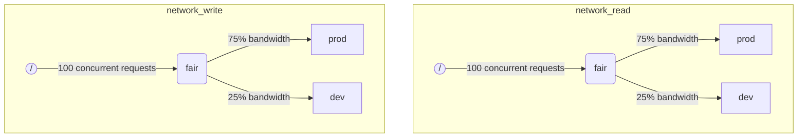

Когда ClickHouse выполняет несколько запросов одновременно, они могут использовать общие ресурсы (например, диски). Для регулирования использования и распределения ресурсов между различными рабочими нагрузками можно применять ограничения и политики планирования. Для каждого ресурса можно настроить иерархию планирования. Корень иерархии представляет ресурс, тогда как листья являются очередями, удерживающими запросы, которые превышают емкость ресурса.

:::note
В настоящее время только удаленный ввод-вывод диска может быть запланирован с использованием описанным способом. Для планирования CPU смотрите настройки о пуле потоков и [`concurrent_threads_soft_limit_num`](server-configuration-parameters/settings.md#concurrent_threads_soft_limit_num). Для гибких ограничений памяти смотрите [Memory overcommit](settings/memory-overcommit.md)
:::

## Конфигурация диска {#disk-config}

Чтобы включить планирование ввода-вывода для конкретного диска, необходимо указать `read_resource` и/или `write_resource` в конфигурации хранения. Это говорит ClickHouse, какой ресурс должен быть использован для каждого чтения и записи с данным диском. Чтение и запись ресурса могут ссылаться на одно и то же имя ресурса, что полезно для локальных SSD или HDD. Несколько различных дисков также могут ссылаться на один и тот же ресурс, что полезно для удаленных дисков: если вы хотите обеспечить справедливое распределение пропускной способности сети между, например, "производственными" и "разработческими" рабочими нагрузками.

Пример:
```xml
<clickhouse>
    <storage_configuration>
        ...
        <disks>
            <s3>
                <type>s3</type>
                <endpoint>https://clickhouse-public-datasets.s3.amazonaws.com/my-bucket/root-path/</endpoint>
                <access_key_id>your_access_key_id</access_key_id>
                <secret_access_key>your_secret_access_key</secret_access_key>
                <read_resource>network_read</read_resource>
                <write_resource>network_write</write_resource>
            </s3>
        </disks>
        <policies>
            <s3_main>
                <volumes>
                    <main>
                        <disk>s3</disk>
                    </main>
                </volumes>
            </s3_main>
        </policies>
    </storage_configuration>
</clickhouse>
```

Альтернативный способ указать, какие диски используются ресурсом, — это SQL-синтаксис:

```sql
CREATE RESOURCE resource_name (WRITE DISK disk1, READ DISK disk2)
```

Ресурс может использоваться для любого количества дисков для ЧТЕНИЯ или ЗАПИСИ или для обоих. Существует синтаксис, позволяющий использовать ресурс для всех дисков:

```sql
CREATE RESOURCE all_io (READ ANY DISK, WRITE ANY DISK);
```

Обратите внимание, что параметры конфигурации сервера имеют приоритет над SQL-способом определения ресурсов.

## Разметка рабочих нагрузок {#workload_markup}

Запросы могут быть размечены с помощью настройки `workload`, чтобы отличать различные рабочие нагрузки. Если `workload` не установлен, используется значение "default". Обратите внимание, что вы можете указать другое значение, используя профили настроек. Ограничения на настройки могут быть использованы, чтобы сделать `workload` постоянным, если вы хотите, чтобы все запросы от пользователя имели фиксированное значение настройки `workload`.

Возможно назначить настройку `workload` для фоновых операций. Слияния и мутации используют настройки сервера `merge_workload` и `mutation_workload` соответственно. Эти значения также могут быть переопределены для конкретных таблиц с использованием настроек `merge_workload` и `mutation_workload` MergeTree.

Рассмотрим пример системы с двумя различными рабочими нагрузками: "производственная" и "разработческая".

```sql
SELECT count() FROM my_table WHERE value = 42 SETTINGS workload = 'production'
SELECT count() FROM my_table WHERE value = 13 SETTINGS workload = 'development'
```

## Иерархия планирования ресурсов {#hierarchy}

С точки зрения подсистемы планирования ресурс представляет иерархию узлов планирования.



**Возможные типы узлов:**
* `inflight_limit` (ограничение) - блокирует, если количество текущих запросов превышает `max_requests` или их общая стоимость превышает `max_cost`; должен иметь единственного потомка.
* `bandwidth_limit` (ограничение) - блокирует, если текущая пропускная способность превышает `max_speed` (0 означает неограничено) или выброс превышает `max_burst` (по умолчанию равен `max_speed`); должен иметь единственного потомка.
* `fair` (политика) - выбирает следующий запрос для обслуживания из одного из своих дочерних узлов в соответствии с максимальной минимальной справедливостью; дочерние узлы могут задавать `weight` (по умолчанию равен 1).
* `priority` (политика) - выбирает следующий запрос для обслуживания из одного из своих дочерних узлов в соответствии со статическими приоритетами (меньшее значение означает более высокий приоритет); дочерние узлы могут задавать `priority` (по умолчанию 0).
* `fifo` (очередь) - лист иерархии, способный удерживать запросы, которые превышают ёмкость ресурса.

Чтобы иметь возможность использовать полную мощность подлежащего ресурса, следует использовать `inflight_limit`. Обратите внимание, что низкое количество `max_requests` или `max_cost` может привести к неполному использованию ресурса, в то время как слишком высокие числа могут привести к пустым очередям внутри планировщика, что, в свою очередь, может привести к игнорированию политик (несправедливости или игнорированию приоритетов) в поддереве. С другой стороны, если вы хотите защитить ресурсы от слишком высокого использования, следует использовать `bandwidth_limit`. Он ограничивает, когда количество потребленного ресурса за `duration` секунд превышает `max_burst + max_speed * duration` байт. Два узла `bandwidth_limit` на одном и том же ресурсе могут использоваться для ограничения пиковых временных интервалов пропускной способности и средней пропускной способности для более длительных интервалов.

Следующий пример показывает, как определить иерархии планирования ввода-вывода, показанные на рисунке:

```xml
<clickhouse>
    <resources>
        <network_read>
            <node path="/">
                <type>inflight_limit</type>
                <max_requests>100</max_requests>
            </node>
            <node path="/fair">
                <type>fair</type>
            </node>
            <node path="/fair/prod">
                <type>fifo</type>
                <weight>3</weight>
            </node>
            <node path="/fair/dev">
                <type>fifo</type>
            </node>
        </network_read>
        <network_write>
            <node path="/">
                <type>inflight_limit</type>
                <max_requests>100</max_requests>
            </node>
            <node path="/fair">
                <type>fair</type>
            </node>
            <node path="/fair/prod">
                <type>fifo</type>
                <weight>3</weight>
            </node>
            <node path="/fair/dev">
                <type>fifo</type>
            </node>
        </network_write>
    </resources>
</clickhouse>
```

## Классификаторы рабочих нагрузок {#workload_classifiers}

Классификаторы рабочих нагрузок используются для определения соответствия между `workload`, указанным в запросе, и очередями-листьями, которые должны использоваться для конкретных ресурсов. В данный момент классификация рабочих нагрузок является простой: доступно только статическое соответствие.

Пример:
```xml
<clickhouse>
    <workload_classifiers>
        <production>
            <network_read>/fair/prod</network_read>
            <network_write>/fair/prod</network_write>
        </production>
        <development>
            <network_read>/fair/dev</network_read>
            <network_write>/fair/dev</network_write>
        </development>
        <default>
            <network_read>/fair/dev</network_read>
            <network_write>/fair/dev</network_write>
        </default>
    </workload_classifiers>
</clickhouse>
```

## Иерархия рабочих нагрузок (только SQL) {#workloads}

Определение ресурсов и классификаторов в XML может быть сложным. ClickHouse предоставляет SQL-синтаксис, который намного удобнее. Все ресурсы, созданные с помощью `CREATE RESOURCE`, имеют одну и ту же структуру иерархии, но могут отличаться в некоторых аспектах. Каждая рабочая нагрузка, созданная с помощью `CREATE WORKLOAD`, поддерживает несколько автоматически созданных узлов планирования для каждого ресурса. Дочерняя рабочая нагрузка может быть создана внутри другой родительской рабочей нагрузки. Вот пример, который определяет точно такую же иерархию, как конфигурация XML выше:

```sql
CREATE RESOURCE network_write (WRITE DISK s3)
CREATE RESOURCE network_read (READ DISK s3)
CREATE WORKLOAD all SETTINGS max_requests = 100
CREATE WORKLOAD development IN all
CREATE WORKLOAD production IN all SETTINGS weight = 3
```

Имя рабочего поддерева без потомков может быть использовано в настройках запроса `SETTINGS workload = 'name'`. Обратите внимание, что классификаторы рабочих нагрузок также создаются автоматически при использовании SQL-синтаксиса.

Чтобы настроить рабочую нагрузку, могут использоваться следующие настройки:
* `priority` - ровесники рабочих нагрузок обслуживаются в соответствии со статическими значениями приоритета (меньшее значение означает более высокий приоритет).
* `weight` - ровесники рабочих нагрузок, имеющие одинаковый статический приоритет, делят ресурсы в соответствии с весами.
* `max_requests` - лимит на количество текущих запросов к ресурсу в этой рабочей нагрузке.
* `max_cost` - лимит на общее количество байт в полете для текущих запросов к ресурсу в этой рабочей нагрузке.
* `max_speed` - лимит на скорость обработки байт в этой рабочей нагрузке (лимит независим для каждого ресурса).
* `max_burst` - максимальное количество байт, которые могут быть обработаны рабочей нагрузкой без ограничения (для каждого ресурса независимо).

Обратите внимание, что настройки рабочих нагрузок преобразуются в соответствующий набор узлов планирования. Для получения более подробной информации см. описание типов и опций узлов планирования [types and options](#hierarchy).

Нет возможности указать разные иерархии рабочих нагрузок для разных ресурсов. Но есть способ указать разные значения настройки рабочей нагрузки для конкретного ресурса:

```sql
CREATE OR REPLACE WORKLOAD all SETTINGS max_requests = 100, max_speed = 1000000 FOR network_read, max_speed = 2000000 FOR network_write
```

Также обратите внимание, что рабочая нагрузка или ресурс не могут быть удалены, если они ссылаются из другой рабочей нагрузки. Чтобы обновить определение рабочей нагрузки, используйте запрос `CREATE OR REPLACE WORKLOAD`.

## Хранение рабочих нагрузок и ресурсов {#workload_entity_storage}
Определения всех рабочих нагрузок и ресурсов в виде запросов `CREATE WORKLOAD` и `CREATE RESOURCE` хранятся постоянно либо на диске по `workload_path`, либо в ZooKeeper по `workload_zookeeper_path`. Хранение в ZooKeeper рекомендуется для достижения согласованности между узлами. В качестве альтернативы можно использовать оператор `ON CLUSTER` вместе с дисковым хранением.

## Строгий доступ к ресурсам {#strict-resource-access}
Чтобы заставить все запросы следовать политикам планирования ресурсов, существует серверная настройка `throw_on_unknown_workload`. Если он установлен в `true`, то каждый запрос должен использовать действительную настройку запроса `workload`, в противном случае будет выброшено исключение `RESOURCE_ACCESS_DENIED`. Если он установлен в `false`, такой запрос не использует планировщик ресурсов, т.е. он получит неограниченный доступ к любому `RESOURCE`.

:::note
Не устанавливайте `throw_on_unknown_workload` в `true`, если команда `CREATE WORKLOAD default` не была выполнена. Это может привести к проблемам при запуске сервера, если запрос без явной настройки `workload` будет выполнен во время запуска.
:::

## См. также {#see-also}
 - [system.scheduler](/operations/system-tables/scheduler.md)
 - [system.workloads](/operations/system-tables/workloads.md)
 - [system.resources](/operations/system-tables/resources.md)
 - [merge_workload](/operations/settings/merge-tree-settings.md#merge_workload) настройка Merge Tree
 - [merge_workload](/operations/server-configuration-parameters/settings.md#merge_workload) глобальная серверная настройка
 - [mutation_workload](/operations/settings/merge-tree-settings.md#mutation_workload) настройка Merge Tree
 - [mutation_workload](/operations/server-configuration-parameters/settings.md#mutation_workload) глобальная серверная настройка
 - [workload_path](/operations/server-configuration-parameters/settings.md#workload_path) глобальная серверная настройка
 - [workload_zookeeper_path](/operations/server-configuration-parameters/settings.md#workload_zookeeper_path) глобальная серверная настройка

