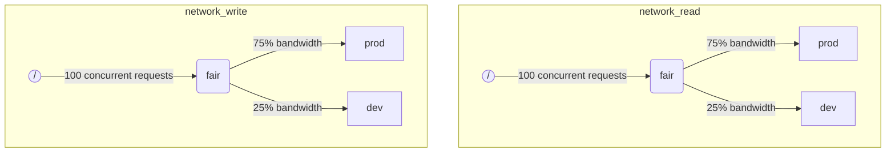

slug: /operations/workload-scheduling
sidebar_position: 69
sidebar_label: 'Планирование нагрузки'
title: 'Планирование нагрузки'
description: 'Информация о планировании нагрузки в ClickHouse.'
keywords: ['нагрузка', 'планирование', 'рерасчет']
```

Когда ClickHouse выполняет несколько запросов одновременно, они могут использовать общие ресурсы (например, диски). Ограничения и политики планирования могут быть применены для регулирования того, как ресурсы используются и разделяются между различными нагрузками. Для каждого ресурса можно настроить иерархию планирования. Корень иерархии представляет ресурс, в то время как листья — это очереди, которые хранят запросы, превышающие емкость ресурса.

:::note
В настоящее время только удаленный доступ к дискам IO может быть запланирован с использованием описанного метода. Для планирования CPU смотрите параметры настроек о пулах потоков и [`concurrent_threads_soft_limit_num`](server-configuration-parameters/settings.md#concurrent_threads_soft_limit_num). Для гибких ограничений памяти смотрите [Переуплотнение памяти](settings/memory-overcommit.md)
:::

## Конфигурация диска {#disk-config}

Чтобы включить планирование IO для конкретного диска, вам необходимо указать `read_resource` и/или `write_resource` в конфигурации хранения. Это указывает ClickHouse, какой ресурс должен использоваться для каждого запроса на чтение и запись с данным диском. Чтение и запись могут ссылаться на одно и то же имя ресурса, что полезно для локальных SSD или HDD. Несколько различных дисков также могут ссылаться на один и тот же ресурс, что полезно для удаленных дисков: если вы хотите позволить справедливое распределение сетевой пропускной способности между, например, "производственными" и "развивающимися" нагрузками.

Пример:
```xml
<clickhouse>
    <storage_configuration>
        ...
        <disks>
            <s3>
                <type>s3</type>
                <endpoint>https://clickhouse-public-datasets.s3.amazonaws.com/my-bucket/root-path/</endpoint>
                <access_key_id>your_access_key_id</access_key_id>
                <secret_access_key>your_secret_access_key</secret_access_key>
                <read_resource>network_read</read_resource>
                <write_resource>network_write</write_resource>
            </s3>
        </disks>
        <policies>
            <s3_main>
                <volumes>
                    <main>
                        <disk>s3</disk>
                    </main>
                </volumes>
            </s3_main>
        </policies>
    </storage_configuration>
</clickhouse>
```

Альтернативный способ указать, какие диски используются ресурсом — это SQL-синтаксис:

```sql
CREATE RESOURCE resource_name (WRITE DISK disk1, READ DISK disk2)
```

Ресурс может использоваться для любого количества дисков для ЧТЕНИЯ или ЗАПИСИ, или для обоих. Существует синтаксис, позволяющий использовать ресурс для всех дисков:

```sql
CREATE RESOURCE all_io (READ ANY DISK, WRITE ANY DISK);
```

Обратите внимание, что параметры конфигурации сервера имеют приоритет над SQL-методом определения ресурсов.

## Маркировка нагрузки {#workload_markup}

Запросы могут быть помечены с помощью настройки `workload`, чтобы различать разные нагрузки. Если `workload` не установлен, используется значение "default". Обратите внимание, что вы можете указать другое значение с использованием профилей настроек. Ограничения настроек могут быть использованы, чтобы сделать `workload` постоянным, если вы хотите, чтобы все запросы от пользователя были помечены фиксированным значением настройки `workload`.

Возможно назначить настройку `workload` для фоновых действий. Слияния и мутации используют серверные настройки `merge_workload` и `mutation_workload`, соответственно. Эти значения также могут быть переопределены для конкретных таблиц с использованием настроек `merge_workload` и `mutation_workload` для MergeTree.

Рассмотрим пример системы с двумя различными нагрузками: "production" и "development".

```sql
SELECT count() FROM my_table WHERE value = 42 SETTINGS workload = 'production'
SELECT count() FROM my_table WHERE value = 13 SETTINGS workload = 'development'
```

## Иерархия планирования ресурсов {#hierarchy}

С точки зрения подсистемы планирования ресурс представляет собой иерархию узлов планирования.



**Возможные типы узлов:**
* `inflight_limit` (ограничение) - блокирует, если количество активных запросов превышает `max_requests`, или их общая стоимость превышает `max_cost`; должен иметь единственного потомка.
* `bandwidth_limit` (ограничение) - блокирует, если текущая пропускная способность превышает `max_speed` (0 означает неограниченный) или всплеск превышает `max_burst` (по умолчанию равно `max_speed`); должен иметь единственного потомка.
* `fair` (политика) - выбирает следующий запрос для обслуживания из одного из его дочерних узлов в соответствии с принципом максимальной минимальности; дочерние узлы могут указывать `weight` (по умолчанию 1).
* `priority` (политика) - выбирает следующий запрос для обслуживания из одного из его дочерних узлов в соответствии со статическими приоритетами (меньшее значение означает более высокий приоритет); дочерние узлы могут указывать `priority` (по умолчанию 0).
* `fifo` (очередь) - лист иерархии, способный хранить запросы, превышающие емкость ресурса.

Чтобы иметь возможность использовать всю мощность базового ресурса, вам следует использовать `inflight_limit`. Обратите внимание, что низкое значение `max_requests` или `max_cost` может привести к неполному использованию ресурса, в то время как слишком высокие значения могут привести к пустым очередям внутри диспетчера, что, в свою очередь, приведет к игнорированию политик (нечестности или игнорированию приоритетов) в поддереве. С другой стороны, если вы хотите защитить ресурсы от чрезмерного использования, вам следует использовать `bandwidth_limit`. Это ограничивает, когда количество потребляемого ресурса за `duration` секунд превышает `max_burst + max_speed * duration` байт. Два узла `bandwidth_limit` на одном ресурсе можно использовать для ограничения пикового трафика во время коротких интервалов и средней пропускной способности для более длительных.

Следующий пример показывает, как определить иерархии планирования IO, показанные на картинке:

```xml
<clickhouse>
    <resources>
        <network_read>
            <node path="/">
                <type>inflight_limit</type>
                <max_requests>100</max_requests>
            </node>
            <node path="/fair">
                <type>fair</type>
            </node>
            <node path="/fair/prod">
                <type>fifo</type>
                <weight>3</weight>
            </node>
            <node path="/fair/dev">
                <type>fifo</type>
            </node>
        </network_read>
        <network_write>
            <node path="/">
                <type>inflight_limit</type>
                <max_requests>100</max_requests>
            </node>
            <node path="/fair">
                <type>fair</type>
            </node>
            <node path="/fair/prod">
                <type>fifo</type>
                <weight>3</weight>
            </node>
            <node path="/fair/dev">
                <type>fifo</type>
            </node>
        </network_write>
    </resources>
</clickhouse>
```

## Классификаторы нагрузки {#workload_classifiers}

Классификаторы нагрузки используются для определения отображения из `workload`, указанного запросом, в очереди-листья, которые должны использоваться для конкретных ресурсов. В данный момент классификация нагрузки проста: доступно только статическое отображение.

Пример:
```xml
<clickhouse>
    <workload_classifiers>
        <production>
            <network_read>/fair/prod</network_read>
            <network_write>/fair/prod</network_write>
        </production>
        <development>
            <network_read>/fair/dev</network_read>
            <network_write>/fair/dev</network_write>
        </development>
        <default>
            <network_read>/fair/dev</network_read>
            <network_write>/fair/dev</network_write>
        </default>
    </workload_classifiers>
</clickhouse>
```

## Иерархия нагрузки (только SQL) {#workloads}

Определение ресурсов и классификаторов в XML может быть сложным. ClickHouse предоставляет SQL-синтаксис, который гораздо удобнее. Все ресурсы, созданные с помощью `CREATE RESOURCE`, имеют ту же структуру иерархии, но могут отличаться по некоторым аспектам. Каждая нагрузка, созданная с помощью `CREATE WORKLOAD`, поддерживает несколько автоматически созданных узлов планирования для каждого ресурса. Дочерняя нагрузка может быть создана внутри другой родительской нагрузки. Вот пример, который определяет точно такую же иерархию, как конфигурация XML выше:

```sql
CREATE RESOURCE network_write (WRITE DISK s3)
CREATE RESOURCE network_read (READ DISK s3)
CREATE WORKLOAD all SETTINGS max_requests = 100
CREATE WORKLOAD development IN all
CREATE WORKLOAD production IN all SETTINGS weight = 3
```

Имя нагрузки-листа без детей может быть использовано в настройках запроса `SETTINGS workload = 'name'`. Обратите внимание, что классификаторы нагрузки также создаются автоматически при использовании SQL-синтаксиса.

Для настройки нагрузки могут быть использованы следующие настройки:
* `priority` - нагрузки-соседи обслуживаются в соответствии со статическими значениями приоритета (меньшее значение означает более высокий приоритет).
* `weight` - нагрузки-соседи, имеющие одинаковый статический приоритет, делят ресурсы в соответствии с весами.
* `max_requests` - лимит на количество одновременных запросов к ресурсу в этой нагрузке.
* `max_cost` - лимит на общее количество байтов в активных запросах к ресурсу в этой нагрузке.
* `max_speed` - лимит на скорость обработки байтов в этой нагрузке (лимит независим для каждого ресурса).
* `max_burst` - максимальное количество байтов, которые могут быть обработаны нагрузкой без ограничения (для каждого ресурса независимо).

Обратите внимание, что настройки нагрузки переводятся в соответствующий набор узлов планирования. Для получения дополнительной информации см. описание [типов и опций узлов планирования](#hierarchy).

Нет возможности указать разные иерархии нагрузок для разных ресурсов. Но есть способ указать разные значения настройки нагрузки для конкретного ресурса:

```sql
CREATE OR REPLACE WORKLOAD all SETTINGS max_requests = 100, max_speed = 1000000 FOR network_read, max_speed = 2000000 FOR network_write
```

Также обратите внимание, что нагрузка или ресурс не могут быть удалены, если они ссылаются на другую нагрузку. Чтобы обновить определение нагрузки, используйте запрос `CREATE OR REPLACE WORKLOAD`.

## Хранение нагрузок и ресурсов {#workload_entity_storage}
Определения всех нагрузок и ресурсов в виде запросов `CREATE WORKLOAD` и `CREATE RESOURCE` хранятся постоянно либо на диске по пути `workload_path`, либо в ZooKeeper по пути `workload_zookeeper_path`. Хранение в ZooKeeper рекомендуется для достижения согласованности между узлами. В качестве альтернативы можно использовать клаузу `ON CLUSTER` вместе с дисковым хранилищем.

## Строгий доступ к ресурсам {#strict-resource-access}
Чтобы убедиться, что все запросы следуют политикам планирования ресурсов, есть серверная настройка `throw_on_unknown_workload`. Если она установлена в `true`, тогда каждый запрос должен использовать действительную настройку запроса `workload`, иначе будет выброшено исключение `RESOURCE_ACCESS_DENIED`. Если установлено значение `false`, тогда такой запрос не использует диспетчер ресурсов, т.е. он получит неограниченный доступ к любому `RESOURCE`.

:::note
Не устанавливайте `throw_on_unknown_workload` в `true`, если не выполнено `CREATE WORKLOAD default`. Это может привести к проблемам при запуске сервера, если запрос без явной настройки `workload` выполнен во время запуска.
:::

## Смотрите также {#see-also}
 - [system.scheduler](/operations/system-tables/scheduler.md)
 - [system.workloads](/operations/system-tables/workloads.md)
 - [system.resources](/operations/system-tables/resources.md)
 - [merge_workload](/operations/settings/merge-tree-settings.md#merge_workload) настройка merge tree
 - [merge_workload](/operations/server-configuration-parameters/settings.md#merge_workload) глобальная серверная настройка
 - [mutation_workload](/operations/settings/merge-tree-settings.md#mutation_workload) настройка merge tree
 - [mutation_workload](/operations/server-configuration-parameters/settings.md#mutation_workload) глобальная серверная настройка
 - [workload_path](/operations/server-configuration-parameters/settings.md#workload_path) глобальная серверная настройка
 - [workload_zookeeper_path](/operations/server-configuration-parameters/settings.md#workload_zookeeper_path) глобальная серверная настройка
