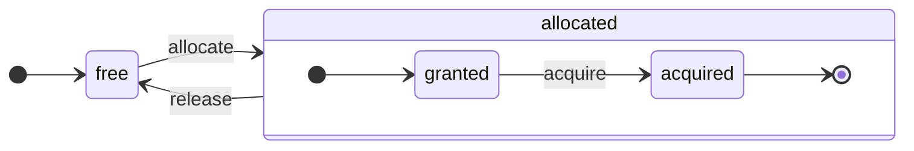

# 架构概览

ClickHouse 是一个真正的列式 DBMS。数据按列存储，并在查询执行过程中以数组（向量或列块）的形式处理。
在可能的情况下，运算会在数组上执行，而不是针对单个值。
这被称为“向量化查询执行”，它有助于降低实际数据处理的成本。

这个理念并不新。
它可以追溯到 `APL`（一种编程语言，1957 年）及其后代：`A+`（APL 方言）、`J`（1990 年）、`K`（1993 年）和 `Q`（来自 Kx Systems 的编程语言，2003 年）。
数组编程用于科学数据处理。在关系型数据库领域，这一理念同样不是新鲜事。例如，它被用于 `VectorWise` 系统（亦称为 Actian Corporation 的 Actian Vector Analytic Database）。

加速查询处理有两种不同的方法：向量化查询执行和运行时代码生成。后者会消除所有间接访问和动态派发。这两种方法都并不绝对优于另一种。当运行时代码生成将许多操作融合在一起时，可以更充分地利用 CPU 执行单元和流水线。向量化查询执行在实践中可能不那么理想，因为它需要处理必须写入缓存并再读出的临时向量。如果临时数据无法放入 L2 缓存，就会成为问题。但向量化查询执行更容易利用 CPU 的 SIMD 能力。我们的一些朋友撰写的[研究论文](http://15721.courses.cs.cmu.edu/spring2016/papers/p5-sompolski.pdf)表明，最好将这两种方法结合使用。ClickHouse 使用向量化查询执行，并且目前对运行时代码生成提供了初步且有限的支持。

## 列 {#columns}

`IColumn` 接口用于表示内存中的列(实际上是列的数据块)。该接口提供了辅助方法用于实现各种关系运算符。几乎所有操作都是不可变的:它们不会修改原始列,而是创建一个新的修改后的列。例如,`IColumn::filter` 方法接受一个过滤字节掩码,用于 `WHERE` 和 `HAVING` 关系运算符。其他示例包括:`IColumn::permute` 方法用于支持 `ORDER BY`,`IColumn::cut` 方法用于支持 `LIMIT`。

各种 `IColumn` 实现(如 `ColumnUInt8`、`ColumnString` 等)负责列的内存布局。内存布局通常是一个连续数组。对于整数类型的列,它就是一个连续数组,类似于 `std::vector`。对于 `String` 和 `Array` 列,它由两个向量组成:一个用于连续存放所有数组元素,另一个用于存储每个数组起始位置的偏移量。此外还有 `ColumnConst`,它在内存中只存储一个值,但表现为一个列。

## Field（字段） {#field}

尽管如此,仍然可以处理单个值。为了表示单个值,使用 `Field`。`Field` 只是 `UInt64`、`Int64`、`Float64`、`String` 和 `Array` 的可辨识联合类型。`IColumn` 具有 `operator []` 方法来获取第 n 个值作为 `Field`,以及 `insert` 方法将 `Field` 追加到列的末尾。这些方法的效率不高,因为它们需要处理表示单个值的临时 `Field` 对象。还有更高效的方法,例如 `insertFrom`、`insertRangeFrom` 等。

`Field` 没有足够的信息来表示表中的特定数据类型。例如,`UInt8`、`UInt16`、`UInt32` 和 `UInt64` 在 `Field` 中都表示为 `UInt64`。

## 抽象泄漏 {#leaky-abstractions}

`IColumn` 提供了用于常见关系型数据转换的方法,但无法满足所有需求。例如,`ColumnUInt64` 没有计算两列之和的方法,`ColumnString` 也没有执行子串搜索的方法。这些大量的操作例程都在 `IColumn` 之外实现。

列上的各种函数可以通过两种方式实现:一种是使用 `IColumn` 方法提取 `Field` 值的通用非高效方式,另一种是利用特定 `IColumn` 实现中数据内部内存布局知识的专门化方式。专门化方式通过将函数转换为特定的 `IColumn` 类型并直接处理内部表示来实现。例如,`ColumnUInt64` 提供了 `getData` 方法,该方法返回内部数组的引用,然后独立的例程可以直接读取或填充该数组。我们采用"抽象泄漏"机制来实现各种例程的高效专门化。

## 数据类型 {#data_types}

`IDataType` 负责序列化和反序列化：以二进制或文本形式读写列数据块或单个值。`IDataType` 直接对应表中的数据类型。例如，有 `DataTypeUInt32`、`DataTypeDateTime`、`DataTypeString` 等。

`IDataType` 和 `IColumn` 之间仅存在松散关联。不同的数据类型可以在内存中由相同的 `IColumn` 实现表示。例如,`DataTypeUInt32` 和 `DataTypeDateTime` 都由 `ColumnUInt32` 或 `ColumnConstUInt32` 表示。此外,同一数据类型也可以由不同的 `IColumn` 实现表示。例如,`DataTypeUInt8` 可以由 `ColumnUInt8` 或 `ColumnConstUInt8` 表示。

`IDataType` 仅存储元数据。例如,`DataTypeUInt8` 不存储任何内容(除了虚函数指针 `vptr`),而 `DataTypeFixedString` 仅存储 `N`(固定长度字符串的大小)。

`IDataType` 提供了用于各种数据格式的辅助方法。例如,用于序列化带引号的值的方法、用于将值序列化为 JSON 的方法,以及将值序列化为 XML 格式一部分的方法。这些辅助方法与数据格式之间没有直接对应关系。例如,不同的数据格式 `Pretty` 和 `TabSeparated` 可以使用 `IDataType` 接口中相同的 `serializeTextEscaped` 辅助方法。

## 块（Block） {#block}

`Block` 是一个容器，表示内存中表的一个子集（数据块）。它只是一组三元组：`(IColumn, IDataType, column name)`。在查询执行期间，数据以 `Block` 为单位进行处理。如果我们有一个 `Block`，我们就拥有数据（在 `IColumn` 对象中）、类型信息（在 `IDataType` 中，告诉我们如何处理该列）以及列名。列名可以是表中的原始列名，也可以是为获取计算临时结果而分配的人工名称。

当我们对块中的列计算某个函数时，会将包含计算结果的新列添加到块中，而不会修改函数参数所在的列，因为操作是不可变的。之后，可以从块中删除不需要的列，但不能修改它们。这种设计便于消除公共子表达式。

每个处理的数据块都会创建对应的 Block。请注意，对于相同类型的计算，不同 Block 的列名和类型保持不变，只有列数据会发生变化。最好将块数据与块头分离，因为小块在复制 shared_ptrs 和列名时会产生较高的临时字符串开销。

## 处理器 {#processors}

相关说明请参见 [https://github.com/ClickHouse/ClickHouse/blob/master/src/Processors/IProcessor.h](https://github.com/ClickHouse/ClickHouse/blob/master/src/Processors/IProcessor.h)。

## 格式 {#formats}

数据格式通过处理器来实现。

## I/O（输入/输出）{#io}

对于面向字节的输入/输出，ClickHouse 提供了 `ReadBuffer` 和 `WriteBuffer` 抽象类。它们用于替代 C++ 的 `iostream`。不必担心：每个成熟的 C++ 项目都有充分的理由使用 `iostream` 之外的替代方案。

`ReadBuffer` 和 `WriteBuffer` 本质上是一个连续的缓冲区和一个指向缓冲区位置的游标。具体实现可以拥有或不拥有缓冲区的内存。它们提供了虚方法来填充缓冲区的后续数据（针对 `ReadBuffer`）或将缓冲区刷新到目标位置（针对 `WriteBuffer`）。这些虚方法很少被直接调用。

`ReadBuffer`/`WriteBuffer` 的实现用于处理文件、文件描述符和网络套接字，用于实现压缩（`CompressedWriteBuffer` 使用另一个 WriteBuffer 初始化，并在向其写入数据之前执行压缩），以及用于其他目的——`ConcatReadBuffer`、`LimitReadBuffer` 和 `HashingWriteBuffer` 这些名称本身就说明了它们的用途。

Read/WriteBuffers 仅处理字节。`ReadHelpers` 和 `WriteHelpers` 头文件中提供了用于格式化输入/输出的辅助函数。例如，有用于以十进制格式写入数字的辅助函数。

让我们来看看当您想要将结果集以 `JSON` 格式写入标准输出时会发生什么。
您有一个准备从拉取式 `QueryPipeline` 中获取的结果集。
首先，您创建一个 `WriteBufferFromFileDescriptor(STDOUT_FILENO)` 来将字节写入标准输出。
接下来，您将查询管道的结果连接到 `JSONRowOutputFormat`，该格式使用前述 `WriteBuffer` 初始化,以便将行以 `JSON` 格式写入标准输出。
这可以通过 `complete` 方法完成，该方法将拉取式 `QueryPipeline` 转换为已完成的 `QueryPipeline`。
在内部，`JSONRowOutputFormat` 将写入各种 JSON 分隔符,并调用 `IDataType::serializeTextJSON` 方法,将 `IColumn` 的引用和行号作为参数传递。随后,`IDataType::serializeTextJSON` 将调用 `WriteHelpers.h` 中的方法:例如,对于数值类型调用 `writeText`,对于 `DataTypeString` 调用 `writeJSONString`。

## 表 {#tables}

`IStorage` 接口用于表示表。该接口的不同实现对应不同的表引擎。例如 `StorageMergeTree`、`StorageMemory` 等。这些类的实例即为表。

`IStorage` 中的核心方法是 `read` 和 `write`,此外还有 `alter`、`rename` 和 `drop` 等方法。`read` 方法接受以下参数:需要从表中读取的列集合、需要考虑的 `AST` 查询以及期望的流数量。该方法返回一个 `Pipe` 对象。

在大多数情况下,read 方法仅负责从表中读取指定的列,不负责任何后续的数据处理。
所有后续的数据处理都由管道的其他部分负责,这超出了 `IStorage` 的职责范围。

但也存在一些值得注意的例外情况:

- AST 查询会被传递给 `read` 方法,表引擎可以利用它来推导索引使用情况,从而减少从表中读取的数据量。
- 有时表引擎可以自行将数据处理到特定阶段。例如,`StorageDistributed` 可以将查询发送到远程服务器,要求它们将数据处理到可以合并来自不同远程服务器数据的阶段,然后返回预处理后的数据。查询解释器随后完成剩余的数据处理。

表的 `read` 方法可以返回由多个 `Processors` 组成的 `Pipe`。这些 `Processors` 可以并行地从表中读取数据。
然后,可以将这些处理器与各种其他转换操作(如表达式求值或过滤)连接起来,这些转换操作可以独立计算。
接着,在它们之上创建一个 `QueryPipeline`,并通过 `PipelineExecutor` 执行。

此外还有 `TableFunction`。这些函数返回临时的 `IStorage` 对象,用于查询的 `FROM` 子句中。

要快速了解如何实现自己的表引擎,可以参考一些简单的示例,如 `StorageMemory` 或 `StorageTinyLog`。

> 作为 `read` 方法的返回结果,`IStorage` 会返回 `QueryProcessingStage` —— 该信息说明查询的哪些部分已在存储内部完成计算。

## 解析器 {#parsers}

ClickHouse 使用手写的递归下降解析器来解析查询。例如，`ParserSelectQuery` 会递归调用底层解析器来处理查询的各个部分。解析器会创建抽象语法树（`AST`）。`AST` 由节点表示，这些节点是 `IAST` 的实例。

> 出于历史原因，ClickHouse 不使用解析器生成器。

## 解释器 {#interpreters}

解释器负责从 AST 创建查询执行管道。有一些简单的解释器,如 `InterpreterExistsQuery` 和 `InterpreterDropQuery`,也有更复杂的解释器,如 `InterpreterSelectQuery`。

查询执行管道是由多个处理器组合而成,这些处理器可以消费和生成数据块(具有特定类型的列集合)。
处理器通过端口进行通信,可以有多个输入端口和多个输出端口。
更详细的说明可以在 [src/Processors/IProcessor.h](https://github.com/ClickHouse/ClickHouse/blob/master/src/Processors/IProcessor.h) 中找到。

例如,解释 `SELECT` 查询的结果是一个"拉取型" `QueryPipeline`,它具有一个特殊的输出端口用于读取结果集。
`INSERT` 查询的结果是一个"推送型" `QueryPipeline`,具有一个输入端口用于写入待插入的数据。
而解释 `INSERT SELECT` 查询的结果是一个"完成型" `QueryPipeline`,它没有输入或输出端口,但会同时将数据从 `SELECT` 复制到 `INSERT`。

`InterpreterSelectQuery` 使用 `ExpressionAnalyzer` 和 `ExpressionActions` 机制进行查询分析和转换。大多数基于规则的查询优化都在这里执行。`ExpressionAnalyzer` 相当混乱,应该被重写:各种查询转换和优化应该被提取到单独的类中,以实现查询的模块化转换。

为了解决解释器中存在的问题,开发了一个新的 `InterpreterSelectQueryAnalyzer`。这是 `InterpreterSelectQuery` 的新版本,它不使用 `ExpressionAnalyzer`,并在 `AST` 和 `QueryPipeline` 之间引入了一个额外的抽象层,称为 `QueryTree`。它已完全可用于生产环境,但为了保险起见,可以通过将 `enable_analyzer` 设置的值设为 `false` 来关闭它。

## 函数 {#functions}

函数分为普通函数和聚合函数。有关聚合函数的内容，请参阅下一节。

普通函数不会改变行数——它们的工作方式如同独立处理每一行。实际上，函数并非针对单独的行调用，而是针对数据 `Block` 调用，以实现向量化查询执行。

有一些特殊函数，如 [blockSize](/sql-reference/functions/other-functions#blockSize)、[rowNumberInBlock](/sql-reference/functions/other-functions#rowNumberInBlock) 和 [runningAccumulate](/sql-reference/functions/other-functions#runningAccumulate)，它们利用块处理机制，打破了行之间的独立性。

ClickHouse 采用强类型系统，因此不存在隐式类型转换。如果函数不支持特定的类型组合，将抛出异常。但函数可以通过重载支持多种不同的类型组合。例如，`plus` 函数（用于实现 `+` 运算符）适用于任意数值类型的组合：`UInt8` + `Float32`、`UInt16` + `Int8` 等。此外，某些可变参数函数可以接受任意数量的参数，例如 `concat` 函数。

实现函数可能会稍显不便，因为函数需要显式分派所支持的数据类型和 `IColumns`。例如，`plus` 函数的代码是通过为每个数值类型组合以及常量或非常量的左右参数实例化 C++ 模板而生成的。

这为实现运行时代码生成以避免模板代码膨胀提供了理想场所。此外，它还使得添加融合函数（如融合乘加运算）或在单次循环迭代中进行多次比较成为可能。

由于向量化查询执行的特性，函数不会短路求值。例如，如果您编写 `WHERE f(x) AND g(y)`，即使在 `f(x)` 为零的行中，两边都会被计算（除非 `f(x)` 是零常量表达式）。但是，如果 `f(x)` 条件的选择性较高，且计算 `f(x)` 的成本远低于 `g(y)`，那么最好实现多遍计算。首先计算 `f(x)`，然后根据结果过滤列，最后仅对较小的已过滤数据块计算 `g(y)`。

## 聚合函数 {#aggregate-functions}

聚合函数是有状态函数。它们将传入的值累积到某个状态中,并允许您从该状态获取结果。它们通过 `IAggregateFunction` 接口进行管理。状态可以相当简单(例如 `AggregateFunctionCount` 的状态仅为一个 `UInt64` 值),也可以相当复杂(例如 `AggregateFunctionUniqCombined` 的状态是线性数组、哈希表和 `HyperLogLog` 概率数据结构的组合)。

状态在 `Arena`(内存池)中分配,以便在执行高基数 `GROUP BY` 查询时处理多个状态。状态可以具有非平凡的构造函数和析构函数:例如,复杂的聚合状态可以自行分配额外的内存。这需要特别注意状态的创建和销毁,以及正确传递它们的所有权和销毁顺序。

聚合状态可以被序列化和反序列化,以便在分布式查询执行期间通过网络传递,或在 RAM 不足时将其写入磁盘。它们甚至可以使用 `DataTypeAggregateFunction` 存储在表中,以支持数据的增量聚合。

> 聚合函数状态的序列化数据格式目前没有版本控制。如果聚合状态仅临时存储,这没有问题。但我们提供了用于增量聚合的 `AggregatingMergeTree` 表引擎,并且已经有用户在生产环境中使用它。这就是为什么在将来更改任何聚合函数的序列化格式时需要保持向后兼容性的原因。

## 服务器 {#server}

服务器实现了几种不同的接口:

- 用于任何外部客户端的 HTTP 接口。
- 用于原生 ClickHouse 客户端以及分布式查询执行期间跨服务器通信的 TCP 接口。
- 用于复制数据传输的接口。

在内部,它只是一个基础的多线程服务器,不使用协程或纤程。由于服务器的设计目标不是处理高频率的简单查询,而是处理相对低频率的复杂查询,因此每个查询都可以处理大量的分析数据。

服务器使用查询执行所需的环境初始化 `Context` 类:可用数据库列表、用户和访问权限、设置、集群、进程列表、查询日志等。解释器使用此环境。

我们为服务器 TCP 协议保持完全的向后和向前兼容性:旧客户端可以与新服务器通信,新客户端也可以与旧服务器通信。但我们不希望永久维护这种兼容性,因此在大约一年后会移除对旧版本的支持。

:::note
对于大多数外部应用程序,我们建议使用 HTTP 接口,因为它简单易用。TCP 协议与内部数据结构的耦合更紧密:它使用内部格式传递数据块,并使用自定义帧格式处理压缩数据。我们没有为该协议发布 C 库,因为它需要链接 ClickHouse 代码库的大部分内容,这并不现实。
:::

## 配置 {#configuration}

ClickHouse Server 基于 POCO C++ 库，使用 `Poco::Util::AbstractConfiguration` 来表示其配置。配置由 `Poco::Util::ServerApplication` 类持有，该类被 `DaemonBase` 类继承，`DaemonBase` 类又被实现 clickhouse-server 本身的 `DB::Server` 类继承。因此可以通过 `ServerApplication::config()` 方法访问配置。

配置从多个文件（XML 或 YAML 格式）中读取，并由 `ConfigProcessor` 类合并为单个 `AbstractConfiguration`。配置在服务器启动时加载，如果配置文件被更新、删除或添加，可以在之后重新加载。`ConfigReloader` 类负责定期监控这些变更以及执行重新加载过程。`SYSTEM RELOAD CONFIG` 查询也会触发配置重新加载。

对于查询和 `Server` 以外的子系统，可以使用 `Context::getConfigRef()` 方法访问配置。每个能够在不重启服务器的情况下重新加载其配置的子系统都应该在 `Server::main()` 方法的重新加载回调中注册自己。请注意，如果新配置存在错误，大多数子系统将忽略新配置，记录警告消息并继续使用先前加载的配置。由于 `AbstractConfiguration` 的特性，无法传递对特定部分的引用，因此通常使用 `String config_prefix` 代替。

## 线程与作业 {#threads-and-jobs}

为了执行查询和处理辅助活动,ClickHouse 从线程池中分配线程,以避免频繁创建和销毁线程。系统根据作业的用途和结构选择不同的线程池:

- 服务器池:用于处理传入的客户端会话。
- 全局线程池:用于通用作业、后台活动和独立线程。
- IO 线程池:用于主要阻塞在 IO 操作且非 CPU 密集型的作业。
- 后台池:用于周期性任务。
- 可抢占任务池:用于可分解为多个步骤的任务。

服务器池是在 `Server::main()` 方法中定义的 `Poco::ThreadPool` 类实例。它最多可以拥有 `max_connection` 个线程,每个线程专用于单个活动连接。

全局线程池是 `GlobalThreadPool` 单例类。通过 `ThreadFromGlobalPool` 从中分配线程。它具有类似于 `std::thread` 的接口,但从全局池中获取线程并执行所有必要的初始化。它通过以下设置进行配置:

- `max_thread_pool_size` - 池中线程数量的上限。
- `max_thread_pool_free_size` - 等待新作业的空闲线程数量的上限。
- `thread_pool_queue_size` - 已调度作业数量的上限。

全局池是通用的,下文描述的所有池都是在其之上实现的。这可以理解为池的层次结构。任何专用池都使用 `ThreadPool` 类从全局池中获取线程。因此,任何专用池的主要目的是限制同时执行的作业数量并进行作业调度。如果调度的作业数量超过池中的线程数量,`ThreadPool` 会将作业按优先级累积在队列中。每个作业都有一个整数优先级,默认优先级为零。所有优先级值较高的作业会在优先级值较低的作业之前启动。但已经执行的作业之间没有区别,因此优先级仅在池过载时才起作用。

IO 线程池实现为一个普通的 `ThreadPool`,可通过 `IOThreadPool::get()` 方法访问。它的配置方式与全局池相同,使用 `max_io_thread_pool_size`、`max_io_thread_pool_free_size` 和 `io_thread_pool_queue_size` 设置。IO 线程池的主要目的是避免 IO 作业耗尽全局池,从而防止查询充分利用 CPU。备份到 S3 会执行大量 IO 操作,为了避免对交互式查询产生影响,系统提供了一个单独的 `BackupsIOThreadPool`,使用 `max_backups_io_thread_pool_size`、`max_backups_io_thread_pool_free_size` 和 `backups_io_thread_pool_queue_size` 设置进行配置。

对于周期性任务执行,系统提供了 `BackgroundSchedulePool` 类。您可以使用 `BackgroundSchedulePool::TaskHolder` 对象注册任务,该池确保同一任务不会同时运行两个作业。它还允许您将任务执行推迟到未来的特定时刻或临时停用任务。全局 `Context` 为不同目的提供了该类的多个实例。对于通用任务,使用 `Context::getSchedulePool()`。

系统还提供了用于可抢占任务的专用线程池。这种 `IExecutableTask` 任务可以分解为有序的作业序列,称为步骤。为了以允许短任务优先于长任务的方式调度这些任务,系统使用 `MergeTreeBackgroundExecutor`。顾名思义,它用于后台 MergeTree 相关操作,如合并、变更、获取和移动。可以使用 `Context::getCommonExecutor()` 和其他类似方法获取池实例。

无论作业使用哪个池,在启动时都会为该作业创建 `ThreadStatus` 实例。它封装了所有每线程信息:线程 ID、查询 ID、性能计数器、资源消耗和许多其他有用数据。作业可以通过 `CurrentThread::get()` 调用通过线程局部指针访问它,因此我们不需要将其传递给每个函数。

如果线程与查询执行相关,那么附加到 `ThreadStatus` 的最重要内容是查询上下文 `ContextPtr`。每个查询在服务器池中都有其主线程。主线程通过持有 `ThreadStatus::QueryScope query_scope(query_context)` 对象来执行附加。主线程还创建一个由 `ThreadGroupStatus` 对象表示的线程组。在此查询执行期间分配的每个额外线程都通过 `CurrentThread::attachTo(thread_group)` 调用附加到其线程组。线程组用于聚合性能事件计数器并跟踪专用于单个任务的所有线程的内存消耗(有关更多信息,请参阅 `MemoryTracker` 和 `ProfileEvents::Counters` 类)。

## 并发控制 {#concurrency-control}

可并行化的查询使用 `max_threads` 设置来限制自身的并发度。该设置的默认值经过精心选择,可使单个查询以最优方式利用所有 CPU 核心。但如果存在多个并发查询,且每个查询都使用默认的 `max_threads` 设置值,会发生什么情况?此时查询将共享 CPU 资源。操作系统会通过不断切换线程来确保公平性,但这会带来一定的性能开销。`ConcurrencyControl` 有助于应对这种开销,避免分配过多线程。配置项 `concurrent_threads_soft_limit_num` 用于限制在施加 CPU 压力之前可分配的并发线程数量。

引入了 CPU `槽位(slot)` 的概念。槽位是并发的基本单位:查询要运行线程,必须预先获取一个槽位,并在线程停止时释放该槽位。服务器中的槽位数量受到全局限制。当总需求超过槽位总数时,多个并发查询将竞争 CPU 槽位。`ConcurrencyControl` 负责通过公平的方式调度 CPU 槽位来解决这种竞争。

每个槽位可视为一个独立的状态机,具有以下状态:

- `free`:槽位可供任何查询分配。
- `granted`:槽位已被特定查询 `分配`,但尚未被任何线程获取。
- `acquired`:槽位已被特定查询 `分配` 且已被线程获取。

请注意,`已分配` 的槽位可以处于两种不同的状态:`granted` 和 `acquired`。前者是一个过渡状态,通常持续时间很短(从槽位分配给查询的瞬间到该查询的任意线程执行扩容过程的时刻)。

`ConcurrencyControl` 的 API 包含以下函数:

1. 为查询创建资源分配:`auto slots = ConcurrencyControl::instance().allocate(1, max_threads);`。该方法将分配至少 1 个、至多 `max_threads` 个槽位。请注意,第一个槽位会立即授予,但其余槽位可能稍后授予。因此这是一个软限制,因为每个查询至少会获得一个线程。
2. 每个线程都必须从分配中获取一个槽位:`while (auto slot = slots->tryAcquire()) spawnThread([slot = std::move(slot)] { ... });`。
3. 更新槽位总数:`ConcurrencyControl::setMaxConcurrency(concurrent_threads_soft_limit_num)`。可在运行时完成,无需重启服务器。

该 API 允许查询在存在 CPU 压力的情况下至少以一个线程启动,随后扩展至 `max_threads`。

## 分布式查询执行 {#distributed-query-execution}

集群中的服务器大多是相互独立的。您可以在集群中的一台或所有服务器上创建 `Distributed` 表。`Distributed` 表本身不存储数据——它仅为集群多个节点上的所有本地表提供一个"视图"。当您从 `Distributed` 表执行 SELECT 查询时,它会重写该查询,根据负载均衡设置选择远程节点,并将查询发送给它们。`Distributed` 表请求远程服务器处理查询,直到可以合并来自不同服务器的中间结果为止。然后它接收中间结果并将其合并。分布式表会尽可能将更多工作分配给远程服务器,避免通过网络传输大量中间数据。

当您在 IN 或 JOIN 子句中使用子查询,且每个子查询都使用 `Distributed` 表时,情况会变得更加复杂。我们针对这些查询的执行有不同的策略。

分布式查询执行没有全局查询计划。每个节点都有其负责部分的本地查询计划。我们只有简单的单遍分布式查询执行:向远程节点发送查询,然后合并结果。但这对于具有高基数 `GROUP BY` 或具有大量 JOIN 临时数据的复杂查询来说是不可行的。在这种情况下,我们需要在服务器之间"重新分配"数据,这需要额外的协调。ClickHouse 目前不支持这种查询执行方式,我们需要在这方面进行改进。

## 合并树 {#merge-tree}

`MergeTree` 是一系列支持主键索引的存储引擎家族。主键可以是列或表达式的任意元组。`MergeTree` 表中的数据以"部分"(parts)的形式存储。每个部分按主键顺序存储数据,因此数据按主键元组的字典序排列。所有表列都存储在这些部分中各自独立的 `column.bin` 文件中。这些文件由压缩块组成。每个块通常包含 64 KB 到 1 MB 的未压缩数据,具体取决于平均值大小。这些块由连续放置的列值组成。每列的列值顺序相同(由主键定义顺序),因此当您遍历多个列时,可以获得对应行的值。

主键本身是"稀疏的"。它不会寻址每一行,而只寻址某些数据范围。一个独立的 `primary.idx` 文件包含每第 N 行的主键值,其中 N 称为 `index_granularity`(通常 N = 8192)。此外,对于每一列,我们都有带有"标记"(marks)的 `column.mrk` 文件,这些标记是数据文件中每第 N 行的偏移量。每个标记是一对值:文件中到压缩块开头的偏移量,以及解压缩块中到数据开头的偏移量。通常,压缩块按标记对齐,解压缩块中的偏移量为零。`primary.idx` 的数据始终驻留在内存中,而 `column.mrk` 文件的数据会被缓存。

当我们要从 `MergeTree` 的某个部分读取数据时,我们会查看 `primary.idx` 数据并定位可能包含所请求数据的范围,然后查看 `column.mrk` 数据并计算从何处开始读取这些范围的偏移量。由于稀疏性,可能会读取多余的数据。ClickHouse 不适合高负载的简单点查询,因为每个键都必须读取包含 `index_granularity` 行的整个范围,并且每列都必须解压缩整个压缩块。我们将索引设计为稀疏的,是因为我们必须能够在单个服务器上维护数万亿行数据,而索引不会占用明显的内存。此外,由于主键是稀疏的,它不是唯一的:在 INSERT 时无法检查表中键的存在性。表中可以有多行具有相同的键。

当您向 `MergeTree` 中 `INSERT` 一批数据时,该批数据会按主键顺序排序并形成一个新部分。后台线程会定期选择一些部分并将它们合并为一个已排序的部分,以保持部分数量相对较少。这就是它被称为 `MergeTree` 的原因。当然,合并会导致"写放大"。所有部分都是不可变的:它们只能被创建和删除,但不能被修改。执行 SELECT 时,它会持有表的快照(一组部分)。合并后,我们还会保留旧部分一段时间,以便在故障后更容易恢复,因此如果我们发现某个合并的部分可能已损坏,可以用其源部分替换它。

`MergeTree` 不是 LSM 树,因为它不包含 MEMTABLE 和 LOG:插入的数据直接写入文件系统。这种行为使 MergeTree 更适合批量插入数据。因此,频繁插入少量行对 MergeTree 来说并不理想。例如,每秒插入几行是可以的,但每秒插入一千次对 MergeTree 来说并不是最优的。不过,有一种异步插入模式可用于小批量插入以克服此限制。我们这样做是为了简单起见,也因为我们在应用程序中已经在批量插入数据。

有些 MergeTree 引擎在后台合并期间会执行额外的工作。例如 `CollapsingMergeTree` 和 `AggregatingMergeTree`。这可以被视为对更新的特殊支持。请记住,这些不是真正的更新,因为用户通常无法控制后台合并的执行时间,并且 `MergeTree` 表中的数据几乎总是存储在多个部分中,而不是完全合并的形式。

## 复制 {#replication}

ClickHouse 中的复制可以按表进行配置。您可以在同一服务器上同时拥有复制表和非复制表。您还可以为不同的表配置不同的复制方式,例如一个表使用双副本复制,另一个表使用三副本复制。

复制功能在 `ReplicatedMergeTree` 存储引擎中实现。`ZooKeeper` 中的路径作为存储引擎的参数指定。所有在 `ZooKeeper` 中具有相同路径的表会成为彼此的副本:它们同步数据并保持一致性。副本可以通过简单地创建或删除表来动态添加和移除。

复制使用异步多主架构。您可以将数据插入任何与 `ZooKeeper` 建立会话的副本,数据会异步复制到所有其他副本。由于 ClickHouse 不支持 UPDATE 操作,因此复制是无冲突的。由于默认情况下插入操作没有仲裁确认机制,如果某个节点失败,刚插入的数据可能会丢失。可以使用 `insert_quorum` 设置来启用插入仲裁。

复制的元数据存储在 ZooKeeper 中。复制日志记录了需要执行的操作。操作包括:获取数据分片、合并数据分片、删除分区等。每个副本将复制日志复制到其队列中,然后执行队列中的操作。例如,在插入数据时,日志中会创建"获取数据分片"操作,每个副本都会下载该数据分片。副本之间协调合并操作以获得字节级相同的结果。所有副本上的数据分片都以相同的方式合并。其中一个 leader 副本首先发起新的合并,并将"合并数据分片"操作写入日志。多个副本(或全部副本)可以同时成为 leader。可以使用 `merge_tree` 设置中的 `replicated_can_become_leader` 来阻止副本成为 leader。leader 副本负责调度后台合并。

复制是物理复制:节点之间只传输压缩的数据分片,而不传输查询。在大多数情况下,合并操作在每个副本上独立处理,以避免网络放大从而降低网络成本。只有在复制延迟显著的情况下,才会通过网络发送大型合并数据分片。

此外,每个副本将其状态(包括数据分片集合及其校验和)存储在 ZooKeeper 中。当本地文件系统上的状态与 ZooKeeper 中的参考状态出现偏差时,副本会通过从其他副本下载缺失和损坏的数据分片来恢复一致性。当本地文件系统中存在意外或损坏的数据时,ClickHouse 不会删除它,而是将其移动到单独的目录并忽略它。

:::note
ClickHouse 集群由独立的分片组成,每个分片由副本组成。集群**不具有弹性**,因此在添加新分片后,数据不会在分片之间自动重新平衡。相反,集群负载需要手动调整为不均匀分布。这种实现方式为您提供了更多控制权,对于相对较小的集群(例如数十个节点)来说是可以接受的。但对于我们在生产环境中使用的数百个节点的集群,这种方法就成为一个显著的缺陷。我们应该实现一个跨集群的表引擎,具有可以在集群之间自动拆分和平衡的动态复制区域。
:::
