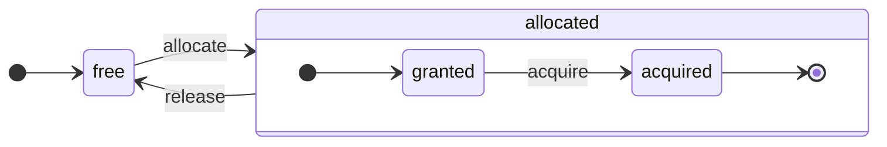

# 架构概述

ClickHouse 是一个真正的列式数据库管理系统（DBMS）。数据按列存储，并在执行数组（列的向量或块）时处理。每当可能时，操作会在数组上调度，而不是在单个值上。这被称为“向量化查询执行”，它有助于降低实际数据处理的成本。

这个理念并不新鲜。它可以追溯到 `APL`（一种编程语言，1957 年）及其后代：`A +`（APL 方言）、`J`（1990 年）、`K`（1993 年）和 `Q`（来自 Kx Systems 的编程语言，2003 年）。数组编程在科学数据处理中被使用。这一理念在关系数据库中也并非新鲜事物。例如，它在 `VectorWise` 系统（也称为 Actian Corporation 的 Actian Vector 分析数据库）中被使用。

有两种不同的方法可以加速查询处理：向量化查询执行和运行时代码生成。后者消除了所有间接性和动态调度。这两种方法并没有严格的优劣之分。当将多个操作融合在一起，从而充分利用 CPU 执行单元和管线时，运行时代码生成可能会更好。向量化查询执行可能不太实用，因为它涉及必须写入缓存并读取的临时向量。如果临时数据没有适合 L2 缓存，这将成为一个问题。但向量化查询执行更容易利用 CPU 的 SIMD 能力。一篇 [研究论文](http://15721.courses.cs.cmu.edu/spring2016/papers/p5-sompolski.pdf) 表明将这两种方法结合在一起是更好的。ClickHouse 使用向量化查询执行，并对运行时代码生成提供有限的初步支持。

## 列 {#columns}

`IColumn` 接口用于表示内存中的列（实际上是列的块）。该接口为各种关系运算符的实现提供了辅助方法。几乎所有操作都是不可变的：它们不修改原始列，而是创建一个新的修改后的列。例如，`IColumn :: filter` 方法接受一个过滤字节掩码。它用于 `WHERE` 和 `HAVING` 关系运算符。附加示例：`IColumn :: permute` 方法支持 `ORDER BY`，`IColumn :: cut` 方法支持 `LIMIT`。

各种 `IColumn` 实现（`ColumnUInt8`、`ColumnString` 等）负责列的内存布局。内存布局通常是一个连续数组。对于整型列，它只是一个连续数组，如 `std :: vector`。对于 `String` 和 `Array` 列，它是两个向量：一个用于所有数组元素，连续存放，另一个用于指向每个数组开头的偏移量。还有 `ColumnConst`，它在内存中仅存储一个值，但看起来像一列。

## 字段 {#field}

然而，也可以单独处理值。要表示单个值，使用 `Field`。`Field` 只是一个 `UInt64`、`Int64`、`Float64`、`String` 和 `Array` 的区分联合。`IColumn` 具有 `operator []` 方法来获取第 n 个值作为 `Field`，以及 `insert` 方法将 `Field` 附加到列的末尾。这些方法的效率不是很高，因为它们需要处理代表单个值的临时 `Field` 对象。还有更高效的方法，如 `insertFrom`、`insertRangeFrom` 等。

`Field` 对表的特定数据类型没有足够的信息。例如，`UInt8`、`UInt16`、`UInt32` 和 `UInt64` 均在 `Field` 中表示为 `UInt64`。

## 漏洞抽象 {#leaky-abstractions}

`IColumn` 具有用于数据的常见关系转换的方法，但它们并不能满足所有需求。例如，`ColumnUInt64` 没有计算两个列之和的方法，而 `ColumnString` 没有执行子字符串搜索的方法。这些无数例程是在 `IColumn` 之外实现的。

在列上可以以通用、非高效的方式使用 `IColumn` 方法来提取 `Field` 值来实现各种函数，或者通过使用特定 `IColumn` 实现中数据的内部内存布局知识以专业化的方式实现。通过将函数强制转换为特定的 `IColumn` 类型并直接处理内部表示来实现。例如，`ColumnUInt64` 具有 `getData` 方法返回对内部数组的引用，随后一个单独的例程读取或直接填充该数组。我们有“漏斗抽象”，以允许各种例程的高效特化。

## 数据类型 {#data_types}

`IDataType` 负责序列化和反序列化：以二进制或文本形式读取和写入列块或单个值。`IDataType` 直接对应于表中的数据类型。例如，有 `DataTypeUInt32`、`DataTypeDateTime`、`DataTypeString` 等等。

`IDataType` 和 `IColumn` 之间只有松散的关系。不同的数据类型可以由相同的 `IColumn` 实现表示。例如，`DataTypeUInt32` 和 `DataTypeDateTime` 都由 `ColumnUInt32` 或 `ColumnConstUInt32` 表示。此外，相同的数据类型可以由不同的 `IColumn` 实现表示。例如，`DataTypeUInt8` 可以由 `ColumnUInt8` 或 `ColumnConstUInt8` 表示。

`IDataType` 仅存储元数据。例如，`DataTypeUInt8` 并不存储任何内容（除了虚指针 `vptr`），而 `DataTypeFixedString` 仅存储 `N`（固定大小字符串的大小）。

`IDataType` 具有各种数据格式的辅助方法。例如，有方法序列化可能带有引用的值、为 JSON 序列化值以及将值序列化为 XML 格式的一部分。没有直接对应的数据格式。例如，不同的数据格式 `Pretty` 和 `TabSeparated` 可以使用来自 `IDataType` 接口的同一 `serializeTextEscaped` 辅助方法。

## 块 {#block}

`Block` 是一个容器，表示内存中表的子集（块）。它仅是三元组的集合：`(IColumn, IDataType, 列名)`。在查询执行期间，数据通过 `Block` 进行处理。如果我们有一个 `Block`，我们就有数据（在 `IColumn` 对象中），我们有有关其类型的信息（在 `IDataType` 中），它告诉我们如何处理该列，还有列名。它可以是来自表的原始列名，或为获取计算的临时结果而分配的某些人工名称。

当我们在块中的列上计算某个函数时，我们会将结果添加到块中而不触及作为该函数参数的列，因为操作是不可变的。稍后，可以从块中删除不需要的列，但不做修改。这对于消除常见子表达式非常方便。

每处理一块数据都会创建块。请注意，对于相同类型的计算，不同块的列名和类型保持不变，只有列数据会更改。最好将块数据与块头分开，因为小块大小会导致在复制 shared_ptr 和列名时产生大量的临时字符串开销。

## 处理器 {#processors}

请参阅 [https://github.com/ClickHouse/ClickHouse/blob/master/src/Processors/IProcessor.h](https://github.com/ClickHouse/ClickHouse/blob/master/src/Processors/IProcessor.h) 中的描述。

## 格式 {#formats}

数据格式是通过处理器实现的。

## I/O {#io}

对于以字节为导向的输入/输出，有 `ReadBuffer` 和 `WriteBuffer` 抽象类。它们代替 C++ 的 `iostream` 使用。别担心：每个成熟的 C++ 项目都是出于良好原因而使用其他东西，而不是 `iostream`。

`ReadBuffer` 和 `WriteBuffer` 仅是一个连续缓冲区和指向该缓冲区中位置的游标。实现可能拥有或不拥有缓冲区的内存。有一个虚拟方法用于填充缓冲区以下数据（对于 `ReadBuffer`）或将缓冲区刷新到某个地方（对于 `WriteBuffer`）。这些虚拟方法很少被调用。

`ReadBuffer`/`WriteBuffer` 的实现用于处理文件和文件描述符及网络套接字，实现压缩（`CompressedWriteBuffer` 是用另一个 WriteBuffer 初始化并在将数据写入之前执行压缩），以及其他目的 - 名称 `ConcatReadBuffer`、`LimitReadBuffer` 和 `HashingWriteBuffer` 不言自明。

读/写缓冲区仅处理字节。`ReadHelpers` 和 `WriteHelpers` 头文件中的函数帮助进行输入/输出格式化。例如，有帮助函数可以以十进制格式写入数字。

让我们来看看当你想将结果集以 `JSON` 格式写入 stdout 时发生了什么。
你已准备好从拉取所需的 `QueryPipeline` 中提取结果集。
首先，你创建一个 `WriteBufferFromFileDescriptor(STDOUT_FILENO)` 将字节写入 stdout。
接下来，你将查询管道中的结果连接到 `JSONRowOutputFormat`，它用该 `WriteBuffer` 初始化，以将行以 `JSON` 格式写入 stdout。
这可以通过 `complete` 方法完成，该方法将拉取的 `QueryPipeline` 转换为完成的 `QueryPipeline`。在内部，`JSONRowOutputFormat` 将写入各种 JSON 分隔符，并调用 `IDataType::serializeTextJSON` 方法，参数为 `IColumn` 的引用和行号。因此，`IDataType::serializeTextJSON` 将调用 `WriteHelpers.h` 中的方法：例如，数字类型使用 `writeText`，而 `DataTypeString` 使用 `writeJSONString`。

## 表 {#tables}

`IStorage` 接口代表表。该接口的不同实现是不同的表引擎。例如 `StorageMergeTree`、`StorageMemory` 等。这些类的实例仅是表。

`IStorage` 中的关键方法是 `read` 和 `write`，以及其他方法，如 `alter`、`rename` 和 `drop`。`read` 方法接受以下参数：要从表中读取的列集、要考虑的 `AST` 查询以及所需的流数量。它返回一个 `Pipe`。

在大多数情况下，读取方法仅负责从表中读取指定列，而不负责后续的数据处理。
所有后续的数据处理由管道的另一部分处理，超出了 `IStorage` 的责任。

但有一些显著例外：

- `AST` 查询被传递给 `read` 方法，表引擎可以利用它推导索引使用情况并减少从表中读取的数据。
- 有时，表引擎可以将数据处理到特定阶段。例如，`StorageDistributed` 可以将查询发送到远程服务器，要求它们处理数据到可以合并来自不同远程服务器的数据的阶段，并返回这些预处理的数据。查询解释器随后完成数据的处理。

表的 `read` 方法可以返回一个由多个 `Processors` 组成的 `Pipe`。这些 `Processors` 可以并行从表中读取。
然后，可以将这些处理器与其他各种变换（如表达式求值或过滤）连接，这些变换可以独立计算。
然后，基于它们创建一个 `QueryPipeline`，并通过 `PipelineExecutor` 执行它。

还有 `TableFunction`。这些是返回临时 `IStorage` 对象以在查询的 `FROM` 子句中使用的函数。

要快速了解如何实现表引擎，可以查看一些简单的例子，如 `StorageMemory` 或 `StorageTinyLog`。

> 作为 `read` 方法的结果，`IStorage` 返回 `QueryProcessingStage` - 关于查询中哪些部分已经在存储中计算的信息。

## 解析器 {#parsers}

一个手写的递归下降解析器解析查询。例如，`ParserSelectQuery` 只是递归调用基础解析器来解析查询的各个部分。解析器创建一个 `AST`。`AST` 由节点表示，这些节点是 `IAST` 的实例。

> 由于历史原因，并未使用解析器生成器。

## 解释器 {#interpreters}

解释器负责根据 `AST` 创建查询执行管道。这里有简单的解释器，如 `InterpreterExistsQuery` 和 `InterpreterDropQuery`，以及更复杂的 `InterpreterSelectQuery`。

查询执行管道是可以消费和生成块（带有特定类型的列集合）的处理器组合。
处理器通过端口进行通信，并且可以具有多个输入端口和多个输出端口。
有关更详细的描述，请参见 [src/Processors/IProcessor.h](https://github.com/ClickHouse/ClickHouse/blob/master/src/Processors/IProcessor.h)。

例如，解释 `SELECT` 查询的结果是一个“拉取” `QueryPipeline`，它具有特殊的输出端口以从中读取结果集。
`INSERT` 查询的结果是一个“推送” `QueryPipeline`，它具有用于写入插入数据的输入端口。
而解释 `INSERT SELECT` 查询的结果是一个“完成”的 `QueryPipeline`，它没有输入或输出，但会同时将数据从 `SELECT` 复制到 `INSERT`。

`InterpreterSelectQuery` 利用 `ExpressionAnalyzer` 和 `ExpressionActions` 机制进行查询分析和变换。在这里，大多数基于规则的查询优化都在进行。`ExpressionAnalyzer` 相当复杂，需要重写：各种查询变换和优化应该提取到单独的类中，以允许对查询进行模块化变换。

为了解决现有的解释器问题，开发了一个新的 `InterpreterSelectQueryAnalyzer`。这是 `InterpreterSelectQuery` 的新版本，不使用 `ExpressionAnalyzer`，并在 `AST` 和 `QueryPipeline` 之间引入了一个额外的抽象层，称为 `QueryTree`。它完全准备好投入生产，但为了安全起见，可以通过将 `enable_analyzer` 设置为 `false` 来关闭它。

## 函数 {#functions}

有普通函数和聚合函数。有关聚合函数，请参见下一节。

普通函数不改变行数 - 它们的工作方式是处理每一行独立的。实际上，函数不是针对单个行调用的，而是针对 `Block` 数据进行调用，以实现向量化查询执行。

还有一些杂项函数，例如 [blockSize](/sql-reference/functions/other-functions#blockSize)、[rowNumberInBlock](/sql-reference/functions/other-functions#rowNumberInBlock) 和 [runningAccumulate](/sql-reference/functions/other-functions#runningaccumulate)，它们利用块处理并违反了行的独立性。

ClickHouse 具有强类型，因此没有隐式类型转换。如果某个函数不支持特定类型的具体组合，它将抛出异常。但函数可以针对许多不同的类型组合工作（重载）。例如，`plus` 函数（实现 `+` 运算符）适用于任何组合的数值类型：`UInt8` + `Float32`、`UInt16` + `Int8` 等等。同时，某些可变参数函数可以接受任意数量的参数，例如 `concat` 函数。

实现函数可能稍显不便，因为函数显式调度支持的数据类型和支持的 `IColumns`。例如，`plus` 函数通过对每种数值类型组合生成 C++ 模板的实例代码以及常量或非常量的左、右参数。

这是一种非常好的实现运行时代码生成的地方，以避免模板代码膨胀。此外，这还有助于添加融合函数，如融合乘加，或者在一个循环迭代中进行多次比较。

由于向量化查询执行，函数不会进行短路。例如，如果你写 `WHERE f(x) AND g(y)`，即使在 `f(x)` 为零的行中（除非 `f(x)` 是零常量表达式），两侧也会被计算。但如果 `f(x)` 条件的选择性较高，并且 `f(x)` 的计算远比 `g(y)` 便宜，那么实现多次计算是更好的。这将首先计算 `f(x)`，然后根据结果过滤列，然后仅对较小的过滤数据块计算 `g(y)`。

## 聚合函数 {#aggregate-functions}

聚合函数是有状态的函数。它们将传入的值累积到某些状态中，并允许您从该状态中获取结果。它们通过 `IAggregateFunction` 接口进行管理。状态可以相当简单（`AggregateFunctionCount` 的状态只是一个 `UInt64` 值）或相当复杂（`AggregateFunctionUniqCombined` 的状态是线性数组、哈希表和 `HyperLogLog` 概率数据结构的组合）。

状态在 `Arena`（内存池）中分配，以便在执行高基数的 `GROUP BY` 查询时处理多个状态。状态可以具有非平凡的构造函数和析构函数：例如，复杂的聚合状态可以自行分配额外的内存。这需要关注状态的创建和销毁，并正确传递其所有权和销毁顺序。

聚合状态可以序列化和反序列化，以在分布式查询执行期间在网络上传输，或将其写入 RAM 不足的磁盘。它们甚至可以存储在 `DataTypeAggregateFunction` 表中，以允许数据的增量聚合。

> 目前聚合函数状态的序列化数据格式没有版本管控。如果聚合状态仅暂时存储，这没问题。但我们有 `AggregatingMergeTree` 表引擎用于增量聚合，用户们已经在生产中使用它。这就是为什么在未来更改任何聚合函数的序列化格式时要求向后兼容的原因。

## 服务器 {#server}

服务器实现了几种不同的接口：

- 用于任何外部客户端的 HTTP 接口。
- 用于本地 ClickHouse 客户端和在分布式查询执行期间进行跨服务器通信的 TCP 接口。
- 用于复制数据传输的接口。

在内部，它只是一个原始的多线程服务器，没有协程或纤程。由于服务器并不是为了处理高频率的简单查询而设计的，而是为了处理相对较低频率的复杂查询，因此每个查询都可以处理大量的分析数据。

服务器使用 `Context` 类初始化查询执行所需的环境：可用数据库、用户和访问权限、设置、集群、进程列表、查询日志等等。解释器使用这个环境。

我们保持服务器 TCP 协议的完全向前和向后兼容性：旧客户端可以与新服务器通信，新客户端可以与旧服务器通信。但我们不想永久维护它，我们将在大约一年后移除对旧版本的支持。

:::note
对于大多数外部应用，我们建议使用 HTTP 接口，因为它简单易用。TCP 协议与内部数据结构的联系更紧密：它使用内部格式传递数据块，并使用自定义帧格式处理压缩数据。我们尚未为该协议发布 C 库，因为这需要链接 ClickHouse 大部分代码库，这并不实用。
:::

## 配置 {#configuration}

ClickHouse Server 基于 POCO C++ 库，并使用 `Poco::Util::AbstractConfiguration` 来表示其配置。配置由 `Poco::Util::ServerApplication` 类持有，该类继承自 `DaemonBase` 类，后者又继承自实现 clickhouse-server 的 `DB::Server` 类。因此，配置可以通过 `ServerApplication::config()` 方法进行访问。

配置从多个文件（XML 或 YAML 格式）读取，并由 `ConfigProcessor` 类合并为单个 `AbstractConfiguration`。配置在服务器启动时加载，如果其中一个配置文件被更新、删除或添加，可以稍后重新加载。`ConfigReloader` 类负责定期监控这些更改和重新加载过程。`SYSTEM RELOAD CONFIG` 查询也会触发配置被重新加载。

对于 `Server` 之外的查询和子系统，可以通过 `Context::getConfigRef()` 方法访问配置。每个能够在不重启服务器的情况下重新加载其配置的子系统应在 `Server::main()` 方法中的重新加载回调中注册自己。请注意，如果较新的配置出现错误，大多数子系统将会忽略新配置，记录警告信息并继续使用之前加载的配置。由于 `AbstractConfiguration` 的性质，不能传递对特定部分的引用，因此通常使用 `String config_prefix`。

## 线程和任务 {#threads-and-jobs}

为了执行查询和进行辅助活动，ClickHouse 从线程池中分配线程，以避免频繁的线程创建和销毁。根据任务的目的和结构，有几个线程池被选择：
  * 服务器池，用于处理传入的客户端会话。
  * 全局线程池，用于通用任务、后台活动和独立线程。
  * IO 线程池，专门用于大多数被阻塞在某些 IO 上且不是 CPU 密集型的工作。
  * 背景池，用于周期性任务。
  * 可抢占任务的池，可以将其分解为多个步骤。

服务器池是 `Poco::ThreadPool` 类的实例，定义在 `Server::main()` 方法中。它最多可以有 `max_connection` 线程。每个线程专门用于一个活动连接。

全局线程池是 `GlobalThreadPool` 单例类。要从中分配线程，使用 `ThreadFromGlobalPool`。它的接口类似于 `std::thread`，但从全局池中拉取线程并进行所有必要的初始化。它使用以下设置进行配置：
  * `max_thread_pool_size` - 池中线程数量的限制。
  * `max_thread_pool_free_size` - 等待新任务的空闲线程数量的限制。
  * `thread_pool_queue_size` - 调度的任务数量限制。

全局池是通用的，下面描述的所有池都是基于它实现的。这可以看作是池的层次结构。任何专用池都通过 `ThreadPool` 类从全局池中获取线程。因此，任何专用池的主要目的就是对同时任务的数量施加限制并进行任务调度。如果调度的任务数量超过池中的线程数量，`ThreadPool` 将把任务优先级排队。每个任务都有一个整数优先级。默认优先级是零。所有优先级值较高的任务将在任何优先级较低的任务之前启动。但是，对于已在执行的任务没有区别，因此优先级只在池过载时才是重要的。

IO 线程池实现为简单的 `ThreadPool`，可以通过 `IOThreadPool::get()` 方法访问。它以与全局池相同的方式进行配置，使用 `max_io_thread_pool_size`、`max_io_thread_pool_free_size` 和 `io_thread_pool_queue_size` 设置。IO 线程池的主要目的是避免用 IO 任务耗尽全局池，这可能会阻止查询充分利用 CPU。备份到 S3 进行大量 IO 操作，为了避免对交互式查询产生影响，配置了单独的 `BackupsIOThreadPool`，使用 `max_backups_io_thread_pool_size`、`max_backups_io_thread_pool_free_size` 和 `backups_io_thread_pool_queue_size` 设置。

对于周期性任务执行，有 `BackgroundSchedulePool` 类。你可以使用 `BackgroundSchedulePool::TaskHolder` 对象注册任务，并且池会确保没有任务同时执行两次。它还允许你将任务执行推迟到未来的特定时刻或暂时停用任务。全局 `Context` 提供了这个类的几个实例用于不同的目的。对于通用任务，使用 `Context::getSchedulePool()`。

还有用于可抢占任务的专用线程池。这种 `IExecutableTask` 任务可以分解为有序的任务序列，称为步骤。为了以允许短任务优先于长任务的方式调度这些任务，使用 `MergeTreeBackgroundExecutor`。顾名思义，它用于与 MergeTree 相关的后台操作，如合并、变更、抓取和移动。池实例可以通过 `Context::getCommonExecutor()` 和其他类似方法获取。

无论用于作业的池是什么，开始时都会为该作业创建一个 `ThreadStatus` 实例。它封装了所有每线程的信息：线程 ID、查询 ID、性能计数器、资源消耗和许多其他有用数据。作业可以通过 `CurrentThread::get()` 调用通过线程本地指针访问这些信息，所以我们不需要将其传递给每个函数。

如果线程与查询执行相关，则 `ThreadStatus` 附加的最重要信息是查询上下文 `ContextPtr`。每个查询在服务器池中具有其主线程。主线程通过持有 `ThreadStatus::QueryScope query_scope(query_context)` 对象进行附加。主线程还创建一个代表 `ThreadGroupStatus` 对象的线程组。查询执行期间分配的每个附加线程都通过 `CurrentThread::attachTo(thread_group)` 调用附加到其线程组。线程组用于聚合事件计数器并跟踪所有专用于单个任务的线程的内存消耗（有关更多信息，请参阅 `MemoryTracker` 和 `ProfileEvents::Counters` 类）。

## 并发控制 {#concurrency-control}

可以并行化的查询使用 `max_threads` 设置限制自己。此设置的默认值选择方式使单个查询能够最佳利用所有 CPU 核心。但是，如果有多个并发查询，每个查询都使用默认的 `max_threads` 设置值呢？那么，查询将共享 CPU 资源。操作系统将通过不断切换线程来确保公平性，这会带来一些性能损失。`ConcurrencyControl` 有助于处理这种损失，并避免分配太多线程。配置设置 `concurrent_threads_soft_limit_num` 被用来限制在施加某种 CPU 压力之前可以分配多少个并发线程。

引入了 CPU `slot` 的概念。插槽是并发的单位：要运行线程，查询必须事先获得一个插槽，并在线程停止时释放它。插槽的数量在服务器中是全局限制的。如果总需求超过插槽的总数，则多个并发查询竞争 CPU 插槽。`ConcurrencyControl` 负责以公正的方式解决这种竞争，进行 CPU 插槽调度。

每个插槽可以被视为具有以下状态的独立状态机：
 * `free`：插槽可由任何查询分配。
 * `granted`：插槽被特定查询“分配”，但尚未被任何线程“获得”。
 * `acquired`：插槽被特定查询“分配”并已被线程“获得”。

请注意，`allocated` 插槽可以处于两个不同的状态：`granted` 和 `acquired`。前者是过渡状态，实际上应该很短（从插槽被分配给查询的瞬间到任何线程运行扩展程序的时刻）。

`ConcurrencyControl` 的 API 由以下函数组成：
1. 为查询创建资源分配：`auto slots = ConcurrencyControl::instance().allocate(1, max_threads);`。它将至少分配 1 个，最多 `max_threads` 个插槽。请注意，第一个插槽将立即被授予，但剩余的插槽可能会晚些时候被授予。因此，限制是软限制，因为每个查询至少将获得一个线程。
2. 每个线程必须从分配中获取一个插槽：`while (auto slot = slots->tryAcquire()) spawnThread([slot = std::move(slot)] { ... });`。
3. 更新插槽的总数量：`ConcurrencyControl::setMaxConcurrency(concurrent_threads_soft_limit_num)`。可以在运行时完成，而无需重启服务器。

此 API 允许查询至少从一个线程开始（在 CPU 压力的影响下），然后扩展到 `max_threads`。

## 分布式查询执行 {#distributed-query-execution}

集群设置中的服务器大多是独立的。你可以在集群中的一个或所有服务器上创建一个 `Distributed` 表。`Distributed` 表不存储数据本身 - 它仅提供对集群多个节点上所有本地表的“视图”。当你从 `Distributed` 表中 SELECT 时，它重写该查询，根据负载均衡设置选择远程节点，并将查询发送给它们。`Distributed` 表请求远程服务器处理查询，仅到不同服务器的中间结果可以合并为止。然后，它接收中间结果并将其合并。分布式表尝试将尽可能多的工作分发给远程服务器，并且不会在网络上发送大量中间数据。

当你在 IN 或 JOIN 子句中有子查询，并且每个子查询都使用 `Distributed` 表时，事情变得更加复杂。我们有不同的策略来执行这些查询。

分布式查询执行没有全局查询计划。每个节点都有其本地查询计划，用于其工作的那一部分。我们只有简单的单遍分布式查询执行：我们将查询发送到远程节点，然后合并结果。但对于高基数的 `GROUP BY` 复杂查询或大量临时数据的 JOIN，这并不可行。在这种情况下，我们需要在服务器之间“重新洗牌”数据，这需要额外的协调。ClickHouse 不支持那种查询执行，我们需要对此进行改进。
## Merge Tree {#merge-tree}

`MergeTree` 是一系列存储引擎，支持通过主键进行索引。主键可以是任意的列或表达式的元组。`MergeTree` 表中的数据以“部分”的形式存储。每个部分按主键顺序存储数据，因此数据按主键元组在字典序上排序。所有表列都存储在这些部分的单独 `column.bin` 文件中。文件由压缩块组成。每个块的未压缩数据大小通常在 64 KB 到 1 MB 之间，这取决于平均值大小。这些块由列值连续放置在一起组成。每列的列值顺序相同（主键定义了顺序），因此当您按多列迭代时，您会获得对应行的值。

主键本身是“稀疏的”。它并不针对每一行，而只是针对某些数据范围。一个单独的 `primary.idx` 文件包含每 N 行的主键值，其中 N 被称为 `index_granularity`（通常，N = 8192）。另外，对于每列，我们有 `column.mrk` 文件，文件中包含“标记”，这些标记是数据文件中每 N 行的偏移量。每个标记是一个对：文件中压缩块开始的偏移量，以及解压缩块中数据开始的偏移量。通常，压缩块是按标记对齐的，而解压缩块中的偏移量为零。`primary.idx` 中的数据始终驻留在内存中，而 `column.mrk` 文件中的数据则被缓存。

当我们要从 `MergeTree` 的一个部分读取数据时，我们查看 `primary.idx` 数据并定位可能包含所请求数据的范围，然后查看 `column.mrk` 数据并计算开始读取这些范围的偏移量。由于稀疏性，可能会读取过多的数据。ClickHouse 不适合高负载的简单点查询，因为每个键都必须读取整个范围的 `index_granularity` 行，并且每列的整个压缩块必须被解压缩。我们使索引稀疏的原因是，我们必须能够在单个服务器上维护数万亿行，而不会对索引造成明显的内存消耗。此外，由于主键是稀疏的，它不是唯一的：在 INSERT 时无法检查键在表中的存在性。表中可能有许多相同键的行。

当您将一批数据 `INSERT` 到 `MergeTree` 中时，这批数据按主键顺序排序并形成一个新部分。后台线程定期选择一些部分并将它们合并为一个单独的排序部分，以保持部分数相对较低。这就是为什么它叫做 `MergeTree`。当然，合并会导致“写放大”。所有部分都是不可变的：它们只会被创建和删除，但不会被修改。当执行 SELECT 时，它会持有表的快照（一个部分集）。在合并后，我们还会保留旧的部分一段时间，以便在故障后进行恢复，因此如果我们看到某个合并部分可能损坏，我们可以用其源部分替换它。

`MergeTree` 不是 LSM 树，因为它不包含 MEMTABLE 和 LOG：插入的数据直接写入文件系统。这种行为使得 MergeTree 更加适合批量插入数据。因此，频繁插入少量行并不理想。例如，每秒插入几行是可以的，但每秒插入一千次对 MergeTree 来说并不是最佳选择。然而，存在用于小型插入的异步插入模式来克服这一限制。我们这样做是为了简单化，因为我们已经在应用程序中批量插入数据。

有些 MergeTree 引擎在后台合并期间会执行额外的工作。示例有 `CollapsingMergeTree` 和 `AggregatingMergeTree`。这可以视为对更新的特殊支持。请记住，这些并不是真正的更新，因为用户通常无法控制后台合并的执行时间，并且 `MergeTree` 表中的数据几乎总是存储在不止一个部分中，而不是完全合并的形式。

## Replication {#replication}

ClickHouse 中的复制可以按表配置。您可以在同一服务器上拥有一些被复制的表和一些未被复制的表。您也可以以不同的方式复制表，例如一张表使用双因子复制，另一张表使用三因子复制。

复制在 `ReplicatedMergeTree` 存储引擎中实现。在 `ZooKeeper` 中的路径作为存储引擎的参数指定。所有在 `ZooKeeper` 中具有相同路径的表都会成为彼此的副本：它们同步数据并保持一致性。副本可以通过创建或删除表动态添加和移除。

复制使用异步多主模式。您可以将数据插入到与 `ZooKeeper` 建立会话的任何副本中，数据会异步复制到所有其他副本。由于 ClickHouse 不支持 UPDATE，因此复制是无冲突的。默认情况下，由于没有插入的法定确认，刚插入的数据可能会在某个节点故障时丢失。可以使用 `insert_quorum` 设置启用插入法定。

元数据复制存储在 ZooKeeper 中。复制日志列出了要执行的操作。操作包括：获取部分；合并部分；删除分区，等等。每个副本将复制的日志发送到其队列，然后执行队列中的操作。例如，在插入时，日志中会创建“获取部分”的操作，每个副本下载该部分。合并在副本之间协调，以获得字节相同的结果。所有副本的部分以相同方式合并。一个领导者首先发起新合并，并将“合并部分”操作写入日志。多个副本（或所有副本）可以同时成为领导者。可以使用 `merge_tree` 设置 `replicated_can_become_leader` 防止副本成为领导者。领导者负责调度后台合并。

复制是物理层面的：在节点之间传输的仅为压缩部分，而不是查询。合并在每个副本上独立处理，在大多数情况下，避免网络放大降低网络成本。仅在复制延迟显著的情况下，才会通过网络发送大型合并部分。

此外，每个副本在 ZooKeeper 中存储其状态，状态包括部分集及其检查和校验和。当本地文件系统的状态与 ZooKeeper 中的参考状态不一致时，副本会通过从其他副本下载缺失和损坏的部分来恢复其一致性。当本地文件系统中存在意外或损坏的数据时，ClickHouse 不会删除它，而是将其移动到单独的目录并遗忘它。

:::note
ClickHouse 集群由独立的分片组成，每个分片由副本组成。集群是 **非弹性的**，因此，在添加新分片后，数据不会在分片之间自动重新平衡。相反，集群负载应被调整为不均匀。这种实现方式给予您更多控制能力，适合相对较小的集群，比如几十个节点。但对于生产中使用的数百个节点的集群，这种方法就成为了一个显著的缺点。我们应该实现一个跨集群的表引擎，具有动态复制的区域，可以自动拆分并在集群之间均衡。
:::
