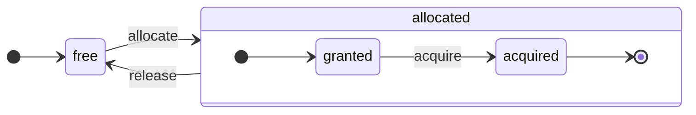

# 架构概述

ClickHouse 是一个真正的列式 DBMS。数据按列存储，并在执行数组（向量或列的块）时进行处理。只要可能，就会在数组上调度操作，而不是单个值上。这被称为“向量化查询执行”，它有助于降低实际数据处理的成本。

这个想法并不新颖。它可以追溯到 `APL`（一种编程语言，1957 年）及其后代：`A +`（APL 方言）、`J`（1990 年）、`K`（1993 年）和 `Q`（Kx Systems 的编程语言，2003 年）。数组编程在科学数据处理中被使用。这个想法在关系数据库中也并不是新鲜事物。例如，它在 `VectorWise` 系统（也称为 Actian Corporation 的 Actian Vector 分析数据库）中被使用。

加速查询处理有两种不同的方法：向量化查询执行和运行时代码生成。后者消除了所有间接性和动态调度。这两种方法没有哪种严格地优于另一种。当它融合多种操作并充分利用 CPU 执行单元和管道时，运行时代码生成可能会更好。向量化查询执行可能不太实际，因为它涉及到必须写入缓存并读取的临时向量。如果临时数据无法适配 L2 缓存，这就成了一个问题。但向量化查询执行更容易利用 CPU 的 SIMD 能力。我们朋友写的一篇 [研究论文](http://15721.courses.cs.cmu.edu/spring2016/papers/p5-sompolski.pdf) 表明，结合这两种方法是更好的选择。ClickHouse 使用向量化查询执行，并对运行时代码生成有有限的初始支持。

## 列 {#columns}

`IColumn` 接口用于表示内存中的列（实际上是列的块）。此接口提供辅助方法用于实现各种关系运算符。几乎所有操作都是不可变的：它们不修改原始列，而是创建一个新的修改过的列。例如，`IColumn :: filter` 方法接受一个筛选字节掩码。它用于 `WHERE` 和 `HAVING` 关系运算符。其他示例：`IColumn :: permute` 方法支持 `ORDER BY`，`IColumn :: cut` 方法支持 `LIMIT`。

各种 `IColumn` 的实现（`ColumnUInt8`、`ColumnString` 等）负责列的内存布局。内存布局通常是一个连续的数组。对于整数类型的列，它只是一个连续的数组，如 `std :: vector`。对于 `String` 和 `Array` 列，它们是两个向量：一个是所有数组元素，连续存放，另一个是每个数组开始位置的偏移。还有 `ColumnConst`，它在内存中仅存储一个值，但看起来像列。

## 字段 {#field}

然而，也可以处理单个值。为了表示一个单独的值，使用 `Field`。`Field` 只是 `UInt64`、`Int64`、`Float64`、`String` 和 `Array` 的一个带标签的联合体。`IColumn` 具有 `operator []` 方法，可以获取第 n 个值作为 `Field`，并且 `insert` 方法将 `Field` 附加到列的末尾。这些方法不是非常高效，因为它们涉及到处理表示单个值的临时 `Field` 对象。有更高效的方法，例如 `insertFrom`、`insertRangeFrom` 等。

`Field` 对表的具体数据类型没有足够的信息。例如，`UInt8`、`UInt16`、`UInt32` 和 `UInt64` 在 `Field` 中都是以 `UInt64` 表示。

## 漏斗抽象 {#leaky-abstractions}

`IColumn` 具有用于常见关系数据转换的方法，但它们并不能满足所有需求。例如，`ColumnUInt64` 没有计算两个列之和的方法，而 `ColumnString` 没有运行子串搜索的方法。这些无数的例程都是在 `IColumn` 之外实现的。

可以使用 `IColumn` 方法提取 `Field` 值，以通用但不高效的方式实现列上的各种函数，或者使用对特定 `IColumn` 实现内部内存布局的知识以专业的方式实现它。通过将函数强制转换为特定的 `IColumn` 类型，并直接处理内部表示来实现。例如，`ColumnUInt64` 有 `getData` 方法，它返回对内部数组的引用，然后一个单独的例程直接读取或填充该数组。我们有“漏斗抽象”，以便允许各种例程的高效特化。

## 数据类型 {#data_types}

`IDataType` 负责序列化和反序列化：用于以二进制或文本形式读取和写入列块或单个值。`IDataType` 与表中的数据类型直接对应。例如，有 `DataTypeUInt32`、`DataTypeDateTime`、`DataTypeString` 等。

`IDataType` 和 `IColumn` 之间的关系相对较弱。不同的数据类型可以由相同的 `IColumn` 实现表示。例如，`DataTypeUInt32` 和 `DataTypeDateTime` 都由 `ColumnUInt32` 或 `ColumnConstUInt32` 表示。此外，相同的数据类型可以由不同的 `IColumn` 实现表示。例如，`DataTypeUInt8` 可以由 `ColumnUInt8` 或 `ColumnConstUInt8` 表示。

`IDataType` 仅存储元数据。例如，`DataTypeUInt8` 完全不存储任何内容（除了虚拟指针 `vptr`），而 `DataTypeFixedString` 仅存储 `N`（固定大小字符串的大小）。

`IDataType` 有多种数据格式的辅助方法。例如，序列化带有可能引用的值的方法、为 JSON 序列化值的方法以及作为 XML 格式的一部分序列化值的方法。与数据格式没有直接对应。例如，不同的数据格式 `Pretty` 和 `TabSeparated` 可以使用 `IDataType` 接口中的相同 `serializeTextEscaped` 辅助方法。

## 块 {#block}

`Block` 是表示内存中表的子集（块）的容器。它仅仅是一组三元组：(IColumn, IDataType, 列名)。在查询执行期间，数据通过 `Block` 进行处理。如果我们有一个 `Block`，则我们有数据（在 `IColumn` 对象中），我们有其类型的信息（在 `IDataType` 中），该信息告诉我们如何处理该列，并且我们有列名。列名可以是表的原始列名，也可以是为获取计算临时结果而分配的某些人工名称。

当我们在块中的列上计算某个函数时，我们将另一个列与其结果添加到该块中，我们不接触函数参数的列，因为操作是不可变的。之后，可以从块中删除不需要的列，但不能修改它。这样做方便消除公共子表达式。

块是为每个处理过的数据块创建的。请注意，对于相同类型的计算，列名和类型在不同块中保持相同，只有列数据发生变化。将块数据与块头分开是更好的，因为小块大小对复制 shared_ptr 和列名的临时字符串产生较大的开销。

## 处理器 {#processors}

请参见 [https://github.com/ClickHouse/ClickHouse/blob/master/src/Processors/IProcessor.h](https://github.com/ClickHouse/ClickHouse/blob/master/src/Processors/IProcessor.h) 中的描述。

## 格式 {#formats}

数据格式通过处理器实现。

## I/O {#io}

对于字节导向的输入/输出，有 `ReadBuffer` 和 `WriteBuffer` 抽象类。它们被用来替代 C++ 的 `iostream`。不要担心：每个成熟的 C++ 项目出于良好的理由使用其他东西，而不是 `iostream`。

`ReadBuffer` 和 `WriteBuffer` 只是一个连续的缓冲区和一个指向该缓冲区中位置的游标。实现可以拥有或不拥有缓冲区的内存。有一个虚拟方法用于用以下数据填充缓冲区（对于 `ReadBuffer`），或者将缓冲区刷新到某处（对于 `WriteBuffer`）。这些虚拟方法很少被调用。

`ReadBuffer`/`WriteBuffer` 的实现用于处理文件和文件描述符以及网络套接字，用于实现压缩（`CompressedWriteBuffer` 初始化时接收另一个 WriteBuffer，并在将数据写入其中之前执行压缩），以及其他用途——名称 `ConcatReadBuffer`、`LimitReadBuffer` 和 `HashingWriteBuffer` 自说明了。

Read/WriteBuffers 仅处理字节。`ReadHelpers` 和 `WriteHelpers` 头文件中有用于帮助格式化输入/输出的函数。例如，有写入十进制格式数字的辅助函数。

让我们检查一下当您想要以 `JSON` 格式将结果集合写入 stdout 时发生的事情。
您已经准备好从拉取 `QueryPipeline` 中获取结果集。
首先，您创建一个 `WriteBufferFromFileDescriptor(STDOUT_FILENO)`，以将字节写入 stdout。
接下来，您将来自查询管道的结果连接到 `JSONRowOutputFormat`，它使用该 `WriteBuffer` 初始化，以将行以 `JSON` 格式写入 stdout。
这可以通过 `complete` 方法完成，该方法将拉取的 `QueryPipeline` 转换为已完成的 `QueryPipeline`。
内部，`JSONRowOutputFormat` 将写入各种 JSON 分隔符，并调用 `IDataType::serializeTextJSON` 方法，传入 `IColumn` 的引用和行号作为参数。因此，`IDataType::serializeTextJSON` 将调用 `WriteHelpers.h` 中的方法：例如，对数值类型使用 `writeText`，对 `DataTypeString` 使用 `writeJSONString`。

## 表 {#tables}

`IStorage` 接口表示表。该接口的不同实现是不同的表引擎。例如，`StorageMergeTree`、`StorageMemory` 等。这些类的实例只是表。

在 `IStorage` 中的关键方法是 `read` 和 `write`，以及其他方法，如 `alter`、`rename` 和 `drop`。`read` 方法接受以下参数：从表中读取的列集、要考虑的 `AST` 查询以及所需的流数量。它返回一个 `Pipe`。

在大多数情况下，`read` 方法仅负责从表中读取指定列，而不进行任何进一步的数据处理。
所有后续的数据处理由管道的另一个部分处理，超出了 `IStorage` 的责任。

但有一些显著的例外：

- `AST` 查询被传递给 `read` 方法，表引擎可以使用它来推导索引使用情况，并从表中读取更少的数据。
- 有时，表引擎可以将数据处理到特定阶段。例如，`StorageDistributed` 可以将查询发送到远程服务器，要求它们处理数据到一个阶段，在这个阶段，来自不同远程服务器的数据可以合并，然后返回预处理的数据。查询解释器随后完成数据处理。

表的 `read` 方法可以返回一个由多个 `Processors` 组成的 `Pipe`。这些 `Processors` 可以并行读取表。
然后，您可以将这些处理器与各种其他转换（如表达式评估或过滤）连接，这些转换可以独立计算。
然后，在它们的顶部创建一个 `QueryPipeline`，并通过 `PipelineExecutor` 执行它。

还有 `TableFunction`。这些是返回临时 `IStorage` 对象的函数，用于查询的 `FROM` 子句。

要快速了解如何实现您的表引擎，可以查看一些简单的，例如 `StorageMemory` 或 `StorageTinyLog`。

> 作为 `read` 方法的结果，`IStorage` 返回 `QueryProcessingStage` ——有关查询的哪些部分已经在存储中计算的信息。

## 解析器 {#parsers}

手写的递归下降解析器解析查询。例如，`ParserSelectQuery` 只是递归地调用查询的不同部分的基础解析器。解析器创建一个 `AST`。`AST` 由节点表示，这些节点是 `IAST` 的实例。

> 出于历史原因，不使用解析器生成器。

## 解释器 {#interpreters}

解释器负责从 AST 创建查询执行管道。有简单的解释器，例如 `InterpreterExistsQuery` 和 `InterpreterDropQuery`，以及更复杂的 `InterpreterSelectQuery`。

查询执行管道是能够接受和生成块（具有特定类型的列集）的处理器的组合。
一个处理器通过端口进行通信，并且可以有多个输入端口和多个输出端口。
更详细的描述可以在 [src/Processors/IProcessor.h](https://github.com/ClickHouse/ClickHouse/blob/master/src/Processors/IProcessor.h) 中找到。

例如，解析 `SELECT` 查询的结果是一个“拉取型” `QueryPipeline`，它有一个特殊的输出端口，从中读取结果集。
`INSERT` 查询的结果是一个“推送型” `QueryPipeline`，它有一个输入端口用于写入插入数据。
而解析 `INSERT SELECT` 查询的结果是一个“完成型” `QueryPipeline`，它没有输入或输出，但能够同时将数据从 `SELECT` 复制到 `INSERT`。

`InterpreterSelectQuery` 使用 `ExpressionAnalyzer` 和 `ExpressionActions` 机制进行查询分析和转换。这是查询的绝大多数基于规则的优化都会进行的地方。`ExpressionAnalyzer` 目前非常混乱，需要重写：各种查询转换和优化应该提取到独立的类中，以便实现模块化查询的转换。

为了解决解释器中存在的问题，开发了新的 `InterpreterSelectQueryAnalyzer`。这是 `InterpreterSelectQuery` 的新版本，它不使用 `ExpressionAnalyzer`，并在 `AST` 和 `QueryPipeline` 之间引入了一层额外的抽象层，称为 `QueryTree`。它已经完全准备好在生产中使用，但为了安全起见，可以通过将 `enable_analyzer` 设置为 `false` 来关闭它。

## 函数 {#functions}

有普通函数和聚合函数。有关聚合函数，请参阅下一部分。

普通函数不会改变行数——它们的工作方式就像是独立处理每一行。实际上，函数并不是针对单独的行调用，而是针对数据的 `Block` 调用，以实现向量化查询执行。

还有一些杂项函数，例如 [blockSize](/sql-reference/functions/other-functions#blockSize)、[rowNumberInBlock](/sql-reference/functions/other-functions#rowNumberInBlock) 和 [runningAccumulate](/sql-reference/functions/other-functions#runningaccumulate），利用块处理并违反行的独立性。

ClickHouse 有强类型，因此没有隐式类型转换。如果函数不支持特定类型的组合，它将引发异常。但函数可以针对许多不同类型的组合（重载）工作。例如，`plus` 函数（用于实现 `+` 运算符）可以对任何组合的数值类型工作：`UInt8` + `Float32`、`UInt16` + `Int8`，等等。同时，一些可变参数函数可以接受任意数量的参数，例如 `concat` 函数。

实现函数可能会略显不便，因为函数会显式地调度受支持的数据类型和受支持的 `IColumns`。例如，`plus` 函数会通过实例化 C++ 模板为每种数值类型组合生成代码，包括恒定或非常量的左/右参数。

这是实现运行时代码生成以避免模板代码膨胀的绝佳场所。此外，它使得可以添加如融合乘法加或在一次循环迭代中进行多重比较等融合函数。

由于向量化查询执行，函数不会短路。例如，如果您写 `WHERE f(x) AND g(y)`，即使对于 `f(x)` 为零的行，两个条件都会被计算（除非 `f(x)` 是零常量表达式）。但如果 `f(x)` 条件的选择性很高，而计算 `f(x)` 的成本远低于计算 `g(y)` 的成本，那么最好实现多次计算。首先计算 `f(x)`，然后根据结果筛选列，最后仅针对较小的、经过筛选的数据块计算 `g(y)`。

## 聚合函数 {#aggregate-functions}

聚合函数是有状态的函数。它们将传递的值累积到某种状态中，并允许您从该状态中获取结果。它们由 `IAggregateFunction` 接口管理。状态可以相当简单（`AggregateFunctionCount` 的状态只是一个 `UInt64` 值），也可以相当复杂（`AggregateFunctionUniqCombined` 的状态是一个线性数组、哈希表和 `HyperLogLog` 概率数据结构的组合）。

状态在 `Arena`（内存池）中分配，以处理在执行高基数 `GROUP BY` 查询时的多个状态。状态可以具有非平凡的构造函数和析构函数：例如，复杂的聚合状态可以自我分配额外的内存。创建和销毁状态时需要一些注意，以及正确传递它们的所有权和销毁顺序。

聚合状态可以序列化和反序列化，以便在分布式查询执行期间通过网络传递，或者在 RAM 不足的情况下将其写入磁盘。它们甚至可以存储在具有 `DataTypeAggregateFunction` 的表中，以允许数据的增量聚合。

> 目前聚合函数状态的序列化数据格式未版本化。如果聚合状态仅暂时存储，这没有问题。但我们有 `AggregatingMergeTree` 表引擎用于增量聚合，人们已经在生产中使用它。这就是未来更改任何聚合函数序列化格式时需要向后兼容的原因。

## 服务器 {#server}

服务器实现了几种不同的接口：

- 针对任何外部客户端的 HTTP 接口。
- 针对本地 ClickHouse 客户端和在分布式查询执行期间跨服务器通信的 TCP 接口。
- 用于复制的数据传输接口。

在内部，它只是一个原始的多线程服务器，没有协程或纤程。由于服务器并不是为了处理高频率的简单查询而设计的，而是为了处理相对低频的复杂查询，因此每个查询都可以处理大量用于分析的数据。

服务器用查询执行所需的环境初始化 `Context` 类：可用数据库、用户及访问权限、设置、集群、进程列表、查询日志等列表。解释器使用这个环境。

我们为服务器 TCP 协议维护完整的向前和向后兼容性：旧客户端可以与新服务器通信，新客户端可以与旧服务器通信。但是，我们不想永远维护它，并且在大约一年后将删除对旧版本的支持。

:::note
对于大多数外部应用，我们建议使用 HTTP 接口，因为它简单且易于使用。TCP 协议与内部数据结构更紧密关联：它使用内部格式传递数据块，并使用自定义框架处理压缩数据。我们没有发布该协议的 C 库，因为它需要链接 ClickHouse 大部分代码库，这并不实际。
:::

## 配置 {#configuration}

ClickHouse 服务器基于 POCO C++ 库，并使用 `Poco::Util::AbstractConfiguration` 来表示其配置。配置由 `Poco::Util::ServerApplication` 类持有，该类继承自 `DaemonBase` 类，而后者又由实现 clickhouse-server 的 `DB::Server` 类继承。因此，可以通过 `ServerApplication::config()` 方法访问配置。

配置从多个文件（XML 或 YAML 格式）读取，并由 `ConfigProcessor` 类合并为单个 `AbstractConfiguration`。配置在服务器启动时加载，如果其中一个配置文件被更新、删除或添加，可以稍后重新加载。`ConfigReloader` 类负责定期监视这些更改以及重新加载过程。`SYSTEM RELOAD CONFIG` 查询也会触发配置的重新加载。

对于查询和其他子系统，`Server` 配置可以通过 `Context::getConfigRef()` 方法访问。每个能够在不重启服务器的情况下重新加载其配置的子系统应该在 `Server::main()` 方法中注册自身的重新加载回调。请注意，如果较新的配置存在错误，大多数子系统将忽略新配置，记录警告信息并继续使用之前加载的配置。由于 `AbstractConfiguration` 的性质，无法传递对特定部分的引用，因此通常使用 `String config_prefix`。

## 线程和作业 {#threads-and-jobs}

为了执行查询和进行附加活动，ClickHouse 从线程池中分配线程，以避免频繁的线程创建和销毁。根据作业的目的和结构，有几个线程池可供选择：
* 服务器池用于传入的客户端会话。
* 全局线程池用于一般目的作业、后台活动和独立线程。
* I/O 线程池用于大部分被阻塞在某些 I/O 上且不是 CPU 密集型的作业。
* 背景池用于定期任务。
* 预抢占任务的池，这些任务可以拆分成步骤。

服务器池是 `Poco::ThreadPool` 类实例，在 `Server::main()` 方法中定义。它最多可以拥有 `max_connection` 个线程。每个线程专注于一个活跃的连接。

全局线程池是 `GlobalThreadPool` 单例类。要从中分配线程，请使用 `ThreadFromGlobalPool`。它的接口类似于 `std::thread`，但从全局池中获取线程并进行所有必要的初始化。它配置了以下设置：
* `max_thread_pool_size` - 池中线程数的限制。
* `max_thread_pool_free_size` - 等待新作业的空闲线程数的限制。
* `thread_pool_queue_size` - 已调度作业数的限制。

全局池是通用的，下面描述的所有池都是在此基础上实现的。这可以被视为池的层次结构。任何特定的池都从全局池中获取其线程，使用 `ThreadPool` 类。因此，任何特定池的主要目的是对同时作业数量施加限制并进行作业调度。如果调度的作业数量超过池中的线程数，`ThreadPool` 将按优先级将作业积累在队列中。每个作业都有一个整数优先级。默认优先级为零。所有优先级值较高的作业在任何优先级值较低的作业之前启动。但在已执行的作业之间没有区别，因此优先级仅在池过载时才重要。

I/O 线程池被实现为一个普通的 `ThreadPool`，可以通过 `IOThreadPool::get()` 方法访问。它的配置方式与全局池相同，使用 `max_io_thread_pool_size`、`max_io_thread_pool_free_size` 和 `io_thread_pool_queue_size` 设置。I/O 线程池的主要目的在于避免由于 I/O 作业而耗尽全局池，这可能会阻止查询完全利用 CPU。备份到 S3 进行大量 I/O 操作，为了避免对交互式查询造成影响，专门配置了一个 `BackupsIOThreadPool`，使用 `max_backups_io_thread_pool_size`、`max_backups_io_thread_pool_free_size` 和 `backups_io_thread_pool_queue_size` 设置。

对于定期任务执行，存在 `BackgroundSchedulePool` 类。您可以使用 `BackgroundSchedulePool::TaskHolder` 对象注册任务，而池确保没有任务同时运行两次。它还允许您将任务的执行推迟到未来的特定时刻或暂时停用任务。全局 `Context` 提供了几个不同目的的此类实例。对于一般目的的任务，使用 `Context::getSchedulePool()`。

还有专门用于预抢占任务的线程池。这种 `IExecutableTask` 任务可以拆分为有序的作业序列，称为步骤。为了以允许短任务优先于长任务的方式调度这些任务，使用 `MergeTreeBackgroundExecutor`。顾名思义，它用于后台与 MergeTree 相关的操作，例如合并、突变、获取和移动。使用 `Context::getCommonExecutor()` 和其他类似方法可以获取池实例。

无论使用哪个池来完成作业，开始时都会为该作业创建 `ThreadStatus` 实例。它封装了所有每线程的信息：线程 id、查询 id、性能计数器、资源消耗和许多其他有用的数据。作业可以通过 `CurrentThread::get()` 调用通过线程本地指针访问，因此我们不需要将其传递给每个函数。

如果线程与查询执行相关联，那么附加到 `ThreadStatus` 的最重要的内容是查询上下文 `ContextPtr`。每个查询在服务器池中都有其主线程。主线程通过持有 `ThreadStatus::QueryScope query_scope(query_context)` 对象进行关联。主线程还创建一个表示为 `ThreadGroupStatus` 对象的线程组。在此查询执行过程中分配的每个额外线程都通过 `CurrentThread::attachTo(thread_group)` 调用附加到其线程组。线程组用于聚合事件计数器并追踪所有专用于单个任务的线程的内存消耗（有关更多信息，请参阅 `MemoryTracker` 和 `ProfileEvents::Counters` 类）。

## 并发控制 {#concurrency-control}

可以并行化的查询使用 `max_threads` 设置来限制自身。此设置的默认值选择方式使得单个查询能够最好地利用所有 CPU 核心。但是，如果存在多个并发查询，而每个查询都使用默认的 `max_threads` 设置值怎么办？那么查询将共享 CPU 资源。操作系统将确保公平性，通过不断切换线程，这会引入一些性能惩罚。`ConcurrencyControl` 有助于处理这种惩罚，避免分配大量线程。配置设置 `concurrent_threads_soft_limit_num` 用于限制在施加某种 CPU 压力之前，可以分配多少并发线程。

引入了 CPU `slot` 的概念。插槽是并发的单位：要运行线程，查询必须提前获取一个插槽并在线程停止时释放它。插槽的数量在服务器中是全局限制的。多个并发查询如果整体需求超过插槽总数，则相互竞争 CPU 插槽。`ConcurrencyControl` 负责通过以公平的方式进行 CPU 插槽调度来解决这种竞争。

每个插槽可以视为具有以下状态的独立状态机：
* `free`：插槽可供任何查询分配。
* `granted`：插槽被特定查询“分配”，但尚未被任何线程获取。
* `acquired`：插槽被特定查询“分配”并被某线程获取。

请注意，`allocated` 插槽可以处于两种不同的状态：`granted` 和 `acquired`。前者是一个过渡状态，实际上应该是短暂的（从插槽分配给查询的瞬间到该查询的任何线程运行扩展程序的时刻）。

`ConcurrencyControl` 的 API 包含以下功能：
1. 为查询创建资源分配：`auto slots = ConcurrencyControl::instance().allocate(1, max_threads);`。它将至少分配 1 而至多 `max_threads` 插槽。请注意，第一个插槽立即获得批准，但其余插槽可能稍后获得批准。因此限制是软性限制，因为每个查询将至少获得一个线程。
2. 对于每个线程，必须从分配中获取一个插槽：`while (auto slot = slots->tryAcquire()) spawnThread([slot = std::move(slot)] { ... });`。
3. 更新插槽的总数量：`ConcurrencyControl::setMaxConcurrency(concurrent_threads_soft_limit_num)`。可以在运行时进行，无需重新启动服务器。

此 API 允许查询至少以一个线程开始（在 CPU 压力存在时），然后再扩展到 `max_threads`。

## 分布式查询执行 {#distributed-query-execution}

集群设置中的服务器大多是独立的。您可以在集群中的一个或所有服务器上创建一个 `Distributed` 表。`Distributed` 表本身不存储数据——它仅提供对集群多个节点上所有本地表的“视图”。当您从 `Distributed` 表中 SELECT 时，它会重写该查询，根据负载均衡设置选择远程节点，并将查询发送给它们。`Distributed` 表请求远程服务器处理查询，直到中间结果来自不同服务器可以合并的阶段。然后它接收中间结果并将其合并。分布式表尽力将尽可能多的工作分配给远程服务器，并且不会在网络上发送过多的中间数据。

当您在 IN 或 JOIN 子句中有子查询，并且每个子查询都使用 `Distributed` 表时，事情变得更复杂。我们有不同的策略来执行这些查询。

分布式查询执行没有全局查询计划。每个节点都有其本地查询计划，负责其部分工作。我们只有简单的单遍分布式查询执行：我们将查询发送给远程节点，然后合并结果。但对于具有高基数 `GROUP BY` 或大量 JOIN 的临时数据的复杂查询，这不可行。在这种情况下，我们需要在服务器之间“洗牌”数据，这需要额外的协调。ClickHouse 不支持这种类型的查询执行，我们需要对此进行改进。

## Merge tree {#merge-tree}

`MergeTree` 是一类支持通过主键索引的存储引擎。主键可以是任意的列或表达式的元组。`MergeTree` 表中的数据存储在 "parts" 中。每个部分按主键顺序存储数据，因此数据按主键元组的字典序排列。所有表列都存储在这些部分中的单独 `column.bin` 文件中。这些文件由压缩块组成。每个块通常为 64 KB 到 1 MB 的未压缩数据，具体取决于平均值的大小。这些块由紧密排列的列值组成。每列的列值按相同的顺序排列（主键定义了顺序），因此当你按多个列迭代时，可以获得对应行的值。

主键本身是 "稀疏" 的。它并不指向每一行，而仅指向一些数据范围。一个单独的 `primary.idx` 文件存储每 N 行的主键值，其中 N 被称为 `index_granularity`（通常为 N = 8192）。另外，对于每一列，我们有 `column.mrk` 文件，其中存储了 "marks"，这些是数据文件中每 N 行的偏移量。每个标记都是一对：文件中压缩块开始的偏移位置，以及解压缩块中数据开始的偏移位置。通常，压缩块根据标记对齐，而解压缩块中的偏移为零。`primary.idx` 的数据始终驻留在内存中，`column.mrk` 文件的数据则被缓存。

当我们想从 `MergeTree` 的某个部分读取数据时，我们查看 `primary.idx` 数据并定位可能包含请求数据的范围，然后查看 `column.mrk` 数据并计算从哪些范围开始读取的偏移量。由于稀疏性，可能会读取额外的数据。ClickHouse 并不适合高负载的简单点查询，因为每个键都必须读取整个 `index_granularity` 行的范围，并且每列的整个压缩块必须解压缩。我们使索引稀疏是因为必须能够在单台服务器上维护数万亿行，而不会对索引产生显著的内存消耗。此外，由于主键是稀疏的，它并不唯一：在 INSERT 时无法检查表中键的存在。表中可以有多行相同的键。

当你 `INSERT` 一堆数据到 `MergeTree` 中时，这一堆数据会按主键顺序排序并形成一个新的部分。后台线程会定期选择一些部分并将它们合并成一个已排序的部分，以保持部分的数量相对较低。这就是它被称为 `MergeTree` 的原因。当然，合并会导致 "写放大"。所有部分都是不可变的：它们只会被创建和删除，而不会被修改。当执行 SELECT 时，它持有该表的快照（部分集合）。在合并后，我们还会保留旧部分一段时间，以便在故障后更容易恢复，因此如果我们发现某个合并的部分可能损坏，我们可以用其源部分替换它。

`MergeTree` 不是 LSM 树，因为它不包含 MEMTABLE 和 LOG：插入的数据直接写入文件系统。这种行为使 MergeTree 更适合批量插入数据。因此，频繁插入少量行并不适合 MergeTree。例如，每秒插入几行是可以的，但每秒插入一千次对 MergeTree 来说并不理想。然而，对于小插入，有一种异步插入模式来克服这个限制。我们这样做是为了简单起见，而且因为我们的应用程序中已经在批量插入数据。

有些 MergeTree 引擎在后台合并时会执行额外的工作。例如 `CollapsingMergeTree` 和 `AggregatingMergeTree`。这可以视为对更新的特殊支持。请记住，这并不是真正的更新，因为用户通常无法控制后台合并执行的时间，而 `MergeTree` 表中的数据几乎总是存储在多个部分中，而不是完全合并的形式。
## Replication {#replication}

ClickHouse 中的复制可以按表配置。你可以在同一服务器上有一些复制表和一些非复制表。你还可以以不同的方式复制表，例如，一个表具有两因素复制，另一个表具有三因素复制。

复制是在 `ReplicatedMergeTree` 存储引擎中实现的。在 `ZooKeeper` 中的路径作为存储引擎的参数指定。所有在 `ZooKeeper` 中具有相同路径的表都会成为彼此的副本：它们同步其数据并保持一致性。副本可以通过创建或删除表动态添加或删除。

复制使用异步多主方案。你可以将数据插入任何与 `ZooKeeper` 建立会话的副本中，并且数据会异步复制到所有其他副本。由于 ClickHouse 不支持 UPDATE，因此复制是无冲突的。由于默认情况下没有插入的法定确认，刚插入的数据可能在一个节点失败时丢失。插入法定可以使用 `insert_quorum` 设置启用。

复制的元数据存储在 ZooKeeper 中。有一个复制日志列出了要执行的操作。操作包括：获取部分；合并部分；丢弃分区等等。每个副本将复制复制日志到其队列中，然后执行队列中的操作。例如，在插入时，日志中会创建 "获取部分" 操作，然后每个副本下载该部分。合并在副本之间协调，以获得字节相同的结果。所有副本的所有部分以相同的方式合并。一个领导者首先发起新的合并，并将 "合并部分" 操作写入日志。多个副本（或所有副本）可以同时成为领导者。可以使用 `merge_tree` 设置 `replicated_can_become_leader` 来防止副本成为领导者。领导者负责安排后台合并。

复制是物理的：节点之间只传输压缩部分，而不是查询。合并通常在每个副本上独立处理，以降低网络成本，避免网络放大。只有在显著的复制滞后情况下，大的合并部分才会通过网络发送。

此外，每个副本在 ZooKeeper 中存储其状态作为部分的集合及其校验和。当本地文件系统上的状态与 ZooKeeper 中的参考状态不一致时，副本通过从其他副本下载缺失和损坏的部分来恢复其一致性。当本地文件系统中存在意外或损坏的数据时，ClickHouse 不会删除它，而是将其移动到单独的目录并忘记它。

:::note
ClickHouse 集群由独立的分片组成，每个分片由副本组成。集群是 **非弹性的**，因此在添加新分片后，数据不会在分片之间自动重新平衡。相反，集群负载应该调整为不均匀。这种实现让你拥有更多的控制权，并且对于相对较小的集群（如数十个节点）是可以接受的。但对于我们在生产中使用的数百个节点的集群，这种方法就变成了一个显著的缺点。我们应该实现一种跨集群的表引擎，具有动态复制区域，能够在集群之间自动拆分和均衡。
:::
