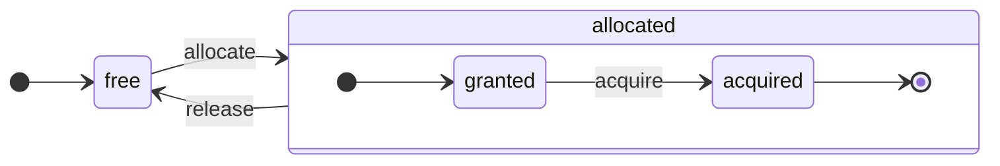

# 架构概览 {#architecture-overview}

ClickHouse 是一个真正的列式 DBMS。数据按列存储，并在执行过程中以数组（向量或列块）的形式处理。
在可能的情况下，操作会尽量在数组上执行，而不是针对单个值。
这被称为“向量化查询执行（vectorized query execution）”，有助于降低实际数据处理的成本。

这一理念并不新。
它可以追溯到 `APL`（A programming language，1957 年）及其后代：`A+`（APL 方言）、`J`（1990 年）、`K`（1993 年）和 `Q`（来自 Kx Systems 的编程语言，2003 年）。
数组编程广泛用于科学数据处理。在关系型数据库中，这一理念同样不是新鲜事。例如，它被用于 `VectorWise` 系统（也称为 Actian Corporation 的 Actian Vector Analytic Database）。

加速查询处理有两种不同的方法：向量化查询执行和运行时代码生成。后者移除了所有间接寻址和动态派发。这两种方法都没有绝对的优劣之分。当运行时代码生成将许多操作融合在一起，从而充分利用 CPU 执行单元和流水线时，它可能表现更好。向量化查询执行在实践中可能不那么理想，因为它会产生必须写入缓存再读回的临时向量。如果这些临时数据无法放入 L2 缓存，就会产生问题。但向量化查询执行更容易利用 CPU 的 SIMD 能力。一篇由我们朋友撰写的[研究论文](http://15721.courses.cs.cmu.edu/spring2016/papers/p5-sompolski.pdf)表明，最好将两种方法结合使用。ClickHouse 采用向量化查询执行，并对运行时代码生成提供了有限的初始支持。

## 列 {#columns}

`IColumn` 接口用于在内存中表示列（严格来说，是列的分块）。该接口提供了用于实现各种关系运算符的辅助方法。几乎所有操作都是不可变的：它们不会修改原始列，而是创建一个新的已修改列。例如，`IColumn::filter` 方法接受一个用于过滤的字节掩码，用于实现 `WHERE` 和 `HAVING` 关系运算符。其他示例包括：用于支持 `ORDER BY` 的 `IColumn::permute` 方法，以及用于支持 `LIMIT` 的 `IColumn::cut` 方法。

各种 `IColumn` 的实现（`ColumnUInt8`、`ColumnString` 等）负责列的内存布局。内存布局通常是一个连续数组。对于整数类型的列，它就是一个连续数组，类似于 `std::vector`。对于 `String` 和 `Array` 列，它由两个向量组成：一个用于存放所有数组元素，并连续排布；另一个用于存放每个数组起始位置的偏移量。还有一种 `ColumnConst`，它在内存中只存储一个值，但对外表现得像一列。

## Field {#field}

不过，也可以处理单个值。要表示单个值，会使用 `Field`。`Field` 只是一个由 `UInt64`、`Int64`、`Float64`、`String` 和 `Array` 组成的可判别联合类型。`IColumn` 提供 `operator []` 方法，用于以 `Field` 的形式获取第 n 个值，以及 `insert` 方法，用于在列末尾追加一个 `Field`。这些方法的效率并不高，因为它们需要处理表示单个值的临时 `Field` 对象。还有一些更高效的方法，例如 `insertFrom`、`insertRangeFrom` 等。

`Field` 不包含关于表中特定数据类型的充分信息。例如，`UInt8`、`UInt16`、`UInt32` 和 `UInt64` 在 `Field` 中都会表示为 `UInt64`。

## 抽象泄漏 {#leaky-abstractions}

`IColumn` 提供了一些用于数据常见关系变换的方法，但它们并不能满足所有需求。比如，`ColumnUInt64` 没有用于计算两列求和的方法，而 `ColumnString` 没有用于执行子串搜索的方法。这些数不胜数的例程都在 `IColumn` 之外实现。

针对列的各种函数，既可以使用 `IColumn` 提供的方法来提取 `Field` 值，以通用但低效的方式实现，也可以利用特定 `IColumn` 实现中数据在内存中的内部布局知识，以专门化的方式实现。后者是通过将列对象强制转换为特定的 `IColumn` 类型并直接处理其内部表示来完成的。例如，`ColumnUInt64` 具有 `getData` 方法，它返回对内部数组的引用，然后单独的例程可以直接读取或填充该数组。我们采用这种“抽象泄漏”的方式，以便对各种例程进行高效的专门化实现。

## 数据类型 {#data_types}

`IDataType` 负责序列化和反序列化：用于以二进制或文本形式读写列块或单个值。`IDataType` 与表中的数据类型直接一一对应。例如，有 `DataTypeUInt32`、`DataTypeDateTime`、`DataTypeString` 等。

`IDataType` 和 `IColumn` 之间只是一种松散关系。不同的数据类型在内存中可以由相同的 `IColumn` 实现来表示。例如，`DataTypeUInt32` 和 `DataTypeDateTime` 都由 `ColumnUInt32` 或 `ColumnConstUInt32` 表示。此外，同一种数据类型也可以由不同的 `IColumn` 实现来表示。例如，`DataTypeUInt8` 可以由 `ColumnUInt8` 或 `ColumnConstUInt8` 表示。

`IDataType` 仅存储元数据。例如，`DataTypeUInt8` 根本不存储任何内容（虚指针 `vptr` 除外），而 `DataTypeFixedString` 只存储 `N`（定长字符串的长度）。

`IDataType` 为各种数据格式提供了辅助方法。例如，有用于将值序列化并在需要时加上引号、将值序列化为 JSON，以及在 XML 格式中序列化值的辅助方法。`IDataType` 与具体数据格式之间没有直接对应关系。例如，不同的数据格式 `Pretty` 和 `TabSeparated` 都可以使用 `IDataType` 接口中的同一个 `serializeTextEscaped` 辅助方法。

## Block {#block}

`Block` 是一个在内存中表示表的一个子集（数据块、chunk）的容器。它本质上是若干三元组的集合：`(IColumn, IDataType, column name)`。在查询执行过程中，数据是以 `Block` 为单位进行处理的。如果我们有一个 `Block`，我们就拥有数据（在 `IColumn` 对象中）、关于其类型的信息（在 `IDataType` 中，用来指示如何处理该列），以及列名。列名可以是表中的原始列名，也可以是用于存放计算临时结果的人工列名。

当我们在一个 Block 中对若干列计算某个函数时，会将该函数的结果作为新的列添加到 Block 中，而不会修改作为函数参数的原有列，因为这些操作是不可变的。之后，不再需要的列可以从 Block 中移除，但不能被修改。这种方式便于进行公共子表达式消除。

对于每一段被处理的数据 chunk，都会创建一个对应的 Block。请注意，对于相同类型的计算，不同 Block 之间的列名和类型保持一致，只有列数据发生变化。将 Block 的数据部分与 Block 头（header）分离更为合适，因为对于较小的 Block，大量用于复制 shared_ptr 和列名的临时字符串会带来较高的开销。

## 处理器 {#processors}

请参阅以下描述：[https://github.com/ClickHouse/ClickHouse/blob/master/src/Processors/IProcessor.h](https://github.com/ClickHouse/ClickHouse/blob/master/src/Processors/IProcessor.h)。

## 格式 {#formats}

数据格式由处理器实现。

## I/O {#io}

对于面向字节的输入/输出，有抽象类 `ReadBuffer` 和 `WriteBuffer`。它们用于替代 C++ 的 `iostream`。不用担心：几乎所有成熟的 C++ 项目出于充分的理由都不会直接使用 `iostream`。

`ReadBuffer` 和 `WriteBuffer` 本质上就是一个连续的缓冲区，以及一个指向该缓冲区当前位置的游标。具体实现可能拥有，也可能不拥有该缓冲区的内存。对于 `ReadBuffer`，有一个虚函数用于用后续数据填充缓冲区；对于 `WriteBuffer`，则有一个虚函数用于将缓冲区刷新到某个地方。这些虚函数很少被调用。

`ReadBuffer`/`WriteBuffer` 的实现用于处理文件、文件描述符和网络套接字，用于实现压缩（`CompressedWriteBuffer` 使用另一个 `WriteBuffer` 初始化，并在向其写入数据前执行压缩），以及其他用途——诸如 `ConcatReadBuffer`、`LimitReadBuffer`、`HashingWriteBuffer` 这样的名称本身就很直观。

Read/WriteBuffer 只处理字节。`ReadHelpers` 和 `WriteHelpers` 头文件中提供了一些辅助函数，用于进行带格式的输入/输出。例如，有一些辅助函数可以以十进制格式写出一个数字。

下面来看看，当你想将结果集以 `JSON` 格式写到 stdout 时会发生什么。
你已经有一个结果集，可以从拉取式的 `QueryPipeline` 中获取。
首先，你创建一个 `WriteBufferFromFileDescriptor(STDOUT_FILENO)`，用于向 stdout 写入字节。
接下来，你将查询管道的结果连接到 `JSONRowOutputFormat`，它使用该 `WriteBuffer` 进行初始化，从而将行以 `JSON` 格式写入 stdout。
这可以通过 `complete` 方法来完成，该方法会将一个拉取式的 `QueryPipeline` 转换为一个已完成的 `QueryPipeline`。
在内部，`JSONRowOutputFormat` 会写入各种 JSON 分隔符，并调用 `IDataType::serializeTextJSON` 方法，将对 `IColumn` 的引用以及行号作为参数传入。随后，`IDataType::serializeTextJSON` 会调用 `WriteHelpers.h` 中的某个方法：例如，对数值类型调用 `writeText`，对 `DataTypeString` 调用 `writeJSONString`。

## 表 {#tables}

`IStorage` 接口表示表对象。该接口的不同实现就是不同的表引擎，例如 `StorageMergeTree`、`StorageMemory` 等。这些类的实例就是具体的表。

`IStorage` 中的关键方法是 `read` 和 `write`，以及 `alter`、`rename`、`drop` 等其他方法。`read` 方法接受以下参数：要从表中读取的一组列、需要考虑的 `AST` 查询，以及期望的流数量。它返回一个 `Pipe`。

在大多数情况下，`read` 方法只负责从表中读取指定的列，而不负责任何后续的数据处理。
所有后续的数据处理都由管线的其他部分完成，这超出了 `IStorage` 的职责范围。

但也有一些显著的例外：

- `AST` 查询会传递给 `read` 方法，表引擎可以利用它来推导索引使用情况，从而减少从表中读取的数据量。
- 有时表引擎本身可以将数据处理到某个特定阶段。例如，`StorageDistributed` 可以将查询发送到远程服务器，让它们将数据处理到一个可以将不同远程服务器数据合并的阶段，并返回这些预处理的数据。随后由查询解释器完成数据处理。

表的 `read` 方法可以返回由多个 `Processor` 组成的 `Pipe`。这些 `Processor` 可以并行地从表中读取数据。
然后，你可以将这些 `Processor` 与各种其他转换（例如表达式计算或过滤）连接起来，这些转换可以独立计算。
接着，在它们之上创建一个 `QueryPipeline`，并通过 `PipelineExecutor` 来执行。

还存在 `TableFunction`。这些函数会返回一个临时的 `IStorage` 对象，用于在查询的 `FROM` 子句中使用。

要快速了解如何实现自己的表引擎，可以查看一些简单的实现，比如 `StorageMemory` 或 `StorageTinyLog`。

> 作为 `read` 方法的结果，`IStorage` 会返回 `QueryProcessingStage` —— 即关于查询的哪些部分已经在存储内部完成计算的信息。

## 解析器 {#parsers}

使用手写的递归下降解析器来解析查询。例如，`ParserSelectQuery` 只是递归调用用于解析查询各个部分的底层解析器。解析器会创建一个 `AST`。`AST` 由节点表示，这些节点是 `IAST` 的实例。

> 由于历史原因，没有使用解析器生成器。

## 解释器 {#interpreters}

解释器负责从 AST 创建查询执行流水线（query execution pipeline）。存在一些简单的解释器，例如 `InterpreterExistsQuery` 和 `InterpreterDropQuery`，以及更为复杂的 `InterpreterSelectQuery`。

查询执行流水线是由若干 processor 组合而成，这些 processor 可以消费和生成 chunk（具有特定类型的一组列）。
processor 通过端口进行通信，可以拥有多个输入端口和多个输出端口。
更详细的说明可以在 [src/Processors/IProcessor.h](https://github.com/ClickHouse/ClickHouse/blob/master/src/Processors/IProcessor.h) 中找到。

例如，对 `SELECT` 查询进行解释的结果是一个“pulling”类型的 `QueryPipeline`，它带有一个特殊的输出端口，用于读取结果集。
对 `INSERT` 查询进行解释的结果是一个“pushing”类型的 `QueryPipeline`，它带有一个输入端口，用于写入要插入的数据。
而对 `INSERT SELECT` 查询进行解释的结果则是一个“completed”类型的 `QueryPipeline`，它既没有输入端口也没有输出端口，但会同时将数据从 `SELECT` 复制到 `INSERT`。

`InterpreterSelectQuery` 使用 `ExpressionAnalyzer` 和 `ExpressionActions` 机制来进行查询分析和转换。大多数基于规则的查询优化都在这里完成。`ExpressionAnalyzer` 本身相当混乱，需要重写：应当将各类查询转换和优化提取到独立的类中，以便对查询进行模块化转换。

为了解决解释器中存在的问题，已经开发了一个新的 `InterpreterSelectQueryAnalyzer`。这是 `InterpreterSelectQuery` 的新版本，它不再使用 `ExpressionAnalyzer`，并在 `AST` 和 `QueryPipeline` 之间引入了一个额外的抽象层，称为 `QueryTree`。它已经完全可以在生产环境中使用，但如有需要，可以通过将 `enable_analyzer` 设置为 `false` 来将其关闭。

## 函数 {#functions}

函数分为普通函数和聚合函数。有关聚合函数，请参阅下一节。

普通函数不会改变行数——它们的工作方式好像在独立处理每一行。实际上，函数并不是针对单独的行调用的，而是针对数据的 `Block` 进行调用，以实现向量化查询执行。

有一些杂项函数，例如 [blockSize](/sql-reference/functions/other-functions#blockSize)、[rowNumberInBlock](/sql-reference/functions/other-functions#rowNumberInBlock) 和 [runningAccumulate](/sql-reference/functions/other-functions#runningAccumulate)，它们利用 Block 级处理并打破了行之间的独立性。

ClickHouse 具有强类型系统，因此不会进行隐式类型转换。如果某个函数不支持特定的类型组合，它会抛出异常。但函数可以（通过重载）支持许多不同的类型组合。例如，`plus` 函数（用于实现 `+` 运算符）适用于任意数值类型的组合：`UInt8` + `Float32`、`UInt16` + `Int8` 等等。另外，一些可变参数函数可以接受任意数量的参数，例如 `concat` 函数。

实现一个函数可能会稍显不便，因为函数需要显式派发所支持的数据类型和所支持的 `IColumns`。例如，`plus` 函数的代码是通过为每一种数值类型组合以及左、右参数是否为常量或非常量实例化 C++ 模板而生成的。

这里是实现运行时代码生成的绝佳位置，可以避免模板代码膨胀。同时，这也使得可以添加诸如融合乘加（fused multiply-add）之类的融合函数，或在一次循环迭代中执行多次比较。

在向量化查询执行模式下，函数不会进行短路求值。例如，如果你写 `WHERE f(x) AND g(y)`，即使在 `f(x)` 为零的行上（除非 `f(x)` 是零的常量表达式），两边也都会计算。但如果 `f(x)` 条件的选择性很高，且计算 `f(x)` 比计算 `g(y)` 便宜得多，那么最好实现多遍计算。它会先计算 `f(x)`，然后根据结果过滤列，再仅对更小的、已过滤的数据块计算 `g(y)`。

## 聚合函数 {#aggregate-functions}

聚合函数是有状态的函数。它们将传入的值累积到某种状态中，并允许你从该状态中获取结果。它们通过 `IAggregateFunction` 接口进行管理。状态可以非常简单（例如，`AggregateFunctionCount` 的状态只是一个 `UInt64` 值），也可以相当复杂（例如，`AggregateFunctionUniqCombined` 的状态是线性数组、哈希表和 `HyperLogLog` 概率数据结构的组合）。

在执行高基数的 `GROUP BY` 查询时，为了同时处理多个状态，这些状态会在 `Arena`（内存池）中分配。状态可以有非平凡的构造函数和析构函数：例如，复杂的聚合状态本身可能会额外分配内存。这就要求在创建和销毁状态时格外注意，正确传递其所有权，并保证正确的销毁顺序。

聚合状态可以被序列化和反序列化，以便在分布式查询执行期间通过网络传递，或者在内存（RAM）不足时写入磁盘。它们甚至可以存储在使用 `DataTypeAggregateFunction` 的表中，以实现数据的增量聚合。

> 目前聚合函数状态的序列化数据格式尚未进行版本管理。如果聚合状态只是临时存储，这是可以接受的。但我们有用于增量聚合的 `AggregatingMergeTree` 表引擎，并且已经有人在生产环境中使用它。这就是为什么在未来更改任意聚合函数的序列化格式时，必须保证向后兼容性。

## 服务器 {#server}

服务器实现了几种不同的接口：

- 面向任意外部客户端的 HTTP 接口。
- 面向原生 ClickHouse 客户端，以及在分布式查询执行期间进行跨服务器通信的 TCP 接口。
- 用于复制时进行数据传输的接口。

在内部，它只是一个较为基础的多线程服务器，没有协程或纤程。由于服务器的设计目标不是处理高频的简单查询，而是处理相对低频的复杂查询，因此每个查询都可以处理海量用于分析的数据。

服务器会初始化 `Context` 类，为查询执行提供必要的环境：可用数据库列表、用户及其访问权限、设置、集群、进程列表、查询日志等。解释器会使用这个环境。

我们对服务器的 TCP 协议保持完全的向后兼容和向前兼容：旧客户端可以与新服务器通信，新客户端也可以与旧服务器通信。但我们不打算无限期地维持这种兼容性，并会在大约一年后移除对旧版本的支持。

:::note
对于大多数外部应用程序，我们建议使用 HTTP 接口，因为它简单且易于使用。TCP 协议与内部数据结构的耦合更紧密：它使用内部格式来传递数据块，并为压缩数据使用自定义分帧。我们尚未为该协议发布 C 库，因为这需要链接 ClickHouse 代码库的大部分内容，在实践中不可行。
:::

## 配置 {#configuration}

ClickHouse Server 构建在 POCO C++ Libraries 之上，并使用 `Poco::Util::AbstractConfiguration` 来表示其配置。配置由 `Poco::Util::ServerApplication` 类持有，该类继承自 `DaemonBase`，而 `DaemonBase` 又被 `DB::Server` 类继承，`DB::Server` 实现了 clickhouse-server 本身。因此，可以通过 `ServerApplication::config()` 方法访问配置。

配置从多个文件（XML 或 YAML 格式）中读取，并由 `ConfigProcessor` 类合并为单个 `AbstractConfiguration`。配置在服务器启动时加载，如果某个配置文件被更新、删除或新增，则可以在之后重新加载。`ConfigReloader` 类负责定期监控这些变更并执行重载过程。执行 `SYSTEM RELOAD CONFIG` 查询也会触发配置重载。

对于 `Server` 之外的查询和子系统，可以使用 `Context::getConfigRef()` 方法访问配置。每个能够在不重启服务器的情况下重载其配置的子系统，都应在 `Server::main()` 方法中的重载回调中注册自身。请注意，如果新的配置存在错误，大多数子系统会忽略新配置、记录警告日志，并继续使用先前加载的配置。由于 `AbstractConfiguration` 的特性，无法传递指向特定配置节的引用，因此通常会改为使用 `String config_prefix`。

## 线程与作业 {#threads-and-jobs}

为了执行查询和处理辅助活动，ClickHouse 会从多个线程池之一中分配线程，以避免频繁创建和销毁线程。存在若干线程池，会根据作业的目的和结构进行选择：
* 用于接收客户端会话的服务器线程池。
* 用于通用作业、后台活动和独立线程的全局线程池。
* 用于主要被某些 IO 阻塞、且不消耗大量 CPU 的作业的 IO 线程池。
* 用于周期性任务的后台线程池。
* 用于可抢占、可拆分为多个步骤的任务的线程池。

服务器线程池是 `Server::main()` 方法中定义的 `Poco::ThreadPool` 类实例。它最多可以拥有 `max_connection` 个线程。每个线程专用于一个活动连接。

全局线程池是单例类 `GlobalThreadPool`。要从中分配线程，会使用 `ThreadFromGlobalPool`。它提供了类似于 `std::thread` 的接口，但会从全局线程池中获取线程并完成所有必要的初始化。其配置通过以下设置完成：
* `max_thread_pool_size` - 线程池中线程数量上限。
* `max_thread_pool_free_size` - 等待新作业的空闲线程数量上限。
* `thread_pool_queue_size` - 已调度作业数量上限。

全局线程池是通用的线程池，下面描述的所有线程池都基于它实现。可以将其视为一个分层的线程池体系。任何专用线程池都通过 `ThreadPool` 类从全局线程池获取线程。因此，任何专用线程池的主要目的是限制并发作业数并进行作业调度。如果调度的作业数多于池中的线程数，`ThreadPool` 会按优先级将作业排入一个队列中。每个作业都有一个整数优先级。默认优先级为零。所有优先级值更高的作业会在任何优先级更低的作业之前启动。但对于已经在执行的作业则没有差别，因此优先级只在线程池过载时才会起作用。

IO 线程池是一个简单的 `ThreadPool`，可通过 `IOThreadPool::get()` 方法获取。它的配置方式与全局线程池相同，使用 `max_io_thread_pool_size`、`max_io_thread_pool_free_size` 和 `io_thread_pool_queue_size` 设置。IO 线程池的主要目标是避免 IO 作业耗尽全局线程池，否则可能会阻止查询充分利用 CPU。备份到 S3 会执行大量 IO 操作，为了避免其对交互式查询的影响，提供了一个独立的 `BackupsIOThreadPool`，通过 `max_backups_io_thread_pool_size`、`max_backups_io_thread_pool_free_size` 和 `backups_io_thread_pool_queue_size` 进行配置。

对于周期性任务的执行，提供了 `BackgroundSchedulePool` 类。你可以使用 `BackgroundSchedulePool::TaskHolder` 对象注册任务，线程池会确保同一任务不会同时运行两个作业。它还允许你将任务执行推迟到未来的某个具体时刻，或临时停用该任务。全局 `Context` 为不同用途提供了该类的若干实例。对于通用任务，会使用 `Context::getSchedulePool()`。

同时也存在用于可抢占任务的专用线程池。这类 `IExecutableTask` 任务可以被拆分为有序的作业序列，称为步骤。为了以一种允许短任务优先于长任务的方式调度这些任务，会使用 `MergeTreeBackgroundExecutor`。顾名思义，它用于 MergeTree 相关的后台操作，例如合并、变更、拉取和移动。线程池实例可以通过 `Context::getCommonExecutor()` 及其他类似方法获取。

无论某个作业使用的是哪种线程池，在启动时都会为该作业创建一个 `ThreadStatus` 实例。它封装了所有线程级信息：线程 id、查询 id、性能计数器、资源消耗以及许多其他有用数据。作业可以通过 `CurrentThread::get()` 调用来使用线程局部指针访问该实例，因此我们不需要将它传递给每一个函数。

如果线程与查询执行有关，那么附加到 `ThreadStatus` 上最重要的内容是查询上下文 `ContextPtr`。每个查询在服务器线程池中都有其主线程。主线程通过持有一个 `ThreadStatus::QueryScope query_scope(query_context)` 对象来完成附加。主线程还会创建一个由 `ThreadGroupStatus` 对象表示的线程组。在该查询执行期间分配的每一个额外线程都会通过 `CurrentThread::attachTo(thread_group)` 调用附加到其线程组。线程组用于聚合性能事件计数器，并跟踪所有为单个任务服务的线程的内存消耗（更多信息参见 `MemoryTracker` 和 `ProfileEvents::Counters` 类）。

## 并发控制 {#concurrency-control}

可以并行执行的查询通过 `max_threads` 设置来限制自身的并发度。该设置的默认值经过选择，使单个查询能够以最佳方式利用所有 CPU 核心。但如果存在多个并发查询且每个查询都使用默认的 `max_threads` 设置值，会怎样？此时这些查询将共享 CPU 资源。操作系统会通过不断切换线程来保证公平性，而这会引入一定的性能损耗。`ConcurrencyControl` 用来应对这种损耗，并避免分配过多线程。配置项 `concurrent_threads_soft_limit_num` 用于限制在开始施加某种形式的 CPU 压力之前，最多可以分配多少并发线程。

这里引入了 CPU `slot`（槽位）的概念。槽位是并发的基本单位：要运行一个线程，对应的查询必须事先获取一个槽位，并在该线程结束时释放该槽位。服务器中槽位的数量在全局范围内受限。当总需求超过槽位总数时，多个并发查询会竞争 CPU 槽位。`ConcurrencyControl` 负责通过公平的 CPU 槽位调度来解决这种竞争。

每个槽位可以看作是一个独立的状态机，具有以下状态：

* `free`：槽位空闲，可被任意查询分配。
* `granted`：槽位已被特定查询分配（`allocated`），但尚未被任何线程获取。
* `acquired`：槽位已被特定查询分配（`allocated`），并已被某个线程获取。

注意，已分配（`allocated`）的槽位可以处于两种不同状态：`granted` 和 `acquired`。前者是一个过渡状态，按理说应当非常短暂（从槽位被分配给某个查询的瞬间，到该查询任一线程运行扩容过程的时刻）。

`ConcurrencyControl` 的 API 由以下函数组成：

1. 为查询创建资源分配：`auto slots = ConcurrencyControl::instance().allocate(1, max_threads);`。它会分配至少 1 个、至多 `max_threads` 个 slot。注意，第一个 slot 会立即分配，但其余的 slot 可能会在稍后才被分配。因此该限制是软限制，因为每个查询至少都会获得一个线程。
2. 对于每个线程，必须从这次分配中获取一个 slot：`while (auto slot = slots->tryAcquire()) spawnThread([slot = std::move(slot)] { ... });`。
3. 更新 slot 的总数量：`ConcurrencyControl::setMaxConcurrency(concurrent_threads_soft_limit_num)`。可以在运行时进行，无需重启服务器。

该 API 允许在存在 CPU 压力时，查询至少以一个线程启动，并在之后按需扩展到 `max_threads`。

## 分布式查询执行 {#distributed-query-execution}

集群中的各个服务器大多是相互独立的。你可以在集群中的某一台服务器或所有服务器上创建一个 `Distributed` 表。`Distributed` 表本身不存储数据——它只为集群中多个节点上的所有本地表提供一个“视图”。当你对 `Distributed` 表执行 SELECT 查询时，它会重写该查询，根据负载均衡设置选择远程节点，并将查询发送给这些节点。`Distributed` 表会请求远程服务器处理查询，直到生成可以在不同服务器之间进行合并的中间结果为止。然后，它接收这些中间结果并进行合并。`Distributed` 表会尽量将尽可能多的工作下推到远程服务器，并尽量减少通过网络传输的中间数据量。

当在 IN 或 JOIN 子句中存在子查询，而且每个子查询都使用 `Distributed` 表时，情况会变得更加复杂。对于此类查询，我们有不同的执行策略。

分布式查询执行没有全局查询计划。每个节点都仅针对其负责的那一部分拥有本地查询计划。我们目前只有简单的单次分布式查询执行：向远程节点发送查询，然后合并结果。但对于带有高基数 `GROUP BY` 的复杂查询，或包含大量 JOIN 临时数据的查询，这种方式是不可行的。在这种情况下，我们需要在服务器之间对数据进行“重新分布”（reshuffle），这就需要额外的协调。ClickHouse 目前不支持这类查询执行方式，我们仍需在这一方向上进行改进。

## Merge tree {#merge-tree}

`MergeTree` 是一类支持按主键建索引的存储引擎族。主键可以是由任意列或表达式组成的元组。`MergeTree` 表中的数据以「part」的形式存储。每个 part 中的数据都按照主键顺序存放，因此数据根据主键元组按字典序排序。表中的所有列在这些 part 中都分别存储在独立的 `column.bin` 文件里。文件由压缩块组成。每个块通常包含 64 KB 到 1 MB 的未压缩数据，具体取决于平均值大小。块由按顺序连续排列的列值构成。对每一列而言，列值的顺序都是相同的（由主键定义顺序），所以当你按多列迭代时，可以获取对应行的列值。

主键本身是「稀疏」的。它并不会定位到每一行，而只是定位到某些数据范围。单独的 `primary.idx` 文件为每第 N 行存储主键值，其中 N 称为 `index_granularity`（通常 N = 8192）。同时，对于每一列，我们有带有「mark」的 `column.mrk` 文件，用于保存数据文件中每第 N 行的偏移量。每个 mark 是一对值：文件中压缩块起始位置的偏移量，以及解压后块中数据起始位置的偏移量。通常，压缩块会按 mark 对齐，此时解压后块中的偏移量为零。`primary.idx` 的数据始终驻留在内存中，而 `column.mrk` 文件的数据会被缓存。

当我们要从 `MergeTree` 中的某个 part 读取数据时，会查看 `primary.idx` 数据并定位可能包含请求数据的范围，然后查看 `column.mrk` 数据并计算出读取这些范围时的起始偏移量。由于索引是稀疏的，可能会多读一些数据。ClickHouse 不适合承载高负载的简单点查（point query），因为对每个键都必须读取包含 `index_granularity` 行的整个范围，并且对每一列都要解压整个压缩块。我们将索引设计为稀疏，是因为必须在单台服务器上维护万亿级别的行数，同时又不能使索引的内存占用显著增长。另外，由于主键是稀疏的，它不是唯一的：在 INSERT 时它无法检查表中是否已存在该键。你可以在表中拥有许多具有相同键的行。

当你向 `MergeTree` 中 `INSERT` 一批数据时，这批数据会按主键顺序排序，并形成一个新的 part。后台线程会定期选取一些 part，将它们合并为一个排序好的单一 part，以保持 part 数量相对较少。这也是它被称为 `MergeTree` 的原因。当然，合并会导致「写放大」。所有 part 都是不可变的：它们只会被创建和删除，而不会被修改。当执行 SELECT 时，会持有表的一个快照（一个 part 集合）。在合并之后，我们还会将旧的 part 保留一段时间，以便更容易在故障后进行恢复，因此如果发现某个合并后的 part 可能损坏，我们可以用它的源 part 来替换它。

`MergeTree` 不是 LSM tree，因为它不包含 MEMTABLE 和 LOG：插入的数据会直接写入文件系统。这种行为使 MergeTree 更适合批量插入数据。因此，频繁地插入少量行对 MergeTree 来说并不理想。例如，每秒插入几行是可以的，但如果每秒执行上千次这样的插入，对 MergeTree 来说就并不理想。不过，为了克服这一限制，对于小批量插入我们提供了异步插入模式。我们之所以这样设计，是出于简化系统的考虑，而且我们的应用本身已经是在批量插入数据。

有一些 MergeTree 引擎会在后台合并期间执行额外工作。示例包括 `CollapsingMergeTree` 和 `AggregatingMergeTree`。这可以被视为对更新的特殊支持。请记住，这并不是真正的更新，因为用户通常无法控制后台合并执行的时间，并且 `MergeTree` 表中的数据几乎总是存储在多个 part 中，而不是完全合并后的形式。

## 复制 {#replication}

在 ClickHouse 中，可以按表级粒度配置复制。你可以在同一台服务器上同时存在部分使用复制和部分不使用复制的表。你还可以以不同的方式对表进行复制，例如，一个表使用两副本复制，另一个表使用三副本复制。

复制是通过 `ReplicatedMergeTree` 存储引擎实现的。`ZooKeeper` 中的路径作为参数传给存储引擎。所有在 `ZooKeeper` 中具有相同路径的表会互为副本：它们会同步数据并保持一致性。可以通过创建或删除表的方式动态添加或移除副本。

复制采用异步多主架构。你可以向任意一个与 ZooKeeper 建立了会话的副本写入数据，数据会异步复制到所有其他副本。由于 ClickHouse 不支持 UPDATE，复制是无冲突的。由于默认情况下没有对写入进行仲裁确认，如果某个节点发生故障，刚写入的数据可能会丢失。可以通过 `insert_quorum` 设置来启用写入仲裁。

复制的元数据存储在 ZooKeeper 中。存在一个复制日志，用于记录要执行的操作。操作包括：获取数据片段（part）；合并数据片段；删除分区，等等。每个副本会将复制日志复制到自己的队列中，然后从队列中依次执行这些操作。例如，在插入数据时，会在日志中创建一个“获取该数据片段”的操作，每个副本都会下载该数据片段。各副本之间会协调合并操作，以确保结果在字节级别完全一致。所有数据片段在所有副本上都以相同方式进行合并。某个 leader 会首先发起新的合并并将“合并数据片段”的操作写入日志。多个副本（或全部副本）可以同时成为 leader。可以通过 `merge_tree` 设置 `replicated_can_become_leader` 来阻止某个副本成为 leader。leader 负责调度后台合并任务。

复制是物理复制：在节点之间传输的只是压缩后的数据片段，而不是查询。在大多数情况下，各个副本会独立执行合并，以避免网络放大，从而降低网络成本。只有在存在显著复制延迟时，才会通过网络发送大型合并后的数据片段。

此外，每个副本会在 ZooKeeper 中存储自己的状态，即数据片段集合及其校验和。当本地文件系统上的状态与 ZooKeeper 中的参考状态出现偏差时，该副本会通过从其他副本下载缺失和损坏的数据片段来恢复一致性。当本地文件系统中存在一些意外或损坏的数据时，ClickHouse 不会直接删除这些数据，而是将其移动到一个单独的目录并不再使用它们。

:::note
ClickHouse 集群由若干相互独立的分片组成，每个分片由若干副本组成。该集群**不是弹性的**，因此在添加新分片后，不会自动在分片之间重新均衡数据。相反，通常会将集群负载配置为不均衡。这样的实现方式为你提供了更多控制能力，对于规模相对较小（例如几十个节点）的集群来说是可以接受的。但对于我们在生产环境中使用的、具有数百个节点的集群而言，这种方式就成为了一个显著的缺点。我们应该实现一种跨整个集群的表引擎，使用可动态复制的区域，这些区域可以在集群之间自动拆分和均衡。
:::
