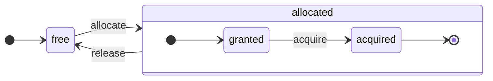

# 架构概述

ClickHouse 是一个真正的列式数据库管理系统 (DBMS)。数据按列存储，在执行数组（向量或列的块）时。尽可能地，操作是在数组上调度，而不是在单个值上。它被称为“向量化查询执行”，它有助于降低实际数据处理的成本。

这个理念并不新颖。它可以追溯到 `APL` （一种编程语言，1957年）及其后代：`A +`（APL 方言），`J`（1990年），`K`（1993年）和 `Q`（来自 Kx Systems 的编程语言，2003年）。数组编程用于科学数据处理。在关系数据库中，这一理念也并非新鲜事物。例如，它在 `VectorWise` 系统中得到了应用（也称为 Actian Corporation 的 Actian Vector 分析数据库）。

加速查询处理有两种不同的方法：向量化查询执行和运行时代码生成。后者消除了所有间接性和动态调度。这两种方法并没有严格的优劣之分。当一个方法融合了许多操作时，运行时代码生成可能更具优势，从而充分利用 CPU 执行单元和流水线。向量化查询执行则可以更加便利地利用 CPU 的 SIMD 能力。然而，它涉及必须写入缓存并重新读取的临时向量。如果临时数据无法适应 L2 缓存，这会成为一个问题。但向量化查询执行更容易利用 CPU 的 SIMD 功能。我们朋友撰写的一篇 [研究论文](http://15721.courses.cs.cmu.edu/spring2016/papers/p5-sompolski.pdf) 表明，结合这两种方法是更可取的。ClickHouse 使用向量化查询执行，并对运行时代码生成提供有限的初步支持。

## 列 {#columns}

`IColumn` 接口用于表示内存中的列（实际上是块的列）。该接口为各种关系运算符的实现提供了辅助方法。几乎所有的操作都是不可变的：它们不修改原始列，而是创建一个新的修改列。例如，`IColumn::filter` 方法接受一个过滤字节掩码。它用于 `WHERE` 和 `HAVING` 关系运算符。其他示例包括：`IColumn::permute` 方法支持 `ORDER BY`，`IColumn::cut` 方法支持 `LIMIT`。

各种 `IColumn` 实现（`ColumnUInt8`，`ColumnString`，等等）负责列的内存布局。内存布局通常是一个连续的数组。对于整数类型的列，它只是一个像 `std::vector` 的连续数组。对于 `String` 和 `Array` 列，它有两个向量：一个用于所有数组元素，并保持相邻，另一个用于指向每个数组开头的偏移量。还有 `ColumnConst`，它在内存中只存储一个值，但看上去像一列。

## 字段 {#field}

然而，也可以操作单个值。为了表示单个值，使用 `Field`。`Field` 只是 `UInt64`、`Int64`、`Float64`、`String` 和 `Array` 的一种区分联合。`IColumn` 具有 `operator[]` 方法，用于以 `Field` 的形式获取第 n 个值，以及 `insert` 方法将 `Field` 附加到列的末尾。这些方法并不是非常高效，因为它们需要处理代表单个值的临时 `Field` 对象。还有更高效的方法，如 `insertFrom`、`insertRangeFrom` 等。

`Field` 对表的特定数据类型具有不足的信息。例如，`UInt8`、`UInt16`、`UInt32` 和 `UInt64` 在 `Field` 中都表示为 `UInt64`。

## 漏洞抽象 {#leaky-abstractions}

`IColumn` 具有用于数据的常见关系转换的方法，但它们并不能满足所有需求。例如，`ColumnUInt64` 并没有用于计算两个列之和的方法，而 `ColumnString` 则没有用于执行子字符串搜索的方法。这些不计其数的例程是在 `IColumn` 之外实现的。

各种列函数可以通过使用 `IColumn` 方法提取 `Field` 值以通用而非高效的方式实现，或者通过了解特定 `IColumn` 实现中的数据内部内存布局以专门化的方式实现。这通过将函数转换为特定的 `IColumn` 类型并直接处理内部表示来实现。例如，`ColumnUInt64` 有 `getData` 方法，返回对一个内部数组的引用，然后一个单独的例程直接读取或填充该数组。我们有“漏洞抽象”允许各种例程的高效专门化。

## 数据类型 {#data_types}

`IDataType` 负责序列化和反序列化：用于以二进制或文本形式读取和写入列片段或单个值。`IDataType` 直接对应于表中的数据类型。例如，有 `DataTypeUInt32`、`DataTypeDateTime`、`DataTypeString` 等等。

`IDataType` 和 `IColumn` 之间的关系相对较松散。不同的数据类型可以由相同的 `IColumn` 实现表示。例如，`DataTypeUInt32` 和 `DataTypeDateTime` 都通过 `ColumnUInt32` 或 `ColumnConstUInt32` 表示。此外，同一数据类型可以由不同的 `IColumn` 实现表示。例如，`DataTypeUInt8` 可以通过 `ColumnUInt8` 或 `ColumnConstUInt8` 表示。

`IDataType` 只存储元数据。例如，`DataTypeUInt8` 不存储任何信息（除了虚拟指针 `vptr`），而 `DataTypeFixedString` 仅存储 `N`（固定大小字符串的大小）。

`IDataType` 具有各种数据格式的辅助方法。例如，方法用于序列化带引号的值、为 JSON 序列化值，以及将值作为 XML 格式的一部分序列化。与数据格式没有直接对应关系。例如，`Pretty` 和 `TabSeparated` 的不同数据格式可以使用来自 `IDataType` 接口的相同 `serializeTextEscaped` 辅助方法。

## 块 {#block}

`Block` 是一个容器，表示内存中表的子集（块）。它只是一个三元组的集合：`(IColumn, IDataType, 列名)`。在查询执行期间，数据通过 `Block` 进行处理。如果我们有一个 `Block`，我们就有数据（在 `IColumn` 对象中），我们有关于其类型的信息（在 `IDataType` 中），这告诉我们如何处理该列，应有的列名。它可能是表中原始列的名称，也可能是为获取计算的临时结果而分配的一些人工名称。

当我们在块中的列上计算某个函数时，我们将结果附加到块中，并且我们不会触碰函数的参数列，因为操作是不可变的。稍后，未使用的列可以从块中移除，但不能被修改。这对于消除常见子表达式非常方便。

每处理一个数据块都会创建块。请注意，对于相同类型的计算，不同块的列名称和类型保持不变，只有列数据发生变化。将块数据与块头分离是更好的选择，因为小块大小可能会产生高额的临时字符串开销，用于复制 shared_ptr 和列名称。

## 处理器 {#processors}

请参阅[说明](https://github.com/ClickHouse/ClickHouse/blob/master/src/Processors/IProcessor.h)。

## 格式 {#formats}

数据格式通过处理器实现。

## 输入/输出 {#io}

对于字节导向的输入/输出，有 `ReadBuffer` 和 `WriteBuffer` 抽象类。它们被用于替代 C++ 的 `iostream`。不用担心：每个成熟的 C++ 项目都出于良好的原因使用其他方法。

`ReadBuffer` 和 `WriteBuffer` 只是一个连续的缓冲区和一个指向该缓冲区中位置的光标。实现可以拥有或不拥有缓冲区的内存。存在一个虚拟方法用于填充缓冲区数据（对于 `ReadBuffer`），或将缓冲区刷新到某处（对于 `WriteBuffer`）。虚拟方法很少被调用。

`ReadBuffer`/`WriteBuffer` 的实现用于处理文件、文件描述符和网络套接字，实现压缩（`CompressedWriteBuffer` 是通过另一个 WriteBuffer 初始化的，并在将数据写入其中之前执行压缩），以及其他用途——名称 `ConcatReadBuffer`、`LimitReadBuffer` 和 `HashingWriteBuffer` 不言而喻。

读/写缓冲区只处理字节。有来自 `ReadHelpers` 和 `WriteHelpers` 头文件的函数，帮助格式化输入/输出。例如，有帮助程序用于以十进制格式写入数字。

让我们看看当你想要将结果集以 `JSON` 格式写入 stdout 时会发生什么。你有一个准备好从拉取的 `QueryPipeline` 中获取的结果集。首先，你创建一个 `WriteBufferFromFileDescriptor(STDOUT_FILENO)` 来将字节写入 stdout。接下来，你将查询管道的结果连接到 `JSONRowOutputFormat`，它以该 `WriteBuffer` 初始化，用于将 `JSON` 格式的行写入 stdout。这可以通过 `complete` 方法完成，该方法将拉取的 `QueryPipeline` 转换为已完成的 `QueryPipeline`。在内部，`JSONRowOutputFormat` 将写入各种 JSON 分隔符，并调用 `IDataType::serializeTextJSON` 方法，参数为对 `IColumn` 的引用和行号。因此，`IDataType::serializeTextJSON` 将调用来自 `WriteHelpers.h` 的方法：例如，数字类型的 `writeText` 和 `DataTypeString` 的 `writeJSONString`。

## 表 {#tables}

`IStorage` 接口表示表。该接口的不同实现即不同的表引擎。示例有 `StorageMergeTree`、`StorageMemory` 等等。这些类的实例只是表。

`IStorage` 的关键方法是 `read` 和 `write`，以及其他如 `alter`、`rename` 和 `drop`。`read` 方法接受以下参数：要从表中读取的列集合、要考虑的 `AST` 查询，以及所需的流数。它返回一个 `Pipe`。

在大多数情况下，读方法仅负责从表中读取指定的列，而不进行任何后续的数据处理。所有后续数据处理都由管道的另一部分处理，超出了 `IStorage` 的责任范围。

但有显著的例外情况：

- `AST` 查询被传递给 `read` 方法，表引擎可以利用它推导出索引的使用情况，并从表中读取更少的数据。
- 有时，表引擎可以自己处理数据到特定的阶段。例如，`StorageDistributed` 可以向远程服务器发送查询，请求它们处理数据到可以合并来自不同远程服务器的数据的阶段，并返回该预处理数据。查询解释器随后完成数据处理。

表的 `read` 方法可以返回一个由多个 `Processors` 组成的 `Pipe`。这些 `Processors` 可以并行从表中读取。然后，你可以将这些处理器连接到各种其他转换（如表达式评估或过滤），这些可以独立计算。然后，在它们之上创建一个 `QueryPipeline`，并通过 `PipelineExecutor` 执行它。

还有 `TableFunction`。这些是返回临时 `IStorage` 对象以在查询的 `FROM` 子句中使用的函数。

要迅速了解如何实现你的表引擎，可以查看一些简单的东西，例如 `StorageMemory` 或 `StorageTinyLog`。

> 作为 `read` 方法的结果，`IStorage` 返回 `QueryProcessingStage` ——关于查询的哪些部分已经在存储内部计算的信息。

## 解析器 {#parsers}

手写递归下降解析器用于解析查询。例如，`ParserSelectQuery` 只是递归调用查询的不同部分的基础解析器。解析器创建一个 `AST`。`AST` 由节点表示，节点是 `IAST` 的实例。

> 出于历史原因未使用解析器生成器。

## 解释器 {#interpreters}

解释器负责从 AST 创建查询执行管道。有简单的解释器，比如 `InterpreterExistsQuery` 和 `InterpreterDropQuery`，以及更复杂的 `InterpreterSelectQuery`。

查询执行管道是处理器的组合，能够消耗和生成块（特定类型的列集）。处理器通过端口进行通信，可以有多个输入端口和多个输出端口。可以在 [src/Processors/IProcessor.h](https://github.com/ClickHouse/ClickHouse/blob/master/src/Processors/IProcessor.h) 中找到更详细的描述。

例如，解释 `SELECT` 查询的结果是一个“拉取”的 `QueryPipeline`，它具有一个特殊的输出端口来读取结果集。解释 `INSERT` 查询的结果是一个“推送”的 `QueryPipeline`，具有一个输入端口来写入插入数据。而解释 `INSERT SELECT` 查询的结果是一个“已完成”的 `QueryPipeline`，没有输入或输出，但同时将数据从 `SELECT` 复制到 `INSERT`。

`InterpreterSelectQuery` 使用 `ExpressionAnalyzer` 和 `ExpressionActions` 机制进行查询分析和转换。在这里，执行大多数基于规则的查询优化。`ExpressionAnalyzer` 相当复杂，需要重写：各种查询转换和优化应该提取到单独的类中，以便实现模块化的查询转换。

为了解决解释器中存在的问题，开发了一个新的 `InterpreterSelectQueryAnalyzer`。这是 `InterpreterSelectQuery` 的新版本，它不使用 `ExpressionAnalyzer`，并在 `AST` 和 `QueryPipeline` 之间引入了一个额外的抽象层，称为 `QueryTree`。它已完全准备好在生产中使用，但如果需要，可以通过设置 `enable_analyzer` 设置为 `false` 来关闭。

## 函数 {#functions}

函数分为普通函数和聚合函数。有关聚合函数，请参见下一节。

普通函数不改变行数——它们工作时就像在处理每一行独立一样。实际上，函数不是为单独的行调用的，而是为数据的 `Block` 调用，以实现向量化查询执行。

有一些杂项函数，如 [blockSize](/sql-reference/functions/other-functions#blockSize)、[rowNumberInBlock](/sql-reference/functions/other-functions#rowNumberInBlock) 和 [runningAccumulate](/sql-reference/functions/other-functions#runningaccumulate)，利用块处理并违反行的独立性。

ClickHouse 具有强类型，因此不存在隐式类型转换。如果函数不支持特定类型组合，则会抛出异常。但是，函数可以为多种不同的组合类型工作（重载）。例如，`plus` 函数（实现 `+` 运算符）适用于任何数字类型的组合：`UInt8` + `Float32`、`UInt16` + `Int8` 等等。此外，一些可变参数函数可以接受任意数量的参数，例如 `concat` 函数。

实现一个函数可能略显不便，因为函数显式分派支持的数据类型和支持的 `IColumns`。例如，`plus` 函数通过为每种数字类型的组合生成 C++ 模板的实例化代码而实现，包括左边和右边常量或非常量参数。

这是实现运行时代码生成的绝佳切入点，以避免模板代码膨胀。此外，这使得添加融合函数（例如融合的乘法-加法）或在一个循环迭代中进行多次比较成为可能。

由于向量化查询执行，函数不会短路。例如，如果你编写 `WHERE f(x) AND g(y)`，则两侧都被计算，即使对于行中 `f(x)` 为零的情况（除非 `f(x)` 是零常量表达式）。但是，如果 `f(x)` 条件的选择性很高，并且 `f(x)` 的计算成本远低于 `g(y)`，那么更好的做法是实现多通过一步计算。它将首先计算 `f(x)`，然后根据结果过滤列，然后仅对较小的已过滤数据块计算 `g(y)`。

## 聚合函数 {#aggregate-functions}

聚合函数是有状态的函数。它们将传递的值积累到某个状态中，允许你从该状态获取结果。它们由 `IAggregateFunction` 接口管理。状态可以是相当简单的（`AggregateFunctionCount` 的状态仅是一个 `UInt64` 值）或相当复杂的（`AggregateFunctionUniqCombined` 的状态是线性数组、哈希表和 `HyperLogLog` 概率数据结构的组合）。

状态分配在 `Arena` （内存池）中，以处理执行高基数 `GROUP BY` 查询时的多个状态。状态可以具有非平凡的构造函数和析构函数：例如，复杂的聚合状态可以自行分配额外的内存。这需要在创建和销毁状态时给予一些关注，并正确地传递其所有权和销毁顺序。

聚合状态可以序列化和反序列化，以便在分布式查询执行期间通过网络传递，或写入到 RAM 不足的磁盘上。它们甚至可以存储在具有 `DataTypeAggregateFunction` 的表中，以便允许数据的增量聚合。

> 目前聚合函数状态的序列化数据格式没有版本控制。如果聚合状态仅暂时存储，这没问题。但我们有 `AggregatingMergeTree` 表引擎用于增量聚合，已有很多人在生产中使用。这就是为什么在未来改变任何聚合函数的序列化格式时，需要向后兼容的原因。

## 服务器 {#server}

服务器实现了几种不同的接口：

- 用于任何外部客户端的 HTTP 接口。
- 用于原生 ClickHouse 客户端和在分布式查询执行期间进行跨服务器通信的 TCP 接口。
- 用于传输数据进行复制的接口。

在内部，它只是一个原始的多线程服务器，没有协程或纤程。由于服务器并不旨在处理高频率的简单查询，而是处理相对低频率的复杂查询，因此每个查询都可以处理大量数据以进行分析。

服务器初始化 `Context` 类以提供查询执行所需的重要环境：可用数据库列表、用户和访问权限、设置、集群、进程列表、查询日志等。解释器使用该环境。

我们保持服务器 TCP 协议的全向后兼容性：旧客户端可以与新服务器通信，新客户端可以与旧服务器通信。但我们不希望永远保持这种兼容性，在大约一年后我们会取消对旧版本的支持。

:::note
对于大多数外部应用程序，我们建议使用 HTTP 接口，因为它简单易用。TCP 协议与内部数据结构紧密相关：它使用内部格式传递数据块，并对压缩数据使用自定义框架。我们没有为该协议发布 C 库，因为它需要链接 ClickHouse 的大部分代码库，这是不实际的。
:::

## 配置 {#configuration}

ClickHouse 服务器基于 POCO C++ 库，并使用 `Poco::Util::AbstractConfiguration` 来表示其配置。配置由 `Poco::Util::ServerApplication` 类持有，该类从 `DaemonBase` 类继承，而 `DaemonBase` 类又继承自实现 clickhouse-server 的 `DB::Server` 类。这样，配置可以通过 `ServerApplication::config()` 方法访问。

配置从多个文件（以 XML 或 YAML 格式）读取，并通过 `ConfigProcessor` 类合并为单个 `AbstractConfiguration`。在服务器启动时加载配置，如果更新、删除或添加其中一个配置文件，则可以重新加载配置。`ConfigReloader` 类负责定期监控这些更改及重新加载过程。`SYSTEM RELOAD CONFIG` 查询也会触发配置的重新加载。

对于与 `Server` 配置无关的查询和子系统，可以使用 `Context::getConfigRef()` 方法访问配置。每个能够在不重启服务器的情况下重新加载其配置的子系统，应在 `Server::main()` 方法中的重新加载回调中注册自己。请注意，如果新的配置有错误，大多数子系统将忽略新的配置，记录警告消息并继续使用之前加载的配置。由于 `AbstractConfiguration` 的性质，无法传递对特定段的引用，因此通常使用 `String config_prefix`。

## 线程和任务 {#threads-and-jobs}

为了执行查询和进行其他活动，ClickHouse 从线程池中分配线程，以避免频繁的线程创建和销毁。根据任务的目的和结构，有几个线程池：

* 服务器池用于处理传入的客户端会话。
* 通用线程池，用于通用任务、后台活动和独立线程。
* 输入/输出线程池，适用于大多数被I/O 阻塞且不密集于 CPU 的任务。
* 背景池用于定期任务。
* 可抢占任务的池，这些任务可以分解为步骤。

服务器池是 `Poco::ThreadPool` 类的实例，在 `Server::main()` 方法中定义。它最多可以有 `max_connection` 个线程。每个线程专用于一个主动连接。

全局线程池是 `GlobalThreadPool` 单例类。要从中分配线程，可以使用 `ThreadFromGlobalPool`。它具有类似于 `std::thread` 的接口，但从全局池中获取线程并进行所有必要的初始化。它的设置如下：

* `max_thread_pool_size` - 池中的线程数量限制。
* `max_thread_pool_free_size` - 等待新任务的空闲线程数量限制。
* `thread_pool_queue_size` - 安排的任务数量限制。

全局池是通用的，下面描述的所有池都是在它之上实现的。这可以被视为一系列池的层次结构。任何专用池都从全局池中提取线程，使用 `ThreadPool` 类。所以，任何专用池的主要目的都是限制同时运行的任务数量，并调度任务。如果计划的任务多于池中的线程，`ThreadPool` 会在优先级队列中积累任务。每个任务都有一个整数优先级。默认优先级为零。所有优先级值较高的任务在优先级值较低的任务之前启动。但执行中的任务没有区别，因此优先级只在池过载时才重要。

I/O 线程池被实现为一个普通的 `ThreadPool`，可通过 `IOThreadPool::get()` 方法访问。其配置方式与全局池相同，使用 `max_io_thread_pool_size`、`max_io_thread_pool_free_size` 和 `io_thread_pool_queue_size` 等设置。I/O 线程池的主要目的是避免在 I/O 任务中耗尽全局池，从而影响查询充分利用 CPU 的能力。备份到 S3 涉及大量 I/O 操作，为了避免对交互式查询的影响，还配置了一个单独的 `BackupsIOThreadPool`，其配置使用 `max_backups_io_thread_pool_size`、`max_backups_io_thread_pool_free_size` 和 `backups_io_thread_pool_queue_size` 等设置。

为了定期执行任务，存在 `BackgroundSchedulePool` 类。你可以使用 `BackgroundSchedulePool::TaskHolder` 对象注册任务，池确保没有任务会同时执行两个作业。它还允许你将任务执行推迟到将来的特定时刻或临时停用任务。全局 `Context` 为不同目的提供了此类的一些实例。对于一般任务，使用 `Context::getSchedulePool()`。

还有专门用于可抢占任务的线程池。这种 `IExecutableTask` 任务可以被分解为有序任务序列，称为步骤。为使这些任务的调度方式能够优先考虑较短的任务，使用 `MergeTreeBackgroundExecutor`。顾名思义，它用于与 MergeTree 相关的后台操作，如合并、变异、获取和移动。通过 `Context::getCommonExecutor()` 和其他类似方法，可以获得池的实例。

无论为任务使用什么池，开始时都会为该任务创建 `ThreadStatus` 实例。它封装了所有每个线程信息：线程 ID、查询 ID、性能计数器、资源消耗以及许多其他有用数据。任务可以通过 `CurrentThread::get()` 调用访问它，因此我们不需要传递给每个函数。

如果线程与查询执行相关，那么附加到 `ThreadStatus` 的最重要的内容是查询上下文 `ContextPtr`。每个查询在服务器池中都有其主线程。主线程通过持有 `ThreadStatus::QueryScope query_scope(query_context)` 对象进行附加。主线程还创建一个用 `ThreadGroupStatus` 对象表示的线程组。在此查询执行过程中分配的每个额外线程都通过 `CurrentThread::attachTo(thread_group)` 调用附加到其线程组中。线程组用于聚合事件计数器并跟踪所有专用于单个任务的线程的内存消耗（有关详细信息，请参见 `MemoryTracker` 和 `ProfileEvents::Counters` 类）。

## 并发控制 {#concurrency-control}

可以并行化的查询使用 `max_threads` 设置来限制自己。该设置的默认值被选定为以最佳方式允许单个查询利用所有 CPU 核心。但是，如果有多个并发查询，每个查询都使用默认的 `max_threads` 设置值怎么办？那么查询将共享 CPU 资源。操作系统会确保公平性，持续切换线程，这会引入一定的性能损失。`ConcurrencyControl` 有助于应对这种损失并避免分配太多线程。配置设置 `concurrent_threads_soft_limit_num` 用于限制可以分配多少个并发线程，以免施加某种 CPU 压力。

引入了 CPU `slot` 的概念。插槽是并发的一个单位：要运行一个线程，查询必须事先获取一个插槽，线程停止时释放插槽。插槽的数量在服务器上全局限制。如果总需求超过插槽的总数，多个并发查询在争夺 CPU 插槽。`ConcurrencyControl` 负责以公平的方式解决这一竞争，通过进行 CPU 插槽调度。

每个插槽都可以被视为一个独立的状态机，具有以下状态：
* `free`：插槽可以被任何查询分配。
* `granted`：插槽由特定查询“分配”，但是尚未被任何线程获取。
* `acquired`：插槽由特定查询“分配”并已被线程获取。

请注意，`allocated` 插槽可以处于两种不同状态：`granted` 和 `acquired`。前者是短暂的状态，在一个插槽被“分配”给查询时到任何线程运行向上扩展过程的时刻。

`ConcurrencyControl` 的 API 包含以下函数：
1. 为查询创建资源分配：`auto slots = ConcurrencyControl::instance().allocate(1, max_threads);`。它将至少分配 1 个、至多 `max_threads` 个插槽。请注意，第一个插槽会立即被授予，但其余的插槽可能会稍后授予。因此，限制是软性的，因为每个查询将至少获得一个线程。
2. 对于每个线程，必须从已分配的插槽中获取插槽：`while (auto slot = slots->tryAcquire()) spawnThread([slot = std::move(slot)] { ... });`。
3. 更新插槽的总数：`ConcurrencyControl::setMaxConcurrency(concurrent_threads_soft_limit_num)`。可以在运行时进行，无需重启服务器。

此 API 允许查询以至少一个线程开始（在存在 CPU 压力时），然后扩展到 `max_threads`。 

## 分布式查询执行 {#distributed-query-execution}

集群设置中的服务器大多数是独立的。你可以在集群中的一个或所有服务器上创建一个 `Distributed` 表。`Distributed` 表本身并不存储数据——它仅提供对集群多个节点上所有本地表的“视图”。当你从 `Distributed` 表中选择数据时，它会重写该查询，根据负载均衡设置选择远程节点，并将查询发送给它们。`Distributed` 表请求远程服务器处理查询，直到可以合并来自不同服务器的中间结果为止。随后，它会接收中间结果并进行合并。分布式表尝试将尽可能多的工作分配给远程服务器，并且不通过网络发送过多的中间数据。

当你在 IN 或 JOIN 子句中有子查询，并且它们中的每一个都使用 `Distributed` 表时，事情会变得更加复杂。我们在这些查询的执行中有不同的策略。

分布式查询执行没有全局查询计划。每个节点都有针对其工作部分的本地查询计划。我们只进行简单的一次性分布式查询执行：我们向远程节点发送查询，然后合并结果。但是，对于具有高基数 `GROUP BY` 或大量临时数据进行 JOIN 的复杂查询而言，这并不可行。在这种情况下，我们需要在服务器之间“重新洗牌”数据，这需要额外的协调。ClickHouse 不支持这种类型的查询执行，我们需要对此进行改进。
## Merge Tree {#merge-tree}

`MergeTree` 是一系列支持按主键索引的存储引擎。主键可以是任意的列或表达式元组。在 `MergeTree` 表中，数据以“部分”的形式存储。每个部分按主键顺序存储数据，因此数据按主键元组的字典序排列。所有表列都存储在这些部分的单独 `column.bin` 文件中。文件由压缩块组成。每个块的未压缩数据通常在 64 KB 到 1 MB 之间，具体取决于平均值大小。块由列值连续存储在一起。每列的列值顺序一致（主键定义了顺序），因此当你遍历多个列时，会得到对应行的值。

主键本身是“稀疏的”。它并不指向每一行，而只指向某些数据范围。单独的 `primary.idx` 文件在每 N 行中包含一个主键值，其中 N 被称为 `index_granularity`（通常，N = 8192）。此外，对于每一列，我们还有 `column.mrk` 文件，其中包含“标记”，这些标记是数据文件中每 N 行的偏移量。每个标记是一个对：压缩块在文件中开始位置的偏移量，以及解压块中数据开始位置的偏移量。通常，压缩块通过标记对齐，而解压块中的偏移量为零。`primary.idx` 的数据始终驻留在内存中，而 `column.mrk` 文件中的数据是缓存的。

当我们要从 `MergeTree` 中的某个部分读取数据时，我们查看 `primary.idx` 数据并定位可能包含请求数据的范围，然后查看 `column.mrk` 数据并计算开始读取这些范围的偏移量。由于稀疏性，可能会读取多余的数据。ClickHouse 不适合高负载的简单点查询，因为每个键必须读取整个与 `index_granularity` 行数相关的范围，而且每列的整个压缩块必须解压。我们使索引稀疏，因为我们必须能够在单个服务器上维持数万亿行，而不会对内存消耗造成明显影响。此外，由于主键是稀疏的，因此不是唯一的：在 INSERT 时无法检查键在表中的存在性。你可以在一个表中有许多具有相同键的行。

当你将一批数据 `INSERT` 到 `MergeTree` 中时，这批数据会按主键顺序排序并形成一个新部分。有后台线程定期选择某些部分并将它们合并为一个新的已排序部分，以将部分的数量保持相对较低。这就是为什么它被称为 `MergeTree`。当然，合并会导致“写放大”。所有部分都是不可变的：它们只能被创建和删除，而不能修改。当执行 SELECT 时，它会持有表的快照（部分的集合）。在合并后，我们还会在一段时间内保留旧部分，以便在故障后便于恢复，因此如果我们看到某个合并部分可能损坏，我们可以用其源部分替换它。

`MergeTree` 不是 LSM 树，因为它不包含 MEMTABLE 和 LOG：插入的数据直接写入文件系统。这种行为使 MergeTree 更适合批量插入数据。因此，频繁插入少量行是不理想的。例如，每秒几行是可以的，但每秒进行一千次则不适合 MergeTree。然而，对于小批量插入，存在一种异步插入模式来克服这个限制。我们这样做是出于简单的考虑，因为我们已经在应用程序中批量插入数据。

有些 MergeTree 引擎在后台合并过程中进行额外的工作。例如 `CollapsingMergeTree` 和 `AggregatingMergeTree`。这可以视为对更新的特殊支持。请记住，这些并不是真实的更新，因为用户通常无法控制后台合并执行的时间，而且在 `MergeTree` 表中的数据几乎总是存储在多个部分中，而不是以完全合并的形式存储。

## Replication {#replication}

ClickHouse 中的复制可以在每个表的基础上进行配置。你可以在同一服务器上拥有一些复制表和一些非复制表。你也可以以不同方式复制表，例如一个表使用双因素复制，另一个表使用三因素复制。

复制是在 `ReplicatedMergeTree` 存储引擎中实现的。`ZooKeeper` 中的路径作为存储引擎的参数进行指定。所有在 `ZooKeeper` 中具有相同路径的表相互成为副本：它们同步数据并维护一致性。副本可以通过简单地创建或删除表动态添加和删除。

复制使用异步多主机制。你可以将数据插入到任何与 `ZooKeeper` 具有会话的副本中，数据将异步复制到所有其他副本。由于 ClickHouse 不支持 UPDATE，因此复制是无冲突的。由于默认情况下对插入没有仲裁确认，如果某个节点失败，刚插入的数据可能会丢失。可以通过使用 `insert_quorum` 设置来启用插入仲裁。

复制的元数据存储在 ZooKeeper 中。存在一个复制日志，它列出了需要执行的操作。操作包括：获取部分；合并部分；删除分区，等等。每个副本将复制复制日志到其队列中，然后执行队列中的操作。例如，在插入时，日志中会创建“获取部分”的操作，每个副本下载该部分。合并在副本之间协调，以获得字节相同的结果。所有副本上的所有部分以相同的方式合并。一个领导者首先启动新的合并并将“合并部分”的操作写入日志。多个副本（或所有副本）可以同时成为领导者。可以通过 `merge_tree` 设置 `replicated_can_become_leader` 阻止副本成为领导者。领导者负责调度后台合并。

复制是物理的：仅在节点之间传输压缩的部分，而不是查询。合并在每个副本上独立处理，以降低网络成本，避免网络放大。仅在发生显著复制延迟的情况下，较大的合并部分通过网络发送。

此外，每个副本将其状态存储在 ZooKeeper 中，作为部分的集合及其校验和。当本地文件系统的状态与 ZooKeeper 中的参考状态不一致时，该副本通过从其他副本下载缺失和损坏的部分来恢复一致性。当本地文件系统中存在一些意外或损坏的数据时，ClickHouse 不会删除它，而是将其移动到单独的目录并将其忘记。

:::note
ClickHouse 集群由独立的分片组成，每个分片由副本组成。该集群是 **非弹性的**，因此在添加新分片后，数据不会在分片之间自动重新平衡。相反，集群负载应调整为不均匀。这种实现让你有更多的控制权，对于相对较小的集群（例如，数十个节点）是可以的。但是对于我们在生产中使用的数百个节点的集群来说，这种方法成为了一个显著的缺点。我们应该实现一个跨集群的表引擎，带有动态复制区域，可以在集群之间自动拆分和平衡。
:::
