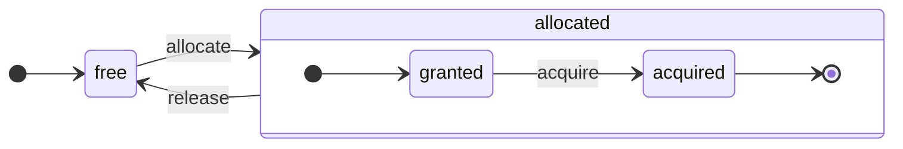

# 架构概述

ClickHouse 是一个真正的列式 DBMS。数据按列存储，并在执行数组（列的向量或块）时执行。
只要有可能，操作就会在数组上调度，而不是在单个值上。
这称为“向量化查询执行”，它有助于降低实际数据处理的成本。

这个想法并不是新的。
它可以追溯到 `APL`（一种编程语言，1957年）及其后代：`A +`（APL 方言）、`J`（1990年）、`K`（1993年）和 `Q`（2003年来自 Kx Systems 的编程语言）。
数组编程被用于科学数据处理。在关系数据库中，这种想法也并不新颖。例如，它被用于 `VectorWise` 系统（也称为由 Actian Corporation 开发的 Actian Vector 分析数据库）。

加速查询处理有两种不同的方法：向量化查询执行和运行时代码生成。后者去除了所有的间接性和动态调度。这两种方法没有绝对的优劣。运行时代码生成在融合多个操作时可能更好，从而充分利用 CPU 执行单元和管道。向量化查询执行可能在实用性上较弱，因为它涉及必须写入缓存且再读回的临时向量。如果临时数据不适合 L2 缓存，这将成为问题。但向量化查询执行更容易利用 CPU 的 SIMD 能力。我们的朋友们撰写的一篇 [研究论文](http://15721.courses.cs.cmu.edu/spring2016/papers/p5-sompolski.pdf) 显示，结合这两种方法是更好的选择。ClickHouse 使用向量化查询执行，并有限地支持运行时代码生成。
## 列 {#columns}

`IColumn` 接口用于表示内存中的列（实际上是列的块）。该接口提供用于各种关系运算符实现的辅助方法。几乎所有操作都是不可变的：它们不会修改原始列，而是创建一个新的修改版本。例如，`IColumn :: filter` 方法接受一个过滤字节掩码。它用于 `WHERE` 和 `HAVING` 关系运算符。其他示例包括：支持 `ORDER BY` 的 `IColumn :: permute` 方法，以及支持 `LIMIT` 的 `IColumn :: cut` 方法。

各种 `IColumn` 实现（`ColumnUInt8`、`ColumnString` 等）负责列的内存布局。内存布局通常是一个连续数组。对于整数类型的列，它就是一个连续数组，比如 `std :: vector`。对于 `String` 和 `Array` 列，它是两个向量：一个是所有数组元素，按顺序放置，另一个是指向每个数组开头的偏移量。还有 `ColumnConst`，它仅在内存中存储一个值，但看起来像是一列。
## 字段 {#field}

然而，也可以处理单个值。为了表示单个值，使用 `Field`。`Field` 只是 `UInt64`、`Int64`、`Float64`、`String` 和 `Array` 的一个区分式联合。`IColumn` 有 `operator []` 方法可以获取第 n 个值作为 `Field`，并且有 `insert` 方法可以将 `Field` 附加到列的末尾。这些方法效率不高，因为它们需要处理代表单个值的临时 `Field` 对象。还有一些更高效的方法，如 `insertFrom`、`insertRangeFrom` 等。

`Field` 对于表的特定数据类型没有足够的信息。例如，`UInt8`、`UInt16`、`UInt32` 和 `UInt64` 都在 `Field` 中表示为 `UInt64`。
## 漏泄抽象 {#leaky-abstractions}

`IColumn` 有用于数据常见关系转换的方法，但它们并不能满足所有需求。例如，`ColumnUInt64` 没有计算两列总和的方法，而 `ColumnString` 没有执行子字符串搜索的方法。这些无数例程在 `IColumn` 之外实现。

对列的各种函数可以通过使用 `IColumn` 方法提取 `Field` 值，以一种通用而非高效的方式实现，或者通过使用特定 `IColumn` 实现的内部内存布局的知识以专门的方式实现。通过将函数转换为特定的 `IColumn` 类型并直接处理内部表示来实现。例如，`ColumnUInt64` 有 `getData` 方法返回对内部数组的引用，然后一个单独的例程直接读取或填充该数组。我们有“漏泄的抽象”，以便允许高效地专业化各种例程。
## 数据类型 {#data_types}

`IDataType` 负责序列化和反序列化：以二进制或文本形式读取和写入列的块或单个值。`IDataType` 直接对应于表中的数据类型。例如，有 `DataTypeUInt32`、`DataTypeDateTime`、`DataTypeString` 等。

`IDataType` 和 `IColumn` 之间关联不紧密。不同的数据类型可以由相同的 `IColumn` 实现表示。例如，`DataTypeUInt32` 和 `DataTypeDateTime` 都由 `ColumnUInt32` 或 `ColumnConstUInt32` 表示。此外，相同的数据类型可以由不同的 `IColumn` 实现表示。例如，`DataTypeUInt8` 可以由 `ColumnUInt8` 或 `ColumnConstUInt8` 表示。

`IDataType` 仅存储元数据。例如，`DataTypeUInt8` 什么都不存储（除了虚拟指针 `vptr`），而 `DataTypeFixedString` 仅存储 `N`（固定大小字符串的大小）。

`IDataType` 具有用于各种数据格式的辅助方法。示例包括用于对值进行可能的引用序列化的序列化方法、用于 JSON 的值序列化方法和作为 XML 格式一部分序列化值的方法。数据格式之间没有直接的对应关系。例如，不同的数据格式 `Pretty` 和 `TabSeparated` 可以使用 `IDataType` 接口中的相同 `serializeTextEscaped` 辅助方法。
## 块 {#block}

`Block` 是一个容器，表示内存中表的一个子集（块）。它只是一个三元组的集合：`(IColumn, IDataType, 列名)`。在查询执行期间，数据通过 `Block` 处理。如果我们有一个 `Block`，我们就有数据（在 `IColumn` 对象中），我们有关于其类型的信息（在 `IDataType` 中），它告诉我们如何处理该列，还有列名。它可以是来自表的原始列名，也可以是为获取计算的临时结果分配的某些人工名称。

当我们对块中的列计算某个函数时，我们就会向块添加另一个带有结果的列，而不触及函数参数的列，因为操作是不可变的。后来，可以从块中删除不需要的列，但不能修改。这样方便消除公共子表达式。

为每个处理的数据块创建块。请注意，对于同一类型的计算，列名和类型在不同的块中保持相同，只有列数据发生变化。最好将块数据与块头分开，因为小块大小会导致临时字符串的复制共享指针和列名的高开销。
## 处理器 {#processors}

有关详细描述，请参见 [https://github.com/ClickHouse/ClickHouse/blob/master/src/Processors/IProcessor.h](https://github.com/ClickHouse/ClickHouse/blob/master/src/Processors/IProcessor.h)。
## 格式 {#formats}

数据格式通过处理器实现。
## I/O {#io}

对于字节导向的输入/输出，有 `ReadBuffer` 和 `WriteBuffer` 抽象类。它们用来替代 C++ `iostream`。别担心：每个成熟的 C++ 项目都出于良好原因使用其他东西而不是 `iostream`。

`ReadBuffer` 和 `WriteBuffer` 只是一个连续的缓冲区和一个指向该缓冲区中位置的游标。实现可能拥有或不拥有缓冲区的内存。有一个虚拟方法用于填充缓冲区（对于 `ReadBuffer`）或将缓冲区刷新到某个地方（对于 `WriteBuffer`）。这些虚拟方法很少被调用。

`ReadBuffer` 和 `WriteBuffer` 的实现用于处理文件和文件描述符以及网络套接字，用于实现压缩（`CompressedWriteBuffer` 用另一个 WriteBuffer 初始化，并在写入数据之前执行压缩），还有其他用途——名称 `ConcatReadBuffer`、`LimitReadBuffer` 和 `HashingWriteBuffer` 不言自明。

读/写缓冲区仅处理字节。存在来自 `ReadHelpers` 和 `WriteHelpers` 头文件的函数以帮助格式化输入/输出。例如，有用于以十进制格式写入数字的辅助函数。

让我们看看你想将结果集以 `JSON` 格式写入 stdout 时会发生什么。
您已准备好从拉取的 `QueryPipeline` 获取结果集。
首先，您创建一个 `WriteBufferFromFileDescriptor(STDOUT_FILENO)` 来将字节写入 stdout。
接下来，将查询管道的结果连接到 `JSONRowOutputFormat`，其使用该 `WriteBuffer` 初始化，以将行以 `JSON` 格式写入 stdout。
这可以通过 `complete` 方法完成，该方法将拉取的 `QueryPipeline` 转换为已完成的 `QueryPipeline`。
在内部，`JSONRowOutputFormat` 将写入各种 JSON 分隔符，并调用 `IDataType::serializeTextJSON` 方法，将 `IColumn` 和行号作为参数。随后，`IDataType::serializeTextJSON` 将调用 `WriteHelpers.h` 中的方法：例如，数值类型的 `writeText` 和 `DataTypeString` 的 `writeJSONString`。
## 表 {#tables}

`IStorage` 接口代表表。该接口的不同实现是不同的表引擎。例如，`StorageMergeTree`、`StorageMemory` 等。这些类的实例就是表。

`IStorage` 中的关键方法是 `read` 和 `write`，以及其他方法如 `alter`、`rename` 和 `drop`。`read` 方法接受以下参数：要从表中读取的列集、要考虑的 `AST` 查询和所需的流数量。它返回一个 `Pipe`。

在大多数情况下，读取方法仅负责从表中读取指定的列，而不进行任何进一步的数据处理。
所有后续的数据处理由管道的另一部分处理，这超出了 `IStorage` 的责任。

但有一些显著的例外：

- `AST` 查询被传递给 `read` 方法，表引擎可以利用它来推导索引使用情况并从表中读取更少的数据。
- 有时，表引擎可以自己处理数据到特定阶段。例如，`StorageDistributed` 可以将查询发送到远程服务器，要求它们处理数据到可以合并不同远程服务器的数据阶段，然后返回处理过的数据。查询解释器随后完成数据处理。

表的 `read` 方法可以返回由多个 `Processors` 组成的 `Pipe`。这些 `Processors` 可以并行地读取表。
然后，您可以将这些处理器与各种其他转换（如表达式求值或过滤）连接在一起，这些转换可以独立计算。
然后在它们之上创建一个 `QueryPipeline`，并通过 `PipelineExecutor` 执行它。

还有 `TableFunction`。这些是返回临时 `IStorage` 对象的函数，可在查询的 `FROM` 子句中使用。

要快速了解如何实现您的表引擎，可以查看一些简单的示例，例如 `StorageMemory` 或 `StorageTinyLog`。

> 作为 `read` 方法的结果，`IStorage` 返回 `QueryProcessingStage`——关于查询哪些部分已经在存储中计算的信息。
## 解析器 {#parsers}

手写的递归下降解析器解析查询。例如，`ParserSelectQuery` 仅递归地调用底层解析器以解析查询的各个部分。解析器创建一个 `AST`。`AST` 由节点表示，这些节点是 `IAST` 的实例。

> 出于历史原因，不使用解析器生成器。
## 解释器 {#interpreters}

解释器负责从 `AST` 创建查询执行管道。有简单的解释器，例如 `InterpreterExistsQuery` 和 `InterpreterDropQuery`，以及更复杂的 `InterpreterSelectQuery`。

查询执行管道是多个可以消费和生成块（具有特定类型的列的集合）的处理器的组合。
处理器通过端口进行通信，可以有多个输入端口和多个输出端口。
有关更详细的描述，请参见 [src/Processors/IProcessor.h](https://github.com/ClickHouse/ClickHouse/blob/master/src/Processors/IProcessor.h)。

例如，解释 `SELECT` 查询的结果是一个“拉取” `QueryPipeline`，它具有一个特殊的输出端口以从中读取结果集。
`INSERT` 查询的结果是一个“推送” `QueryPipeline`，具有一个输入端口以写入要插入的数据。
解释 `INSERT SELECT` 查询的结果是一个“完成的” `QueryPipeline`，没有输入或输出，但同时将数据从 `SELECT` 复制到 `INSERT`。

`InterpreterSelectQuery` 使用 `ExpressionAnalyzer` 和 `ExpressionActions` 机制进行查询分析和转换。这是大多数基于规则的查询优化执行的地方。`ExpressionAnalyzer` 相当繁琐，应该重写：为允许查询的模块化转换，各种查询转换和优化应提取到单独的类中。

为了应对解释器中存在的问题，开发了一个新的 `InterpreterSelectQueryAnalyzer`。这是 `InterpreterSelectQuery` 的新版本，不使用 `ExpressionAnalyzer`，并在 `AST` 和 `QueryPipeline` 之间引入了一个额外的抽象层，称为 `QueryTree`。它已完全准备好在生产中使用，但为了保险起见，可以通过将 `enable_analyzer` 设置的值设置为 `false` 来关闭它。
## 函数 {#functions}

有普通函数和聚合函数。有关聚合函数，请参见下一节。

普通函数不会改变行数——它们的工作方式就像是独立处理每一行。实际上，函数不是针对单个行调用的，而是针对用于实现向量化查询执行的数据块（`Block`）调用的。

还有一些杂项函数，如 [blockSize](/sql-reference/functions/other-functions#blockSize)、[rowNumberInBlock](/sql-reference/functions/other-functions#rowNumberInBlock) 和 [runningAccumulate](/sql-reference/functions/other-functions#runningaccumulate)，这些函数利用块处理并违反行的独立性。

ClickHouse 有强类型，因此没有隐式类型转换。如果一个函数不支持特定的类型组合，它会抛出异常。但是，函数可以针对许多不同的类型组合进行工作（重载）。例如，`plus` 函数（用于实现 `+` 操作符）适用于任何数字类型的组合：`UInt8` + `Float32`、`UInt16` + `Int8` 等。此外，一些可变参数函数可以接受任意数量的参数，例如 `concat` 函数。

实现函数可能稍显不便，因为函数明确调度支持的数据类型和支持的 `IColumns`。例如，`plus` 函数通过为每种数字类型的组合以及常量或非常量的左、右参数实例化 C++ 模板生成代码。

这是实现运行时代码生成以避免模板代码膨胀的绝佳地方。此外，这使得例如融合乘加（fused multiply-add）或在一次循环迭代中进行多次比较成为可能。

由于向量化查询执行，函数不会短路。例如，如果您编写 `WHERE f(x) AND g(y)`，则两侧都会计算，即使在 `f(x)` 为零的行（除非 `f(x)` 是一个零常量表达式）。但是如果 `f(x)` 条件的选择性高，而 `f(x)` 的计算要比 `g(y)` 便宜得多，那么最好实现多次计算。它会首先计算 `f(x)`，然后根据结果过滤列，然后仅计算 `g(y)`，仅针对较小的过滤块的数据。
## 聚合函数 {#aggregate-functions}

聚合函数是有状态的函数。它们将传入的值累积到某种状态中，并允许您从该状态中获取结果。它们通过 `IAggregateFunction` 接口进行管理。状态可以相当简单（`AggregateFunctionCount` 的状态只是一个单一的 `UInt64` 值）或相当复杂（`AggregateFunctionUniqCombined` 的状态是线性数组、哈希表和 `HyperLogLog` 概率数据结构的组合）。

在 `Arena`（内存池）中分配状态，以处理在执行高基数的 `GROUP BY` 查询时的多个状态。状态可能具有非平凡的构造函数和析构函数：例如，复杂的聚合状态可以自己分配额外的内存。创建和销毁状态以及正确传递它们的所有权和销毁顺序需要一些注意。

聚合状态可以被序列化和反序列化，以便在分布式查询执行期间通过网络传递，或在 RAM 不足时将它们写入磁盘。它们甚至可以存储在表中，使用 `DataTypeAggregateFunction` 允许对数据进行增量聚合。

> 聚合函数状态的序列化数据格式目前没有版本控制。如果聚合状态仅仅临时存储，这是可以的。但是我们有 `AggregatingMergeTree` 表引擎用于增量聚合，人们已经在生产中使用它。这就是为什么未来更改任何聚合函数的序列化格式时需要向后兼容的原因。
## 服务器 {#server}

服务器实现了几种不同的接口：

- 用于任何外部客户端的 HTTP 接口。
- 用于本机 ClickHouse 客户端和在分布式查询执行期间跨服务器通信的 TCP 接口。
- 用于复制的数据传输接口。

从内部来看，它只是一个原始的多线程服务器，没有协程或纤程。由于服务器的设计并不是为了处理高频率的简单查询，而是处理相对低频率的复杂查询，每个查询都可以处理大量数据进行分析。

服务器使用查询执行所需的环境初始化 `Context` 类：可用数据库、用户和访问权限的列表、设置、集群、进程列表、查询日志等。解释器使用此环境。

我们为服务器 TCP 协议维护完全的向后和向前兼容性：旧客户端可以与新服务器通信，而新客户端可以与旧服务器通信。但我们不想永久维护它，且大约一年后将删除对旧版本的支持。

:::note
对于大多数外部应用程序，我们建议使用 HTTP 接口，因为它简单易用。TCP 协议与内部数据结构的关联更紧密：它使用一种内部格式来传递数据块，并使用自定义框架来处理压缩数据。我们没有发布针对该协议的 C 库，因为它需要链接大部分的 ClickHouse 代码库，这并不实用。
:::
## 配置 {#configuration}

ClickHouse 服务器基于 POCO C++ 库，并使用 `Poco::Util::AbstractConfiguration` 来表示其配置。配置由 `Poco::Util::ServerApplication` 类持有，该类继承自 `DaemonBase` 类，后者又继承自实现 clickhouse-server 的 `DB::Server` 类。因此，可以通过 `ServerApplication::config()` 方法访问配置。

配置从多个文件（XML 或 YAML 格式）读取，并由 `ConfigProcessor` 类合并为单个 `AbstractConfiguration`。在服务器启动时加载配置，如果更新、删除或添加其中的一个配置文件，则可以稍后重新加载。`ConfigReloader` 类也负责定期监视这些更改和重新加载过程。`SYSTEM RELOAD CONFIG` 查询也会触发配置重新加载。

对于 `Server` 以外的查询和子系统，可以使用 `Context::getConfigRef()` 方法访问配置。任何能够在不重启服务器的情况下重新加载其配置的子系统都应该在 `Server::main()` 方法中注册自己以进行重新加载回调。请注意，如果新配置存在错误，大多数子系统将忽略新配置，记录警告消息，并继续使用之前加载的配置。由于 `AbstractConfiguration` 的性质，无法传递对特定部分的引用，因此通常使用 `String config_prefix` 来替代。
## 线程和作业 {#threads-and-jobs}

为了执行查询和其他活动，ClickHouse 从线程池中分配线程，以避免频繁的线程创建和销毁。有几个线程池，根据作业的目的和结构进行选择：
  * 用于传入客户端会话的服务器池。
  * 用于一般目的作业、后台活动和独立线程的全局线程池。
  * 用于主要阻塞于某些 I/O 的作业且不 CPU 密集型的 I/O 线程池。
  * 用于定期任务的后台池。
  * 用于可抢占任务的池，这些任务可以分为几个步骤。

服务器池是 `Poco::ThreadPool` 类的实例，定义在 `Server::main()` 方法中。它最多可以有 `max_connection` 个线程。每个线程专门用于一个活动连接。

全局线程池是 `GlobalThreadPool` 单例类。要从中分配线程，使用 `ThreadFromGlobalPool`。它的接口类似于 `std::thread`，但从全局池中提取线程并执行所有必要的初始化。它配置如下：
  * `max_thread_pool_size` - 池中线程数量的限制。
  * `max_thread_pool_free_size` - 等待新作业的空闲线程数量的限制。
  * `thread_pool_queue_size` - 调度作业数量的限制。

全局池是通用的，下面描述的所有池都是基于它实现的。这可以看作是一种池的层次结构。任何专业池都从全局池中提取线程，使用 `ThreadPool` 类。因此，任何专业池的主要目的都是针对同时作业的数量应用限制并进行作业调度。如果调度的作业数量超过池中的线程数量，`ThreadPool` 会将作业以优先级存储在队列中。每个作业都有一个整数优先级。默认优先级为零。所有优先级值较高的作业会在任何优先级值较低的作业之前启动。但在已执行作业之间没有区别，因此优先级仅在池过载时起作用。

I/O 线程池被实现为一个普通的 `ThreadPool`，可以通过 `IOThreadPool::get()` 方法访问。它的配置与全局池相同，使用 `max_io_thread_pool_size`、`max_io_thread_pool_free_size` 和 `io_thread_pool_queue_size` 设置。I/O 线程池的主要目的是避免 I/O 作业耗尽全局池，防止查询充分利用 CPU。备份到 S3 会进行大量 I/O 操作，为了避免对交互查询的影响，有一个单独的 `BackupsIOThreadPool` 配置，使用 `max_backups_io_thread_pool_size`、`max_backups_io_thread_pool_free_size` 和 `backups_io_thread_pool_queue_size` 设置。

用於定期任务执行的 `BackgroundSchedulePool` 类。您可以使用 `BackgroundSchedulePool::TaskHolder` 对象注册任务，此池确保任务没有两个作业同时运行。它还允许您将任务执行推迟到未来的特定时刻或暂时停用任务。全局 `Context` 为不同目的提供了几个该类的实例。用于一般目的任务使用 `Context::getSchedulePool()`。

还有专门的线程池用于可抢占任务。这样的 `IExecutableTask` 任务可以被分割成有序的作业序列，称为步骤。为了按允许短任务优先于长任务的方式调度这些任务，使用 `MergeTreeBackgroundExecutor`。顾名思义，它用于后台的 MergeTree 相关操作，例如合并、修改、提取和移动。池实例通过 `Context::getCommonExecutor()` 和其他类似方法获取。

无论为了作业使用哪个池，在开始时都会为该作业创建 `ThreadStatus` 实例。它封装了所有每个线程的信息：线程 ID、查询 ID、性能计数器、资源消耗和许多其他有用数据。作业可以通过 `CurrentThread::get()` 调用通过线程本地指针访问它，因此我们不需要将其传递给每个函数。

如果线程与查询执行相关，则附加到 `ThreadStatus` 的最重要内容是查询上下文 `ContextPtr`。每个查询都有其在服务器池中的主线程。主线程通过持有 `ThreadStatus::QueryScope query_scope(query_context)` 对象进行附加。主线程还创建一个由 `ThreadGroupStatus` 对象表示的线程组。在该查询执行期间分配的每个附加线程都通过 `CurrentThread::attachTo(thread_group)` 调用附加到其线程组。线程组用于聚合性能事件计数和跟踪所有专用于单个任务的线程的内存消耗（有关更多信息，请参见 `MemoryTracker` 和 `ProfileEvents::Counters` 类）。
## 并发控制 {#concurrency-control}
可以并行化的查询使用 `max_threads` 设置来限制自己。此设置的默认值经过选择，以允许单个查询最佳地利用所有 CPU 核心。但是如果存在多个并发查询，而每个查询都使用默认的 `max_threads` 设置值呢？那么查询将共享 CPU 资源。操作系统将通过不断切换线程来确保公平性，这会引入某种性能惩罚。`ConcurrencyControl` 有助于处理这种惩罚并避免分配过多线程。配置设置 `concurrent_threads_soft_limit_num` 用于限制可以分配的并发线程数量。

引入了 CPU `slot` 的概念。槽是一个并发单元：要运行一个线程，查询必须提前获取一个槽并在线程停止时释放它。槽的数量在服务器中是全局限制的。如果总需求超过槽的总数，则多个并发查询在 CPU 槽上竞争。`ConcurrencyControl` 负责通过以公平的方式调度 CPU 槽来解决这种竞争。

每个槽可以被视为一个独立的状态机，具有以下状态：
 * `free`：槽可用，任何查询都可以分配。
 * `granted`：槽被特定查询“分配”，但尚未被任何线程获取。
 * `acquired`：槽已被特定查询“分配”并被某个线程获取。

请注意，`allocated` 槽可以处于两种不同的状态：`granted` 和 `acquired`。前者是一种过渡状态，实际上应该是短暂的（从分配槽给查询的瞬间到由该查询的任何线程运行上调程序的那一刻）。

`ConcurrencyControl` 的 API 包括以下函数：
1. 为查询创建资源分配：`auto slots = ConcurrencyControl::instance().allocate(1, max_threads);`。它将分配至少一个槽，最多分配 `max_threads` 槽。请注意，第一个槽会立即授予，但剩余的槽可能稍后才会授予。因此限制是软性的，因为每个查询将至少获得一个线程。
2. 对于每个线程，必须从分配中获取一个槽：`while (auto slot = slots->tryAcquire()) spawnThread([slot = std::move(slot)] { ... });`。
3. 更新槽的总数量：`ConcurrencyControl::setMaxConcurrency(concurrent_threads_soft_limit_num)`。可以在运行时完成，而无需重启服务器。

此 API 允许查询在至少一个线程的情况下启动（在 CPU 压力存在的情况下），并随后扩展到 `max_threads`。
## 分布式查询执行 {#distributed-query-execution}

集群设置中的服务器大多数是独立的。您可以在集群中的一个或多个服务器上创建一个 `Distributed` 表。`Distributed` 表本身不存储数据—它只是提供对集群多个节点上所有本地表的“视图”。当您从 `Distributed` 表中选择数据时，它会重写该查询，根据负载均衡设置选择远程节点，并将查询发送给它们。`Distributed` 表请求远程服务器处理查询，直到不同服务器的中间结果可以合并为止。然后它接收中间结果并进行合并。分布式表尽可能多地将工作分配给远程服务器，并且不会通过网络发送大量中间数据。

当您在 IN 或 JOIN 子句中有子查询，并且它们每个都使用一个 `Distributed` 表时，事情会变得更加复杂。我们针对这些查询的执行有不同的策略。

分布式查询执行没有全局查询计划。每个节点都有其本地查询计划来处理其任务的一部分。我们仅有简单的一次性分布式查询执行：我们向远程节点发送查询，然后合并结果。但对于高基数的复杂查询，或对于JOIN 的大量临时数据，这种方法不可行。在这种情况下，我们需要在服务器之间“重洗”数据，这需要额外的协调。ClickHouse 不支持这种查询执行，我们需要对此进行改进。

## Merge Tree {#merge-tree}

`MergeTree` 是一系列支持主键索引的存储引擎。主键可以是任意的列或表达式的元组。`MergeTree` 表中的数据存储在“分片”中。每个分片根据主键顺序存储数据，因此数据按主键元组的字典序排列。表中的所有列都以单独的 `column.bin` 文件存储在这些分片中。文件由压缩块组成。每个块通常为 64 KB 到 1 MB 的未压缩数据，具体取决于平均值大小。块由连续放置的列值组成。对于每列，列值的顺序是相同的（主键定义了顺序），因此当您迭代多个列时，可以获得对应行的值。

主键本身是“稀疏的”。它没有针对每一行，只是针对某些数据范围。一个单独的 `primary.idx` 文件具有每个 N-th 行的主键值，其中 N 称为 `index_granularity`（通常，N = 8192）。此外，对于每列，我们有 `column.mrk` 文件，其中包含“标记”，这些标记是数据文件中每个 N-th 行的偏移量。每个标记是一对：文件中压缩块的起始偏移量和解压缩块中数据的起始偏移量。通常，压缩块的对齐是以标记为基准，解压缩块中的偏移量为零。`primary.idx` 的数据总是存在内存中，而 `column.mrk` 文件的数据是缓存的。

当我们准备从 `MergeTree` 中的某个分片读取数据时，我们查看 `primary.idx` 数据并定位可能包含请求数据的范围，然后查看 `column.mrk` 数据并计算读取这些范围的起始偏移量。由于稀疏性，可能会读取过量的数据。ClickHouse 不适合负载高的简单点查询，因为对于每个键，必须读取整个范围的 `index_granularity` 行，并且必须为每列解压缩整个压缩块。我们使索引变得稀疏，因为我们必须能够在单台服务器上维护数万亿行数据，而不会对索引造成明显的内存消耗。此外，由于主键是稀疏的，它不是唯一的：在 INSERT 时间无法检查表中键的存在。您可以在表中有许多具有相同键的行。

当您 `INSERT` 一堆数据到 `MergeTree` 时，该堆数据按照主键顺序排序并形成一个新分片。有后台线程会定期选择一些分片并将它们合并成一个单一的排序分片，以保持分片数量相对较低。这就是它被称为 `MergeTree` 的原因。当然，合并会导致“写放大”。所有分片都是不可变的：它们只会被创建和删除，但不会被修改。当执行 SELECT 时，它保持对表的快照（即一组分片）。在合并后，为了便于故障后的恢复，我们还会保留旧的分片一段时间，因此如果我们发现某个合并后的分片可能损坏，我们可以将其替换为源分片。

`MergeTree` 不是 LSM 树，因为它不包含 MEMTABLE 和 LOG：插入的数据直接写入文件系统。这种行为使得 MergeTree 更适合批量插入数据。因此，频繁插入少量行对 MergeTree 并不理想。例如，每秒几行是可以的，但每秒进行一千次则不适合 MergeTree。然而，为了克服这一限制，存在一个小插入的异步插入模式。我们这样做是出于简化的目的，以及因为我们在应用程序中已经在批量插入数据。

有些 MergeTree 引擎在后台合并期间会进行额外工作。示例包括 `CollapsingMergeTree` 和 `AggregatingMergeTree`。这可以视为对更新的特殊支持。请记住，这些并不是真正的更新，因为用户通常无法控制后台合并执行的时间，且 `MergeTree` 表中的数据几乎总是以多个分片的形式存储，而不是完全合并的形式。

## 复制 {#replication}

ClickHouse 的复制可以根据每个表进行配置。您可以在同一服务器上有一些复制表和一些非复制表。您还可以以不同的方式复制表，例如一个表使用双因素复制，另一个表使用三因素复制。

复制是在 `ReplicatedMergeTree` 存储引擎中实现的。在 `ZooKeeper` 中的路径作为存储引擎的参数指定。所有在 `ZooKeeper` 中具有相同路径的表相互成为副本：它们同步其数据并保持一致性。副本可以通过简单地创建或删除表动态添加和删除。

复制使用异步多主机方案。您可以将数据插入到与 `ZooKeeper` 具有会话的任何副本中，数据会异步地复制到所有其他副本中。由于 ClickHouse 不支持 UPDATE，复制是无冲突的。由于默认情况下没有对插入的法定确认，刚插入的数据可能会在一个节点失败时丢失。可以使用 `insert_quorum` 设置启用插入法定。

复制的元数据存储在 ZooKeeper 中。存在一个复制日志，列出了要执行的操作。这些操作包括：获取分片；合并分片；删除分区，等等。每个副本将复制复制日志到其队列中，然后从队列中执行操作。例如，在插入时，日志中会创建“获取分片”操作，所有副本都下载该分片。合并在副本之间协调，以获得字节完全相同的结果。所有副本以相同的方式合并所有分片。一个领导者首先发起新的合并并将“合并分片”操作写入日志。多个副本（或所有）可以同时作为领导者。可以使用 `merge_tree` 设置 `replicated_can_become_leader` 防止副本成为领导者。领导者负责调度后台合并。

复制是物理的：在节点之间只传输压缩的分片，而不是查询。在大多数情况下，合并在每个副本上独立处理，以降低通过避免网络放大而产生的网络成本。只有在显著复制延迟的情况下，大型合并后的分片才会通过网络发送。

此外，每个副本在 ZooKeeper 中存储其状态，包括分片集和其校验和。当本地文件系统上的状态与 ZooKeeper 中的参考状态出现差异时，该副本通过从其他副本下载缺失和损坏的分片来恢复一致性。当本地文件系统中出现意外或损坏的数据时，ClickHouse 不会删除它，而是将其移动到一个单独的目录中并忘记它。

:::note
ClickHouse 集群由独立的分片组成，每个分片由副本组成。该集群**不是弹性的**，因此在添加新分片后，数据不会自动在分片之间重新平衡。相反，集群负载应被调整为不均匀。这种实现给您更多的控制，并且对于相对较小的集群（例如数十个节点）是可以的。但对于我们在生产中使用的数百个节点的集群，这种方法成为了一个显著的缺陷。我们应该实现一个跨集群的表引擎，具有动态复制区域，可以在集群之间自动拆分和调整平衡。
:::
