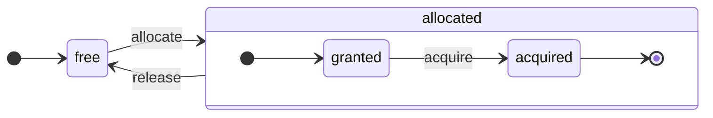

# 架构概述

ClickHouse 是一个真正的列式数据库管理系统。数据以列的形式存储，并在执行数组（列的向量或块）时进行处理。只要可能，操作会在数组上调度，而不是在单个值上执行。这种方法被称为“向量化查询执行”，有助于降低实际数据处理的成本。

这个想法并不新颖。它可以追溯到 `APL`（一种编程语言，1957）及其后裔：`A +`（APL方言）、`J`（1990）、`K`（1993）和 `Q`（Kx Systems的编程语言，2003）。数组编程在科学数据处理中被广泛使用。在关系数据库中，这个想法也不是新鲜事物。例如，它在 `VectorWise` 系统（也称为 Actian Corporation 的 Actian Vector 分析数据库）中得到了应用。

加速查询处理有两种不同的方式：向量化查询执行和运行时代码生成。后者消除了所有间接调用和动态调度。这两种方法并没有严格的优劣之分。当它合并许多操作时，运行时代码生成可能更好，从而充分利用 CPU 执行单元和流水线。向量化查询执行可能不太实用，因为它涉及必须写入缓存并重新读取的临时向量。如果临时数据无法装入 L2 缓存，这会成为一个问题。但向量化查询执行更容易利用 CPU 的 SIMD 能力。我们的朋友写的一篇 [研究论文](http://15721.courses.cs.cmu.edu/spring2016/papers/p5-sompolski.pdf) 显示，将两种方法结合使用更为有效。ClickHouse 使用向量化查询执行，并且对运行时代码生成有有限的初步支持。

## 列 {#columns}

`IColumn` 接口用于表示内存中的列（实际上是列的块）。该接口提供了实现各种关系操作符的辅助方法。几乎所有操作都是不可变的：它们不会修改原始列，而是创建一个新的修改后的列。例如，`IColumn :: filter` 方法接受一个筛选字节掩码。它用于 `WHERE` 和 `HAVING` 关系操作符。其他示例包括：`IColumn :: permute` 方法以支持 `ORDER BY`，`IColumn :: cut` 方法以支持 `LIMIT`。

各种 `IColumn` 实现（如 `ColumnUInt8`、`ColumnString` 等）负责列的内存布局。内存布局通常是一个连续数组。对于整数类型的列，它只是一个连续数组，如 `std :: vector`。对于 `String` 和 `Array` 列，它是两个向量：一个是所有数组元素，彼此连续存放，另一个是每个数组起始位置的偏移量。还有 `ColumnConst`，它在内存中只存储一个值，但看起来像一列。

## 字段 {#field}

然而，也可以对单个值进行操作。为了表示一个单独的值，使用 `Field`。`Field` 只是 `UInt64`、`Int64`、`Float64`、`String` 和 `Array` 的一种区分联合。`IColumn` 具有 `operator []` 方法，用于获取第 n 个值作为 `Field`，以及 `insert` 方法，用于将 `Field` 追加到列的末尾。这些方法效率不是很高，因为它们需要处理表示单个值的临时 `Field` 对象。还有其他更高效的方法，如 `insertFrom`、`insertRangeFrom` 等。

`Field` 对于表的特定数据类型没有足够的信息。例如，`UInt8`、`UInt16`、`UInt32` 和 `UInt64` 都在 `Field` 中表示为 `UInt64`。

## 漏洞抽象 {#leaky-abstractions}

`IColumn` 具有用于常见关系数据变换的方法，但它们并不能满足所有需求。例如，`ColumnUInt64` 没有可计算两个列的和的方法，而 `ColumnString` 没有进行子串搜索的方法。这些无数例程在 `IColumn` 之外实现。

可以以通用但效率不高的方式使用 `IColumn` 方法提取 `Field` 值，或者以专门的方式使用特定 `IColumn` 实现内部内存布局的知识来实现各种列上的功能。这通过将函数强制转换为特定 `IColumn` 类型并直接处理内部表示来实现。例如，`ColumnUInt64` 具有 `getData` 方法，返回对内部数组的引用，然后一个单独的例程直接读取或填充该数组。我们有“漏洞抽象”，以允许各种例程的高效专门化。

## 数据类型 {#data_types}

`IDataType` 负责序列化和反序列化：以二进制或文本形式读取和写入列块或单个值。`IDataType` 直接对应于表中的数据类型。例如，有 `DataTypeUInt32`、`DataTypeDateTime`、`DataTypeString` 等。

`IDataType` 和 `IColumn` 之间只有松散的联系。不同的数据类型可以通过相同的 `IColumn` 实现存储在内存中。例如，`DataTypeUInt32` 和 `DataTypeDateTime` 都可以由 `ColumnUInt32` 或 `ColumnConstUInt32` 表示。此外，同一种数据类型可以由不同的 `IColumn` 实现表示。例如，`DataTypeUInt8` 可以由 `ColumnUInt8` 或 `ColumnConstUInt8` 表示。

`IDataType` 仅存储元数据。例如，`DataTypeUInt8` 不存储任何内容（除了虚拟指针 `vptr`），而 `DataTypeFixedString` 仅存储 `N`（固定大小字符串的大小）。

`IDataType` 具有用于各种数据格式的辅助方法。示例包括用于序列化可能引用的值、为 JSON 序列化值以及以 XML 格式序列化值的方法。数据格式没有直接对应关系。例如，不同的数据格式 `Pretty` 和 `TabSeparated` 可以使用来自 `IDataType` 接口的相同 `serializeTextEscaped` 辅助方法。

## 块 {#block}

`Block` 是一个容器，表示内存中表的子集（块）。它只是一组三元组：`(IColumn, IDataType, 列名)`。在查询执行过程中，数据通过 `Block` 进行处理。如果我们有一个 `Block`，则我们拥有数据（在 `IColumn` 对象中）、关于其类型的信息（在 `IDataType` 中，告知我们如何处理该列），并且我们有列名。它可以是来自表的原始列名，也可以是为获取计算的临时结果而分配的某个人工名称。

当我们在块中的列上计算某个函数时，我们将其结果添加到块中，而不触碰函数参数的列，因为操作是不可变的。稍后，可以从块中删除不必要的列，但无法修改它。这样有助于消除公共子表达式。

每处理一块数据都会创建块。请注意，对于相同类型的计算，列名和类型在不同块之间保持相同，只有列数据发生变化。最好将块数据与块头分离，因为小块大小在复制 shared_ptr 和列名时会产生高开销。

## 处理器 {#processors}

请参阅 [https://github.com/ClickHouse/ClickHouse/blob/master/src/Processors/IProcessor.h](https://github.com/ClickHouse/ClickHouse/blob/master/src/Processors/IProcessor.h) 中的描述。

## 格式 {#formats}

数据格式是通过处理器实现的。

## 输入/输出 {#io}

对于面向字节的输入/输出，有 `ReadBuffer` 和 `WriteBuffer` 抽象类。它们代替 C++ `iostream` 使用。不要担心：每个成熟的 C++ 项目都出于良好的理由使用其他东西而不是 `iostream`。

`ReadBuffer` 和 `WriteBuffer` 只是一个连续的缓冲区以及指向该缓冲区中位置的光标。实现可以拥有或不拥有缓冲区的内存。对于 `ReadBuffer`，有一个虚拟方法用于填充以下数据，而对于 `WriteBuffer`，则用于将缓冲区刷新到某处。这些虚拟方法很少被调用。

`ReadBuffer`/`WriteBuffer` 的实现用于处理文件和文件描述符及网络套接字，用于实现压缩（`CompressedWriteBuffer` 使用另一个 WriteBuffer 初始化，并在将数据写入之前执行压缩），以及其他用途——例如，`ConcatReadBuffer`、`LimitReadBuffer` 和 `HashingWriteBuffer` 的名称都是自解释的。

读/写缓冲区只处理字节。从 `ReadHelpers` 和 `WriteHelpers` 头文件中有函数可以帮助格式化输入/输出。例如，有辅助函数将数字写入十进制格式。

让我们检查一下，当您想将结果集以 `JSON` 格式写入 stdout 时会发生什么。
您已经准备好从提取 `QueryPipeline` 中获取结果集。
首先，您创建一个 `WriteBufferFromFileDescriptor(STDOUT_FILENO)`，将字节写入 stdout。
接下来，您将查询管道的结果连接到 `JSONRowOutputFormat`，该格式使用该 `WriteBuffer` 初始化，以将行以 `JSON` 格式写入 stdout。
这可以通过 `complete` 方法完成，该方法将提取的 `QueryPipeline` 转换为已完成的 `QueryPipeline`。
在内部，`JSONRowOutputFormat` 将写入各种 JSON 分隔符，并调用 `IDataType::serializeTextJSON` 方法，参数为 `IColumn` 的引用和行号。因此，`IDataType::serializeTextJSON` 将调用 `WriteHelpers.h` 中的方法：例如，数值类型的 `writeText` 和 `DataTypeString` 的 `writeJSONString`。

## 表 {#tables}

`IStorage` 接口表示表。这种接口的不同实现是不同的表引擎。示例有 `StorageMergeTree`、`StorageMemory` 等。这些类的实例仅仅是表。

`IStorage` 的关键方法是 `read` 和 `write`，以及其他方法如 `alter`、`rename` 和 `drop`。`read` 方法接受以下参数：要从表中读取的列集合、需要考虑的 `AST` 查询和所需的流数量。它返回一个 `Pipe`。

在大多数情况下，读取方法仅负责从表中读取指定列，而不负责任何后续的数据处理。所有后续的数据处理都由管道的另一部分处理，超出了 `IStorage` 的责任。

但也有显著的例外：

- `AST` 查询被传递给 `read` 方法，表引擎可以使用它来推导索引的使用情况，并从表中读取更少的数据。
- 有时，表引擎可以将数据处理到特定阶段。例如，`StorageDistributed` 可以向远程服务器发送查询，要求它们处理数据到可以合并不同远程服务器数据的阶段，并返回预处理的数据。查询解释器随后完成数据处理。

表的 `read` 方法可以返回由多个 `Processors` 组成的 `Pipe`。这些 `Processors` 可以并行地从表中读取数据。然后，您可以将这些处理器与各种其他转换（如表达式计算或过滤）连接，这些转换可以独立计算。
然后，在其上创建 `QueryPipeline`，并通过 `PipelineExecutor` 执行它。

还有 `TableFunction`。这些是返回临时 `IStorage` 对象以便在查询的 `FROM` 子句中使用的函数。

想要快速了解如何实现您的表引擎，可以看看一些简单的实例，如 `StorageMemory` 或 `StorageTinyLog`。

> 作为 `read` 方法的结果，`IStorage` 返回 `QueryProcessingStage`——有关查询的哪些部分已经在存储中计算的信息。

## 解析器 {#parsers}

一个手写的递归下降解析器用于解析查询。例如，`ParserSelectQuery` 只是递归调用底层解析器以解析查询的各个部分。解析器创建 `AST`。`AST` 由节点表示，节点是 `IAST` 的实例。

> 由于历史原因，未使用解析器生成器。

## 解释器 {#interpreters}

解释器负责从 AST 创建查询执行管道。有简单的解释器，如 `InterpreterExistsQuery` 和 `InterpreterDropQuery`，以及更复杂的 `InterpreterSelectQuery`。

查询执行管道是可以消耗和生成块（具有特定类型的列集合）的处理器的组合。
处理器通过端口进行通信，可以拥有多个输入端口和多个输出端口。
更详细的说明可以在 [src/Processors/IProcessor.h](https://github.com/ClickHouse/ClickHouse/blob/master/src/Processors/IProcessor.h) 中找到。

例如，解释 `SELECT` 查询的结果是一个“提取型” `QueryPipeline`，它具有一个特殊的输出端口来读取结果集。
解释 `INSERT` 查询的结果是一个“推送型” `QueryPipeline`，具有一个输入端口以写入插入数据。
而解释 `INSERT SELECT` 查询的结果是一个“完成型” `QueryPipeline`，没有输入或输出，但同时将数据从 `SELECT` 复制到 `INSERT`。

`InterpreterSelectQuery` 使用 `ExpressionAnalyzer` 和 `ExpressionActions` 机制进行查询分析和转换。在这里，执行大部分基于规则的查询优化。`ExpressionAnalyzer` 非常混乱，需要重写：各种查询转换和优化应提取到单独的类中，以便实现查询的模块化转换。

为了解决解释器中存在的问题，开发了一种新版本的 `InterpreterSelectQueryAnalyzer`。这是 `InterpreterSelectQuery` 的新版本，它不使用 `ExpressionAnalyzer`，并在 `AST` 和 `QueryPipeline` 之间引入名为 `QueryTree` 的额外抽象层。它已完全准备好在生产中使用，但以防万一，可以通过将 `enable_analyzer` 设置为 `false` 来关闭。

## 函数 {#functions}

存在普通函数和聚合函数。有关聚合函数的信息，请参见下一节。

普通函数不改变行数——它们的工作就像在处理每一行时是独立的。实际上，函数不是针对单个行调用的，而是对数据块进行的，以实现向量化查询执行。

还有一些杂项函数，如 [blockSize](/sql-reference/functions/other-functions#blockSize)、[rowNumberInBlock](/sql-reference/functions/other-functions#rowNumberInBlock) 和 [runningAccumulate](/sql-reference/functions/other-functions#runningaccumulate)，它们利用块处理并破坏了行的独立性。

ClickHouse 具有强类型，因此没有隐式类型转换。如果函数不支持特定的类型组合，它会抛出异常。但函数可以针对多种不同的类型组合工作（重载）。例如，`plus` 函数（用于实现 `+` 运算符）对任何数字类型组合有效：`UInt8` + `Float32`、`UInt16` + `Int8` 等等。此外，一些可变参数函数可以接受任意数量的参数，例如 `concat` 函数。

实现函数可能稍显不便，因为函数明确调度支持的数据类型和支持的 `IColumns`。例如，`plus` 函数通过对每种数字类型组合及常量或非常量的左右参数实例化 C++ 模板生成代码。

这是实现运行时代码生成以避免模板代码膨胀的绝佳场所。此外，这使得添加融合函数（如融合乘法加法）或在一个循环迭代中进行多次比较成为可能。

由于向量化查询执行，函数不是短路的。例如，如果您写 `WHERE f(x) AND g(y)`，即使 `f(x)` 为零（除了 `f(x)` 为零常量表达式时），也会计算两侧。但是，如果 `f(x)` 条件的选择性很高，并且 `f(x)` 的计算远比 `g(y)` 便宜，则最好实现多遍计算。首先计算 `f(x)`，然后根据结果过滤列，然后仅对较小的、过滤后的数据块计算 `g(y)`。

## 聚合函数 {#aggregate-functions}

聚合函数是有状态的函数。它们将传递的值累积到某个状态中，并允许您从该状态中获取结果。它们由 `IAggregateFunction` 接口管理。状态可以相当简单（`AggregateFunctionCount` 的状态只是一个单一的 `UInt64` 值），或相当复杂（`AggregateFunctionUniqCombined` 的状态是线性数组、哈希表和 `HyperLogLog` 概率数据结构的组合）。

状态在内存池 `Arena` 中分配，以处理在执行高基数 `GROUP BY` 查询时的多个状态。状态可以具有非平凡的构造函数和析构函数：例如，复杂的聚合状态可以自行分配额外的内存。创建和销毁状态以及正确传递其所有权和销毁顺序时需要一些注意。

聚合状态可以进行序列化和反序列化，以便在分布式查询执行期间通过网络传递或在内存不足时写入磁盘。它们甚至可以存储在一个表中，使用 `DataTypeAggregateFunction` 以允许数据的增量聚合。

> 聚合函数状态的序列化数据格式目前没有版本控制。如果聚合状态仅暂时存储，这没有问题。但我们有 `AggregatingMergeTree` 表引擎用于增量聚合，人们已经在生产中使用它。这就是为什么未来在更改任何聚合函数的序列化格式时需要确保向后兼容的原因。

## 服务器 {#server}

服务器实现了几种不同的接口：

- 一个用于任何外部客户端的 HTTP 接口。
- 一个用于原生 ClickHouse 客户端和分布式查询执行期间跨服务器通信的 TCP 接口。
- 用于复制的数据传输接口。

在内部，它只是一个原始的多线程服务器，没有协程或纤维。由于服务器并不是为了处理大量简单查询而设计的，而是为了处理相对较低数量的复杂查询，因此每个查询可以处理大量的数据进行分析。

服务器使用必要的环境初始化 `Context` 类以进行查询执行：可用数据库、用户和访问权限、设置、集群、进程列表、查询日志等的列表。解释器使用该环境。

我们为服务器的 TCP 协议维护完全的向后和向前兼容性：旧客户端可以与新服务器通信，新的客户端可以与旧服务器通信。但我们不想永远维护它，并且在大约一年后，我们将停止支持旧版本。

:::note
对于大多数外部应用程序，我们建议使用 HTTP 接口，因为它简单且易于使用。TCP 协议与内部数据结构联系更紧密：它使用内部格式来传递数据块，并使用自定义格式来压缩数据。我们还没有为该协议发布 C 库，因为它需要链接大部分 ClickHouse 代码库，这并不现实。
:::

## 配置 {#configuration}

ClickHouse Server 基于 POCO C++ 库，并使用 `Poco::Util::AbstractConfiguration` 表示其配置。配置由 `Poco::Util::ServerApplication` 类持有，该类继承自 `DaemonBase` 类，而后者又继承自实现 clickhouse-server 的 `DB::Server` 类。因此，可以通过 `ServerApplication::config()` 方法访问配置。

配置从多个文件（以 XML 或 YAML 格式）读取，并由 `ConfigProcessor` 类合并为单个 `AbstractConfiguration`。配置在服务器启动时加载。如果其中一个配置文件被更新、删除或添加，则可以稍后重新加载。`ConfigReloader` 类负责定期监控这些更改和重新加载程序。`SYSTEM RELOAD CONFIG` 查询也会触发配置重新加载。

对于除了 `Server` 以外的查询和子系统，可以使用 `Context::getConfigRef()` 方法访问配置。每个能够在不重新启动服务器的情况下重新加载其配置的子系统应在 `Server::main()` 方法中的重新加载回调中注册自己。请注意，如果新配置有错误，大多数子系统将忽略新配置，记录警告消息，并继续使用先前加载的配置。由于 `AbstractConfiguration` 的特性，无法传递对特定部分的引用，因此通常使用 `String config_prefix`。

## 线程和作业 {#threads-and-jobs}

为了执行查询和进行辅助活动，ClickHouse 从线程池中分配线程以避免频繁创建和销毁线程。根据作业的目的和结构，有几个线程池被选中：

  * 服务器池用于处理传入的客户端会话。
  * 全局线程池用于通用作业、后台活动和独立线程。
  * IO 线程池用于主要在某些 IO 上被阻塞且不是 CPU 密集型的作业。
  * 背景池用于定期任务。
  * 可抢先执行的任务池，这些任务可以被分为多个步骤。

服务器池是 `Server::main()` 方法中定义的 `Poco::ThreadPool` 类实例。它最多可以拥有 `max_connection` 个线程。每个线程专注于一个单独的活动连接。

全局线程池是 `GlobalThreadPool` 单例类。要从中分配线程，使用 `ThreadFromGlobalPool`。它具有与 `std::thread` 相似的接口，但从全局池中提取线程并执行所有必要的初始化。它使用以下设置进行配置：

  * `max_thread_pool_size` - 池中线程数量限制。
  * `max_thread_pool_free_size` - 等待新作业的空闲线程数限制。
  * `thread_pool_queue_size` - 已调度作业数量限制。

全局池是通用的，下面描述的所有池都是在其上实现的。这可以被视为池的层次结构。任何专门的池都从全局池中获取其线程，使用 `ThreadPool` 类。因此，任何专门的池的主要目的都是对同时作业的数量施加限制并进行作业调度。如果调度的作业数量超过池中的线程数量，`ThreadPool` 将优先级队列中的作业进行累积。每个作业都有一个整数优先级。默认优先级为零。所有优先级值更高的作业在任何低优先级作业之前启动。但正在执行的作业之间没有区别，因此优先级仅在池过载时才重要。

IO 线程池作为简单的 `ThreadPool` 实现，可通过 `IOThreadPool::get()` 方法访问。它的配置与全局池相同，使用 `max_io_thread_pool_size`、`max_io_thread_pool_free_size` 和 `io_thread_pool_queue_size` 设置。IO 线程池的主要目的是避免通过 IO 作业耗尽全局池，这会导致查询无法充分利用 CPU。备份到 S3 会执行大量 IO 操作，为避免对交互式查询造成影响，有一个单独的 `BackupsIOThreadPool`，它使用 `max_backups_io_thread_pool_size`、`max_backups_io_thread_pool_free_size` 和 `backups_io_thread_pool_queue_size` 设置进行配置。

对于周期任务执行，存在 `BackgroundSchedulePool` 类。您可以使用 `BackgroundSchedulePool::TaskHolder` 对象注册任务，池确保不会同时为同一任务运行两个作业。它还允许您将任务执行推迟到将来的特定时刻或临时停用任务。全局 `Context` 提供了此类多个实例以用于不同目的。对于通用任务，使用 `Context::getSchedulePool()`。

还有专门的线程池用于可抢先执行的任务。这样的 `IExecutableTask` 任务可以被分为有序的作业序列，称为步骤。为了以允许短任务优先于长任务的方式调度这些任务，使用 `MergeTreeBackgroundExecutor`。顾名思义，它用于与背景 MergeTree 相关的操作，如合并、变异、提取和移动。池实例可以通过 `Context::getCommonExecutor()` 和其他类似方法获得。

无论用于作业的池是什么，启动时都会为此作业创建 `ThreadStatus` 实例。它封装了所有每线程信息：线程 ID、查询 ID、性能计数器、资源消耗以及其他许多有用数据。作业可以通过 `CurrentThread::get()` 调用通过线程本地指针访问它，因此我们不需要将其传递给每个函数。

如果线程与查询执行相关，则附加到 `ThreadStatus` 的最重要的信息是查询上下文 `ContextPtr`。每个查询在服务器池中都有其主线程。主线程通过持有 `ThreadStatus::QueryScope query_scope(query_context)` 对象进行附加。主线程还创建一个线程组，由 `ThreadGroupStatus` 对象表示。在此查询执行期间分配的每个附加线程都通过 `CurrentThread::attachTo(thread_group)` 调用附加到其线程组。线程组用于聚合事件计数器和跟踪所有专用于单个任务的线程的内存消耗（有关更多信息，请参见 `MemoryTracker` 和 `ProfileEvents::Counters` 类）。

## 并发控制 {#concurrency-control}

可以并行化的查询使用 `max_threads` 设置来限制自己。该设置的默认值经过选择，以便单个查询能够以最佳方式利用所有 CPU 核心。但如果有多个并发查询，并且每个查询都使用默认的 `max_threads` 设置值呢？那么查询将共享 CPU 资源。操作系统将通过不断地切换线程来确保公平，这会引入一定的性能惩罚。`ConcurrencyControl` 有助于处理这一惩罚，避免分配过多的线程。配置设置 `concurrent_threads_soft_limit_num` 用于限制在施加某种 CPU 压力之前可以分配多少个并发线程。

引入了 CPU `slot` 的概念。槽是一个并发的单位：要运行线程，查询必须事先获取槽并在线程停止时释放它。槽的数量在服务器中是全局限制的。如果总需求超出总槽数量，则会有多个并发查询竞争 CPU 槽。`ConcurrencyControl` 负责通过公平地进行 CPU 槽调度来解决这一竞争。

每个槽都可以被视为一个独立的状态机，具有以下状态：
 * `free`：槽可供任何查询分配。
 * `granted`：槽被特定查询 `allocated`，但尚未被任何线程获取。
 * `acquired`：槽被特定查询 `allocated` 并被线程获取。

注意，`allocated` 槽可以处于两种不同的状态：`granted` 和 `acquired`。前者是一个过渡状态，实际上应该是短暂的（从槽被分配到查询之时开始，到该查询的任何线程运行扩展程序的时刻为止）。

`ConcurrencyControl` 的 API 由以下函数组成：
1. 为查询创建资源分配：`auto slots = ConcurrencyControl::instance().allocate(1, max_threads);`。它将分配至少1个，最多 `max_threads` 个槽。注意，第一个槽会立即授予，但其余槽可能稍后才会授予。因此，限制是软限制，因为每个查询将至少获得一个线程。
2. 对于每个线程，必须从分配中获取槽：`while (auto slot = slots->tryAcquire()) spawnThread([slot = std::move(slot)] { ... });`。
3. 更新槽的总数：`ConcurrencyControl::setMaxConcurrency(concurrent_threads_soft_limit_num)`。可在运行时完成，无需重新启动服务器。

该 API 允许查询以至少一个线程启动（在存在 CPU 压力的情况下），并随后扩展到 `max_threads`。

## 分布式查询执行 {#distributed-query-execution}

集群设置中的服务器大多数是独立的。您可以在集群中的一台或所有服务器上创建一个 `Distributed` 表。`Distributed` 表本身不存储数据——它只提供对多个节点上所有本地表的“视图”。当您从一个 `Distributed` 表中选择数据时，它将重写该查询，根据负载平衡设置选择远程节点，并将查询发送给它们。`Distributed` 表请求远程服务器处理查询，直到不同服务器的中间结果可以合并为止。然后，它接收中间结果并将其合并。分布式表尝试将尽可能多的工作分配给远程服务器，并且不会通过网络发送过多的中间数据。

当您在 IN 或 JOIN 子句中有子查询，而每个子查询都使用 `Distributed` 表时，情况变得更加复杂。我们对这些查询的执行有不同的策略。

分布式查询执行没有全局查询计划。每个节点都有自己的本地查询计划，处理其工作的部分。我们仅有简单的一次性分布式查询执行：我们向远程节点发送查询，然后合并结果。但对于具有高基数的 `GROUP BY` 或大的临时数据量的 JOIN 的复杂查询，这并不可行。在这种情况下，我们需要在服务器之间“重新洗牌”数据，这需要额外的协调。ClickHouse 不支持这种查询执行，我们需要对此进行改进。
## Merge Tree {#merge-tree}

`MergeTree` 是一系列支持主键索引的存储引擎。主键可以是任意列或表达式的元组。`MergeTree` 表中的数据存储在“部分”中。每个部分按照主键顺序存储数据，因此数据按主键元组的字典序排列。所有表列存储在这些部分的单独 `column.bin` 文件中。这些文件由压缩块组成。每个块通常包含从 64 KB 到 1 MB 的未压缩数据，具体取决于平均值大小。块由按照顺序连续放置的列值组成。每列的列值顺序相同（主键定义了顺序），因此当您在多个列中迭代时，您将获得对应行的值。

主键本身是“稀疏的”。它并不指向每一行，而仅指向某些数据范围。一个单独的 `primary.idx` 文件记录每第 N 行的主键值，其中 N 被称为 `index_granularity`（通常，N = 8192）。此外，对于每列，我们还提供包含“标记”的 `column.mrk` 文件，这些标记是数据文件中每第 N 行的偏移量。每个标记是一个对：文件中压缩块起始位置的偏移量，以及在解压块中到数据起始位置的偏移量。通常，压缩块由标记对齐，并且在解压块中的偏移量为零。`primary.idx` 的数据始终驻留在内存中，而 `column.mrk` 文件的数据则被缓存。

当我们打算从 `MergeTree` 的某个部分读取数据时，我们查看 `primary.idx` 数据并定位可能包含请求数据的范围，然后查看 `column.mrk` 数据并计算从何处开始读取这些范围。由于稀疏性，可能会读取多余的数据。ClickHouse 不适合高负载的简单点查询，因为每个键必须读取整个范围的 `index_granularity` 行，并且每列的整个压缩块必须被解压。我们之所以使索引稀疏，是因为我们必须能够在单个服务器上维护数万亿行，没有明显的内存消耗。此外，由于主键是稀疏的，它不是唯一的：在 INSERT 时无法检查表中键的存在。您可以在表中有许多具有相同键的行。

当您将一批数据 `INSERT` 到 `MergeTree` 中时，这批数据会按照主键顺序排序并形成一个新部分。后台线程会定期选择某些部分并将它们合并成一个排序部分，以保持部分数量相对较低。这就是它被称为 `MergeTree` 的原因。当然，合并会导致“写放大”。所有部分都是不可变的：它们只创建和删除，而不修改。当执行 SELECT 时，它会保留表的快照（一个部分集合）。合并后，我们也会保留旧部分一段时间，以便在故障后更容易进行恢复，因此如果我们发现某个合并部分可能损坏，我们可以用其源部分替换它。

`MergeTree` 不是 LSM 树，因为它不包含 MEMTABLE 和 LOG：插入的数据直接写入文件系统。这种行为使 MergeTree 更加适合批量插入数据。因此，频繁插入少量行并不理想。例如，每秒几行是可以的，但每秒进行一千次则不适用于 MergeTree。然而，对于小的插入，有一种异步插入模式可以克服这一限制。我们这样做是为了简单起见，因为我们在应用程序中已经批量插入数据。

有些 MergeTree 引擎在后台合并期间进行额外工作。例如 `CollapsingMergeTree` 和 `AggregatingMergeTree`。这可以被视为对更新的特殊支持。请记住，这些并不是真正的更新，因为用户通常无法控制后台合并执行的时间，而 `MergeTree` 表中的数据几乎总是存储在不止一个部分中，而不是完全合并的形式。
## Replication {#replication}

在 ClickHouse 中，复制可以针对每个表进行配置。您可以在同一服务器上拥有一些复制表和一些非复制表。您也可以以不同方式复制表，例如，一个表具有双重复制而另一个表具有三重复制。

复制在 `ReplicatedMergeTree` 存储引擎中实现。`ZooKeeper` 中的路径作为存储引擎的参数指定。所有在 `ZooKeeper` 中具有相同路径的表彼此成为副本：它们同步其数据并保持一致性。副本可以动态添加和删除，只需创建或删除一个表。

复制使用异步多主方案。您可以将数据插入到与 `ZooKeeper` 具有会话的任何副本中，数据会异步复制到所有其他副本。由于 ClickHouse 不支持 UPDATE，复制是无冲突的。由于默认情况下没有插入的多数确认，因此如果一个节点失败，刚插入的数据可能会丢失。可以使用 `insert_quorum` 设置启用插入的多数。

复制的元数据存储在 ZooKeeper 中。有一个复制日志列出要执行的操作。操作包括：获取部分；合并部分；删除分区，等等。每个副本将复制复制日志到其队列，然后执行队列中的操作。例如，在插入时，会在日志中创建“获取部分”操作，所有副本将下载该部分。合并在副本之间协调，以获得字节相同的结果。所有副本以相同方式合并所有部分。一个领导者首先发起新的合并，并将“合并部分”操作写入日志。多个副本（或全部）可以同时作为领导者。可以使用 `merge_tree` 设置 `replicated_can_become_leader` 来阻止副本成为领导者。领导者负责调度后台合并。

复制是物理的：仅压缩部分在节点之间传输，而不是查询。合并在每个副本上独立处理，以降低网络成本，避免网络放大。仅在存在显著复制延迟的情况下，才通过网络发送大型合并部分。

此外，每个副本在 ZooKeeper 中存储其状态，作为部分及其校验和的集合。当本地文件系统上的状态与 ZooKeeper 中的参考状态发生偏差时，该副本通过从其他副本下载缺失和损坏的部分来恢复其一致性。当本地文件系统中存在意外或损坏的数据时，ClickHouse 不会删除它，而是将其移动到单独的目录中并忘记它。

:::note
ClickHouse 集群由独立的分片组成，每个分片由副本组成。集群是 **非弹性的**，因此在添加新分片后，数据不会在分片之间自动重新平衡。相反，集群负载被假定为不均匀。这种实现让您拥有更多的控制权，适合相对较小的集群，如几十个节点。但对于我们在生产中使用的数百个节点的集群，这种方法就成了一个显著的缺点。我们应该实现一个跨越集群的表引擎，具有动态复制区域，可以在各个集群之间自动拆分和平衡。
:::
