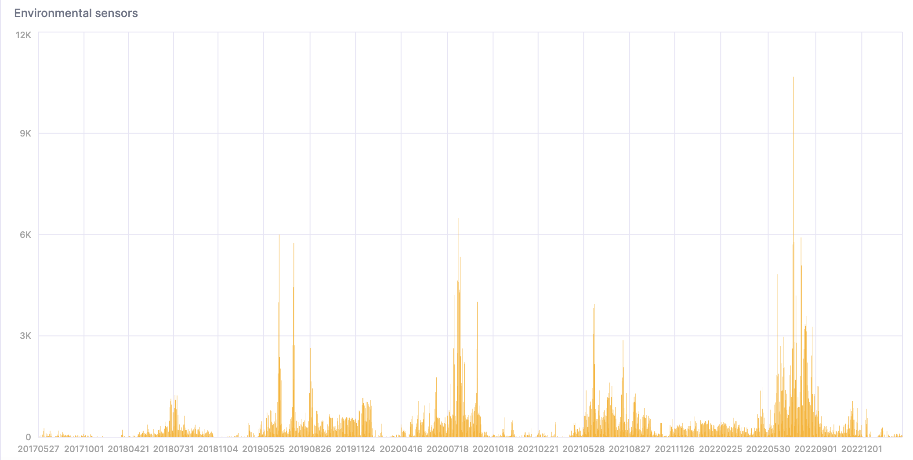

[Sensor.Community](https://sensor.community/en/) 是一个由贡献者驱动的全球传感器网络，创建开放环境数据。这些数据来自全球各地的传感器。任何人都可以购买传感器并将其放置在任何他们喜欢的地方。下载数据的 API 在 [GitHub](https://github.com/opendata-stuttgart/meta/wiki/APIs) 上，并且数据在 [数据库内容许可证 (DbCL)](https://opendatacommons.org/licenses/dbcl/1-0/) 下可免费获取。

:::important
该数据集包含超过 200 亿条记录，因此在复制和粘贴下面的命令之前，请务必确保您的资源能够处理这类数据量。以下命令是在 [ClickHouse Cloud](https://clickhouse.cloud) 的 **生产** 实例上执行的。
:::

1. 数据存储在 S3 中，因此我们可以使用 `s3` 表函数从文件中创建表。我们也可以原地查询数据。在尝试将其插入 ClickHouse 之前，让我们先查看几行：

```sql
SELECT *
FROM s3(
    'https://clickhouse-public-datasets.s3.eu-central-1.amazonaws.com/sensors/monthly/2019-06_bmp180.csv.zst',
    'CSVWithNames'
   )
LIMIT 10
SETTINGS format_csv_delimiter = ';';
```

数据以 CSV 文件的形式存在，但使用分号作为分隔符。行看起来像：

```response
┌─sensor_id─┬─sensor_type─┬─location─┬────lat─┬────lon─┬─timestamp───────────┬──pressure─┬─altitude─┬─pressure_sealevel─┬─temperature─┐
│      9119 │ BMP180      │     4594 │ 50.994 │  7.126 │ 2019-06-01T00:00:00 │    101471 │ ᴺᵁᴸᴸ     │ ᴺᵁᴸᴸ              │        19.9 │
│     21210 │ BMP180      │    10762 │ 42.206 │ 25.326 │ 2019-06-01T00:00:00 │     99525 │ ᴺᵁᴸᴸ     │ ᴺᵁᴸᴸ              │        19.3 │
│     19660 │ BMP180      │     9978 │ 52.434 │ 17.056 │ 2019-06-01T00:00:04 │    101570 │ ᴺᵁᴸᴸ     │ ᴺᵁᴸᴸ              │        15.3 │
│     12126 │ BMP180      │     6126 │ 57.908 │  16.49 │ 2019-06-01T00:00:05 │ 101802.56 │ ᴺᵁᴸᴸ     │ ᴺᵁᴸᴸ              │        8.07 │
│     15845 │ BMP180      │     8022 │ 52.498 │ 13.466 │ 2019-06-01T00:00:05 │    101878 │ ᴺᵁᴸᴸ     │ ᴺᵁᴸᴸ              │          23 │
│     16415 │ BMP180      │     8316 │ 49.312 │  6.744 │ 2019-06-01T00:00:06 │    100176 │ ᴺᵁᴸᴸ     │ ᴺᵁᴸᴸ              │        14.7 │
│      7389 │ BMP180      │     3735 │ 50.136 │ 11.062 │ 2019-06-01T00:00:06 │     98905 │ ᴺᵁᴸᴸ     │ ᴺᵁᴸᴸ              │        12.1 │
│     13199 │ BMP180      │     6664 │ 52.514 │  13.44 │ 2019-06-01T00:00:07 │ 101855.54 │ ᴺᵁᴸᴸ     │ ᴺᵁᴸᴸ              │       19.74 │
│     12753 │ BMP180      │     6440 │ 44.616 │  2.032 │ 2019-06-01T00:00:07 │     99475 │ ᴺᵁᴸᴸ     │ ᴺᵁᴸᴸ              │          17 │
│     16956 │ BMP180      │     8594 │ 52.052 │  8.354 │ 2019-06-01T00:00:08 │    101322 │ ᴺᵁᴸᴸ     │ ᴺᵁᴸᴸ              │        17.2 │
└───────────┴─────────────┴──────────┴────────┴────────┴─────────────────────┴───────────┴──────────┴───────────────────┴─────────────┘
```

2. 我们将使用以下 `MergeTree` 表在 ClickHouse 中存储数据：

```sql
CREATE TABLE sensors
(
    sensor_id UInt16,
    sensor_type Enum('BME280', 'BMP180', 'BMP280', 'DHT22', 'DS18B20', 'HPM', 'HTU21D', 'PMS1003', 'PMS3003', 'PMS5003', 'PMS6003', 'PMS7003', 'PPD42NS', 'SDS011'),
    location UInt32,
    lat Float32,
    lon Float32,
    timestamp DateTime,
    P1 Float32,
    P2 Float32,
    P0 Float32,
    durP1 Float32,
    ratioP1 Float32,
    durP2 Float32,
    ratioP2 Float32,
    pressure Float32,
    altitude Float32,
    pressure_sealevel Float32,
    temperature Float32,
    humidity Float32,
    date Date MATERIALIZED toDate(timestamp)
)
ENGINE = MergeTree
ORDER BY (timestamp, sensor_id);
```

3. ClickHouse Cloud 服务有一个名为 `default` 的集群。我们将使用 `s3Cluster` 表函数，它从集群中的节点并行读取 S3 文件。（如果您没有集群，只需使用 `s3` 函数并去掉集群名称。）

此查询将需要一段时间 - 解压后的数据大约是 1.67T：

```sql
INSERT INTO sensors
    SELECT *
    FROM s3Cluster(
        'default',
        'https://clickhouse-public-datasets.s3.amazonaws.com/sensors/monthly/*.csv.zst',
        'CSVWithNames',
        $$ sensor_id UInt16,
        sensor_type String,
        location UInt32,
        lat Float32,
        lon Float32,
        timestamp DateTime,
        P1 Float32,
        P2 Float32,
        P0 Float32,
        durP1 Float32,
        ratioP1 Float32,
        durP2 Float32,
        ratioP2 Float32,
        pressure Float32,
        altitude Float32,
        pressure_sealevel Float32,
        temperature Float32,
        humidity Float32 $$
    )
SETTINGS
    format_csv_delimiter = ';',
    input_format_allow_errors_ratio = '0.5',
    input_format_allow_errors_num = 10000,
    input_format_parallel_parsing = 0,
    date_time_input_format = 'best_effort',
    max_insert_threads = 32,
    parallel_distributed_insert_select = 1;
```

这是响应 - 显示行数和处理速度。以超过 600 万行每秒的速度进行输入！

```response
0 rows in set. Elapsed: 3419.330 sec. Processed 20.69 billion rows, 1.67 TB (6.05 million rows/s., 488.52 MB/s.)
```

4. 现在让我们来看看 `sensors` 表需要多少存储空间：

```sql
SELECT
    disk_name,
    formatReadableSize(sum(data_compressed_bytes) AS size) AS compressed,
    formatReadableSize(sum(data_uncompressed_bytes) AS usize) AS uncompressed,
    round(usize / size, 2) AS compr_rate,
    sum(rows) AS rows,
    count() AS part_count
FROM system.parts
WHERE (active = 1) AND (table = 'sensors')
GROUP BY
    disk_name
ORDER BY size DESC;
```

1.67T 的数据压缩后为 310 GiB，共有 20.69 亿行：

```response
┌─disk_name─┬─compressed─┬─uncompressed─┬─compr_rate─┬────────rows─┬─part_count─┐
│ s3disk    │ 310.21 GiB │ 1.30 TiB     │       4.29 │ 20693971809 │        472 │
└───────────┴────────────┴──────────────┴────────────┴─────────────┴────────────┘
```

5. 数据进入 ClickHouse 后让我们分析一下。注意，随着更多传感器的部署，数据数量不断增加：

```sql
SELECT
    date,
    count()
FROM sensors
GROUP BY date
ORDER BY date ASC;
```

我们可以在 SQL 控制台中创建图表来可视化结果：


6. 此查询计算过于炎热和潮湿的天数：

```sql
WITH
    toYYYYMMDD(timestamp) AS day
SELECT day, count() FROM sensors
WHERE temperature >= 40 AND temperature <= 50 AND humidity >= 90
GROUP BY day
ORDER BY day asc;
```

这是结果的可视化：


