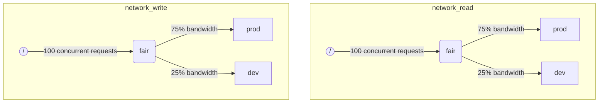

当 ClickHouse 同时执行多个查询时，它们可能会使用共享资源（例如磁盘和 CPU 核心）。可以应用调度约束和策略来调节不同工作负载之间如何使用和共享资源。对于所有资源，可以配置一个通用的调度层次结构。层次结构的根节点表示共享资源，而叶子节点是特定的工作负载，包含超过资源容量的请求。

:::note
目前可以使用所描述的方法调度 [remote disk IO](#disk_config) 和 [CPU](#cpu_scheduling)。有关灵活的内存限制，请参见 [Memory overcommit](settings/memory-overcommit.md)
:::

## 磁盘配置 {#disk_config}

要为特定磁盘启用 IO 工作负载调度，您必须为 WRITE 和 READ 访问创建读取和写入资源：

```sql
CREATE RESOURCE resource_name (WRITE DISK disk_name, READ DISK disk_name)
-- or
CREATE RESOURCE read_resource_name (WRITE DISK write_disk_name)
CREATE RESOURCE write_resource_name (READ DISK read_disk_name)
```

该资源可以用于任何数量的磁盘，包括只读、只写或读写。可以使用一种语法，使资源适用于所有磁盘：

```sql
CREATE RESOURCE all_io (READ ANY DISK, WRITE ANY DISK);
```

另一种表达资源所使用的磁盘的方式是服务器的 `storage_configuration`：

:::warning
使用 ClickHouse 配置进行工作负载调度已被弃用。应使用 SQL 语法。
:::

要为特定磁盘启用 IO 调度，您必须在存储配置中指定 `read_resource` 和/或 `write_resource`。它告诉 ClickHouse 应该为给定磁盘的每个读写请求使用哪个资源。读取和写入资源可以引用相同的资源名称，这对本地 SSD 或 HDD 很有用。多个不同的磁盘也可以引用同一资源，这对于远程磁盘很有用：如果您想能够在“生产”和“开发”工作负载之间公平分配网络带宽。

示例：
```xml
<clickhouse>
    <storage_configuration>
        ...
        <disks>
            <s3>
                <type>s3</type>
                <endpoint>https://clickhouse-public-datasets.s3.amazonaws.com/my-bucket/root-path/</endpoint>
                <access_key_id>your_access_key_id</access_key_id>
                <secret_access_key>your_secret_access_key</secret_access_key>
                <read_resource>network_read</read_resource>
                <write_resource>network_write</write_resource>
            </s3>
        </disks>
        <policies>
            <s3_main>
                <volumes>
                    <main>
                        <disk>s3</disk>
                    </main>
                </volumes>
            </s3_main>
        </policies>
    </storage_configuration>
</clickhouse>
```

请注意，服务器配置选项优先于 SQL 定义资源的方式。

## 工作负载标记 {#workload_markup}

查询可以通过设置 `workload` 来标记，以区分不同的工作负载。如果未设置 `workload`，则使用值 "default"。注意，您可以使用设置配置来指定其他值。如果希望来自用户的所有查询都标记为固定值的 `workload` 设置，可以使用设置约束使 `workload` 保持不变。

可以为后台活动分配 `workload` 设置。合并和变更使用相应的 `merge_workload` 和 `mutation_workload` 服务器设置。这些值也可以通过特定表使用 `merge_workload` 和 `mutation_workload` MergeTree 设置进行覆盖。

让我们考虑一个具有两个不同工作负载的系统：“生产”和“开发”。

```sql
SELECT count() FROM my_table WHERE value = 42 SETTINGS workload = 'production'
SELECT count() FROM my_table WHERE value = 13 SETTINGS workload = 'development'
```

## 资源调度层次 {#hierarchy}

从调度子系统的角度来看，资源表示一个调度节点的层次结构。



:::warning
使用 ClickHouse 配置进行工作负载调度已被弃用。应使用 SQL 语法。SQL 语法会自动创建所有必要的调度节点，以下调度节点说明应视为较低级的实现细节，可以通过 [system.scheduler](/operations/system-tables/scheduler.md) 表访问。
:::

**可能的节点类型：**
* `inflight_limit`（约束） - 如果并发的未完成请求数量超过 `max_requests`，或它们的总成本超过 `max_cost`，则会阻塞；必须有一个子节点。
* `bandwidth_limit`（约束） - 如果当前带宽超过 `max_speed`（0表示无限制）或突发超过 `max_burst`（默认等于 `max_speed`），则会阻塞；必须有一个子节点。
* `fair`（策略） - 根据最大最小公平性，从其子节点中选择下一个请求进行服务；子节点可以指定 `weight`（默认是1）。
* `priority`（策略） - 根据静态优先级从其子节点中选择下一个请求进行服务（较低的值意味着更高的优先级）；子节点可以指定 `priority`（默认是0）。
* `fifo`（队列） - 持有超过资源容量的请求的层次结构叶子。

为了能够充分利用基础资源，您应该使用 `inflight_limit`。注意，较低的 `max_requests` 或 `max_cost` 可能会导致资源未得到充分利用，而过高的数字可能会导致调度器内部出现空队列，从而导致子树中忽略策略（不公平或忽视优先级）。另一方面，如果您希望保护资源免受过高的利用，您应该使用 `bandwidth_limit`。当在 `duration` 秒内消耗的资源量超过 `max_burst + max_speed * duration` 字节时，它将进行节流。同一资源上的两个 `bandwidth_limit` 节点可以用于限制短时间内的峰值带宽和更长时间的平均带宽。

以下示例展示了如何定义在图片中所示的 IO 调度层次结构：

```xml
<clickhouse>
    <resources>
        <network_read>
            <node path="/">
                <type>inflight_limit</type>
                <max_requests>100</max_requests>
            </node>
            <node path="/fair">
                <type>fair</type>
            </node>
            <node path="/fair/prod">
                <type>fifo</type>
                <weight>3</weight>
            </node>
            <node path="/fair/dev">
                <type>fifo</type>
            </node>
        </network_read>
        <network_write>
            <node path="/">
                <type>inflight_limit</type>
                <max_requests>100</max_requests>
            </node>
            <node path="/fair">
                <type>fair</type>
            </node>
            <node path="/fair/prod">
                <type>fifo</type>
                <weight>3</weight>
            </node>
            <node path="/fair/dev">
                <type>fifo</type>
            </node>
        </network_write>
    </resources>
</clickhouse>
```

## 工作负载分类器 {#workload_classifiers}

:::warning
使用 ClickHouse 配置进行工作负载调度已被弃用。应使用 SQL 语法。使用 SQL 语法时会自动创建分类器。
:::

工作负载分类器用于根据查询中指定的 `workload` 定义到应使用的特定资源的叶子队列的映射。目前，工作负载分类是简单的：只有静态映射可用。

示例：
```xml
<clickhouse>
    <workload_classifiers>
        <production>
            <network_read>/fair/prod</network_read>
            <network_write>/fair/prod</network_write>
        </production>
        <development>
            <network_read>/fair/dev</network_read>
            <network_write>/fair/dev</network_write>
        </development>
        <default>
            <network_read>/fair/dev</network_read>
            <network_write>/fair/dev</network_write>
        </default>
    </workload_classifiers>
</clickhouse>
```

## 工作负载层次 {#workloads}

ClickHouse 提供了方便的 SQL 语法来定义调度层次。所有通过 `CREATE RESOURCE` 创建的资源共享相同的层次结构，但在某些方面可能不同。通过 `CREATE WORKLOAD` 创建的每个工作负载保持为每个资源自动创建的一些调度节点。子工作负载可以在另一个父工作负载内创建。以下是定义与上述 XML 配置完全相同的层次结构的示例：

```sql
CREATE RESOURCE network_write (WRITE DISK s3)
CREATE RESOURCE network_read (READ DISK s3)
CREATE WORKLOAD all SETTINGS max_io_requests = 100
CREATE WORKLOAD development IN all
CREATE WORKLOAD production IN all SETTINGS weight = 3
```

没有子项的叶子工作负载的名称可以在查询设置中使用 `SETTINGS workload = 'name'`。

要自定义工作负载，可以使用以下设置：
* `priority` - 兄弟工作负载根据静态优先级值进行服务（较低的值意味着更高的优先级）。
* `weight` - 拥有相同静态优先级的兄弟工作负载根据权重共享资源。
* `max_io_requests` - 在此工作负载中并发 IO 请求的次数限制。
* `max_bytes_inflight` - 此工作负载中并发请求的总浮动字节的限制。
* `max_bytes_per_second` - 此工作负载的字节读取或写入速率限制。
* `max_burst_bytes` - 此工作负载在未受到节流的情况下可处理的最大字节数（针对每个资源独立设置）。
* `max_concurrent_threads` - 此工作负载中查询的线程数的限制。
* `max_concurrent_threads_ratio_to_cores` - 与 `max_concurrent_threads` 相同，但归一化为可用 CPU 核心的数量。
* `max_cpus` - 为在此工作负载中服务查询而限制的 CPU 核心数量。
* `max_cpu_share` - 与 `max_cpus` 相同，但归一化为可用 CPU 核心的数量。
* `max_burst_cpu_seconds` - 此工作负载在未受到由于 `max_cpus` 而节流的情况下可以消耗的最大 CPU 秒数。

通过工作负载设置指定的所有限制对于每个资源是独立的。例如，具有 `max_bytes_per_second = 10485760` 的工作负载在每个独立的读取和写入资源上将有 10 MB/s 的带宽限制。如果需要读取和写入的共同限制，请考虑对 READ 和 WRITE 访问使用相同的资源。

对于不同资源的工作负载，无法指定不同的层次结构。但是，确实可以为特定资源指定不同的工作负载设置值：

```sql
CREATE OR REPLACE WORKLOAD all SETTINGS max_io_requests = 100, max_bytes_per_second = 1000000 FOR network_read, max_bytes_per_second = 2000000 FOR network_write
```

此外，请注意，如果工作负载被另一个工作负载引用，则无法删除工作负载或资源。要更新工作负载的定义，请使用 `CREATE OR REPLACE WORKLOAD` 查询。

:::note
工作负载设置被转换为适当的调度节点集。有关更低级细节，请参见调度节点 [类型和选项](#hierarchy) 的描述。
:::

## CPU 调度 {#cpu_scheduling}

要为工作负载启用 CPU 调度，请创建 CPU 资源并设置并发线程数的限制：

```sql
CREATE RESOURCE cpu (MASTER THREAD, WORKER THREAD)
CREATE WORKLOAD all SETTINGS max_concurrent_threads = 100
```

当 ClickHouse 服务器执行许多并发查询，并且所有 CPU 插槽都在使用时，达到超负荷状态。在超负荷状态下，释放的每个 CPU 插槽根据调度政策重新调度到适当的工作负载。对于共享同一工作负载的查询，插槽使用轮询分配。对于处于不同工作负载中的查询，插槽根据工作负载指定的权重、优先级和限制进行分配。

当线程未被阻塞并在 CPU 密集型任务上工作时，会消耗 CPU 时间。为了调度目的，将线程分为两种：
* 主线程 — 首先开始处理查询或后台活动（如合并或变更）的线程。
* 工作线程 — 主线程可以生成的附加线程，以处理 CPU 密集型任务。

为了提高响应速度，可能希望为主线程和工作线程使用独立资源。当使用高 `max_threads` 查询设置值时，大量工作线程可能轻易垄断 CPU 资源。然后，传入的查询应阻塞并等待 CPU 插槽，以便其主线程开始执行。为避免这种情况，可以使用以下配置：

```sql
CREATE RESOURCE worker_cpu (WORKER THREAD)
CREATE RESOURCE master_cpu (MASTER THREAD)
CREATE WORKLOAD all SETTINGS max_concurrent_threads = 100 FOR worker_cpu, max_concurrent_threads = 1000 FOR master_cpu
```

这将创建主线程和工作线程的单独限制。即使所有 100 个工作 CPU 插槽都已占用，新的查询也不会被阻塞，直到有可用的主 CPU 插槽。它们将使用一个线程开始执行。稍后，如果工作 CPU 插槽变得可用，这样的查询可以扩展并生成它们的工作线程。另一方面，这种方法并不会将总插槽数绑定到 CPU 处理器的数量，运行过多的并发线程会影响性能。

限制主线程的并发性并不会限制并发查询的数量。CPU 插槽可能会在查询执行的中间被释放，并被其他线程重新获得。例如，具有 2 个并发主线程限制的 4 个并发查询可以全部并行执行。在这种情况下，每个查询将获得 CPU 处理器的 50%。应使用单独的逻辑来限制并发查询的数量，目前不支持用于工作负载。

可以对工作负载使用单独线程并发限制：

```sql
CREATE RESOURCE cpu (MASTER THREAD, WORKER THREAD)
CREATE WORKLOAD all
CREATE WORKLOAD admin IN all SETTINGS max_concurrent_threads = 10
CREATE WORKLOAD production IN all SETTINGS max_concurrent_threads = 100
CREATE WORKLOAD analytics IN production SETTINGS max_concurrent_threads = 60, weight = 9
CREATE WORKLOAD ingestion IN production
```

此配置示例为管理和生产提供独立的 CPU 插槽池。生产池在分析和摄取之间共享。此外，如果生产池超负荷，释放的 10 个插槽中将有 9 个转回分析查询（如果必要）。在超负荷期间，摄取查询将仅获得 10 个插槽中的 1 个。这可能改善用户可见查询的延迟。分析的并发线程限制为 60，始终留出至少 40 个线程以支持摄取。当没有超负荷时，摄取可以使用所有 100 个线程。

要排除查询的 CPU 调度，请将查询设置 [use_concurrency_control](/operations/settings/settings.md/#use_concurrency_control) 设置为 0。

目前尚不支持合并和变更的 CPU 调度。

为了为工作负载提供公平分配，需要在查询执行期间执行抢占和降级。当启用 `cpu_slot_preemption` 服务器设置时，启用抢占。如果启用，每个线程会定期更新其 CPU 插槽（根据 `cpu_slot_quantum_ns` 服务器设置）。这样的更新可能会在 CPU 超负荷时阻塞执行。当执行被阻塞长时间（请参见 `cpu_slot_preemption_timeout_ms` 服务器设置）时，查询会降级，并且并发运行的线程数量动态减少。注意，工作负载之间的 CPU 时间公平性得到保证，但在同一工作负载内的查询之间在某些特殊情况下可能会被违反。

:::warning
插槽调度提供了一种控制 [查询并发性](/operations/settings/settings.md#max_threads) 的方式，但在服务器设置 `cpu_slot_preemption` 设置为 `true` 时，才会保证公平的 CPU 时间分配；否则，公平性是根据竞争工作负载中的 CPU 插槽分配数量提供的。这并不意味着相等的 CPU 秒数，因为在没有抢占的情况下，CPU 插槽可能会无期限地被占用。线程在开始时获取插槽，完成工作时释放。
:::

:::note
声明 CPU 资源将禁用 [`concurrent_threads_soft_limit_num`](server-configuration-parameters/settings.md#concurrent_threads_soft_limit_num) 和 [`concurrent_threads_soft_limit_ratio_to_cores`](server-configuration-parameters/settings.md#concurrent_threads_soft_limit_ratio_to_cores) 设置的效果。相反，使用工作负载设置 `max_concurrent_threads` 来限制分配给特定工作负载的 CPU 数量。要实现以前的行为，请仅创建工作线程资源，将工作负载 `all` 的 `max_concurrent_threads` 设置为与 `concurrent_threads_soft_limit_num` 相同的值，并使用查询设置 `workload = "all"`。此配置对应于 [`concurrent_threads_scheduler`](server-configuration-parameters/settings.md#concurrent_threads_scheduler) 设置为 "fair_round_robin" 值。
:::

## 线程与 CPU {#threads_vs_cpus}

有两种方法可以控制工作负载的 CPU 消耗：
* 线程数量限制：`max_concurrent_threads` 和 `max_concurrent_threads_ratio_to_cores`
* CPU 节流：`max_cpus`、`max_cpu_share` 和 `max_burst_cpu_seconds`

第一种允许根据当前服务器负载动态控制查询生成的线程数量。它有效地降低了 `max_threads` 查询设置的要求。第二种使用令牌桶算法来节流工作负载的 CPU 消耗。它不会直接影响线程数量，但会节流工作负载中所有线程的总 CPU 消耗。

使用 `max_cpus` 和 `max_burst_cpu_seconds` 的令牌桶节流意味着以下内容。在任何 `delta` 秒的时间间隔内，工作负载中所有查询的总 CPU 消耗不得大于 `max_cpus * delta + max_burst_cpu_seconds` CPU 秒。这在长期内限制了平均消耗 `max_cpus`，但在短期内，可能会超过该限制。例如，给定 `max_burst_cpu_seconds = 60` 和 `max_cpus=0.001`，可以在没有节流的情况下运行 1 个线程 60 秒、2 个线程 30 秒或 60 个线程 1 秒。`max_burst_cpu_seconds` 的默认值为 1 秒。较低的值可能会导致在许多并发线程的情况下不能充分利用允许的 `max_cpus` 核心。

:::warning
CPU 节流设置仅在启用 `cpu_slot_preemption` 服务器设置时有效，否则将被忽略。
:::

在占用 CPU 插槽时，线程可以处于以下三种主要状态之一：
* **运行中:** 实际消耗 CPU 资源。此状态所花费的时间计入 CPU 节流。
* **准备中:** 等待 CPU 可用。未计入 CPU 节流。
* **阻塞:** 执行 IO 操作或其他阻塞系统调用（例如，等待互斥锁）。未计入 CPU 节流。

让我们考虑一个结合了 CPU 节流和线程数量限制的配置示例：

```sql
CREATE RESOURCE cpu (MASTER THREAD, WORKER THREAD)
CREATE WORKLOAD all SETTINGS max_concurrent_threads_ratio_to_cores = 2
CREATE WORKLOAD admin IN all SETTINGS max_concurrent_threads = 2, priority = -1
CREATE WORKLOAD production IN all SETTINGS weight = 4
CREATE WORKLOAD analytics IN production SETTINGS max_cpu_share = 0.7, weight = 3
CREATE WORKLOAD ingestion IN production
CREATE WORKLOAD development IN all SETTINGS max_cpu_share = 0.3
```

在此示例中，我们限制所有查询的总线程数为可用 CPU 的 2 倍。管理工作负载最多限制为两个线程，无论可用 CPU 的数量如何。管理员的优先级为 -1（低于默认值 0），在需要时可以首先获得任何 CPU 插槽。当管理员未运行查询时，CPU 资源将在生产和开发工作负载之间分配。CPU 时间的保证份额基于权重（4:1）：至少 80% 用于生产（如果需要），至少 20% 用于开发（如果需要）。权重形成保证，而 CPU 节流形成限制：生产没有限制，可以消耗 100%，而开发限制为 30%，即使没有来自其他工作负载的查询也会应用。当没有超负荷时，摄取可以使用所有 100 个线程。

:::note
如果您想最大化 ClickHouse 服务器上的 CPU 利用率，请避免对根工作负载 `all` 使用 `max_cpus` 和 `max_cpu_share`。相反，请将 `max_concurrent_threads` 设置为较高的值。例如，在具有 8 个 CPU 的系统上，将 `max_concurrent_threads = 16`。这允许 8 个线程运行 CPU 任务，而另 8 个线程可以处理 IO 操作。额外的线程将产生 CPU 压力，确保调度规则得到执行。相反，将 `max_cpus = 8` 将永远不会产生 CPU 压力，因为服务器无法超过 8 个可用的 CPU。
:::

## 查询插槽调度 {#query_scheduling}

要为工作负载启用查询插槽调度，请创建 QUERY 资源并设置并发查询或每秒查询数量的限制：

```sql
CREATE RESOURCE query (QUERY)
CREATE WORKLOAD all SETTINGS max_concurrent_queries = 100, max_queries_per_second = 10, max_burst_queries = 20
```

工作负载设置 `max_concurrent_queries` 限制在给定工作负载下同时可以运行的并发查询数量。这是查询 [`max_concurrent_queries_for_all_users`](/operations/settings/settings#max_concurrent_queries_for_all_users) 和服务器 [max_concurrent_queries](/operations/server-configuration-parameters/settings#max_concurrent_queries) 设置的模拟。异步插入查询和某些特定查询（如 KILL）不计入限制。

工作负载设置 `max_queries_per_second` 和 `max_burst_queries` 限制在工作负载中查询的数量，使用令牌桶节流。它保证在任何时间间隔 `T`内，最多有 `max_queries_per_second * T + max_burst_queries` 新查询将开始执行。

工作负载设置 `max_waiting_queries` 限制工作负载中等待查询的数量。当达到该限制时，服务器返回错误 `SERVER_OVERLOADED`。

:::note
被阻塞的查询将无限期等待，并且在所有约束满足之前不会出现在 `SHOW PROCESSLIST` 中。
:::

## 工作负载和资源存储 {#workload_entity_storage}

所有工作负载和资源的定义以 `CREATE WORKLOAD` 和 `CREATE RESOURCE` 查询的形式持久存储在 `workload_path` 的磁盘上或在 ZooKeeper 的 `workload_zookeeper_path` 中。建议使用 ZooKeeper 存储以确保节点之间的一致性。或者可以结合使用 `ON CLUSTER` 子句和磁盘存储。

## 基于配置的工作负载和资源 {#config_based_workloads}

除了基于 SQL 的定义外，工作负载和资源还可以在服务器配置文件中预定义。这在云环境中非常有用，因为某些限制是由基础设施决定的，而其他限制可以由客户修改。基于配置的实体优先于基于 SQL 的实体，且不能通过 SQL 命令进行修改或删除。

### 配置格式 {#config_based_workloads_format}

```xml
<clickhouse>
    <resources_and_workloads>
        RESOURCE s3disk_read (READ DISK s3);
        RESOURCE s3disk_write (WRITE DISK s3);
        WORKLOAD all SETTINGS max_io_requests = 500 FOR s3disk_read, max_io_requests = 1000 FOR s3disk_write, max_bytes_per_second = 1342177280 FOR s3disk_read, max_bytes_per_second = 3355443200 FOR s3disk_write;
        WORKLOAD production IN all SETTINGS weight = 3;
    </resources_and_workloads>
</clickhouse>
```

该配置使用与 `CREATE WORKLOAD` 和 `CREATE RESOURCE` 语句相同的 SQL 语法。所有查询必须是有效的。

### 使用建议 {#config_based_workloads_usage_recommendations}

对于云环境，典型的设置可能包括：

1. 在配置中定义根工作负载和网络 IO 资源，以设置基础设施限制
2. 将 `throw_on_unknown_workload` 设置为强制执行这些限制
3. 创建 `CREATE WORKLOAD default IN all` 以自动将限制应用于所有查询（因为查询设置的默认值为 'default'）
4. 允许用户在配置的层次结构中创建其他工作负载

这确保所有后台活动和查询遵守基础设施限制，同时仍允许为用户特定的调度策略提供灵活性。

另一种用例是在异构集群中为不同节点配置不同的配置。

## 严格资源访问 {#strict_resource_access}

为了强制所有查询遵循资源调度策略，有一个服务器设置 `throw_on_unknown_workload`。如果它被设置为 `true`，则每个查询都需要使用有效的 `workload` 查询设置，否则将抛出 `RESOURCE_ACCESS_DENIED` 异常。如果设置为 `false`，则这样的查询不使用资源调度器，即会获得对任何 `RESOURCE` 的无限制访问。查询设置 'use_concurrency_control = 0' 允许查询避免 CPU 调度器并获得对 CPU 的无限制访问。要强制进行 CPU 调度，请创建设置约束，以使 'use_concurrency_control' 始终保持只读的常量值。

:::note
除非执行了 `CREATE WORKLOAD default`，否则不要将 `throw_on_unknown_workload` 设置为 `true`。在启动期间执行没有显式设置 `workload` 的查询可能会导致服务器启动问题。
:::

## 参见 {#see-also}
- [system.scheduler](/operations/system-tables/scheduler.md)
- [system.workloads](/operations/system-tables/workloads.md)
- [system.resources](/operations/system-tables/resources.md)
- [merge_workload](/operations/settings/merge-tree-settings.md#merge_workload) 合并树设置
- [merge_workload](/operations/server-configuration-parameters/settings.md#merge_workload) 全局服务器设置
- [mutation_workload](/operations/settings/merge-tree-settings.md#mutation_workload) 合并树设置
- [mutation_workload](/operations/server-configuration-parameters/settings.md#mutation_workload) 全局服务器设置
- [workload_path](/operations/server-configuration-parameters/settings.md#workload_path) 全局服务器设置
- [workload_zookeeper_path](/operations/server-configuration-parameters/settings.md#workload_zookeeper_path) 全局服务器设置
- [cpu_slot_preemption](/operations/server-configuration-parameters/settings.md#cpu_slot_preemption) 全局服务器设置
- [cpu_slot_quantum_ns](/operations/server-configuration-parameters/settings.md#cpu_slot_quantum_ns) 全局服务器设置
- [cpu_slot_preemption_timeout_ms](/operations/server-configuration-parameters/settings.md#cpu_slot_preemption_timeout_ms) 全局服务器设置
