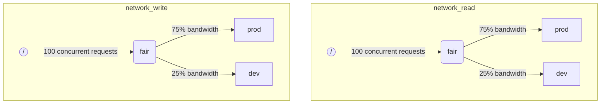

当 ClickHouse 同时执行多个查询时，它们可能会争用共享资源（例如磁盘和 CPU 核心）。可以应用调度约束和策略来规范资源在不同工作负载之间的使用和共享方式。对于所有资源，可以配置一个统一的调度层级结构。层级结构的根节点表示共享资源，而叶子节点则表示特定的工作负载，用于承载超出资源容量的请求。

:::note
目前可以使用上述方法对 [远程磁盘 IO](#disk_config) 和 [CPU](#cpu_scheduling) 进行调度。关于灵活的内存限制，请参阅 [Memory overcommit](settings/memory-overcommit.md)
:::


## 磁盘配置 {#disk_config}

要为特定磁盘启用 IO 工作负载调度,需要为 WRITE 和 READ 访问创建读写资源:

```sql
CREATE RESOURCE resource_name (WRITE DISK disk_name, READ DISK disk_name)
-- 或
CREATE RESOURCE read_resource_name (WRITE DISK write_disk_name)
CREATE RESOURCE write_resource_name (READ DISK read_disk_name)
```

资源可用于任意数量的磁盘,支持 READ 或 WRITE,或同时支持 READ 和 WRITE。以下语法允许将资源用于所有磁盘:

```sql
CREATE RESOURCE all_io (READ ANY DISK, WRITE ANY DISK);
```

指定资源使用哪些磁盘的另一种方式是通过服务器的 `storage_configuration`:

:::warning
使用 ClickHouse 配置进行工作负载调度的方式已弃用,应改用 SQL 语法。
:::

要为特定磁盘启用 IO 调度,必须在存储配置中指定 `read_resource` 和/或 `write_resource`。这将告诉 ClickHouse 对于给定磁盘的每个读写请求应使用哪个资源。读写资源可以引用相同的资源名称,这对于本地 SSD 或 HDD 很有用。多个不同的磁盘也可以引用同一个资源,这对于远程磁盘很有用:例如,如果希望在"生产"和"开发"工作负载之间公平分配网络带宽。

示例:

```xml
<clickhouse>
    <storage_configuration>
        ...
        <disks>
            <s3>
                <type>s3</type>
                <endpoint>https://clickhouse-public-datasets.s3.amazonaws.com/my-bucket/root-path/</endpoint>
                <access_key_id>your_access_key_id</access_key_id>
                <secret_access_key>your_secret_access_key</secret_access_key>
                <read_resource>network_read</read_resource>
                <write_resource>network_write</write_resource>
            </s3>
        </disks>
        <policies>
            <s3_main>
                <volumes>
                    <main>
                        <disk>s3</disk>
                    </main>
                </volumes>
            </s3_main>
        </policies>
    </storage_configuration>
</clickhouse>
```

注意:服务器配置选项的优先级高于 SQL 方式定义资源。


## 工作负载标记 {#workload_markup}

查询可以通过 `workload` 设置进行标记,以区分不同的工作负载。如果未设置 `workload`,则使用默认值 "default"。注意,您可以通过设置配置文件来指定其他值。如果希望某个用户的所有查询都使用固定的 `workload` 设置值进行标记,可以使用设置约束来使 `workload` 保持不变。

可以为后台活动分配 `workload` 设置。合并和变更操作分别使用 `merge_workload` 和 `mutation_workload` 服务器设置。这些值也可以通过 `merge_workload` 和 `mutation_workload` 合并树设置针对特定表进行覆盖。

下面是一个包含两种不同工作负载的系统示例:"production" 和 "development"。

```sql
SELECT count() FROM my_table WHERE value = 42 SETTINGS workload = 'production'
SELECT count() FROM my_table WHERE value = 13 SETTINGS workload = 'development'
```


## 资源调度层次结构 {#hierarchy}

从调度子系统的角度来看,资源表示为调度节点的层次结构。



:::warning
使用 ClickHouse 配置进行工作负载调度的方式已被弃用,应改用 SQL 语法。SQL 语法会自动创建所有必要的调度节点,以下调度节点描述应被视为底层实现细节,可通过 [system.scheduler](/operations/system-tables/scheduler.md) 表访问。
:::

**可能的节点类型:**

- `inflight_limit`(约束)- 当并发执行中的请求数量超过 `max_requests`,或其总成本超过 `max_cost` 时阻塞;必须有一个子节点。
- `bandwidth_limit`(约束)- 当当前带宽超过 `max_speed`(0 表示无限制)或突发流量超过 `max_burst`(默认等于 `max_speed`)时阻塞;必须有一个子节点。
- `fair`(策略)- 根据最大最小公平性原则从其子节点中选择下一个要处理的请求;子节点可以指定 `weight`(默认为 1)。
- `priority`(策略)- 根据静态优先级从其子节点中选择下一个要处理的请求(值越低表示优先级越高);子节点可以指定 `priority`(默认为 0)。
- `fifo`(队列)- 层次结构的叶节点,能够保存超出资源容量的请求。

为了充分利用底层资源的全部容量,应该使用 `inflight_limit`。请注意,较低的 `max_requests` 或 `max_cost` 值可能导致资源利用不足,而过高的值可能导致调度器内部队列为空,进而导致子树中的策略被忽略(不公平或忽略优先级)。另一方面,如果想要保护资源免受过高利用率的影响,应该使用 `bandwidth_limit`。当在 `duration` 秒内消耗的资源量超过 `max_burst + max_speed * duration` 字节时,它会进行限流。同一资源上的两个 `bandwidth_limit` 节点可用于限制短时间间隔内的峰值带宽和较长时间间隔内的平均带宽。

以下示例展示了如何定义图中所示的 IO 调度层次结构:

```xml
<clickhouse>
    <resources>
        <network_read>
            <node path="/">
                <type>inflight_limit</type>
                <max_requests>100</max_requests>
            </node>
            <node path="/fair">
                <type>fair</type>
            </node>
            <node path="/fair/prod">
                <type>fifo</type>
                <weight>3</weight>
            </node>
            <node path="/fair/dev">
                <type>fifo</type>
            </node>
        </network_read>
        <network_write>
            <node path="/">
                <type>inflight_limit</type>
                <max_requests>100</max_requests>
            </node>
            <node path="/fair">
                <type>fair</type>
            </node>
            <node path="/fair/prod">
                <type>fifo</type>
                <weight>3</weight>
            </node>
            <node path="/fair/dev">
                <type>fifo</type>
            </node>
        </network_write>
    </resources>
</clickhouse>
```


## 工作负载分类器 {#workload_classifiers}

:::warning
使用 ClickHouse 配置进行工作负载调度的方式已弃用。应改用 SQL 语法。使用 SQL 语法时会自动创建分类器。
:::

工作负载分类器用于定义从查询指定的 `workload` 到特定资源所使用的叶队列之间的映射关系。目前,工作负载分类功能较为简单:仅支持静态映射。

示例:

```xml
<clickhouse>
    <workload_classifiers>
        <production>
            <network_read>/fair/prod</network_read>
            <network_write>/fair/prod</network_write>
        </production>
        <development>
            <network_read>/fair/dev</network_read>
            <network_write>/fair/dev</network_write>
        </development>
        <default>
            <network_read>/fair/dev</network_read>
            <network_write>/fair/dev</network_write>
        </default>
    </workload_classifiers>
</clickhouse>
```


## 工作负载层次结构 {#workloads}

ClickHouse 提供了便捷的 SQL 语法来定义调度层次结构。所有使用 `CREATE RESOURCE` 创建的资源共享相同的层次结构,但在某些方面可能有所不同。每个使用 `CREATE WORKLOAD` 创建的工作负载都会为每个资源自动维护若干调度节点。子工作负载可以在父工作负载内部创建。以下示例定义了与上述 XML 配置完全相同的层次结构:

```sql
CREATE RESOURCE network_write (WRITE DISK s3)
CREATE RESOURCE network_read (READ DISK s3)
CREATE WORKLOAD all SETTINGS max_io_requests = 100
CREATE WORKLOAD development IN all
CREATE WORKLOAD production IN all SETTINGS weight = 3
```

没有子节点的叶子工作负载的名称可以在查询设置中使用 `SETTINGS workload = 'name'`。

可以使用以下设置来自定义工作负载:

- `priority` - 同级工作负载按照静态优先级值提供服务(值越低优先级越高)。
- `weight` - 具有相同静态优先级的同级工作负载按权重共享资源。
- `max_io_requests` - 此工作负载中并发 IO 请求数量的限制。
- `max_bytes_inflight` - 此工作负载中并发请求的总传输中字节数限制。
- `max_bytes_per_second` - 此工作负载的字节读取或写入速率限制。
- `max_burst_bytes` - 工作负载在不被限流的情况下可以处理的最大字节数(每个资源独立计算)。
- `max_concurrent_threads` - 此工作负载中查询的线程数量限制。
- `max_concurrent_threads_ratio_to_cores` - 与 `max_concurrent_threads` 相同,但按可用 CPU 核心数归一化。
- `max_cpus` - 用于处理此工作负载中查询的 CPU 核心数量限制。
- `max_cpu_share` - 与 `max_cpus` 相同,但按可用 CPU 核心数归一化。
- `max_burst_cpu_seconds` - 工作负载在不因 `max_cpus` 而被限流的情况下可以消耗的最大 CPU 秒数。

通过工作负载设置指定的所有限制对每个资源都是独立的。例如,设置了 `max_bytes_per_second = 10485760` 的工作负载将对每个读取和写入资源分别设置 10 MB/s 的带宽限制。如果需要对读取和写入设置统一限制,请考虑对 READ 和 WRITE 访问使用相同的资源。

无法为不同的资源指定不同的工作负载层次结构。但可以为特定资源指定不同的工作负载设置值:

```sql
CREATE OR REPLACE WORKLOAD all SETTINGS max_io_requests = 100, max_bytes_per_second = 1000000 FOR network_read, max_bytes_per_second = 2000000 FOR network_write
```

另请注意,如果工作负载或资源被另一个工作负载引用,则无法删除。要更新工作负载的定义,请使用 `CREATE OR REPLACE WORKLOAD` 查询。

:::note
工作负载设置会被转换为相应的调度节点集合。有关底层详细信息,请参阅调度节点的[类型和选项](#hierarchy)说明。
:::


## CPU 调度 {#cpu_scheduling}

要为工作负载启用 CPU 调度,需创建 CPU 资源并设置并发线程数限制:

```sql
CREATE RESOURCE cpu (MASTER THREAD, WORKER THREAD)
CREATE WORKLOAD all SETTINGS max_concurrent_threads = 100
```

当 ClickHouse 服务器使用[多线程](/operations/settings/settings.md#max_threads)执行多个并发查询且所有 CPU 槽位都被占用时,系统将进入过载状态。在过载状态下,每个释放的 CPU 槽位都会根据调度策略重新分配给相应的工作负载。对于共享同一工作负载的查询,槽位采用轮询方式分配。对于不同工作负载中的查询,槽位根据为工作负载指定的权重、优先级和限制进行分配。

当线程未被阻塞并处理 CPU 密集型任务时会消耗 CPU 时间。出于调度目的,区分了两种线程:

- 主线程 — 开始处理查询或后台活动(如合并或变更)的第一个线程。
- 工作线程 — 主线程可以生成的用于处理 CPU 密集型任务的附加线程。

为了获得更好的响应性,可能需要为主线程和工作线程使用单独的资源。当使用较高的 `max_threads` 查询设置值时,大量工作线程很容易独占 CPU 资源。此时,新进入的查询必须阻塞并等待其主线程获得 CPU 槽位才能开始执行。为避免这种情况,可以使用以下配置:

```sql
CREATE RESOURCE worker_cpu (WORKER THREAD)
CREATE RESOURCE master_cpu (MASTER THREAD)
CREATE WORKLOAD all SETTINGS max_concurrent_threads = 100 FOR worker_cpu, max_concurrent_threads = 1000 FOR master_cpu
```

这将为主线程和工作线程创建单独的限制。即使所有 100 个工作 CPU 槽位都处于忙碌状态,只要有可用的主 CPU 槽位,新查询就不会被阻塞。它们将以单线程开始执行。之后如果工作 CPU 槽位变为可用,这些查询可以扩展并生成其工作线程。另一方面,这种方法不会将槽位总数绑定到 CPU 处理器数量,运行过多并发线程会影响性能。

限制主线程的并发性不会限制并发查询的数量。CPU 槽位可以在查询执行过程中释放并被其他线程重新获取。例如,在主线程并发限制为 2 的情况下,4 个并发查询可以全部并行执行。在这种情况下,每个查询将获得 50% 的 CPU 处理器资源。应该使用单独的逻辑来限制并发查询的数量,但目前工作负载尚不支持此功能。

可以为工作负载使用单独的线程并发限制:

```sql
CREATE RESOURCE cpu (MASTER THREAD, WORKER THREAD)
CREATE WORKLOAD all
CREATE WORKLOAD admin IN all SETTINGS max_concurrent_threads = 10
CREATE WORKLOAD production IN all SETTINGS max_concurrent_threads = 100
CREATE WORKLOAD analytics IN production SETTINGS max_concurrent_threads = 60, weight = 9
CREATE WORKLOAD ingestion IN production
```

此配置示例为管理和生产提供了独立的 CPU 槽位池。生产池在分析和摄取之间共享。此外,如果生产池过载,必要时 10 个释放的槽位中有 9 个将重新分配给分析查询。在过载期间,摄取查询只会获得 10 个槽位中的 1 个。这可能会改善面向用户的查询的延迟。分析有其自己的 60 个并发线程限制,始终至少保留 40 个线程来支持摄取。当没有过载时,摄取可以使用全部 100 个线程。

要将查询从 CPU 调度中排除,请将查询设置 [use_concurrency_control](/operations/settings/settings.md/#use_concurrency_control) 设为 0。

合并和变更尚不支持 CPU 调度。

为了为工作负载提供公平的分配,需要在查询执行期间执行抢占和缩减。抢占通过 `cpu_slot_preemption` 服务器设置启用。如果启用,每个线程会定期更新其 CPU 槽位(根据 `cpu_slot_quantum_ns` 服务器设置)。如果 CPU 过载,这种更新可能会阻塞执行。当执行被阻塞较长时间时(参见 `cpu_slot_preemption_timeout_ms` 服务器设置),查询会缩减,并发运行的线程数会动态减少。请注意,工作负载之间保证 CPU 时间公平性,但在某些特殊情况下,同一工作负载内的查询之间可能会违反公平性。

:::warning
槽位调度提供了一种控制[查询并发](/operations/settings/settings.md#max_threads)的方法,但除非将服务器设置 `cpu_slot_preemption` 设为 `true`,否则不保证公平的 CPU 时间分配。在未启用抢占的情况下,公平性是基于竞争工作负载之间的 CPU 槽位分配数量提供的。这并不意味着相等的 CPU 秒数,因为在没有抢占的情况下,CPU 槽位可能会被无限期占用。线程在开始时获取槽位,并在工作完成时释放。
:::


:::note
声明 CPU 资源会使 [`concurrent_threads_soft_limit_num`](server-configuration-parameters/settings.md#concurrent_threads_soft_limit_num) 和 [`concurrent_threads_soft_limit_ratio_to_cores`](server-configuration-parameters/settings.md#concurrent_threads_soft_limit_ratio_to_cores) 设置不再生效。此时，通过工作负载设置项 `max_concurrent_threads` 来限制为特定工作负载分配的 CPU 数量。要实现之前的行为，只创建 WORKER THREAD 类型的资源，将工作负载 `all` 的 `max_concurrent_threads` 设置为与 `concurrent_threads_soft_limit_num` 相同的值，并在查询中使用设置 `workload = "all"`。该配置对应于将 [`concurrent_threads_scheduler`](server-configuration-parameters/settings.md#concurrent_threads_scheduler) 设置为 "fair_round_robin" 的取值。
:::


## 线程与 CPU {#threads_vs_cpus}

控制工作负载 CPU 消耗的方式有两种:

- 线程数量限制:`max_concurrent_threads` 和 `max_concurrent_threads_ratio_to_cores`
- CPU 限流:`max_cpus`、`max_cpu_share` 和 `max_burst_cpu_seconds`

第一种方式允许根据当前服务器负载动态控制查询生成的线程数量。它实际上降低了 `max_threads` 查询设置所指定的值。第二种方式使用令牌桶算法对工作负载的 CPU 消耗进行限流。它不直接影响线程数量,而是对工作负载中所有线程的总 CPU 消耗进行限流。

使用 `max_cpus` 和 `max_burst_cpu_seconds` 的令牌桶限流机制含义如下:在任意 `delta` 秒的时间间隔内,工作负载中所有查询的总 CPU 消耗不得超过 `max_cpus * delta + max_burst_cpu_seconds` CPU 秒。它在长期内将平均消耗限制为 `max_cpus`,但短期内可能会超过此限制。例如,给定 `max_burst_cpu_seconds = 60` 和 `max_cpus=0.001`,允许运行 1 个线程 60 秒,或 2 个线程 30 秒,或 60 个线程 1 秒而不被限流。`max_burst_cpu_seconds` 的默认值为 1 秒。在存在大量并发线程的情况下,较低的值可能导致允许的 `max_cpus` 核心利用不足。

:::warning
CPU 限流设置仅在启用 `cpu_slot_preemption` 服务器设置时才生效,否则将被忽略。
:::

在持有 CPU 槽位时,线程可能处于以下三种主要状态之一:

- **运行中(Running):** 实际消耗 CPU 资源。在此状态下花费的时间会被 CPU 限流计入。
- **就绪(Ready):** 等待 CPU 变为可用。不被 CPU 限流计入。
- **阻塞(Blocked):** 执行 IO 操作或其他阻塞系统调用(例如等待互斥锁)。不被 CPU 限流计入。

让我们看一个结合了 CPU 限流和线程数量限制的配置示例:

```sql
CREATE RESOURCE cpu (MASTER THREAD, WORKER THREAD)
CREATE WORKLOAD all SETTINGS max_concurrent_threads_ratio_to_cores = 2
CREATE WORKLOAD admin IN all SETTINGS max_concurrent_threads = 2, priority = -1
CREATE WORKLOAD production IN all SETTINGS weight = 4
CREATE WORKLOAD analytics IN production SETTINGS max_cpu_share = 0.7, weight = 3
CREATE WORKLOAD ingestion IN production
CREATE WORKLOAD development IN all SETTINGS max_cpu_share = 0.3
```

在此配置中,我们将所有查询的总线程数限制为可用 CPU 数量的 2 倍。管理员(admin)工作负载最多限制为 2 个线程,无论可用 CPU 数量如何。管理员的优先级为 -1(低于默认值 0),如果需要,它会优先获得任何 CPU 槽位。当管理员不运行查询时,CPU 资源在生产(production)和开发(development)工作负载之间分配。CPU 时间的保证份额基于权重(4 比 1):至少 80% 分配给生产(如果需要),至少 20% 分配给开发(如果需要)。权重形成保证,而 CPU 限流形成上限:生产没有限制,可以消耗 100%,而开发有 30% 的上限,即使没有来自其他工作负载的查询,此限制也会生效。生产工作负载不是叶子节点,因此其资源根据权重(3 比 1)在分析(analytics)和摄取(ingestion)之间分配。这意味着分析至少保证 0.8 × 0.75 = 60%,并且基于 `max_cpu_share`,它的上限为总 CPU 资源的 70%。而摄取至少保证 0.8 × 0.25 = 20%,但没有上限。

:::note
如果您想最大化 ClickHouse 服务器的 CPU 利用率,请避免对根工作负载 `all` 使用 `max_cpus` 和 `max_cpu_share`。相反,为 `max_concurrent_threads` 设置一个更高的值。例如,在具有 8 个 CPU 的系统上,设置 `max_concurrent_threads = 16`。这允许 8 个线程运行 CPU 任务,而另外 8 个线程可以处理 I/O 操作。额外的线程将产生 CPU 压力,确保调度规则得到执行。相比之下,设置 `max_cpus = 8` 永远不会产生 CPU 压力,因为服务器无法超过 8 个可用 CPU。
:::


## 查询槽调度 {#query_scheduling}

要为工作负载启用查询槽调度,需创建 QUERY 资源并设置并发查询数或每秒查询数的限制:

```sql
CREATE RESOURCE query (QUERY)
CREATE WORKLOAD all SETTINGS max_concurrent_queries = 100, max_queries_per_second = 10, max_burst_queries = 20
```

工作负载设置 `max_concurrent_queries` 用于限制给定工作负载可同时运行的并发查询数。该设置类似于查询设置 [`max_concurrent_queries_for_all_users`](/operations/settings/settings#max_concurrent_queries_for_all_users) 和服务器设置 [max_concurrent_queries](/operations/server-configuration-parameters/settings#max_concurrent_queries)。异步插入查询以及某些特定查询(如 KILL)不计入此限制。

工作负载设置 `max_queries_per_second` 和 `max_burst_queries` 通过令牌桶限流器来限制工作负载的查询数量。该机制保证在任意时间间隔 `T` 内,开始执行的新查询数不超过 `max_queries_per_second * T + max_burst_queries`。

工作负载设置 `max_waiting_queries` 用于限制工作负载的等待查询数。当达到该限制时,服务器将返回 `SERVER_OVERLOADED` 错误。

:::note
被阻塞的查询将无限期等待,且在满足所有约束条件之前不会显示在 `SHOW PROCESSLIST` 中。
:::


## 工作负载和资源存储 {#workload_entity_storage}

所有工作负载和资源的定义以 `CREATE WORKLOAD` 和 `CREATE RESOURCE` 查询的形式持久化存储,既可以存储在磁盘的 `workload_path` 路径下,也可以存储在 ZooKeeper 的 `workload_zookeeper_path` 路径下。建议使用 ZooKeeper 存储以实现节点间的一致性。或者,也可以将 `ON CLUSTER` 子句与磁盘存储配合使用。


## 基于配置的工作负载和资源 {#config_based_workloads}

除了基于 SQL 的定义方式外,工作负载和资源还可以在服务器配置文件中预先定义。这在云环境中特别有用,因为某些限制由基础设施决定,而其他限制则可由客户自行调整。基于配置的实体优先级高于 SQL 定义的实体,且无法通过 SQL 命令进行修改或删除。

### 配置格式 {#config_based_workloads_format}

```xml
<clickhouse>
    <resources_and_workloads>
        RESOURCE s3disk_read (READ DISK s3);
        RESOURCE s3disk_write (WRITE DISK s3);
        WORKLOAD all SETTINGS max_io_requests = 500 FOR s3disk_read, max_io_requests = 1000 FOR s3disk_write, max_bytes_per_second = 1342177280 FOR s3disk_read, max_bytes_per_second = 3355443200 FOR s3disk_write;
        WORKLOAD production IN all SETTINGS weight = 3;
    </resources_and_workloads>
</clickhouse>
```

配置使用与 `CREATE WORKLOAD` 和 `CREATE RESOURCE` 语句相同的 SQL 语法。所有查询语句必须有效。

### 使用建议 {#config_based_workloads_usage_recommendations}

对于云环境,典型的配置方案可能包括:

1. 在配置中定义根工作负载和网络 IO 资源,以设置基础设施限制
2. 设置 `throw_on_unknown_workload` 来强制执行这些限制
3. 创建 `CREATE WORKLOAD default IN all` 以自动将限制应用于所有查询(因为 `workload` 查询设置的默认值为 'default')
4. 允许用户在已配置的层次结构内创建额外的工作负载

这样可以确保所有后台活动和查询都遵守基础设施限制,同时仍为用户特定的调度策略保留灵活性。

另一个使用场景是在异构集群中为不同节点配置不同的设置。


## 严格资源访问控制 {#strict_resource_access}

要强制所有查询遵循资源调度策略,需使用服务器设置 `throw_on_unknown_workload`。如果将其设置为 `true`,则每个查询都必须使用有效的 `workload` 查询设置,否则将抛出 `RESOURCE_ACCESS_DENIED` 异常。如果将其设置为 `false`,则此类查询不使用资源调度器,即它将获得对任何 `RESOURCE` 的无限访问权限。查询设置 `use_concurrency_control = 0` 允许查询绕过 CPU 调度器并获得对 CPU 的无限访问权限。要强制执行 CPU 调度,需创建一个设置约束以保持 `use_concurrency_control` 为只读常量值。

:::note
除非已执行 `CREATE WORKLOAD default`,否则不要将 `throw_on_unknown_workload` 设置为 `true`。如果在启动期间执行了未明确设置 `workload` 的查询,可能会导致服务器启动失败。
:::


## 另请参阅 {#see-also}

- [system.scheduler](/operations/system-tables/scheduler.md)
- [system.workloads](/operations/system-tables/workloads.md)
- [system.resources](/operations/system-tables/resources.md)
- [merge_workload](/operations/settings/merge-tree-settings.md#merge_workload) MergeTree 设置
- [merge_workload](/operations/server-configuration-parameters/settings.md#merge_workload) 全局服务器设置
- [mutation_workload](/operations/settings/merge-tree-settings.md#mutation_workload) MergeTree 设置
- [mutation_workload](/operations/server-configuration-parameters/settings.md#mutation_workload) 全局服务器设置
- [workload_path](/operations/server-configuration-parameters/settings.md#workload_path) 全局服务器设置
- [workload_zookeeper_path](/operations/server-configuration-parameters/settings.md#workload_zookeeper_path) 全局服务器设置
- [cpu_slot_preemption](/operations/server-configuration-parameters/settings.md#cpu_slot_preemption) 全局服务器设置
- [cpu_slot_quantum_ns](/operations/server-configuration-parameters/settings.md#cpu_slot_quantum_ns) 全局服务器设置
- [cpu_slot_preemption_timeout_ms](/operations/server-configuration-parameters/settings.md#cpu_slot_preemption_timeout_ms) 全局服务器设置
