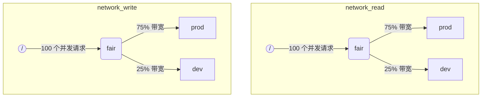

当 ClickHouse 同时执行多个查询时，它们可能会使用共享资源（例如磁盘和 CPU 核心）。可以应用调度约束和策略来规范如何在不同工作负载之间使用和共享这些资源。针对所有资源，可以配置统一的调度层级结构。层级结构的根节点代表共享资源，而叶子节点则对应特定的工作负载，用于承载超出资源容量的请求。

:::note
目前可以使用上述方法对 [远程磁盘 IO](#disk_config) 和 [CPU](#cpu_scheduling) 进行调度。有关灵活的内存限制，请参见 [Memory overcommit](settings/memory-overcommit.md)
:::

## 磁盘配置 {#disk_config}

要为特定磁盘启用 IO 工作负载调度，必须为 WRITE 和 READ 访问分别创建读写资源：

```sql
CREATE RESOURCE resource_name (WRITE DISK disk_name, READ DISK disk_name)
-- or
CREATE RESOURCE read_resource_name (WRITE DISK write_disk_name)
CREATE RESOURCE write_resource_name (READ DISK read_disk_name)
```

资源可用于任意数量的磁盘上，可用于 `READ`、`WRITE`，或同时用于 `READ` 和 `WRITE`。有一种语法可以将该资源应用到所有磁盘：

```sql
CREATE RESOURCE all_io (READ ANY DISK, WRITE ANY DISK);
```

另一种指定某个资源使用哪些磁盘的方式，是通过服务器的 `storage_configuration`：

:::warning
通过 ClickHouse 配置进行工作负载调度已被弃用。应改用 SQL 语法。
:::

要为特定磁盘启用 I/O 调度，必须在 `storage_configuration` 中指定 `read_resource` 和/或 `write_resource`。这会告诉 ClickHouse 对于给定磁盘的每个读写请求应使用哪种资源。读资源和写资源可以引用同一个资源名称，这对本地 SSD 或 HDD 很有用。多个不同的磁盘也可以引用同一个资源，这对远程磁盘很有用：例如，当你希望能在“production”和“development”工作负载之间公平分配网络带宽时。

示例：

```xml
<clickhouse>
    <storage_configuration>
        ...
        <disks>
            <s3>
                <type>s3</type>
                <endpoint>https://clickhouse-public-datasets.s3.amazonaws.com/my-bucket/root-path/</endpoint>
                <access_key_id>your_access_key_id</access_key_id>
                <secret_access_key>your_secret_access_key</secret_access_key>
                <read_resource>network_read</read_resource>
                <write_resource>network_write</write_resource>
            </s3>
        </disks>
        <policies>
            <s3_main>
                <volumes>
                    <main>
                        <disk>s3</disk>
                    </main>
                </volumes>
            </s3_main>
        </policies>
    </storage_configuration>
</clickhouse>
```

请注意，服务器端配置选项的优先级高于通过 SQL 方式定义资源。

## 工作负载标记 {#workload_markup}

可以通过设置 `workload` 为查询打标，以区分不同的工作负载。如果未设置 `workload`，则会使用值“default”。请注意，你也可以通过 settings profile 指定其他值。如果你希望某个用户发出的所有查询都带有固定的 `workload` 值，可以使用 setting constraint 将 `workload` 设为常量。

也可以为后台活动指定 `workload` 设置。合并（merge）和变更（mutation）分别使用服务器设置 `merge_workload` 和 `mutation_workload`。这些值同样可以通过 MergeTree 表设置项 `merge_workload` 和 `mutation_workload` 在特定表级别进行覆盖。

下面来看一个具有两种不同工作负载的系统示例：“production” 和 “development”。

```sql
SELECT count() FROM my_table WHERE value = 42 SETTINGS workload = 'production'
SELECT count() FROM my_table WHERE value = 13 SETTINGS workload = 'development'
```

## 资源调度层次结构 {#hierarchy}

从调度子系统的角度来看，资源是由调度节点组成的层次结构。



:::warning
使用 ClickHouse 配置进行工作负载调度已被弃用，应改用 SQL 语法。SQL 语法会自动创建所有必要的调度节点，下面的调度节点说明应视为较低层级的实现细节，可通过 [system.scheduler](/operations/system-tables/scheduler.md) 表访问。
:::

**可能的节点类型：**

* `inflight_limit`（约束）- 当并发进行中的请求数量超过 `max_requests`，或它们的总代价超过 `max_cost` 时阻塞；必须只有一个子节点。
* `bandwidth_limit`（约束）- 当当前带宽超过 `max_speed`（0 表示不限制）或突发流量超过 `max_burst`（默认等于 `max_speed`）时阻塞；必须只有一个子节点。
* `fair`（策略）- 按照 max-min 公平性原则，从其子节点中选择下一个要处理的请求；子节点可以指定 `weight`（默认值为 1）。
* `priority`（策略）- 按照静态优先级（数值越小优先级越高）从其子节点中选择下一个要处理的请求；子节点可以指定 `priority`（默认值为 0）。
* `fifo`（队列）- 层级结构中的叶节点，用于存放超出资源容量的请求。

为了能够利用底层资源的全部能力，你应该使用 `inflight_limit`。注意，`max_requests` 或 `max_cost` 的取值过小可能导致资源未被充分利用，而取值过大则可能导致调度器内部队列为空，从而使子树中的策略被忽略（造成不公平或忽略优先级）。另一方面，如果你希望保护资源不被过度使用，则应使用 `bandwidth_limit`。当在 `duration` 秒内消耗的资源量超过 `max_burst + max_speed * duration` 字节时，它会进行限流。针对同一资源的两个 `bandwidth_limit` 节点可以用来分别限制短时间内的峰值带宽以及更长时间区间内的平均带宽。

下面的示例展示了如何定义图中所示的 IO 调度层级结构：

```xml
<clickhouse>
    <resources>
        <network_read>
            <node path="/">
                <type>inflight_limit</type>
                <max_requests>100</max_requests>
            </node>
            <node path="/fair">
                <type>fair</type>
            </node>
            <node path="/fair/prod">
                <type>fifo</type>
                <weight>3</weight>
            </node>
            <node path="/fair/dev">
                <type>fifo</type>
            </node>
        </network_read>
        <network_write>
            <node path="/">
                <type>inflight_limit</type>
                <max_requests>100</max_requests>
            </node>
            <node path="/fair">
                <type>fair</type>
            </node>
            <node path="/fair/prod">
                <type>fifo</type>
                <weight>3</weight>
            </node>
            <node path="/fair/dev">
                <type>fifo</type>
            </node>
        </network_write>
    </resources>
</clickhouse>
```

## 工作负载分类器 {#workload_classifiers}

:::warning
使用 ClickHouse 配置进行工作负载调度已弃用，应改为使用 SQL 语法。当使用 SQL 语法时，会自动创建分类器。
:::

工作负载分类器用于定义从查询中指定的 `workload` 到特定资源应使用的叶队列（leaf queues）的映射关系。目前，工作负载分类较为简单：仅支持静态映射。

示例：

```xml
<clickhouse>
    <workload_classifiers>
        <production>
            <network_read>/fair/prod</network_read>
            <network_write>/fair/prod</network_write>
        </production>
        <development>
            <network_read>/fair/dev</network_read>
            <network_write>/fair/dev</network_write>
        </development>
        <default>
            <network_read>/fair/dev</network_read>
            <network_write>/fair/dev</network_write>
        </default>
    </workload_classifiers>
</clickhouse>
```

## 工作负载层级结构 {#workloads}

ClickHouse 提供了便捷的 SQL 语法来定义调度层级结构。所有通过 `CREATE RESOURCE` 创建的资源共享相同的层级结构，但在某些方面可能有所不同。每个通过 `CREATE WORKLOAD` 创建的工作负载，都会为每个资源维护若干自动创建的调度节点。可以在一个父工作负载中创建子工作负载。下面是一个示例，用于定义与上面的 XML 配置完全相同的层级结构：

```sql
CREATE RESOURCE network_write (WRITE DISK s3)
CREATE RESOURCE network_read (READ DISK s3)
CREATE WORKLOAD all SETTINGS max_io_requests = 100
CREATE WORKLOAD development IN all
CREATE WORKLOAD production IN all SETTINGS weight = 3
```

没有子级的叶节点 workload 的名称可以在查询设置中使用：`SETTINGS workload = 'name'`。

要自定义 workload，可以使用以下设置：

* `priority` - 同级 workloads 按静态优先级值进行服务（数值越低优先级越高）。
* `weight` - 具有相同静态优先级的同级 workloads 按权重共享资源。
* `max_io_requests` - 此 workload 中并发 IO 请求数量的上限。
* `max_bytes_inflight` - 此 workload 中所有并发请求的在途字节总数上限。
* `max_bytes_per_second` - 此 workload 的读或写字节速率上限。
* `max_burst_bytes` - 在不被限流的情况下，此 workload 可以处理的最大字节数（对每种资源分别计算）。
* `max_concurrent_threads` - 此 workload 中查询可使用的线程数上限。
* `max_concurrent_threads_ratio_to_cores` - 与 `max_concurrent_threads` 相同，但会根据可用 CPU 核心数进行归一化。
* `max_cpus` - 为此 workload 中的查询提供服务的 CPU 核心数上限。
* `max_cpu_share` - 与 `max_cpus` 相同，但会根据可用 CPU 核心数进行归一化。
* `max_burst_cpu_seconds` - 在不因 `max_cpus` 而被限流的情况下，此 workload 可以消耗的最大 CPU 秒数。

通过 workload 设置指定的所有限制对于每种资源都是相互独立的。例如，设置 `max_bytes_per_second = 10485760` 的 workload 将对每个读和写资源分别应用 10 MB/s 的带宽限制。如果需要对读写使用公共的总限额，请考虑对 READ 和 WRITE 访问使用同一个资源。

无法为不同资源指定不同的 workload 层级结构。但可以为特定资源指定不同的 workload 配置值：

```sql
CREATE OR REPLACE WORKLOAD all SETTINGS max_io_requests = 100, max_bytes_per_second = 1000000 FOR network_read, max_bytes_per_second = 2000000 FOR network_write
```

还要注意，如果某个 workload 或 resource 正被另一个 workload 引用，则无法将其删除。若要更新某个 workload 的定义，请使用 `CREATE OR REPLACE WORKLOAD` 查询。

:::note
Workload 设置会被转换为一组对应的调度节点。有关更底层的细节，请参阅调度节点的[类型和选项](#hierarchy)说明。
:::

## CPU 调度 {#cpu_scheduling}

要为工作负载启用 CPU 调度，请创建 CPU 资源并设置并发线程数量上限：

```sql
CREATE RESOURCE cpu (MASTER THREAD, WORKER THREAD)
CREATE WORKLOAD all SETTINGS max_concurrent_threads = 100
```

当 ClickHouse 服务器使用[多线程](/operations/settings/settings.md#max_threads)执行大量并发查询且所有 CPU 插槽都已占用时，就会进入过载状态。在过载状态下，每一个释放的 CPU 插槽都会根据调度策略重新分配给合适的工作负载。对于共享同一工作负载的查询，插槽通过轮询（round robin）方式分配。对于处于不同工作负载中的查询，插槽则根据为各工作负载指定的权重、优先级和限制进行分配。

当线程未被阻塞并执行 CPU 密集型任务时，就会消耗 CPU 时间。出于调度目的，将线程分为两类：

* 主线程（master thread）—— 首个开始处理查询或后台活动（例如合并或变更）的线程。
* 工作线程（worker thread）—— 由主线程派生出来，用于处理 CPU 密集型任务的其他线程。

为了获得更好的响应性，将主线程和工作线程使用的资源隔离开可能是有益的。当使用较大的 `max_threads` 查询设置值时，大量工作线程很容易独占 CPU 资源。此时，新到的查询将被阻塞并等待一个 CPU 插槽，以便其主线程能够开始执行。为避免这种情况，可以使用如下配置：

```sql
CREATE RESOURCE worker_cpu (WORKER THREAD)
CREATE RESOURCE master_cpu (MASTER THREAD)
CREATE WORKLOAD all SETTINGS max_concurrent_threads = 100 FOR worker_cpu, max_concurrent_threads = 1000 FOR master_cpu
```

它会分别对主线程和工作线程设置并发限制。即使所有 100 个工作线程 CPU 槽位都已占满，只要仍有可用的主线程 CPU 槽位，新查询也不会被阻塞，而是会先以单线程开始执行。之后如果有工作线程 CPU 槽位空闲，此类查询可以扩展并启动其对应的工作线程。另一方面，这种方法不会将槽位总数与 CPU 处理器的数量绑定在一起，过多的并发线程运行会影响性能。

限制主线程的并发数并不会限制并发查询的数量。CPU 槽位可以在查询执行过程中被释放，并被其他线程重新获取。例如，在主线程并发数限制为 2 的情况下，4 个并发查询仍然可以同时执行。在这种情况下，每个查询将获得一个 CPU 处理器 50% 的计算能力。应使用单独的机制来限制并发查询的数量，而这一点在当前的工作负载中尚不支持。

可以为不同的工作负载单独设置线程并发限制：

```sql
CREATE RESOURCE cpu (MASTER THREAD, WORKER THREAD)
CREATE WORKLOAD all
CREATE WORKLOAD admin IN all SETTINGS max_concurrent_threads = 10
CREATE WORKLOAD production IN all SETTINGS max_concurrent_threads = 100
CREATE WORKLOAD analytics IN production SETTINGS max_concurrent_threads = 60, weight = 9
CREATE WORKLOAD ingestion IN production
```

此配置示例为 admin 和 production 提供了相互独立的 CPU 插槽池。production 池在 analytics 和摄取之间共享。此外，如果 production 池过载，10 个释放插槽中的 9 个将在必要时重新分配给分析查询。在过载期间，摄取查询只会获得 10 个插槽中的 1 个。这可能改善面向用户的查询延迟。Analytics 本身有 60 个并发线程的上限，始终至少为摄取保留 40 个线程。当没有过载时，摄取可以使用全部 100 个线程。

要将某个查询从 CPU 调度中排除，请将查询设置 [use&#95;concurrency&#95;control](/operations/settings/settings.md/#use_concurrency_control) 设为 0。

CPU 调度目前尚不支持 merges 和 mutations。

为了为各类负载提供公平分配，有必要在查询执行期间进行抢占和缩减（down-scaling）。通过 `cpu_slot_preemption` 服务器设置启用抢占。如果启用，每个线程会根据 `cpu_slot_quantum_ns` 服务器设置，定期续约其 CPU 插槽占用。在 CPU 过载时，此类续约可能会阻塞执行。当执行被长时间阻塞时（参见 `cpu_slot_preemption_timeout_ms` 服务器设置），查询会进行缩减，并动态减少并发运行线程的数量。请注意，在不同负载之间可以保证 CPU 时间的公平性，但在同一负载内部的各个查询之间，在某些极端情况下可能无法完全保证。

:::warning
插槽调度提供了一种控制[查询并发度](/operations/settings/settings.md#max_threads)的方式，但除非将服务器设置 `cpu_slot_preemption` 设为 `true`，否则并不能保证 CPU 时间的公平分配；在未启用抢占时，公平性是基于竞争负载之间分配到的 CPU 插槽数量来提供的。这并不意味着获得相同数量的 CPU 秒数，因为在没有抢占的情况下，CPU 插槽可能被无限期持有。线程在开始执行时获取一个插槽，并在工作完成时释放。
:::

:::note
声明 CPU 资源会使 [`concurrent_threads_soft_limit_num`](server-configuration-parameters/settings.md#concurrent_threads_soft_limit_num) 和 [`concurrent_threads_soft_limit_ratio_to_cores`](server-configuration-parameters/settings.md#concurrent_threads_soft_limit_ratio_to_cores) 设置不再生效。取而代之的是，使用工作负载设置 `max_concurrent_threads` 来限制为某个特定工作负载分配的 CPU 数量。要实现之前的行为，仅创建 WORKER THREAD 资源，将工作负载 `all` 的 `max_concurrent_threads` 设置为与 `concurrent_threads_soft_limit_num` 相同的值，并在查询中使用设置 `workload = "all"`。该配置等价于将 [`concurrent_threads_scheduler`](server-configuration-parameters/settings.md#concurrent_threads_scheduler) 设置为 "fair_round_robin"。
:::

## 线程 vs CPU {#threads_vs_cpus}

有两种方式可以控制某个负载的 CPU 消耗：

* 线程数量限制：`max_concurrent_threads` 和 `max_concurrent_threads_ratio_to_cores`
* CPU 节流：`max_cpus`、`max_cpu_share` 和 `max_burst_cpu_seconds`

第一种方式允许根据当前服务器负载动态控制为一个查询创建多少线程。本质上，它降低了查询设置 `max_threads` 的实际生效上限。第二种方式使用令牌桶算法对该负载的 CPU 消耗进行节流控制。它不会直接影响线程数量，而是对该负载中所有线程的总 CPU 消耗进行限流。

使用 `max_cpus` 和 `max_burst_cpu_seconds` 的令牌桶节流机制含义如下：在任意长度为 `delta` 秒的时间区间内，该负载中所有查询的总 CPU 消耗不得超过 `max_cpus * delta + max_burst_cpu_seconds` 个 CPU 秒。从长期来看，它将平均消耗限制在 `max_cpus`，但在短期内可以超过该限制。例如，当 `max_burst_cpu_seconds = 60` 且 `max_cpus=0.001` 时，可以在不被节流的情况下运行 1 个线程 60 秒，或 2 个线程 30 秒，或 60 个线程 1 秒。`max_burst_cpu_seconds` 的默认值为 1 秒。对于并发线程较多的情况，如果该值过低，可能导致无法充分利用允许的 `max_cpus` 核心数。

:::warning
只有在开启 `cpu_slot_preemption` 服务器设置时，CPU 节流设置才会生效，否则会被忽略。
:::

在持有一个 CPU slot 时，一个线程可能处于以下三种主要状态之一：

* **Running：** 实际在消耗 CPU 资源。线程处于该状态时花费的时间会被 CPU 节流机制计入。
* **Ready：** 正在等待可用的 CPU。不会被 CPU 节流机制计入。
* **Blocked：** 正在执行 IO 操作或其他阻塞系统调用（例如等待互斥量）。不会被 CPU 节流机制计入。

下面给出一个同时结合 CPU 节流和线程数量限制的配置示例：

```sql
CREATE RESOURCE cpu (MASTER THREAD, WORKER THREAD)
CREATE WORKLOAD 全部 SETTINGS max_concurrent_threads_ratio_to_cores = 2
CREATE WORKLOAD 管理 IN 全部 SETTINGS max_concurrent_threads = 2, priority = -1
CREATE WORKLOAD 生产 IN 全部 SETTINGS weight = 4
CREATE WORKLOAD 分析 IN 生产 SETTINGS max_cpu_share = 0.7, weight = 3
CREATE WORKLOAD 摄取 IN 生产
CREATE WORKLOAD 开发 IN 全部 SETTINGS max_cpu_share = 0.3
```

在这里，我们将所有查询的线程总数限制为可用 CPU 数量的 2 倍。Admin 工作负载最多限制为 2 个线程，而不受可用 CPU 数量影响。Admin 的优先级为 -1（低于默认的 0），如果需要，它会优先获得任何 CPU 槽位。当 Admin 不执行查询时，CPU 资源会在生产和开发工作负载之间分配。基于权重（4 比 1）来保证 CPU 时间的份额：至少 80% 分配给生产（如果需要），至少 20% 分配给开发（如果需要）。权重决定了“保证份额”，而 CPU 限流决定了“上限”：生产没有上限，可以消耗 100%；开发则有 30% 的上限，即使没有来自其他工作负载的查询，该上限也会生效。生产工作负载不是叶节点，因此其资源会按权重（3 比 1）在 analytics 和摄取之间划分。这意味着 analytics 至少有 0.8 * 0.75 = 60% 的保证份额，并且基于 `max_cpu_share`，它的上限是总 CPU 资源的 70%。而摄取至少有 0.8 * 0.25 = 20% 的保证份额，但没有上限。

:::note
如果您希望最大化 ClickHouse 服务器上的 CPU 利用率，请避免为根工作负载 `all` 使用 `max_cpus` 和 `max_cpu_share`。相反，请将 `max_concurrent_threads` 设置为更高的值。例如，在一个拥有 8 个 CPU 的系统上，将 `max_concurrent_threads = 16`。这样可以让 8 个线程执行 CPU 任务，同时另外 8 个线程处理 I/O 操作。额外的线程会产生 CPU 压力，从而确保调度规则被严格执行。相对地，如果设置 `max_cpus = 8`，则永远不会产生 CPU 压力，因为服务器无法超出这 8 个可用 CPU。
:::

## 查询插槽调度 {#query_scheduling}

要为工作负载启用查询插槽调度，请创建 QUERY 资源，并为并发查询数量或每秒查询数量设置限制：

```sql
CREATE RESOURCE query (QUERY)
CREATE WORKLOAD all SETTINGS max_concurrent_queries = 100, max_queries_per_second = 10, max_burst_queries = 20
```

工作负载设置 `max_concurrent_queries` 用于限制某个工作负载下可同时运行的并发查询数量。它类似于查询级设置 [`max_concurrent_queries_for_all_users`](/operations/settings/settings#max_concurrent_queries_for_all_users) 和服务器级设置 [max&#95;concurrent&#95;queries](/operations/server-configuration-parameters/settings#max_concurrent_queries)。异步插入查询以及 KILL 等特定查询不计入该限制。

工作负载设置 `max_queries_per_second` 和 `max_burst_queries` 通过令牌桶限流器来限制该工作负载的查询数量。它保证在任意时间区间 `T` 内，开始执行的新查询数量不会超过 `max_queries_per_second * T + max_burst_queries`。

工作负载设置 `max_waiting_queries` 限制该工作负载的等待查询数量。当达到该限制时，服务器会返回错误 `SERVER_OVERLOADED`。

:::note
被阻塞的查询将无限期等待，并且在满足所有约束条件之前不会出现在 `SHOW PROCESSLIST` 中。
:::

## 工作负载和资源存储 {#workload_entity_storage}

所有工作负载和资源的定义，会以 `CREATE WORKLOAD` 和 `CREATE RESOURCE` 查询的形式持久化存储到磁盘中的 `workload_path`，或 ZooKeeper 中的 `workload_zookeeper_path`。建议使用 ZooKeeper 存储以在各节点之间实现一致性。或者，也可以在使用磁盘存储时配合 `ON CLUSTER` 子句。

## 基于配置的工作负载和资源 {#config_based_workloads}

除了基于 SQL 的定义之外，还可以在服务器配置文件中预定义工作负载和资源。这在云环境中非常有用，在这类环境中，部分限制由基础设施决定，而其他限制可以由用户调整。基于配置定义的实体优先于通过 SQL 定义的实体，且不能通过 SQL 命令进行修改或删除。

### 配置格式 {#config_based_workloads_format}

```xml
<clickhouse>
    <resources_and_workloads>
        RESOURCE s3disk_read (READ DISK s3);
        RESOURCE s3disk_write (WRITE DISK s3);
        WORKLOAD all SETTINGS max_io_requests = 500 FOR s3disk_read, max_io_requests = 1000 FOR s3disk_write, max_bytes_per_second = 1342177280 FOR s3disk_read, max_bytes_per_second = 3355443200 FOR s3disk_write;
        WORKLOAD production IN all SETTINGS weight = 3;
    </resources_and_workloads>
</clickhouse>
```

该配置使用与 `CREATE WORKLOAD` 和 `CREATE RESOURCE` 语句相同的 SQL 语法。所有查询都必须是合法的。

### 使用建议 {#config_based_workloads_usage_recommendations}

对于云环境，典型的设置可能包括：

1. 在配置中定义根工作负载和网络 IO 资源，用于设置基础设施资源上限
2. 设置 `throw_on_unknown_workload` 以强制执行这些限制
3. 创建一个 `CREATE WORKLOAD default IN all`，以自动对所有查询应用限制（因为 `workload` 查询设置的默认值是 &#39;default&#39;）
4. 允许用户在已配置的层级结构中创建额外的工作负载

这样可以确保所有后台活动和查询都遵守基础设施限制，同时仍然为用户特定的调度策略保留灵活性。

另一种使用场景是在异构集群中为不同节点使用不同的配置。

## 严格资源访问 {#strict_resource_access}

要强制所有查询遵循资源调度策略，可以使用服务器端设置 `throw_on_unknown_workload`。如果将其设置为 `true`，则每个查询都必须使用有效的 `workload` 查询设置，否则会抛出 `RESOURCE_ACCESS_DENIED` 异常。如果将其设置为 `false`，则此类查询不会使用资源调度器，即它将获得对任意 `RESOURCE` 的无限制访问。查询设置 `use_concurrency_control = 0` 允许查询绕过 CPU 调度器并获得对 CPU 的无限制访问。要强制启用 CPU 调度，请创建一个设置约束，使 `use_concurrency_control` 保持为只读常量值。

:::note
除非已经执行了 `CREATE WORKLOAD default`，否则不要将 `throw_on_unknown_workload` 设置为 `true`。如果在服务器启动过程中执行了未显式设置 `workload` 的查询，可能会导致服务器启动失败。
:::

## 另请参阅 {#see-also}
- [system.scheduler](/operations/system-tables/scheduler.md)
- [system.workloads](/operations/system-tables/workloads.md)
- [system.resources](/operations/system-tables/resources.md)
- [merge_workload](/operations/settings/merge-tree-settings.md#merge_workload) MergeTree 设置项
- [merge_workload](/operations/server-configuration-parameters/settings.md#merge_workload) 全局服务器设置项
- [mutation_workload](/operations/settings/merge-tree-settings.md#mutation_workload) MergeTree 设置项
- [mutation_workload](/operations/server-configuration-parameters/settings.md#mutation_workload) 全局服务器设置项
- [workload_path](/operations/server-configuration-parameters/settings.md#workload_path) 全局服务器设置项
- [workload_zookeeper_path](/operations/server-configuration-parameters/settings.md#workload_zookeeper_path) 全局服务器设置项
- [cpu_slot_preemption](/operations/server-configuration-parameters/settings.md#cpu_slot_preemption) 全局服务器设置项
- [cpu_slot_quantum_ns](/operations/server-configuration-parameters/settings.md#cpu_slot_quantum_ns) 全局服务器设置项
- [cpu_slot_preemption_timeout_ms](/operations/server-configuration-parameters/settings.md#cpu_slot_preemption_timeout_ms) 全局服务器设置项