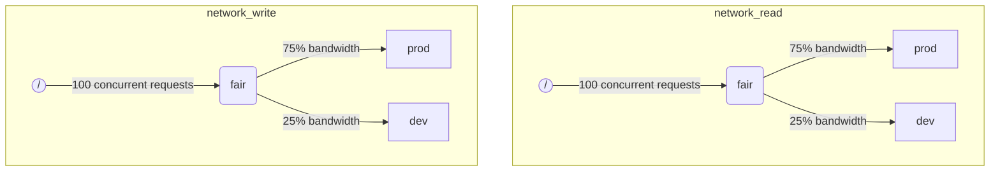

当 ClickHouse 同时执行多个查询时，它们可能会使用共享资源（例如磁盘）。可以应用调度限制和策略，以调节不同工作负载之间资源的利用和共享。对于每个资源，可以配置调度层次结构。层次结构的根节点表示一个资源，而叶子节点则是队列，保存超过资源容量的请求。

:::note
当前 [远程磁盘 IO](#disk_config) 和 [CPU](#cpu_scheduling) 可以使用上述方法进行调度。有关灵活内存限制，请参阅 [内存过度分配](settings/memory-overcommit.md)
:::

## 磁盘配置 {#disk_config}

要为特定磁盘启用 IO 工作负载调度，您必须为 WRITE 和 READ 访问创建读写资源：

```sql
CREATE RESOURCE resource_name (WRITE DISK disk_name, READ DISK disk_name)
-- or
CREATE RESOURCE read_resource_name (WRITE DISK write_disk_name)
CREATE RESOURCE write_resource_name (READ DISK read_disk_name)
```

资源可以用于任何数量的磁盘以进行 READ 或 WRITE 或两者均可。还有一种语法允许将资源用于所有磁盘：

```sql
CREATE RESOURCE all_io (READ ANY DISK, WRITE ANY DISK);
```

表达资源所使用的磁盘的另一种方法是服务器的 `storage_configuration`：

:::warning
使用 clickhouse 配置进行工作负载调度已被弃用。应使用 SQL 语法。
:::

要为特定磁盘启用 IO 调度，您必须在存储配置中指定 `read_resource` 和/或 `write_resource`。这告诉 ClickHouse 应该为给定磁盘的每个读写请求使用哪个资源。读写资源可以引用同一资源名称，这对本地 SSD 或 HDD 很有用。多个不同磁盘也可以引用同一资源，这对远程磁盘很有用：如果您希望能够在“生产”和“开发”工作负载之间公平划分网络带宽。

示例：
```xml
<clickhouse>
    <storage_configuration>
        ...
        <disks>
            <s3>
                <type>s3</type>
                <endpoint>https://clickhouse-public-datasets.s3.amazonaws.com/my-bucket/root-path/</endpoint>
                <access_key_id>your_access_key_id</access_key_id>
                <secret_access_key>your_secret_access_key</secret_access_key>
                <read_resource>network_read</read_resource>
                <write_resource>network_write</write_resource>
            </s3>
        </disks>
        <policies>
            <s3_main>
                <volumes>
                    <main>
                        <disk>s3</disk>
                    </main>
                </volumes>
            </s3_main>
        </policies>
    </storage_configuration>
</clickhouse>
```

请注意，服务器配置选项优先于 SQL 定义资源的方法。

## 工作负载标记 {#workload_markup}

查询可以通过设置 `workload` 进行标记，以区分不同的工作负载。如果未设置 `workload`，则使用值 "default"。请注意，您可以使用设置配置文件指定其他值。如果希望用户的所有查询都使用固定的 `workload` 设置值，则可以使用设置约束使 `workload` 保持不变。

可以为后台活动分配 `workload` 设置。合并和突变分别使用 `merge_workload` 和 `mutation_workload` 服务器设置。这些值也可以通过 `merge_workload` 和 `mutation_workload` 合并树设置为特定表重写。

让我们考虑一个具有两种不同工作负载的系统示例：“生产”和“开发”。

```sql
SELECT count() FROM my_table WHERE value = 42 SETTINGS workload = 'production'
SELECT count() FROM my_table WHERE value = 13 SETTINGS workload = 'development'
```

## 资源调度层次结构 {#hierarchy}

从调度子系统的角度来看，资源代表调度节点的层次结构。



:::warning
使用 clickhouse 配置进行工作负载调度已被弃用。应使用 SQL 语法。SQL 语法会自动创建所有必要的调度节点，以下调度节点描述应被视为较低级别的实现细节， 可通过 [system.scheduler](/operations/system-tables/scheduler.md) 表访问。
:::

**可能的节点类型：**
* `inflight_limit`（约束） - 如果并发在途请求的数量超过 `max_requests`，或其总成本超过 `max_cost`，则会阻止；必须有一个子节点。
* `bandwidth_limit`（约束） - 如果当前带宽超过 `max_speed`（0 表示无限制）或突发超过 `max_burst`（默认等于 `max_speed`），则会阻止；必须有一个子节点。
* `fair`（策略） - 根据最大最小公平性选择一个子节点来处理下一个请求；子节点可以指定 `weight`（默认为 1）。
* `priority`（策略） - 根据静态优先级（较低的值表示更高的优先级）选择下一个要处理的请求；子节点可以指定 `priority`（默认为 0）。
* `fifo`（队列） - 能够保存超过资源容量的请求的层次结构的叶子。

为了能够充分利用底层资源的全部容量，您应该使用 `inflight_limit`。请注意，较低的 `max_requests` 或 `max_cost` 可能导致资源利用不足，而过高的数字可能导致调度器内部的队列为空，这反过来又会导致策略被忽视（不公平或忽略优先级）。另一方面，如果您希望保护资源不被过度利用，则应使用 `bandwidth_limit`。当 `duration` 秒内消耗的资源量超过 `max_burst + max_speed * duration` 字节时，它将限制流量。可以在同一资源上使用两个 `bandwidth_limit` 节点，以限制短时间内的峰值带宽和较长时间的平均带宽。

以下示例显示如何定义 IO 调度层次：

```xml
<clickhouse>
    <resources>
        <network_read>
            <node path="/">
                <type>inflight_limit</type>
                <max_requests>100</max_requests>
            </node>
            <node path="/fair">
                <type>fair</type>
            </node>
            <node path="/fair/prod">
                <type>fifo</type>
                <weight>3</weight>
            </node>
            <node path="/fair/dev">
                <type>fifo</type>
            </node>
        </network_read>
        <network_write>
            <node path="/">
                <type>inflight_limit</type>
                <max_requests>100</max_requests>
            </node>
            <node path="/fair">
                <type>fair</type>
            </node>
            <node path="/fair/prod">
                <type>fifo</type>
                <weight>3</weight>
            </node>
            <node path="/fair/dev">
                <type>fifo</type>
            </node>
        </network_write>
    </resources>
</clickhouse>
```

## 工作负载分类器 {#workload_classifiers}

:::warning
使用 clickhouse 配置进行工作负载调度已被弃用。应使用 SQL 语法。使用 SQL 语法时，分类器会自动创建。
:::

工作负载分类器用于定义查询中指定的 `workload` 到应使用的特定资源的叶队列的映射。目前，工作负载分类是简单的：仅提供静态映射。

示例：
```xml
<clickhouse>
    <workload_classifiers>
        <production>
            <network_read>/fair/prod</network_read>
            <network_write>/fair/prod</network_write>
        </production>
        <development>
            <network_read>/fair/dev</network_read>
            <network_write>/fair/dev</network_write>
        </development>
        <default>
            <network_read>/fair/dev</network_read>
            <network_write>/fair/dev</network_write>
        </default>
    </workload_classifiers>
</clickhouse>
```

## 工作负载层次结构 {#workloads}

ClickHouse 提供方便的 SQL 语法来定义调度层次。所有使用 `CREATE RESOURCE` 创建的资源共享相同的层次结构，但在某些方面可能有所不同。每个使用 `CREATE WORKLOAD` 创建的工作负载为每个资源维护几个自动创建的调度节点。可以在另一个父工作负载内部创建子工作负载。以下示例定义了与上述 XML 配置完全相同的层次结构：

```sql
CREATE RESOURCE network_write (WRITE DISK s3)
CREATE RESOURCE network_read (READ DISK s3)
CREATE WORKLOAD all SETTINGS max_io_requests = 100
CREATE WORKLOAD development IN all
CREATE WORKLOAD production IN all SETTINGS weight = 3
```

没有子节点的叶子工作负载的名称可以在查询设置 `SETTINGS workload = 'name'` 中使用。

要自定义工作负载，可以使用以下设置：
* `priority` - 同级工作负载根据静态优先级值进行处理（较低的值表示较高的优先级）。
* `weight` - 同级工作负载具有相同的静态优先级按权重共享资源。
* `max_io_requests` - 此工作负载中并发 IO 请求的数量限制。
* `max_bytes_inflight` - 此工作负载中并发请求的总在途字节的限制。
* `max_bytes_per_second` - 此工作负载的字节读或写速率限制。
* `max_burst_bytes` - 工作负载在未被限制的情况下可以处理的最大字节数（对于每个资源独立）。
* `max_concurrent_threads` - 此工作负载中查询的线程数限制。

通过工作负载设置指定的所有限制对每个资源都是独立的。例如，具有 `max_bytes_per_second = 10485760` 的工作负载在每个读取和写入资源上将有 10 MB/s 的带宽限制。如果需要读取和写入的公共限制，考虑对READ和WRITE访问使用相同的资源。

对于不同资源，无法指定不同的工作负载层次结构。但可以为特定资源指定不同的工作负载设置值：

```sql
CREATE OR REPLACE WORKLOAD all SETTINGS max_io_requests = 100, max_bytes_per_second = 1000000 FOR network_read, max_bytes_per_second = 2000000 FOR network_write
```

还要注意，如果工作负载被其他工作负载引用，则无法删除工作负载或资源。要更新工作负载的定义，请使用 `CREATE OR REPLACE WORKLOAD` 查询。

:::note
工作负载设置会转换为适当的一组调度节点。有关较低级别的详细信息，请参阅调度节点的 [类型和选项](#hierarchy) 的描述。
:::

## CPU 调度 {#cpu_scheduling}

要为工作负载启用 CPU 调度，请创建 CPU 资源并设置并发线程数的限制：

```sql
CREATE RESOURCE cpu (MASTER THREAD, WORKER THREAD)
CREATE WORKLOAD all SETTINGS max_concurrent_threads = 100
```

当 ClickHouse 服务器执行多个带有 [多个线程](/operations/settings/settings.md#max_threads) 的并发查询且所有 CPU 槽位都在使用时，将达到超载状态。在超载状态中，每个释放的 CPU 槽位将根据调度策略重新调度到适当的工作负载。对于共享相同工作负载的查询，槽位使用轮询分配。对于在不同工作负载中的查询，槽位则根据工作负载指定的权重、优先级和限制进行分配。

CPU 时间由线程消耗，当它们未被阻塞并在 CPU 密集型任务上工作时。为了调度目的，区分了两种类型的线程：
* 主线程 - 开始工作于查询或合并或突变等后台活动的第一个线程。
* 工作线程 - 主线程可以生成的额外线程，以处理 CPU 密集型任务。

为了更好的响应性，可能希望为主线程和工作线程使用单独的资源。在使用高 `max_threads` 查询设置值时，工作线程的数量会轻易垄断 CPU 资源。然后传入的查询将被阻塞，并等待其主线程开始执行的 CPU 槽位。为避免这种情况，可以使用以下配置：

```sql
CREATE RESOURCE worker_cpu (WORKER THREAD)
CREATE RESOURCE master_cpu (MASTER THREAD)
CREATE WORKLOAD all SETTINGS max_concurrent_threads = 100 FOR worker_cpu, max_concurrent_threads = 1000 FOR master_cpu
```

它将创建主线程和工作线程的单独限制。即使所有 100 个工作 CPU 槽位都忙，新的查询也不会被阻塞，直到有可用的主 CPU 槽位。它们将以一个线程开始执行。稍后，如果工作 CPU 槽位变得可用，这些查询可以扩展并生成它们的工作线程。另一方面，这种方法不会将槽位的总数绑定到 CPU 处理器的数量，运行过多的并发线程会影响性能。

限制主线程的并发数不会限制并发查询的数量。CPU 槽位可以在查询执行中间释放，并被其他线程重新获得。例如，具有 2 个并发主线程限制的 4 个并发查询可以全部并行执行。在这种情况下，每个查询将获得 50% 的 CPU 处理器。应使用单独的逻辑限制并发查询的数量，而目前不支持工作负载。

可以为工作负载使用单独的线程并发限制：

```sql
CREATE RESOURCE cpu (MASTER THREAD, WORKER THREAD)
CREATE WORKLOAD all
CREATE WORKLOAD admin IN all SETTINGS max_concurrent_threads = 10
CREATE WORKLOAD production IN all SETTINGS max_concurrent_threads = 100
CREATE WORKLOAD analytics IN production SETTINGS max_concurrent_threads = 60, weight = 9
CREATE WORKLOAD ingestion IN production
```

此配置示例为管理员和生产提供独立的 CPU 槽位池。生产池在分析和摄取之间共享。此外，如果生产池超载，10 个释放的槽位中的 9 个将在必要时重新调度到分析查询中。摄取查询在超载期仅会获得 10 个槽位中的 1 个。这可能改善用户端查询的延迟。分析有其自己的 60 个并发线程限制，始终留出至少 40 个线程以支持摄取。当没有超载时，摄取可以使用所有 100 个线程。

要将查询排除在 CPU 调度之外，请将查询设置 [use_concurrency_control](/operations/settings/settings.md/#use_concurrency_control) 设置为 0。

目前不支持合并和突变的 CPU 调度。

:::warning
槽位调度提供了一种控制 [查询并发性](/operations/settings/settings.md#max_threads) 的方法，但尚未保证公平的 CPU 时间分配。这需要进一步开发 CPU 槽位抢占，后续将进行支持。
:::

:::note
声明 CPU 资源会禁用 [`concurrent_threads_soft_limit_num`](server-configuration-parameters/settings.md#concurrent_threads_soft_limit_num) 和 [`concurrent_threads_soft_limit_ratio_to_cores`](server-configuration-parameters/settings.md#concurrent_threads_soft_limit_ratio_to_cores) 设置的效果。相反，使用工作负载设置 `max_concurrent_threads` 限制分配给特定工作负载的 CPU 数量。要实现先前的行为，仅创建 WORKER THREAD 资源，将工作负载 `all` 的 `max_concurrent_threads` 设置为与 `concurrent_threads_soft_limit_num` 相同的值，并使用 `workload = "all"` 查询设置。此配置对应于 [`concurrent_threads_scheduler`](server-configuration-parameters/settings.md#concurrent_threads_scheduler) 设置为 "fair_round_robin" 的值。
:::

## 工作负载和资源存储 {#workload_entity_storage}
所有工作负载和资源的定义以 `CREATE WORKLOAD` 和 `CREATE RESOURCE` 查询的形式持久存储在 `workload_path` 的磁盘上或在 ZooKeeper 的 `workload_zookeeper_path` 中。建议使用 ZooKeeper 存储以实现节点之间的一致性。或者，可以结合使用 `ON CLUSTER` 子句和磁盘存储。

## 严格资源访问 {#strict_resource_access}
要强制所有查询遵循资源调度策略，有一个服务器设置 `throw_on_unknown_workload`。如果设置为 `true`，则每个查询都需要使用有效的 `workload` 查询设置，否则会抛出 `RESOURCE_ACCESS_DENIED` 异常。如果设置为 `false`，则此查询不使用资源调度器，即它将对任何 `RESOURCE` 获得无限制访问。

:::note
除非执行 `CREATE WORKLOAD default`，否则不要将 `throw_on_unknown_workload` 设置为 `true`。如果在启动期间执行未显式设置 `workload` 的查询，则可能导致服务器启动问题。
:::

## 另请参见 {#see-also}
 - [system.scheduler](/operations/system-tables/scheduler.md)
 - [system.workloads](/operations/system-tables/workloads.md)
 - [system.resources](/operations/system-tables/resources.md)
 - [merge_workload](/operations/settings/merge-tree-settings.md#merge_workload) 合并树设置
 - [merge_workload](/operations/server-configuration-parameters/settings.md#merge_workload) 全局服务器设置
 - [mutation_workload](/operations/settings/merge-tree-settings.md#mutation_workload) 合并树设置
 - [mutation_workload](/operations/server-configuration-parameters/settings.md#mutation_workload) 全局服务器设置
 - [workload_path](/operations/server-configuration-parameters/settings.md#workload_path) 全局服务器设置
 - [workload_zookeeper_path](/operations/server-configuration-parameters/settings.md#workload_zookeeper_path) 全局服务器设置
