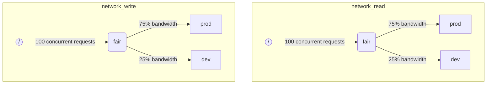

当 ClickHouse 同时执行多个查询时，它们可能会使用共享资源（例如磁盘）。可以应用调度约束和策略来调节资源在不同工作负载之间的使用和共享。对于每个资源，可以配置一个调度层次结构。层次结构的根代表资源，而叶子是队列，存放超过资源容量的请求。

:::note
目前只有远程磁盘 IO 可以使用所描述的方法进行调度。有关 CPU 调度，请参见线程池和 [`concurrent_threads_soft_limit_num`](server-configuration-parameters/settings.md#concurrent_threads_soft_limit_num) 的设置。有关灵活内存限制的信息，请参见 [Memory overcommit](settings/memory-overcommit.md)
:::

## 磁盘配置 {#disk-config}

要为特定磁盘启用 IO 调度，必须在存储配置中指定 `read_resource` 和/或 `write_resource`。这告诉 ClickHouse，对于给定磁盘的每个读写请求应使用哪个资源。读和写资源可以引用相同的资源名称，这对本地 SSD 或 HDD 非常有用。多个不同的磁盘也可以引用相同的资源，这对于远程磁盘非常有用：如果您希望在 "生产" 和 "开发" 工作负载之间公平分配网络带宽。

示例：
```xml
<clickhouse>
    <storage_configuration>
        ...
        <disks>
            <s3>
                <type>s3</type>
                <endpoint>https://clickhouse-public-datasets.s3.amazonaws.com/my-bucket/root-path/</endpoint>
                <access_key_id>your_access_key_id</access_key_id>
                <secret_access_key>your_secret_access_key</secret_access_key>
                <read_resource>network_read</read_resource>
                <write_resource>network_write</write_resource>
            </s3>
        </disks>
        <policies>
            <s3_main>
                <volumes>
                    <main>
                        <disk>s3</disk>
                    </main>
                </volumes>
            </s3_main>
        </policies>
    </storage_configuration>
</clickhouse>
```

另一种表达资源使用哪些磁盘的方法是 SQL 语法：

```sql
CREATE RESOURCE resource_name (WRITE DISK disk1, READ DISK disk2)
```

资源可以用于任何数量的磁盘进行 READ 或 WRITE，或者同时用于 READ 和 WRITE。有一种语法允许将资源用于所有磁盘：

```sql
CREATE RESOURCE all_io (READ ANY DISK, WRITE ANY DISK);
```

请注意，服务器配置选项优先于 SQL 方法定义资源。

## 工作负载标记 {#workload_markup}

可以使用设置 `workload` 来标记查询，以区分不同的工作负载。如果未设置 `workload`，则使用值 "default"。请注意，您可以使用设置配置文件指定其他值。如果需要用户的所有查询都使用固定的 `workload` 设置值，则可以使用设置约束使 `workload` 始终保持不变。

可以为后台活动分配 `workload` 设置。合并和变更分别使用 `merge_workload` 和 `mutation_workload` 服务器设置。这些值也可以通过特定表使用 `merge_workload` 和 `mutation_workload` 合并树设置进行覆盖。

让我们考虑一个具有两种不同工作负载的系统示例：“生产”和“开发”。

```sql
SELECT count() FROM my_table WHERE value = 42 SETTINGS workload = 'production'
SELECT count() FROM my_table WHERE value = 13 SETTINGS workload = 'development'
```

## 资源调度层次结构 {#hierarchy}

从调度子系统的角度来看，资源代表调度节点的层次结构。



**可能的节点类型：**
* `inflight_limit`（约束） - 如果同时处理的请求数超过 `max_requests` 或它们的总成本超过 `max_cost`，则阻塞；必须有一个子节点。
* `bandwidth_limit`（约束） - 如果当前带宽超过 `max_speed`（0 表示无限制）或突发超过 `max_burst`（默认等于 `max_speed`），则阻塞；必须有一个子节点。
* `fair`（策略） - 根据最大最小公平性从其子节点中选择下一个要服务的请求；子节点可以指定 `weight`（默认值为 1）。
* `priority`（策略） - 根据静态优先级从其子节点中选择下一个要服务的请求（值越低优先级越高）；子节点可以指定 `priority`（默认值为 0）。
* `fifo`（队列） - 层次结构的叶子，能够容纳超出资源容量的请求。

要能够充分利用底层资源的全部能力，您应该使用 `inflight_limit`。请注意，低 `max_requests` 或 `max_cost` 的值可能导致资源未得到充分利用，而过高的值可能导致调度器内部队列为空，从而导致子树中策略被忽略（不公平或忽略优先级）。另一方面，如果您希望保护资源不被过度利用，则应使用 `bandwidth_limit`。当在 `duration` 秒内消耗的资源量超过 `max_burst + max_speed * duration` 字节时，将进行限流。同一资源上的两个 `bandwidth_limit` 节点可用于在短时间内限制峰值带宽和在长时间内限制平均带宽。

以下示例展示了如何定义图中所示的 IO 调度层次结构：

```xml
<clickhouse>
    <resources>
        <network_read>
            <node path="/">
                <type>inflight_limit</type>
                <max_requests>100</max_requests>
            </node>
            <node path="/fair">
                <type>fair</type>
            </node>
            <node path="/fair/prod">
                <type>fifo</type>
                <weight>3</weight>
            </node>
            <node path="/fair/dev">
                <type>fifo</type>
            </node>
        </network_read>
        <network_write>
            <node path="/">
                <type>inflight_limit</type>
                <max_requests>100</max_requests>
            </node>
            <node path="/fair">
                <type>fair</type>
            </node>
            <node path="/fair/prod">
                <type>fifo</type>
                <weight>3</weight>
            </node>
            <node path="/fair/dev">
                <type>fifo</type>
            </node>
        </network_write>
    </resources>
</clickhouse>
```

## 工作负载分类器 {#workload_classifiers}

工作负载分类器用于定义查询指定的 `workload` 到应为特定资源使用的叶队列之间的映射。目前，工作负载分类很简单：仅提供静态映射。

示例：
```xml
<clickhouse>
    <workload_classifiers>
        <production>
            <network_read>/fair/prod</network_read>
            <network_write>/fair/prod</network_write>
        </production>
        <development>
            <network_read>/fair/dev</network_read>
            <network_write>/fair/dev</network_write>
        </development>
        <default>
            <network_read>/fair/dev</network_read>
            <network_write>/fair/dev</network_write>
        </default>
    </workload_classifiers>
</clickhouse>
```

## 工作负载层次结构（仅限 SQL） {#workloads}

在 XML 中定义资源和分类器可能具有挑战性。ClickHouse 提供了 SQL 语法，更加方便。所有通过 `CREATE RESOURCE` 创建的资源共享相同的层次结构，但在某些方面可能有所不同。使用 `CREATE WORKLOAD` 创建的每个工作负载在每个资源上维护几个自动创建的调度节点。可以在另一个父工作负载内部创建子工作负载。以下示例定义了与上面 XML 配置完全相同的层次结构：

```sql
CREATE RESOURCE network_write (WRITE DISK s3)
CREATE RESOURCE network_read (READ DISK s3)
CREATE WORKLOAD all SETTINGS max_requests = 100
CREATE WORKLOAD development IN all
CREATE WORKLOAD production IN all SETTINGS weight = 3
```

没有子节点的叶工作负载的名称可以在查询设置中使用 `SETTINGS workload = 'name'`。请注意，当使用 SQL 语法时，工作负载分类器也会自动创建。

要自定义工作负载，可以使用以下设置：
* `priority` - 兄弟工作负载根据静态优先级值服务（值越低，优先级越高）。
* `weight` - 具有相同静态优先级的兄弟工作负载根据权重共享资源。
* `max_requests` - 该工作负载中同时请求资源的最大数量限制。
* `max_cost` - 该工作负载中同时处理请求的总流量字节数的限制。
* `max_speed` - 该工作负载的字节处理速率限制（对于每个资源限制是独立的）。
* `max_burst` - 不受限流处理的工作负载最多可以处理的字节数（对于每个资源独立）。

请注意，工作负载设置会转换为适当的调度节点集。有关更多详细信息，请参阅调度节点 [类型和选项](#hierarchy) 的描述。

没有办法为不同资源指定不同的工作负载层次结构。但可以为特定资源指定不同的工作负载设置值：

```sql
CREATE OR REPLACE WORKLOAD all SETTINGS max_requests = 100, max_speed = 1000000 FOR network_read, max_speed = 2000000 FOR network_write
```

另外请注意，如果工作负载被另一个工作负载引用，则无法删除工作负载或资源。要更新工作负载的定义，请使用 `CREATE OR REPLACE WORKLOAD` 查询。

## 工作负载和资源存储 {#workload_entity_storage}
所有工作负载和资源的定义以 `CREATE WORKLOAD` 和 `CREATE RESOURCE` 查询的形式永久存储在 `workload_path` 的磁盘上或在 ZooKeeper 的 `workload_zookeeper_path` 中。建议使用 ZooKeeper 存储以实现节点之间的一致性。或者可以使用 `ON CLUSTER` 子句与磁盘存储一起使用。

## 严格资源访问 {#strict-resource-access}
为了强制所有查询遵循资源调度政策，有一个服务器设置 `throw_on_unknown_workload`。如果设置为 `true`，则每个查询都要求使用有效的 `workload` 查询设置，否则将抛出 `RESOURCE_ACCESS_DENIED` 异常。如果设置为 `false`，则该查询不使用资源调度器，即将无限制访问任何 `RESOURCE`。

:::note
除非执行了 `CREATE WORKLOAD default`，否则不要将 `throw_on_unknown_workload` 设置为 `true`。如果在启动期间执行了没有显式设置 `workload` 的查询，可能会导致服务器启动问题。
:::

## 另请参见 {#see-also}
 - [system.scheduler](/operations/system-tables/scheduler.md)
 - [system.workloads](/operations/system-tables/workloads.md)
 - [system.resources](/operations/system-tables/resources.md)
 - [merge_workload](/operations/settings/merge-tree-settings.md#merge_workload) 合并树设置
 - [merge_workload](/operations/server-configuration-parameters/settings.md#merge_workload) 全局服务器设置
 - [mutation_workload](/operations/settings/merge-tree-settings.md#mutation_workload) 合并树设置
 - [mutation_workload](/operations/server-configuration-parameters/settings.md#mutation_workload) 全局服务器设置
 - [workload_path](/operations/server-configuration-parameters/settings.md#workload_path) 全局服务器设置
 - [workload_zookeeper_path](/operations/server-configuration-parameters/settings.md#workload_zookeeper_path) 全局服务器设置
