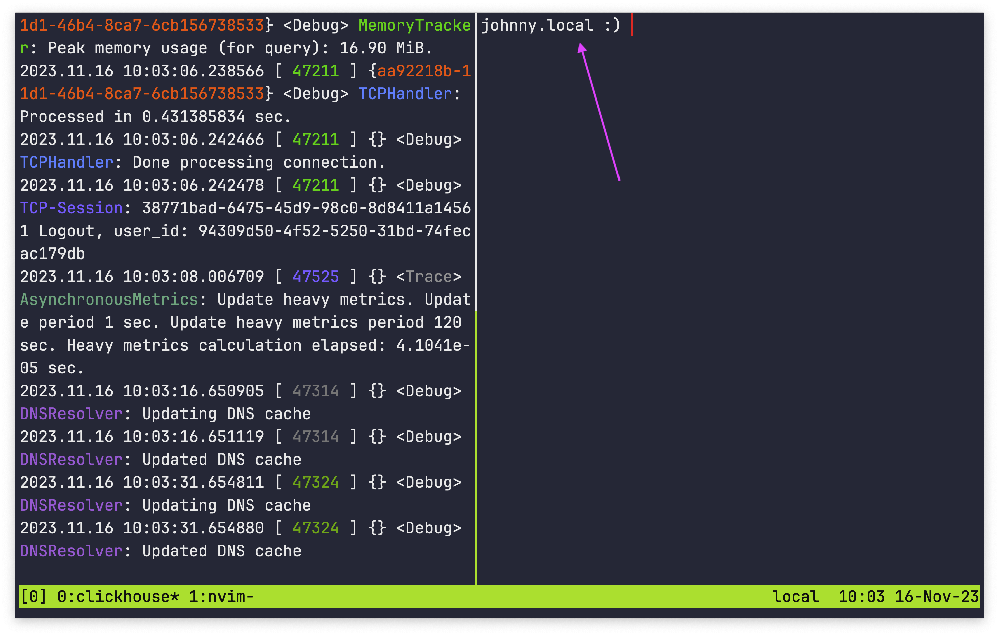
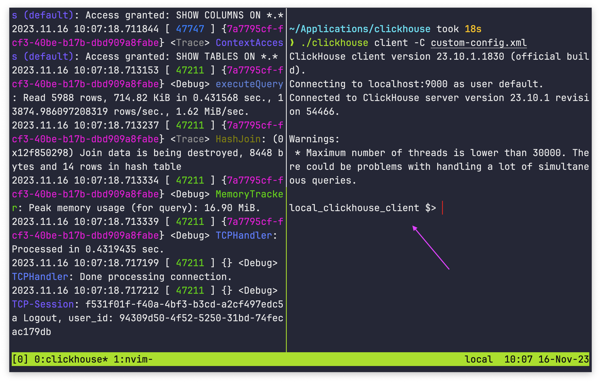

# Change the prompt in `clickhouse client`

It's possible to change how the prompt is displayed in the `clickhouse client` command window. The default prompt is your local computer name followed by `:) `:



However, you can edit the prompt to be whatever you want:



To edit the prompt, follow these steps:

1. Find where you `clickhouse` executable is stored, and create a file call `custom-config.xml` in the same directory:

    ```plaintext
    ./
    ├── clickhouse
    ├── custom-config.xml
    ...
    ├── user_scripts
    └── uuid
    ```

1. Inside `custom-config.xml` paste the following code:

    ```xml
    <?xml version="1.0" ?>
    <clickhouse>
            <prompt_by_server_display_name>
                <default>CUSTOM_PROMPT_HERE</default>
            </prompt_by_server_display_name>
    </clickhouse>
    ```

1. Replace `CUSTOM_PROMPT_HERE` with whatever you want your prompt to say. You must keep the prompt to a single line between the opening and closing `<default>` tags:

    ```shell
    <?xml version="1.0" ?>
    <clickhouse>
            <prompt_by_server_display_name>
                <default>local_clickhouse_client $> </default>
            </prompt_by_server_display_name>
    </clickhouse>
    ```

1. Save the `custom-config.xml` file.
1. Start the Clickhouse server if it isn't already running:

    ```shell
    ./clickhouse server
    ```

1. In a new terminal window, start the Clickhouse client with the `--config-file=custom-config.xml` argument:

    ```shell
    ./clickhouse client --config-file="custom-config.xml"
    ```

1. The Clickhouse client should open and display your custom prompt:
