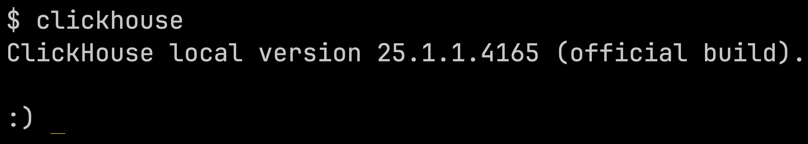
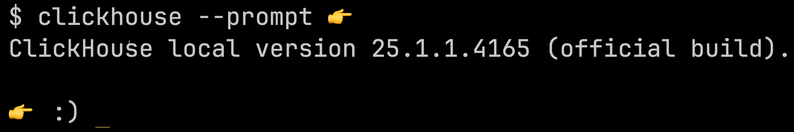
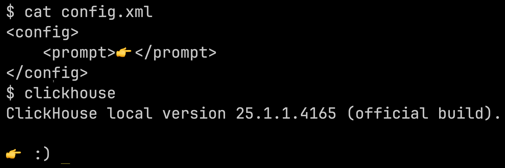
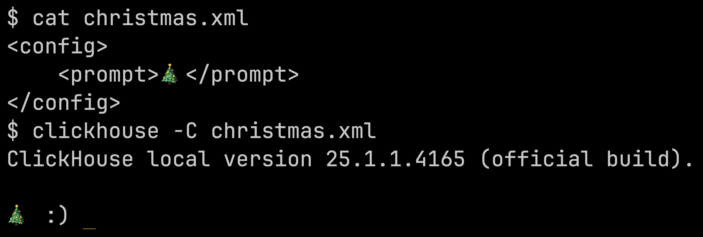
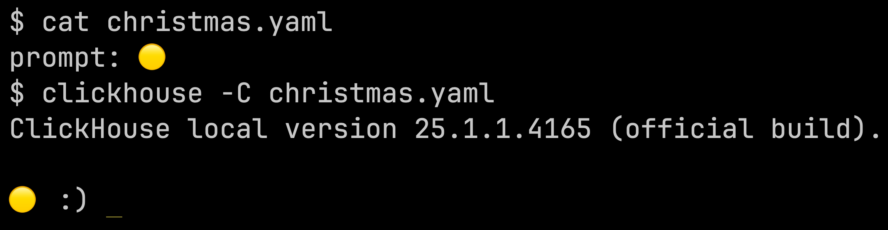

{frontMatter.description}


If you don't like how `clickhouse client` and clickhouse-local display the prompt in your terminal window, it is possible to change it to add a prefix.
This article explains how to change the prompt to whatever you want.

The default prompt is your local computer name followed by `:) `:

 

The following are variables that you can use in a prompt: `{user}`, `{host}`

There are several ways to update the prompt and we'll go through them each.


## --prompt flag

The first way to change the flag is using the `--prompt`:

```bash
clickhouse --prompt 👉
```

This will add the finger emoji before the smiley face:



## Config file - top level

Alternatively, you can provide a prompt prefix in a `config.xml` file:

```xml
<config>
    <prompt>👉 </prompt>
</config>
```

```
clickhouse
```




We can use a config file with any name we like and pass it in using the `-C` flag:

```xml
<config>
    <prompt>🎄 </prompt>
</config>
```


```
clickhouse -C christmas.xml
```



Prefer your config files to be in YAML?
That works too:

```yaml
prompt: 🟡
```


```bash
clickhouse -C christmas.yaml
```



## Config file - connections_credentials

Alternatively, you can specify a prompt per connection credentials.
This only makes sense when using clickhouse-client.

```xml
<config>
    <connections_credentials>
        <connection>
            <name>prod</name>
            <hostname>127.0.0.1</hostname>
            <port>9000</port>
            <secure>0</secure>
            <user>default</user>
            <prompt>\e[31m[PRODUCTION]\e[0m {user}@prod</prompt>
        </connection>
        <connection>
            <name>dev</name>
            <hostname>127.0.0.1</hostname>
            <port>9000</port>
            <secure>0</secure>
            <user>default</user>
            <prompt>\e[32m[DEVELOPMENT]\e[0m {user}@dev</prompt>
        </connection>
    </connections_credentials>
</config>
```

We can then try to connect with the `dev` connection:

```bash
clickhouse client -C connections.xml --connection dev
```


Or the `prod` one:

```bash
clickhouse client -C connections.xml --connection prod
```


And here's a YAML version:

```yaml
connections_credentials:
  connection:
    - name: prod
      hostname: 127.0.0.1
      port: 9000
      secure: 0
      user: default
      prompt: "\e[35m[PRODUCTION]\e[0m {user}@{host}"
    - name: dev
      hostname: 127.0.0.1
      port: 9000
      secure: 0
      user: default
      prompt: "\e[34m[DEVELOPMENT]\e[0m {user}@{host}"
```

With the `dev` connnection:

```bash
clickhouse client -C connections.yaml --connection dev
```


And now `prod`:

```bash
clickhouse client -C connections.yaml --connection prod
```

