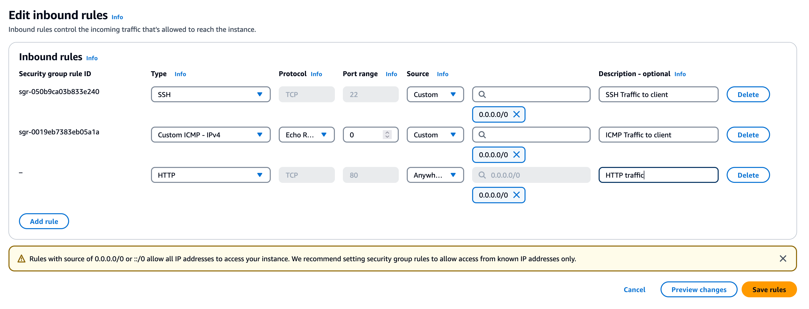

The following steps can be used to enable SSL for a single ClickHouse Server using [Let's Encrypt](https://letsencrypt.org/), a free, automated, and open Certificate Authority (CA) designed to make it easy for anyone to secure their websites with HTTPS. By automating the certificate issuance and renewal process, Let's Encrypt ensures websites remain secure without requiring manual intervention.

**We assume ClickHouse has been installed at the standard package locations in the following guide. We use the domain `product-test-server.clickhouse.com` for all examples. Substitute your domain accordingly.**


1. Verify you have a DNS `A` or `AAAA` record pointing to your server. This can be achieved using the Linux tool `dig.` For example, the response for `product-test-server.clickhouse.com` if using the Cloudflare DNS server `1.1.1.1`:

```bash
dig @1.1.1.1 product-test-server.clickhouse.com


```

Notice the section,

```bash


```

Confirming the presence of an A record.

2. Open port 80 on your server. This port will be used for automatic certificate renewal using the ACME protocol with certbot. For AWS, this can be achieved by [modifying the instance's associated Security Group](https://repost.aws/knowledge-center/connect-http-https-ec2).



3. Install [`certbot`](https://certbot.eff.org/instructions) e.g. using `apt`

```bash
sudo apt install certbot
```

4. Obtain an SSL certificate

```bash
sudo certbot certonly
```

:::note
If you don't have a web server running on your server, use (1) so Certbot can use a standalone temporary web server.
:::

Enter the full domain name of your server e.g. `product-test-server.clickhouse.com` when requested.

::note
Let's Encrypt has a policy of not issuing certificates for certain types of domains, such as public cloud provider-generated domains (e.g., AWS *.compute.amazonaws.com domains). These domains are considered shared infrastructure and are blocked for security and abuse prevention reasons.
:::

5. Copy certificates to the ClickHouse directory. 

```bash
echo '* * * * * root cp -u /etc/letsencrypt/live/product-test-server.clickhouse.com/*.pem /etc/clickhouse-server/ && chown clickhouse:clickhouse /etc/clickhouse-server/*.pem && chmod 400 /etc/clickhouse-server/*.pem' | sudo tee /etc/cron.d/copy-certificates
```

This command sets up a cron job to automate the management of Let's Encrypt SSL certificates for a ClickHouse server. It runs every minute as the root user, copying the .pem files from the Let's Encrypt directory to the ClickHouse server's configuration directory, but only if the files have been updated. After copying, the script adjusts the ownership of the files to the clickhouse user and group, ensuring the server has the required access. It also sets secure read-only permissions (`chmod 400`) on the copied files to maintain strict file security. This ensures that the ClickHouse server always has access to the latest SSL certificates without requiring manual intervention, maintaining security and minimizing operational overhead.

6. Configure the use of these certificates in clickhouse-server.

```bash
echo"
https_port: 8443
openSSL:
 server:
 certificateFile: '/etc/clickhouse-server/fullchain.pem'
 privateKeyFile: '/etc/clickhouse-server/privkey.pem'
 disableProtocols: 'sslv2,sslv3,tlsv1,tlsv1_1'
"| sudo tee /etc/clickhouse-server/config.d/ssl.yaml
```

7. Restart ClickHouse Server

```bash
sudo clickhouse restart
```

8. Validate ClickHouse can communicate over SSL

```bash
curl https://product-test-server.clickhouse.com:8443/


```