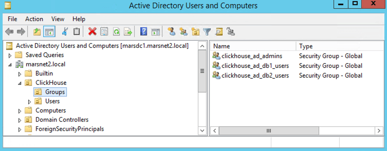
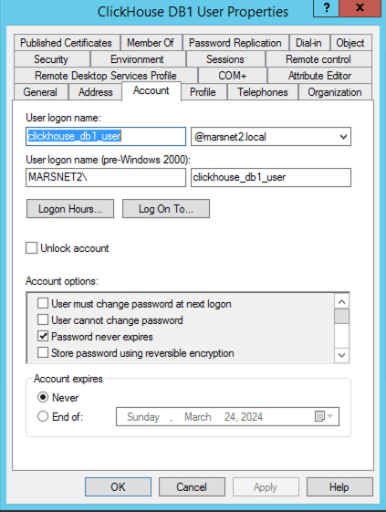
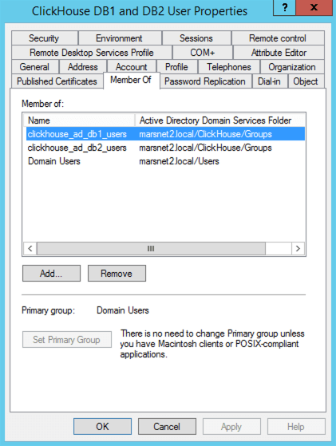

This example shows how AD users who belong to different AD security groups can be given role access in ClickHouse. Also shows how a user may be added to multiple AD user groups so they can have access provided by multiple roles.

In this environment, we have the following:

- A Windows Active Directory domain: `marsnet2.local`
- A ClickHouse Cluster, `cluster_1S_3R` with 3 nodes on a cluster configuration of 1 shard and 3 replicas.
- 3 AD users:

| AD User             | Description                                        |
| ------------------- | -------------------------------------------------- |
| clickhouse_ad_admin | ClickHouse Admin user                              |
| clickhouse_db1_user | User with access to db1.table1                     |
| clickhouse_db2_user | User with access to db2.table1                     |
| ch_db1_db2_user     | User with access to both db1.table1 and db2.table1 |

- 3 AD security groups:

| AD Group                | Description                            |
| ----------------------- | -------------------------------------- |
| clickhouse_ad_admins    | ClickHouse Admins group                |
| clickhouse_ad_db1_users | Group to map with access to db1.table1 |
| clickhouse_ad_db2_users | Group to map with access to db2.table1 |

- Example AD Environment and UO structure:

  

- Example AD Security Group Configuration:

  

- Example AD User Configuration:

  

- In Windows AD Users and Groups add each user to their respective group or groups:

  ```plaintext
  clickhouse_ad_admin-->clickhouse_ad_admins
  clickhouse_db1_user-->clickhouse_ad_db1_users
  clickhouse_db2_user-->clickhouse_ad_db2_users
  ch_db1_db2_user-->clickhouse_ad_db1_users and clickhouse_ad_db2_users
  ```

- Example user group membership:

  

- In ClickHouse `config.xml` add the `ldap_servers` configuration to each ClickHouse node:

```xml
<ldap_servers>
	<marsnet2_ad>
		<host>marsdc1.marsnet2.local</host>
		<port>389</port>
		<bind_dn>{user_name}@marsnet2.local</bind_dn>
		<user_dn_detection>
			<base_dn>OU=Users,OU=ClickHouse,DC=marsnet2,DC=local</base_dn>
			<search_filter>(&amp;(objectClass=user)(sAMAccountName={user_name}))</search_filter>
		</user_dn_detection>
		<enable_tls>no</enable_tls>
	</marsnet2_ad>
</ldap_servers>
```

| xml tag           | Description                                                                                                                 | Example Value                                     |
| ----------------- | --------------------------------------------------------------------------------------------------------------------------- | ------------------------------------------------- |
| ldap_servers      | Tag used to define the LDAP servers that will be used by ClickHouse                                                         | NA                                                |
| marsnet_ad        | This tag is arbitrary and is just a label to use to identify the server in the `<user_directories>` section                 | NA                                                |
| host              | FQDN or IP Address of Active Directory server or domain                                                                     | marsdc1.marsnet2.local                            |
| port              | Active Directory Port, usually 389 for non-ssl or 636 for SSL                                                               | 389                                               |
| bind_dn           | Defines which user will be used to create the bind to AD. This can be a dedicated user if regular users are not allowed to. | {user_name}@marsnet2.local                        |
| user_dn_detection | Settings on how ClickHouse will find the AD users                                                                           | NA                                                |
| base_dn           | AD OU path to start the search for the users                                                                                | OU=Users,OU=ClickHouse,DC=marsnet2,DC=local       |
| search_filter     | LDAP search filter to find the AD user                                                                                      | (&(objectClass=user)(sAMAccountName={user_name})) |

Refer to the [documentation for full set of options](/docs/en/operations/external-authenticators/ldap#ldap-server-definition)

- In ClickHouse `config.xml` add the `<user_directories>` configuration with `<ldap>` entries to each ClickHouse node.

```xml
<user_directories>
	<users_xml>
		<path>users.xml</path>
	</users_xml>
	<local_directory>
		<path>/var/lib/clickhouse/access/</path>
	</local_directory>
	<ldap>
		<server>marsnet2_ad</server>
		<role_mapping>
			<base_dn>OU=Groups,OU=ClickHouse,DC=marsnet2,DC=local</base_dn>
			<search_filter>(&amp;(objectClass=group)(member={user_dn}))</search_filter>
			<attribute>CN</attribute>
			<scope>subtree</scope>
			<prefix>clickhouse_</prefix>
		</role_mapping>
	</ldap>
</user_directories>
```

| xml tag          | Description                                                                                           | Example Value                                |
| ---------------- | ----------------------------------------------------------------------------------------------------- | -------------------------------------------- |
| user_directories | Defines which authenticators will be used                                                             | NA                                           |
| ldap             | This contains the settings for the LDAP servers in this AD that will be used                          | NA                                           |
| server           | This is the tag that was define in the <ldap_servers> section                                         | marsnet2_ad                                  |
| role_mapping     | Defines how the users authenticated will be mapped between AD groups and ClickHouse roles             | NA                                           |
| base_dn          | AD path that the system will use to start the search for AD groups                                    | OU=Groups,OU=ClickHouse,DC=marsnet2,DC=local |
| search_filter    | LDAP search filter to find the AD groups                                                              | (&(objectClass=group)(member={user_dn}))     |
| attribute        | Which AD attribute field should be used to identify the user                                          | CN                                           |
| scope            | Which levels in the base DN the system should search for the groups                                   | subtree                                      |
| prefix           | Prefix for the names of the groups in AD. This prefix will be removed to find the roles in ClickHouse | clickhouse\_                                 |

Refer to [documentation for the full set of options](https://clickhouse.com/docs/en/operations/external-authenticators/ldap#ldap-external-user-directory)

note:::
In this example, the AD security groups were prefixed. For example: `clickhouse_ad_db1_users`. When the system retrieves them, the prefix will be removed, and the system will look for a ClickHouse role called `ad_db1_users` to map to `clickhouse_ad_db1_users`.
:::

- Create example databases:

```sql
create database db1 on cluster 'cluster_1S_3R';
create database db2 on cluster 'cluster_1S_3R';
```

- Create example tables:

```sql
create table db1.table1 on cluster 'cluster_1S_3R'
(
  id Int32,
  column1 String
)
engine = MergeTree()
order by id;

create table db2.table1 on cluster 'cluster_1S_3R
(
  id Int32,
  column1 String
)
engine = MergeTree()
order by id;
```

- Insert sample data:

```sql
insert into db1.table1
values
(1, 'a');

insert into db2.table1
values
(2, 'b');
```

- Create ClickHouse Roles

```sql
create role ad_admins on cluster 'cluster_1S_3R';
create role ad_db1_users on cluster 'cluster_1S_3R';
create role ad_db2_users on cluster 'cluster_1S_3R';
```

- Grant the privileges to the roles:

```sql
GRANT SHOW, SELECT, INSERT, ALTER, CREATE, DROP, UNDROP TABLE, TRUNCATE, OPTIMIZE, BACKUP, KILL QUERY, KILL TRANSACTION, MOVE PARTITION BETWEEN SHARDS, ACCESS MANAGEMENT, SYSTEM, dictGet, displaySecretsInShowAndSelect, INTROSPECTION, SOURCES, CLUSTER ON *.* on cluster 'cluster_1S_3R' TO ad_admins WITH GRANT OPTION;
GRANT SELECT ON db1.table1 on cluster 'cluster_1S_3R' TO ad_db1_users;
GRANT SELECT ON db2.table1 on cluster 'cluster_1S_3R' TO ad_db2_users;
```

- Test access for restricted db1 user:

```shell
root@chnode1:/etc/clickhouse-server# clickhouse-client --user clickhouse_db1_user --password MyPassword123  --secure --port 9440 --host chnode1.marsnet.local
```

```response
ClickHouse client version 24.1.3.31 (official build).
Connecting to chnode1.marsnet.local:9440 as user clickhouse_db1_user.
Connected to ClickHouse server version 24.1.3.

clickhouse :) select * from db1.table1;

SELECT *
FROM db1.table1

Query id: b04b92d6-5b8b-40a2-a92a-f06f15774930

┌─id─┬─column1─┐
│  1 │ a       │
└────┴─────────┘

1 row in set. Elapsed: 0.004 sec.

clickhouse :) select * from db2.table1;

SELECT *
FROM db2.table1

Query id: 7f7eaa44-7b47-4184-807a-6968a56057ad

Elapsed: 0.115 sec.

Received exception from server (version 24.1.3):
Code: 497. DB::Exception: Received from chnode1.marsnet.local:9440. DB::Exception: clickhouse_db1_user: Not enough privileges. To execute this query, it's necessary to have the grant SELECT(id, column1) ON db2.table1. (ACCESS_DENIED)
```

- Test access for the user that has access to both databases, db1, and db2:

```shell
root@chnode1:/etc/clickhouse-server# clickhouse-client --user ch_db1_db2_user --password MyPassword123  --secure --port 9440 --host chnode1.marsnet.local
```

```response
ClickHouse client version 24.1.3.31 (official build).
Connecting to chnode1.marsnet.local:9440 as user ch_db1_db2_user.
Connected to ClickHouse server version 24.1.3.

clickhouse :) select * from db1.table1;

SELECT *
FROM db1.table1

Query id: 23084744-08c2-48bd-8635-a23438812026

┌─id─┬─column1─┐
│  1 │ a       │
└────┴─────────┘

1 row in set. Elapsed: 0.005 sec.

clickhouse :) select * from db2.table1;

SELECT *
FROM db2.table1

Query id: f9954ec4-d8d9-4b5a-9f68-a7aa79a1bb4a

┌─id─┬─column1─┐
│  2 │ b       │
└────┴─────────┘

1 row in set. Elapsed: 0.004 sec.
```

- Test access for the Admin user:

```shell
root@chnode1:/etc/clickhouse-server# clickhouse-client --user clickhouse_ad_admin --password MyPassword123  --secure --port 9440 --host chnode1.marsnet.local
```

```response
ClickHouse client version 24.1.3.31 (official build).
Connecting to chnode1.marsnet.local:9440 as user clickhouse_ad_admin.
Connected to ClickHouse server version 24.1.3.

clickhouse :) create table db1.table2 on cluster 'cluster_1S_3R'
(
  id Int32,
  column1 String
)
engine = MergeTree()
order by id;

CREATE TABLE db1.table2 ON CLUSTER cluster_1S_3R
(
    `id` Int32,
    `column1` String
)
ENGINE = MergeTree
ORDER BY id

Query id: 6041fd32-4294-44bd-b442-3fdd41333e6f

┌─host──────────────────┬─port─┬─status─┬─error─┬─num_hosts_remaining─┬─num_hosts_active─┐
│ chnode1.marsnet.local │ 9440 │      0 │       │                   2 │                2 │
└───────────────────────┴──────┴────────┴───────┴─────────────────────┴──────────────────┘
┌─host──────────────────┬─port─┬─status─┬─error─┬─num_hosts_remaining─┬─num_hosts_active─┐
│ chnode2.marsnet.local │ 9440 │      0 │       │                   1 │                1 │
└───────────────────────┴──────┴────────┴───────┴─────────────────────┴──────────────────┘
┌─host──────────────────┬─port─┬─status─┬─error─┬─num_hosts_remaining─┬─num_hosts_active─┐
│ chnode3.marsnet.local │ 9440 │      0 │       │                   0 │                0 │
└───────────────────────┴──────┴────────┴───────┴─────────────────────┴──────────────────┘
```
