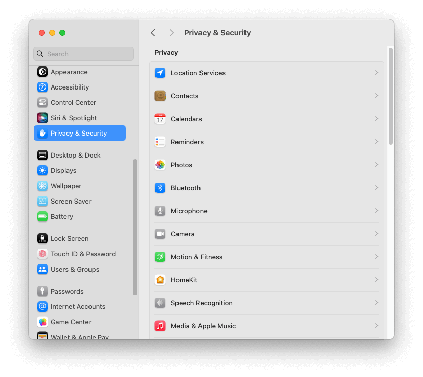
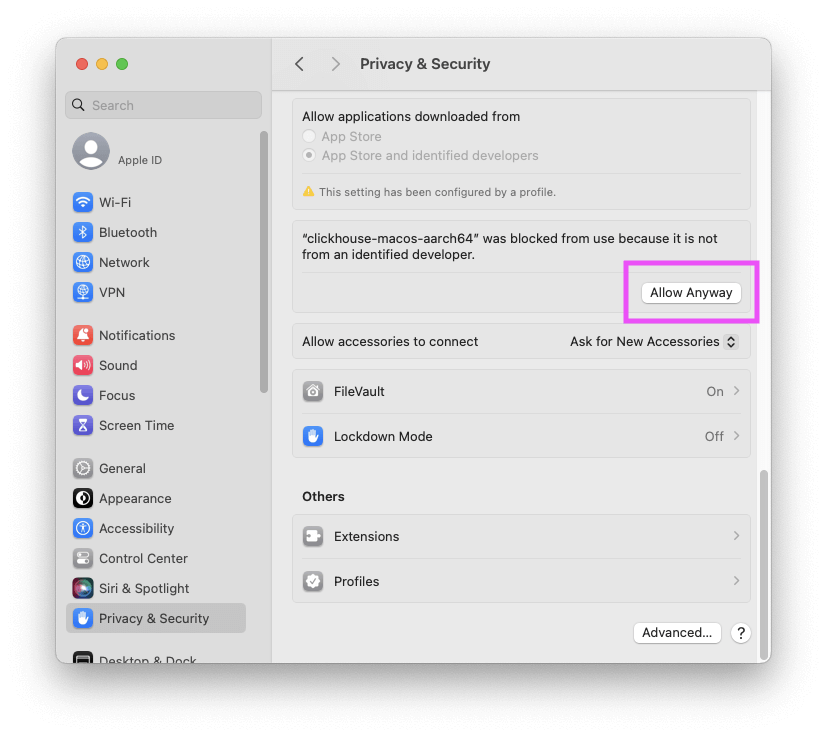

# Fix the developer verification error in MacOS

If you install ClickHouse using `brew`, you may encounter an error from MacOS. By default, MacOS will not run applications or tools created by a developer who cannot be verified. 

<!-- truncate -->

When attempting to run any `clickhouse` command, you may see this error:


To get around this verification error, you need to remove the app from MacOS' quarintine bin either by finding the appropriate setting in your [System Settings window](#system-settings-process), or [using the terminal](#terminal-process).

## System settings process

The easiest way to remove the `clickhouse` executable from the quarintine bin is to:

1. Open **System settings**.
1. Navigate to **Privacy & Security**:

    

1. Scroll to the bottom of the window to find a message saying _"clickhouse-macos-aarch64" was blocked from use because it is not from an identified developer".
1. Click **Allow Anyway**.

    

1. Enter your MacOS user password.

You should now be able to run `clickhouse` commands in your terminal.

## Terminal process

Sometimes pressing the `Allow Anyway` button doesn't doesn't fix this issue, in which case you can also perform this process using the command-line.
Or you might just prefer using the command line!

First find out where Homebrew installed the `clickhouse` executable:

```shell
which clickhouse
```

This should output something like:

```shell
/opt/homebrew/bin/clickhouse
```

Remove `clickhouse` from the quarantine bin by running `xattr -d com.apple.quarantine` following by the path from the previous command:

```shell
xattr -d com.apple.quarantine /opt/homebrew/bin/clickhouse
```

You should now be able to run the `clickhouse` executable:

```shell
clickhouse
```

This should output something like:

```
Use one of the following commands:
clickhouse local [args]
clickhouse client [args]
clickhouse benchmark [args]
...
```
