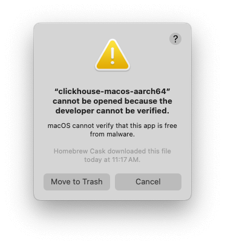

# Fix the developer verification error in MacOS

If you install ClickHouse using `brew`, you may encounter an error from MacOS. By default, MacOS will not run applications or tools created by a developer who cannot be verified. When attempting to run any `clickhouse` command, you may see this error:



To get around this verification error, you need to remove the app from MacOS' quarintine bin. First find out where Homebrew installed the `clickhouse` executable:

```shell
which clickhouse
```

This should output something like:

```shell
/opt/homebrew/bin/clickhouse
```

Remove `clickhouse` from the quarantine bin by running `xattr -d com.apple.quarantine` following by the path from the previous command:

```shell
xattr -d com.apple.quarantine /opt/homebrew/bin/clickhouse
```

You should now be able to run the `clickhouse` executable:

```shell
clickhouse
```

This should output something like:

```
Use one of the following commands:
clickhouse local [args]
clickhouse client [args]
clickhouse benchmark [args]
...
```
