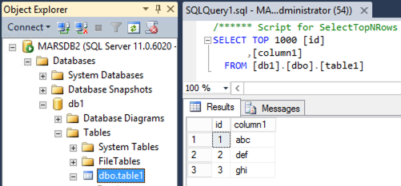
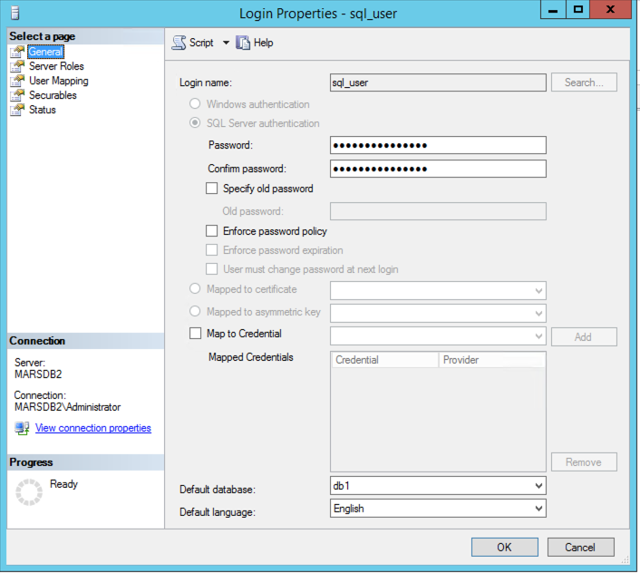
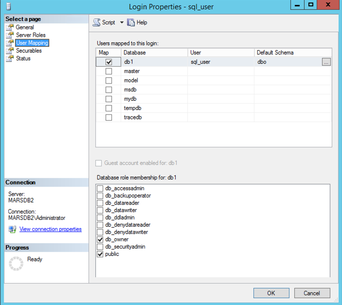
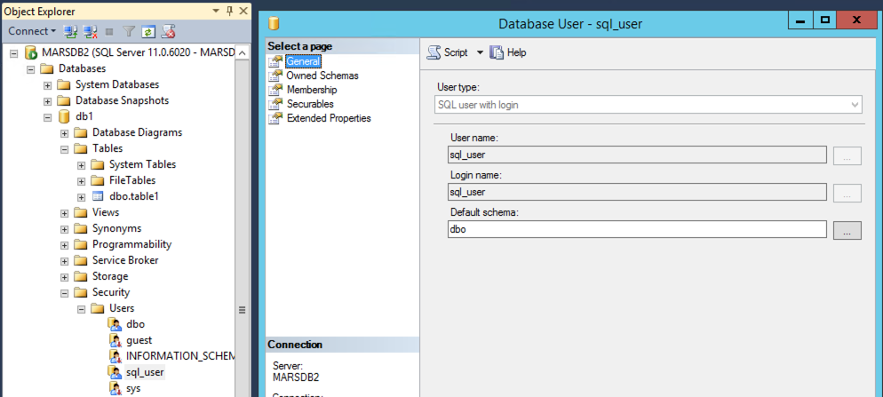

# How to set up ClickHouse on Docker with ODBC to connect to a Microsoft SQL Server (MSSQL) database.

### Question

How do I set up ClickHouse with Docker image to connect to Microsoft SQL Server?

### Answer

***Notes on this example***
- Uses the ClickHouse Docker Ubuntu image
- Uses the FreeTDS Driver
- Uses MSSQL Server 2012R2
- Windows hostname for this example is `MARSDB2.marsnet2.local` at IP: `192.168.1.133` (update with your hostname and/or IP)
- MSSQL Instance name `MARSDB2`
- MSSQL Login and datbase users are `sql_user`

### Example setup in MSSQL for testing ###

- Database and table created in MSSQL:  

  

- MSSQL Login User, `sql_user`:  

  

- Database membership roles for `sql_user`:

  

- Database User with Login:  

  


### Configuring ClickHouse with ODBC ###

- Create a working directory:
```
mkdir ch-odbc-mssql
cd ch-odbc-mssql
```

- Create an `odbc.ini` file:
```
vim odbc.ini
```

- Add the following entries:
*update the name of the DSN and IP

```
[marsdb2_mssql]
Driver = FreeTDS
Server = 192.168.1.133
```
- Create an `odbcinst.ini` file
```
vim odbcinst.ini
```

- add the following entries:
*trace is optional but helps with debugging.
```
[ODBC]
Trace = Yes
TraceFile = /tmp/odbc.log

[FreeTDS]
Description = FreeTDS
Driver = /usr/lib/aarch64-linux-gnu/odbc/libtdsodbc.so
Setup = /usr/lib/x86_64-linux-gnu/odbc/libtdsS.so
UsageCount = 1
```

### Configure a DockerFile to download the image and add the TDS and required ODBC libraries ###

- Create the dockerfile:
```
vim Dockerfile
```

add contents:
```
FROM clickhouse/clickhouse-server:23.10

# Install the ODBC driver

RUN apt-get update && apt-get install -y --no-install-recommends unixodbc \
    && apt-get install -y freetds-bin freetds-common freetds-dev libct4 libsybdb5 \
	&& apt-get install tdsodbc
```

- Build the new docker image:
```
docker build . -t marsnet/clickhouse-odbc:23.10
```

- Create a `docker-compose.yml` file:
```
vim docker-compose.yml
```

Add the following contents:
```
version: '3.7'
services:
  clickhouse:
    image: marsnet/clickhouse-odbc:23.10
    container_name: clickhouse-odbc
    hostname: clickhouse-host
    ports:
      - "9000:9000"
      - "8123:8123"
      - "9009:9009"
    volumes:
      - ./odbc.ini:/etc/odbc.ini
      - ./odbcinst.ini:/etc/odbcinst.ini
    restart: always
    ulimits:
      memlock:
        soft: -1
        hard: -1
      nofile:
        soft: 262144
        hard: 262144
    deploy:
      resources:
        limits:
          memory: 4g
```

- Start the container:
```
docker compose up --detach
```

- Should see something like:
```
ch-odbc-mssql % docker compose up --detach
[+] Running 1/1
 ✔ Container clickhouse-odbc  Started
```

- Check to ensure container is running

```
ch-odbc-mssql % docker ps
CONTAINER ID   IMAGE                           COMMAND            CREATED          STATUS              PORTS                                                                    NAMES
87a400b803ce   marsnet/clickhouse-odbc:23.10   "/entrypoint.sh"   57 minutes ago   Up About a minute   0.0.0.0:8123->8123/tcp, 0.0.0.0:9000->9000/tcp, 0.0.0.0:9009->9009/tcp   clickhouse-odbc
```

### Test ODBC connection ###

- Login with the ClickHouse client:

```
./clickhouse client
```

- Test the SELECT using the ODBC table function to the remote MSSQL Database table

```
clickhouse-host :) SELECT * from odbc('DSN=marsdb2_mssql;port=1433;Uid=sql_user;Pwd=ClickHouse123;Database=db1', 'table1');

SELECT *
FROM odbc('DSN=marsdb2_mssql;port=1433;Uid=sql_user;Pwd=ClickHouse123;Database=db1', 'table1')

Query id: 23494da2-6e12-4ade-95fa-372a0420cac1

┌─id─┬─column1─┐
│  1 │ abc     │
│  2 │ def     │
│  3 │ ghi     │
└────┴─────────┘

3 rows in set. Elapsed: 0.188 sec. 
```

- To create a remote table using the ODBC table engine:

```
CREATE TABLE table1_odbc_mssql
(
    `id` Int32,
    `column1` String
)
ENGINE = ODBC('DSN=marsdb2_mssql;port=1433;Uid=sql_user;Pwd=ClickHouse123;Database=db1', 'dbo', 'table1')
```

- Test using a select to the new remote table:

```
clickhouse-host :) select * from table1_odbc_mssql;

SELECT *
FROM table1_odbc_mssql

Query id: 94724368-485d-4364-ae58-a435a225c37d

┌─id─┬─column1─┐
│  1 │ abc     │
│  2 │ def     │
│  3 │ ghi     │
└────┴─────────┘

3 rows in set. Elapsed: 0.218 sec. 
```

For more information see:  
https://hub.docker.com/r/clickhouse/clickhouse-server/  
https://clickhouse.com/docs/en/engines/table-engines/integrations/odbc  
https://github.com/ClickHouse/clickhouse-odbc  