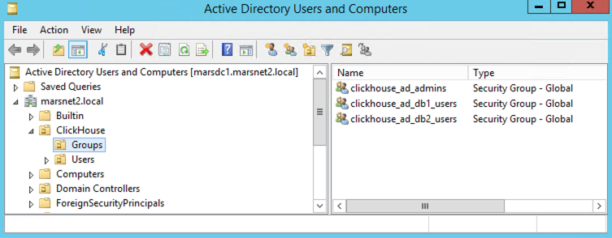
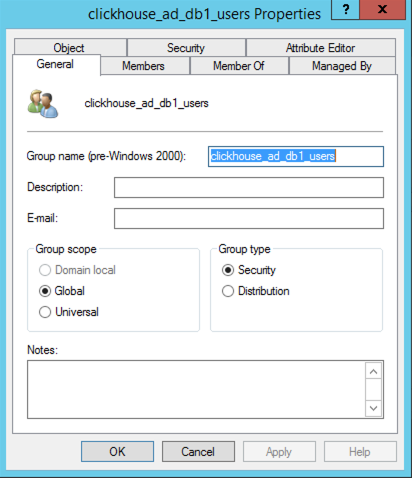
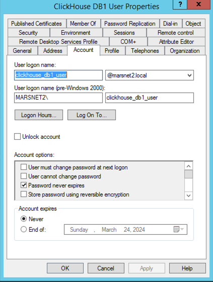

# Example of mapping Windows Active Directory security groups to ClickHouse roles

This example shows how AD users that belong to different AD security groups can be given role access in ClickHouse.  It also shows how a user may be added to multiple AD user groups so they can have access provided by multiple roles.

In this environment, we have the following:
- A Windows Active Directory domain: `marsnet2.local`
- A ClickHouse Cluster, `cluster_1S_3R` with 3 nodes on a cluster configuration of 1 shard, 3 replicas
- 3 AD users

|AD User|Description|
|----|-----------|
|clickhouse_ad_admin|ClickHouse Admin user|
|clickhouse_db1_user|User with access to db1.table1|
|clickhouse_db2_user|User with access to db2.table1|
|ch_db1_db2_user|User with access to both db1.table1 and db2.table1|


- 3 AD security groups

|AD Group|Description|
|----|-----------|
|clickhouse_ad_admins|ClickHouse Admins group|
|clickhouse_ad_db1_users|Group to map with access to db1.table1|
|clickhouse_ad_db2_users|Group to map with access to db2.table1|

- Example AD Environment and UO structure:



- Example AD Security Group Configuration:



- Example AD User Configuration:




1.  In Windows AD Users and Groups, add each user to their respective group(s), they will be mapped to the ClickHouse roles (example in the next step).

|AD Security Group|ClickHouse Role|
|------|-----|
|clickhouse_ad_admin|clickhouse_ad_admins|
|clickhouse_db1_user|clickhouse_ad_db1_users|
|clickhouse_db2_user|clickhouse_ad_db2_users|
|ch_db1_db2_user|clickhouse_ad_db1_users and clickhouse_ad_db2_users|

- Example user group membership:  


2.  In ClickHouse `config.xml`, add the `ldap_servers` configuration to each ClickHouse node.
```
<ldap_servers>
	<marsnet2_ad>
		<host>marsdc1.marsnet2.local</host>
		<port>389</port>
		<bind_dn>{user_name}@marsnet2.local</bind_dn>
		<user_dn_detection>
			<base_dn>OU=Users,OU=ClickHouse,DC=marsnet2,DC=local</base_dn>
			<search_filter>(&amp;(objectClass=user)(sAMAccountName={user_name}))</search_filter>
		</user_dn_detection>
		<enable_tls>no</enable_tls>
	</marsnet2_ad>
</ldap_servers>
```

|xml tag|Description|Example Value|
|----|-----------|-------|
| ldap_servers |Tag used to define the ldap servers that will be used by ClickHouse|NA|
| marsnet_ad |This tag is arbitrary and is just a label to use to identify the server in `<user_directories>` section|NA|
| host |FQDN or IP Address of Active Directory server or domain|marsdc1.marsnet2.local|
| port |Active Directory Port, usually 389 for non-ssl or 636 for SSL|389|
| bind_dn |Which user will be used to create the bind to AD, it can be a dedicated user if regular users are not allowed to| {user_name}@marsnet2.local|
| user_dn_detection |Settings on how ClickHouse will find the AD users|NA|
| base_dn |AD OU path to start the search for the users|OU=Users,OU=ClickHouse,DC=marsnet2,DC=local|
| search_filter |ldap search filter to find the AD user|(&amp;(objectClass=user)(sAMAccountName={user_name}))|

Refer to documentation for full set of options:
https://clickhouse.com/docs/en/operations/external-authenticators/ldap#ldap-server-definition

3.  In ClickHouse `config.xml`, add the `<user_directories>` configuration with `<ldap>` entries to each ClickHouse node.
```
<user_directories>
	<users_xml>
		<path>users.xml</path>
	</users_xml>
	<local_directory>
		<path>/var/lib/clickhouse/access/</path>
	</local_directory>
	<ldap>
		<server>marsnet2_ad</server>
		<role_mapping>
			<base_dn>OU=Groups,OU=ClickHouse,DC=marsnet2,DC=local</base_dn>
			<search_filter>(&amp;(objectClass=group)(member={user_dn}))</search_filter>
			<attribute>CN</attribute>
			<scope>subtree</scope>
			<prefix>clickhouse_</prefix>
		</role_mapping>
	</ldap>
</user_directories>
```
|xml tag|Description|Example Value|
|----|-----------|-------|
|user_directories|Defines which authenticators will be used|NA|
|ldap|This contains the settings for the ldap servers, in this AD that will be used|NA|
|server|This is the tag that was define in the <ldap_servers> section|marsnet2_ad|
|role_mapping|definition on how the users authenticated will be mapped between AD groups and ClickHouse roles|NA|
|base_dn|AD path that the system will use to start search for AD groups|OU=Groups,OU=ClickHouse,DC=marsnet2,DC=local|
|search_filter|ldap search filter to find the AD groups|(&amp;(objectClass=group)(member={user_dn}))|
|attribute|Which AD attribute field should be used to identify the user|CN|
|scope|Which levels in the base DN the system should search for the groups|subtree|
|prefix|Prefix for the names of the groups in AD, this prefix will be removed to find the roles in ClickHouse|clickhouse_|

Refer to documentation for full set of options:
https://clickhouse.com/docs/en/operations/external-authenticators/ldap#ldap-external-user-directory

**note:::**
Since the AD security groups were prefixed in the example - i.e. `clickhouse_ad_db1_users`- when the system retrieves them, the prefix will be removed and the system will look for a ClickHouse role called `ad_db1_users` to map to `clickhouse_ad_db1_users`.
**:::**

4.  Create example databases.
```
create database db1 on cluster 'cluster_1S_3R';
create database db2 on cluster 'cluster_1S_3R';
```

5.  Create example tables.
```
create table db1.table1 on cluster 'cluster_1S_3R'
(
  id Int32,
  column1 String
)
engine = MergeTree()
order by id;

create table db2.table1 on cluster 'cluster_1S_3R
(
  id Int32,
  column1 String
)
engine = MergeTree()
order by id;
```

6.  Insert sample data.
```
insert into db1.table1
values
(1, 'a');

insert into db2.table1
values
(2, 'b');
```

7.  Create ClickHouse Roles.
```
create role ad_admins on cluster 'cluster_1S_3R';
create role ad_db1_users on cluster 'cluster_1S_3R';
create role ad_db2_users on cluster 'cluster_1S_3R';
```

8.  Grant the privileges to the roles.
```
GRANT SHOW, SELECT, INSERT, ALTER, CREATE, DROP, UNDROP TABLE, TRUNCATE, OPTIMIZE, BACKUP, KILL QUERY, KILL TRANSACTION, MOVE PARTITION BETWEEN SHARDS, ACCESS MANAGEMENT, SYSTEM, dictGet, displaySecretsInShowAndSelect, INTROSPECTION, SOURCES, CLUSTER ON *.* on cluster 'cluster_1S_3R' TO ad_admins WITH GRANT OPTION;

GRANT SELECT ON db1.table1 on cluster 'cluster_1S_3R' TO ad_db1_users;

GRANT SELECT ON db2.table1 on cluster 'cluster_1S_3R' TO ad_db2_users;
```

9.  Test access for restricted db1 user.
For example:
```
root@chnode1:/etc/clickhouse-server# clickhouse-client --user clickhouse_db1_user --password MyPassword123  --secure --port 9440 --host chnode1.marsnet.local
ClickHouse client version 24.1.3.31 (official build).
Connecting to chnode1.marsnet.local:9440 as user clickhouse_db1_user.
Connected to ClickHouse server version 24.1.3.


clickhouse :) select * from db1.table1;

SELECT *
FROM db1.table1

Query id: b04b92d6-5b8b-40a2-a92a-f06f15774930

┌─id─┬─column1─┐
│  1 │ a       │
└────┴─────────┘

1 row in set. Elapsed: 0.004 sec.

clickhouse :) select * from db2.table1;

SELECT *
FROM db2.table1

Query id: 7f7eaa44-7b47-4184-807a-6968a56057ad


Elapsed: 0.115 sec.

Received exception from server (version 24.1.3):
Code: 497. DB::Exception: Received from chnode1.marsnet.local:9440. DB::Exception: clickhouse_db1_user: Not enough privileges. To execute this query, it's necessary to have the grant SELECT(id, column1) ON db2.table1. (ACCESS_DENIED)
```

10.  Test access for the user that has access to both databases, db1 and db2.
For example:
```
root@chnode1:/etc/clickhouse-server# clickhouse-client --user ch_db1_db2_user --password MyPassword123  --secure --port 9440 --host chnode1.marsnet.local
ClickHouse client version 24.1.3.31 (official build).
Connecting to chnode1.marsnet.local:9440 as user ch_db1_db2_user.
Connected to ClickHouse server version 24.1.3.

clickhouse :) select * from db1.table1;

SELECT *
FROM db1.table1

Query id: 23084744-08c2-48bd-8635-a23438812026

┌─id─┬─column1─┐
│  1 │ a       │
└────┴─────────┘

1 row in set. Elapsed: 0.005 sec.

clickhouse :) select * from db2.table1;

SELECT *
FROM db2.table1

Query id: f9954ec4-d8d9-4b5a-9f68-a7aa79a1bb4a

┌─id─┬─column1─┐
│  2 │ b       │
└────┴─────────┘

1 row in set. Elapsed: 0.004 sec.
```

11.  Test access for the Admin user.
For example:
```
root@chnode1:/etc/clickhouse-server# clickhouse-client --user clickhouse_ad_admin --password MyPassword123  --secure --port 9440 --host chnode1.marsnet.local
ClickHouse client version 24.1.3.31 (official build).
Connecting to chnode1.marsnet.local:9440 as user clickhouse_ad_admin.
Connected to ClickHouse server version 24.1.3.

clickhouse :) create table db1.table2 on cluster 'cluster_1S_3R'
(
  id Int32,
  column1 String
)
engine = MergeTree()
order by id;

CREATE TABLE db1.table2 ON CLUSTER cluster_1S_3R
(
    `id` Int32,
    `column1` String
)
ENGINE = MergeTree
ORDER BY id

Query id: 6041fd32-4294-44bd-b442-3fdd41333e6f

┌─host──────────────────┬─port─┬─status─┬─error─┬─num_hosts_remaining─┬─num_hosts_active─┐
│ chnode1.marsnet.local │ 9440 │      0 │       │                   2 │                2 │
└───────────────────────┴──────┴────────┴───────┴─────────────────────┴──────────────────┘
┌─host──────────────────┬─port─┬─status─┬─error─┬─num_hosts_remaining─┬─num_hosts_active─┐
│ chnode2.marsnet.local │ 9440 │      0 │       │                   1 │                1 │
└───────────────────────┴──────┴────────┴───────┴─────────────────────┴──────────────────┘
┌─host──────────────────┬─port─┬─status─┬─error─┬─num_hosts_remaining─┬─num_hosts_active─┐
│ chnode3.marsnet.local │ 9440 │      0 │       │                   0 │                0 │
└───────────────────────┴──────┴────────┴───────┴─────────────────────┴──────────────────┘
```
